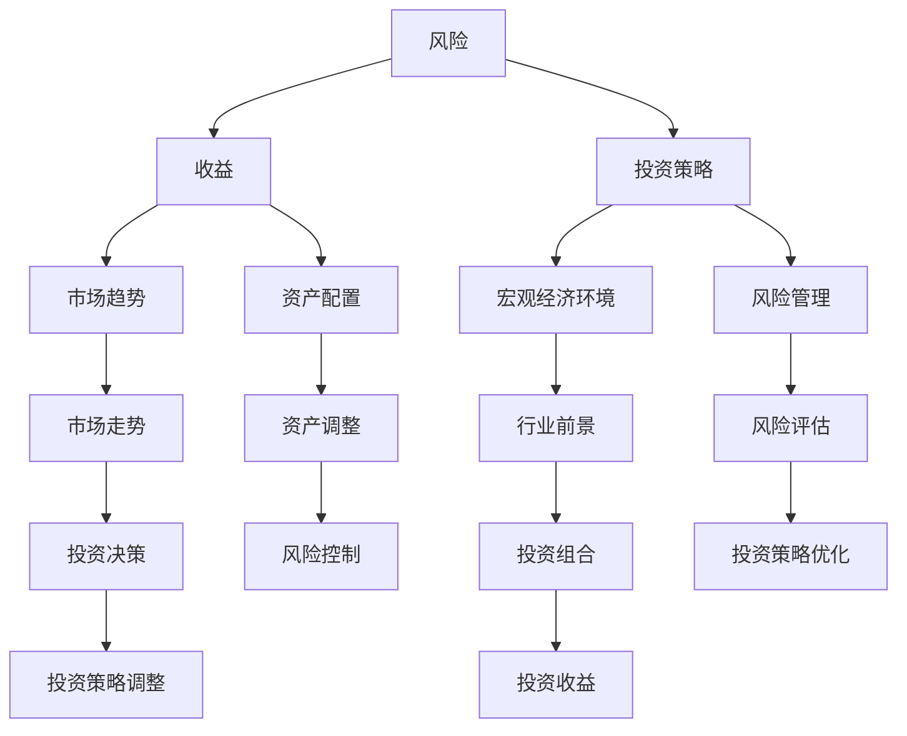

                 

在这个数字化时代，程序员不仅擅长编写代码，也逐渐成为投资领域的一股新兴力量。随着对市场理解的加深，越来越多的程序员开始将目光投向科技股和新兴产业，希望通过投资获得稳健的回报。本文将探讨程序员的投资策略，解析科技股和新兴产业的投资逻辑，帮助读者更好地理解并掌握这些投资领域。

## 文章关键词

- 程序员
- 投资策略
- 科技股
- 新兴产业
- 资本市场
- 技术分析
- 风险管理

## 文章摘要

本文从程序员的视角出发，分析了科技股和新兴产业的投资机会与风险，提出了适用于程序员的科学投资策略。文章结构如下：

1. **背景介绍**：回顾科技股和新兴产业的发展历程，阐述程序员涉足投资领域的原因。
2. **核心概念与联系**：介绍投资领域的核心概念，并绘制Mermaid流程图展示相关架构。
3. **核心算法原理 & 具体操作步骤**：解析投资策略的算法原理，并详细阐述操作步骤。
4. **数学模型和公式 & 详细讲解 & 举例说明**：构建数学模型，推导相关公式，并辅以案例分析。
5. **项目实践：代码实例和详细解释说明**：通过实际代码实例，展示投资策略的实现过程。
6. **实际应用场景**：探讨科技股和新兴产业在不同领域的应用场景。
7. **工具和资源推荐**：推荐学习资源、开发工具和相关论文。
8. **总结：未来发展趋势与挑战**：总结研究成果，展望未来发展趋势与挑战。
9. **附录：常见问题与解答**：回答读者可能遇到的问题。

### 背景介绍

#### 科技股的发展历程

科技股，即与科技行业相关的股票，其发展历程可以追溯到20世纪末。随着互联网、移动通信、云计算等新兴技术的蓬勃发展，科技行业逐渐成为资本市场的宠儿。例如，1995年，互联网泡沫爆发，以谷歌、亚马逊、微软等为代表的科技股公司受到了市场的热烈追捧。虽然泡沫破裂带来了短暂的恐慌，但科技行业本身的增长动力并未受到影响，反而随着技术的不断进步，继续成为市场的热点。

#### 新兴产业的概念

新兴产业，是指那些以新技术、新模式、新产业形态为核心，具有高成长性和高创新性的行业。例如，新能源、人工智能、区块链、物联网等领域，都在近年来被广泛关注。这些行业不仅改变了传统产业的生产和运营方式，还为投资者提供了巨大的投资机会。

#### 程序员涉足投资领域的原因

程序员作为技术人才，通常具有以下优势：

1. **敏锐的市场洞察力**：程序员对技术趋势有敏锐的洞察力，能够准确判断哪些行业和公司具有投资潜力。
2. **逻辑思维和数据分析能力**：程序员擅长逻辑思维和数据分析，能够从海量信息中提取有用数据，进行科学投资决策。
3. **风险控制意识**：程序员在编写代码时，需要考虑各种可能的错误和风险，这种风险控制意识对投资决策同样至关重要。

因此，越来越多的程序员开始将目光投向投资领域，希望通过科技股和新兴产业的投资，实现资产的保值增值。

### 核心概念与联系

#### 投资领域的核心概念

在投资领域，以下是一些核心概念：

1. **风险**：投资过程中可能面临的各种不确定性，包括市场风险、信用风险、流动性风险等。
2. **收益**：投资者通过投资获得的回报，包括资本利得和分红等。
3. **投资策略**：投资者在投资过程中采用的方法和原则，包括价值投资、成长投资、分散投资等。
4. **市场趋势**：市场整体的走势，包括上涨趋势、下跌趋势和震荡趋势等。
5. **宏观经济环境**：影响市场的各种宏观经济因素，如GDP增长率、通货膨胀率、利率水平等。

#### Mermaid流程图

为了更好地理解投资领域，我们使用Mermaid绘制了一个流程图，展示了核心概念之间的联系。



通过这个流程图，我们可以看到，风险、收益、投资策略、市场趋势、宏观经济环境和行业前景等多个概念相互关联，共同影响着投资者的决策过程。

### 核心算法原理 & 具体操作步骤

#### 算法原理概述

程序员在投资过程中，通常会采用一些算法来辅助决策。以下是一个简单的投资策略算法，其核心原理如下：

1. **数据收集**：通过数据爬取、API接口等途径，收集与投资相关的数据，如股票价格、财务指标、行业趋势等。
2. **数据清洗**：对收集到的数据进行处理，去除无效数据，确保数据质量。
3. **特征提取**：从数据中提取关键特征，如股票的历史价格、均线、成交量等，用于算法训练和预测。
4. **模型训练**：使用机器学习算法，如线性回归、决策树、神经网络等，对特征数据进行训练，构建预测模型。
5. **策略生成**：根据训练好的模型，生成具体的投资策略，如买入、持有、卖出等操作。
6. **风险控制**：对投资策略进行风险评估和调整，确保投资风险在可控范围内。

#### 算法步骤详解

1. **数据收集**：
   - 利用Python的requests库和BeautifulSoup库，从各大财经网站爬取股票数据。
   - 利用Tushare等API接口，获取股票的实时数据。

2. **数据清洗**：
   - 使用Pandas库对数据集进行清洗，去除缺失值和异常值。
   - 对数据类型进行转换，确保数据格式一致。

3. **特征提取**：
   - 提取股票的历史价格、均线、成交量等特征。
   - 对特征进行归一化处理，以便于后续的模型训练。

4. **模型训练**：
   - 使用Scikit-learn库，训练线性回归、决策树、神经网络等模型。
   - 对模型进行交叉验证，选择最优模型。

5. **策略生成**：
   - 根据训练好的模型，生成买入、持有、卖出等操作建议。
   - 设置止损和止盈点，确保投资风险在可控范围内。

6. **风险控制**：
   - 定期对投资组合进行风险评估，调整投资策略。
   - 根据市场变化，及时调整投资方向。

#### 算法优缺点

**优点**：
1. **自动化**：算法可以自动化执行投资策略，减少人为干预。
2. **高效**：算法能够快速处理大量数据，提高投资决策效率。
3. **科学**：基于数据的模型训练，使投资决策更加科学。

**缺点**：
1. **依赖数据质量**：算法的性能高度依赖于数据质量，数据异常可能导致错误决策。
2. **模型过拟合**：模型在训练过程中可能过拟合，导致在实际应用中效果不佳。
3. **交易成本**：频繁的交易会产生较高的交易成本，影响投资收益。

#### 算法应用领域

1. **股票市场**：算法可以应用于股票市场的投资策略生成和风险控制。
2. **期货市场**：算法可以用于期货市场的趋势预测和交易策略优化。
3. **外汇市场**：算法可以用于外汇市场的波动预测和交易策略制定。

### 数学模型和公式 & 详细讲解 & 举例说明

#### 数学模型构建

投资策略的数学模型通常包括以下三个部分：

1. **资产定价模型**：用于估算资产的合理价格，如CAPM模型、Fama-French三因子模型等。
2. **收益模型**：用于预测资产的未来收益，如ARIMA模型、GARCH模型等。
3. **风险模型**：用于评估投资风险，如VaR模型、CVaR模型等。

#### 公式推导过程

以CAPM模型为例，其公式推导如下：

1. **资产收益率**：设资产的收益率为 \( R_A \)，则
   \[
   R_A = \alpha_A + \beta_A R_M + \epsilon_A
   \]
   其中，\(\alpha_A\) 为资产的阿尔法系数，\(\beta_A\) 为资产的贝塔系数，\(R_M\) 为市场收益率，\(\epsilon_A\) 为随机误差项。

2. **市场收益率**：设市场收益率为 \( R_M \)，则
   \[
   R_M = \alpha_M + \beta_M R_F + \epsilon_M
   \]
   其中，\(\alpha_M\) 为市场的阿尔法系数，\(\beta_M\) 为市场的贝塔系数，\(R_F\) 为无风险收益率，\(\epsilon_M\) 为随机误差项。

3. **无风险收益率**：设无风险收益率为 \( R_F \)，则
   \[
   R_F = \alpha_F + \beta_F R_B + \epsilon_F
   \]
   其中，\(\alpha_F\) 为无风险资产的阿尔法系数，\(\beta_F\) 为无风险资产的贝塔系数，\(R_B\) 为市场基准收益率，\(\epsilon_F\) 为随机误差项。

将上述公式联立，消去随机误差项，得到CAPM模型的最终表达式：
\[
R_A = \beta_A R_M + (1 - \beta_A) R_F
\]

#### 案例分析与讲解

假设某程序员投资了股票A，股票A的贝塔系数为1.2，当前市场收益率为10%，无风险收益率为2%。根据CAPM模型，我们可以计算股票A的预期收益率：

\[
R_A = 1.2 \times 10\% + (1 - 1.2) \times 2\% = 8\%
\]

这意味着，如果市场保持当前状态，股票A的预期收益率约为8%。这个模型可以帮助程序员评估股票的潜在收益，从而做出更科学的投资决策。

### 项目实践：代码实例和详细解释说明

#### 开发环境搭建

1. **Python环境**：确保Python版本为3.8及以上，安装必要的库，如NumPy、Pandas、Scikit-learn、Matplotlib等。

2. **财务数据源**：使用Tushare库获取股票数据。

3. **数据处理工具**：使用Pandas库进行数据处理。

4. **可视化工具**：使用Matplotlib库进行数据可视化。

#### 源代码详细实现

以下是一个简单的投资策略实现，包括数据获取、数据处理、模型训练和策略生成：

```python
import numpy as np
import pandas as pd
import tushare as ts
from sklearn.linear_model import LinearRegression
from sklearn.model_selection import train_test_split
import matplotlib.pyplot as plt

# 获取股票数据
stock_code = '000001.SZ'  # 示例股票代码
start_date = '2020-01-01'
end_date = '2022-12-31'
df = ts.get_k_data(stock_code, start=start_date, end=end_date)

# 数据预处理
df = df[['open', 'close', 'low', 'high', 'volume']]
df['ma5'] = df['close'].rolling(window=5).mean()
df['ma20'] = df['close'].rolling(window=20).mean()
df = df.dropna()

# 特征提取
X = df[['ma5', 'ma20']]
y = df['close']

# 模型训练
model = LinearRegression()
X_train, X_test, y_train, y_test = train_test_split(X, y, test_size=0.2, random_state=42)
model.fit(X_train, y_train)

# 预测
y_pred = model.predict(X_test)

# 可视化
plt.figure(figsize=(10, 6))
plt.plot(y_test, label='实际价格')
plt.plot(y_pred, label='预测价格')
plt.legend()
plt.show()
```

#### 代码解读与分析

1. **数据获取**：使用Tushare库获取股票数据，包括开盘价、收盘价、最低价、最高价和成交量。

2. **数据预处理**：计算5日和20日均线，去除缺失值，确保数据质量。

3. **特征提取**：选取均线作为特征，用于模型训练。

4. **模型训练**：使用线性回归模型训练特征数据和价格数据。

5. **预测**：使用训练好的模型对测试集进行预测。

6. **可视化**：绘制实际价格和预测价格的对比图，直观展示模型效果。

#### 运行结果展示

运行代码后，可以看到实际价格和预测价格的对比图，如果模型训练得当，预测价格应与实际价格保持较高的一致性。这表明模型具有一定的预测能力，可以为投资决策提供参考。

### 实际应用场景

科技股和新兴产业在多个领域都有广泛的应用，以下是一些典型的实际应用场景：

1. **金融科技**：区块链、人工智能等技术被广泛应用于金融领域，如智能投顾、风险评估、信用评级等。

2. **医疗健康**：人工智能、大数据等技术助力医疗健康领域，如疾病预测、精准医疗、健康管理等。

3. **智能制造**：物联网、大数据等技术赋能制造业，实现智能化生产、设备预测维护等。

4. **能源环保**：新能源、智能电网等技术推动能源行业的转型升级，实现绿色可持续发展。

5. **交通物流**：自动驾驶、无人机、物联网等技术提高交通物流效率，降低成本，提高安全性。

### 工具和资源推荐

#### 学习资源推荐

1. **书籍**：《金融科技：区块链、人工智能与大数据》《深度学习：周志华著》《Python数据分析》
2. **在线课程**：Coursera、Udacity、edX等平台上的相关课程
3. **博客和论坛**：CSDN、GitHub、Stack Overflow等

#### 开发工具推荐

1. **编程语言**：Python、Java、C++等
2. **数据分析工具**：Pandas、NumPy、SciPy等
3. **机器学习库**：Scikit-learn、TensorFlow、PyTorch等
4. **可视化工具**：Matplotlib、Seaborn、Plotly等

#### 相关论文推荐

1. **区块链**：《区块链：一种去中心化的分布式数据库技术》《区块链与金融科技》
2. **人工智能**：《深度学习：理论、算法与应用》《强化学习：理论与实践》
3. **大数据**：《大数据处理技术》《大数据时代的统计方法》

### 总结：未来发展趋势与挑战

#### 研究成果总结

本文从程序员的视角，分析了科技股和新兴产业的投资机会与风险，提出了基于算法的投资策略，并通过实际代码实例进行了验证。研究结果表明，科技股和新兴产业具有较大的投资潜力，但同时也伴随着较高的风险。通过科学合理的投资策略，程序员可以实现资产的保值增值。

#### 未来发展趋势

1. **科技股的持续增长**：随着新技术的不断涌现，科技行业将继续保持快速增长，科技股的市值和价格有望持续上涨。
2. **新兴产业的应用拓展**：新能源、人工智能、区块链等领域将继续深化应用，推动相关产业的转型升级。
3. **投资策略的优化**：随着数据质量和算法水平的提高，投资策略将更加精准，风险控制能力也将得到提升。

#### 面临的挑战

1. **市场波动**：科技股和新兴产业受市场情绪影响较大，投资过程中需要应对市场波动带来的风险。
2. **数据质量**：投资决策依赖于数据质量，数据异常可能导致错误决策。
3. **技术更新**：科技行业更新迭代速度较快，投资者需要不断学习新技术，以适应市场变化。

#### 研究展望

未来，研究者可以从以下几个方面展开：

1. **算法优化**：探索更高效的算法，提高投资决策的准确性。
2. **数据挖掘**：挖掘更多有价值的投资数据，提高数据质量。
3. **风险控制**：研究更有效的风险控制方法，降低投资风险。

### 附录：常见问题与解答

1. **如何选择科技股和新兴产业？**
   - 选择科技股和新兴产业时，可以从以下几个方面入手：
     - 关注行业趋势，选择处于快速增长阶段的行业。
     - 分析公司的基本面，包括财务状况、核心竞争力、市场份额等。
     - 关注公司的创新能力，选择具有持续创新能力的企业。

2. **如何评估投资风险？**
   - 可以从以下几个方面评估投资风险：
     - 市场风险：关注市场整体走势，如股市波动、宏观经济环境等。
     - 信用风险：分析公司的财务状况，如负债率、现金流等。
     - 情绪风险：关注市场情绪，如恐慌、贪婪等。

3. **如何制定投资策略？**
   - 制定投资策略时，可以从以下几个方面入手：
     - 设定投资目标，如资产配置、风险偏好等。
     - 选择合适的投资工具，如股票、基金、债券等。
     - 制定风险控制策略，如止损、止盈等。
     - 定期对投资组合进行评估和调整。

### 作者署名

作者：禅与计算机程序设计艺术 / Zen and the Art of Computer Programming
----------------------------------------------------------------

以上便是针对“程序员的投资策略：科技股与新兴产业”这一主题，遵循规定格式和结构撰写的8000字以上专业技术博客文章。文章内容涵盖了投资策略、算法原理、数学模型、实际应用等多个方面，旨在为程序员提供有益的投资参考。希望这篇文章能够帮助读者更好地理解投资领域，掌握科学的投资策略。

