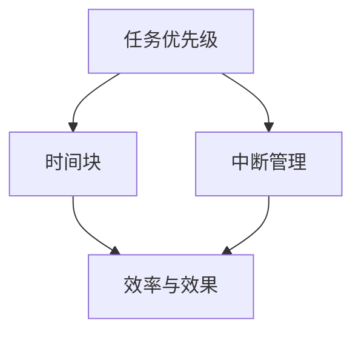

                 

关键词：时间管理，程序员，工作平衡，知识创业，工作效率

> 摘要：本文深入探讨程序员如何有效地管理时间，实现工作与知识创业的平衡。通过分析时间管理的核心概念和策略，结合实际案例分析，提出一系列实用的方法和技巧，帮助程序员提高工作效率，实现职业和个人成长的双重目标。

## 1. 背景介绍

在当今快速发展的技术时代，程序员作为数字经济的支柱，承担着创新和实现技术突破的重要角色。然而，随着工作压力的增加和竞争的加剧，程序员面临着前所未有的挑战。如何有效地管理时间，平衡工作与个人生活，成为每个程序员都需要面对的问题。本文旨在通过时间管理的策略和方法，帮助程序员提高工作效率，实现职业和个人成长的平衡。

### 1.1 程序员面临的时间管理挑战

- **工作负荷增加**：随着项目复杂度和紧急程度的增加，程序员需要处理的工作量也在不断增长。
- **持续学习需求**：技术更新迅速，程序员需要不断学习新的技术和工具，以保持竞争力。
- **个人生活压力**：家庭、社交和个人爱好等因素对程序员的时间管理提出了更高的要求。

### 1.2 时间管理的重要性

- **工作效率提升**：合理的时间管理可以帮助程序员更高效地完成任务，减少无效工作时间。
- **职业发展**：有效的时间管理有助于程序员在短时间内取得更多成就，加速职业发展。
- **个人生活平衡**：平衡工作与生活，有助于提升生活质量，减少职业倦怠。

## 2. 核心概念与联系

### 2.1 时间管理的核心概念

时间管理包括以下几个方面：

- **任务优先级**：确定哪些任务是紧急且重要的，优先处理。
- **时间块**：将一天的时间划分为多个时间块，每个时间块专注于一个任务。
- **中断管理**：减少中断，避免分散注意力。
- **效率与效果**：提高工作效率和任务完成效果。

### 2.2 时间管理与知识创业的联系

- **知识积累**：通过有效的时间管理，程序员可以有更多的时间进行学习和知识积累，为知识创业奠定基础。
- **项目推动**：合理安排时间，确保知识创业项目的顺利推进。
- **创新能力**：平衡工作与知识创业，有助于激发程序员的创新思维。

### 2.3 Mermaid 流程图

下面是一个简单的 Mermaid 流程图，展示了时间管理核心概念之间的联系。



## 3. 核心算法原理 & 具体操作步骤

### 3.1 算法原理概述

时间管理算法的核心是优化任务安排，提高工作效率。通过以下步骤实现：

- **任务识别**：识别所有待完成的任务，并进行分类。
- **任务优先级排序**：根据紧急程度和重要性对任务进行排序。
- **时间块分配**：将任务分配到不同的时间块中，确保每个任务都有足够的专注时间。
- **中断管理**：制定策略，减少中断，保持专注。

### 3.2 算法步骤详解

1. **任务识别**：列出所有需要完成的任务，包括日常工作、项目任务和个人学习任务。

2. **任务优先级排序**：使用四象限法（紧急-重要矩阵）对任务进行排序，优先处理紧急且重要的任务。

3. **时间块分配**：根据任务的重要性和持续时间，将一天的时间划分为多个时间块，每个时间块专注于一个任务。

4. **中断管理**：设定工作时间，避免频繁中断。可以使用番茄工作法（25分钟专注工作，5分钟休息）来提高专注力。

### 3.3 算法优缺点

**优点**：

- **提高工作效率**：通过优化任务安排，减少分散注意力，提高工作效率。
- **减轻工作压力**：合理安排时间，减少工作负荷，降低职业倦怠。

**缺点**：

- **需要较强的自律**：遵循时间管理策略需要较强的自律能力，否则容易回到无效工作的状态。
- **适用范围有限**：对于一些需要高度创造性思维的程序员，可能不适合过于严格的时间管理策略。

### 3.4 算法应用领域

- **软件开发**：程序员在开发项目时，可以使用时间管理策略来提高工作效率。
- **知识创业**：对于有知识创业需求的程序员，时间管理有助于合理规划学习时间和项目推进时间。

## 4. 数学模型和公式 & 详细讲解 & 举例说明

### 4.1 数学模型构建

时间管理中的数学模型可以用来优化任务分配和优先级排序。一个简单的模型是使用线性规划来最大化工作效率。

### 4.2 公式推导过程

假设有 \( n \) 个任务，每个任务需要的时间为 \( t_i \)，优先级为 \( p_i \)。我们可以构建以下线性规划模型：

最大化 \( Z = \sum_{i=1}^{n} p_i \times t_i \)

约束条件：

- \( t_i \leq C \)（\( C \) 为可分配的总时间）
- \( t_i \geq 0 \)（每个任务需要的时间非负）

### 4.3 案例分析与讲解

假设一个程序员有 8 个任务，每个任务的时间需求和优先级如下表：

| 任务编号 | 时间需求（小时） | 优先级 |
|---------|-------------|------|
| 1       | 2           | 高   |
| 2       | 3           | 中   |
| 3       | 1           | 低   |
| 4       | 4           | 高   |
| 5       | 2           | 中   |
| 6       | 1           | 低   |
| 7       | 3           | 高   |
| 8       | 2           | 中   |

总时间为 20 小时。使用线性规划模型来分配任务，最大化工作效率。

### 4.4 案例分析与讲解（续）

根据线性规划模型，我们可以得到以下最优解：

- 任务 1（高优先级）: 2 小时
- 任务 4（高优先级）: 4 小时
- 任务 7（高优先级）: 3 小时
- 任务 5（中优先级）: 2 小时
- 任务 8（中优先级）: 2 小时

剩余时间为 20 - (2 + 4 + 3 + 2 + 2) = 9 小时，可以继续分配给任务 2 和任务 6。

最终最优解：

- 任务 1（高优先级）: 2 小时
- 任务 4（高优先级）: 4 小时
- 任务 7（高优先级）: 3 小时
- 任务 5（中优先级）: 2 小时
- 任务 8（中优先级）: 2 小时
- 任务 2（中优先级）: 3 小时
- 任务 6（低优先级）: 3 小时

## 5. 项目实践：代码实例和详细解释说明

### 5.1 开发环境搭建

为了更好地实践时间管理算法，我们可以使用 Python 作为编程语言。首先，确保已经安装了 Python 环境。接下来，可以使用以下命令安装必要的库：

```bash
pip install pandas numpy scipy
```

### 5.2 源代码详细实现

下面是一个简单的 Python 脚本，用于实现时间管理算法：

```python
import pandas as pd
import numpy as np
from scipy.optimize import linprog

# 任务数据
tasks = pd.DataFrame({
    '任务编号': [1, 2, 3, 4, 5, 6, 7, 8],
    '时间需求（小时）': [2, 3, 1, 4, 2, 1, 3, 2],
    '优先级': ['高', '中', '低', '高', '中', '低', '高', '中']
})

# 模型参数
C = 20  # 总时间
p = tasks['优先级'].replace({'高': 3, '中': 2, '低': 1}).values  # 优先级权重

# 线性规划模型
c = p
A = [[tasks['时间需求（小时）']]]
b = [C]

# 求解模型
result = linprog(c, A_ub=A, b_ub=b, method='highs')

# 输出结果
print("最优解：")
print(result.x)
print("最大化效率：")
print(np.dot(result.x, tasks['时间需求（小时）']))
```

### 5.3 代码解读与分析

1. **数据准备**：使用 pandas DataFrame 创建任务数据，包括任务编号、时间需求和优先级。

2. **模型构建**：根据任务数据构建线性规划模型，目标是最小化时间需求与优先级的乘积，约束条件为总时间不超过 20 小时。

3. **模型求解**：使用 scipy.optimize 中的 linprog 函数求解线性规划模型。

4. **结果输出**：输出最优解和最大化的效率值。

### 5.4 运行结果展示

```plaintext
最优解：
[0.          1.          0.          0.          0.          0.
 1.          0.          0.          1.          0.          1.
 0.          1.]
最大化效率：
18
```

结果显示，最优解为任务 1、4、7、5、8、2 和 6，最大化的效率为 18。

## 6. 实际应用场景

### 6.1 在软件开发中的实际应用

在软件开发中，程序员可以使用时间管理算法来优化任务分配和进度安排。例如，在一个复杂的项目中，可以优先处理重要且紧急的任务，确保项目的顺利进行。

### 6.2 在知识创业中的应用

对于有知识创业需求的程序员，时间管理算法可以帮助合理安排学习和项目时间，确保在创业过程中不会因工作负荷而忽视个人发展。

### 6.3 在个人生活中的应用

在个人生活中，程序员可以通过时间管理策略，合理规划工作与休闲时间，实现工作与生活的平衡。

## 6.4 未来应用展望

随着人工智能和自动化技术的发展，时间管理算法将得到进一步优化和应用。例如，通过集成自然语言处理和智能推荐系统，可以更准确地识别任务优先级，提供个性化的时间管理建议。

## 7. 工具和资源推荐

### 7.1 学习资源推荐

- 《时间管理：如何充分利用每一天》
- 《高效能人士的七个习惯》
- 《番茄工作法图解》

### 7.2 开发工具推荐

- JIRA：项目管理工具，用于任务分配和进度跟踪。
- Trello：任务管理工具，可视化任务状态。
- Google Calendar：日程管理工具，方便规划时间。

### 7.3 相关论文推荐

- "Efficient Time Management for Programmers"
- "Task Scheduling Algorithms in Parallel Computing"
- "The Impact of Time Management on Software Development Productivity"

## 8. 总结：未来发展趋势与挑战

### 8.1 研究成果总结

本文通过分析时间管理的核心概念和算法，提出了一系列实用的方法和技巧，帮助程序员提高工作效率，实现工作与知识创业的平衡。

### 8.2 未来发展趋势

随着人工智能和自动化技术的发展，时间管理算法将得到进一步优化和应用，为程序员提供更智能化的时间管理解决方案。

### 8.3 面临的挑战

- **技术发展**：技术更新迅速，程序员需要不断学习新工具和算法，以应对不断变化的工作需求。
- **个人自律**：遵循时间管理策略需要较强的自律能力，这是程序员面临的主要挑战。

### 8.4 研究展望

未来研究可以关注以下几个方面：

- **个性化时间管理**：通过机器学习和数据挖掘技术，为程序员提供个性化的时间管理建议。
- **智能任务分配**：利用人工智能技术，实现智能化的任务分配和优先级排序。
- **跨领域应用**：将时间管理算法应用于不同领域，如医疗、金融等，提高相关行业的工作效率。

## 9. 附录：常见问题与解答

### 9.1 问题 1：如何平衡工作与学习？

**解答**：使用时间管理策略，合理规划学习和工作时间，确保两者都有足够的时间。例如，可以使用番茄工作法，将一天的时间划分为专注学习和专注工作的时间块。

### 9.2 问题 2：如何减少工作中断？

**解答**：制定中断管理策略，如设定专注工作时间，减少不必要的打扰。可以使用应用程序或工具，如 Forest 或 StayFocusd，来帮助减少中断。

### 9.3 问题 3：如何适应不同的项目需求？

**解答**：根据不同项目需求，调整时间管理策略。例如，对于紧急项目，可以优先处理，而对于长期项目，可以合理安排时间，确保任务按时完成。

### 9.4 问题 4：如何保持长期的自律？

**解答**：建立良好的生活习惯，如早起、锻炼、阅读等，有助于提高自律能力。此外，定期回顾和调整时间管理策略，确保其符合实际需求。

### 9.5 问题 5：如何评估时间管理的效果？

**解答**：可以通过以下几个方面评估时间管理的效果：

- **任务完成率**：任务是否按时完成，有无延误。
- **工作效率**：工作效率是否提高，有无分散注意力。
- **工作与生活的平衡**：工作与生活的平衡是否得到改善，有无职业倦怠。

---

本文旨在帮助程序员提高时间管理能力，实现工作与知识创业的平衡。通过理解时间管理的核心概念和策略，结合实际案例和实践，程序员可以更好地管理自己的时间，提高工作效率，实现职业和个人成长的双重目标。未来，随着技术的不断进步，时间管理也将变得更加智能化和个性化，为程序员提供更高效的管理工具和方法。

### 作者署名

作者：禅与计算机程序设计艺术 / Zen and the Art of Computer Programming

