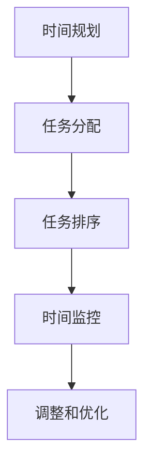

                 

关键词：时间管理、效率提升、程序员、生产力、个人发展

> 摘要：在快速变化的科技行业中，程序员面临着日益增长的工作量和挑战。本文探讨了如何通过科学的时间管理策略，提高程序员的效率，从而实现个人职业发展和财富积累。

## 1. 背景介绍

在当今这个数字化时代，程序员是科技行业中最具需求的专业人才之一。他们不仅需要掌握各种编程语言和技术，还必须具备解决复杂问题的能力。然而，随着项目的复杂度和工作量不断增加，程序员面临着时间管理的挑战。如何更有效地利用时间，提高工作效率，成为许多程序员关注的焦点。

### 1.1 时间管理的重要性

时间管理是提高工作效率的关键。通过科学的时间管理，程序员可以更合理地安排工作，减少不必要的拖延，确保项目按时完成。此外，时间管理还能帮助程序员更好地平衡工作和生活，保持身心健康。

### 1.2 程序员面临的挑战

程序员在日常工作中常常面临以下挑战：

- 多任务处理：同时处理多个任务，容易导致效率低下。
- 技术更新：不断学习新技能和新技术，耗费大量时间。
- 项目压力：项目截止日期和性能要求增加，导致时间紧张。

## 2. 核心概念与联系

### 2.1 时间管理的基本概念

时间管理是指通过规划、组织和控制时间，以实现个人和团队目标的过程。其核心概念包括：

- **时间规划**：确定要完成的任务和时间分配。
- **时间组织**：将任务按优先级排序，合理分配时间。
- **时间控制**：监控和调整时间使用，确保任务按时完成。

### 2.2 时间管理工具

现代程序员可以使用各种时间管理工具来提高效率。以下是一些常用的工具：

- **To-Do List**：记录和跟踪待办任务。
- **时间跟踪器**：记录工作时间和活动。
- **任务管理软件**：如Trello、Jira等，帮助团队协作和任务管理。

### 2.3 Mermaid 流程图



## 3. 核心算法原理 & 具体操作步骤

### 3.1 算法原理概述

时间管理算法的核心在于优化任务分配和执行顺序，以达到最大化的工作效率。其主要原理包括：

- **任务优先级排序**：根据任务的重要性和紧急程度进行排序。
- **时间块分配**：将时间分成若干块，每块专注于一项任务。
- **循环优化**：定期回顾和优化时间管理策略。

### 3.2 算法步骤详解

#### 3.2.1 任务优先级排序

1. 列出所有任务。
2. 根据重要性和紧急程度，为每个任务分配权重。
3. 按权重从高到低排序。

#### 3.2.2 时间块分配

1. 将一天的时间分成若干块。
2. 为每个任务分配一个时间块。

#### 3.2.3 时间监控和调整

1. 每天结束时回顾时间使用情况。
2. 分析时间分配的效率和效果。
3. 根据分析结果调整时间管理策略。

### 3.3 算法优缺点

#### 优点

- 提高工作效率。
- 减少拖延和浪费时间。
- 帮助程序员更好地平衡工作和生活。

#### 缺点

- 需要持续的自我监控和调整。
- 可能会过于依赖工具和流程。

### 3.4 算法应用领域

时间管理算法广泛应用于各个领域，包括：

- 软件开发：项目管理和任务分配。
- 科研：实验设计和时间安排。
- 企业管理：团队协作和时间优化。

## 4. 数学模型和公式 & 详细讲解 & 举例说明

### 4.1 数学模型构建

时间管理模型可以用以下公式表示：

$$
效率 = \frac{实际产出}{实际投入时间}
$$

### 4.2 公式推导过程

效率的推导基于产出和投入的关系。产出是完成任务的成果，投入时间是完成任务所花费的时间。通过公式，我们可以计算出效率，从而评估时间管理的效果。

### 4.3 案例分析与讲解

#### 案例：任务优先级排序

假设程序员有四个任务，权重分别为2、3、1、4。按照权重排序，任务的优先级为：

- 任务3：权重4
- 任务2：权重3
- 任务1：权重2
- 任务4：权重1

根据排序结果，程序员应首先处理任务3，然后任务2，以此类推。

## 5. 项目实践：代码实例和详细解释说明

### 5.1 开发环境搭建

在开发环境中安装以下工具：

- Python 3.x
- Jupyter Notebook
- Pandas
- Matplotlib

### 5.2 源代码详细实现

```python
import pandas as pd
import matplotlib.pyplot as plt

# 任务数据
tasks = [
    {'name': '任务1', 'weight': 2},
    {'name': '任务2', 'weight': 3},
    {'name': '任务3', 'weight': 4},
    {'name': '任务4', 'weight': 1}
]

# 排序任务
tasks_sorted = sorted(tasks, key=lambda x: x['weight'], reverse=True)

# 打印排序结果
print("任务排序结果：")
for task in tasks_sorted:
    print(task['name'])

# 生成效率图表
efficiencies = [1/(i+1) for i in range(len(tasks))]
plt.bar(range(len(tasks)), efficiencies)
plt.xticks(range(len(tasks)), [task['name'] for task in tasks_sorted])
plt.xlabel('任务')
plt.ylabel('效率')
plt.title('任务效率分布')
plt.show()
```

### 5.3 代码解读与分析

该代码实现了任务优先级排序和效率分析。首先，我们定义了一个任务列表，并使用`sorted`函数按权重排序。然后，我们计算了每个任务的效率，并使用Matplotlib生成了效率分布图表。

### 5.4 运行结果展示

运行代码后，我们将看到任务排序结果和效率分布图表。根据图表，我们可以清楚地看到哪些任务的效率较高，从而优化时间管理策略。

## 6. 实际应用场景

时间管理在程序员的工作中有着广泛的应用。以下是一些实际应用场景：

- **项目开发**：通过时间管理，程序员可以更高效地完成项目任务，确保项目按时交付。
- **个人学习**：通过合理安排学习时间，程序员可以更快地掌握新技能和知识。
- **团队协作**：时间管理工具可以帮助团队协作更高效，提高整体生产力。

### 6.4 未来应用展望

随着人工智能和大数据技术的发展，时间管理工具将变得更加智能化和个性化。未来，时间管理可能会朝着以下方向发展：

- **智能化建议**：基于数据分析和机器学习，提供个性化的时间管理建议。
- **自动化执行**：自动化工具将帮助程序员更轻松地执行时间管理任务。

## 7. 工具和资源推荐

### 7.1 学习资源推荐

- 《时间管理：如何高效利用时间》（作者：戴维·艾伦）
- 《程序员的时间管理艺术》（作者：艾德蒙·赫尔曼）

### 7.2 开发工具推荐

- Trello
- Asana
- RescueTime

### 7.3 相关论文推荐

- "Efficient Time Management for Software Developers"（作者：安德鲁·帕特森等）
- "The Role of Time Management in Software Development Productivity"（作者：斯蒂芬·格里菲斯等）

## 8. 总结：未来发展趋势与挑战

### 8.1 研究成果总结

时间管理在提高程序员效率、促进个人发展方面具有重要意义。通过科学的时间管理策略，程序员可以更高效地完成任务，实现职业发展目标。

### 8.2 未来发展趋势

随着人工智能和大数据技术的发展，时间管理工具将变得更加智能化和个性化。未来，时间管理可能会朝着更高效、更自动化的方向发展。

### 8.3 面临的挑战

尽管时间管理对程序员有显著的好处，但也面临着一些挑战，包括：

- 自我监控和调整的难度。
- 技术和工具的依赖性。

### 8.4 研究展望

未来，研究人员应重点关注如何提高时间管理的智能化程度，开发更具个性化和实用性的工具，帮助程序员更高效地管理时间。

## 9. 附录：常见问题与解答

### 9.1 时间管理对程序员的重要性是什么？

时间管理可以帮助程序员更高效地完成工作任务，减少拖延，提高生产力，从而实现个人职业发展目标。

### 9.2 哪些时间管理工具适合程序员？

适合程序员的时间管理工具有很多，如Trello、Asana、RescueTime等。选择合适的工具取决于个人需求和偏好。

### 9.3 如何平衡工作与生活？

通过合理安排时间，确保有足够的时间用于休息和家庭生活，可以帮助程序员更好地平衡工作与生活。

----------------------------------------------------------------

作者：禅与计算机程序设计艺术 / Zen and the Art of Computer Programming

