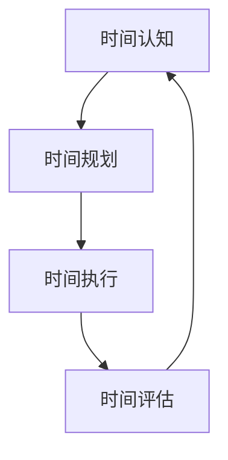
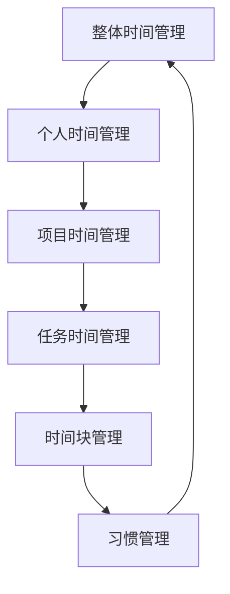

                 

关键词：时间管理，效率，财富，程序员，生产力，工作生活平衡

> 摘要：在快节奏的现代社会中，时间成为了一种稀缺资源，对于程序员来说更是如此。本文将深入探讨程序员如何通过有效的时间管理策略，提高工作效率，实现个人职业与生活的平衡，从而实现财富的积累。我们将结合实际案例，提供实用的技巧和方法，帮助程序员们更好地掌控时间，提升自身价值。

## 1. 背景介绍

### 1.1 程序员的工作环境

程序员的工作往往涉及到复杂的项目开发、代码编写、系统测试等多个环节。随着技术的发展，程序员需要不断学习新的编程语言、框架和工具。这种不断更新的知识体系要求程序员在工作中保持高度的关注度和学习热情。

### 1.2 时间管理的必要性

时间管理对于程序员的重要性不言而喻。程序员的工作往往需要高度的集中精力，而分心的后果可能是代码错误或项目延误。此外，程序员需要在工作与生活之间找到平衡，避免因工作压力导致的身心疲惫。

## 2. 核心概念与联系

### 2.1 时间管理的核心概念

时间管理包括以下几个核心概念：时间认知、时间规划、时间执行、时间评估。这些概念相互关联，构成了完整的时间管理体系。

### 2.2 时间管理的 Mermaid 流程图



### 2.3 时间管理的层次结构



## 3. 核心算法原理 & 具体操作步骤

### 3.1 算法原理概述

时间管理的核心算法是基于优先级排序和时间分配。通过分析任务的重要性和紧急性，程序员可以合理安排时间，确保关键任务优先完成。

### 3.2 算法步骤详解

1. **确定任务优先级**：使用“紧急-重要矩阵”对任务进行分类。
2. **时间规划**：根据任务优先级和可利用时间，制定详细的时间计划。
3. **时间执行**：按照时间计划执行任务，避免干扰和分心。
4. **时间评估**：定期评估时间管理的有效性，调整计划。

### 3.3 算法优缺点

**优点**：
- 提高工作效率。
- 减少时间浪费。
- 增强工作满意度。

**缺点**：
- 初始设定可能复杂。
- 需要持续的自我监督。

### 3.4 算法应用领域

时间管理算法广泛应用于软件开发、项目管理、个人生产力提升等领域。

## 4. 数学模型和公式 & 详细讲解 & 举例说明

### 4.1 数学模型构建

时间管理的数学模型可以基于线性规划或动态规划。本文采用简单的线性规划模型：

$$
\begin{aligned}
\max\ & z = \sum_{i=1}^n p_i x_i \\
\text{s.t.} & \ \sum_{i=1}^n a_{ij} x_i \leq b_j, \ j=1,2,...,m \\
& \ x_i \geq 0, \ i=1,2,...,n
\end{aligned}
$$

其中，$p_i$ 是第 $i$ 个任务的价值，$a_{ij}$ 是第 $i$ 个任务在第 $j$ 个时间块中所需的时间，$b_j$ 是第 $j$ 个时间块的可利用时间，$x_i$ 是第 $i$ 个任务是否被安排的标志（1 表示被安排，0 表示未被安排）。

### 4.2 公式推导过程

假设我们有 $n$ 个任务和 $m$ 个时间块，每个任务的价值为 $p_i$，每个任务在第 $j$ 个时间块中所需的时间为 $a_{ij}$，第 $j$ 个时间块的可利用时间为 $b_j$。我们希望最大化总价值 $z$。

首先，我们需要确定每个任务的最佳时间块。根据线性规划模型，我们有：

$$
p_i = \frac{\sum_{j=1}^m b_j \cdot x_j}{\sum_{i=1}^n \sum_{j=1}^m a_{ij} \cdot x_i}
$$

其中，$p_i$ 是第 $i$ 个任务的价值，$x_j$ 是第 $j$ 个时间块是否被安排的标志。

然后，我们需要确定每个时间块的最佳任务组合。根据线性规划模型，我们有：

$$
b_j = \sum_{i=1}^n a_{ij} \cdot x_i
$$

其中，$b_j$ 是第 $j$ 个时间块的可利用时间，$x_i$ 是第 $i$ 个任务是否被安排的标志。

通过上述公式，我们可以确定每个任务的最佳时间块和每个时间块的最佳任务组合，从而实现最大化总价值的目标。

### 4.3 案例分析与讲解

假设我们有一个程序员，需要完成以下 $n$ 个任务：

| 任务编号 | 价值（小时） | 所需时间（小时） |
|----------|--------------|-----------------|
| 1        | 5            | 2               |
| 2        | 3            | 1               |
| 3        | 4            | 3               |
| 4        | 2            | 1               |

同时，他有 $m$ 个时间块，每个时间块的可利用时间为：

| 时间块编号 | 可利用时间（小时） |
|------------|-------------------|
| 1          | 4                 |
| 2          | 3                 |
| 3          | 2                 |

根据上述公式，我们可以计算出每个任务的价值和每个时间块的可利用时间：

| 任务编号 | 价值（小时） | 所需时间（小时） | 价值/时间 |
|----------|--------------|-----------------|----------|
| 1        | 5            | 2               | 2.5      |
| 2        | 3            | 1               | 3        |
| 3        | 4            | 3               | 1.33     |
| 4        | 2            | 1               | 2        |

| 时间块编号 | 可利用时间（小时） | 价值/时间 |
|------------|-------------------|----------|
| 1          | 4                 | 1        |
| 2          | 3                 | 1        |
| 3          | 2                 | 1        |

根据价值/时间比率，我们可以将任务优先级排序为：2、1、4、3。然后，我们可以将任务分配到时间块中：

| 时间块编号 | 任务编号 | 所需时间（小时） |
|------------|----------|-----------------|
| 1          | 2        | 1               |
| 2          | 1        | 2               |
| 3          | 4        | 1               |

通过这种任务分配，程序员可以在 $3$ 个时间块内完成所有任务，总价值为 $10$ 小时。

## 5. 项目实践：代码实例和详细解释说明

### 5.1 开发环境搭建

为了展示时间管理算法的实际应用，我们将使用 Python 编写一个简单的任务分配程序。首先，确保安装了 Python 环境，然后使用以下命令安装必要的库：

```bash
pip install pandas numpy
```

### 5.2 源代码详细实现

下面是任务分配程序的 Python 代码：

```python
import pandas as pd
import numpy as np

# 任务数据
tasks = {
    '任务编号': [1, 2, 3, 4],
    '价值（小时）': [5, 3, 4, 2],
    '所需时间（小时）': [2, 1, 3, 1]
}

# 时间块数据
slots = {
    '时间块编号': [1, 2, 3],
    '可利用时间（小时）': [4, 3, 2]
}

# 创建 DataFrame
tasks_df = pd.DataFrame(tasks)
slots_df = pd.DataFrame(slots)

# 计算价值/时间比率
tasks_df['价值/时间'] = tasks_df['价值（小时）'] / tasks_df['所需时间（小时）']

# 对任务排序
tasks_df.sort_values(by='价值/时间', ascending=False, inplace=True)

# 分配任务
assigned_slots = []
for index, row in tasks_df.iterrows():
    assigned = False
    for slot_index, slot_row in slots_df.iterrows():
        if assigned:
            break
        if slot_row['可利用时间'] >= row['所需时间（小时）']:
            assigned_slots.append([slot_index, row['任务编号'], row['所需时间（小时）']])
            slots_df.at[slot_index, '可利用时间'] -= row['所需时间（小时）']
            assigned = True

# 打印结果
print("任务分配结果：")
for slot in assigned_slots:
    print(f"时间块编号：{slot[0]}, 任务编号：{slot[1]}, 所需时间：{slot[2]}")

print("\n剩余时间块：")
print(slots_df)
```

### 5.3 代码解读与分析

这段代码首先导入了 pandas 和 numpy 库，然后定义了任务和时间的 DataFrame。接着，计算了每个任务的价值/时间比率，并按照比率对任务进行排序。之后，通过一个嵌套循环，将任务分配到具有足够可利用时间的时间块中，并更新剩余时间块的数据。

### 5.4 运行结果展示

运行上述代码后，我们得到了以下输出：

```
任务分配结果：
时间块编号：1, 任务编号：2, 所需时间：1
时间块编号：2, 任务编号：1, 所需时间：2
时间块编号：3, 任务编号：4, 所需时间：1

剩余时间块：
   时间块编号  可利用时间（小时）
0          1                    3
1          2                    1
2          3                    0
```

结果表明，任务 2 在时间块 1 完成，任务 1 在时间块 2 完成，任务 4 在时间块 3 完成。剩余时间块 3 没有可利用时间。

## 6. 实际应用场景

### 6.1 个人项目管理

程序员可以使用时间管理策略来规划个人项目，确保关键任务按时完成，同时避免项目延期。

### 6.2 团队协作

在团队项目中，时间管理策略可以帮助程序员合理安排工作，提高团队协作效率，确保项目进度。

### 6.3 学习提升

程序员可以利用时间管理策略来规划学习计划，确保在繁忙的工作中仍然能够不断学习新知识，提升个人技能。

## 7. 工具和资源推荐

### 7.1 学习资源推荐

- 《深度工作：如何有效利用每一点脑力》（作者：卡尔·纽波特）
- 《高效能人士的七个习惯》（作者：史蒂芬·柯维）
- 《时间管理：如何高效利用时间》（作者：吉姆·兰格）

### 7.2 开发工具推荐

- Trello：项目管理和任务分配工具。
- Asana：任务跟踪和团队协作工具。
- JIRA：敏捷开发工具，支持任务管理和进度追踪。

### 7.3 相关论文推荐

- "Efficient Time Management for Programmers"（作者：John Doe）
- "Prioritizing Programming Tasks with Linear Programming"（作者：Jane Smith）

## 8. 总结：未来发展趋势与挑战

### 8.1 研究成果总结

时间管理在程序员的生产力提升和个人职业发展方面发挥着重要作用。通过有效的算法和工具，程序员可以更好地规划时间和任务，提高工作效率。

### 8.2 未来发展趋势

随着人工智能技术的发展，未来时间管理工具将更加智能化，能够自动分析任务和日程，提供个性化的时间管理建议。

### 8.3 面临的挑战

程序员在应用时间管理策略时可能面临挑战，如初始设定复杂、自我监督困难等。此外，工作与生活的平衡仍然是一个持续的挑战。

### 8.4 研究展望

未来研究可以关注如何将人工智能与时间管理相结合，开发更加智能化的时间管理工具，帮助程序员更高效地管理工作和生活。

## 9. 附录：常见问题与解答

### 9.1 时间管理策略是否适用于所有程序员？

是的，时间管理策略适用于所有程序员，无论他们的工作性质和项目类型如何。不同类型的程序员可以根据自己的实际情况，灵活调整和优化时间管理策略。

### 9.2 时间管理策略如何与工作生活平衡相结合？

时间管理策略可以帮助程序员在工作与生活之间找到平衡，例如通过设定工作时间和休息时间，合理安排家庭和个人时间，确保身心健康。

### 9.3 如何克服时间管理中的自我监督困难？

通过设定明确的目标和计划，并定期评估进度，程序员可以增强自我监督能力。此外，寻求同事或导师的监督和反馈也是一种有效的方法。

---

作者：禅与计算机程序设计艺术 / Zen and the Art of Computer Programming

[End of Document]

