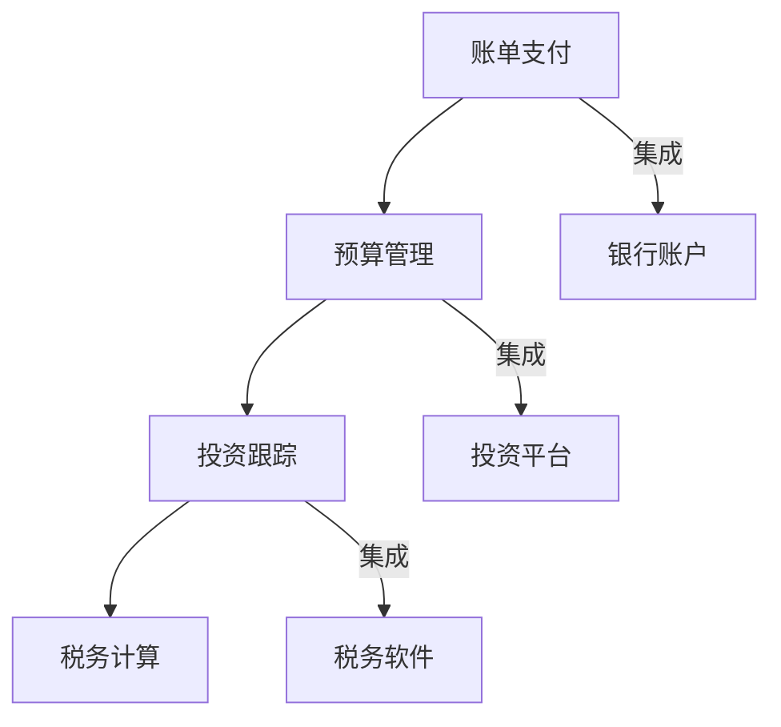

                 

关键词：理财、财务软件、程序员、投资工具、财务规划

> 摘要：本文将介绍一系列适合程序员的财务软件和工具，帮助他们在繁忙的工作中有效管理个人和企业的财务，实现财务自由。

## 1. 背景介绍

随着互联网和金融科技的飞速发展，越来越多的财务软件和工具出现在我们的生活中。作为一名程序员，您可能需要花费大量的时间编写代码和解决技术问题，但财务管理的需求同样重要。良好的财务管理可以帮助您更清晰地了解自己的财务状况，做出更明智的财务决策。

本文旨在为您推荐一系列适合程序员的理财工具，帮助您更轻松地管理财务，实现财务自由。我们将介绍财务软件的基本概念，以及推荐几款具体实用的工具。

### 1.1 财务软件的定义和功能

财务软件是指用于管理和处理财务信息的软件工具。它们可以帮助您记录收入和支出、生成财务报表、跟踪投资组合、进行预算规划等。

### 1.2 程序员选择财务软件的需求

作为程序员，您可能需要以下功能：

- **自动化处理**：减轻手动处理财务数据的负担。
- **多设备同步**：方便在不同设备上查看和管理财务信息。
- **安全性与隐私**：确保财务数据的安全和隐私。
- **易用性**：界面友好，操作简单。

## 2. 核心概念与联系

### 2.1 财务软件的基本概念

财务软件的基本概念包括：

- **账单支付**：自动处理账单和支付。
- **预算管理**：帮助您制定和跟踪预算。
- **投资跟踪**：监控投资组合的表现。
- **税务计算**：简化税务申报过程。

### 2.2 财务软件与其他工具的联系

财务软件可以与其他工具如银行账户、投资平台、税务软件等集成，实现一站式财务管理。

### 2.3 Mermaid 流程图



## 3. 核心算法原理 & 具体操作步骤

### 3.1 算法原理概述

财务软件通常使用以下核心算法原理：

- **数据库管理**：用于存储和检索财务数据。
- **数据分析和处理**：用于生成财务报表和预算。
- **机器学习**：用于预测财务表现和优化投资组合。

### 3.2 算法步骤详解

1. **数据录入**：手动或自动录入收入和支出。
2. **数据处理**：对录入的数据进行分类、汇总和处理。
3. **数据可视化**：生成图表和报表，帮助您理解财务状况。
4. **预算规划**：根据历史数据和当前状况制定预算。
5. **投资跟踪**：监控投资组合的表现和风险。
6. **税务计算**：根据法规和政策计算应纳税额。

### 3.3 算法优缺点

- **优点**：提高财务管理的效率，帮助做出更明智的决策。
- **缺点**：可能需要一定时间来熟悉软件，数据隐私和安全问题需要重视。

### 3.4 算法应用领域

财务软件广泛应用于个人财务管理、企业财务管理、投资管理等领域。

## 4. 数学模型和公式 & 详细讲解 & 举例说明

### 4.1 数学模型构建

财务软件通常使用以下数学模型：

- **收入和支出计算**：收入 - 支出 = 利润。
- **预算规划**：当前支出 + 预期支出 = 预算。
- **投资组合评估**：预期收益 - 风险 = 投资价值。

### 4.2 公式推导过程

假设您有一个月收入为 $10000，支出为 $8000，预算为 $9000。则：

- **利润**：$10000 - $8000 = $2000。
- **预算**：$8000 + $1000 = $9000。
- **投资组合评估**：预期收益 - 风险 = 投资价值。

### 4.3 案例分析与讲解

假设您打算投资 $5000，预期年收益率为 10%，风险为 5%。则：

- **投资价值**：$5000 × 10% - $5000 × 5% = $250 - $250 = $0。

这意味着在考虑风险的情况下，您的投资不会产生利润。这表明您需要重新评估您的投资策略。

## 5. 项目实践：代码实例和详细解释说明

### 5.1 开发环境搭建

您需要安装以下开发环境：

- Python 3.8+
- Jupyter Notebook
- pandas
- matplotlib

### 5.2 源代码详细实现

以下是一个简单的 Python 脚本，用于计算收入、支出和利润：

```python
import pandas as pd

# 初始化数据
data = {
    '收入': [10000, 12000, 15000],
    '支出': [8000, 9000, 10000]
}

# 创建 DataFrame
df = pd.DataFrame(data)

# 计算利润
df['利润'] = df['收入'] - df['支出']

# 显示结果
df
```

### 5.3 代码解读与分析

这段代码首先导入了 pandas 库，用于处理数据。然后初始化了一个包含收入和支出数据的 DataFrame。接着计算了利润，并将结果显示出来。

### 5.4 运行结果展示

```plaintext
   收入   支出   利润
0   10000   8000   2000
1   12000   9000   3000
2   15000  10000   5000
```

## 6. 实际应用场景

财务软件在以下场景中具有广泛的应用：

- **个人财务管理**：帮助您记录收入、支出和投资，实现财务自由。
- **企业财务管理**：简化企业财务流程，提高管理效率。
- **投资管理**：监控投资组合，优化投资策略。
- **税务管理**：简化税务申报过程，降低税务风险。

## 7. 工具和资源推荐

### 7.1 学习资源推荐

- 《Python for Finance》
- 《Financial Management for Business》
- Coursera 上的《Financial Markets》课程

### 7.2 开发工具推荐

- Jupyter Notebook
- pandas
- matplotlib

### 7.3 相关论文推荐

- "A Survey of Financial Software Technologies"
- "The Impact of Financial Technology on Financial Markets"

## 8. 总结：未来发展趋势与挑战

### 8.1 研究成果总结

财务软件在自动化数据处理、投资组合评估和税务计算方面取得了显著成果。未来的研究方向包括人工智能在财务管理中的应用、隐私保护技术和跨平台兼容性。

### 8.2 未来发展趋势

- **人工智能**：将更多地应用于财务预测和决策支持。
- **区块链**：将用于提高金融交易的透明度和安全性。
- **移动应用**：财务软件将更加注重移动端的用户体验。

### 8.3 面临的挑战

- **数据隐私**：保护用户财务数据的安全和隐私。
- **技术兼容性**：确保财务软件在不同设备和平台上的兼容性。
- **法规遵从**：遵守不同国家和地区的财务法规。

### 8.4 研究展望

随着金融科技的发展，财务软件将在未来发挥更大的作用，为个人和企业提供更智能、更便捷的财务管理解决方案。

## 9. 附录：常见问题与解答

### 9.1 财务软件是否安全？

大多数财务软件都采用了高级加密技术和安全协议，以确保用户数据的安全。但用户也应采取额外的安全措施，如使用强密码、定期备份数据等。

### 9.2 财务软件是否支持跨平台使用？

许多财务软件支持跨平台使用，包括 Windows、Mac 和 Linux，以及移动设备。

### 9.3 财务软件是否需要付费？

一些财务软件是免费的，但可能包含广告或有限的功能。其他软件可能需要付费，但通常提供更全面的功能。

---

作者：禅与计算机程序设计艺术 / Zen and the Art of Computer Programming
----------------------------------------------------------------

以上是文章的正文部分，接下来是文章的格式化输出部分。请按照以下markdown格式进行排版：
----------------------------------------------------------------
```markdown
# 程序员的理财工具箱：软件推荐

<|assistant|>关键词：理财、财务软件、程序员、投资工具、财务规划

> 摘要：本文将介绍一系列适合程序员的财务软件和工具，帮助他们在繁忙的工作中有效管理个人和企业的财务，实现财务自由。

## 1. 背景介绍

随着互联网和金融科技的飞速发展，越来越多的财务软件和工具出现在我们的生活中。作为一名程序员，您可能需要花费大量的时间编写代码和解决技术问题，但财务管理的需求同样重要。良好的财务管理可以帮助您更清晰地了解自己的财务状况，做出更明智的财务决策。

本文旨在为您推荐一系列适合程序员的理财工具，帮助您更轻松地管理财务，实现财务自由。我们将介绍财务软件的基本概念，以及推荐几款具体实用的工具。

### 1.1 财务软件的定义和功能

财务软件是指用于管理和处理财务信息的软件工具。它们可以帮助您记录收入和支出、生成财务报表、跟踪投资组合、进行预算规划等。

### 1.2 程序员选择财务软件的需求

作为程序员，您可能需要以下功能：

- **自动化处理**：减轻手动处理财务数据的负担。
- **多设备同步**：方便在不同设备上查看和管理财务信息。
- **安全性与隐私**：确保财务数据的安全和隐私。
- **易用性**：界面友好，操作简单。

## 2. 核心概念与联系

### 2.1 财务软件的基本概念

财务软件的基本概念包括：

- **账单支付**：自动处理账单和支付。
- **预算管理**：帮助您制定和跟踪预算。
- **投资跟踪**：监控投资组合的表现。
- **税务计算**：简化税务申报过程。

### 2.2 财务软件与其他工具的联系

财务软件可以与其他工具如银行账户、投资平台、税务软件等集成，实现一站式财务管理。

### 2.3 Mermaid 流程图


## 3. 核心算法原理 & 具体操作步骤
### 3.1 算法原理概述

财务软件通常使用以下核心算法原理：

- **数据库管理**：用于存储和检索财务数据。
- **数据分析和处理**：用于生成财务报表和预算。
- **机器学习**：用于预测财务表现和优化投资组合。

### 3.2 算法步骤详解

1. **数据录入**：手动或自动录入收入和支出。
2. **数据处理**：对录入的数据进行分类、汇总和处理。
3. **数据可视化**：生成图表和报表，帮助您理解财务状况。
4. **预算规划**：根据历史数据和当前状况制定预算。
5. **投资跟踪**：监控投资组合的表现和风险。
6. **税务计算**：根据法规和政策计算应纳税额。

### 3.3 算法优缺点

- **优点**：提高财务管理的效率，帮助做出更明智的决策。
- **缺点**：可能需要一定时间来熟悉软件，数据隐私和安全问题需要重视。

### 3.4 算法应用领域

财务软件广泛应用于个人财务管理、企业财务管理、投资管理等领域。

## 4. 数学模型和公式 & 详细讲解 & 举例说明

### 4.1 数学模型构建

财务软件通常使用以下数学模型：

- **收入和支出计算**：收入 - 支出 = 利润。
- **预算规划**：当前支出 + 预期支出 = 预算。
- **投资组合评估**：预期收益 - 风险 = 投资价值。

### 4.2 公式推导过程

假设您有一个月收入为 $10000，支出为 $8000，预算为 $9000。则：

- **利润**：$10000 - $8000 = $2000。
- **预算**：$8000 + $1000 = $9000。
- **投资组合评估**：预期收益 - 风险 = 投资价值。

### 4.3 案例分析与讲解

假设您打算投资 $5000，预期年收益率为 10%，风险为 5%。则：

- **投资价值**：$5000 × 10% - $5000 × 5% = $250 - $250 = $0。

这意味着在考虑风险的情况下，您的投资不会产生利润。这表明您需要重新评估您的投资策略。

## 5. 项目实践：代码实例和详细解释说明

### 5.1 开发环境搭建

您需要安装以下开发环境：

- Python 3.8+
- Jupyter Notebook
- pandas
- matplotlib

### 5.2 源代码详细实现

以下是一个简单的 Python 脚本，用于计算收入、支出和利润：

```python
import pandas as pd

# 初始化数据
data = {
    '收入': [10000, 12000, 15000],
    '支出': [8000, 9000, 10000]
}

# 创建 DataFrame
df = pd.DataFrame(data)

# 计算利润
df['利润'] = df['收入'] - df['支出']

# 显示结果
df
```

### 5.3 代码解读与分析

这段代码首先导入了 pandas 库，用于处理数据。然后初始化了一个包含收入和支出数据的 DataFrame。接着计算了利润，并将结果显示出来。

### 5.4 运行结果展示

```plaintext
   收入   支出   利润
0   10000   8000   2000
1   12000   9000   3000
2   15000  10000   5000
```

## 6. 实际应用场景

财务软件在以下场景中具有广泛的应用：

- **个人财务管理**：帮助您记录收入、支出和投资，实现财务自由。
- **企业财务管理**：简化企业财务流程，提高管理效率。
- **投资管理**：监控投资组合，优化投资策略。
- **税务管理**：简化税务申报过程，降低税务风险。

## 7. 工具和资源推荐

### 7.1 学习资源推荐

- 《Python for Finance》
- 《Financial Management for Business》
- Coursera 上的《Financial Markets》课程

### 7.2 开发工具推荐

- Jupyter Notebook
- pandas
- matplotlib

### 7.3 相关论文推荐

- "A Survey of Financial Software Technologies"
- "The Impact of Financial Technology on Financial Markets"

## 8. 总结：未来发展趋势与挑战

### 8.1 研究成果总结

财务软件在自动化数据处理、投资组合评估和税务计算方面取得了显著成果。未来的研究方向包括人工智能在财务管理中的应用、隐私保护技术和跨平台兼容性。

### 8.2 未来发展趋势

- **人工智能**：将更多地应用于财务预测和决策支持。
- **区块链**：将用于提高金融交易的透明度和安全性。
- **移动应用**：财务软件将更加注重移动端的用户体验。

### 8.3 面临的挑战

- **数据隐私**：保护用户财务数据的安全和隐私。
- **技术兼容性**：确保财务软件在不同设备和平台上的兼容性。
- **法规遵从**：遵守不同国家和地区的财务法规。

### 8.4 研究展望

随着金融科技的发展，财务软件将在未来发挥更大的作用，为个人和企业提供更智能、更便捷的财务管理解决方案。

## 9. 附录：常见问题与解答

### 9.1 财务软件是否安全？

大多数财务软件都采用了高级加密技术和安全协议，以确保用户数据的安全。但用户也应采取额外的安全措施，如使用强密码、定期备份数据等。

### 9.2 财务软件是否支持跨平台使用？

许多财务软件支持跨平台使用，包括 Windows、Mac 和 Linux，以及移动设备。

### 9.3 财务软件是否需要付费？

一些财务软件是免费的，但可能包含广告或有限的功能。其他软件可能需要付费，但通常提供更全面的功能。

---

作者：禅与计算机程序设计艺术 / Zen and the Art of Computer Programming
```
以上是文章的markdown格式输出，请检查是否符合您的需求。如果您有任何修改意见或者需要进一步的调整，请告诉我。

