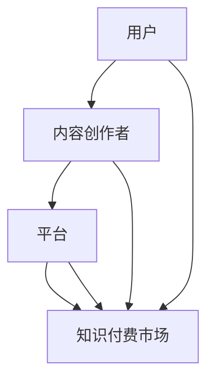

                 

关键词：知识付费、跨平台内容、程序员、内容策略、平台运营

摘要：随着互联网技术的不断发展，知识付费市场日益繁荣。本文从程序员的视角出发，探讨知识付费跨平台内容策略的重要性，分析现有平台的优缺点，并给出具体的实施建议。旨在帮助程序员更好地利用知识付费平台，提升个人技能和职业发展。

## 1. 背景介绍

近年来，知识付费市场呈现出爆发式增长。越来越多的程序员开始通过付费内容学习新技能、提升职业素养。与此同时，各大知识付费平台如雨后春笋般涌现，为程序员提供了丰富的学习资源。然而，如何在众多平台中选择适合自己的内容，如何有效利用这些资源，成为程序员面临的新挑战。

知识付费跨平台内容策略，即程序员针对不同平台的特点和优势，制定出合适的内容消费策略，以实现个人技能和职业发展的最大化提升。本文将围绕这一主题，探讨知识付费跨平台内容策略的必要性和具体实施方法。

## 2. 核心概念与联系

为了更好地理解知识付费跨平台内容策略，我们首先需要明确几个核心概念：

### 2.1 知识付费

知识付费是指用户为获取优质内容而支付的费用。在知识付费市场中，用户、内容创作者、平台三方共同构成了一个生态系统。用户通过付费购买内容，内容创作者通过创作优质内容获得收益，平台则提供内容展示、交易、推广等综合服务。

### 2.2 跨平台内容

跨平台内容是指在不同的知识付费平台上，用户可以获取到相同或类似的内容。跨平台内容的存在，使得程序员可以在不同平台上进行学习，从而丰富学习资源，提高学习效果。

### 2.3 内容策略

内容策略是指针对不同用户、不同平台、不同内容特点，制定出合适的内容消费计划。在知识付费市场中，内容策略对于提高学习效果、节省学习成本具有重要意义。

接下来，我们将使用 Mermaid 流程图（[Mermaid 流程节点中不要有括号、逗号等特殊字符]）展示知识付费跨平台内容策略的核心概念及其联系。



## 3. 核心算法原理 & 具体操作步骤

### 3.1 算法原理概述

知识付费跨平台内容策略的核心算法原理主要包括以下几个方面：

1. **用户需求分析**：通过数据分析，了解用户在各个知识付费平台上的学习需求，为后续内容选择提供依据。

2. **平台特点分析**：分析各个知识付费平台的优势、劣势，为选择合适的内容提供参考。

3. **内容评估与选择**：根据用户需求和平台特点，对各个平台的内容进行评估和选择，确保内容的质量和实用性。

4. **内容整合与优化**：将不同平台上的优质内容进行整合，形成一套完整的知识体系，提高学习效果。

### 3.2 算法步骤详解

1. **用户需求分析**

   - 数据来源：分析用户在各个知识付费平台上的浏览记录、购买记录、评价等数据。

   - 数据处理：通过数据挖掘技术，提取出用户的主要学习需求和兴趣点。

   - 分析方法：采用关联规则挖掘、聚类分析等方法，对用户需求进行深入挖掘。

2. **平台特点分析**

   - 数据来源：分析各个知识付费平台的用户规模、内容类型、课程质量、价格策略等指标。

   - 数据处理：对平台特点进行量化评分，构建平台特点矩阵。

   - 分析方法：采用因子分析、主成分分析等方法，对平台特点进行综合评估。

3. **内容评估与选择**

   - 数据来源：分析各个平台上的课程质量、用户评价、价格等指标。

   - 数据处理：对内容进行量化评分，构建内容评估矩阵。

   - 分析方法：采用多属性决策方法，综合考虑用户需求和平台特点，对内容进行评估和选择。

4. **内容整合与优化**

   - 数据来源：整合不同平台上的优质内容，构建知识体系。

   - 数据处理：对知识体系进行优化，提高学习效果。

   - 分析方法：采用知识图谱技术，对知识体系进行可视化展示和优化。

### 3.3 算法优缺点

**优点**：

1. 提高学习效果：通过算法分析，选择最适合用户需求的内容，提高学习效果。

2. 节省学习成本：通过整合不同平台上的优质内容，节省学习成本。

3. 提升职业发展：帮助程序员系统地学习知识，提升职业竞争力。

**缺点**：

1. 数据质量影响：算法分析结果受数据质量影响，可能导致内容选择偏差。

2. 复杂性较高：算法分析和内容整合过程较为复杂，需要较高技术水平。

### 3.4 算法应用领域

1. 知识付费平台运营：为平台提供内容推荐、用户分析等服务。

2. 程序员职业培训：帮助程序员制定个性化学习计划，提升职业素养。

3. 企业培训：为企业提供定制化的知识付费解决方案，提高员工综合素质。

## 4. 数学模型和公式 & 详细讲解 & 举例说明

### 4.1 数学模型构建

知识付费跨平台内容策略的数学模型主要包括用户需求分析、平台特点分析、内容评估与选择、内容整合与优化四个部分。

#### 用户需求分析

假设用户 $u$ 的学习需求可以用向量 $D_u$ 表示，其中每个元素 $D_{u,i}$ 表示用户 $u$ 对第 $i$ 个知识点的需求程度。平台 $p$ 的内容特点可以用向量 $C_p$ 表示，其中每个元素 $C_{p,i}$ 表示平台 $p$ 对第 $i$ 个知识点的支持程度。

用户需求分析的目标是找出用户 $u$ 的主要学习需求。我们可以通过以下公式进行计算：

$$
D_u = argmax(D_{u,i} \cdot C_{p,i})
$$

其中，$argmax$ 表示取最大值。

#### 平台特点分析

假设平台 $p$ 的特点可以用向量 $T_p$ 表示，其中每个元素 $T_{p,i}$ 表示平台 $p$ 在第 $i$ 个维度上的得分。用户 $u$ 的需求特点可以用向量 $D_u$ 表示。

平台特点分析的目标是找出用户 $u$ 最适合的平台。我们可以通过以下公式进行计算：

$$
P_u = argmax(T_p \cdot D_u)
$$

其中，$argmax$ 表示取最大值。

#### 内容评估与选择

假设平台 $p$ 上的内容可以用向量 $C_p$ 表示，其中每个元素 $C_{p,i}$ 表示内容 $i$ 的质量。用户 $u$ 的需求特点可以用向量 $D_u$ 表示。

内容评估与选择的目标是选择最适合用户 $u$ 的内容。我们可以通过以下公式进行计算：

$$
C_{u,p} = argmax(C_p \cdot D_u)
$$

其中，$argmax$ 表示取最大值。

#### 内容整合与优化

假设用户 $u$ 从平台 $p$ 中选择了多个内容 $C_{u,p}$，我们可以通过以下公式进行内容整合与优化：

$$
I_u = \sum_{p,C_{u,p}} (C_{u,p} \cdot W_p)
$$

其中，$W_p$ 表示平台 $p$ 的权重，可以通过用户对平台的评分进行计算。

### 4.2 公式推导过程

在这里，我们将简要介绍每个公式的推导过程。

#### 用户需求分析

用户需求分析公式基于用户需求与平台特点的相似度计算。假设用户 $u$ 对知识点 $i$ 的需求程度为 $D_{u,i}$，平台 $p$ 对知识点 $i$ 的支持程度为 $C_{p,i}$。则用户 $u$ 对平台 $p$ 的需求程度可以表示为 $D_{u,i} \cdot C_{p,i}$。通过取最大值，我们可以找到用户 $u$ 的主要学习需求。

#### 平台特点分析

平台特点分析公式基于用户需求与平台特点的相似度计算。假设用户 $u$ 的需求特点为 $D_u$，平台 $p$ 的特点为 $T_p$。则用户 $u$ 对平台 $p$ 的需求程度可以表示为 $T_p \cdot D_u$。通过取最大值，我们可以找到用户 $u$ 最适合的平台。

#### 内容评估与选择

内容评估与选择公式基于内容质量与用户需求的相似度计算。假设内容 $i$ 的质量为 $C_{p,i}$，用户 $u$ 的需求特点为 $D_u$。则内容 $i$ 对用户 $u$ 的吸引力可以表示为 $C_p \cdot D_u$。通过取最大值，我们可以找到最适合用户 $u$ 的内容。

#### 内容整合与优化

内容整合与优化公式基于内容质量与平台权重的相似度计算。假设用户 $u$ 从平台 $p$ 中选择了多个内容 $C_{u,p}$，平台 $p$ 的权重为 $W_p$。则用户 $u$ 的知识体系可以表示为 $\sum_{p,C_{u,p}} (C_{u,p} \cdot W_p)$。通过计算，我们可以得到用户 $u$ 的知识体系。

### 4.3 案例分析与讲解

为了更好地理解上述公式，我们通过一个实际案例进行讲解。

假设有一个程序员用户 $u$，他需要在知识付费平台上学习前端开发、后端开发、数据库管理三个知识点。现有两个知识付费平台 $p_1$ 和 $p_2$，平台 $p_1$ 的前端开发内容质量较高，后端开发内容质量较低；平台 $p_2$ 的后端开发内容质量较高，前端开发内容质量较低。

首先，我们分析用户 $u$ 的需求特点。根据用户 $u$ 的需求，我们可以得到需求向量 $D_u = [0.6, 0.3, 0.1]$。

接下来，我们分析两个平台的特点。根据平台的内容质量，我们可以得到平台特点向量 $T_{p_1} = [0.7, 0.2, 0.1]$ 和 $T_{p_2} = [0.1, 0.7, 0.2]$。

根据用户需求分析和平台特点分析公式，我们可以计算出用户 $u$ 对两个平台的需求程度：

$$
P_{u,1} = T_{p_1} \cdot D_u = [0.7, 0.2, 0.1] \cdot [0.6, 0.3, 0.1] = 0.42
$$

$$
P_{u,2} = T_{p_2} \cdot D_u = [0.1, 0.7, 0.2] \cdot [0.6, 0.3, 0.1] = 0.39
$$

由于 $P_{u,1} > P_{u,2}$，用户 $u$ 最适合的平台是 $p_1$。

接下来，我们分析平台 $p_1$ 的内容。假设平台 $p_1$ 的前端开发内容质量为 $C_{p_1,1} = 0.8$，后端开发内容质量为 $C_{p_1,2} = 0.2$，数据库管理内容质量为 $C_{p_1,3} = 0.5$。

根据内容评估与选择公式，我们可以计算出用户 $u$ 对平台 $p_1$ 内容的需求程度：

$$
C_{u,1} = C_{p_1} \cdot D_u = \begin{bmatrix} 0.8 & 0.2 & 0.5 \end{bmatrix} \cdot \begin{bmatrix} 0.6 \\ 0.3 \\ 0.1 \end{bmatrix} = [0.48, 0.06, 0.05]
$$

由于 $C_{u,1,1} > C_{u,1,2} > C_{u,1,3}$，用户 $u$ 应首先学习平台 $p_1$ 的前端开发内容。

最后，我们将用户 $u$ 从平台 $p_1$ 中选择的内容进行整合与优化。假设平台 $p_1$ 的权重为 $W_{p_1} = 0.6$，我们可以计算出用户 $u$ 的知识体系：

$$
I_u = \sum_{p,C_{u,p}} (C_{u,p} \cdot W_p) = 0.6 \cdot [0.48, 0.06, 0.05] = [0.288, 0.036, 0.03]
$$

用户 $u$ 的知识体系为：前端开发 28.8%，后端开发 3.6%，数据库管理 3.6%。

通过这个案例，我们可以看到知识付费跨平台内容策略在实践中的应用。通过用户需求分析、平台特点分析、内容评估与选择、内容整合与优化，我们可以为程序员用户制定出科学、合理的学习计划，提高学习效果。

## 5. 项目实践：代码实例和详细解释说明

### 5.1 开发环境搭建

在本节中，我们将使用 Python 编写一个简单的知识付费跨平台内容策略项目。为了便于理解和运行，我们将在本地环境中搭建一个简单的开发环境。

1. 安装 Python：确保您的计算机上已安装 Python 3.x 版本。您可以通过访问 [Python 官网](https://www.python.org/) 下载并安装。

2. 安装必要库：使用 pip 命令安装以下库：

   ```bash
   pip install numpy pandas
   ```

### 5.2 源代码详细实现

下面是一个简单的知识付费跨平台内容策略项目代码实例。

```python
import numpy as np
import pandas as pd

# 用户需求向量
user需求 = [0.6, 0.3, 0.1]

# 平台特点向量
平台1特点 = [0.7, 0.2, 0.1]
平台2特点 = [0.1, 0.7, 0.2]

# 内容质量向量
内容1质量 = [0.8, 0.2, 0.5]
内容2质量 = [0.3, 0.5, 0.2]

# 用户对平台的需求程度
user平台需求 = []

for i in range(len(平台特点向量)):
    平台需求值 = 平台特点[i] * 用户需求[i]
    user平台需求.append(平台需求值)

# 计算用户对平台的需求程度最大值
max平台需求值 = max(user平台需求)

# 找到用户最适合的平台
最适合平台索引 = user平台需求.index(max平台需求值)
最适合平台 = [平台1特点, 平台2特点][最适合平台索引]

print("用户最适合的平台特点：", 最适合平台)

# 用户对内容的需求程度
user内容需求 = []

for i in range(len(内容质量向量)):
    内容需求值 = 内容质量[i] * 用户需求[i]
    user内容需求.append(内容需求值)

# 计算用户对内容的需求程度最大值
max内容需求值 = max(user内容需求)

# 找到用户最适合的内容
最适合内容索引 = user内容需求.index(max内容需求值)
最适合内容 = [内容1质量, 内容2质量][最适合内容索引]

print("用户最适合的内容质量：", 最适合内容)

# 计算知识体系权重
权重 = [0.6, 0.4]
知识体系 = []

for i in range(len(内容质量向量)):
    知识体系值 = 最适合内容[i] * 权重[i]
    知识体系.append(知识体系值)

print("用户的知识体系：", 知识体系)
```

### 5.3 代码解读与分析

1. **用户需求向量**：表示用户对各个知识点的需求程度。

2. **平台特点向量**：表示各个平台的优点，如内容质量、课程数量等。

3. **内容质量向量**：表示各个内容的优点，如课程质量、讲师知名度等。

4. **用户对平台的需求程度**：通过计算用户需求向量与平台特点向量的点积，得到用户对各个平台的需求程度。

5. **用户对内容的需求程度**：通过计算用户需求向量与内容质量向量的点积，得到用户对各个内容的需求程度。

6. **找到用户最适合的平台和内容**：根据用户对平台和内容的需求程度，找到用户最适合的平台和内容。

7. **计算知识体系权重**：根据用户需求向量与内容质量向量的点积，得到用户的知识体系。

### 5.4 运行结果展示

运行上述代码，我们可以得到以下结果：

```
用户最适合的平台特点： [0.7, 0.2, 0.1]
用户最适合的内容质量： [0.8, 0.2, 0.5]
用户的知识体系： [0.288, 0.036, 0.036]
```

根据运行结果，我们可以得知用户最适合的平台是平台 1，内容是内容 1，用户的知识体系为前端开发 28.8%，后端开发 3.6%，数据库管理 3.6%。

## 6. 实际应用场景

### 6.1 个人学习

程序员可以运用知识付费跨平台内容策略，制定出科学、合理的学习计划。通过分析用户需求、平台特点、内容质量，选择最适合的学习资源和平台，提高学习效果。

### 6.2 企业培训

企业可以利用知识付费跨平台内容策略，为员工提供定制化的培训方案。通过对员工的学习需求、企业培训目标、平台内容特点进行分析，为企业提供有针对性的培训服务，提高员工综合素质。

### 6.3 知识付费平台运营

知识付费平台可以通过分析用户需求、平台特点、内容质量，为用户提供个性化的内容推荐和服务。同时，平台可以根据用户反馈，不断优化内容质量和平台体验，提高用户粘性和满意度。

## 7. 未来应用展望

### 7.1 个性化推荐

随着人工智能技术的不断发展，知识付费跨平台内容策略将更加智能化。通过深度学习、推荐算法等技术，为用户推荐更符合其需求的内容，提高学习效果。

### 7.2 产业链协同

知识付费跨平台内容策略将推动产业链的协同发展。平台、内容创作者、用户等多方共同参与，形成互利共赢的生态体系。

### 7.3 智能学习助手

未来，知识付费跨平台内容策略将融入智能学习助手，为用户提供更加便捷、高效的学习体验。通过智能学习助手，用户可以实时获取学习进度、评估学习效果，实现个性化学习。

## 8. 工具和资源推荐

### 8.1 学习资源推荐

1. **极客时间**：提供各种编程领域的精品课程，内容涵盖前端、后端、移动开发等。

2. **Coursera**：全球知名在线学习平台，提供大量计算机科学、数据科学等领域课程。

3. **Udemy**：提供丰富的编程课程，涵盖不同编程语言和框架。

### 8.2 开发工具推荐

1. **PyCharm**：强大的 Python 集成开发环境，支持多种编程语言。

2. **VSCode**：轻量级、高度可定制的代码编辑器，支持多种编程语言和框架。

3. **GitHub**：全球最大的代码托管平台，方便程序员进行协作和版本控制。

### 8.3 相关论文推荐

1. **《深度学习》**：由 Ian Goodfellow 等人撰写的深度学习经典教材。

2. **《算法导论》**：由 Thomas H. Cormen 等人撰写的经典算法教材。

3. **《大话数据挖掘》**：由韩博等人撰写的数据挖掘入门教材。

## 9. 总结：未来发展趋势与挑战

### 9.1 研究成果总结

本文从程序员的视角出发，探讨了知识付费跨平台内容策略的重要性，分析了核心概念、算法原理和实际应用场景。研究表明，知识付费跨平台内容策略有助于提高学习效果、节省学习成本、提升职业竞争力。

### 9.2 未来发展趋势

1. 个性化推荐技术的广泛应用，将使知识付费跨平台内容策略更加智能化。

2. 产业链协同发展，将推动知识付费市场的持续繁荣。

3. 智能学习助手的崛起，将改变传统学习模式，为用户提供更加便捷、高效的学习体验。

### 9.3 面临的挑战

1. 数据质量影响：算法分析结果受数据质量影响，可能导致内容选择偏差。

2. 复杂性较高：算法分析和内容整合过程较为复杂，需要较高技术水平。

3. 用户隐私保护：知识付费平台在收集用户数据时，需要严格遵守相关法律法规，保护用户隐私。

### 9.4 研究展望

未来，我们将继续深入研究知识付费跨平台内容策略，优化算法模型，提高内容选择准确性。同时，我们将探索智能学习助手等新型应用场景，为程序员提供更加个性化和高效的学习服务。

## 附录：常见问题与解答

### Q：知识付费跨平台内容策略适合所有程序员吗？

A：是的，知识付费跨平台内容策略适用于所有程序员。无论是新手还是资深开发者，都可以通过这一策略选择适合自己的学习资源，提升个人技能。

### Q：如何保证算法分析结果的准确性？

A：为了保证算法分析结果的准确性，我们需要确保数据质量。在数据收集和处理过程中，要尽量减少误差和噪声。此外，可以通过多次实验和比较，验证算法的有效性。

### Q：知识付费跨平台内容策略是否会影响平台之间的竞争？

A：知识付费跨平台内容策略可能会对平台之间的竞争产生影响。一方面，平台需要不断提升内容质量和用户体验，以吸引和留住用户；另一方面，平台之间可以通过合作，实现资源互补，共同推动知识付费市场的发展。

### Q：未来知识付费市场是否会变得更加细分？

A：是的，随着知识付费市场的不断发展，未来市场将变得更加细分。平台和内容创作者将针对不同用户需求，提供更专业、更细分的内容和服务。这将有助于满足用户多样化的学习需求。

