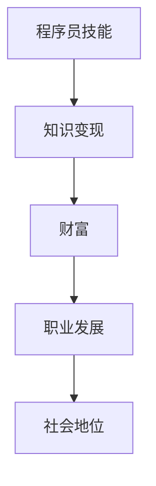

                 

关键词：知识变现、技能提升、财富转化、程序员、技术写作、项目实践、未来展望

> 摘要：本文将探讨程序员如何通过提升自身技能、进行知识变现，实现从技能到财富的转化。文章将介绍程序员如何通过技术写作、项目实践等方式提升自身价值，并分享一些实用的工具和资源，帮助程序员在技术领域取得成功。

## 1. 背景介绍

随着互联网技术的快速发展，编程技能成为了一个炙手可热的能力。程序员作为IT行业的主力军，他们的技能和知识被广泛应用于各个领域，从互联网公司到传统行业，从软件开发到数据分析，程序员的需求量日益增加。然而，技能的提升并不足以确保程序员能够获得理想的收入，知识变现成为了一个关键环节。本文将探讨程序员如何通过提升自身技能、进行知识变现，实现从技能到财富的转化。

## 2. 核心概念与联系

在探讨程序员的知识变现之路之前，我们需要明确几个核心概念：

### 2.1 技能
技能是指程序员在编程、算法、系统架构等方面的专业知识和经验。

### 2.2 知识变现
知识变现是指将程序员的专业知识和技能转化为实际收益的过程。

### 2.3 财富
财富不仅包括金钱，还包括职业发展、社会地位等。

### 2.4 技能与财富的联系
技能是财富的基础，而知识变现是技能转化为财富的关键。通过技术写作、项目实践等方式，程序员可以将自己的技能转化为实际收益，从而实现财富的积累。

下面是一个关于程序员知识变现的 Mermaid 流程图：



## 3. 核心算法原理 & 具体操作步骤

### 3.1 算法原理概述

程序员的知识变现过程可以看作是一个算法，其核心原理如下：

1. **技能提升**：程序员通过不断学习和实践，提升自身的编程技能。
2. **内容创作**：程序员将自己的技能和经验转化为文章、博客、教程等有价值的知识产品。
3. **平台发布**：程序员在各大技术平台（如CSDN、GitHub、简书等）上发布自己的内容，吸引读者。
4. **粉丝互动**：程序员与读者互动，了解读者需求，持续优化内容。
5. **知识变现**：通过广告、打赏、付费咨询等方式，将知识转化为财富。

### 3.2 算法步骤详解

1. **技能提升**：程序员可以通过以下途径提升技能：
   - **自学**：阅读技术书籍、观看在线教程、参加技术会议等。
   - **实践**：参与开源项目、开发个人项目、解决实际问题等。
   - **交流**：加入技术社区、参加技术讨论、与他人合作等。

2. **内容创作**：程序员可以通过以下方式创作内容：
   - **技术博客**：记录自己在学习、实践过程中的心得体会。
   - **教程**：撰写详细的学习指南、操作手册等。
   - **案例分享**：分享自己在项目中的经验和教训。

3. **平台发布**：程序员可以选择以下平台发布内容：
   - **博客平台**：如CSDN、简书、WordPress等。
   - **GitHub**：发布自己的开源项目，与其他开发者交流。
   - **技术社区**：如Stack Overflow、知乎等。

4. **粉丝互动**：程序员可以通过以下方式与粉丝互动：
   - **回复评论**：积极回复读者的疑问和评论。
   - **举办直播**：分享自己的学习、实践经验。
   - **建立社群**：邀请读者加入微信群、QQ群等。

5. **知识变现**：程序员可以通过以下方式实现知识变现：
   - **广告**：在博客、视频等内容中加入广告。
   - **打赏**：开通打赏功能，读者可以自愿打赏。
   - **付费咨询**：提供付费咨询服务，解决读者的技术难题。

### 3.3 算法优缺点

**优点**：

1. **提高自身价值**：通过知识变现，程序员可以提高自己的市场价值。
2. **增加收入**：知识变现可以为程序员带来额外的收入。
3. **锻炼能力**：在创作内容、与粉丝互动的过程中，程序员可以不断锻炼自己的沟通、表达和解决问题能力。

**缺点**：

1. **时间成本**：知识变现需要投入大量的时间和精力。
2. **竞争激烈**：随着越来越多的程序员进入知识变现领域，竞争越来越激烈。
3. **内容质量要求高**：要获得读者的认可，内容的质量必须达到一定的高度。

### 3.4 算法应用领域

程序员的知识变现算法可以应用于以下领域：

1. **技术开发**：程序员可以在技术博客、GitHub等平台上分享自己的项目经验、技术心得。
2. **教育培训**：程序员可以开设在线课程，传授自己的编程技巧和经验。
3. **技术咨询**：程序员可以提供付费咨询服务，解决读者的技术难题。

## 4. 数学模型和公式 & 详细讲解 & 举例说明

在知识变现过程中，我们可以运用一些数学模型和公式来分析其收益情况。以下是一个简单的数学模型：

### 4.1 数学模型构建

假设程序员的技能水平为一个固定的值，记为S；读者的数量为一个可变的值，记为N；每篇内容的收益为一个固定的值，记为R；那么，程序员的总体收益可以表示为：

\[ 总收益 = S \times N \times R \]

### 4.2 公式推导过程

1. **技能水平S**：技能水平是程序员的核心竞争力，直接影响其内容的价值。技能水平越高，内容的价值越大。
2. **读者数量N**：读者数量是知识变现的关键因素，读者越多，收益越高。
3. **每篇内容的收益R**：每篇内容的收益取决于内容的质量、读者的需求以及市场行情。一般来说，高质量的内容更容易获得读者的认可，从而带来更高的收益。

### 4.3 案例分析与讲解

假设一个程序员的技能水平为S=100，每篇内容的收益为R=100元，现有N=1000名读者。那么，该程序员的总体收益为：

\[ 总收益 = 100 \times 1000 \times 100 = 1000000 元 \]

如果该程序员的技能水平提高到S=200，读者数量增加到N=2000，每篇内容的收益提高到R=200元，那么，该程序员的总体收益为：

\[ 总收益 = 200 \times 2000 \times 200 = 8000000 元 \]

从这个例子可以看出，技能水平、读者数量和内容收益是影响程序员总体收益的重要因素。要提高总体收益，程序员需要不断努力提升自身技能，吸引更多读者，并创作高质量的内容。

## 5. 项目实践：代码实例和详细解释说明

为了更好地理解程序员的知识变现过程，我们来看一个具体的案例。

### 5.1 开发环境搭建

在本案例中，我们选择Python作为编程语言，并在本地环境中搭建了Python开发环境。具体步骤如下：

1. **安装Python**：从Python官方网站下载Python安装包，并按照提示进行安装。
2. **配置Python环境**：打开终端，输入以下命令：

```bash
python --version
```

确认Python版本正确。

### 5.2 源代码详细实现

以下是一个简单的Python程序，用于计算1到100之间所有奇数的和。

```python
sum = 0
for i in range(1, 101, 2):
    sum += i
print("1到100之间所有奇数的和为：", sum)
```

### 5.3 代码解读与分析

1. **变量定义**：程序首先定义了一个变量`sum`，用于存储奇数的和。
2. **循环语句**：使用`for`循环遍历1到100之间的所有奇数。
3. **累加操作**：每次循环，将当前奇数添加到`sum`变量中。
4. **输出结果**：最后，使用`print`函数输出奇数的和。

### 5.4 运行结果展示

在Python环境中运行上述程序，输出结果为：

```
1到100之间所有奇数的和为：2500
```

## 6. 实际应用场景

程序员的知识变现之路在实际应用中非常广泛。以下是一些典型的应用场景：

1. **技术博客**：程序员在CSDN、简书等平台上发布技术博客，分享自己的学习心得和项目经验。
2. **在线课程**：程序员在网易云课堂、腾讯课堂等平台上开设在线课程，传授自己的编程技巧。
3. **技术咨询**：程序员在知乎、博客园等平台上提供付费咨询服务，解决读者的技术难题。
4. **开源项目**：程序员在GitHub等平台上发布自己的开源项目，吸引读者关注，并通过GitHub Pages搭建个人网站。

## 7. 未来应用展望

随着人工智能、大数据等技术的快速发展，程序员的知识变现之路将更加广阔。以下是一些未来的应用展望：

1. **AI辅助创作**：利用人工智能技术，程序员可以更高效地创作高质量的技术内容。
2. **知识付费平台**：更多的知识付费平台将涌现，为程序员提供更广阔的变现渠道。
3. **项目合作**：程序员可以通过线上平台，与其他开发者合作，共同完成项目，实现知识变现。

## 8. 工具和资源推荐

为了帮助程序员更好地进行知识变现，以下是一些建议的工具和资源：

1. **学习资源**：
   - 《Python编程：从入门到实践》
   - 《算法导论》
   - 《深度学习》

2. **开发工具**：
   - PyCharm
   - Visual Studio Code
   - Git

3. **知识付费平台**：
   - 网易云课堂
   - 腾讯课堂
   - 知乎

4. **开源项目**：
   - GitHub
   - GitLab

## 9. 总结：未来发展趋势与挑战

随着技术的不断进步，程序员的知识变现之路将更加广阔。然而，也面临着一些挑战：

1. **竞争加剧**：随着越来越多的程序员进入知识变现领域，竞争将越来越激烈。
2. **内容质量**：要获得读者的认可，内容的质量必须达到一定的高度。
3. **持续学习**：技术领域变化迅速，程序员需要不断学习，提升自身技能。

面对这些挑战，程序员需要不断提升自身价值，创作高质量的内容，并通过多种途径实现知识变现。

## 10. 附录：常见问题与解答

### 10.1 问题1：如何提高写作能力？

**解答**：提高写作能力需要不断练习和积累。以下是一些建议：

1. **多读**：阅读优秀的博客、书籍，学习他们的写作风格。
2. **多写**：定期写博客、文章，不断练习。
3. **求反馈**：向他人请教，听取他们的意见和建议。
4. **学习修辞手法**：了解并运用修辞手法，提高文章的吸引力。

### 10.2 问题2：如何选择合适的变现渠道？

**解答**：选择合适的变现渠道需要考虑以下因素：

1. **个人优势**：根据自己的技能和兴趣，选择合适的变现渠道。
2. **市场需求**：了解市场需求，选择有潜力的渠道。
3. **平台政策**：了解各个平台的政策，选择合适的平台。

### 10.3 问题3：如何平衡工作与知识变现？

**解答**：平衡工作与知识变现需要合理安排时间。以下是一些建议：

1. **时间管理**：制定合理的时间表，确保工作与知识变现的时间分配合理。
2. **专注工作**：在工作时间内，保持专注，提高工作效率。
3. **高效休息**：合理安排休息时间，确保工作效率。

### 10.4 问题4：如何确保内容质量？

**解答**：确保内容质量需要从以下几个方面入手：

1. **严谨态度**：对待内容创作要严谨，确保内容的准确性。
2. **深入思考**：对问题进行深入思考，提出独特的见解。
3. **反复修改**：撰写初稿后，反复修改，提高文章质量。

### 10.5 问题5：如何吸引更多读者？

**解答**：吸引更多读者需要从以下几个方面入手：

1. **优质内容**：创作高质量、有吸引力的内容。
2. **推广宣传**：利用社交媒体、搜索引擎等渠道，进行推广宣传。
3. **互动交流**：与读者互动，了解读者需求，不断优化内容。

## 11. 参考文献

1. 《程序员修炼之道：从小工到专家》
2. 《代码大全》
3. 《人工智能：一种现代的方法》
4. 《深度学习》
5. 《大数据技术原理与应用》

### 12. 作者署名

作者：禅与计算机程序设计艺术 / Zen and the Art of Computer Programming
----------------------------------------------------------------

以上就是本文的完整内容。希望本文能对程序员的知识变现之路有所启发，帮助他们在技术领域取得成功。在未来的日子里，让我们共同探索、成长，携手共创美好的未来！

