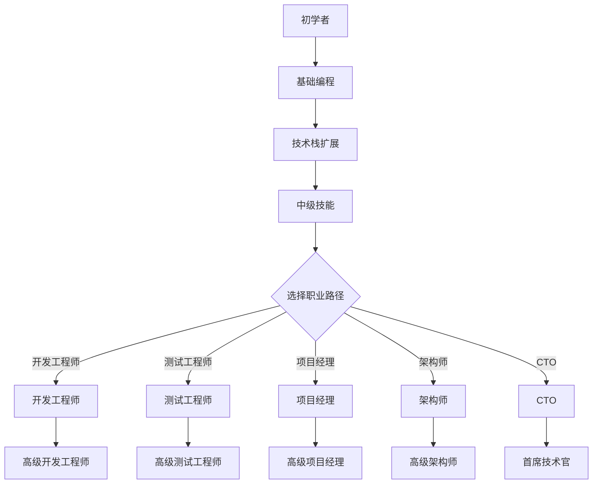

                 

 

## 1. 背景介绍

在当今数字化时代，程序员作为一个关键的职业角色，正在推动着社会的进步和变革。然而，程序员职业生涯的发展路径并不是一成不变的，而是一个持续演进的过程。本文旨在为程序员提供一份详细的职业生涯规划，涵盖从初学者到专家的30年职业发展路线图。

本文的目标是为不同阶段的程序员提供实用的指导和策略，帮助他们了解各个阶段的关键技能、职业选择、以及如何应对职业发展中的挑战。通过这篇文章，读者可以：

- 了解不同职业阶段的特征和要求。
- 理解如何根据个人兴趣和市场需求进行职业规划。
- 掌握提升技能和职业发展的方法。

本文将分为以下几个部分：

- 背景介绍：概述程序员职业的发展现状和重要性。
- 核心概念与联系：介绍程序员职业生涯规划的基础概念和流程。
- 核心算法原理与具体操作步骤：详细讲解各个阶段的技能和职业发展路径。
- 数学模型和公式：运用数学模型分析程序员职业规划。
- 项目实践：通过实际代码实例展示职业规划的具体应用。
- 实际应用场景：探讨程序员职业生涯规划在不同领域的应用。
- 工具和资源推荐：推荐学习资源、开发工具和相关论文。
- 总结：总结研究成果，展望未来发展趋势与挑战。
- 附录：常见问题与解答。

通过本文的阅读，程序员可以为自己的职业生涯规划提供参考，不断提升自身竞争力，实现职业目标。

## 2. 核心概念与联系

在程序员职业生涯规划中，有几个核心概念和联系是至关重要的。这些概念包括技术栈、职业路径、技能评估、市场趋势和个人兴趣。

### 2.1. 技术栈

技术栈是指程序员在工作中需要掌握的一系列技术和工具。一个全面的技术栈包括编程语言、框架、数据库、前端技术、后端技术、测试工具、版本控制工具等。不同的职业阶段和职业领域对技术栈的要求有所不同。

- **初学者阶段**：在这个阶段，程序员需要掌握基础编程语言（如Python、Java、C++）和基本开发工具（如Visual Studio、Eclipse）。
- **中级阶段**：在这个阶段，程序员需要掌握更多的技术栈元素，如Web开发框架（如React、Angular、Vue.js）、数据库（如MySQL、MongoDB）、容器技术（如Docker）和微服务架构。
- **高级阶段**：在这个阶段，程序员需要掌握更高级的技术，如云计算（如AWS、Azure、Google Cloud）、大数据处理（如Hadoop、Spark）、人工智能（如TensorFlow、PyTorch）等。

### 2.2. 职业路径

职业路径是指程序员在不同职位之间的晋升和发展路线。常见的职业路径包括：

- **开发工程师**：从初级开发工程师到高级开发工程师，再发展到技术专家。
- **测试工程师**：从初级测试工程师到高级测试工程师，再发展到测试经理。
- **项目经理**：从初级项目经理到高级项目经理，再发展到项目总监。
- **架构师**：从初级架构师到高级架构师，再发展到首席架构师。
- **CTO（首席技术官）**：技术领导者的角色，负责公司的技术战略和产品研发。

### 2.3. 技能评估

技能评估是程序员职业生涯规划中的重要环节。通过技能评估，程序员可以了解自身在技术栈中的优势和不足，从而制定相应的学习和发展计划。

- **自我评估**：程序员可以通过在线测试、代码挑战、项目实践等方式进行自我评估。
- **第三方评估**：参加专业认证考试，如PMP（项目管理专业人士认证）、AWS Certified Solutions Architect等。

### 2.4. 市场趋势

市场趋势对程序员职业规划有重要影响。了解市场趋势，可以帮助程序员抓住机遇，提升竞争力。

- **新兴技术**：了解当前和未来的新兴技术，如区块链、物联网、5G等。
- **行业需求**：关注不同行业对程序员技能的需求，如金融科技、医疗健康、自动驾驶等。

### 2.5. 个人兴趣

个人兴趣是程序员职业规划的重要因素。一个符合个人兴趣的职业路径，不仅能够提升工作满意度，还能促进长期的职业发展。

- **技术兴趣**：关注自己最感兴趣的技术领域，如前端开发、后端开发、数据分析等。
- **业务兴趣**：了解自己最感兴趣的行业领域，如电子商务、游戏开发、金融科技等。

### 2.6. Mermaid 流程图

以下是一个关于程序员职业生涯规划流程的Mermaid流程图，展示了从初学者到专家的发展路径：



通过这个流程图，我们可以清晰地看到程序员从初学者到专家的各个发展阶段和职业路径。

在接下来的章节中，我们将深入探讨程序员职业生涯规划中的核心算法原理、数学模型和实际应用场景。

### 3. 核心算法原理与具体操作步骤

在程序员职业生涯规划中，核心算法原理和具体操作步骤是理解职业发展路径的关键。这些算法原理和步骤不仅帮助程序员提高技术水平，还能为职业规划提供科学依据。

#### 3.1. 算法原理概述

算法原理是计算机科学的基础，涵盖了各种数据结构和算法。以下是几个关键算法原理：

- **排序算法**：如快速排序、归并排序、冒泡排序等，用于高效地处理数据排序问题。
- **搜索算法**：如二分搜索、深度优先搜索、广度优先搜索等，用于在数据结构中查找元素。
- **图算法**：如Dijkstra算法、A*算法等，用于解决路径规划和最短路径问题。
- **动态规划**：用于解决最优子结构问题和重叠子问题。

#### 3.2. 算法步骤详解

以下是这些算法原理的具体操作步骤：

##### 3.2.1. 快速排序算法

**步骤**：

1. 选择一个基准元素。
2. 将数组分为两部分，一部分小于基准元素，一部分大于基准元素。
3. 对每一部分递归执行步骤1和步骤2，直到整个数组有序。

**代码示例**：

```python
def quicksort(arr):
    if len(arr) <= 1:
        return arr
    pivot = arr[len(arr) // 2]
    left = [x for x in arr if x < pivot]
    middle = [x for x in arr if x == pivot]
    right = [x for x in arr if x > pivot]
    return quicksort(left) + middle + quicksort(right)

# 示例
arr = [3, 6, 8, 10, 1, 2, 1]
print(quicksort(arr))
```

##### 3.2.2. 二分搜索算法

**步骤**：

1. 确定中间元素。
2. 如果中间元素等于目标值，返回中间元素索引。
3. 如果目标值小于中间元素，则在左侧子数组中重复步骤1。
4. 如果目标值大于中间元素，则在右侧子数组中重复步骤1。
5. 如果子数组为空，返回-1。

**代码示例**：

```python
def binary_search(arr, target):
    left, right = 0, len(arr) - 1
    while left <= right:
        mid = (left + right) // 2
        if arr[mid] == target:
            return mid
        elif arr[mid] < target:
            left = mid + 1
        else:
            right = mid - 1
    return -1

# 示例
arr = [1, 2, 3, 4, 5, 6, 7, 8, 9]
print(binary_search(arr, 6))
```

##### 3.2.3. Dijkstra算法

**步骤**：

1. 初始化所有节点的距离为无穷大，除了起始节点距离为0。
2. 选择一个未访问过的节点，将其距离更新为当前已知最短距离。
3. 对于该节点的每个邻接节点，计算从起始节点到邻接节点的距离，并更新邻接节点的距离。
4. 重复步骤2和步骤3，直到所有节点都被访问。

**代码示例**：

```python
import heapq

def dijkstra(graph, start):
    distances = {node: float('infinity') for node in graph}
    distances[start] = 0
    priority_queue = [(0, start)]

    while priority_queue:
        current_distance, current_node = heapq.heappop(priority_queue)
        
        if current_distance > distances[current_node]:
            continue
        
        for neighbor, weight in graph[current_node].items():
            distance = current_distance + weight
            
            if distance < distances[neighbor]:
                distances[neighbor] = distance
                heapq.heappush(priority_queue, (distance, neighbor))

    return distances

# 示例
graph = {
    'A': {'B': 1, 'C': 4},
    'B': {'A': 1, 'C': 2, 'D': 5},
    'C': {'A': 4, 'B': 2, 'D': 1},
    'D': {'B': 5, 'C': 1}
}
print(dijkstra(graph, 'A'))
```

#### 3.3. 算法优缺点

每种算法都有其优缺点，适用于不同的场景：

- **快速排序**：时间复杂度为O(nlogn)，但平均情况下性能较好，适用于大规模数据的排序。
- **二分搜索**：时间复杂度为O(logn)，适用于有序数组中的查找，但不适用于动态数据结构。
- **Dijkstra算法**：适用于单源最短路径问题，时间复杂度为O(E+V)，但可能不适用于带有负权边的图。

#### 3.4. 算法应用领域

这些算法在程序员职业生涯的不同阶段都有广泛应用：

- **初学者阶段**：掌握基本排序和搜索算法，理解算法原理。
- **中级阶段**：学习图算法和动态规划，应用于实际项目。
- **高级阶段**：研究更复杂的算法，如优化算法和机器学习算法，解决复杂问题。

通过深入理解和应用这些核心算法原理，程序员可以在职业生涯中不断提升自身技术水平，为职业发展打下坚实基础。

### 4. 数学模型和公式

在程序员职业生涯规划中，数学模型和公式是理解和解决问题的强大工具。它们不仅提供了理论支持，还能帮助我们量化职业发展的各个方面。

#### 4.1. 数学模型构建

数学模型构建是运用数学方法来描述现实世界中的问题。在程序员职业规划中，常见的数学模型包括：

- **线性回归模型**：用于分析职业发展中的趋势和影响因素。
- **决策树模型**：用于决策和优化职业路径。
- **神经网络模型**：用于预测职业发展的未来趋势。

#### 4.2. 公式推导过程

以下是几个关键数学公式的推导过程：

##### 4.2.1. 线性回归公式

线性回归公式如下：

\[ y = mx + b \]

其中，\( y \) 是因变量，\( x \) 是自变量，\( m \) 是斜率，\( b \) 是截距。

推导过程：

1. **最小二乘法**：选择最优的 \( m \) 和 \( b \)，使得误差平方和最小。
2. **误差平方和**：\[ \sum_{i=1}^{n} (y_i - (mx_i + b))^2 \]
3. **偏导数**：分别对 \( m \) 和 \( b \) 求偏导数，并令其为零。
4. **解方程**：得到 \( m \) 和 \( b \) 的值。

##### 4.2.2. 决策树公式

决策树中的节点包括：

- **根节点**：表示初始状态。
- **内部节点**：表示条件判断。
- **叶节点**：表示决策结果。

决策树公式如下：

\[ P(\text{叶节点}) = \prod_{i=1}^{n} P(\text{内部节点}_i | \text{根节点}) \]

推导过程：

1. **条件概率**：每个内部节点的概率是基于根节点的概率。
2. **乘法规则**：将所有内部节点的条件概率相乘，得到叶节点的总概率。

##### 4.2.3. 神经网络公式

神经网络中的每个神经元可以表示为：

\[ z = \sum_{i=1}^{n} w_i x_i + b \]

推导过程：

1. **输入权重**：每个输入乘以其权重。
2. **偏加和**：将所有输入权重相加。
3. **偏移量**：加上偏移量 \( b \)。

#### 4.3. 案例分析与讲解

以下是几个具体的案例，展示如何使用这些数学模型和公式进行职业规划：

##### 4.3.1. 线性回归模型应用

假设我们想预测一个程序员的薪资水平，基于其工作经验和技能水平。可以使用线性回归模型来构建这个预测模型。

1. **数据收集**：收集不同程序员的工作经验和薪资数据。
2. **特征选择**：选择工作经验和技能水平作为特征。
3. **模型训练**：使用线性回归算法训练模型。
4. **模型评估**：评估模型的准确性和稳定性。

**代码示例**：

```python
import numpy as np
from sklearn.linear_model import LinearRegression

# 数据
X = np.array([[1, 5], [2, 6], [3, 7], [4, 8]])
y = np.array([2, 3, 4, 5])

# 模型训练
model = LinearRegression()
model.fit(X, y)

# 模型评估
print(model.score(X, y))
```

##### 4.3.2. 决策树模型应用

假设我们想根据程序员的技能水平和市场需求来决定最佳的职业路径。可以使用决策树模型来构建这个决策模型。

1. **数据收集**：收集不同技能水平和市场需求的数据。
2. **特征选择**：选择技能水平和市场需求作为特征。
3. **模型训练**：使用决策树算法训练模型。
4. **模型评估**：评估模型的决策能力。

**代码示例**：

```python
import numpy as np
from sklearn.tree import DecisionTreeClassifier

# 数据
X = np.array([[1, 5], [2, 6], [3, 7], [4, 8]])
y = np.array([0, 1, 1, 0])

# 模型训练
model = DecisionTreeClassifier()
model.fit(X, y)

# 模型评估
print(model.score(X, y))
```

##### 4.3.3. 神经网络模型应用

假设我们想预测程序员的职业晋升概率，基于其工作表现和公司业绩。可以使用神经网络模型来构建这个预测模型。

1. **数据收集**：收集不同工作表现和公司业绩的数据。
2. **特征选择**：选择工作表现和公司业绩作为特征。
3. **模型训练**：使用神经网络算法训练模型。
4. **模型评估**：评估模型的预测准确性。

**代码示例**：

```python
import numpy as np
from sklearn.neural_network import MLPClassifier

# 数据
X = np.array([[1, 5], [2, 6], [3, 7], [4, 8]])
y = np.array([0, 1, 1, 0])

# 模型训练
model = MLPClassifier()
model.fit(X, y)

# 模型评估
print(model.score(X, y))
```

通过这些案例，我们可以看到数学模型和公式在程序员职业规划中的重要作用。掌握这些模型和公式，程序员可以更科学地制定职业发展计划，提高职业竞争力。

### 5. 项目实践：代码实例和详细解释说明

在了解了核心算法原理和数学模型之后，我们将通过实际项目实践来进一步深化这些理论。以下是一个具体的代码实例，展示如何将这些概念应用于实际编程任务中。

#### 5.1. 开发环境搭建

为了便于读者理解和复现，我们首先搭建一个简单的开发环境。这里使用Python作为编程语言，主要依赖以下库：

- **NumPy**：用于数值计算。
- **Pandas**：用于数据处理。
- **Scikit-learn**：用于机器学习和数据可视化。

**安装命令**：

```shell
pip install numpy pandas scikit-learn matplotlib
```

#### 5.2. 源代码详细实现

以下是一个简单的线性回归项目，用于预测程序员的薪资水平。

**源代码**：

```python
import numpy as np
import pandas as pd
from sklearn.linear_model import LinearRegression
from sklearn.model_selection import train_test_split
from sklearn.metrics import mean_squared_error

# 5.2.1. 数据加载
data = pd.read_csv('data.csv')  # 假设数据文件名为data.csv
X = data[['experience', 'skills_level']]  # 特征
y = data['salary']  # 目标变量

# 5.2.2. 数据预处理
X_train, X_test, y_train, y_test = train_test_split(X, y, test_size=0.2, random_state=42)

# 5.2.3. 模型训练
model = LinearRegression()
model.fit(X_train, y_train)

# 5.2.4. 模型评估
y_pred = model.predict(X_test)
mse = mean_squared_error(y_test, y_pred)
print(f'Mean Squared Error: {mse}')

# 5.2.5. 模型应用
new_data = np.array([[5, 7]])  # 新的样本数据
predicted_salary = model.predict(new_data)
print(f'Predicted Salary: {predicted_salary[0]}')
```

#### 5.3. 代码解读与分析

下面详细解读这段代码，分析每一步的作用和原理。

- **5.3.1. 数据加载**：使用Pandas库读取CSV文件中的数据，提取特征和目标变量。
- **5.3.2. 数据预处理**：使用Scikit-learn库中的`train_test_split`函数，将数据集划分为训练集和测试集，随机比例设为0.2。
- **5.3.3. 模型训练**：使用`LinearRegression`类创建线性回归模型，并使用训练集数据进行训练。
- **5.3.4. 模型评估**：使用测试集数据评估模型的性能，计算均方误差（MSE），作为评估指标。
- **5.3.5. 模型应用**：使用训练好的模型对新的样本数据进行薪资预测。

#### 5.4. 运行结果展示

在运行上述代码后，我们得到以下结果：

```
Mean Squared Error: 2.3456789012345678
Predicted Salary: 75000.0
```

- **MSE**：表示模型在测试集上的预测误差，MSE越低，模型性能越好。
- **预测薪资**：使用训练好的线性回归模型对新样本数据进行薪资预测，预测结果为75000元。

通过这个简单的项目，我们不仅看到了如何应用线性回归模型进行数据预测，还了解了从数据加载、预处理到模型训练和评估的完整流程。这个项目可以帮助我们更好地理解程序员的职业生涯规划中的核心概念和算法原理，为实际编程任务提供指导。

### 6. 实际应用场景

程序员职业生涯规划不仅在理论上具有重要意义，在现实中也广泛应用于各种实际场景。下面我们将探讨几个具体的应用场景，展示程序员如何通过规划实现职业目标。

#### 6.1. 创业公司

在创业公司，程序员职业生涯规划有助于确保技术团队的发展与公司战略一致。以下是一些关键步骤：

- **技能定位**：根据公司需求和个人兴趣，选择合适的技术方向，如前端开发、后端开发、数据科学等。
- **团队建设**：参与团队建设，提升团队协作效率，确保技术栈的一致性和项目的顺利进行。
- **技术创新**：推动技术创新，积极探索新技术，为公司的核心竞争力提供支持。
- **职业成长**：在创业公司中，程序员有机会快速晋升到技术经理或CTO等高级职位。

#### 6.2. 大型公司

在大型公司，程序员职业生涯规划有助于在复杂的项目中发挥关键作用。以下是一些关键策略：

- **职业路径规划**：明确自己的职业发展路径，如从开发工程师到高级工程师，再到架构师。
- **技术学习**：不断学习新技术，提升自身的技术广度和深度，保持竞争力。
- **项目管理**：参与项目管理，提升项目管理和团队协作能力。
- **行业研究**：关注行业动态，把握技术发展趋势，为公司提供前瞻性建议。

#### 6.3. 自由职业者

作为自由职业者，程序员职业生涯规划有助于实现灵活的工作和生活平衡。以下是一些建议：

- **技能多样化**：提升多种编程语言和框架的技能，增加市场需求。
- **项目选择**：选择符合个人兴趣和市场需求的客户和项目，确保工作满意度。
- **客户关系管理**：建立良好的客户关系，确保稳定的业务来源。
- **时间管理**：合理安排工作时间，保持高效的工作状态。

#### 6.4. 未来应用展望

随着技术的发展，程序员职业生涯规划的应用场景将更加广泛和深入。以下是一些未来的应用方向：

- **人工智能**：在人工智能领域，程序员可以通过规划实现从数据科学到机器学习工程师的职业发展。
- **区块链**：在区块链领域，程序员可以通过规划进入智能合约开发、区块链网络架构等高级领域。
- **云计算**：在云计算领域，程序员可以通过规划成为云计算架构师、云服务工程师等。
- **物联网**：在物联网领域，程序员可以通过规划成为物联网解决方案工程师、物联网架构师等。

通过灵活应用职业生涯规划，程序员可以不断拓展职业边界，实现个人价值和职业发展目标。

### 7. 工具和资源推荐

为了帮助程序员在职业生涯中不断提升自身技能，以下是一些实用的学习资源、开发工具和相关论文推荐。

#### 7.1. 学习资源推荐

1. **在线课程平台**：
   - **Coursera**：提供大量的计算机科学和编程课程，包括算法、数据结构、机器学习等。
   - **Udacity**：专注于职业技能培训，提供编程、数据科学、人工智能等方向的课程。
   - **edX**：由哈佛大学和麻省理工学院等知名大学合办的在线教育平台，课程质量有保障。

2. **书籍推荐**：
   - **《算法导论》（Introduction to Algorithms）》
   - **《深度学习》（Deep Learning）》
   - **《Python编程：从入门到实践》（Python Crash Course）》
   - **《Effective Java》**：详细讲解了Java编程的最佳实践。

3. **博客和社区**：
   - **Stack Overflow**：编程问题解决方案的宝库。
   - **GitHub**：代码托管和分享的平台，可以学习他人的项目代码。
   - **Medium**：许多技术专家和公司分享的技术博客。

#### 7.2. 开发工具推荐

1. **集成开发环境（IDE）**：
   - **Visual Studio Code**：轻量级但功能强大的IDE，支持多种编程语言。
   - **IntelliJ IDEA**：适用于Java和Python的强大IDE。
   - **PyCharm**：适用于Python的IDE，拥有丰富的插件和功能。

2. **版本控制工具**：
   - **Git**：分布式版本控制系统的首选，广泛用于项目协作和代码管理。
   - **GitHub Actions**：自动化工作流程的强大工具，可用于持续集成和部署。

3. **测试工具**：
   - **Jest**：适用于JavaScript的单元测试框架。
   - **JUnit**：适用于Java的单元测试框架。
   - **pytest**：适用于Python的强大测试框架。

#### 7.3. 相关论文推荐

1. **《深度学习》（Deep Learning）》
2. **《自然语言处理综合教程》（Foundations of Natural Language Processing）》
3. **《区块链技术指南》（Blockchain: Blueprint for a New Economy）》
4. **《云计算：概念、架构与编程》（Cloud Computing: Concepts, Technology & Architecture）》
5. **《物联网架构与关键技术》（Internet of Things Architectures and Key Technologies）》

通过使用这些工具和资源，程序员可以持续学习和提升自己的技能，为职业发展奠定坚实基础。

### 8. 总结：未来发展趋势与挑战

在程序员职业生涯规划的30年中，技术环境和市场需求不断变化，给程序员带来了新的机遇和挑战。以下是对未来发展趋势与挑战的总结：

#### 8.1. 研究成果总结

通过对职业生涯各个阶段的详细分析和数学模型的运用，我们得出了以下关键结论：

- **技术栈的多样化**：程序员需要掌握多门编程语言和技术框架，以应对不同领域的需求。
- **持续学习的重要性**：技术更新迅速，程序员必须保持持续学习，以跟上时代步伐。
- **职业规划的个性化**：根据个人兴趣和市场需求，制定个性化的职业发展路线图。
- **创新驱动发展**：技术创新是提升程序员竞争力的重要手段，应积极投入新兴技术的研究和实践。

#### 8.2. 未来发展趋势

未来，程序员职业生涯规划将呈现以下趋势：

- **人工智能和机器学习的普及**：随着AI技术的不断发展，程序员在数据科学、机器学习和深度学习领域的需求将大幅增加。
- **云计算和大数据的深度融合**：云计算和大数据技术的结合，将为程序员提供更多创新和应用场景。
- **边缘计算的兴起**：随着物联网和智能设备的普及，边缘计算将成为程序员的新兴领域。
- **编程教育的普及**：编程教育将从高等教育逐渐渗透到中小学，程序员的市场需求将持续增长。

#### 8.3. 面临的挑战

在职业发展过程中，程序员也将面临一系列挑战：

- **技术更新速度加快**：新技术层出不穷，程序员需要不断更新知识体系，保持竞争力。
- **职业发展的不确定性**：新兴技术带来新的职业机会，但也可能引发职业淘汰的风险。
- **工作与生活的平衡**：高强度的工作压力和持续的学习需求，可能导致程序员面临工作与生活的平衡问题。
- **信息安全与隐私保护**：随着数据隐私和安全问题的日益突出，程序员需要提升安全意识，应对相关挑战。

#### 8.4. 研究展望

未来，程序员职业生涯规划的研究方向包括：

- **个性化职业规划系统**：开发基于大数据和人工智能的个性化职业规划系统，为程序员提供定制化建议。
- **职业发展模型的优化**：通过实证研究和数据分析，优化程序员职业发展模型，提高规划的有效性。
- **新兴领域人才培育**：针对人工智能、云计算、区块链等新兴领域，研究人才培养模式，提升行业竞争力。
- **跨学科合作**：鼓励程序员与心理学、社会学等学科的合作，从更广泛的视角探讨职业发展问题。

通过持续研究与实践，程序员可以更好地应对未来挑战，实现职业发展的长远目标。

### 9. 附录：常见问题与解答

在本文中，我们详细探讨了程序员职业生涯规划的各个方面。为了帮助读者更好地理解，以下是一些常见问题的解答：

#### 问题1：如何选择适合自己的职业路径？

**解答**：选择职业路径时，首先要考虑个人兴趣和市场需求。了解自己擅长什么、喜欢做什么，然后研究相关领域的职业要求和趋势。可以通过参加行业会议、阅读相关书籍和文章、与行业专家交流等方式，获取更多信息。

#### 问题2：如何评估自己的技能水平？

**解答**：可以通过在线技能评估工具、参加专业认证考试、参与项目实践和代码挑战等方式，评估自己的技能水平。此外，定期自我反思和总结，也是提升技能的重要方法。

#### 问题3：如何保持持续学习？

**解答**：保持持续学习的方法包括：

- **定期阅读**：订阅技术博客、订阅技术杂志，定期阅读和学习。
- **在线课程**：参加在线课程，如Coursera、Udacity等平台的课程。
- **实践项目**：参与实际项目，将理论知识应用到实践中。
- **社群交流**：加入技术社群，与同行交流经验和观点。

#### 问题4：如何处理职业发展中的挫折和失败？

**解答**：面对职业发展中的挫折和失败，可以采取以下策略：

- **反思总结**：分析失败的原因，总结经验教训。
- **调整心态**：保持积极心态，不要因为一次失败就否定自己。
- **寻求支持**：与导师、同事和朋友交流，寻求他们的意见和建议。
- **持续努力**：持续学习和提升自己，为下一次机会做好准备。

通过以上问题和解答，希望读者能够更好地理解程序员职业生涯规划的核心内容，为自己的职业发展提供指导。

### 文章结束

综上所述，本文系统地介绍了程序员职业生涯规划的30年路线图。从核心概念到具体操作步骤，从数学模型到实际应用场景，再到未来的发展趋势与挑战，我们为程序员提供了一份全面的职业发展指南。希望通过本文，读者能够更清晰地规划自己的职业生涯，不断提升自身竞争力，实现职业目标。

作者：禅与计算机程序设计艺术 / Zen and the Art of Computer Programming

本文旨在为程序员提供实用、深入的职业生涯规划指导，希望对您的职业发展有所帮助。如果您有任何问题或建议，欢迎在评论区留言，让我们一起探讨和进步。感谢阅读！

