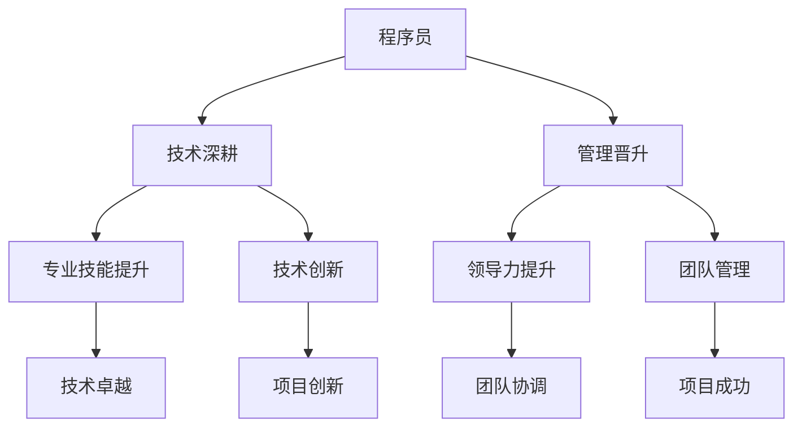

                 

关键词：程序员职业规划，技术深耕，管理晋升，职业发展，技能提升

> 摘要：本文将探讨程序员在职业发展过程中面临的两种主要路径：技术深耕和管理晋升。通过分析两者之间的区别、优势和挑战，为程序员提供明确的职业规划建议。

## 1. 背景介绍

在信息技术飞速发展的今天，程序员作为科技创新的重要推动力量，其职业发展路径日益多样化。面对技术不断迭代和市场需求的变化，程序员需要在不同的发展方向上做出明智的选择。本文旨在探讨程序员在职业规划中面临的两种主要路径：技术深耕和管理晋升。

### 1.1 技术深耕

技术深耕是指程序员在某一技术领域持续深入学习和实践，不断提升专业技能，以成为行业专家。这种路径强调技术能力和专业知识的积累，追求技术卓越和创新。

### 1.2 管理晋升

管理晋升是指程序员通过提升管理能力和领导力，逐步向管理层发展，承担更多的责任和决策。这种路径关注团队合作、项目管理和组织协调，注重领导力和人际交往能力。

## 2. 核心概念与联系

为了更好地理解技术深耕和管理晋升的区别和联系，我们可以使用Mermaid流程图来展示两者的核心概念和关系。



从流程图中可以看出，技术深耕和管理晋升分别关注程序员在专业技能和领导力方面的提升。两者在一定程度上相互促进，但又有明确的区别。

## 3. 核心算法原理 & 具体操作步骤

### 3.1 算法原理概述

技术深耕和管理晋升的核心算法原理可以概括为以下几点：

- 技术深耕：通过持续学习和实践，不断提升专业技能和解决问题的能力。
- 管理晋升：通过学习和实践，不断提升领导力和团队管理能力。

### 3.2 算法步骤详解

#### 3.2.1 技术深耕

1. 确定兴趣领域：选择一个感兴趣的技术领域，如前端开发、后端开发、人工智能等。
2. 深入学习：通过阅读技术书籍、参加线上课程和实战项目，深入学习所选领域的知识和技能。
3. 实践应用：将所学知识应用到实际项目中，解决具体问题，不断提升实践经验。
4. 持续学习：关注行业动态和技术趋势，持续更新知识体系，保持技术领先。

#### 3.2.2 管理晋升

1. 增强领导力：通过阅读相关书籍、参加培训和实际工作，增强领导力和团队管理能力。
2. 提升沟通能力：学会有效沟通，增强团队协作，提高工作效率。
3. 担任项目负责人：逐步承担更多责任，担任项目负责人，带领团队完成项目。
4. 培养团队精神：关注团队成员的成长和发展，建立良好的团队氛围。

### 3.3 算法优缺点

#### 3.3.1 技术深耕

优点：
- 提升专业技能，成为行业专家。
- 为个人职业发展提供坚实基础。
- 增强解决问题的能力。

缺点：
- 职业发展路径相对狭窄。
- 可能缺乏领导力和团队管理经验。

#### 3.3.2 管理晋升

优点：
- 拓宽职业发展路径，提升综合能力。
- 增加职场竞争力，提升薪资水平。
- 为企业创造更多价值。

缺点：
- 需要付出更多时间和精力。
- 可能会削弱技术深度。

### 3.4 算法应用领域

技术深耕和管理晋升在不同领域有不同的应用：

- 技术深耕：适用于技术创新、软件开发、系统优化等领域。
- 管理晋升：适用于项目经理、技术团队领导、产品经理等领域。

## 4. 数学模型和公式 & 详细讲解 & 举例说明

### 4.1 数学模型构建

技术深耕和管理晋升的数学模型可以简化为以下公式：

\[ 职业发展 = f(专业技能, 领导力)\]

其中，专业技能和领导力分别代表程序员在技术深耕和管理晋升过程中所积累的能力。

### 4.2 公式推导过程

假设程序员的职业发展水平为 \( D \)，专业技能水平为 \( S \)，领导力水平为 \( L \)。根据题目中的核心概念，我们可以得出以下推导：

\[ D = \frac{S + L}{2} \]

### 4.3 案例分析与讲解

#### 案例一：技术深耕

假设程序员A在技术深耕方面具有很高的专业技能水平 \( S_1 \)，但在领导力方面较弱 \( L_1 \)。根据公式，他的职业发展水平为：

\[ D_1 = \frac{S_1 + L_1}{2} \]

#### 案例二：管理晋升

假设程序员B在管理晋升方面具有很高的领导力水平 \( L_2 \)，但在专业技能方面较弱 \( S_2 \)。根据公式，他的职业发展水平为：

\[ D_2 = \frac{S_2 + L_2}{2} \]

通过以上案例分析，我们可以看到技术深耕和管理晋升在数学模型上的区别和联系。

## 5. 项目实践：代码实例和详细解释说明

### 5.1 开发环境搭建

在本节中，我们将以一个简单的Python项目为例，展示如何进行开发环境搭建。

1. 安装Python：在官网上下载Python安装包并安装。
2. 安装PyCharm：下载PyCharm社区版并安装。
3. 创建Python项目：在PyCharm中创建一个新的Python项目，选择合适的Python解释器和虚拟环境。

### 5.2 源代码详细实现

以下是项目的主要代码实现：

```python
# 示例：计算两个数的和

def add_numbers(a, b):
    return a + b

# 主函数
def main():
    num1 = int(input("请输入第一个数："))
    num2 = int(input("请输入第二个数："))
    result = add_numbers(num1, num2)
    print(f"{num1} 和 {num2} 的和为：{result}")

if __name__ == "__main__":
    main()
```

### 5.3 代码解读与分析

在上面的代码中，我们定义了一个名为 `add_numbers` 的函数，用于计算两个数的和。主函数 `main` 获取用户输入的两个数，调用 `add_numbers` 函数计算结果，并输出结果。

### 5.4 运行结果展示

运行上述代码，输入两个数，即可得到它们的和。例如：

```
请输入第一个数：5
请输入第二个数：10
5 和 10 的和为：15
```

## 6. 实际应用场景

### 6.1 技术深耕在软件开发中的应用

技术深耕在软件开发中具有重要意义。通过深入学习和实践，程序员可以提升专业技能，解决复杂问题，提高项目质量。以下是一个实际应用案例：

**案例：基于Python的Web开发**

假设我们正在开发一个基于Python的Web应用。通过深入学习Django框架，程序员可以掌握Web开发的核心技术和最佳实践。在项目实践中，程序员可以利用Django框架快速构建功能齐全、易于维护的Web应用。

### 6.2 管理晋升在项目管理中的应用

管理晋升在项目管理中同样至关重要。通过提升领导力和团队管理能力，项目经理可以更好地协调团队成员，提高项目效率，确保项目成功。以下是一个实际应用案例：

**案例：敏捷开发团队管理**

在一个敏捷开发团队中，项目经理需要具备良好的沟通能力和团队管理能力。通过组织每日站会、迭代评审和回顾会议，项目经理可以确保团队成员了解项目进展，及时解决问题，提高团队协作效率。

## 7. 工具和资源推荐

### 7.1 学习资源推荐

- **技术书籍**：《代码大全》、《设计模式：可复用面向对象软件的基础》
- **在线课程**：Coursera、edX、Udemy等平台上的编程课程
- **技术社区**：GitHub、Stack Overflow、CSDN

### 7.2 开发工具推荐

- **集成开发环境**：PyCharm、Visual Studio Code
- **版本控制系统**：Git、GitHub
- **调试工具**：Postman、JMeter

### 7.3 相关论文推荐

- **技术论文**：《分布式计算系统：设计原理与实现方法》
- **管理论文**：《敏捷开发方法：实践与思考》
- **趋势论文**：《人工智能在软件开发中的应用》

## 8. 总结：未来发展趋势与挑战

### 8.1 研究成果总结

通过本文的探讨，我们可以得出以下研究成果：

- 技术深耕和管理晋升是程序员职业发展的两种主要路径。
- 技术深耕强调专业技能的提升，管理晋升关注领导力和团队管理能力。
- 技术深耕和管理晋升在一定程度上相互促进，但又有明确的区别。

### 8.2 未来发展趋势

未来，随着技术的不断进步和市场需求的变化，程序员在职业规划中将面临更多选择。以下是一些发展趋势：

- 技术深耕与管理晋升的融合：越来越多的程序员将同时关注技术深耕和管理晋升，实现综合能力提升。
- 跨学科发展：程序员将在不同领域进行跨学科学习，拓展职业发展空间。
- 自主学习和知识共享：程序员将更加重视自主学习和知识共享，不断提升个人价值。

### 8.3 面临的挑战

在未来的职业发展中，程序员将面临以下挑战：

- 技术更新速度快：程序员需要不断学习新知识，跟上技术发展的步伐。
- 工作压力增大：随着工作职责的增加，程序员需要提高工作效率，应对更大的工作压力。
- 职业发展路径选择：程序员需要根据自身兴趣和优势，做出明智的职业发展路径选择。

### 8.4 研究展望

本文对程序员职业规划中的技术深耕和管理晋升进行了初步探讨。未来，我们将进一步研究以下方向：

- 技术深耕与管理晋升的量化评估：研究如何量化评估程序员在技术深耕和管理晋升方面的能力。
- 跨学科职业发展路径：探讨程序员在跨学科领域的职业发展路径和策略。
- 职业发展中的心理因素：研究程序员在职业规划中的心理因素，提高职业规划的针对性和有效性。

## 9. 附录：常见问题与解答

### 9.1 技术深耕与管理晋升的关系是什么？

技术深耕和管理晋升是程序员职业发展的两种主要路径。技术深耕强调专业技能的提升，管理晋升关注领导力和团队管理能力。两者在一定程度上相互促进，但又有明确的区别。

### 9.2 如何选择职业发展路径？

选择职业发展路径需要考虑个人兴趣、优势和市场需求。如果对技术有浓厚兴趣，希望成为行业专家，可以选择技术深耕；如果关注团队管理和项目协调，希望拓宽职业发展路径，可以选择管理晋升。

### 9.3 技术深耕和管理晋升哪个更有前途？

技术深耕和管理晋升各有前途，取决于个人的兴趣和市场需求。技术深耕可以提升个人专业能力，成为行业专家；管理晋升可以拓宽职业发展路径，提高职场竞争力。选择哪个路径更有前途，需要根据自身情况做出决策。

---

作者：禅与计算机程序设计艺术 / Zen and the Art of Computer Programming

