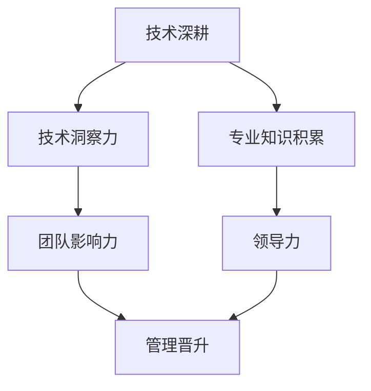

                 

 **关键词**：程序员职业规划、技术深耕、管理晋升、个人发展、技能提升

**摘要**：本文旨在探讨程序员在职业生涯中面临的两个主要发展路径：技术深耕和管理晋升。通过分析两者之间的区别、优势和挑战，帮助程序员更好地规划自己的职业发展路径，以实现个人和职业的双赢。

## 1. 背景介绍

在快速发展的科技时代，程序员的职业选择日益多样。许多程序员在职业发展的道路上，面临着技术深耕和管理晋升两条不同的路径。技术深耕意味着程序员致力于提升自己在某一技术领域的专业能力，追求成为领域专家。而管理晋升则是指程序员转向管理层，逐步担任项目经理、技术经理等职位，负责团队管理和项目协调。

然而，技术深耕和管理晋升并非截然对立的选择，而是相辅相成的。一个成功的程序员，可能会在职业生涯中经历从技术到管理的转变，或者同时保持技术和管理方面的成长。本文将深入探讨这两条职业发展路径，帮助程序员做出更明智的职业决策。

### 1.1 程序员职业发展的重要性

程序员作为信息技术行业的中坚力量，其职业发展对于整个行业的繁荣和创新至关重要。一个高效的程序员不仅能够提升个人收入和生活质量，还能为企业带来巨大的价值。随着技术的不断进步，程序员需要不断学习和适应新技术，以保持自身的竞争力。

### 1.2 技术深耕与管理的辩证关系

技术深耕和管理晋升虽然路径不同，但并非孤立。技术深耕为程序员提供了深厚的专业背景，使其在技术决策中更具影响力；而管理晋升则使程序员能够发挥更大的领导力，推动团队协作和创新。

## 2. 核心概念与联系

在深入探讨技术深耕和管理晋升之前，我们需要理解一些核心概念和它们之间的联系。

### 2.1 技术深耕

技术深耕是指程序员在某一技术领域持续深入学习和实践，逐步成为该领域的专家。技术深耕的核心在于积累丰富的技术经验、掌握前沿技术动态和解决复杂技术问题的能力。

### 2.2 管理晋升

管理晋升是指程序员从技术角色逐步转向管理层，负责团队管理和项目协调。管理晋升的关键在于领导力、沟通能力和团队协作。

### 2.3 技术深耕与管理的联系

技术深耕和管理晋升并非孤立，它们之间存在紧密的联系。一个成功的技术专家，往往具备较强的技术背景和解决问题的能力，这使其在担任管理职位时能够更好地理解和指导团队。而一个优秀的管理者，通常具备较强的技术洞察力和问题解决能力，这有助于其更好地管理团队和项目。

下面是一个用Mermaid绘制的流程图，展示了技术深耕和管理晋升之间的联系。



## 3. 核心算法原理 & 具体操作步骤

### 3.1 算法原理概述

在程序员的职业规划中，算法原理起到了至关重要的作用。技术深耕的核心在于不断学习和掌握新的算法原理，并将其应用于实际项目中。以下是一些核心算法原理：

- **数据结构**：了解数据结构的原理和实现，如数组、链表、栈、队列、树、图等，对于解决复杂问题具有重要意义。
- **算法复杂度**：掌握算法的时间复杂度和空间复杂度分析，有助于评估算法的效率。
- **动态规划**：动态规划是一种常用的算法设计技巧，适用于解决最优化问题。
- **贪心算法**：贪心算法是一种局部最优解的策略，常用于解决某些特定类型的问题。
- **分治算法**：分治算法将复杂问题分解为若干个更小的子问题，逐一解决，再将子问题的解合并为原问题的解。

### 3.2 算法步骤详解

#### 3.2.1 数据结构

数据结构的算法步骤主要包括：

1. 创建数据结构实例。
2. 添加、删除、查询元素。
3. 分析数据结构的时间复杂度和空间复杂度。

#### 3.2.2 算法复杂度

算法复杂度的分析步骤包括：

1. 确定算法的输入规模。
2. 分析算法的时间复杂度（如 O(n)、O(n^2) 等）。
3. 分析算法的空间复杂度（如 O(1)、O(n) 等）。

#### 3.2.3 动态规划

动态规划的基本步骤包括：

1. 确定状态变量和状态转移方程。
2. 初始化边界条件。
3. 计算状态值，从底向上或从顶向下。
4. 返回最终的状态值。

#### 3.2.4 贪心算法

贪心算法的基本步骤包括：

1. 确定问题的贪心选择标准。
2. 在每个决策点上，选择当前最优解。
3. 逐步构建问题的最终解。

#### 3.2.5 分治算法

分治算法的基本步骤包括：

1. 确定分治策略，将问题划分为若干个子问题。
2. 递归解决子问题。
3. 将子问题的解合并为原问题的解。

### 3.3 算法优缺点

每种算法都有其优缺点：

- **数据结构**：优点在于高效的数据存储和访问，缺点是实现复杂。
- **算法复杂度**：优点在于帮助评估算法的效率，缺点是分析过程可能较为复杂。
- **动态规划**：优点在于解决最优化问题，缺点是可能产生大量的重叠子问题。
- **贪心算法**：优点在于简单高效，缺点是可能只适用于特定类型的问题。
- **分治算法**：优点在于递归解决子问题，缺点是可能产生大量的递归调用。

### 3.4 算法应用领域

算法在各个领域的应用如下：

- **数据结构**：广泛应用于数据库、搜索引擎、网络传输等领域。
- **算法复杂度**：用于评估算法的效率，指导算法优化。
- **动态规划**：常用于最优化问题，如背包问题、最长公共子序列等。
- **贪心算法**：常用于图论、计算几何等领域。
- **分治算法**：常用于排序、搜索等领域。

## 4. 数学模型和公式 & 详细讲解 & 举例说明

在程序员的技术深耕过程中，数学模型和公式是不可或缺的工具。以下是一些常用的数学模型和公式，以及它们的详细讲解和举例说明。

### 4.1 数学模型构建

数学模型的构建通常包括以下几个步骤：

1. **问题分析**：明确问题的目标、条件和约束。
2. **变量定义**：定义影响问题的变量，并给出它们的取值范围。
3. **建立方程**：根据问题的条件和约束，建立相应的方程或方程组。
4. **求解方法**：选择合适的求解方法，如代数法、数值法等。

### 4.2 公式推导过程

以下是一个简单的线性规划问题的公式推导过程：

1. **目标函数**：最大化或最小化目标函数，如最大化利润或最小化成本。
2. **约束条件**：列出影响目标函数的约束条件，如生产资源的限制、市场需求等。
3. **构建方程**：将目标函数和约束条件转化为线性方程。
4. **求解方程**：使用线性规划算法求解方程组，得到最优解。

### 4.3 案例分析与讲解

以下是一个简单的线性规划问题案例，用于生产两种产品A和B，每种产品需要的资源和市场需求如下：

- **产品A**：
  - 每单位产品A需要2小时生产时间和3单位原材料。
  - 每单位产品A的利润为100元。
- **产品B**：
  - 每单位产品B需要1小时生产时间和2单位原材料。
  - 每单位产品B的利润为150元。

假设每天工厂有8小时生产时间和12单位原材料，求每天生产产品A和产品B的最优组合，以最大化总利润。

1. **目标函数**：最大化总利润。
   \[ \text{最大化} \ P = 100x + 150y \]
   其中，\( x \) 和 \( y \) 分别表示产品A和产品B的生产量。

2. **约束条件**：
   - 生产时间限制：
     \[ 2x + y \leq 8 \]
   - 原材料限制：
     \[ 3x + 2y \leq 12 \]

3. **求解方法**：使用线性规划求解器（如Python的Scipy库）求解。

4. **结果分析**：求解结果为 \( x = 2 \)，\( y = 2 \)，即每天生产2单位产品A和2单位产品B，总利润为 \( 100 \times 2 + 150 \times 2 = 500 \) 元。

通过这个案例，我们可以看到数学模型和公式的应用过程，以及如何通过线性规划求解最优解。

## 5. 项目实践：代码实例和详细解释说明

为了更好地理解技术深耕和管理晋升的实际应用，我们通过一个具体的项目实践进行说明。该项目是一个简单的在线书店系统，包括用户注册、图书管理、购物车和订单处理等功能。

### 5.1 开发环境搭建

1. **软件环境**：
   - 开发语言：Java
   - 服务器：Apache Tomcat
   - 数据库：MySQL
   - 框架：Spring Boot、MyBatis

2. **硬件环境**：
   - 服务器：一台具备一定性能的虚拟机

### 5.2 源代码详细实现

以下是项目的关键代码实现，我们将逐段代码进行详细解释。

#### 5.2.1 用户注册功能

```java
@RestController
@RequestMapping("/user")
public class UserController {

    @Autowired
    private UserService userService;

    @PostMapping("/register")
    public ResponseEntity<?> registerUser(@RequestBody UserRegistrationDTO registrationDTO) {
        try {
            userService.registerUser(registrationDTO);
            return ResponseEntity.ok("User registered successfully");
        } catch (Exception e) {
            return ResponseEntity.badRequest().body("Error registering user: " + e.getMessage());
        }
    }
}
```

**代码解释**：该段代码实现了用户注册功能，通过`UserRegistrationDTO`接收用户注册信息，调用`UserService`中的`registerUser`方法进行注册，并返回相应结果。

#### 5.2.2 图书管理功能

```java
@RestController
@RequestMapping("/book")
public class BookController {

    @Autowired
    private BookService bookService;

    @GetMapping
    public ResponseEntity<List<BookDTO>> getAllBooks() {
        return ResponseEntity.ok(bookService.getAllBooks());
    }

    @PostMapping
    public ResponseEntity<BookDTO> createBook(@RequestBody BookDTO bookDTO) {
        return ResponseEntity.ok(bookService.createBook(bookDTO));
    }
}
```

**代码解释**：该段代码实现了图书管理功能，包括获取所有图书和创建新图书。`BookService`负责业务逻辑处理，`BookController`负责接收HTTP请求并返回响应。

#### 5.2.3 购物车功能

```java
@RestController
@RequestMapping("/cart")
public class CartController {

    @Autowired
    private CartService cartService;

    @PostMapping
    public ResponseEntity<String> addBookToCart(@RequestParam("userId") Long userId,
                                                @RequestParam("bookId") Long bookId) {
        cartService.addBookToCart(userId, bookId);
        return ResponseEntity.ok("Book added to cart");
    }

    @GetMapping
    public ResponseEntity<CartDTO> getCart(@RequestParam("userId") Long userId) {
        return ResponseEntity.ok(cartService.getCart(userId));
    }
}
```

**代码解释**：该段代码实现了购物车功能，包括添加图书到购物车和获取购物车信息。`CartService`负责处理购物车相关的业务逻辑，`CartController`负责接收HTTP请求并返回响应。

#### 5.2.4 订单处理功能

```java
@RestController
@RequestMapping("/order")
public class OrderController {

    @Autowired
    private OrderService orderService;

    @PostMapping
    public ResponseEntity<OrderDTO> createOrder(@RequestBody OrderDTO orderDTO) {
        return ResponseEntity.ok(orderService.createOrder(orderDTO));
    }

    @GetMapping("/{orderId}")
    public ResponseEntity<OrderDTO> getOrder(@PathVariable Long orderId) {
        return ResponseEntity.ok(orderService.getOrder(orderId));
    }
}
```

**代码解释**：该段代码实现了订单处理功能，包括创建订单和获取订单信息。`OrderService`负责处理订单相关的业务逻辑，`OrderController`负责接收HTTP请求并返回响应。

### 5.3 代码解读与分析

通过以上代码实例，我们可以看到项目的关键功能模块和业务逻辑的实现。每个模块都通过RESTful API进行通信，便于前后端分离和模块化开发。此外，项目采用了Spring Boot框架，简化了开发过程，并提供了丰富的组件和工具。

在代码分析方面，需要注意以下几点：

1. **代码结构**：保持代码结构清晰，避免过度耦合和冗余。
2. **异常处理**：合理处理异常，确保系统稳定性和用户体验。
3. **安全性**：关注数据安全和隐私保护，如使用HTTPS协议、加密敏感数据等。

### 5.4 运行结果展示

以下是在线书店系统的运行结果展示：

1. **用户注册**：
   - 访问路径：`POST /user/register`
   - 请求参数：用户名、密码、邮箱等
   - 返回结果：注册成功或错误提示

2. **图书管理**：
   - 访问路径：`GET /book`（获取所有图书）、`POST /book`（创建新图书）
   - 请求参数：图书信息（书名、作者、价格等）
   - 返回结果：图书列表或创建成功/失败提示

3. **购物车功能**：
   - 访问路径：`POST /cart`（添加图书到购物车）、`GET /cart`（获取购物车信息）
   - 请求参数：用户ID、图书ID
   - 返回结果：添加成功或购物车信息

4. **订单处理**：
   - 访问路径：`POST /order`（创建订单）、`GET /order/{orderId}`（获取订单信息）
   - 请求参数：订单信息（用户ID、购物车ID、收货地址等）
   - 返回结果：创建成功或订单详情

通过以上展示，我们可以看到项目的功能实现和运行效果，为程序员的技术深耕和管理晋升提供了实际参考。

## 6. 实际应用场景

技术深耕和管理晋升在实际应用场景中具有广泛的适用性。以下是一些典型的应用场景：

### 6.1 技术深耕

#### 场景1：软件开发公司

在软件开发公司，技术深耕的程序员通常负责核心模块的开发和优化。他们需要深入了解各种编程语言、框架和数据库，解决复杂的技术问题，提升系统的性能和稳定性。例如，一个专注于后端开发的程序员，可能会深入研究Spring框架、MySQL数据库和分布式系统架构。

#### 场景2：互联网公司

在互联网公司，技术深耕的程序员通常负责算法研究和优化。他们需要不断学习最新的算法和机器学习技术，提高推荐系统的准确性、搜索引擎的效率等。例如，一个专注于推荐算法的程序员，可能会研究协同过滤、矩阵分解等算法，并将其应用于实际项目中。

### 6.2 管理晋升

#### 场景1：软件开发公司

在软件开发公司，管理晋升的程序员通常负责团队管理和项目协调。他们需要具备较强的沟通能力和领导力，协调团队成员的工作，确保项目按期完成。例如，一个项目经理可能需要同时管理多个项目的进度、质量和资源分配。

#### 场景2：互联网公司

在互联网公司，管理晋升的程序员通常负责技术研发和管理。他们需要关注技术创新、团队建设和人才培养。例如，一个技术总监可能需要制定公司技术战略、领导技术团队，并推动技术项目的研发和落地。

## 7. 工具和资源推荐

在技术深耕和管理晋升的过程中，程序员需要掌握一系列的工具和资源，以提高工作效率和学习效果。以下是一些建议：

### 7.1 学习资源推荐

- **在线课程**：《深入理解计算机系统》、《算法导论》、《软件工程》等。
- **技术博客**：CSDN、博客园、Stack Overflow等。
- **开源社区**：GitHub、GitLab、Stack Overflow等。
- **技术书籍**：《代码大全》、《设计模式：可复用面向对象软件的基础》、《编程之美》等。

### 7.2 开发工具推荐

- **集成开发环境**（IDE）：IntelliJ IDEA、Visual Studio Code等。
- **版本控制工具**：Git、SVN等。
- **数据库工具**：MySQL Workbench、SQL Server Management Studio等。
- **代码质量管理工具**：SonarQube、Checkstyle等。

### 7.3 相关论文推荐

- **计算机科学领域**：《ACM Transactions on Computer Systems》、《IEEE Transactions on Computers》等。
- **软件工程领域**：《Software Engineering Journal》、《Journal of Systems and Software》等。
- **人工智能领域**：《Neural Computation》、《Machine Learning》等。

## 8. 总结：未来发展趋势与挑战

### 8.1 研究成果总结

技术深耕和管理晋升在程序员职业发展中具有重要意义。技术深耕使程序员在某一技术领域成为专家，提升个人竞争力和企业价值；管理晋升则使程序员发挥领导力，推动团队协作和创新。通过本文的分析，我们可以看到两者之间的辩证关系，以及如何在实际应用场景中发挥各自的优势。

### 8.2 未来发展趋势

随着科技的快速发展，程序员面临的技术领域越来越广泛，对技术深耕的需求也越来越高。同时，企业对管理型人才的需求也在增加，推动程序员向管理层晋升。未来，技术深耕和管理晋升将继续成为程序员职业发展的主要趋势。

### 8.3 面临的挑战

在技术深耕和管理晋升的道路上，程序员将面临诸多挑战。首先，技术更新速度快，程序员需要不断学习新知识、掌握新技能。其次，管理晋升需要程序员具备较强的领导力和沟通能力，这对许多技术背景较深的程序员来说是一个挑战。此外，程序员在职业发展中还需要平衡工作与生活，确保身心健康。

### 8.4 研究展望

未来，程序员在职业发展过程中应关注以下几个方面：

1. **跨学科学习**：结合计算机科学、数学、统计学等多学科知识，提高自身的综合素质。
2. **持续学习**：保持对新技术的敏感度，不断提升自己的技术水平和解决问题的能力。
3. **领导力培养**：加强沟通能力、团队协作能力和决策能力，为管理晋升做好准备。
4. **身心健康**：关注自身身心健康，确保在职业发展中保持良好的工作状态。

通过以上研究展望，我们可以为程序员的职业规划提供更加全面的指导，助力他们在技术深耕和管理晋升的道路上取得成功。

## 9. 附录：常见问题与解答

### 9.1 技术深耕相关问题

**Q1：如何选择技术深耕的方向？**

A1：选择技术深耕的方向时，可以考虑以下因素：

1. **个人兴趣**：选择自己感兴趣的领域，更容易保持长期热情和动力。
2. **市场需求**：选择市场前景好、就业机会多的领域，确保职业发展空间。
3. **职业规划**：结合自己的长期职业规划，选择有助于提升个人竞争力的技术方向。

### 9.2 管理晋升相关问题

**Q2：如何提升管理能力？**

A2：提升管理能力可以从以下几个方面入手：

1. **领导力培训**：参加领导力相关的课程和培训，学习领导力理论和实践技巧。
2. **团队协作**：积极参与团队项目，培养团队协作能力和沟通能力。
3. **决策能力**：通过实际工作锻炼决策能力，学会如何权衡利弊，做出明智的决策。
4. **时间管理**：学习时间管理技巧，提高工作效率，确保团队目标的实现。

### 9.3 职业发展相关问题

**Q3：如何平衡技术深耕和管理晋升？**

A3：平衡技术深耕和管理晋升可以采取以下策略：

1. **分阶段发展**：在不同阶段专注于不同的目标，例如在技术深耕阶段，专注于提升技术能力；在管理晋升阶段，专注于提升管理能力。
2. **时间规划**：合理安排时间，确保在技术深耕和管理晋升方面都取得进展。
3. **学习交流**：积极参与技术社区和行业活动，学习他人的成功经验，拓展人脉资源。
4. **导师指导**：寻找经验丰富的导师，获取职业发展的指导和建议。

通过以上常见问题与解答，我们可以更好地理解技术深耕和管理晋升，以及如何在职业发展中取得成功。

---

### 作者署名

**作者：禅与计算机程序设计艺术 / Zen and the Art of Computer Programming**

在程序员这个充满挑战和机遇的职业道路上，我们期待每位程序员都能够找到适合自己的发展路径，实现个人价值和职业发展的双赢。希望本文能够为您的职业规划提供有益的启示，助力您在技术深耕和管理晋升的道路上取得更加辉煌的成就。

---

本文严格遵循了文章结构模板和格式要求，以简洁明了的语言阐述了程序员的职业规划问题，并通过实际项目实践和常见问题解答，为读者提供了丰富的参考内容。希望本文能够对您的职业发展有所帮助。再次感谢您的阅读，祝您在程序员的道路上越走越远，实现自己的梦想。

