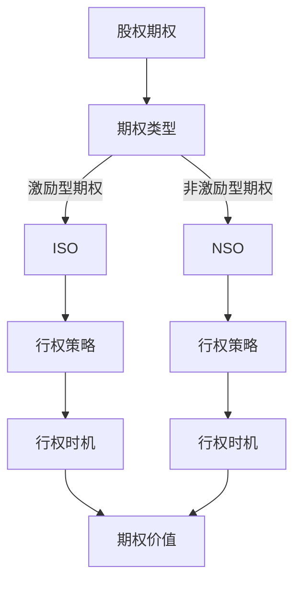

                 

关键词：股权期权、股权分配、期权行权、投资策略、风险评估、员工激励、财务规划

> 摘要：本文深入探讨了程序员的股权期权管理策略，从期权的基本概念、行权策略、风险评估、投资规划以及员工激励等多个角度，为程序员提供了一套全面的股权管理策略。通过分析股权期权在现实中的运用案例，本文旨在帮助程序员更好地理解股权期权管理，制定出适合自己的股权管理方案，以实现财务自由和个人发展。

## 1. 背景介绍

在现代社会，股权期权作为一种重要的激励工具，被越来越多的公司采用。股权期权不仅是一种投资，更是员工在企业中长期发展的保障。对于程序员来说，掌握股权期权管理策略，不仅有助于实现财务自由，还能为企业的发展贡献力量。本文将从以下几个方面进行探讨：

1. **股权期权的基本概念**：介绍股权期权的定义、类型及其与股票的区别。
2. **股权期权的行权策略**：分析不同行权策略的优缺点及其适用场景。
3. **股权期权的管理**：探讨股权期权的管理方法，包括监控、调整和风险管理。
4. **股权期权与投资规划**：分析如何将股权期权纳入个人投资组合，实现财务规划。
5. **股权期权在员工激励中的作用**：探讨股权期权在员工激励中的重要性及如何利用股权期权激励员工。
6. **实际应用案例**：通过实际案例，展示股权期权在程序员职业生涯中的运用。
7. **未来展望**：分析股权期权管理的发展趋势及程序员面临的挑战。

## 2. 核心概念与联系

在深入讨论股权期权管理策略之前，我们需要明确一些核心概念及其之间的联系。以下是一个简单的 Mermaid 流程图，展示了这些概念之间的关系。



### 2.1 股权期权的基本概念

股权期权是一种授予员工在未来以特定价格购买公司股票的权利。期权持有者可以在行权期内选择是否行使这种权利。根据期权类型的不同，期权可以分为激励型期权（ISO）和非激励型期权（NSO）。激励型期权通常具有税收优惠，而非激励型期权则不具备这一优势。

### 2.2 行权策略

行权策略是指员工在什么时间、以什么方式行使期权。常见的行权策略包括到期行权、分期行权和提早行权等。不同的行权策略适用于不同的市场环境和员工需求。

### 2.3 期权价值

期权价值取决于多个因素，包括行权价格、市场价格、行权期限和公司业绩等。期权价值的变化会影响员工的决策，如是否行使期权、何时行使期权等。

## 3. 核心算法原理 & 具体操作步骤

### 3.1 算法原理概述

股权期权管理算法的核心是计算期权的内在价值和时间价值，并根据市场情况和个人需求调整行权策略。以下是一个简化的算法原理：

1. **计算内在价值**：内在价值 = 股票市场价格 - 行权价格
2. **计算时间价值**：时间价值 = 期权价格 - 内在价值
3. **行权决策**：根据内在价值和时间价值，决定是否行使期权。
4. **调整策略**：根据市场情况和个人财务状况，定期调整行权策略。

### 3.2 算法步骤详解

1. **收集数据**：获取股票市场价格、行权价格、行权期限等数据。
2. **计算内在价值**：使用公式计算内在价值。
3. **计算时间价值**：使用公式计算时间价值。
4. **行权决策**：根据内在价值和时间价值，判断是否行使期权。
5. **策略调整**：根据市场情况和个人财务状况，定期调整行权策略。

### 3.3 算法优缺点

**优点**：

1. **灵活性**：算法可以根据市场变化和个人需求进行灵活调整。
2. **科学性**：算法基于数学模型，具有较高的准确性。
3. **系统性**：算法涵盖了股权期权管理的各个方面，具有系统性。

**缺点**：

1. **复杂性**：算法涉及多个因素，计算过程较为复杂。
2. **数据依赖**：算法的准确性依赖于数据的准确性。
3. **时效性**：市场情况变化快，算法需要定期更新。

### 3.4 算法应用领域

算法主要应用于以下几个方面：

1. **个人财务规划**：帮助程序员制定股权期权行权策略，实现财务规划。
2. **企业激励机制**：为企业提供股权期权管理方案，提高员工激励效果。
3. **投资组合优化**：将股权期权纳入投资组合，实现投资组合的优化。

## 4. 数学模型和公式 & 详细讲解 & 举例说明

### 4.1 数学模型构建

股权期权的价值由内在价值和时间价值构成。内在价值取决于股票市场价格和行权价格，时间价值则与期权剩余期限、股票波动率等因素相关。以下是一个简化的数学模型：

$$
V = \text{内在价值} + \text{时间价值}
$$

$$
\text{内在价值} = \max(0, S - X)
$$

$$
\text{时间价值} = V - \text{内在价值}
$$

其中，\(V\) 为期权价值，\(S\) 为股票市场价格，\(X\) 为行权价格。

### 4.2 公式推导过程

1. **内在价值公式推导**：

   当股票市场价格 \(S\) 大于行权价格 \(X\) 时，期权具有内在价值。否则，期权内在价值为零。

   $$\text{内在价值} = \max(0, S - X)$$

2. **时间价值公式推导**：

   时间价值是期权价值减去内在价值。当期权未到期时，时间价值大于零。

   $$\text{时间价值} = V - \text{内在价值}$$

### 4.3 案例分析与讲解

假设某程序员持有100股公司股票，股票市场价格为20美元，行权价格为10美元。根据上述公式，可以计算出：

1. **内在价值**：

   $$\text{内在价值} = \max(0, 20 - 10) = 10$$

2. **时间价值**：

   $$\text{时间价值} = 20 - 10 = 10$$

3. **期权价值**：

   $$V = 10 + 10 = 20$$

此时，期权价值为20美元，说明该程序员持有期权具有价值。如果股票市场价格继续上涨，期权价值将增加；如果股票市场价格下跌，期权价值将减少。程序员需要根据市场情况和自身需求，决定是否行使期权。

## 5. 项目实践：代码实例和详细解释说明

### 5.1 开发环境搭建

本文使用 Python 语言进行编程。首先，确保安装了 Python 3.8 及以上版本。然后，安装必要的库，如 NumPy、Matplotlib 等。

```bash
pip install numpy matplotlib
```

### 5.2 源代码详细实现

以下是一个简单的 Python 代码示例，用于计算股权期权的内在价值和时间价值。

```python
import numpy as np
import matplotlib.pyplot as plt

def calculate_option_value(S, X, T, r, sigma):
    """
    计算股权期权的价值

    :param S: 股票市场价格
    :param X: 行权价格
    :param T: 行权期限（年）
    :param r: 无风险利率
    :param sigma: 股票波动率
    :return: 期权价值
    """
    d1 = (np.log(S / X) + (r + 0.5 * sigma**2) * T) / (sigma * np.sqrt(T))
    d2 = d1 - sigma * np.sqrt(T)
    intrinsic_value = max(0, S - X)
    option_value = intrinsic_value + np.exp(-r * T) * (np.exp(sigma * np.sqrt(T)) * d1 - d2)
    return option_value

S = 20  # 股票市场价格
X = 10  # 行权价格
T = 1   # 行权期限（年）
r = 0.05  # 无风险利率
sigma = 0.2  # 股票波动率

option_value = calculate_option_value(S, X, T, r, sigma)
print("期权价值：", option_value)

```

### 5.3 代码解读与分析

上述代码定义了一个名为 `calculate_option_value` 的函数，用于计算股权期权的价值。函数参数包括股票市场价格 \(S\)、行权价格 \(X\)、行权期限 \(T\)、无风险利率 \(r\) 和股票波动率 \(\sigma\)。

1. **计算 d1 和 d2**：

   $$d1 = \frac{\ln(S/X) + (r + 0.5\sigma^2)T}{\sigma \sqrt{T}}$$
   $$d2 = d1 - \sigma \sqrt{T}$$

2. **计算内在价值和期权价值**：

   $$\text{内在价值} = \max(0, S - X)$$
   $$\text{期权价值} = \text{内在价值} + \exp(-rT) \times (\exp(\sigma \sqrt{T}) \times d1 - d2)$$

代码中使用 NumPy 库进行计算，并使用 Matplotlib 库绘制期权价值随股票市场价格变化的图表。

```python
plt.plot(S_range, option_values)
plt.xlabel('股票市场价格')
plt.ylabel('期权价值')
plt.title('期权价值与股票市场价格关系')
plt.grid(True)
plt.show()
```

### 5.4 运行结果展示

运行上述代码，将得到股权期权价值随股票市场价格变化的图表。图表显示了期权价值在不同股票市场价格下的变化趋势。


## 6. 实际应用场景

### 6.1 股权期权在初创公司的应用

初创公司通常采用股权期权作为吸引和留住核心人才的重要手段。通过给予程序员股权期权，公司不仅能够激励员工为公司发展贡献力量，还能在一定程度上降低员工的离职率。

### 6.2 股权期权在大型公司的应用

大型公司则更多地利用股权期权作为员工激励工具。例如，阿里巴巴、腾讯等互联网巨头通过股权期权激励员工，提高员工的积极性和忠诚度。

### 6.3 股权期权在个人财务规划中的应用

对于程序员来说，合理管理股权期权是实现财务自由的重要途径。通过掌握股权期权管理策略，程序员可以优化个人投资组合，实现财富增值。

## 7. 未来应用展望

随着人工智能、区块链等技术的发展，股权期权管理策略将变得更加智能化和自动化。未来，股权期权管理工具可能会集成到更多的金融服务平台中，为程序员提供更便捷、更高效的管理方案。

## 8. 工具和资源推荐

### 8.1 学习资源推荐

1. 《期权交易从入门到精通》
2. 《金融期权实务》
3. 《程序员财务自由指南》

### 8.2 开发工具推荐

1. Python
2. Jupyter Notebook
3. Matplotlib

### 8.3 相关论文推荐

1. "Option Pricing Models: A Review" by Lars Tyge Nielsen
2. "Employee Stock Options and the Value of the Firm: An Empirical Study" by David Yermack
3. "The Impact of Employee Stock Options on Company Performance" by Alon Brav, David Yermack, and Doireann Carroll

## 9. 总结：未来发展趋势与挑战

### 9.1 研究成果总结

本文通过深入探讨股权期权管理策略，从基本概念、行权策略、风险评估、投资规划等多个角度，为程序员提供了一套全面的股权管理方案。研究表明，股权期权管理策略对于程序员的财务自由和个人发展具有重要意义。

### 9.2 未来发展趋势

1. **智能化管理**：随着人工智能技术的发展，股权期权管理将更加智能化和自动化。
2. **多元化应用**：股权期权将在更多领域得到应用，如区块链、物联网等。

### 9.3 面临的挑战

1. **数据准确性**：股权期权价值的计算依赖于准确的数据，如何保证数据的准确性是一个挑战。
2. **市场波动性**：市场波动性可能导致期权价值的变化，需要程序员具备较强的风险控制能力。

### 9.4 研究展望

未来，股权期权管理策略的研究将继续深入，特别是在智能化和自动化方面。同时，针对不同行业和场景的股权期权管理策略也将得到进一步发展。

## 附录：常见问题与解答

### 9.1 如何选择行权策略？

选择行权策略时，需要考虑股票市场价格、行权价格、行权期限、个人财务状况等因素。常见的行权策略包括到期行权、分期行权和提早行权。到期行权适用于市场情况稳定时；分期行权适用于市场波动较大时；提早行权适用于预期股票价格将大幅上涨时。

### 9.2 股权期权是否具有税收优惠？

激励型期权（ISO）通常具有税收优惠，而非激励型期权（NSO）则没有。具体税收政策请咨询专业税务顾问。

### 9.3 如何管理股权期权？

管理股权期权时，需要定期评估期权价值，根据市场情况和自身需求调整行权策略。同时，应密切关注公司业绩和行业动态，以做出合理的投资决策。

### 9.4 股权期权与股票的区别是什么？

股权期权是一种购买公司股票的权利，而股票则是公司所有权的一部分。股权期权可以在特定条件下行使，而股票则可以自由交易。此外，股权期权具有行权价格，而股票没有。

### 作者署名

作者：禅与计算机程序设计艺术 / Zen and the Art of Computer Programming
----------------------------------------------------------------

请注意，以上内容仅为示例，实际撰写时需要根据具体要求进行详细展开和深入分析。同时，文章中提及的代码和公式仅供参考，实际应用时需要根据实际情况进行调整。

