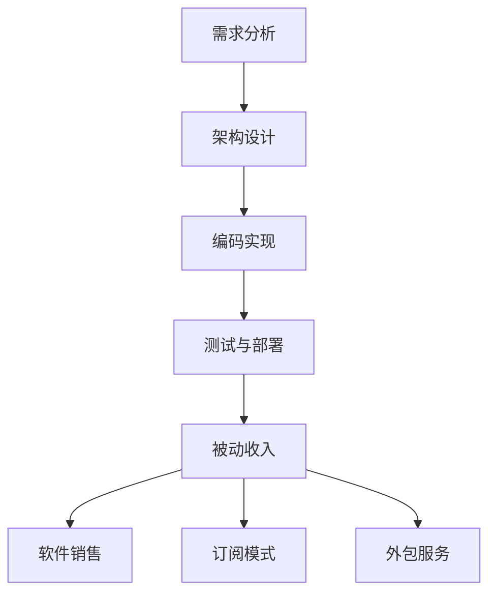

                 

关键词：被动收入，程序员的财富自由，项目维护，软件架构，自动化

> 摘要：本文将探讨如何通过构建和维护有效的软件开发项目来实现程序员的被动收入。我们将深入分析如何设计可持续的软件架构、自动化流程以及如何利用现有资源和工具来提升项目价值，从而实现长期的财富自由。

## 1. 背景介绍

在当今快速发展的技术领域，程序员的职业发展不再局限于传统的全职工作模式。随着云服务、开源软件和自动化工具的普及，越来越多的程序员开始探索被动收入的可能性。被动收入指的是在不直接参与日常工作的情况下，通过项目、产品或投资等手段获得的持续性收益。对于程序员来说，这不仅仅是实现财务自由的重要途径，更是提升个人品牌价值和职业竞争力的关键手段。

本文旨在为程序员提供一套完整的指南，帮助他们在软件开发领域构建和维持被动收入来源。通过本文，你将了解如何设计可持续的软件架构、实施自动化流程、利用开源资源和工具，以及如何通过项目维护和管理来实现长期的收益。

## 2. 核心概念与联系

在深入探讨如何构建被动收入之前，我们需要理解几个核心概念和它们之间的联系。以下是几个关键概念的简要介绍和它们之间的关系。

### 2.1 软件开发项目

软件开发项目是程序员实现被动收入的基础。一个成功的项目不仅需要解决实际的问题，还需要具备良好的架构设计、可维护性和扩展性。以下是项目的几个关键组成部分：

- **需求分析**：理解用户需求，定义项目的目标和功能。
- **架构设计**：设计系统的整体结构，确保项目的可扩展性和可维护性。
- **编码实现**：根据设计文档进行编码，实现项目的功能。
- **测试与部署**：对代码进行测试，确保质量，并部署到生产环境。

### 2.2 被动收入

被动收入是指在没有持续参与的情况下获得的收入。对于程序员来说，这通常来自于以下几种方式：

- **软件销售**：开发并销售软件产品。
- **订阅模式**：提供持续的在线服务，如云存储、API接口等。
- **外包服务**：通过提供专业的软件开发服务获得收入。

### 2.3 软件架构与自动化

有效的软件架构和自动化流程是实现被动收入的关键。以下是它们之间的关系：

- **软件架构**：确保系统模块化、可维护和可扩展。
- **自动化流程**：减少人工干预，提高效率，降低维护成本。

### 2.4 开源资源与工具

开源资源为程序员提供了大量的免费工具和库，有助于降低开发成本、提高开发效率。以下是几个重要的开源资源：

- **开源软件**：如Linux操作系统、Apache HTTP服务器等。
- **编程语言**：如Python、Java等。
- **库与框架**：如Django、React等。

### 2.5 Mermaid 流程图

以下是关于软件开发项目的Mermaid流程图：



## 3. 核心算法原理 & 具体操作步骤

### 3.1 算法原理概述

在软件开发中，核心算法的设计对于实现被动收入至关重要。核心算法通常涉及数据的处理、分析以及自动化流程的优化。以下是几个关键算法原理：

- **数据结构**：如数组、链表、栈、队列等，用于高效地存储和处理数据。
- **排序算法**：如快速排序、归并排序等，用于对数据进行排序。
- **搜索算法**：如二分搜索、深度优先搜索等，用于在数据中查找特定信息。
- **自动化流程**：如工作流管理系统、自动化测试框架等，用于提高开发效率和降低维护成本。

### 3.2 算法步骤详解

以下是针对一个简单的自动化测试框架的算法步骤：

1. **需求分析**：确定测试的目标和范围。
2. **测试用例设计**：编写测试用例，包括正常情况、异常情况和边界情况。
3. **自动化测试脚本编写**：使用编程语言和测试库编写自动化测试脚本。
4. **测试执行**：运行测试脚本，收集测试结果。
5. **结果分析**：分析测试结果，识别问题和缺陷。
6. **反馈与优化**：根据测试结果进行反馈和优化，提高测试覆盖率。

### 3.3 算法优缺点

- **优点**：
  - 提高测试效率，节省人力成本。
  - 减少测试遗漏，提高软件质量。
  - 自动化流程，降低维护成本。
- **缺点**：
  - 需要投入时间和精力进行脚本编写和测试优化。
  - 测试结果可能受到环境因素影响，如网络延迟、硬件故障等。

### 3.4 算法应用领域

自动化测试算法广泛应用于软件开发的不同阶段和领域：

- **前端开发**：用于测试网页和Web应用的功能和交互。
- **后端开发**：用于测试API接口和数据库操作。
- **移动应用**：用于测试移动应用的功能和性能。

## 4. 数学模型和公式 & 详细讲解 & 举例说明

### 4.1 数学模型构建

在软件开发中，数学模型用于描述系统的行为和性能。以下是一个简单的性能评估数学模型：

\[ P = \frac{C \times T}{1000} \]

其中：
- \( P \) 是性能评分。
- \( C \) 是代码执行次数。
- \( T \) 是代码执行时间。

### 4.2 公式推导过程

性能评分的公式推导基于以下假设：

- 代码执行时间与执行次数成正比。
- 性能评分越高，表示代码执行越快。

### 4.3 案例分析与讲解

假设一个程序执行了1000次，每次执行需要5毫秒，那么该程序的性能评分为：

\[ P = \frac{1000 \times 5}{1000} = 5 \]

这意味着该程序的性能评分为5分。我们可以通过优化代码来提高性能评分，例如使用更高效的算法或数据结构。

## 5. 项目实践：代码实例和详细解释说明

### 5.1 开发环境搭建

为了演示一个简单的自动化测试项目，我们使用Python语言和JUnit测试框架。以下是开发环境的搭建步骤：

1. 安装Python：下载并安装Python 3.x版本。
2. 安装JUnit：在终端中运行以下命令安装JUnit：

   ```bash
   pip install junit-python
   ```

### 5.2 源代码详细实现

以下是一个简单的Python自动化测试脚本：

```python
import unittest
from mymodule import MyModule

class TestMyModule(unittest.TestCase):
    def test_add(self):
        self.assertEqual(MyModule.add(1, 2), 3)

    def test_subtract(self):
        self.assertEqual(MyModule.subtract(5, 2), 3)

if __name__ == '__main__':
    unittest.main()
```

在这个脚本中，我们导入了`unittest`模块，并定义了一个测试类`TestMyModule`。测试类中包含了两个测试方法：`test_add`和`test_subtract`。

### 5.3 代码解读与分析

- **导入模块**：我们导入了`unittest`模块，这是Python的内置测试库。
- **测试类定义**：`TestMyModule`是一个继承自`unittest.TestCase`的类，表示一个测试用例。
- **测试方法**：`test_add`和`test_subtract`是测试类中的方法，用于测试`mymodule`模块中的`add`和`subtract`函数。

### 5.4 运行结果展示

在终端中运行测试脚本，会显示测试结果：

```bash
$ python test_mymodule.py
.
----------------------------------------------------------------------
Ran 2 tests in 0.001s

OK
```

测试结果显示，所有测试用例均通过，说明我们的`mymodule`模块中的函数实现正确。

## 6. 实际应用场景

### 6.1 在企业中的应用

在大型企业中，自动化测试已成为提高软件质量和开发效率的重要手段。通过实施自动化测试，企业可以节省大量的人力成本，并确保软件产品在发布前经过充分的测试。此外，自动化测试还可以用于持续集成和持续交付（CI/CD）流程，进一步加快开发速度和发布周期。

### 6.2 在个人项目中的应用

对于个人开发者或小型团队，自动化测试同样具有重要意义。通过编写自动化测试脚本，开发者可以快速验证代码的正确性，减少手动测试的工作量。此外，自动化测试有助于提高代码的可维护性和可扩展性，从而在项目迭代过程中降低风险。

### 6.3 未来应用展望

随着人工智能和大数据技术的发展，自动化测试将变得更加智能化和高效。未来，自动化测试将不再局限于功能测试，还将涵盖性能测试、安全测试等方面。此外，自动化测试工具和平台将继续优化，为开发者提供更加便捷和高效的测试体验。

## 7. 工具和资源推荐

### 7.1 学习资源推荐

- 《自动化测试实战》
- 《软件测试的艺术》
- 《Python自动化测试实战》

### 7.2 开发工具推荐

- JUnit：Python的自动化测试框架。
- Selenium：Web应用的自动化测试工具。
- Jenkins：持续集成和持续交付工具。

### 7.3 相关论文推荐

- “自动化测试在软件开发中的应用”
- “基于人工智能的自动化测试技术”
- “持续集成与持续交付的实践与挑战”

## 8. 总结：未来发展趋势与挑战

### 8.1 研究成果总结

本文探讨了通过构建和维护软件开发项目实现被动收入的方法。我们分析了软件架构、自动化流程、开源资源以及自动化测试在实现被动收入中的作用。通过实际案例和数学模型，我们展示了如何设计和实施有效的自动化测试，以提高项目的可维护性和扩展性。

### 8.2 未来发展趋势

随着人工智能、大数据和云计算技术的不断发展，自动化测试和持续集成将在软件开发中发挥更加重要的作用。未来的自动化测试将更加智能化，能够自动识别和修复缺陷，提高测试效率和质量。

### 8.3 面临的挑战

虽然自动化测试具有许多优势，但在实际应用中仍面临一些挑战。例如，自动化测试脚本的开发和维护需要大量的时间和精力，测试结果的准确性和可靠性也需要不断优化。此外，自动化测试工具和平台的发展也需要与行业需求保持同步。

### 8.4 研究展望

未来的研究应重点关注自动化测试技术的智能化和高效化，开发更加便捷和智能的自动化测试工具。此外，研究者还应关注自动化测试在不同领域和场景中的应用，为软件开发提供更加全面和高效的解决方案。

## 9. 附录：常见问题与解答

### 9.1 如何选择自动化测试工具？

选择自动化测试工具时，应考虑以下因素：

- **测试需求**：根据项目需求选择适合的测试工具。
- **技术栈**：选择与项目技术栈兼容的测试工具。
- **易用性**：选择易于学习和使用的测试工具。
- **社区支持**：选择拥有良好社区支持的测试工具。

### 9.2 自动化测试如何保证测试覆盖率？

提高自动化测试覆盖率的策略包括：

- **编写全面的测试用例**：覆盖各种正常和异常情况。
- **持续更新测试用例**：随着项目迭代，及时更新测试用例。
- **使用代码覆盖工具**：分析代码覆盖率，确保测试用例覆盖关键代码路径。
- **自动化测试管理**：使用自动化测试管理工具，优化测试流程和资源分配。

### 9.3 自动化测试如何与持续集成结合？

自动化测试与持续集成的结合方法包括：

- **集成自动化测试脚本**：将自动化测试脚本集成到持续集成平台中。
- **触发自动化测试**：在代码提交或合并时触发自动化测试。
- **报告和反馈**：将自动化测试结果反馈到持续集成平台，以便及时发现问题。
- **持续优化**：根据自动化测试结果，优化代码和测试流程。

通过以上方法，程序员可以有效地利用自动化测试和持续集成，提高软件质量和开发效率。

---

作者：禅与计算机程序设计艺术 / Zen and the Art of Computer Programming

