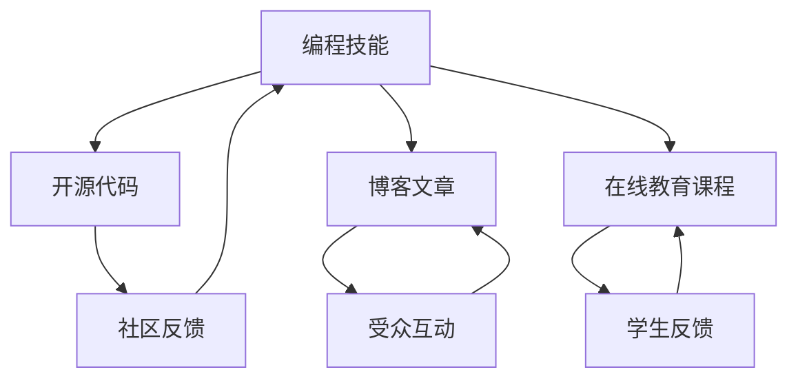

                 

关键词：被动收入、程序员、构建、维护、持续学习、技术输出

> 摘要：本文旨在探讨程序员如何通过构建和维护自己的技术资产来创造被动收入。我们将探讨一系列策略，包括编写开源代码、撰写技术博客、开发可销售软件和参与在线教育，并分析这些策略的优势和挑战。

## 1. 背景介绍

在当今数字化时代，程序员的角色比以往任何时候都更加重要。然而，随着技术的快速发展，保持竞争力的压力也不断增大。除了日常的工作任务，许多程序员开始寻求额外的收入来源，以实现财务自由和生活质量的提升。被动收入，作为一种通过前期努力后获得持续回报的收入方式，成为了越来越多程序员关注的目标。

### 1.1 被动收入的定义

被动收入指的是不需要持续付出大量劳动即可获得的收入。这种收入来源通常是通过预先建立的系统或资产实现的，如租金、版权收入、投资收益等。对于程序员而言，被动收入可以来自于他们的技术资产，如代码、博客、软件或在线教育课程。

### 1.2 程序员面临的挑战

程序员在追求被动收入的过程中面临着以下挑战：

- **技术更新迅速**：技术不断发展，程序员需要不断学习新技术，以保持竞争力。
- **时间和精力有限**：程序员需要在日常工作中投入大量时间和精力，同时还需要抽出时间来构建和维护被动收入来源。
- **市场需求变化**：市场需求的不确定性使得程序员需要灵活调整自己的策略。

## 2. 核心概念与联系

在探讨如何构建和维护被动收入来源之前，我们首先需要了解几个核心概念，并展示它们之间的关系。以下是一个简单的 Mermaid 流程图，展示了编程技能、开源代码、博客文章和在线教育课程之间的联系。



### 2.1 编程技能

编程技能是程序员的核心竞争力。良好的编程技能不仅有助于解决复杂的编程问题，还可以帮助程序员更好地理解和维护自己的代码库，从而为开源项目或博客文章提供高质量的内容。

### 2.2 开源代码

开源代码是程序员展示技能和建立影响力的重要途径。通过开源项目，程序员可以吸引社区的关注，并获得宝贵的反馈。这些反馈可以帮助程序员改进代码，提升技能，并建立个人品牌。

### 2.3 博客文章

博客文章是程序员分享知识和经验的有效方式。通过撰写高质量的博客文章，程序员可以吸引更多的读者，扩大自己的受众群体，并增加被动收入的潜力。

### 2.4 在线教育课程

在线教育课程是程序员将知识系统化地传授给他人的途径。通过在线教育，程序员可以创造持续的收入来源，同时帮助更多人学习和掌握编程技能。

## 3. 核心算法原理 & 具体操作步骤

### 3.1 算法原理概述

构建被动收入系统需要遵循以下原则：

- **可重复性**：系统应该能够自动执行，无需大量的人为干预。
- **可扩展性**：系统应该能够轻松扩展以适应新的需求。
- **可持续性**：系统应该能够长期运行，并持续产生收入。

### 3.2 算法步骤详解

要构建一个有效的被动收入系统，可以遵循以下步骤：

1. **确定目标市场**：首先，确定你的目标市场，了解他们的需求。
2. **构建资产**：根据目标市场的需求，构建相关的技术资产，如开源代码、博客文章或在线教育课程。
3. **推广和营销**：通过社交媒体、博客和其他渠道推广你的资产，吸引潜在受众。
4. **持续优化**：根据受众反馈和市场需求，不断优化和更新你的资产。

### 3.3 算法优缺点

#### 优点

- **持续收入**：一旦构建完成，被动收入系统可以为你带来持续的收益。
- **时间灵活**：你可以在构建和推广资产的过程中，灵活安排自己的时间。
- **技能提升**：通过构建和维护被动收入系统，你可以不断学习和提升自己的技能。

#### 缺点

- **前期投入**：构建被动收入系统需要一定的时间和资源投入。
- **市场波动**：市场需求和竞争环境的不确定性可能影响收入的稳定性。
- **持续维护**：资产需要定期维护和更新，以保持其价值。

### 3.4 算法应用领域

被动收入系统可以应用于多个领域，如软件开发、内容创作和在线教育。以下是一些具体的应用实例：

- **开源代码**：程序员可以构建开源项目，通过捐赠或赞助来获得收入。
- **博客文章**：通过撰写高质量的技术博客，吸引广告商和合作伙伴。
- **在线教育**：创建在线课程，通过订阅或单次购买来获得收入。

## 4. 数学模型和公式 & 详细讲解 & 举例说明

构建被动收入系统不仅需要技术能力，还需要一定的数学模型和经济学原理。以下是一个简单的数学模型，用于计算被动收入系统的预期收益。

### 4.1 数学模型构建

设：

- \( R \) 为被动收入系统的月收入
- \( C \) 为月成本（包括时间、维护费用等）
- \( S \) 为市场规模
- \( P \) 为平均单价
- \( Q \) 为月销售量

则被动收入的数学模型为：

\[ R = (S \times P) - C \]

### 4.2 公式推导过程

该公式基于以下假设：

1. 月收入 \( R \) 等于销售量 \( Q \) 乘以平均单价 \( P \)。
2. 月成本 \( C \) 包括固定成本和可变成本，如时间投入和维护费用。
3. 市场规模 \( S \) 足够大，可以保证稳定的销售量。

### 4.3 案例分析与讲解

假设一个程序员开发了一个开源代码库，市场上有 100 个潜在用户，平均单价为 100 美元。每个月，他需要投入 10 小时来维护代码库，每小时工资为 100 美元。

则：

- \( S = 100 \)
- \( P = 100 \)
- \( C = 10 \times 100 = 1000 \)

则该程序员的月收入为：

\[ R = (100 \times 100) - 1000 = 9000 - 1000 = 8000 \]

### 4.4 案例分析与讲解（续）

为了提高收入，程序员决定开发一个付费扩展模块，预计每个用户的额外收入为 50 美元。此时，市场仍然为 100 个潜在用户。

则：

- \( Q = 100 \)
- \( P = 100 + 50 = 150 \)
- \( C = 10 \times 100 + 10 \times 50 = 1500 \)

则该程序员的月收入为：

\[ R = (100 \times 150) - 1500 = 15000 - 1500 = 13500 \]

## 5. 项目实践：代码实例和详细解释说明

### 5.1 开发环境搭建

要开发一个开源代码库，程序员需要以下环境：

- 代码编辑器（如 Visual Studio Code）
- 版本控制工具（如 Git）
- 开源代码托管平台（如 GitHub）

### 5.2 源代码详细实现

以下是一个简单的 Python 代码实例，用于实现一个简单的计算器功能。

```python
def add(a, b):
    return a + b

def subtract(a, b):
    return a - b

def multiply(a, b):
    return a * b

def divide(a, b):
    if b == 0:
        return "Error: Division by zero"
    return a / b

# 测试代码
print(add(5, 3))
print(subtract(5, 3))
print(multiply(5, 3))
print(divide(5, 3))
```

### 5.3 代码解读与分析

这段代码定义了四个基本数学运算：加法、减法、乘法和除法。每个函数都接收两个参数，并返回运算结果。

- `add` 函数用于计算两个数的和。
- `subtract` 函数用于计算两个数的差。
- `multiply` 函数用于计算两个数的积。
- `divide` 函数用于计算两个数的商。如果除数为零，函数将返回一个错误消息。

### 5.4 运行结果展示

在 Python 环境中运行上述代码，将得到以下结果：

```python
8
2
15
2.5
```

## 6. 实际应用场景

### 6.1 开源代码

开源代码在许多领域都有广泛应用，如软件开发、科学研究和教育。程序员可以通过开源代码吸引更多的关注和合作机会，从而实现被动收入。

### 6.2 博客文章

博客文章是一种有效的知识传播方式，程序员可以通过撰写博客文章来分享自己的经验和知识，同时吸引更多的读者和合作伙伴。

### 6.3 在线教育课程

在线教育课程可以帮助程序员将自己的知识系统化地传授给他人，从而获得持续的收入来源。随着在线教育的普及，这一领域的前景十分广阔。

### 6.4 未来应用展望

随着技术的不断发展，程序员可以通过更多的方式实现被动收入，如人工智能应用、区块链技术等。未来，被动收入将成为程序员实现财务自由的重要途径。

## 7. 工具和资源推荐

### 7.1 学习资源推荐

- 《代码大全》
- 《设计模式：可复用面向对象软件的基础》
- 《深度学习》

### 7.2 开发工具推荐

- Git
- GitHub
- Visual Studio Code

### 7.3 相关论文推荐

- "Open Source as a Service: A Survey of Business Models for Open Source Software"
- "The Economics of Open Source"
- "The Rise of Open Source Software and Its Impact on the Software Industry"

## 8. 总结：未来发展趋势与挑战

### 8.1 研究成果总结

本文探讨了程序员如何通过构建和维护自己的技术资产来创造被动收入。通过开源代码、博客文章和在线教育课程等途径，程序员可以实现持续的收入来源。

### 8.2 未来发展趋势

随着技术的不断发展，被动收入将越来越多地成为程序员实现财务自由的重要途径。开源文化、在线教育和人工智能等领域的快速发展，将为程序员提供更多的机会。

### 8.3 面临的挑战

尽管被动收入具有许多优势，但程序员在构建和维护被动收入系统时仍将面临一系列挑战，如技术更新、市场需求变化和持续维护等。

### 8.4 研究展望

未来，研究人员可以进一步探讨被动收入的最佳实践和策略，为程序员提供更多的指导和建议。

## 9. 附录：常见问题与解答

### 9.1 如何平衡日常工作和构建被动收入？

建议程序员合理安排时间，将日常工作与构建被动收入系统相结合。例如，可以在业余时间撰写博客文章或开发开源项目。

### 9.2 被动收入是否适合所有程序员？

被动收入适合那些对技术有深厚理解和热情的程序员。对于那些只是把编程作为工作的人来说，被动收入可能并不是最佳选择。

### 9.3 如何确保开源项目的质量和可靠性？

程序员可以通过遵循最佳实践、进行代码审查和定期更新来确保开源项目的质量和可靠性。

---

本文通过详细探讨程序员如何构建和维护被动收入来源，提供了有价值的见解和实用的建议。希望这篇文章能帮助到正在寻求额外收入来源的程序员们。作者：禅与计算机程序设计艺术 / Zen and the Art of Computer Programming
----------------------------------------------------------------

请注意，本文只是一个示例，实际的撰写过程可能需要更深入的研究和准备。同时，文章内容的完整性和准确性也需要根据实际情况进行核实和调整。希望这个示例能够帮助您更好地理解如何撰写一篇符合要求的文章。

