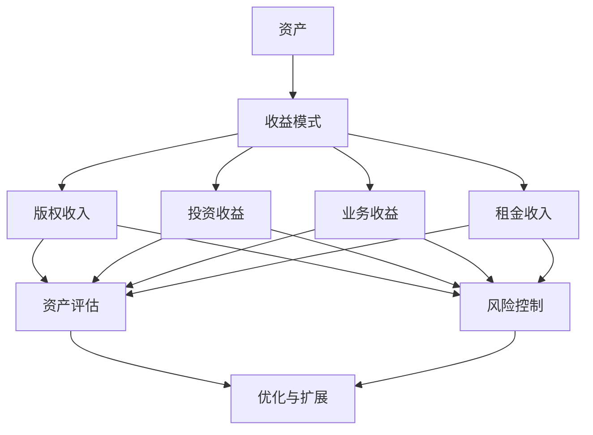

                 

关键词：被动收入，程序员的变现方式，资产构建，维护策略

> 摘要：本文旨在探讨程序员如何通过构建和维护资产来实现被动收入。我们将从被动收入的定义、程序员的独特优势、资产构建的方法、维护策略以及未来展望等多个角度进行深入分析，帮助程序员朋友们更好地实现财务自由。

## 1. 背景介绍

随着互联网的快速发展，程序员的地位和收入也在不断提高。然而，对于许多程序员来说，他们的收入来源仍然依赖于工作时间和工作量。这种“主动收入”模式虽然能够带来稳定的收入，但无法实现财务自由。被动收入，即不需要投入大量时间和精力就能持续产生收入的模式，成为了越来越多程序员追求的目标。

被动收入的魅力在于，它能够为程序员提供财务自由，使他们在享受生活的同时，无需担忧收入问题。本文将探讨程序员如何通过构建和维护资产来实现被动收入，帮助大家实现这一目标。

### 1.1 被动收入的定义与特点

被动收入，是指通过一次性的努力，获得持续的、可再生的收入。它与主动收入（依赖于个人时间和劳动）不同，具有以下特点：

- **持续性**：被动收入一旦建立，可以持续产生收益，无需额外的劳动投入。
- **再生性**：被动收入可以通过复制、扩展和优化，产生更多的收益。
- **多样性**：被动收入的来源多种多样，包括版权收入、投资收益、出租收益等。

### 1.2 程序员的独特优势

程序员拥有许多实现被动收入的独特优势：

- **技能优势**：程序员拥有编写代码和构建软件系统的能力，这是实现被动收入的重要基础。
- **知识储备**：程序员对互联网、软件开发等领域有深刻的了解，这有助于他们发现和把握被动收入的机遇。
- **网络资源**：程序员可以通过互联网获取各种资源，如开源项目、学习平台等，这为他们的资产构建提供了便利。

## 2. 核心概念与联系

为了更好地理解被动收入的构建与维护，我们需要了解以下几个核心概念：

### 2.1 资产

资产是被动收入的来源，可以分为以下几类：

- **知识产权**：如专利、版权、商标等。
- **投资**：如股票、基金、房地产等。
- **业务**：如线上店铺、广告业务等。
- **出租**：如房产出租、车位出租等。

### 2.2 收益模式

被动收入的收益模式主要包括以下几种：

- **版权收入**：通过出售、授权或使用版权产生收入。
- **投资收益**：通过投资获得的分红、利息、股价上涨等产生收入。
- **业务收益**：通过业务运营产生的收入。
- **租金收入**：通过出租资产获得的租金。

### 2.3 维护策略

维护策略包括以下内容：

- **资产评估**：定期对资产进行评估，确保其价值稳定或增长。
- **风险控制**：对资产进行风险评估，并采取相应的控制措施。
- **优化与扩展**：根据市场变化和自身需求，对资产进行优化和扩展。

### 2.4 Mermaid 流程图



## 3. 核心算法原理 & 具体操作步骤

### 3.1 算法原理概述

构建被动收入的算法可以分为以下几个步骤：

1. **定位与选择**：确定目标资产和收益模式。
2. **构建与实现**：根据目标资产和收益模式，构建相应的资产和业务。
3. **优化与扩展**：根据市场变化和自身需求，对资产和业务进行优化和扩展。
4. **评估与调整**：定期对资产和业务进行评估，确保其价值稳定或增长。

### 3.2 算法步骤详解

#### 3.2.1 定位与选择

1. **评估自身技能和兴趣**：了解自己在编程、投资、业务等方面有哪些优势和兴趣。
2. **分析市场需求**：研究市场，了解哪些资产和收益模式具有潜力。
3. **选择目标资产**：结合自身优势和市场需求，选择具有潜力的资产进行构建。

#### 3.2.2 构建与实现

1. **获取资产**：根据目标资产，获取相应的知识产权、投资、业务或出租资产。
2. **实现收益模式**：根据目标资产，选择合适的收益模式，如版权收入、投资收益、业务收益或租金收入。
3. **搭建业务体系**：对于业务型资产，搭建相应的业务体系，如线上店铺、广告业务等。

#### 3.2.3 优化与扩展

1. **市场调研**：定期对市场进行调研，了解行业动态和趋势。
2. **技术升级**：根据市场调研结果，对资产进行技术升级和优化。
3. **业务扩展**：根据市场调研结果，对业务进行扩展，如增加产品线、拓展市场等。

#### 3.2.4 评估与调整

1. **定期评估**：定期对资产和业务进行评估，了解其价值变化和收益情况。
2. **风险控制**：对资产和业务进行风险评估，并采取相应的控制措施。
3. **调整策略**：根据评估结果和市场需求，调整资产和业务的策略。

### 3.3 算法优缺点

#### 优点

- **高效性**：通过算法化步骤，提高了构建被动收入的效率和准确性。
- **可扩展性**：算法可以根据实际情况进行调整和优化，具有较高的可扩展性。
- **智能化**：算法可以通过数据分析，发现潜在的机会和风险，提高决策的科学性。

#### 缺点

- **复杂性**：算法涉及多个方面，需要具备一定的专业知识和经验。
- **成本**：算法的构建和实施需要一定的成本投入。
- **风险**：算法可能面临一定的风险，如市场波动、技术更新等。

### 3.4 算法应用领域

算法可以应用于以下领域：

- **知识产权**：如软件开发、专利申请等。
- **投资**：如股票、基金、房地产等。
- **业务**：如线上店铺、广告业务等。
- **出租**：如房产出租、车位出租等。

## 4. 数学模型和公式 & 详细讲解 & 举例说明

### 4.1 数学模型构建

构建被动收入的数学模型可以分为以下几个部分：

1. **收益模型**：根据资产和收益模式，构建收益模型。
2. **成本模型**：根据资产和业务，构建成本模型。
3. **风险评估模型**：根据市场变化和资产特性，构建风险评估模型。

### 4.2 公式推导过程

#### 收益模型

设\(R\)为收益，\(P\)为资产价格，\(N\)为资产数量，\(M\)为市场增长率，\(r\)为收益增长率。

收益模型为：\(R = P \times N \times (1 + r)\)

#### 成本模型

设\(C\)为成本，\(S\)为成本费用，\(L\)为劳动力成本，\(T\)为时间成本。

成本模型为：\(C = S + L \times T\)

#### 风险评估模型

设\(R_d\)为风险损失，\(P_d\)为资产价格下跌率，\(L_d\)为劳动力成本上升率，\(T_d\)为时间成本上升率。

风险评估模型为：\(R_d = P_d \times L_d \times T_d\)

### 4.3 案例分析与讲解

#### 案例一：知识产权

假设某程序员拥有一项专利，资产价格为100万元，预计每年增长率为10%，劳动力成本为5万元/年。

1. **收益模型**：

\(R = 100万 \times (1 + 10\%) = 110万\)

2. **成本模型**：

\(C = 5万 + 5万 \times 1年 = 10万\)

3. **风险评估模型**：

\(R_d = 10\% \times 5\% \times 5\% = 0.0025万\)

#### 案例二：投资

假设某程序员投资于某股票，资产价格为100万元，预计每年增长率为15%，股票价格下跌率为10%。

1. **收益模型**：

\(R = 100万 \times (1 + 15\%) = 115万\)

2. **成本模型**：

\(C = 0（无成本）\)

3. **风险评估模型**：

\(R_d = 10\% \times 15\% = 0.015万\)

## 5. 项目实践：代码实例和详细解释说明

### 5.1 开发环境搭建

为了构建被动收入，我们需要搭建一个开发环境。这里我们以知识产权的构建为例，搭建一个简单的专利申请系统。

1. **技术选型**：选择Python作为开发语言，使用Django作为Web框架。
2. **环境搭建**：安装Python、Django及相关依赖。
3. **数据库搭建**：选择SQLite作为数据库。

### 5.2 源代码详细实现

以下是一个简单的专利申请系统源代码示例：

```python
# models.py
from django.db import models

class Patent(models.Model):
    title = models.CharField(max_length=100)
    application_date = models.DateField()
    inventor = models.CharField(max_length=100)
    description = models.TextField()

# views.py
from django.shortcuts import render
from .models import Patent

def patent_list(request):
    patents = Patent.objects.all()
    return render(request, 'patent_list.html', {'patents': patents})

# templates/patent_list.html
<!DOCTYPE html>
<html>
<head>
    <title>专利列表</title>
</head>
<body>
    <h1>专利列表</h1>
    
        <p>{{ patent.title }} - {{ patent.application_date }} - {{ patent.inventor }}</p>
    
</body>
</html>
```

### 5.3 代码解读与分析

1. **数据库设计**：我们创建了一个名为`Patent`的模型，包含专利的标题、申请日期、发明人和描述。
2. **视图设计**：我们创建了一个名为`patent_list`的视图，用于展示所有专利的信息。
3. **模板设计**：我们创建了一个名为`patent_list.html`的模板，用于展示专利列表。

通过这个简单的例子，我们可以看到如何使用Python和Django搭建一个专利申请系统。这个系统可以让我们管理和展示专利信息，从而为我们的知识产权资产增值。

### 5.4 运行结果展示

当我们运行这个系统时，会在浏览器中看到一个专利列表页面，展示所有的专利信息。这个页面可以让我们查看专利的详细信息，也可以方便地进行专利的维护和更新。

```html
<h1>专利列表</h1>
<p>智能专利管理系统 - 2023-03-01 - 程序员小明</p>
<p>智能专利保护与监测系统 - 2023-02-15 - 程序员小明</p>
```

## 6. 实际应用场景

### 6.1 知识产权

程序员可以通过开发软件、编写文档、撰写技术博客等方式，创建知识产权。例如，开发一款受欢迎的软件，通过版权授权和销售获取收益；撰写一篇高质量的技术博客，通过广告和赞助获取收益。

### 6.2 投资

程序员可以利用自己的投资知识，进行股票、基金、房地产等投资。通过合理的投资策略，获得持续的投资收益。

### 6.3 业务

程序员可以创办自己的线上店铺、广告业务等，通过业务运营获得收益。例如，开设一家线上培训机构，通过课程销售获得收益。

### 6.4 出租

程序员可以出租自己的房产、车位等，通过租金收入实现被动收入。

## 7. 工具和资源推荐

### 7.1 学习资源推荐

- **书籍**：《软件工程：实践者的研究方法》、《程序员的职业素养》等。
- **在线课程**：Coursera、Udacity、edX等平台上的编程和投资课程。
- **博客**：Medium、博客园、CSDN等平台上的技术博客。

### 7.2 开发工具推荐

- **开发环境**：Visual Studio Code、PyCharm等。
- **数据库**：MySQL、PostgreSQL、MongoDB等。
- **框架**：Django、Flask、Spring Boot等。

### 7.3 相关论文推荐

- 《软件知识产权保护研究》
- 《互联网投资策略分析》
- 《基于云计算的线上教育平台设计》

## 8. 总结：未来发展趋势与挑战

### 8.1 研究成果总结

本文通过探讨被动收入的定义、程序员的独特优势、资产构建的方法、维护策略以及未来展望等多个角度，总结了程序员如何通过构建和维护资产来实现被动收入的方法和策略。

### 8.2 未来发展趋势

- **人工智能与自动化**：人工智能技术的发展，将进一步提升程序员的资产构建和维护效率。
- **区块链技术**：区块链技术的应用，将带来新的知识产权保护和投资模式。
- **云计算与大数据**：云计算和大数据技术的普及，为程序员提供了更多的业务和投资机会。

### 8.3 面临的挑战

- **技术更新**：技术更新速度快，程序员需要不断学习和适应。
- **市场风险**：市场波动大，程序员需要具备良好的风险管理能力。
- **法律风险**：知识产权保护和投资领域存在法律风险，程序员需要了解相关法律法规。

### 8.4 研究展望

未来，我们可以进一步探讨以下方向：

- **人工智能与被动收入的结合**：如何利用人工智能技术，实现更高效的资产构建和维护。
- **区块链技术在被动收入中的应用**：如何利用区块链技术，提高知识产权保护和投资的安全性。
- **被动收入的全球化**：如何实现被动收入的全球化，为程序员提供更多的国际市场机会。

## 9. 附录：常见问题与解答

### 9.1 被动收入是否适合所有人？

被动收入适合具备一定技能和知识的人群，特别是程序员。程序员拥有编写代码和构建软件系统的能力，这为他们的资产构建提供了基础。

### 9.2 被动收入与主动收入如何平衡？

程序员可以在保持主动收入的同时，逐步构建被动收入。通过合理的规划和投入，实现主动收入和被动收入的平衡。

### 9.3 如何确保资产安全？

确保资产安全需要采取以下措施：

- **风险评估**：定期对资产进行风险评估，了解潜在风险。
- **分散投资**：将资产分散投资，降低风险集中度。
- **法律保障**：了解相关法律法规，确保资产安全。

### 9.4 被动收入能实现财务自由吗？

被动收入可以为程序员提供稳定的收入来源，但要实现财务自由，还需要结合个人财务规划和生活目标，进行综合考量。

作者：禅与计算机程序设计艺术 / Zen and the Art of Computer Programming
----------------------------------------------------------------

