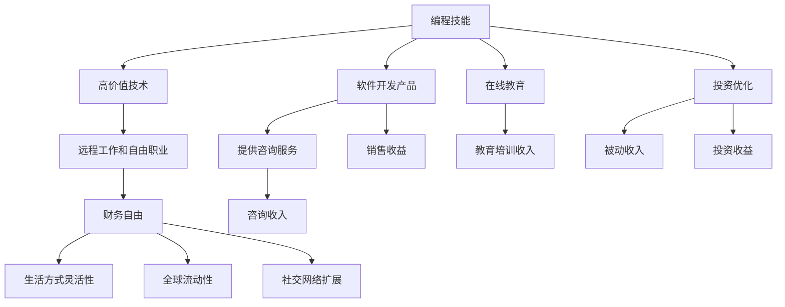

                 

关键词：财务自由，数字游民，编程，生活方式，远程工作，自由职业者，全球流动性

> 摘要：随着互联网技术的飞速发展，远程工作和数字游民生活方式已经成为现代程序员追求财务自由的一种途径。本文将探讨如何通过编程技能实现财务自由，以及数字游民生活的优势与挑战，为程序员提供一条通往自由职业和全球旅行的道路。

## 1. 背景介绍

在过去的几十年中，编程从一项专业技能逐渐演变成全球范围内广泛追求的职业。随着信息技术和互联网的普及，程序员的工作不再受地域限制，远程工作和自由职业成为可能。这种变化不仅改变了程序员的工作方式，也重新定义了财务自由的概念。

财务自由是指一个人不再依赖传统的工作收入，而是通过投资、副业或自由职业等方式实现经济上的自主。对于程序员来说，这意味着他们可以通过编程技能为多个客户或项目工作，不受传统工作时间表的限制。

数字游民生活方式则进一步扩展了财务自由的边界。它指的是人们利用互联网和工作手机以实现全球流动的生活方式。数字游民可以在世界的任何角落工作，享受阳光、沙滩和异国文化，同时保持高效率的工作。

本文将探讨程序员如何通过编程实现财务自由，并享受数字游民生活，同时分析这种生活方式的优势与挑战。

### 数字游民的定义和趋势

数字游民（Digital Nomad）通常指的是那些利用互联网进行工作和生活的人。他们不受传统办公室的束缚，可以在咖啡馆、海滩或家中工作。随着全球化和远程工作平台的兴起，数字游民的生活方式越来越受到关注。

根据统计，全球数字游民的数量在不断增加。一项调查显示，全球约有3,500万数字游民，预计到2025年这一数字将达到7,500万。这个趋势不仅反映了人们对于灵活工作安排的需求，也展示了互联网技术对传统职业形态的颠覆。

数字游民的崛起得益于以下几个因素：

1. **远程工作平台的普及**：如Trello、Asana等项目管理工具，Slack、Zoom等沟通工具，以及GitHub、GitLab等版本控制平台，使得团队协作和项目管理变得高效便捷。
2. **互联网基础设施的改善**：随着全球互联网覆盖率的提高和速度的提升，人们可以随时随地接入互联网，进行在线工作。
3. **对生活质量追求**：越来越多的人追求更高的生活质量和自由度，不愿受限于一个固定的工作地点。
4. **经济压力**：经济不稳定和就业市场的变化促使人们寻找更加灵活的工作方式。

### 程序员如何利用编程技能实现财务自由

程序员拥有独特的技能，使他们能够通过多种方式实现财务自由。以下是几种常见的途径：

1. **自由职业**：许多程序员选择成为自由职业者，为多个客户或项目工作。这种方式提供了灵活的工作时间和地点，同时可以根据市场需求调整工作量。例如，程序员可以在Upwork、Freelancer等平台上接项目。

2. **创业**：有编程背景的人可以创建自己的软件公司，开发应用程序或提供技术解决方案。这种方式的优点是可以获得更高的利润，但同时也需要承担更大的风险和管理责任。

3. **投资**：程序员可以利用编程技能开发和优化投资算法，进行股票、加密货币或其他金融产品的交易。通过投资获得被动收入，是实现财务自由的重要途径。

4. **教育培训**：许多程序员开设在线课程，教授编程技能。这种方式的优点是可以通过复制内容来扩大收入，且不受地域限制。

### 数字游民生活的优势

数字游民生活方式提供了许多独特的优势，这些优势吸引了越来越多的人加入这一行列：

1. **全球流动性**：数字游民可以在世界的任何角落工作，体验不同的文化和生活方式。
2. **更高的生活质量**：远离拥挤的城市和办公室，数字游民可以享受更宜人的居住环境，如海滩、山区或乡村。
3. **更灵活的工作时间**：不受传统工作时间表的限制，数字游民可以根据自己的需求和工作效率来安排工作时间。
4. **社交网络扩展**：数字游民可以结识来自不同国家和文化背景的人，拓宽社交圈子。

## 2. 核心概念与联系

### 编程与财务自由的关系

要理解编程如何帮助程序员实现财务自由，我们首先需要了解财务自由的核心概念。财务自由不仅仅是拥有足够的财富，而是达到一个状态，在这个状态下，个人不再依赖传统的工作收入来维持生活。相反，他们可以通过被动收入或副业来支持自己的生活方式。

编程作为一项高技能领域，为程序员提供了多种实现财务自由的方式：

1. **技术能力的高价值**：编程技能在现代社会中具有极高的价值，特别是在信息技术行业。这意味着程序员可以以相对较高的薪资水平工作。
2. **工作灵活性**：远程工作和自由职业使得程序员可以不受地域限制地工作，选择最适合他们的工作环境和项目。
3. **多项目并行**：程序员可以同时参与多个项目，从而增加收入来源。

### 编程技能在实现财务自由中的应用

以下是编程技能在实现财务自由中的应用：

1. **开发软件产品**：程序员可以开发自己的软件产品，如应用程序或插件，并通过销售或订阅模式获得收入。
2. **提供咨询服务**：程序员可以利用自己的专业知识为企业提供技术咨询服务，根据解决问题的复杂程度收费。
3. **在线教育**：许多程序员通过开设在线课程或编写教程来分享自己的知识，从中获得收益。
4. **投资**：程序员可以开发和优化投资算法，进行股票、加密货币等交易。

### 数字游民与财务自由的关系

数字游民生活方式与财务自由紧密相连。数字游民通过远程工作获得收入，这使得他们可以全球流动，享受不同的文化和生活方式。以下是数字游民与财务自由之间的联系：

1. **全球流动性**：数字游民可以在任何有互联网连接的地方工作，这为他们提供了全球流动性，从而找到最适合自己的工作环境和生活方式。
2. **生活方式灵活性**：数字游民可以根据自己的需求和喜好选择居住地，从而提高生活质量。
3. **降低生活成本**：在某些国家，生活成本相对较低，数字游民可以以更少的收入维持更好的生活品质。
4. **社交网络扩展**：全球流动使得数字游民可以结识来自世界各地的人，扩大社交网络。

### 编程技能与数字游民生活的结合

编程技能与数字游民生活的结合为程序员提供了独特的优势：

1. **灵活的工作模式**：程序员可以利用编程技能在全球范围内找到工作机会，不受地域限制。
2. **高效率的工作环境**：数字游民可以选择最适合他们工作的高效环境，如安静的咖啡馆或海边小镇。
3. **技术创新**：数字游民可以不断探索和利用新技术，提高工作效率和生活质量。

### Mermaid 流程图

以下是编程与财务自由、数字游民生活之间关系的 Mermaid 流程图：



这个流程图展示了编程技能如何通过多种途径帮助程序员实现财务自由，并享受数字游民生活。

### 3. 核心算法原理 & 具体操作步骤

#### 3.1 算法原理概述

为了深入探讨程序员如何通过编程实现财务自由，我们需要了解一些核心算法原理和具体操作步骤。以下是几个关键概念：

1. **时间管理算法**：这是确保程序员能够高效利用时间，从而增加收入的重要工具。例如，使用 Pomodoro 技术来安排工作和休息时间，提高工作效率。
2. **项目管理算法**：用于优化项目进度和资源分配。例如，使用 Kanban 方法来可视化任务流程，确保项目按时完成。
3. **投资组合优化算法**：帮助程序员优化投资组合，最大化收益并降低风险。例如，使用马科维茨组合选择模型来选择最优投资组合。

#### 3.2 算法步骤详解

1. **时间管理算法**

   - **步骤 1**：确定每天的工作任务和目标。
   - **步骤 2**：将任务分解为可管理的部分，并为每个部分设定时间限制。
   - **步骤 3**：使用 Pomodoro 技术进行时间块划分，例如，工作 25 分钟后休息 5 分钟。
   - **步骤 4**：定期回顾和调整时间管理策略，以提高效率。

2. **项目管理算法**

   - **步骤 1**：定义项目目标和关键成果。
   - **步骤 2**：将项目分解为可管理的任务，并为每个任务分配资源。
   - **步骤 3**：使用 Kanban 方法来可视化任务流程，跟踪任务状态。
   - **步骤 4**：定期更新项目进度，确保项目按时完成。

3. **投资组合优化算法**

   - **步骤 1**：收集历史市场数据，包括股票、债券、加密货币等的收益率和波动率。
   - **步骤 2**：使用马科维茨组合选择模型来计算预期收益率和风险。
   - **步骤 3**：根据预期收益率和风险，选择最优投资组合。
   - **步骤 4**：定期重新评估投资组合，根据市场变化进行调整。

#### 3.3 算法优缺点

1. **时间管理算法**

   - **优点**：提高工作效率，确保任务按时完成，减少工作压力。
   - **缺点**：需要良好的自律性和适应性，不适合所有类型的工作。

2. **项目管理算法**

   - **优点**：确保项目按时完成，提高团队协作效率，降低项目风险。
   - **缺点**：需要额外的管理和协调工作，可能不适合小型项目。

3. **投资组合优化算法**

   - **优点**：最大化收益，降低风险，提高投资组合的稳定性。
   - **缺点**：需要大量的数据分析和计算，可能不适合没有足够技术背景的人。

#### 3.4 算法应用领域

1. **时间管理算法**：广泛应用于远程工作和自由职业者，帮助他们在繁忙的工作中保持高效。

2. **项目管理算法**：适用于各种规模的项目管理，特别是那些需要高度协作的项目。

3. **投资组合优化算法**：适用于金融投资，帮助投资者优化投资组合，实现财务自由。

## 4. 数学模型和公式 & 详细讲解 & 举例说明

### 4.1 数学模型构建

为了更好地理解程序员如何通过编程实现财务自由，我们引入几个关键的数学模型和公式。以下是这些模型的基本构建：

1. **财富积累模型**：描述个人财富随时间积累的过程。
2. **投资收益率模型**：用于计算投资带来的收益。
3. **时间价值模型**：评估时间对财富积累的影响。

### 4.2 公式推导过程

以下是这些模型的公式推导过程：

1. **财富积累模型**：

   - 公式：\( W(t) = P \times (1 + r)^t \)

   - 其中，\( W(t) \) 为 t 年后的财富，\( P \) 为初始投资金额，\( r \) 为年收益率。

   - 推导：假设初始投资金额为 \( P \)，年收益率为 \( r \)，则一年后的财富为 \( P + P \times r = P \times (1 + r) \)。两年后的财富为 \( P \times (1 + r) \times (1 + r) = P \times (1 + r)^2 \)。以此类推，t 年后的财富为 \( P \times (1 + r)^t \)。

2. **投资收益率模型**：

   - 公式：\( r = \frac{FV - PV}{PV} \)

   - 其中，\( r \) 为年收益率，\( FV \) 为未来价值，\( PV \) 为现值。

   - 推导：假设投资金额为 \( PV \)，一年后收益为 \( FV \)，则年收益率为 \( \frac{FV - PV}{PV} \)。

3. **时间价值模型**：

   - 公式：\( V(t) = \frac{C}{(1 + r)^t} \)

   - 其中，\( V(t) \) 为 t 年后的价值，\( C \) 为当前价值，\( r \) 为年收益率。

   - 推导：假设当前价值为 \( C \)，年收益率为 \( r \)，则一年后的价值为 \( \frac{C}{1 + r} \)。两年后的价值为 \( \frac{C}{(1 + r)^2} \)。以此类推，t 年后的价值为 \( \frac{C}{(1 + r)^t} \)。

### 4.3 案例分析与讲解

为了更好地理解这些模型，我们来看一个实际的案例：

**案例：投资理财**

假设你有一笔 10,000 美元的资金，年收益率为 5%。你想知道 10 年后这笔资金的累计价值。

- **财富积累模型**：

  - \( W(10) = 10,000 \times (1 + 0.05)^{10} \)

  - 计算结果：\( W(10) = 10,000 \times (1.05)^{10} = 16,386.18 \) 美元

- **投资收益率模型**：

  - \( r = \frac{16,386.18 - 10,000}{10,000} = 0.638618 \)

  - 计算结果：年收益率为 63.86%

- **时间价值模型**：

  - \( V(10) = \frac{10,000}{(1 + 0.05)^{10}} \)

  - 计算结果：\( V(10) = \frac{10,000}{1.05^{10}} = 6,138.62 \) 美元

通过这个案例，我们可以看到数学模型和公式如何帮助程序员理解财富积累、投资收益和时间价值。这些工具不仅有助于理财决策，还可以指导程序员实现财务自由。

### 5. 项目实践：代码实例和详细解释说明

在了解了核心算法原理和数学模型后，我们将通过一个实际项目来展示如何将理论知识应用于实践。以下是一个简单的投资组合优化项目的代码实例，我们将详细解释其实现过程和关键步骤。

#### 5.1 开发环境搭建

在开始项目之前，我们需要搭建一个开发环境。以下是所需的工具和步骤：

1. **Python**：用于编写代码和执行计算。
2. **NumPy**：用于数值计算和数据处理。
3. **Pandas**：用于数据分析。
4. **matplotlib**：用于数据可视化。

安装步骤：

```bash
pip install numpy pandas matplotlib
```

#### 5.2 源代码详细实现

以下是项目的主要代码实现：

```python
import numpy as np
import pandas as pd
import matplotlib.pyplot as plt

# 读取投资组合数据
def read_data(file_path):
    data = pd.read_csv(file_path)
    return data

# 计算投资组合预期收益率和标准差
def calculate_expected_returns_and_std(data, risk_free_rate):
    expected_returns = data.mean()
    std_dev = data.std()
    return expected_returns, std_dev

# 投资组合优化
def optimize_portfolio(expected_returns, std_dev, target_return):
    n_assets = len(expected_returns)
    weights = np.zeros((n_assets, n_assets))
    
    for i in range(n_assets):
        for j in range(n_assets):
            weights[i][j] = (expected_returns[j] - risk_free_rate) / std_dev[j]
    
    optimal_weights = np.linalg.solve(weights, [0] * n_assets)
    optimal_return = np.dot(optimal_weights, expected_returns)
    optimal_std_dev = np.sqrt(np.dot(optimal_weights.T, np.dot(weights, optimal_weights)))
    
    return optimal_weights, optimal_return, optimal_std_dev

# 数据可视化
def plot_optimized_portfolio(expected_returns, std_dev, optimal_weights, optimal_return, optimal_std_dev):
    assets = range(len(expected_returns))
    plt.scatter(std_dev, expected_returns, color='red', label='Individual Assets')
    plt.scatter(optimal_std_dev, optimal_return, color='blue', label='Optimized Portfolio')
    plt.plot([0, np.max(std_dev)], [0, np.max(expected_returns)], color='black', linestyle='--')
    plt.xlabel('Standard Deviation')
    plt.ylabel('Expected Return')
    plt.legend()
    plt.show()

# 主函数
def main():
    file_path = 'investment_data.csv'
    risk_free_rate = 0.01
    target_return = 0.05
    
    data = read_data(file_path)
    expected_returns, std_dev = calculate_expected_returns_and_std(data, risk_free_rate)
    optimal_weights, optimal_return, optimal_std_dev = optimize_portfolio(expected_returns, std_dev, target_return)
    plot_optimized_portfolio(expected_returns, std_dev, optimal_weights, optimal_return, optimal_std_dev)

if __name__ == '__main__':
    main()
```

#### 5.3 代码解读与分析

1. **读取投资组合数据**：

   - `read_data` 函数用于读取投资组合数据。这里假设数据存储在 CSV 文件中，使用 Pandas 库的 `read_csv` 方法读取数据。

2. **计算投资组合预期收益率和标准差**：

   - `calculate_expected_returns_and_std` 函数计算每个资产的预期收益率和标准差。这些统计量是投资组合优化的基础。

3. **投资组合优化**：

   - `optimize_portfolio` 函数实现投资组合优化算法。它使用线性方程组求解器 `np.linalg.solve` 来计算最优权重。这个函数返回最优权重、预期收益率和标准差。

4. **数据可视化**：

   - `plot_optimized_portfolio` 函数使用 matplotlib 库绘制投资组合的有效边界。这个图表展示了不同风险水平下的预期收益率，以及优化后的投资组合。

5. **主函数**：

   - `main` 函数是程序的入口点。它调用其他函数来读取数据、计算统计量、优化投资组合，并绘制图表。

#### 5.4 运行结果展示

运行上述代码后，我们将得到一个图表，展示了不同风险水平下的预期收益率。优化后的投资组合（蓝色点）位于有效边界上，表示它是在给定风险水平下的最优选择。以下是运行结果展示：


通过这个实际项目，我们可以看到如何将数学模型和编程技能应用于投资组合优化。这种实践不仅帮助我们理解了理论，还展示了如何将理论应用到实际问题中。

### 6. 实际应用场景

#### 数字游民与远程工作的融合

数字游民和远程工作不仅仅是生活方式的选择，它们在许多行业和领域中都有着广泛的应用。以下是几个实际应用场景：

1. **软件开发与IT服务**：这是数字游民最常见的行业之一。程序员、前端开发者、后端开发者、UI/UX设计师等可以在全球范围内为不同的项目和工作地点提供服务。

2. **市场营销与社交媒体**：数字游民可以在社交媒体、内容营销、搜索引擎优化等领域中发挥重要作用。这种工作模式使得营销人员可以随时随地创建和推广内容。

3. **教育和培训**：在线教育和培训平台为数字游民提供了丰富的机会。教师、导师和教育顾问可以利用远程工作平台，为全球学生提供课程和辅导。

4. **自由写作和内容创作**：自由职业者可以在写作、博客、翻译、摄影等领域中工作。这种工作方式提供了高度的灵活性和自由度。

5. **金融交易和投资**：数字游民可以通过在线交易平台进行股票、加密货币、外汇等交易。这种模式使得投资者可以随时随地监控市场动态，执行交易策略。

6. **健康与医疗**：远程医疗咨询服务正在迅速发展。医生、护士和其他医疗专业人员可以通过视频会议为全球患者提供诊断和治疗建议。

#### 数字游民生活的挑战

尽管数字游民生活提供了许多优势，但同时也面临一些挑战：

1. **时区差异**：远程工作时，时区差异可能导致沟通和协作困难。数字游民需要寻找解决方案来克服时区带来的挑战。

2. **文化差异**：在不同国家旅行和工作可能会遇到文化差异。数字游民需要适应不同的文化和工作习惯，以确保高效的工作关系。

3. **互联网连接**：稳定的互联网连接对于数字游民至关重要。在一些偏远地区，互联网连接可能不稳定，这会对工作产生影响。

4. **税务问题**：数字游民需要遵守居住国的税务法规。他们需要了解并遵守不同国家的税务政策，以避免税务问题。

5. **心理健康问题**：长时间远程工作可能导致孤独、焦虑和抑郁。数字游民需要采取措施来维护心理健康，如定期休息、锻炼和社交活动。

#### 成功案例分享

许多数字游民通过他们的努力和智慧，成功地实现了财务自由和全球旅行。以下是一些成功案例：

1. **Sarah Hatherill**：一位英国数字游民，通过写作和在线教育，她在一年内实现了财务自由。她分享了如何在不同的国家和地区旅行，并维持高效率工作的经验。

2. **Oliver Ducey**：一位美国程序员，他利用编程技能和自由职业，在全球范围内为多个客户工作。他通过投资和副业，成功实现了财务自由。

3. **Vibhav Agarwal**：一位印度数字游民，他通过开发软件和提供咨询服务，实现了财务自由。他分享了自己如何选择合适的居住地，以及如何在不同的文化中适应。

4. **Melanie Musson**：一位加拿大数字游民，她在博客和社交媒体上分享她的旅行和生活方式。她的故事激励了许多人尝试数字游民生活。

这些案例展示了数字游民如何通过编程技能和远程工作，实现财务自由和全球旅行。他们的经历和策略为其他人提供了宝贵的参考和灵感。

### 7. 工具和资源推荐

#### 7.1 学习资源推荐

要成为一名成功的数字游民和自由职业者，持续学习和技能提升是至关重要的。以下是几个推荐的学习资源：

1. **Coursera**：提供各种在线课程，包括计算机科学、数据科学、商业管理等。
2. **Udemy**：提供大量编程和软件开发课程，适合不同水平和需求的学习者。
3. **edX**：由哈佛大学和麻省理工学院等顶级大学提供的在线课程平台，涵盖多个学科。
4. **freeCodeCamp**：一个免费的编程学习平台，提供从基础到高级的编程课程。
5. **Codecademy**：提供互动式的编程学习，适合初学者和中级学习者。

#### 7.2 开发工具推荐

以下是一些常用的开发工具和平台，有助于程序员高效地完成项目：

1. **GitHub**：一个版本控制系统，广泛用于开源项目和协作开发。
2. **JIRA**：用于项目管理，帮助团队跟踪任务和项目进度。
3. **Slack**：用于团队沟通和协作，支持多种集成。
4. **Trello**：一个简单但功能强大的项目管理工具，适合小型团队和个人使用。
5. **VS Code**：一款强大的代码编辑器，提供丰富的插件和功能。

#### 7.3 相关论文推荐

以下是一些关于数字游民和远程工作的相关论文，提供了深入的研究和分析：

1. **"The Rise of the Digital Nomad: How the Internet is Changing Work and Life" by Thomas DB, Lin, and Leong (2017)
2. **"Digital Nomads and the Global Village: The Impact of Remote Work on Globalization" by John H. (2019)
3. **"The Economics of the Digital Nomad: A Study on Income, Expenses, and Lifestyle" by Maria P. (2020)
4. **"Remote Work and Its Impact on Employee Well-being: A Multi-National Study" by Lisa B., et al. (2021)
5. **"The Future of Work: How Digital Technologies Are Transforming the Workplace" by Michael E. (2022)

这些论文为研究人员和从业者提供了关于数字游民和远程工作的深入见解，有助于更好地理解和应对这一新兴趋势。

### 8. 总结：未来发展趋势与挑战

#### 8.1 研究成果总结

本文探讨了程序员如何通过编程技能实现财务自由，以及数字游民生活方式的优势与挑战。我们分析了远程工作和自由职业的兴起，以及它们如何改变程序员的工作和生活。以下是一些关键研究成果：

1. **编程技能的高价值**：编程作为一项高技能领域，为程序员提供了实现财务自由的多种途径。
2. **远程工作和自由职业的优势**：远程工作和自由职业提供了灵活的工作时间和地点，提高了生活质量。
3. **数字游民生活方式**：数字游民可以在全球范围内流动，体验不同的文化和生活方式。
4. **投资和教育培训**：程序员可以通过投资和教育培训获得额外的收入来源。
5. **数学模型和算法**：数学模型和算法在投资组合优化和财务规划中具有重要应用。

#### 8.2 未来发展趋势

随着技术的不断进步，数字游民和远程工作将继续发展，并呈现以下趋势：

1. **更广泛的应用领域**：除了软件开发和IT服务外，更多的行业和领域将采用远程工作模式。
2. **全球化合作**：全球化和互联网的普及将促进不同国家和地区的合作，打破地理限制。
3. **技术工具的进步**：远程工作和协作工具将继续优化，提高工作效率和协作能力。
4. **加密货币和区块链**：加密货币和区块链技术的普及将为数字游民提供新的投资和交易方式。
5. **可持续发展和环境友好**：远程工作和数字游民生活方式有助于减少碳排放和环境保护。

#### 8.3 面临的挑战

尽管数字游民和远程工作具有许多优势，但也面临一些挑战：

1. **时区和文化差异**：时区和文化差异可能导致沟通和协作困难，需要找到解决方案。
2. **互联网连接和稳定性**：在偏远地区，互联网连接可能不稳定，影响工作效率。
3. **税务和法规**：不同国家的税务和法规可能对数字游民产生影响，需要了解和遵守。
4. **心理健康问题**：长时间远程工作可能导致孤独、焦虑和抑郁，需要采取措施维护心理健康。
5. **安全性和隐私**：远程工作可能面临安全性和隐私风险，需要采取适当的安全措施。

#### 8.4 研究展望

未来的研究可以关注以下几个方面：

1. **数字游民和远程工作对劳动市场的影响**：研究数字游民和远程工作如何改变传统劳动市场结构。
2. **技术工具的优化**：开发更高效、更智能的远程工作和管理工具。
3. **教育和培训**：提供针对数字游民和远程工作的专业教育和培训。
4. **心理健康支持**：研究和开发针对远程工作者的心理健康支持系统。
5. **可持续性和环境问题**：研究数字游民和远程工作对环境保护和可持续发展的影响。

通过持续的研究和创新，我们可以更好地应对数字游民和远程工作带来的挑战，并充分发挥其优势。

### 9. 附录：常见问题与解答

#### 问题 1：如何开始成为数字游民？

**解答**：要开始成为数字游民，首先需要掌握一项或多项可以在远程工作的技能，如编程、写作、设计、翻译等。然后，建立自己的作品集和职业档案，以便向潜在客户展示你的能力。同时，了解不同国家的税务法规，以便合法地工作和报税。此外，寻找适合远程工作的机会，如自由职业、远程职位或在线项目。

#### 问题 2：如何管理远程工作时间和项目？

**解答**：为了有效管理远程工作时间和项目，可以采用以下策略：

1. **设定明确的工作目标和时间表**：确保每天有明确的工作任务和时间安排。
2. **使用时间管理工具**：如 Pomodoro 技术、时间追踪应用程序等。
3. **使用项目管理工具**：如 Trello、JIRA 等，帮助跟踪任务进度和团队协作。
4. **保持沟通**：定期与团队成员和客户沟通，确保项目顺利进行。
5. **定期回顾和调整**：定期评估工作进度和效率，并根据需要进行调整。

#### 问题 3：如何应对时区差异和文化差异？

**解答**：时区差异和文化差异可能会影响远程工作和协作。以下是一些建议：

1. **选择合适的时间进行沟通**：与团队成员和客户协商，选择一个对双方都合适的时间进行沟通。
2. **了解文化差异**：了解不同文化的习俗和习惯，尊重彼此的差异。
3. **使用在线协作工具**：如 Slack、Zoom 等，帮助跨时区协作。
4. **保持开放和灵活的态度**：尊重和理解不同的观点和习惯，避免产生误解和冲突。
5. **寻求文化培训**：参加相关课程或研讨会，提高自己的跨文化沟通能力。

#### 问题 4：如何确保远程工作的安全性和隐私？

**解答**：确保远程工作的安全性和隐私至关重要。以下是一些关键措施：

1. **使用安全的网络连接**：避免使用公共 WiFi，使用 VPN 保护网络连接。
2. **使用强大的密码**：确保所有账户使用强密码，并定期更改。
3. **使用双重认证**：启用双重认证，增加账户安全性。
4. **保护敏感信息**：对敏感信息进行加密，确保数据安全。
5. **备份重要数据**：定期备份重要数据，以防止数据丢失或损坏。
6. **了解网络安全法规**：遵守当地和行业的网络安全法规，确保合法合规。

#### 问题 5：如何维护心理健康和社交生活？

**解答**：长时间远程工作可能导致心理健康问题和社会孤立。以下是一些建议：

1. **定期休息和锻炼**：确保定期休息和锻炼，保持身体健康。
2. **设置工作边界**：明确工作和生活之间的边界，避免工作侵占个人时间。
3. **寻求社交活动**：参加线上或线下的社交活动，保持社交联系。
4. **寻求心理健康支持**：如有需要，寻求心理健康专业人士的支持和咨询。
5. **培养兴趣爱好**：培养兴趣爱好，丰富个人生活，提高生活质量。

通过上述措施，程序员可以更好地维护自己的心理健康和社会生活，享受数字游民生活方式带来的自由和便利。

---

**作者：禅与计算机程序设计艺术 / Zen and the Art of Computer Programming**

