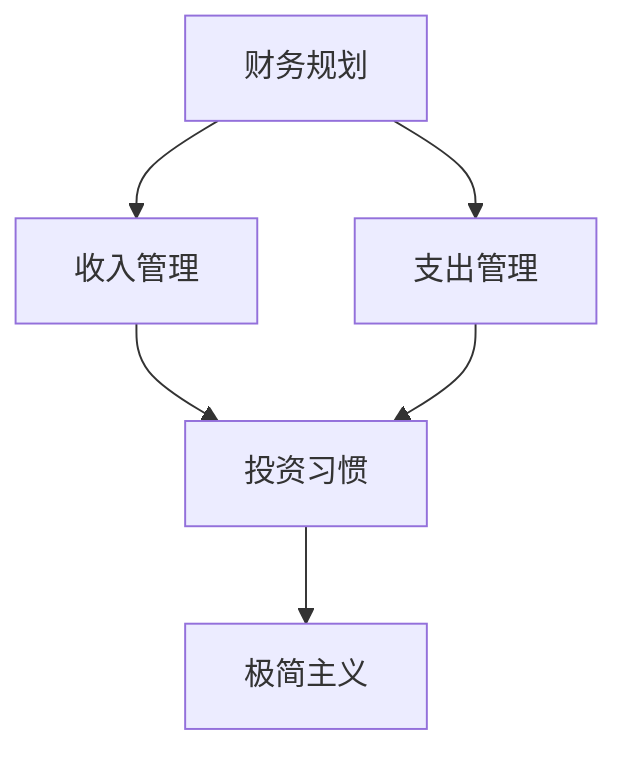

                 

关键词：财务自由，极简主义，程序员，财富管理，生活方式优化

> 摘要：本文旨在探讨程序员如何通过极简主义生活方式实现财务自由。通过构建合理的财务规划、优化收入和支出，以及培养良好的投资习惯，程序员可以在保持高效工作与享受生活的同时，逐步实现财富积累和自由。

## 1. 背景介绍

在信息技术迅速发展的时代，程序员成为现代社会中不可或缺的职业。他们凭借专业技能，在互联网企业、科技公司和创业公司中扮演着重要角色。然而，高薪与长时间工作之间的矛盾也困扰着许多程序员。如何在忙碌的工作之余实现财务自由，成为许多程序员关注的话题。

极简主义作为一种生活哲学，提倡减少物质和精神的负担，追求简约和高效。它对于繁忙的程序员来说，不仅能够帮助减轻生活压力，还能优化时间管理和财务规划，从而为实现财务自由奠定基础。

本文将围绕极简主义生活方式，探讨程序员如何通过以下几方面实现财务自由：

1. **构建合理的财务规划**：制定清晰的财务目标，规划收入和支出。
2. **优化收入和支出**：提高收入来源，控制不必要的支出。
3. **培养良好的投资习惯**：通过投资实现资产的增值。
4. **生活方式优化**：通过极简主义实现时间管理和生活质量的提升。

## 2. 核心概念与联系

### 财务规划

财务规划是管理个人财务的第一步。它包括评估当前的财务状况、制定短期和长期财务目标，以及制定实现这些目标的策略。

### 收入和支出

收入和支出的管理是实现财务自由的关键。收入来源的多样化和支出管理的精细化有助于提高财务自主性。

### 投资习惯

投资是实现财富增值的重要手段。培养良好的投资习惯，如定期投资、分散投资和长期投资，是财务自由的重要保障。

### 极简主义

极简主义是一种生活方式，它强调减少物质和精神的负担，追求简约和高效。对于程序员来说，极简主义有助于提高工作效率、减少压力，并优化财务状况。

下面是财务规划、收入和支出管理、投资习惯以及极简主义之间的联系：



## 3. 核心算法原理 & 具体操作步骤

### 3.1 算法原理概述

财务自由的核心算法是合理规划和管理个人财务。这包括以下步骤：

1. **评估财务状况**：了解当前的财务状况，包括收入、支出和储蓄。
2. **制定财务目标**：设定短期和长期财务目标，如还清债务、实现储蓄目标、购买房产或退休计划。
3. **制定财务策略**：根据财务目标和现状，制定实现目标的策略，如提高收入、减少不必要的支出、增加储蓄和投资。
4. **执行和监控**：执行财务策略，并定期监控财务状况，确保目标的实现。

### 3.2 算法步骤详解

1. **评估财务状况**

   - **收集财务信息**：收集所有收入来源、支出项目和现有资产的信息。
   - **计算净收入**：净收入 = 总收入 - 必需支出。
   - **分析财务状况**：了解当前的财务状况，包括储蓄水平、负债状况和资产配置。

2. **制定财务目标**

   - **设定短期目标**：如还清债务、实现紧急储蓄等。
   - **设定长期目标**：如退休计划、购房计划等。
   - **制定实现目标的时间表**：确定每个目标的实现时间，并制定相应的策略。

3. **制定财务策略**

   - **提高收入**：寻找提高收入的机会，如晋升、兼职、副业等。
   - **减少不必要的支出**：评估支出，取消不必要的订阅、购物和餐饮等。
   - **增加储蓄和投资**：制定储蓄计划，将一部分收入用于投资。

4. **执行和监控**

   - **执行财务策略**：按照制定的目标和策略执行。
   - **定期监控**：每月或每季度评估财务状况，确保目标的实现。

### 3.3 算法优缺点

#### 优点：

- **提高财务自主性**：通过合理规划和管理财务，提高财务自主性，减少对工作的依赖。
- **实现财务目标**：明确财务目标，制定实现策略，有助于实现财务自由。
- **优化生活品质**：通过控制支出和增加储蓄，提高生活品质。

#### 缺点：

- **需要时间和精力**：制定和执行财务规划需要投入时间和精力。
- **风险**：投资存在风险，需要谨慎评估和管理。

### 3.4 算法应用领域

- **个人财务**：适用于所有希望实现财务自由的个人。
- **企业财务**：适用于希望提高企业财务健康程度的企业。

## 4. 数学模型和公式 & 详细讲解 & 举例说明

### 4.1 数学模型构建

为了实现财务自由，我们需要构建一个数学模型来帮助评估和管理个人财务。以下是一个基本的数学模型：

$$
F(t) = I(t) - E(t)
$$

其中，$F(t)$表示在时间$t$时的财务状况，$I(t)$表示在时间$t$时的总收入，$E(t)$表示在时间$t$时的总支出。

### 4.2 公式推导过程

为了推导上述公式，我们首先需要定义总收入和总支出的构成。

#### 总收入

总收入包括以下部分：

$$
I(t) = W(t) + O(t) + S(t)
$$

- $W(t)$表示工资收入。
- $O(t)$表示其他收入，如奖金、股息、租金等。
- $S(t)$表示储蓄收入，即通过储蓄账户所产生的利息收入。

#### 总支出

总支出包括以下部分：

$$
E(t) = N(t) + U(t) + D(t)
$$

- $N(t)$表示必需支出，如房租、食物、医疗等。
- $U(t)$表示可选支出，如旅游、娱乐、购物等。
- $D(t)$表示债务偿还支出，如贷款还款等。

### 4.3 案例分析与讲解

假设一个程序员，月工资为10,000元，其他收入为每月500元的股息收入，每月必需支出为5,000元，可选支出为2,000元，每月偿还贷款1,000元。我们可以使用上述数学模型来计算他的财务状况。

#### 总收入

$$
I(t) = 10,000 + 500 = 10,500
$$

#### 总支出

$$
E(t) = 5,000 + 2,000 + 1,000 = 8,000
$$

#### 财务状况

$$
F(t) = 10,500 - 8,000 = 2,500
$$

这意味着这个程序员的每月净收入为2,500元。

#### 财务分析

- **储蓄能力**：由于他的月收入超过月支出，他有2,500元的储蓄能力。
- **债务偿还**：每月偿还1,000元的债务，这将有助于减轻未来的财务负担。

### 4.4 数学模型的应用

通过上述数学模型，我们可以对个人的财务状况进行定量分析，并根据实际情况调整收入和支出策略，以实现财务自由。

## 5. 项目实践：代码实例和详细解释说明

### 5.1 开发环境搭建

为了实践财务自由算法，我们使用Python作为编程语言，并使用Jupyter Notebook作为开发环境。以下是搭建开发环境的步骤：

1. 安装Python：访问Python官方网站下载Python安装包，并按照安装向导进行安装。
2. 安装Jupyter Notebook：在命令行中执行以下命令：

   ```bash
   pip install notebook
   ```

3. 启动Jupyter Notebook：在命令行中执行以下命令：

   ```bash
   jupyter notebook
   ```

### 5.2 源代码详细实现

以下是实现财务自由算法的Python代码实例：

```python
# 财务自由算法实现

# 定义总收入和总支出的构成
def calculate_income(monthly_salary, additional_income, savings_income):
    return monthly_salary + additional_income + savings_income

def calculate_expenses(necessities, optional_expenses, debt_payment):
    return necessities + optional_expenses + debt_payment

# 计算财务状况
def calculate_financial_status(monthly_salary, additional_income, savings_income, necessities, optional_expenses, debt_payment):
    income = calculate_income(monthly_salary, additional_income, savings_income)
    expenses = calculate_expenses(necessities, optional_expenses, debt_payment)
    return income - expenses

# 示例数据
monthly_salary = 10000
additional_income = 500
savings_income = 0
necessities = 5000
optional_expenses = 2000
debt_payment = 1000

# 计算财务状况
financial_status = calculate_financial_status(monthly_salary, additional_income, savings_income, necessities, optional_expenses, debt_payment)
print(f"财务状况：{financial_status}")
```

### 5.3 代码解读与分析

上述代码实现了一个简单的财务自由算法，主要包括以下几个部分：

- **总收入计算**：`calculate_income`函数用于计算总收入，包括月工资、其他收入和储蓄收入。
- **总支出计算**：`calculate_expenses`函数用于计算总支出，包括必需支出、可选支出和债务偿还。
- **财务状况计算**：`calculate_financial_status`函数用于计算财务状况，即总收入减去总支出。

在示例数据中，我们假设一个程序员的月工资为10,000元，其他收入为每月500元的股息收入，每月必需支出为5,000元，可选支出为2,000元，每月偿还贷款1,000元。通过调用`calculate_financial_status`函数，我们可以计算该程序员的财务状况。

### 5.4 运行结果展示

运行上述代码后，我们得到以下输出结果：

```
财务状况：2500
```

这意味着该程序员的月财务状况为2,500元。通过调整收入和支出，我们可以优化财务状况，实现财务自由。

## 6. 实际应用场景

财务自由算法在程序员中的实际应用场景非常广泛。以下是一些具体的案例：

- **个人财务规划**：程序员可以利用财务自由算法进行个人财务规划，包括制定短期和长期财务目标，以及制定实现这些目标的策略。
- **债务管理**：通过财务自由算法，程序员可以清晰地了解自己的财务状况，制定债务管理策略，如优先偿还高利率债务、制定债务还款计划等。
- **投资规划**：财务自由算法可以帮助程序员进行投资规划，包括确定投资目标、选择合适的投资渠道和制定投资策略。
- **时间管理**：极简主义生活方式的应用可以帮助程序员优化时间管理，提高工作效率，从而有更多的时间去追求财务自由。

### 6.4 未来应用展望

随着人工智能和大数据技术的发展，财务自由算法的应用前景将更加广阔。以下是一些未来的应用方向：

- **智能财务规划**：利用人工智能技术，为程序员提供更加智能化的财务规划服务，根据个人财务状况和投资目标，自动生成最优的财务策略。
- **个性化投资建议**：通过大数据分析和机器学习，为程序员提供个性化的投资建议，帮助他们实现资产的优化配置。
- **财务健康监控**：利用物联网技术，实现实时监控个人财务状况，及时发现财务风险，并提供相应的解决方案。

## 7. 工具和资源推荐

为了实现财务自由，程序员需要掌握一些工具和资源。以下是一些建议：

### 7.1 学习资源推荐

- **《富爸爸穷爸爸》**：罗伯特·清崎的这本书提供了关于财务规划和投资的基础知识。
- **《穷查理宝典》**：查理·芒格的智慧集，涵盖了许多关于投资和生活哲学的思考。
- **《财富自由之路》**：李笑来的一本关于财务自由和自我提升的书籍。

### 7.2 开发工具推荐

- **Python**：Python是一种易于学习和使用的编程语言，非常适合进行财务自由算法的实现。
- **Jupyter Notebook**：Jupyter Notebook是一个交互式的开发环境，方便程序员进行算法的实现和调试。

### 7.3 相关论文推荐

- **"Financial Planning for Programmers"**：一篇关于程序员如何进行财务规划的论文。
- **"The Impact of Financial Literacy on Programmers"**：一篇关于财务素养对程序员生活影响的研究论文。

## 8. 总结：未来发展趋势与挑战

### 8.1 研究成果总结

本文通过探讨财务自由和极简主义生活方式，为程序员提供了一套实现财务自由的方法。通过合理规划财务、优化收入和支出，以及培养良好的投资习惯，程序员可以在保持高效工作与享受生活的同时，逐步实现财富积累和自由。

### 8.2 未来发展趋势

随着人工智能和大数据技术的发展，财务自由算法将变得更加智能化和个性化。程序员可以通过使用先进的工具和资源，实现更加精准和高效的财务规划。

### 8.3 面临的挑战

- **时间管理**：实现财务自由需要投入大量时间和精力，程序员需要在工作和生活之间找到平衡。
- **风险控制**：投资存在风险，程序员需要谨慎评估和管理风险。

### 8.4 研究展望

未来，财务自由算法的研究将继续深入，特别是在人工智能和大数据技术的支持下，将出现更多创新和突破。程序员需要不断学习和更新知识，以应对快速变化的技术环境。

## 9. 附录：常见问题与解答

### Q：财务自由是否适合所有人？

A：财务自由的理念适合大多数有志于改善财务状况的人，但具体实施策略需要根据个人的财务状况、生活目标和个人偏好进行调整。

### Q：如何确定财务目标？

A：确定财务目标需要考虑短期和长期需求，如购房、育儿、退休等。同时，要考虑个人价值观和生活方式。

### Q：极简主义是否适合所有人？

A：极简主义适合那些希望减少物质负担、追求生活质量提升的人。不同的人对极简主义的理解与实践方式可能有所不同。

### Q：如何平衡工作与财务规划？

A：制定合理的日程安排，确保有足够的时间进行财务规划。使用自动化工具和财务软件可以帮助提高效率。

### Q：财务自由后是否还需要工作？

A：不一定。财务自由后，你可以选择继续工作以追求职业成就或个人兴趣，也可以选择退休享受生活。关键在于实现财务自由后，你的生活目标是否得到满足。

