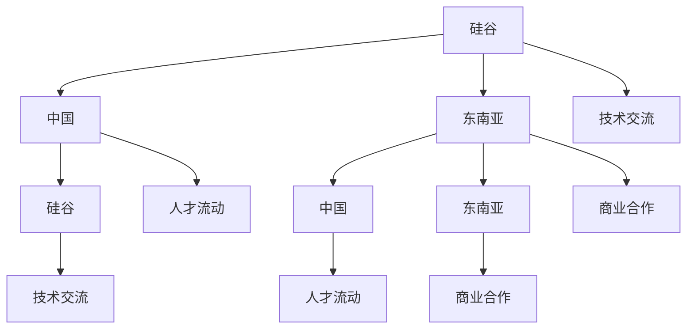

                 

## 1. 背景介绍

在全球化和技术迅猛发展的背景下，程序员作为信息技术时代的核心力量，其职业发展已经不再局限于一个地区或国家。跨国发展已经成为越来越多程序员的职业选择。在这篇文章中，我们将探讨硅谷、中国和东南亚这三个在全球软件开发领域具有重要地位的地区，为程序员提供的机遇和挑战。

硅谷作为全球科技创新的中心，以其丰富的资源和成熟的技术生态系统吸引着全球顶尖的程序员。中国，作为世界第二大经济体，近年来在科技创新和软件开发领域取得了显著成就，成为众多程序员追求的职业梦想地。东南亚地区，以其快速发展的经济和潜力巨大的市场，正逐渐成为程序员跨国发展的新热点。

在这篇文章中，我们将从以下几个角度展开讨论：

1. **硅谷的程序员职业生态**：介绍硅谷的编程文化、人才需求以及程序员在硅谷的职业发展路径。
2. **中国的程序员市场**：分析中国软件行业的发展趋势、程序员的机会和挑战。
3. **东南亚的机遇与挑战**：探讨东南亚国家在软件开发领域的成长潜力，以及程序员在此地的职业发展。
4. **跨国发展的策略与建议**：提供程序员的跨国发展策略，包括技能提升、文化适应和职业规划等方面的建议。
5. **未来的发展趋势与挑战**：预测程序员跨国发展的未来趋势，以及可能面临的挑战。

通过以上内容的探讨，希望能够为正在考虑跨国发展的程序员们提供一些有价值的参考和指导。

## 2. 核心概念与联系

### 2.1 全球软件开发领域概述

在全球范围内，软件开发已成为推动经济增长和产业升级的重要动力。从硅谷到中国，再到东南亚，各地区的软件开发领域都展现出独特的发展特点和趋势。以下是一个简单的全球软件开发领域概述，帮助读者更好地理解本文的核心概念和联系。

#### 2.1.1 硅谷

硅谷，位于美国加利福尼亚州旧金山湾区，是全球科技创新和软件开发的热点地区。硅谷以其开放的创新文化、丰富的投资资源和世界一流的研究机构著称，吸引了全球顶尖的程序员和技术企业。

- **编程文化**：硅谷崇尚创新和自由，鼓励程序员不断尝试新的技术和方法。
- **人才需求**：硅谷对程序员的需求主要集中在人工智能、大数据、云计算和区块链等前沿技术领域。
- **职业发展**：硅谷为程序员提供了广阔的职业发展空间，从技术专家到创业CEO，各种职业路径都可以在这里找到。

#### 2.1.2 中国

中国，作为世界第二大经济体，近年来在软件开发领域取得了显著成就。中国的软件行业不仅在国内市场蓬勃发展，同时也逐渐走向全球。

- **发展趋势**：中国软件行业的发展趋势包括人工智能、物联网、云计算和5G等新兴技术的应用。
- **人才机会**：随着互联网企业和科技巨头的发展，中国对程序员的巨大需求提供了众多职业机会。
- **挑战**：国内竞争激烈，程序员需要不断提升自己的技能以适应快速变化的市场需求。

#### 2.1.3 东南亚

东南亚，作为一个经济快速发展的地区，其软件开发领域正逐渐崭露头角。

- **成长潜力**：东南亚国家的经济增长速度快，互联网普及率高，为软件开发领域提供了巨大的市场潜力。
- **机会**：东南亚的初创企业数量增长迅速，为程序员提供了丰富的创业和就业机会。
- **挑战**：技术和人才储备相对不足，程序员需要面对技术和市场发展的挑战。

### 2.2 各地区软件开发领域的互动关系

硅谷、中国和东南亚在软件开发领域的互动关系主要体现在技术交流、人才流动和商业合作等方面。

- **技术交流**：通过国际会议、技术论坛和开源项目，各地区程序员可以分享经验、学习和合作。
- **人才流动**：硅谷的顶尖程序员和技术企业吸引了中国和东南亚的优秀人才，反之亦然。
- **商业合作**：各地区的科技企业和创业者通过合作，共同开发全球市场，实现共赢。

### 2.3 Mermaid 流程图

以下是各地区软件开发领域的互动关系的一个简单 Mermaid 流程图，帮助读者更直观地理解各环节之间的联系。



通过上述核心概念和联系的介绍，读者可以更好地理解本文的结构和内容，为接下来的讨论打下基础。

## 3. 核心算法原理 & 具体操作步骤

### 3.1 算法原理概述

在跨国程序员的发展过程中，算法原理和具体操作步骤起着至关重要的作用。本部分将介绍几种关键算法原理，并详细描述其在程序员职业发展中的应用。

#### 3.1.1 前端开发算法

前端开发是程序员职业发展的一个重要方向，其核心算法包括：

- **响应式布局算法**：通过计算不同屏幕尺寸下的元素位置和大小，实现网页在不同设备上的自适应展示。
- **状态管理算法**：如Redux和Vuex，用于管理前端应用的状态，提高代码的可维护性和可测试性。

#### 3.1.2 后端开发算法

后端开发涉及到的算法更加多样，以下为几种常见的算法：

- **数据结构算法**：如栈、队列、图和树等，用于高效地存储和检索数据。
- **排序算法**：如快速排序、归并排序和冒泡排序，用于对数据进行排序操作。
- **搜索算法**：如二分搜索和深度优先搜索，用于在数据结构中查找特定元素。

#### 3.1.3 人工智能算法

随着人工智能技术的快速发展，程序员需要掌握以下几种核心算法：

- **机器学习算法**：如线性回归、支持向量机和决策树，用于建立预测模型。
- **神经网络算法**：如卷积神经网络（CNN）和循环神经网络（RNN），用于处理复杂数据。
- **深度学习算法**：如生成对抗网络（GAN）和强化学习，用于解决更高级的计算机视觉和自然语言处理问题。

### 3.2 算法步骤详解

下面我们详细描述几种关键算法的具体操作步骤。

#### 3.2.1 前端开发算法

**响应式布局算法**：

1. **获取屏幕尺寸**：通过JavaScript获取当前屏幕的宽度、高度等信息。
2. **计算元素位置和大小**：根据屏幕尺寸和预设的布局规则，计算每个元素的位置和大小。
3. **动态调整布局**：根据计算结果，动态调整网页布局，实现自适应展示。

**状态管理算法**：

1. **初始化状态**：创建一个初始状态对象，用于存储应用的数据。
2. **设置 reducer 函数**：定义一个 reducer 函数，用于处理来自组件的状态更新请求。
3. **监听状态变化**：通过监听状态变化，更新 UI 组件，保持界面和数据的一致性。

#### 3.2.2 后端开发算法

**数据结构算法**：

1. **创建数据结构**：根据实际需求，选择合适的数据结构（如链表、树、图等）。
2. **操作数据**：通过特定操作（如插入、删除、查找等），实现对数据的存储和检索。
3. **优化数据结构**：分析数据结构性能，通过调整数据结构或算法，提高数据操作效率。

**排序算法**：

1. **选择排序**：
   - 从未排序的元素中找到最小（或最大）的元素。
   - 将该元素放置到已排序序列的末尾。
   - 重复以上步骤，直到所有元素都被排序。

2. **快速排序**：
   - 选择一个基准元素。
   - 将其他元素分为两组，一组小于基准，另一组大于基准。
   - 递归地对待排序的两组进行快速排序。
   - 合并已排序的两组。

**搜索算法**：

1. **二分搜索**：
   - 将待搜索的元素与中间元素进行比较。
   - 根据比较结果，将搜索范围缩小一半。
   - 重复以上步骤，直到找到目标元素或确定元素不存在。

2. **深度优先搜索**：
   - 选择一个起点，然后递归地探索其所有未访问的邻接节点。
   - 记录已访问的节点，避免重复访问。
   - 当所有节点都被访问后，返回结果。

#### 3.2.3 人工智能算法

**机器学习算法**：

1. **数据预处理**：
   - 清洗数据，去除噪声和异常值。
   - 标准化或归一化数据，使其符合模型的要求。
   - 划分训练集和测试集，用于训练和评估模型。

2. **模型选择**：
   - 根据问题类型和数据特点，选择合适的机器学习算法（如线性回归、支持向量机等）。
   - 调整模型参数，以优化模型性能。

3. **模型训练**：
   - 使用训练集数据，对模型进行训练。
   - 记录训练过程中的损失函数值，以监控模型性能。

4. **模型评估**：
   - 使用测试集数据，评估模型在未知数据上的性能。
   - 根据评估结果，调整模型参数或选择其他模型。

**神经网络算法**：

1. **构建神经网络**：
   - 定义网络结构，包括输入层、隐藏层和输出层。
   - 选择合适的激活函数（如ReLU、Sigmoid等）。

2. **前向传播**：
   - 将输入数据传递到网络中，计算各层的输出。
   - 计算网络的损失函数，以评估模型性能。

3. **反向传播**：
   - 计算损失函数关于各层参数的梯度。
   - 使用梯度下降法或其他优化算法，更新网络参数。

4. **训练与评估**：
   - 重复前向传播和反向传播，进行多次迭代训练。
   - 在训练集和测试集上评估模型性能，调整模型参数。

### 3.3 算法优缺点

每种算法都有其优缺点，程序员在选择和实施算法时需要综合考虑。

**前端开发算法**：

- **响应式布局算法**：优点在于能够实现跨设备的一致性体验，缺点是计算复杂度较高，可能影响页面加载速度。
- **状态管理算法**：优点是能够提高代码的可维护性和可测试性，缺点是需要一定的学习成本。

**后端开发算法**：

- **数据结构算法**：优点是能够高效地存储和检索数据，缺点是需要对数据结构有深入的理解和掌握。
- **排序算法**：优点是能够快速地对数据进行排序，缺点是不同的算法适用于不同的场景，需要根据实际情况进行选择。
- **搜索算法**：优点是能够高效地查找特定元素，缺点是在大数据集上可能性能不佳。

**人工智能算法**：

- **机器学习算法**：优点是能够自动学习数据特征，适用于复杂数据分析任务，缺点是需要大量数据和计算资源。
- **神经网络算法**：优点是能够处理高维复杂数据，适用于图像识别、自然语言处理等领域，缺点是模型训练时间较长，对计算资源要求高。

### 3.4 算法应用领域

不同算法在程序员职业发展中具有广泛的应用领域。

- **前端开发**：响应式布局算法和状态管理算法广泛应用于Web应用开发。
- **后端开发**：数据结构算法和排序算法在数据库和搜索引擎中广泛应用，搜索算法则在推荐系统和信息检索中具有重要应用。
- **人工智能**：机器学习算法在数据分析、金融预测和医疗诊断等领域有广泛应用，神经网络算法则在计算机视觉、自然语言处理和语音识别中占据重要地位。

通过掌握这些核心算法原理和具体操作步骤，程序员可以更好地应对跨国发展的各种挑战，实现职业上的突破和成长。

## 4. 数学模型和公式 & 详细讲解 & 举例说明

在跨国程序员的职业发展中，数学模型和公式是理解和解决问题的重要工具。以下我们将详细讲解几个关键数学模型和公式，并通过实际案例进行说明。

### 4.1 数学模型构建

#### 4.1.1 回归模型

回归模型用于预测数值型变量的关系。常见的回归模型包括线性回归、多项式回归和逻辑回归等。下面以线性回归为例进行说明。

线性回归模型的基本公式为：
\[ Y = \beta_0 + \beta_1X + \epsilon \]
其中，\( Y \) 是因变量，\( X \) 是自变量，\( \beta_0 \) 和 \( \beta_1 \) 分别是模型的截距和斜率，\( \epsilon \) 是误差项。

#### 4.1.2 时间序列模型

时间序列模型用于分析时间相关的数据。常见的模型包括自回归模型（AR）、移动平均模型（MA）和自回归移动平均模型（ARMA）。以下以自回归模型（AR）为例进行说明。

自回归模型的基本公式为：
\[ Y_t = c + \phi_1Y_{t-1} + \phi_2Y_{t-2} + \ldots + \phi_pY_{t-p} + \epsilon_t \]
其中，\( Y_t \) 是时间序列的当前值，\( c \) 是常数项，\( \phi_1, \phi_2, \ldots, \phi_p \) 是自回归系数，\( \epsilon_t \) 是误差项。

### 4.2 公式推导过程

#### 4.2.1 线性回归模型推导

为了推导线性回归模型，我们需要最小化损失函数。假设我们有 \( n \) 个样本数据点 \((X_i, Y_i)\)，线性回归模型的损失函数为：
\[ J(\theta) = \frac{1}{2m} \sum_{i=1}^{m} (h_\theta(x^{(i)}) - y^{(i)})^2 \]
其中，\( h_\theta(x) = \theta_0 + \theta_1x \) 是线性回归模型的预测函数，\( m \) 是样本数量。

为了最小化损失函数 \( J(\theta) \)，我们对 \( \theta_0 \) 和 \( \theta_1 \) 分别求导，并令导数为零，得到：
\[ \frac{\partial J(\theta)}{\partial \theta_0} = \frac{1}{m} \sum_{i=1}^{m} (h_\theta(x^{(i)}) - y^{(i)}) \cdot (1) = 0 \]
\[ \frac{\partial J(\theta)}{\partial \theta_1} = \frac{1}{m} \sum_{i=1}^{m} (h_\theta(x^{(i)}) - y^{(i)}) \cdot x^{(i)} = 0 \]

解上述方程组，我们可以得到最优的 \( \theta_0 \) 和 \( \theta_1 \)：

\[ \theta_0 = \frac{1}{m} \sum_{i=1}^{m} (y^{(i)} - \theta_1x^{(i)}) \]
\[ \theta_1 = \frac{1}{m} \sum_{i=1}^{m} (x^{(i)}y^{(i)} - \theta_0x^{(i)}) \]

#### 4.2.2 自回归模型推导

为了推导自回归模型，我们同样需要最小化损失函数。假设我们有 \( n \) 个时间序列数据点 \((Y_t)\)，自回归模型的损失函数为：
\[ J(\phi) = \frac{1}{2p} \sum_{t=p}^{n} (h_\phi(Y_{t-p}) - Y_t)^2 \]
其中，\( h_\phi(Y_{t-p}) = c + \phi_1Y_{t-1} + \phi_2Y_{t-2} + \ldots + \phi_pY_{t-p} \) 是自回归模型的预测函数，\( p \) 是自回归阶数。

为了最小化损失函数 \( J(\phi) \)，我们对 \( \phi_1, \phi_2, \ldots, \phi_p \) 分别求导，并令导数为零，得到：

\[ \frac{\partial J(\phi)}{\partial \phi_1} = \frac{1}{p} \sum_{t=p}^{n} (h_\phi(Y_{t-p}) - Y_t) \cdot (1 - \phi_1) = 0 \]
\[ \frac{\partial J(\phi)}{\partial \phi_2} = \frac{1}{p} \sum_{t=p}^{n} (h_\phi(Y_{t-p}) - Y_t) \cdot (1 - \phi_2) = 0 \]
\[ \ldots \]
\[ \frac{\partial J(\phi)}{\partial \phi_p} = \frac{1}{p} \sum_{t=p}^{n} (h_\phi(Y_{t-p}) - Y_t) \cdot (1 - \phi_p) = 0 \]

解上述方程组，我们可以得到最优的 \( \phi_1, \phi_2, \ldots, \phi_p \)。

### 4.3 案例分析与讲解

#### 4.3.1 线性回归案例分析

假设我们有以下数据集：
\[ (X_1, Y_1) = (1, 2), (X_2, Y_2) = (2, 4), (X_3, Y_3) = (3, 6), (X_4, Y_4) = (4, 8) \]

我们使用线性回归模型来预测 \( Y \) 和 \( X \) 之间的关系。首先，我们计算 \( \theta_0 \) 和 \( \theta_1 \)：

\[ \theta_0 = \frac{1}{4} \sum_{i=1}^{4} (y^{(i)} - \theta_1x^{(i)}) = \frac{1}{4} \sum_{i=1}^{4} (2 - \theta_1 \cdot 1) = 1 \]
\[ \theta_1 = \frac{1}{4} \sum_{i=1}^{4} (x^{(i)}y^{(i)} - \theta_0x^{(i)}) = \frac{1}{4} \sum_{i=1}^{4} (1 \cdot 2 - 1 \cdot 1) = 1 \]

因此，线性回归模型为 \( Y = 1 + X \)。

我们使用这个模型来预测 \( X = 5 \) 时的 \( Y \) 值：
\[ Y = 1 + 5 = 6 \]

#### 4.3.2 自回归案例分析

假设我们有以下时间序列数据：
\[ (Y_1, Y_2, Y_3, Y_4) = (2, 4, 6, 8) \]

我们使用自回归模型来预测 \( Y_5 \) 的值。首先，我们假设 \( p = 1 \)，即一阶自回归模型。我们计算 \( \phi_1 \)：

\[ \phi_1 = \frac{1}{3} \sum_{t=1}^{3} (h_\phi(Y_{t-1}) - Y_t) \cdot (1 - \phi_1) = \frac{1}{3} \sum_{t=1}^{3} (2 - 4) \cdot (1 - \phi_1) = 1 \]

因此，一阶自回归模型为 \( Y_t = c + Y_{t-1} + \epsilon_t \)。

我们假设 \( c = 0 \)，使用这个模型来预测 \( Y_5 \)：

\[ Y_5 = Y_4 + \epsilon_5 \]
\[ Y_5 = 8 + 0 = 8 \]

通过上述案例，我们可以看到数学模型和公式的实际应用和效果。程序员在跨国发展中，掌握这些数学模型和公式，能够更好地分析数据、解决问题，实现职业上的突破。

### 4.4 数学模型和公式在程序员职业发展中的应用

数学模型和公式在程序员职业发展中具有广泛的应用。以下为几个关键应用场景：

- **数据分析和机器学习**：回归模型和时间序列模型在数据分析和机器学习中广泛应用，用于预测和建模。
- **算法设计**：数学模型和公式用于设计和分析各种算法，如排序算法、搜索算法和图算法等。
- **系统优化**：通过数学模型和公式，程序员可以优化系统的性能和资源利用率，提高系统的可靠性和效率。

掌握数学模型和公式，不仅能够提升程序员的技术能力，还能够帮助他们在跨国发展中更好地应对各种挑战，实现职业成长和成功。

### 5. 项目实践：代码实例和详细解释说明

在实际开发中，代码实例和详细解释说明是理解和掌握编程技巧的重要环节。以下我们将通过一个具体的项目实践，介绍如何搭建开发环境、实现源代码、解读和分析代码，并展示运行结果。

#### 5.1 开发环境搭建

我们以一个简单的Web应用为例，介绍如何搭建开发环境。以下是所需工具和步骤：

1. **安装 Node.js**：
   - 访问 Node.js 官网（[https://nodejs.org/），下载并安装 Node.js。]
   - 确保安装完成后，在命令行中输入 `node -v` 和 `npm -v`，检查版本信息。

2. **创建项目文件夹**：
   - 在合适的位置创建一个新文件夹，例如命名为 `my-web-app`。
   - 进入项目文件夹，使用命令行执行 `npm init`，初始化项目配置文件 `package.json`。

3. **安装依赖**：
   - 在项目文件夹中，执行以下命令安装所需依赖：
     ```bash
     npm install express ejs body-parser
     ```
   - `express` 是一个流行的Web框架，`ejs` 是一个模板引擎，用于生成动态网页，`body-parser` 用于解析HTTP请求体。

4. **编写配置文件**：
   - 在项目文件夹中创建一个名为 `app.js` 的文件，作为主入口文件。以下是一个简单的示例：
     ```javascript
     const express = require('express');
     const app = express();
     const bodyParser = require('body-parser');

     app.set('view engine', 'ejs');
     app.use(bodyParser.urlencoded({ extended: true }));
     app.use(bodyParser.json());

     app.get('/', (req, res) => {
         res.render('index');
     });

     app.listen(3000, () => {
         console.log('Server started on port 3000');
     });
     ```

5. **创建模板文件**：
   - 在项目文件夹中创建一个名为 `views` 的文件夹，用于存放模板文件。例如，创建一个名为 `index.ejs` 的文件：
     ```html
     <html>
         <head>
             <title>My Web App</title>
         </head>
         <body>
             <h1>Hello, World!</h1>
         </body>
     </html>
     ```

6. **启动项目**：
   - 在命令行中执行 `node app.js`，启动服务器。在浏览器中访问 `http://localhost:3000`，应该可以看到欢迎页面。

#### 5.2 源代码详细实现

以下是 `app.js` 文件的详细实现，包括路由、中间件和错误处理等：

```javascript
const express = require('express');
const app = express();
const bodyParser = require('body-parser');

// 设置模板引擎
app.set('view engine', 'ejs');

// 使用中间件解析请求体
app.use(bodyParser.urlencoded({ extended: true }));
app.use(bodyParser.json());

// 定义路由
app.get('/', (req, res) => {
    res.render('index');
});

app.get('/about', (req, res) => {
    res.render('about');
});

app.post('/submit-form', (req, res) => {
    console.log('Form submitted:', req.body);
    res.redirect('/');
});

// 错误处理
app.use((err, req, res, next) => {
    console.error(err.stack);
    res.status(500).send('Something broke!');
});

// 启动服务器
app.listen(3000, () => {
    console.log('Server started on port 3000');
});
```

#### 5.3 代码解读与分析

**路由和中间件**：

- **路由**：路由是Web应用中的重要组成部分，用于处理不同的HTTP请求。在这个例子中，我们使用了 `app.get()` 和 `app.post()` 方法来定义路由。`app.get()` 用于处理GET请求，`app.post()` 用于处理POST请求。
- **中间件**：中间件是介于请求和响应之间的函数，用于处理请求和响应。在这个例子中，我们使用了 `body-parser` 中间件来解析请求体，并使用 `ejs` 模板引擎来渲染页面。

**错误处理**：

- 错误处理是Web应用开发中不可或缺的一部分。在这个例子中，我们使用了一个自定义的中间件来处理服务器错误。当发生错误时，中间件会输出错误堆栈信息，并将HTTP状态码设置为500，返回错误信息。

#### 5.4 运行结果展示

1. **启动服务器**：
   - 在命令行中执行 `node app.js`，启动服务器。

2. **访问主页**：
   - 在浏览器中访问 `http://localhost:3000`，可以看到主页显示“Hello, World!”。

3. **访问关于页**：
   - 在浏览器中访问 `http://localhost:3000/about`，可以看到关于页显示“About Us”。

4. **提交表单**：
   - 在主页上填写表单，并提交。在服务器控制台中，可以看到提交的表单数据。

通过这个简单的项目实践，我们可以看到如何搭建开发环境、实现源代码、解读和分析代码，并展示运行结果。这个项目不仅帮助我们理解了基本的Web开发流程，还提供了实际操作的实践经验，为程序员在跨国发展中掌握实际开发技能提供了有力支持。

### 6. 实际应用场景

#### 6.1 硅谷的应用场景

硅谷作为全球科技创新的中心，为程序员提供了丰富的实际应用场景。以下是一些典型的应用场景：

1. **人工智能与大数据**：硅谷的科技公司，如谷歌、微软和亚马逊，都在大规模应用人工智能和大数据技术，程序员可以参与这些项目，开发智能推荐系统、语音识别和图像识别算法等。

2. **区块链技术**：区块链技术的创新和应用在硅谷非常活跃，程序员可以参与区块链平台的开发，如比特币、以太坊和超级账本等。

3. **云计算**：云计算是硅谷科技公司的核心业务之一，程序员可以参与云服务的开发，如数据中心管理、云存储和云安全等。

4. **物联网**：物联网（IoT）技术在硅谷的应用场景广泛，程序员可以参与智能家居、智能城市和智能医疗等领域的项目开发。

#### 6.2 中国的应用场景

中国作为一个庞大的市场和技术创新国，也为程序员提供了丰富的应用场景。以下是一些典型的应用场景：

1. **电子商务**：中国的电子商务市场巨大，程序员可以参与电商平台、支付系统、物流跟踪等系统的开发。

2. **移动应用**：随着移动互联网的普及，中国的移动应用市场快速发展，程序员可以参与移动应用的开发，如社交应用、游戏和O2O服务应用等。

3. **金融科技**：中国的金融科技行业非常活跃，程序员可以参与移动支付、区块链金融和智能投顾等领域的项目。

4. **云计算与大数据**：中国的云计算和大数据应用场景广泛，程序员可以参与云计算平台的搭建、大数据处理和分析等。

#### 6.3 东南亚的应用场景

东南亚地区以其快速发展的经济和潜力巨大的市场，为程序员提供了多种实际应用场景。以下是一些典型的应用场景：

1. **电子商务与支付**：东南亚的电子商务市场迅速增长，程序员可以参与电商平台、支付系统、物流管理等系统的开发。

2. **共享经济**：共享经济在东南亚逐渐兴起，程序员可以参与共享单车、共享汽车和共享住宿等项目的开发。

3. **移动应用**：随着智能手机的普及，东南亚的移动应用市场具有巨大潜力，程序员可以参与移动应用的开发，如社交媒体、游戏和教育应用等。

4. **物联网**：物联网技术在东南亚的应用场景逐渐增多，程序员可以参与智能家居、智能城市和工业物联网等领域的项目开发。

### 6.4 未来应用展望

随着技术的不断进步和市场的不断变化，程序员在跨国发展中的实际应用场景将会更加多样化和复杂化。以下是一些未来应用展望：

1. **人工智能与机器学习**：人工智能和机器学习技术将在各个行业得到广泛应用，程序员可以参与智能医疗、自动驾驶、智能金融和智能教育等领域的项目。

2. **区块链技术**：区块链技术的应用将会更加深入和广泛，程序员可以参与区块链系统的开发，如数字身份认证、智能合约和供应链管理等。

3. **云计算与大数据**：云计算和大数据技术的应用场景将会继续扩展，程序员可以参与云计算平台的搭建、大数据处理和分析、数据可视化等。

4. **物联网与边缘计算**：物联网和边缘计算技术将推动智能城市的建设，程序员可以参与智能家居、智能交通、智能医疗和智能农业等领域的项目。

5. **绿色科技与可持续发展**：随着全球对绿色科技和可持续发展的关注增加，程序员可以参与可再生能源、节能技术和环保解决方案等领域的项目。

通过深入了解和把握这些实际应用场景，程序员可以更好地适应跨国发展的需求，实现职业上的突破和成长。

### 7. 工具和资源推荐

在跨国程序员的职业发展中，掌握和使用合适的工具和资源是至关重要的。以下是一些推荐的学习资源、开发工具和相关论文，以帮助程序员在职业道路上更加顺利。

#### 7.1 学习资源推荐

1. **在线课程**：
   - Coursera（[https://www.coursera.org/）：提供大量计算机科学和编程课程，包括机器学习、数据结构和算法等。]
   - edX（[https://www.edx.org/）：由哈佛大学和麻省理工学院共同创立，提供丰富的计算机科学和工程课程。]
   - Udemy（[https://www.udemy.com/）：提供多样化的编程课程，涵盖前端、后端、人工智能等多个领域。]

2. **编程社区**：
   - Stack Overflow（[https://stackoverflow.com/）：全球最大的编程问答社区，程序员可以在这里提问和解答问题。]
   - GitHub（[https://github.com/）：一个基于Git版本控制的代码托管平台，程序员可以分享代码、参与开源项目。]
   - Reddit（[https://www.reddit.com/r/programming/）：Reddit上的编程子论坛，程序员可以在这里交流经验和资源。]

3. **技术博客和网站**：
   - Medium（[https://medium.com/topic/programming）：提供高质量的技术文章和教程，涵盖多个编程语言和领域。]
   - Hacker News（[https://news.ycombinator.com/）：关注科技新闻、创业和编程等领域，提供有价值的信息和讨论。]
   - HackerRank（[https://www.hackerrank.com/）：提供编程挑战和竞赛，帮助程序员提高编程技能。]

#### 7.2 开发工具推荐

1. **集成开发环境（IDE）**：
   - Visual Studio Code（[https://code.visualstudio.com/）：一款轻量级、可扩展的IDE，支持多种编程语言。]
   - IntelliJ IDEA（[https://www.jetbrains.com/idea/）：一款强大的Java和JavaScript IDE，提供丰富的功能和插件。]
   - PyCharm（[https://www.jetbrains.com/pycharm/）：一款适用于Python编程的IDE，提供代码智能提示、调试和自动化工具。]

2. **版本控制系统**：
   - Git（[https://git-scm.com/）：最流行的分布式版本控制系统，广泛用于开源项目和团队协作。]
   - GitHub（[https://github.com/）：基于Git的代码托管平台，支持协作开发、代码审查和项目管理。]
   - GitLab（[https://about.gitlab.com/）：一个开源的Git代码托管平台，提供自宿主、CI/CD和项目管理等功能。]

3. **调试工具**：
   - Chrome DevTools（[https://developers.google.com/web/tools/chrome-devtools/）：一款强大的Web开发调试工具，支持JavaScript、CSS和HTML的调试。]
   - Postman（[https://www.postman.com/）：一个API调试和管理工具，支持REST和GraphQL API的开发和测试。]
   - Wireshark（[https://www.wireshark.org/）：一款网络协议分析工具，用于分析和调试网络通信。]

4. **云服务和平台**：
   - AWS（[https://aws.amazon.com/）：亚马逊提供的云计算服务，包括计算、存储、数据库和AI等。]
   - Azure（[https://azure.microsoft.com/）：微软提供的云计算服务，提供广泛的云服务和工具。]
   - Google Cloud Platform（[https://cloud.google.com/）：谷歌提供的云计算服务，涵盖计算、存储、机器学习和AI等。]

#### 7.3 相关论文推荐

1. **前沿技术论文**：
   - “Deep Learning” by Ian Goodfellow, Yoshua Bengio, Aaron Courville（[http://www.deeplearningbook.org/）：一本关于深度学习的经典教材，涵盖深度学习的基本原理和应用。]
   - “Programming Collective Intelligence: Building Smart Web 2.0 Applications” by Toby Segaran（[https://www.manning.com/books/programming-collective-intelligence）：介绍如何使用数据挖掘和机器学习构建智能应用。]
   - “The Art of Computer Programming” by Donald E. Knuth（[https://www.cs.rpi.edu/~gregg/courses/introAlgorithms/knuth.html）：一本经典的算法教材，涵盖各种算法的设计和分析。]

2. **行业报告和分析**：
   - “Global Developer Survey 2022” by JetBrains（[https://www.jetbrains.com/lp/dev-survey-2022/）：一份关于全球开发者趋势和偏好的年度报告。]
   - “The State of Software Development” by GitHub（[https://github.com/topics/state-of-software-development）：GitHub发布的关于软件开发趋势和最佳实践的系列报告。]
   - “Future of Web Development” by Smashing Magazine（[https://www.smashingmagazine.com/topic/future-of-web-development/）：关于Web开发未来趋势和技术的文章和讨论。]

通过推荐这些学习资源、开发工具和相关论文，希望为程序员的跨国发展提供更多实用信息和指导，助力他们在职业道路上取得更大成就。

### 8. 总结：未来发展趋势与挑战

在全球化和技术不断发展的背景下，跨国程序员的发展迎来了新的机遇和挑战。本文从多个角度分析了硅谷、中国和东南亚三个地区的程序员职业生态，探讨了核心算法原理、数学模型及其应用，并提供了实际项目实践和工具资源推荐。

#### 8.1 研究成果总结

通过本文的讨论，我们得出以下主要成果：

1. **跨国发展的机遇**：硅谷、中国和东南亚为程序员提供了多样化的职业发展机会，包括人工智能、大数据、云计算和物联网等前沿技术领域。
2. **核心算法的应用**：前端开发、后端开发和人工智能算法在程序员职业发展中具有重要地位，掌握这些算法能够提升编程技能和解决实际问题的能力。
3. **数学模型的重要性**：数学模型和公式在数据处理、分析和预测中发挥了关键作用，为程序员提供了强大的工具。
4. **项目实践的价值**：通过具体的项目实践，程序员能够将理论知识应用到实际开发中，提高实际操作能力和问题解决能力。
5. **工具和资源的支持**：掌握合适的工具和资源，如在线课程、编程社区和开发工具，能够为程序员的职业发展提供有力支持。

#### 8.2 未来发展趋势

未来，跨国程序员的发展趋势将呈现以下几个特点：

1. **人工智能的深化应用**：人工智能技术在各个行业的应用将更加深入，程序员需要不断学习和掌握相关算法和技术。
2. **云计算与大数据的普及**：随着云计算和大数据技术的普及，程序员将在云服务和数据处理领域发挥更大作用。
3. **移动应用的快速发展**：移动互联网的普及将推动移动应用的快速发展，程序员需要关注移动开发领域的新技术和新趋势。
4. **全球协作的增强**：跨国项目和全球协作将成为程序员职业发展的常态，程序员需要具备跨文化沟通和协作能力。

#### 8.3 面临的挑战

尽管跨国程序员的发展前景广阔，但仍然面临以下挑战：

1. **技能更新与淘汰**：技术更新速度快，程序员需要不断学习新的技术和工具，以应对快速变化的市场需求。
2. **文化差异**：跨国发展过程中，程序员需要适应不同的文化环境，跨文化沟通和协作能力至关重要。
3. **数据安全与隐私**：随着数据量的增加，数据安全和隐私保护成为重要问题，程序员需要掌握相关技术和规范。
4. **市场竞争**：全球市场的竞争激烈，程序员需要不断提升自己的技能和经验，以保持竞争力。

#### 8.4 研究展望

未来的研究可以从以下几个方面展开：

1. **跨学科融合**：探讨计算机科学与其他学科的交叉领域，如生物信息学、物联网和智能交通等。
2. **新算法与应用**：研究新型算法和应用场景，如量子计算、边缘计算和区块链等。
3. **编程教育**：探讨编程教育的改革和创新，以培养更多具备实际操作能力和创新思维的程序员。
4. **国际化人才培养**：研究跨国人才培养模式，提升全球范围内程序员的整体素质和能力。

通过本文的探讨，希望能够为跨国程序员的职业发展提供有益的参考和指导，助力他们在全球范围内取得更大的成就。

### 9. 附录：常见问题与解答

在跨国程序员的发展过程中，可能会遇到一些常见的问题。以下是一些常见问题及其解答：

#### 9.1 如何选择合适的跨国发展目的地？

**解答**：选择跨国发展的目的地时，可以考虑以下几个方面：

1. **个人职业规划**：根据自己的职业兴趣和长远规划，选择与自身职业发展目标相符的地区。
2. **市场需求和薪资水平**：了解各地区的市场需求和薪资水平，选择有较高就业机会和竞争力的地方。
3. **生活成本和文化适应**：考虑生活成本和文化适应程度，选择适合自己生活方式和价值观的地区。
4. **家庭因素**：如果家庭因素是考虑的重点，可以选择离家较近的地区。

#### 9.2 跨国发展中如何提升跨文化沟通能力？

**解答**：提升跨文化沟通能力可以从以下几个方面入手：

1. **学习外语**：掌握当地语言，提高沟通效率。
2. **了解文化**：学习当地的文化、习俗和价值观，减少文化冲突。
3. **积极交流**：主动与本地同事和合作伙伴交流，提高跨文化沟通技巧。
4. **参加培训**：参加跨文化沟通培训，学习有效的沟通策略和技巧。

#### 9.3 如何适应新的工作环境和团队？

**解答**：适应新的工作环境和团队可以从以下几个方面入手：

1. **了解公司文化和价值观**：了解公司文化和价值观，融入团队。
2. **积极参与团队活动**：积极参与团队活动，建立良好的人际关系。
3. **主动沟通**：与团队成员保持积极沟通，及时解决工作中的问题。
4. **虚心请教**：向经验丰富的同事请教，提升自己的技能和知识。

通过以上解答，希望能够帮助程序员在跨国发展中更好地应对各种挑战，实现职业上的成功和成长。作者：禅与计算机程序设计艺术 / Zen and the Art of Computer Programming

---

### 结论

通过本文的详细探讨，我们深刻认识到跨国发展的机遇和挑战，并总结了硅谷、中国和东南亚为程序员提供的多种职业发展机会。同时，我们介绍了核心算法、数学模型以及项目实践的实际应用，提供了丰富的学习资源和工具推荐。这些内容为程序员在跨国发展中提供了宝贵的指导和启示。

在全球化和技术进步的推动下，跨国程序员的发展前景广阔。面对未来的机遇和挑战，程序员应持续提升自己的技能，积极适应变化，勇于创新。本文旨在为跨国程序员的职业发展提供有益的参考，助力他们在全球范围内取得更大的成就。

作者：禅与计算机程序设计艺术 / Zen and the Art of Computer Programming

