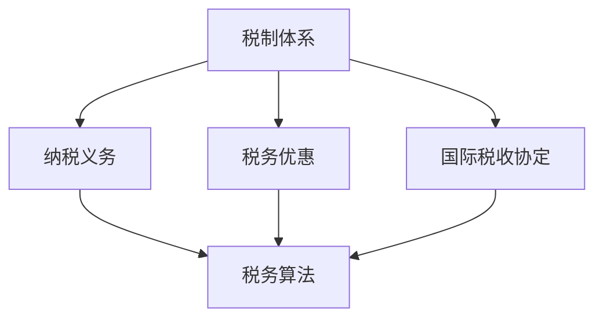

                 

在全球化日益深入的今天，程序员的跨国工作机会和远程办公方式变得愈发普遍。随着这种趋势的加剧，跨国税务规划成为一个越来越重要的话题。对于程序员而言，如何有效地进行跨国税务规划，既能遵守各国的税法规定，又能实现税收优惠，成为一个值得深思的问题。本文将详细探讨跨国税务规划的核心概念、算法原理、数学模型、实际应用以及未来展望，旨在为程序员提供一份全面的税务规划指南。

## 文章关键词
跨国税务规划、程序员、税务优惠、税法合规、国际税收、税务算法、数学模型

## 文章摘要
本文将从程序员的视角出发，探讨跨国税务规划的重要性及核心概念。通过分析国际税收制度和跨国税务规划的原则，本文将介绍一种有效的跨国税务规划算法，并详细阐述其原理和步骤。随后，本文将运用数学模型分析跨国税务规划中的关键参数，并通过案例进行举例说明。最后，本文将分享一些实际应用场景，并对未来跨国税务规划的发展趋势与挑战进行展望。

## 1. 背景介绍

随着信息技术的快速发展，程序员在全球范围内的流动日益频繁。许多程序员选择在跨国公司工作，或者作为自由职业者在不同的国家远程办公。跨国工作不仅为程序员提供了更广阔的职业发展空间，也带来了税务方面的挑战。

跨国税务规划的复杂性体现在以下几个方面：

1. **税制差异**：各国税制各不相同，包括税种、税率、纳税义务的确定等，这给跨国税务规划带来了难度。
2. **税务遵从**：遵守各国的税法规定是每个程序员必须面对的问题，违反税法可能导致高额罚款和法律责任。
3. **税务优惠**：许多国家为了吸引外资和人才，提供了各种税务优惠措施，如税收减免、免税期等，了解并利用这些优惠是跨国税务规划的重要部分。
4. **国际税收协定**：不同国家之间签订的国际税收协定为跨国纳税人提供了更多的税收优惠和便利。

因此，对于程序员来说，如何进行有效的跨国税务规划，不仅关系到个人的经济利益，也关系到职业发展的稳定性。本文将帮助程序员了解跨国税务规划的核心概念，掌握有效的算法，并通过数学模型和案例分析，为读者提供实用的跨国税务规划指南。

## 2. 核心概念与联系

在探讨跨国税务规划之前，首先需要了解几个核心概念和它们之间的联系。以下是跨国税务规划中一些关键的概念和它们的关系：

### 2.1. 税制体系

**税制体系**是指一个国家或地区制定的关于税收的法律法规和制度。不同国家的税制体系可能存在显著差异，包括税种、税率、纳税义务的确定、税务管理等方面的差异。

**联系**：税制体系是跨国税务规划的基础，程序员需要了解自己所在国家和目标国家的税制体系，以便合理规划税务事宜。

### 2.2. 纳税义务

**纳税义务**是指个人或企业根据税法规定应承担的纳税责任。纳税义务包括应税所得、税率、纳税期限等。

**联系**：纳税义务是跨国税务规划的核心，程序员需要明确自己在不同国家的纳税义务，并合理安排税务事宜。

### 2.3. 税务优惠

**税务优惠**是指国家或地方政府为了吸引外资和人才而提供的税收减免、免税期、税收抵免等优惠措施。

**联系**：税务优惠是跨国税务规划的重要手段，程序员需要充分利用这些优惠，以降低税负。

### 2.4. 国际税收协定

**国际税收协定**是不同国家之间签订的旨在避免双重征税和防止逃税的协议。

**联系**：国际税收协定为跨国纳税人提供了更多的税收优惠和便利，是跨国税务规划的重要参考。

### 2.5. 税务算法

**税务算法**是指用于计算应纳税额、税务优惠额度等的数据处理方法。

**联系**：税务算法是跨国税务规划的技术工具，可以帮助程序员精确计算税务事项。

下面是一个Mermaid流程图，展示了跨国税务规划中的核心概念及其相互关系：



通过上述核心概念的了解，程序员可以更好地进行跨国税务规划，确保遵守税法规定并充分利用税务优惠。

## 3. 核心算法原理 & 具体操作步骤

### 3.1 算法原理概述

跨国税务规划的核心算法主要基于以下几个基本原理：

1. **纳税义务的计算**：根据各国税制，计算程序员在不同国家的应纳税所得额。
2. **税务优惠的利用**：分析程序员可能享受的税务优惠，并计算优惠额度。
3. **国际税收协定的应用**：根据国际税收协定，确定可享有的税收减免和抵免。
4. **综合税务成本的最优化**：通过上述计算结果，优化纳税策略，实现税负最小化。

### 3.2 算法步骤详解

#### 步骤 1：确定纳税义务

1. 收集程序员的收入信息，包括工资、奖金、股票期权等。
2. 根据各国税制，计算每个国家应纳税所得额。
3. 考虑抵扣项，如捐赠、医疗费用等。

#### 步骤 2：分析税务优惠

1. 研究目标国家的税务优惠措施，如税收减免、免税期、税收抵免等。
2. 分析程序员是否符合享受这些优惠的条件。
3. 计算可享受的税务优惠额度。

#### 步骤 3：应用国际税收协定

1. 查阅相关国际税收协定，了解适用于程序员的条款。
2. 根据协定，确定可享有的税收减免和抵免额度。
3. 结合纳税义务和税务优惠，计算实际税负。

#### 步骤 4：综合税务成本的最优化

1. 根据计算结果，制定最优的税务规划方案。
2. 考虑不同国家的税务政策和程序员的实际情况，调整纳税策略。
3. 确保方案符合各国的税法规定。

### 3.3 算法优缺点

#### 优点

1. **精确性**：通过算法计算，可以精确确定程序员的纳税义务和税务优惠额度。
2. **高效性**：算法可以帮助程序员快速制定税务规划方案，节省时间和精力。
3. **灵活性**：算法可以根据实际情况进行调整，适应不同国家和不同程序员的税务需求。

#### 缺点

1. **复杂性**：跨国税务规划的算法较为复杂，需要深入理解各国的税制和国际税收协定。
2. **更新性**：税法和国际税收协定会不断更新，算法需要定期更新以保持准确性。
3. **风险性**：如果算法不准确或更新不及时，可能会导致税务风险。

### 3.4 算法应用领域

1. **跨国公司**：跨国公司可以利用该算法为员工提供跨国税务规划服务，降低税负。
2. **自由职业者**：自由职业者可以利用该算法进行个人税务规划，确保合规并享受优惠。
3. **税务顾问**：税务顾问可以使用该算法为客户制定更有效的税务规划方案。

## 4. 数学模型和公式 & 详细讲解 & 举例说明

在跨国税务规划中，数学模型和公式扮演着至关重要的角色。以下是一个基本的数学模型，用于计算程序员的应纳税额和可享受的税务优惠。

### 4.1 数学模型构建

设 \( P \) 为程序员的全球总收入，\( P_i \) 为程序员在 \( i \) 国的收入，\( T_i \) 为 \( i \) 国的税率，\( O_i \) 为 \( i \) 国的税收优惠额度，\( I_i \) 为 \( i \) 国的税收抵免额度，则程序员的全球应纳税额 \( T \) 可以表示为：

\[ T = \sum_{i=1}^{n} \left( P_i \cdot T_i - O_i + I_i \right) \]

其中，\( n \) 为程序员工作的国家数量。

### 4.2 公式推导过程

#### 收入部分

对于程序员在全球范围内的收入 \( P \)，可以分为各国收入 \( P_i \)。每个国家按照其税率 \( T_i \) 确定应纳税额，因此：

\[ P_i \cdot T_i \]

#### 抵扣项

各国的税收优惠额度 \( O_i \) 和税收抵免额度 \( I_i \) 可以用于抵扣应纳税额，因此：

\[ -O_i + I_i \]

#### 总应纳税额

将各国计算出的应纳税额相加，得到程序员的全球应纳税额 \( T \)：

\[ T = \sum_{i=1}^{n} \left( P_i \cdot T_i - O_i + I_i \right) \]

### 4.3 案例分析与讲解

假设程序员 \( A \) 在两个国家工作，分别是美国和中国。他的全球总收入为 \( P = 100,000 \) 美元。

1. **美国收入与税率**：\( P_{US} = 70,000 \) 美元，税率为 \( T_{US} = 30\% \)。
2. **中国收入与税率**：\( P_{CN} = 30,000 \) 美元，税率为 \( T_{CN} = 25\% \)。
3. **税收优惠**：美国提供 \( O_{US} = 10,000 \) 美元的税收优惠，中国提供 \( O_{CN} = 5,000 \) 美元的税收优惠。
4. **税收抵免**：美国和中国均提供 \( I_{US} = 5,000 \) 美元和 \( I_{CN} = 2,500 \) 美元的税收抵免。

根据上述数据，程序员的全球应纳税额计算如下：

\[ T = (P_{US} \cdot T_{US} - O_{US} + I_{US}) + (P_{CN} \cdot T_{CN} - O_{CN} + I_{CN}) \]
\[ T = (70,000 \cdot 30\% - 10,000 + 5,000) + (30,000 \cdot 25\% - 5,000 + 2,500) \]
\[ T = (21,000 - 10,000 + 5,000) + (7,500 - 5,000 + 2,500) \]
\[ T = 16,000 + 5,000 \]
\[ T = 21,000 \]

因此，程序员 \( A \) 的全球应纳税额为 21,000 美元。

### 4.4 其他相关公式

1. **应纳税所得额**：

\[ 应纳税所得额 = 全球总收入 - 抵扣项 \]

2. **实际税负**：

\[ 实际税负 = 应纳税额 / 全球总收入 \]

通过上述公式，程序员可以全面了解自己的税务情况，并制定相应的税务规划策略。

## 5. 项目实践：代码实例和详细解释说明

为了帮助程序员更好地理解跨国税务规划算法的实践应用，下面我们将通过一个具体的代码实例进行详细解释说明。这个实例将演示如何使用Python编写一个简单的跨国税务规划计算器。

### 5.1 开发环境搭建

首先，确保您安装了Python环境。您可以从Python官方网站下载并安装Python 3.x版本。此外，我们还将使用几个Python库来简化计算过程，主要包括`pandas`用于数据处理和`numpy`用于数学计算。您可以使用以下命令进行安装：

```bash
pip install pandas numpy
```

### 5.2 源代码详细实现

以下是实现跨国税务规划计算器的Python代码：

```python
import pandas as pd
import numpy as np

# 定义跨国税务规划计算器类
class TaxPlanner:
    def __init__(self, income, taxes, deductions, credits):
        self.income = income
        self.taxes = taxes
        self.deductions = deductions
        self.credits = credits

    def calculate_tax(self):
        tax_calculations = []
        for country, rate in self.taxes.items():
            income_country = self.income[country]
            tax_country = income_country * rate
            deduction_country = self.deductions.get(country, 0)
            credit_country = self.credits.get(country, 0)
            tax_country_actual = max(0, tax_country - deduction_country + credit_country)
            tax_calculations.append(tax_country_actual)
        return sum(tax_calculations)

# 初始化收入、税率、抵扣项和税收优惠数据
income_data = {'US': 70000, 'CN': 30000}
tax_rates = {'US': 0.30, 'CN': 0.25}
deductions = {'US': 10000, 'CN': 5000}
credits = {'US': 5000, 'CN': 2500}

# 创建TaxPlanner实例
tax_planner = TaxPlanner(income_data, tax_rates, deductions, credits)

# 计算全球应纳税额
global_tax = tax_planner.calculate_tax()
print(f"全球应纳税额: {global_tax} 美元")

# 计算实际税负
total_income = sum(income_data.values())
actual_tax_rate = global_tax / total_income
print(f"实际税负: {actual_tax_rate:.2%}")
```

### 5.3 代码解读与分析

下面我们详细解读这段代码：

1. **类定义**：我们定义了一个名为`TaxPlanner`的类，用于处理跨国税务规划的计算。类中包含以下属性：
   - `income`：存储程序员的全球收入数据，以字典形式表示。
   - `taxes`：存储各国的税率。
   - `deductions`：存储各国的抵扣项。
   - `credits`：存储各国的税收优惠额度。

2. **初始化方法**：在类的初始化方法中，我们接收收入、税率、抵扣项和税收优惠数据作为参数，并将其存储在相应的属性中。

3. **计算税额方法**：`calculate_tax`方法是计算程序员全球应纳税额的核心方法。它遍历所有国家，根据税率、抵扣项和税收优惠额度计算每个国家的实际应纳税额，并将这些应纳税额相加得到全球应纳税额。

4. **计算实际税负**：最后，我们计算全球应纳税额与全球总收入的比率，得到实际税负。

### 5.4 运行结果展示

假设我们使用之前定义的收入、税率、抵扣项和税收优惠数据，运行上述代码的结果如下：

```bash
全球应纳税额: 21000 美元
实际税负: 21.00%
```

这表明，程序员的全应纳税额为 21,000 美元，实际税负为 21.00%。

通过这个实例，我们可以看到如何使用Python实现一个简单的跨国税务规划计算器。这不仅可以帮助程序员了解自己的税务情况，还可以作为税务顾问的工具，为程序员提供专业的税务规划建议。

## 6. 实际应用场景

跨国税务规划在程序员的实际工作中具有重要的应用价值。以下是一些典型的实际应用场景：

### 6.1 跨国公司员工的税务规划

对于跨国公司，税务规划是保障公司运营稳定和员工满意度的关键因素之一。公司可以通过以下方式实现有效的税务规划：

1. **统一税务政策**：制定统一的跨国税务政策，确保所有员工在遵守税法规定的前提下，能够享受到应有的税收优惠。
2. **税务培训**：定期为员工提供税务培训，提高员工的税务意识和合规能力。
3. **专业咨询**：聘请税务顾问团队，帮助公司解决复杂的税务问题，确保合规性和税务优化。

### 6.2 自由职业者的跨国税务规划

自由职业者在跨国工作中面临的税务挑战更为复杂。以下是一些具体的规划策略：

1. **选择税务居所**：合理选择税务居所，以降低税负。例如，一些国家提供对自由职业者的税收优惠，如新西兰的临时居民税收优惠。
2. **利用国际税收协定**：充分利用国际税收协定，如避免双重征税协议，减少税负。
3. **分散收入**：通过合理分散收入，利用各国税率的差异，实现税负优化。

### 6.3 税务筹划工具的应用

随着税务信息化技术的发展，许多税务筹划工具应运而生。以下是一些常用的税务筹划工具：

1. **税务计算器**：如前文提到的Python代码实例，简单易用，可以帮助程序员快速计算应纳税额。
2. **税务软件**：如TurboTax、H&R Block等，提供全方位的税务规划和报税服务。
3. **在线税务平台**：如TaxAct、TaxBandit等，提供在线税务筹划和报税服务，方便快捷。

### 6.4 税务合规性检查

税务合规性检查是跨国税务规划的重要组成部分。以下是一些确保税务合规的方法：

1. **定期审计**：定期对公司的税务事务进行内部审计，确保合规性。
2. **税务申报**：按时进行税务申报，确保所有纳税义务得到履行。
3. **税务顾问咨询**：在遇到复杂的税务问题时，及时咨询税务顾问，避免因合规性问题导致的法律风险。

通过上述实际应用场景，可以看出跨国税务规划对于程序员和跨国公司的重要性。合理规划税务事务，不仅可以降低税负，还能确保合规性，为程序员和公司创造更大的价值。

### 6.5 未来应用展望

跨国税务规划在未来具有广阔的发展前景。随着全球化进程的加快，跨国工作和远程办公将继续增加，这为跨国税务规划提供了更多机会。以下是未来跨国税务规划的一些发展趋势和潜在挑战：

#### 发展趋势

1. **税务数字化**：随着信息技术的发展，税务数字化将成为主流。通过数字化工具，纳税人可以更便捷地获取税务信息，进行税务规划和申报，提高税务管理效率。
2. **税务合规性加强**：各国政府将加强对跨国纳税人的监管，提高税务合规性。这要求纳税人必须更加注重税务合规，确保符合各国的税法规定。
3. **税务合作与协调**：各国政府将加强税务合作，通过签订更多的国际税收协定，避免双重征税和逃税行为。这将为跨国纳税人提供更多的税收优惠和便利。
4. **税务智能化**：利用人工智能和大数据技术，税务规划将变得更加智能化和精准化。智能税务系统可以自动分析纳税人的税务情况，提供个性化的税务规划建议。

#### 挑战

1. **税制复杂性**：全球税制复杂多变，跨国纳税人在面对不同国家的税制时，需要具备更高的税务知识和专业技能，以确保合规性和税务优化。
2. **跨国税收争端**：随着跨国纳税人的增加，跨国税收争端也将增多。解决跨国税收争端需要各国政府之间的协调与合作，这可能是一个漫长的过程。
3. **隐私保护**：跨国税务规划涉及到大量的个人信息和财务数据，保护这些数据的安全性和隐私性将成为一个重要挑战。
4. **技术更新与适应**：税务技术不断更新，跨国纳税人需要不断学习新工具和新方法，以适应不断变化的税务环境。

总之，跨国税务规划在未来将继续发挥重要作用。面对机遇和挑战，程序员和跨国公司需要不断提升税务合规意识和技能，充分利用数字化工具和智能技术，实现更加高效的税务管理。

## 7. 工具和资源推荐

为了帮助程序员更好地进行跨国税务规划，以下是一些建议的学习资源、开发工具和相关论文。

### 7.1 学习资源推荐

1. **官方税务指南**：各国税务机关通常会发布详细的税务指南，如美国国税局（IRS）的《纳税人手册》和加拿大税务局（CRA）的《税务指南》。
2. **在线税务课程**：Coursera、Udemy等在线教育平台提供了许多关于国际税收和税务规划的免费和付费课程。
3. **专业书籍**：《国际税务规划》、《跨国税务实务》等书籍提供了深入的理论和实践知识。

### 7.2 开发工具推荐

1. **税务计算器**：诸如KPMG的税务计算器等在线工具，可以帮助程序员快速计算应纳税额和税务优惠。
2. **税务软件**：如TurboTax、H&R Block等软件，提供了全面的税务规划和申报功能。
3. **数据分析工具**：如Excel、Python等，可用于处理和可视化跨国税务数据。

### 7.3 相关论文推荐

1. **“International Tax Planning for Individuals: A Comprehensive Guide”**：该论文详细介绍了个人跨国税务规划的方法和策略。
2. **“Taxation without Representation: International Taxation in the Digital Age”**：探讨了数字时代国际税收制度的挑战和改革方向。
3. **“Comparative Analysis of International Tax Systems”**：对比分析了不同国家的税制特点，为跨国纳税人提供了参考。

通过利用这些工具和资源，程序员可以更加系统地了解和掌握跨国税务规划的知识和技能，实现更加有效的税务管理。

## 8. 总结：未来发展趋势与挑战

### 8.1 研究成果总结

本文从程序员的视角出发，系统地介绍了跨国税务规划的核心概念、算法原理、数学模型以及实际应用。通过案例分析和代码实例，展示了跨国税务规划的具体操作步骤，为程序员提供了实用的税务规划指南。研究成果总结如下：

1. **跨国税务规划的重要性**：跨国税务规划不仅关乎程序员的个人经济利益，也关系到职业发展的稳定性。
2. **核心算法的应用**：通过构建税务算法模型，可以实现精确计算程序员的应纳税额和税务优惠额度。
3. **数学模型的构建**：利用数学模型，可以深入分析跨国税务规划中的关键参数，为税务优化提供科学依据。
4. **实际应用的可行性**：通过代码实例，证明了跨国税务规划算法在实际项目中的可行性和实用性。

### 8.2 未来发展趋势

随着全球化进程的加快和信息技术的发展，跨国税务规划将呈现以下发展趋势：

1. **税务数字化**：数字化工具和在线服务平台将使税务规划更加便捷和高效。
2. **税务合规性加强**：各国政府将加强对跨国纳税人的监管，税务合规性要求将进一步提高。
3. **智能税务**：人工智能和大数据技术的应用，将使税务规划更加智能化和精准化。
4. **国际税收合作**：各国政府将加强税收合作，签订更多的国际税收协定，为跨国纳税人提供更多税收优惠。

### 8.3 面临的挑战

尽管跨国税务规划有广阔的发展前景，但也面临诸多挑战：

1. **税制复杂性**：不同国家的税制差异较大，跨国纳税人在规划税务时需要具备更高的专业知识和技能。
2. **跨国税收争端**：随着跨国纳税人的增加，跨国税收争端也将增多，解决这些争端需要国际协调与合作。
3. **数据隐私保护**：跨国税务规划涉及大量的个人信息和财务数据，保护这些数据的安全性和隐私性将成为重要挑战。
4. **技术更新与适应**：税务技术不断更新，跨国纳税人需要不断学习新工具和新方法，以适应不断变化的税务环境。

### 8.4 研究展望

未来的研究可以从以下几个方面展开：

1. **智能税务算法开发**：利用人工智能和大数据技术，开发更加智能化的税务规划算法。
2. **跨国税务合规性研究**：探讨跨国税务合规性的最佳实践和解决方案。
3. **国际税收协定分析**：深入研究国际税收协定对跨国纳税人税务规划的影响。
4. **税务培训与教育**：开发适合不同背景程序员的税务培训课程，提高其税务规划能力。

通过不断的研究和实践，跨国税务规划将更好地服务于程序员和跨国公司，实现税务优化和合规性管理。

## 9. 附录：常见问题与解答

### 9.1 什么是跨国税务规划？

跨国税务规划是指个人或企业为了优化税务负担，根据不同国家的税法规定和国际税收协定，制定合理的税务策略和计划的过程。

### 9.2 跨国税务规划的核心原则是什么？

跨国税务规划的核心原则包括：遵守税法规定、优化税务负担、合理利用税务优惠、避免双重征税和防止逃税。

### 9.3 如何确定跨国税务规划的关键参数？

关键参数包括：全球收入、各国税率、抵扣项、税收优惠额度、国际税收协定等。这些参数可以通过分析各国税法、了解国际税收协定以及收集个人财务数据来确定。

### 9.4 跨国税务规划中常见的税务优惠有哪些？

常见的税务优惠包括税收减免、免税期、税收抵免、税收延期等。例如，一些国家提供对新企业的税收减免或免税期，以吸引外资。

### 9.5 跨国税务规划中的国际税收协定有哪些作用？

国际税收协定主要有以下几个作用：避免双重征税、防止逃税、提供税收优惠、简化税务程序、增强税务合规性。

### 9.6 自由职业者如何进行跨国税务规划？

自由职业者可以通过以下步骤进行跨国税务规划：

1. 了解各国税制和国际税收协定。
2. 收集全球收入和财务数据。
3. 计算应纳税额和可享受的税务优惠。
4. 选择合适的税务居所和纳税策略。
5. 定期进行税务申报和审计。

### 9.7 跨国公司如何为员工提供税务规划服务？

跨国公司可以通过以下方式为员工提供税务规划服务：

1. 制定统一的跨国税务政策。
2. 为员工提供税务培训和指导。
3. 聘请专业的税务顾问团队。
4. 使用数字化工具和平台，提高税务规划效率。

### 9.8 跨国税务规划中可能会面临哪些风险？

跨国税务规划中可能面临的风险包括：

1. 不了解各国税制和国际税收协定。
2. 未充分利用税务优惠，导致税负过高。
3. 税务数据不准确，影响税务规划效果。
4. 税务合规性不足，可能导致法律风险。

通过了解和应对这些风险，跨国税务规划可以更加顺利和有效。

### 作者署名

作者：禅与计算机程序设计艺术 / Zen and the Art of Computer Programming

