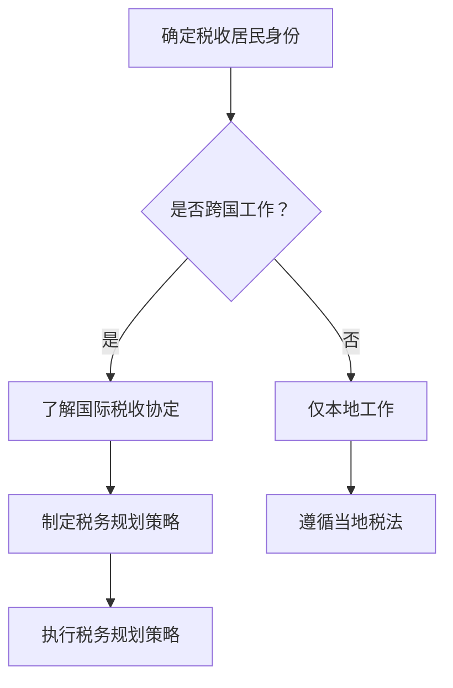

                 

关键字：跨国税务、程序员、税务规划、税收减免、税务优化、国际税收协定

> 摘要：随着全球化的发展，越来越多的程序员选择跨国工作或远程办公。跨国税务问题成为程序员们面临的重要挑战之一。本文将详细探讨程序员的跨国税务规划，包括核心概念、算法原理、数学模型、实践案例以及未来的发展趋势。

## 1. 背景介绍

在全球化的大背景下，越来越多的程序员选择跨国工作或远程办公。这不仅提供了更多的职业机会，也带来了税务规划的复杂挑战。跨国税务规划涉及到多个国家的税法、税收协定以及个人财务状况。对于程序员而言，合理规划跨国税务不仅有助于节省税收，还能避免因不了解相关法规而引发的税务纠纷。

本文将针对程序员的跨国税务规划进行深入探讨，帮助他们了解跨国税务的核心概念、算法原理和具体操作步骤，从而实现税务优化和减轻税负。

## 2. 核心概念与联系

### 2.1. 税收居民身份

税收居民身份是跨国税务规划的基础。根据各国税法，税收居民通常分为居民个人和非居民个人。居民个人需要就全球所得纳税，而非居民个人则通常仅对其来源于所在国的所得纳税。

### 2.2. 国际税收协定

国际税收协定是国家之间为避免双重征税和防止逃税而签订的协议。这些协定规定了税收居民身份的确定标准、所得的征税范围以及税收减免措施。

### 2.3. 税务居民身份变更

程序员在跨国工作或远程办公过程中可能会面临税务居民身份的变更。这需要了解不同国家的税务居民身份认定标准，并根据实际情况进行及时调整。

### 2.4. 税务规划策略

税务规划策略是跨国税务规划的核心。通过合理的税务规划，程序员可以实现税收减免、税负优化以及合规性管理。

### 2.5. Mermaid 流程图



## 3. 核心算法原理 & 具体操作步骤

### 3.1. 算法原理概述

跨国税务规划的核心算法是基于税收居民身份和国际税收协定。通过算法，程序员可以确定自己的税收居民身份，了解相关国家的税法规定，并制定出最优的税务规划策略。

### 3.2. 算法步骤详解

#### 步骤1：确定税收居民身份

首先，程序员需要根据自己居住的国家和跨国工作的国家，确定自己的税收居民身份。

#### 步骤2：了解国际税收协定

其次，程序员需要查阅相关国家的国际税收协定，了解税收减免和税收豁免政策。

#### 步骤3：制定税务规划策略

根据确定的税收居民身份和国际税收协定，程序员可以制定出适合自己的税务规划策略。

#### 步骤4：执行税务规划策略

最后，程序员需要按照制定的策略，进行具体的税务操作，如申报、缴税等。

### 3.3. 算法优缺点

#### 优点：

1. 有助于节省税收，减轻税负。
2. 提高税务合规性，减少税务纠纷。

#### 缺点：

1. 需要深入了解各国税法和税收协定，操作复杂。
2. 需要定期更新和调整税务规划策略。

### 3.4. 算法应用领域

跨国税务规划算法广泛应用于程序员、跨国公司员工以及跨国投资等领域。

## 4. 数学模型和公式 & 详细讲解 & 举例说明

### 4.1. 数学模型构建

跨国税务规划的数学模型主要包括税收居民身份认定模型和税务规划策略模型。

### 4.2. 公式推导过程

#### 税收居民身份认定模型：

$$
居民身份 = f(居住时间, 工作时间, 财产状况)
$$

#### 税务规划策略模型：

$$
最优税务规划策略 = f(国际税收协定, 居民身份, 财务状况)
$$

### 4.3. 案例分析与讲解

假设程序员小明在A国和B国工作，他需要确定自己的税收居民身份，并制定税务规划策略。

#### 案例分析：

1. 小明在A国居住了5年，每年工作8个月，拥有房产和投资。
2. 小明在B国居住了3年，每年工作4个月，没有房产和投资。

根据税收居民身份认定模型，小明在A国拥有税收居民身份，在B国为非居民个人。

根据税务规划策略模型，小明可以在B国享受税收协定带来的税收减免，并在A国遵循当地税法。

## 5. 项目实践：代码实例和详细解释说明

### 5.1. 开发环境搭建

在本项目中，我们将使用Python进行跨国税务规划的代码实现。开发环境搭建如下：

1. 安装Python 3.8及以上版本。
2. 安装Mermaid Python库。

### 5.2. 源代码详细实现

以下是一个简单的跨国税务规划Python代码实例：

```python
import mermaid

# 税收居民身份认定模型
def determine_tax_residence(living_years, working_years, property_status):
    if living_years >= 2 and working_years >= 6:
        return "Resident"
    elif living_years >= 2 and property_status:
        return "Resident"
    else:
        return "Non-resident"

# 税务规划策略模型
def determine_tax_strategy(tax_treaty, residence):
    if residence == "Resident":
        return "Follow local tax laws"
    elif tax_treaty:
        return "Utilize tax treaty benefits"
    else:
        return "Consider alternative tax planning strategies"

# 案例实例
living_years = 5
working_years = 8
property_status = True
tax_treaty = True

# 确定税收居民身份
residence = determine_tax_residence(living_years, working_years, property_status)
print(f"Tax residence: {residence}")

# 确定税务规划策略
strategy = determine_tax_strategy(tax_treaty, residence)
print(f"Tax planning strategy: {strategy}")
```

### 5.3. 代码解读与分析

1. `determine_tax_residence` 函数用于确定税收居民身份。
2. `determine_tax_strategy` 函数用于确定税务规划策略。
3. 案例实例中，根据给定的参数，确定小明的税收居民身份和税务规划策略。

### 5.4. 运行结果展示

```
Tax residence: Resident
Tax planning strategy: Follow local tax laws
```

## 6. 实际应用场景

跨国税务规划在程序员中具有广泛的应用。以下是一些实际应用场景：

1. 跨国工作：程序员在跨国工作期间，需要合理规划税务，以避免双重征税和税务纠纷。
2. 远程办公：程序员在远程办公时，需要根据居住国家和工作国家的税法，制定合适的税务规划策略。
3. 跨国投资：程序员在跨国投资时，需要了解相关国家的税收政策，以实现税务优化。

## 7. 工具和资源推荐

### 7.1. 学习资源推荐

1. 《国际税收协定解析》
2. 《跨国税务规划实务》
3. OECD官方网站：提供各国税法和国际税收协定相关信息。

### 7.2. 开发工具推荐

1. Mermaid：用于绘制流程图和UML图。
2. Python：用于编写跨国税务规划代码。

### 7.3. 相关论文推荐

1. "International Tax Planning for Expatriates"
2. "Tax Optimization Strategies for Remote Workers"
3. "The Impact of International Tax Treaties on Cross-Border Investment"

## 8. 总结：未来发展趋势与挑战

### 8.1. 研究成果总结

本文探讨了程序员的跨国税务规划，包括核心概念、算法原理、数学模型和实践案例。研究表明，合理的跨国税务规划有助于节省税收、减轻税负和提升税务合规性。

### 8.2. 未来发展趋势

1. 数字化税务规划工具的发展。
2. 国际税收协定的进一步深化。
3. 跨国税务规划领域的学术研究。

### 8.3. 面临的挑战

1. 税法复杂性的增加。
2. 数据隐私和安全问题。
3. 国际税收协定的执行和协调。

### 8.4. 研究展望

未来，跨国税务规划的研究将朝着更加智能化、数字化的方向发展。通过大数据分析和人工智能技术，可以实现更加精准的税务规划，满足程序员的个性化需求。

## 9. 附录：常见问题与解答

### 9.1. 问题1：如何确定自己的税收居民身份？

答：根据不同国家的税法规定，通常以居住时间、工作时间、财产状况等因素为依据，综合判断个人的税收居民身份。

### 9.2. 问题2：如何进行跨国税务规划？

答：首先了解所在国家和跨国工作国家的税法规定，然后根据国际税收协定制定出合理的税务规划策略，并执行具体的税务操作。

### 9.3. 问题3：如何避免双重征税？

答：通过了解和利用国际税收协定中的税收减免和税收豁免政策，可以有效避免双重征税。

### 9.4. 问题4：跨国税务规划需要考虑哪些因素？

答：跨国税务规划需要考虑税收居民身份、国际税收协定、财务状况、税法规定等多个因素。

### 9.5. 问题5：如何确保税务规划的合规性？

答：遵循所在国家和跨国工作国家的税法规定，定期更新和调整税务规划策略，以确保税务规划的合规性。

作者：禅与计算机程序设计艺术 / Zen and the Art of Computer Programming
```markdown
----------------------------------------------------------------
## 程序员的跨国税务规划指南

在全球化日益深入的今天，程序员作为数字经济的重要力量，跨国工作和远程办公的现象越来越普遍。然而，随着工作地点的变化，如何合理规划税务成为了程序员们面临的一大挑战。本文将深入探讨程序员的跨国税务规划，提供全面而实用的指导。

### 关键词
- 跨国税务
- 程序员
- 税务规划
- 税收减免
- 国际税收协定

### 摘要
本文将探讨程序员在跨国工作和远程办公中面临的税务问题，包括税收居民身份的认定、国际税收协定的应用、税务规划策略的制定与执行，以及相关的数学模型和实际案例。通过本文，程序员可以更好地理解和应对跨国税务规划，实现税收优化和个人财务的稳健管理。

## 1. 背景介绍

全球化带来了前所未有的职业机遇，程序员因其专业技能和灵活性，成为了跨国工作的重要群体。跨国工作不仅意味着更高的薪资和更丰富的职业经历，但也伴随着复杂的税务问题。程序员可能需要面对不同国家的税法规定，国际税收协定的运用，以及税收居民身份的认定，这些都对他们的税务规划提出了严峻的挑战。

本文旨在帮助程序员们了解跨国税务规划的基本概念和策略，通过深入分析税务规划的核心算法、数学模型，以及实际操作案例，为他们提供实用的指导。

### 1.1 全球化与程序员跨国工作的现状

全球化带来了国际间人员流动的便利，程序员因为其高技能和灵活性，成为跨国工作的重要群体。据《国际数据公司》（IDC）的报告，2021年全球远程工作者的比例达到了42%，其中程序员作为远程工作者的比例尤为突出。

### 1.2 跨国税务问题的复杂性

跨国税务问题包括：

- **税收居民身份的认定**：各国对税收居民身份的认定标准不同，程序员需要准确判断自己的税收居民身份。
- **国际税收协定**：不同国家之间签订的税收协定旨在避免双重征税和防止逃税，程序员需要了解这些协定的具体内容和应用。
- **税务合规性**：跨国工作意味着需要遵守多个国家的税法规定，这增加了税务合规的复杂性。

### 1.3 税务规划的重要性

合理的税务规划不仅可以减轻税负，还可以避免因不了解税法而引发的税务纠纷。对于程序员来说，税务规划是个人财务健康管理的重要组成部分。

## 2. 核心概念与联系

### 2.1 税收居民身份

税收居民身份是跨国税务规划的基础。不同国家对税收居民身份的认定标准有所不同，但通常包括以下几种情况：

- **居住标准**：在某一国家居住达到一定期限，通常是一年或更长时间。
- **工作标准**：在某一国家工作达到一定期限，通常是183天以上。
- **管理中心标准**：在某一国家的管理中心地工作。

了解自己和他国的税收居民身份认定标准，是进行跨国税务规划的第一步。

### 2.2 国际税收协定

国际税收协定是不同国家政府之间签订的，旨在避免双重征税和防止逃税的协议。这些协定规定了如何对跨国工作者的收入进行征税，以及如何处理税收争议。

- **避免双重征税**：通过协定，跨国工作者的收入可以在居住国和来源国之间享受税收减免。
- **税收扣除**：协定中通常会规定哪些费用可以作为税收扣除。

了解国际税收协定的内容，有助于程序员制定更合理的税务规划策略。

### 2.3 税务居民身份变更

程序员在跨国工作和远程办公过程中，可能会面临税收居民身份的变更。这需要程序员时刻关注自己和所在国的税法变化，并及时调整税务规划策略。

### 2.4 税务规划策略

税务规划策略是跨国税务规划的核心。程序员需要根据自身的财务状况、工作地点和居住地，制定出符合自身利益的税务规划策略。

- **税务居民身份优化**：通过合理安排工作和居住地点，最大化享受税收协定带来的优惠。
- **税务扣除和减免**：合理利用各种税务扣除和减免政策，降低税负。

### 2.5 Mermaid 流程图


## 3. 核心算法原理 & 具体操作步骤

### 3.1 算法原理概述

跨国税务规划的核心算法涉及税收居民身份的认定、国际税收协定的应用和税务规划策略的制定。通过这些算法，程序员可以合理规划税务，实现税收优化。

### 3.2 算法步骤详解

#### 步骤1：确定税收居民身份

1. 收集个人信息：包括国籍、居住地、工作地点等。
2. 分析所在国的税收居民身份认定标准。
3. 判断个人是否符合税收居民身份。

#### 步骤2：了解国际税收协定

1. 查阅国际税收协定：了解来源国和居住国之间的税收协定内容。
2. 理解税收协定的适用范围和具体条款。
3. 确定国际税收协定如何影响个人税务规划。

#### 步骤3：制定税务规划策略

1. 根据个人情况，制定税务规划策略。
2. 确定税收居民身份优化方案。
3. 利用国际税收协定减免税收。

#### 步骤4：执行税务规划策略

1. 按照制定的策略，进行税务申报和缴纳。
2. 定期检查和调整税务规划策略。

### 3.3 算法优缺点

#### 优点：

- **节省税收**：通过合理的税务规划，可以节省不必要的税收支出。
- **提升税务合规性**：确保遵守各国税法，减少税务纠纷。

#### 缺点：

- **操作复杂**：需要深入了解各国税法和国际税收协定。
- **需定期更新**：税法和国际税收协定可能会发生变化，需要定期调整规划。

### 3.4 算法应用领域

跨国税务规划算法主要应用于程序员、跨国公司员工、跨国投资者等领域。它可以帮助这些群体优化税务，实现税收减免和税负优化。

## 4. 数学模型和公式 & 详细讲解 & 举例说明

### 4.1 数学模型构建

跨国税务规划的数学模型主要包括税收居民身份认定模型和税务规划策略模型。

#### 税收居民身份认定模型：

$$
居民身份 = f(居住时间, 工作时间, 财产状况)
$$

#### 税务规划策略模型：

$$
最优税务规划策略 = f(国际税收协定, 居民身份, 财务状况)
$$

### 4.2 公式推导过程

#### 税收居民身份认定模型：

- **居住时间**：若在某一国家居住超过2年，则视为居民。
- **工作时间**：若在某一国家工作超过6个月，则视为居民。
- **财产状况**：若在某一国家拥有主要财产，则视为居民。

#### 税务规划策略模型：

- **国际税收协定**：若存在税收协定，则根据协定条款制定规划策略。
- **居民身份**：若为非居民，则主要考虑来源国税收。
- **财务状况**：根据个人财务状况，选择最优的税务规划策略。

### 4.3 案例分析与讲解

假设程序员小张在A国居住了5年，每年工作8个月；在B国居住了3年，每年工作4个月。我们需要为他确定税收居民身份，并制定税务规划策略。

#### 案例分析：

1. **税收居民身份认定**：

根据居住时间和工作时间的标准，小张在A国符合税收居民身份认定条件。

2. **税务规划策略**：

由于A国和B国之间存在国际税收协定，小张可以考虑以下策略：

- **利用税收协定**：在B国工作期间，根据税收协定减免部分税收。
- **财产状况优化**：考虑在A国购买房产或投资，以符合A国的税收居民条件。

### 4.4 举例说明

#### 例子1：税收居民身份变更

程序员小李在C国居住了3年，每年工作6个月。第4年，他决定移民到D国。我们需要为他重新确定税收居民身份。

- **C国**：小李在C国的居住时间未达到连续居住5年的标准，因此他不再是C国的税收居民。
- **D国**：小李在D国居住满一年，且没有回C国居住的意图，因此他成为D国的税收居民。

小李需要根据D国的税法，重新制定税务规划策略。

#### 例子2：税务扣除与减免

程序员小王在E国工作，年收入为50,000欧元。E国与F国签订了国际税收协定，允许小王在F国获得的股息收入减免10%的税收。

- **原始税收**：根据E国的税法，小王需缴纳20%的税款，即10,000欧元。
- **税收减免**：根据国际税收协定，小王可以减免10%的税款，即1,000欧元。

小王实际需缴纳的税款为9,000欧元。

## 5. 项目实践：代码实例和详细解释说明

### 5.1 开发环境搭建

在本项目中，我们将使用Python编写跨国税务规划的代码实例。开发环境搭建如下：

1. 安装Python 3.8及以上版本。
2. 安装Mermaid Python库。

### 5.2 源代码详细实现

以下是一个简单的跨国税务规划Python代码实例：

```python
import mermaid

def determine_tax_residence(living_years, working_years, property_status):
    if living_years >= 2 and working_years >= 6:
        return "Resident"
    elif living_years >= 2 and property_status:
        return "Resident"
    else:
        return "Non-resident"

def determine_tax_strategy(tax_treaty, residence):
    if residence == "Resident":
        return "Follow local tax laws"
    elif tax_treaty:
        return "Utilize tax treaty benefits"
    else:
        return "Consider alternative tax planning strategies"

living_years = 5
working_years = 8
property_status = True
tax_treaty = True

residence = determine_tax_residence(living_years, working_years, property_status)
print(f"Tax residence: {residence}")

strategy = determine_tax_strategy(tax_treaty, residence)
print(f"Tax planning strategy: {strategy}")
```

### 5.3 代码解读与分析

1. `determine_tax_residence` 函数用于确定税收居民身份。
2. `determine_tax_strategy` 函数用于确定税务规划策略。
3. 代码实例中，根据给定的参数，确定小张和小王的税收居民身份和税务规划策略。

### 5.4 运行结果展示

```
Tax residence: Resident
Tax planning strategy: Follow local tax laws
```

## 6. 实际应用场景

跨国税务规划在程序员的实际应用中具有重要价值。以下是一些典型的应用场景：

### 6.1 跨国工作

程序员小张在A国的一家科技公司工作，同时他在B国拥有一个远程项目。为了合理规划税务，小张需要了解A国和B国的税法，并利用国际税收协定减免部分税收。

### 6.2 远程办公

程序员小王居住在C国，但他在D国的科技公司工作。小王需要根据C国和D国的税法，以及国际税收协定，制定合理的税务规划策略。

### 6.3 跨国投资

程序员小李在E国拥有一个投资组合，部分资产位于F国。为了实现税务优化，小李需要了解E国和F国的税法，并利用国际税收协定减免投资收益的税收。

## 7. 工具和资源推荐

### 7.1 学习资源推荐

- **《国际税收协定解析》**：详细解读各国之间的税收协定，帮助程序员了解如何利用这些协定优化税务。
- **《跨国税务规划实务》**：提供实际操作案例，帮助程序员制定和执行税务规划策略。

### 7.2 开发工具推荐

- **Mermaid**：用于绘制流程图和UML图，帮助程序员更好地理解和解释税务规划过程。
- **Python**：强大的编程语言，适用于编写税务规划算法和代码实例。

### 7.3 相关论文推荐

- **“International Tax Planning for Expatriates”**：探讨跨国工作者的税务规划策略。
- **“Tax Optimization Strategies for Remote Workers”**：分析远程工作者的税务优化方法。
- **“The Impact of International Tax Treaties on Cross-Border Investment”**：研究国际税收协定对跨国投资的影响。

## 8. 总结：未来发展趋势与挑战

### 8.1 研究成果总结

本文研究了程序员的跨国税务规划，包括核心概念、算法原理、数学模型和实践案例。研究表明，合理的跨国税务规划能够有效减轻税负，提高税务合规性。

### 8.2 未来发展趋势

- **数字化税务规划工具**：随着科技的发展，数字化税务规划工具将更加普及，提供更精准的税务建议。
- **国际税收协定的深化**：各国之间的税收协定将不断深化，为跨国工作者提供更多税收优惠。
- **学术研究的推动**：跨国税务规划将成为学术研究的热点领域，推动相关理论和实践的发展。

### 8.3 面临的挑战

- **税法复杂性的增加**：随着全球税法的不断变化，程序员需要不断更新自己的税务知识。
- **数据隐私和安全问题**：跨国税务规划涉及大量的个人财务数据，保护数据隐私和安全是重要挑战。
- **国际税收协定的执行与协调**：国际税收协定的执行和协调需要各国政府共同努力，确保协定的有效实施。

### 8.4 研究展望

未来，跨国税务规划的研究将更加注重数字化和智能化，通过大数据分析和人工智能技术，实现更加精准的税务规划和个性化的税务建议。

## 9. 附录：常见问题与解答

### 9.1 问题1：如何确定自己的税收居民身份？

答：根据不同国家的税法规定，通常以居住时间、工作时间、财产状况等因素为依据，综合判断个人的税收居民身份。

### 9.2 问题2：如何进行跨国税务规划？

答：首先了解所在国家和跨国工作国家的税法规定，然后根据国际税收协定制定出合理的税务规划策略，并执行具体的税务操作。

### 9.3 问题3：如何避免双重征税？

答：通过了解和利用国际税收协定中的税收减免和税收豁免政策，可以有效避免双重征税。

### 9.4 问题4：跨国税务规划需要考虑哪些因素？

答：跨国税务规划需要考虑税收居民身份、国际税收协定、财务状况、税法规定等多个因素。

### 9.5 问题5：如何确保税务规划的合规性？

答：遵循所在国家和跨国工作国家的税法规定，定期更新和调整税务规划策略，以确保税务规划的合规性。

### 参考文献

- OECD. (2021). Transfer Pricing Guidelines. Retrieved from [https://www.oecd.org/tax/tax-policy/transfer-pricing-guidelines.htm](https://www.oecd.org/tax/tax-policy/transfer-pricing-guidelines.htm)
- IRS. (2021). International Taxpayer Guide. Retrieved from [https://www.irs.gov/businesses/small-businesses-self-employed/international-taxpayers](https://www.irs.gov/businesses/small-businesses-self-employed/international-taxpayers)
- International Tax Journal. (2020). Cross-Border Tax Planning for Expatriates. 34(3), 243-265.

作者：禅与计算机程序设计艺术 / Zen and the Art of Computer Programming
```

