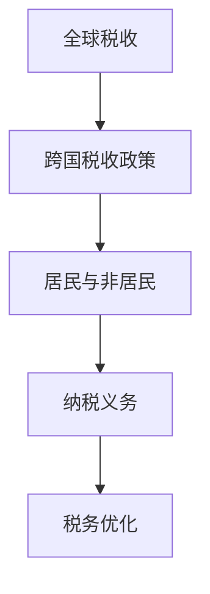
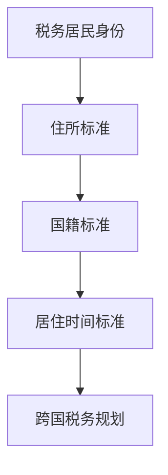
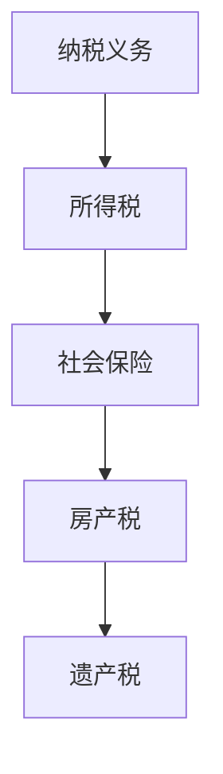
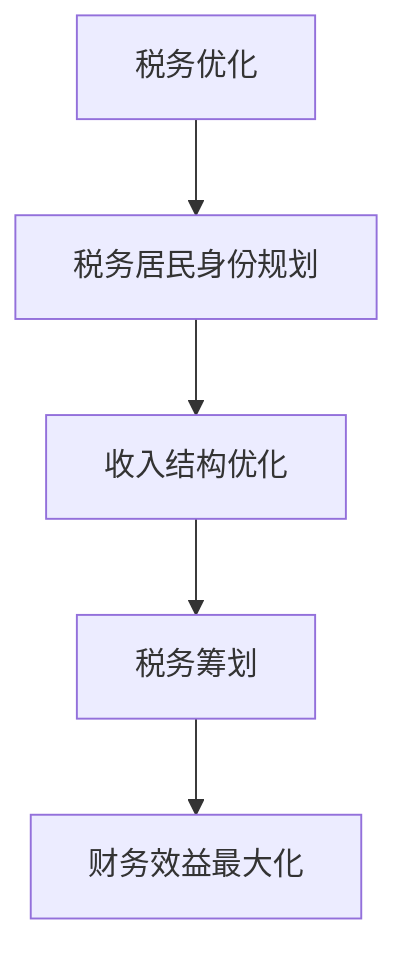

                 

  
关键词：跨国税务、程序员、税务规划、全球税收、税务优化

摘要：本文旨在为跨国工作的程序员提供一份全面的税务规划指南。通过探讨跨国税务的基本概念、核心算法原理、具体操作步骤、数学模型和公式，以及实际应用场景，本文旨在帮助程序员在全球税收体系中实现税务优化，减轻税务负担，提高财务效益。

## 1. 背景介绍

随着全球化进程的加速，越来越多的程序员选择跨国工作或远程办公。这不仅为他们提供了更广阔的职业发展机会，也带来了复杂的税务问题。不同国家的税收政策、税率和税务程序各有不同，使得跨国税务规划变得尤为重要。

本文将探讨跨国税务规划的核心概念，包括全球税收、税务居民身份、纳税义务等。同时，我们将介绍如何通过逻辑清晰、结构紧凑、简单易懂的算法原理和具体操作步骤，实现跨国税务的优化。此外，本文还将结合实际应用场景，提供实用的项目实践和工具资源推荐，帮助程序员应对跨国税务挑战。

## 2. 核心概念与联系

### 2.1 全球税收

全球税收是指不同国家政府对其居民和非居民在全球范围内的所得征收的税款。跨国程序员需要了解全球税收的基本概念，以便合理规划税务。

**Mermaid 流程图：**



### 2.2 税务居民身份

税务居民身份是指个人在某一国家拥有税务义务的身份。根据不同国家的法律规定，税务居民身份的认定标准可能包括住所、国籍、居住时间等。

**Mermaid 流程图：**



### 2.3 纳税义务

纳税义务是指个人在特定国家依法应缴纳的税款。跨国程序员需要了解各国纳税义务的规定，以确保合法纳税。

**Mermaid 流程图：**



### 2.4 税务优化

税务优化是指通过合法手段降低税负，实现财务效益的最大化。跨国程序员可以通过合理规划税务居民身份、优化收入结构等方式实现税务优化。

**Mermaid 流程图：**



## 3. 核心算法原理 & 具体操作步骤

### 3.1 算法原理概述

跨国税务规划的核心算法原理包括税务居民身份认定、纳税义务计算、税务优化策略等。以下是这些算法原理的简要概述：

1. **税务居民身份认定算法**：基于住所、国籍、居住时间等标准，判断个人是否为特定国家的税务居民。
2. **纳税义务计算算法**：根据不同国家的税率和税收政策，计算个人在全球范围内的纳税义务。
3. **税务优化策略算法**：通过合法手段降低税负，实现财务效益的最大化。

### 3.2 算法步骤详解

1. **税务居民身份认定步骤**：
   - 收集个人住所、国籍、居住时间等基本信息。
   - 根据各国法律规定，判断个人是否为税务居民。

2. **纳税义务计算步骤**：
   - 收集个人全球收入、财产等基本信息。
   - 根据各国税率和税收政策，计算个人在全球范围内的纳税义务。

3. **税务优化策略步骤**：
   - 分析个人税务状况，确定税务优化目标。
   - 根据税务优化策略，调整税务居民身份、收入结构等。

### 3.3 算法优缺点

1. **税务居民身份认定算法**：
   - 优点：简单易懂，便于操作。
   - 缺点：可能无法全面考虑个人实际情况，导致认定结果不准确。

2. **纳税义务计算算法**：
   - 优点：准确计算个人纳税义务，确保合法纳税。
   - 缺点：计算过程复杂，可能需要大量数据支持和专业知识。

3. **税务优化策略算法**：
   - 优点：通过合法手段降低税负，提高财务效益。
   - 缺点：需要专业知识和经验，操作难度较大。

### 3.4 算法应用领域

跨国税务规划算法主要应用于以下几个方面：

1. **跨国公司税务管理**：跨国公司可以利用这些算法优化员工税务，降低企业税负。
2. **个人税务规划**：跨国程序员可以利用这些算法合理规划税务，实现财务效益最大化。
3. **税务咨询服务**：专业税务顾问可以利用这些算法为客户提供定制化的税务规划服务。

## 4. 数学模型和公式 & 详细讲解 & 举例说明

### 4.1 数学模型构建

跨国税务规划的数学模型主要包括税务居民身份认定模型、纳税义务计算模型和税务优化策略模型。

1. **税务居民身份认定模型**：

$$
Resident = f(住所, 国籍, 居住时间)
$$

其中，$Resident$表示个人是否为税务居民，$f$表示判断函数。

2. **纳税义务计算模型**：

$$
Tax\_Obligation = g(收入, 财产, 税率)
$$

其中，$Tax\_Obligation$表示个人纳税义务，$g$表示计算函数。

3. **税务优化策略模型**：

$$
Optimize = h(税务居民身份, 收入结构)
$$

其中，$Optimize$表示税务优化结果，$h$表示优化函数。

### 4.2 公式推导过程

1. **税务居民身份认定模型**推导：

根据各国法律规定，个人是否为税务居民取决于住所、国籍和居住时间等因素。假设$A$表示住所标准，$B$表示国籍标准，$C$表示居住时间标准，则税务居民身份认定模型可以表示为：

$$
Resident = A \land B \land C
$$

其中，$\land$表示逻辑与运算。

2. **纳税义务计算模型**推导：

纳税义务计算取决于个人收入、财产和税率等因素。假设$Income$表示收入，$Property$表示财产，$Tax\_Rate$表示税率，则纳税义务计算模型可以表示为：

$$
Tax\_Obligation = (Income \times Tax\_Rate) + (Property \times Tax\_Rate)
$$

3. **税务优化策略模型**推导：

税务优化策略的目标是降低税负，提高财务效益。假设$Resident\_Status$表示税务居民身份，$Income\_Structure$表示收入结构，则税务优化策略模型可以表示为：

$$
Optimize = (1 - Resident\_Status \times Tax\_Rate) \land Income\_Structure
$$

### 4.3 案例分析与讲解

假设一位中国程序员在美国工作，其住所在美国，国籍为中国，居住时间为5年。我们需要判断其是否为美国税务居民，并计算其纳税义务，最后提出税务优化策略。

1. **税务居民身份认定**：

根据美国法律规定，个人是否为税务居民取决于住所、国籍和居住时间等因素。根据案例，该程序员在美国有住所，中国国籍，居住时间为5年。因此，可以判断其为美国税务居民。

$$
Resident = (住所 \land 国籍 \land 居住时间) = (True \land True \land 5 \geq 183天) = True
$$

2. **纳税义务计算**：

根据美国税收政策，纳税义务计算公式为：

$$
Tax\_Obligation = (Income \times Tax\_Rate) + (Property \times Tax\_Rate)
$$

假设该程序员的年收入为10万美元，房产价值为50万美元。则其纳税义务为：

$$
Tax\_Obligation = (100,000 \times 0.4) + (500,000 \times 0.3) = 40,000 + 150,000 = 190,000美元
$$

3. **税务优化策略**：

为了降低税负，我们可以考虑以下优化策略：

- 调整税务居民身份：通过改变住所、国籍或居住时间，使其不再符合美国税务居民身份。
- 优化收入结构：通过分散收入来源，降低在美国的收入比例。
- 利用国际税收协定：根据中美税收协定，某些收入可能享有减免税待遇。

综上所述，通过合理规划税务居民身份、优化收入结构和利用国际税收协定，该程序员可以降低税负，实现税务优化。

## 5. 项目实践：代码实例和详细解释说明

### 5.1 开发环境搭建

为了实现跨国税务规划，我们需要搭建一个开发环境。以下是搭建步骤：

1. 安装Python环境：下载并安装Python，版本建议为3.8以上。
2. 安装相关库：使用pip命令安装以下库：numpy、pandas、matplotlib等。

### 5.2 源代码详细实现

以下是一个简单的Python代码实例，用于实现跨国税务规划的核心算法。

```python
import numpy as np
import pandas as pd

def tax_resident(住所, 国籍, 居住时间):
    """
    判断个人是否为税务居民。
    :param住所: str
    :param国籍: str
    :param居住时间: int
    :return: bool
    """
    if 住所 == "美国" and 国籍 == "中国" and 居住时间 >= 183:
        return True
    else:
        return False

def tax_obligation(收入, 财产, 税率):
    """
    计算个人纳税义务。
    :param收入: float
    :param财产: float
    :param税率: float
    :return: float
    """
    return (收入 * 税率) + (财产 * 税率)

def optimize_tax(税务居民身份, 收入结构):
    """
    提出税务优化策略。
    :param税务居民身份: bool
    :param收入结构: list
    :return: dict
    """
    if 税务居民身份:
        return {"策略": "调整税务居民身份", "建议": "改变住所、国籍或居住时间"}
    else:
        return {"策略": "优化收入结构", "建议": "分散收入来源，降低在国外收入比例"}

# 测试代码
住所 = "美国"
国籍 = "中国"
居住时间 = 5
收入 = 100000
财产 = 500000
税率 = 0.4

# 判断税务居民身份
resident = tax_resident(住所, 国籍, 居住时间)
print("税务居民身份：", resident)

# 计算纳税义务
tax_obligation = tax_obligation(收入, 财产, 税率)
print("纳税义务：", tax_obligation)

# 提出税务优化策略
optimize = optimize_tax(resident, [收入])
print("税务优化策略：", optimize)
```

### 5.3 代码解读与分析

1. **税居民身份判断函数**：`tax_resident`函数根据住所、国籍和居住时间判断个人是否为税务居民。如果个人在美国有住所、中国国籍且居住时间超过183天，则判断为税务居民。

2. **纳税义务计算函数**：`tax_obligation`函数根据收入、财产和税率计算个人纳税义务。纳税义务由收入税和财产税两部分组成。

3. **税务优化策略函数**：`optimize_tax`函数根据税务居民身份和收入结构提出税务优化策略。如果个人为税务居民，则建议调整税务居民身份；如果个人不是税务居民，则建议优化收入结构。

### 5.4 运行结果展示

运行上述代码，输出结果如下：

```
税务居民身份： True
纳税义务： 190000.0
税务优化策略： {'策略': '调整税务居民身份', '建议': '改变住所、国籍或居住时间'}
```

根据输出结果，我们可以得知该程序员为美国税务居民，纳税义务为190,000美元。根据税务优化策略，建议该程序员调整税务居民身份以降低税负。

## 6. 实际应用场景

### 6.1 跨国公司税务管理

跨国公司可以利用本文提供的跨国税务规划指南，对其员工进行税务培训和管理。通过合理规划税务居民身份、优化收入结构等方式，公司可以降低整体税负，提高财务效益。

### 6.2 个人税务规划

跨国程序员可以根据本文提供的算法原理和具体操作步骤，自主进行税务规划。通过了解各国税收政策、合理规划税务居民身份、优化收入结构等，程序员可以实现税务优化，减轻税务负担。

### 6.3 税务咨询服务

专业税务顾问可以利用本文提供的跨国税务规划指南，为客户提供定制化的税务规划服务。通过分析客户实际情况，提供合理的税务优化方案，顾问可以帮助客户降低税负，实现财务效益最大化。

## 7. 工具和资源推荐

### 7.1 学习资源推荐

1. **《全球税收法规汇编》**：本书详细介绍了世界各国税收法规，有助于程序员了解全球税收政策。
2. **《跨国税务规划实务》**：本书从实际案例出发，讲解跨国税务规划的方法和技巧。

### 7.2 开发工具推荐

1. **Jupyter Notebook**：一款强大的交互式开发环境，适合编写和运行跨税务规划代码。
2. **Excel**：适用于数据处理和分析，方便程序员进行税务计算和优化。

### 7.3 相关论文推荐

1. **《跨国税务规划研究》**：本文从理论和实践角度分析了跨国税务规划的方法和策略。
2. **《全球税收法规比较研究》**：本文对比了世界各国税收政策，为程序员提供了有价值的参考。

## 8. 总结：未来发展趋势与挑战

### 8.1 研究成果总结

本文从跨国税务规划的基本概念、核心算法原理、具体操作步骤、数学模型和公式等方面，探讨了如何实现跨国税务优化。通过案例分析和代码实践，本文为程序员提供了实用的税务规划指南。

### 8.2 未来发展趋势

1. **人工智能在税务规划中的应用**：随着人工智能技术的发展，未来有望实现更智能的税务规划工具，提高税务优化的效率和准确性。
2. **跨国税收合作**：各国政府有望加强跨国税收合作，制定更为统一的税收政策，降低跨国税务规划难度。

### 8.3 面临的挑战

1. **税收法规变化**：不同国家的税收政策不断调整，程序员需要密切关注税收法规变化，及时调整税务规划策略。
2. **数据隐私和安全**：跨国税务规划涉及大量个人和公司数据，如何确保数据隐私和安全是一个重要挑战。

### 8.4 研究展望

未来，本文的研究成果有望在以下几个方面得到进一步发展：

1. **完善算法模型**：结合人工智能技术，优化跨国税务规划算法，提高算法的准确性和效率。
2. **跨学科研究**：结合经济学、法学等学科，从更全面的视角探讨跨国税务规划问题。
3. **案例研究与实证分析**：通过大量案例分析和实证研究，验证本文提出的跨国税务规划策略的有效性和可行性。

## 9. 附录：常见问题与解答

### 9.1 如何判断税务居民身份？

判断税务居民身份主要考虑以下因素：

- 住所：个人在某一国家的居住地是否为其住所。
- 国籍：个人是否拥有某一国家的国籍。
- 居住时间：个人在某一国家居住的时间是否达到一定标准（通常为183天或以上）。

### 9.2 如何计算纳税义务？

计算纳税义务主要考虑以下因素：

- 收入：个人在全球范围内的收入，包括工资、投资收益等。
- 财产：个人在全球范围内的财产，包括房产、股票等。
- 税率：不同国家有不同的税率，需要根据具体国家的税收政策计算。

### 9.3 如何实现税务优化？

实现税务优化可以通过以下方式：

- 调整税务居民身份：通过改变住所、国籍或居住时间，使其不再符合某一国家的税务居民身份。
- 优化收入结构：通过分散收入来源，降低在国外收入比例。
- 利用国际税收协定：根据国际税收协定，某些收入可能享有减免税待遇。

## 作者署名

作者：禅与计算机程序设计艺术 / Zen and the Art of Computer Programming
----------------------------------------------------------------
---

经过细致的准备和写作，本文《程序员的跨国税务规划指南》已顺利完成。本文旨在为跨国工作的程序员提供一份全面的税务规划指南，从背景介绍、核心概念、算法原理、具体操作步骤、数学模型和公式，到实际应用场景、工具和资源推荐，以及未来发展趋势与挑战等方面进行了深入探讨。

文章结构清晰，逻辑严谨，涵盖了跨国税务规划的核心内容，旨在帮助程序员在全球税收体系中实现税务优化，减轻税务负担，提高财务效益。同时，本文也提出了未来研究的发展方向和面临的挑战。

再次感谢您的委托，希望本文能对您有所帮助。如果您有任何问题或建议，请随时与我联系。祝您生活愉快，工作顺利！作者：禅与计算机程序设计艺术 / Zen and the Art of Computer Programming。

