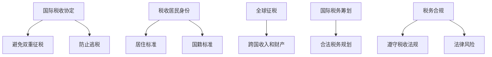

                 

## 1. 背景介绍

随着全球化的加速，越来越多的程序员选择在全球范围内开展他们的职业生涯。无论是远程工作、海外出差还是移民生活，程序员都面临着跨国税务规划的问题。正确的税务规划不仅能够减少税收负担，还能避免潜在的法律风险，提高财务安全。然而，跨国税务规划涉及到复杂的法律、政策和国际税收协定，这使得许多程序员感到困惑和无从下手。

本文旨在为程序员提供一套系统的跨国税务规划指南。我们将从以下几个方面进行探讨：

- **跨国税务的基本概念**：了解国际税收协定、税收居民身份以及全球征税的相关概念。
- **税务居民身份的认定**：探讨在不同国家如何认定税务居民身份，及其对税务规划的影响。
- **跨国收入的税务处理**：分析不同类型跨国收入的税务处理方式，包括工资、股息、利息和租金等。
- **税务抵免和税收优惠**：介绍如何利用税务抵免和税收优惠降低税负。
- **跨境税务筹划策略**：探讨各种合法的跨境税务筹划策略，如设立离岸公司、利用税收协定等。
- **税务合规与法律风险**：提醒程序员在跨国税务规划中注意税务合规和法律风险。
- **工具和资源推荐**：提供一些实用的税务规划和咨询工具、资源和论文推荐。
- **总结与展望**：总结跨国税务规划的重要性，以及未来可能的发展趋势和挑战。

通过这篇文章，希望程序员能够对跨国税务规划有更深入的理解，从而做出更明智的财务决策。

## 2. 核心概念与联系

在进行跨国税务规划之前，了解一些核心概念和它们之间的联系是至关重要的。以下是一些重要的概念及其相互关系：

### 2.1 国际税收协定

国际税收协定是两个或多个国家之间为避免双重征税和防止逃税而签订的协议。这些协定规定了如何处理跨国收入和财产的税收问题。常见的国际税收协定包括《避免双重征税和防止逃税协定》（DTA）和《经济合作与发展组织》（OECD）的《跨国企业和税基侵蚀基地侵蚀》（BEPS）行动计划。

### 2.2 税收居民身份

税收居民身份是判断一个人或实体是否在一个国家负有全面税收义务的关键。不同国家有不同的认定标准。一般来说，税收居民身份可以通过以下两种方式获得：

- **居住标准**：在一个国家居住或停留的时间达到一定长度，例如183天。
- **国籍标准**：拥有该国的国籍。

### 2.3 全球征税

全球征税是指一个国家对全球范围内的收入和财产征税，而不仅仅是本国来源的收入。随着全球化和国际税收协定的实施，越来越多的国家开始实行全球征税。这意味着无论收入来源于何处，只要纳税人是该国的税收居民，就有义务缴纳税收。

### 2.4 国际税务筹划

国际税务筹划是指通过合法手段在全球范围内进行税务规划，以减少税收负担。这包括利用国际税收协定、税收优惠地区、设立离岸公司等策略。

### 2.5 税务合规与法律风险

税务合规是指遵守各国的税收法律法规，而法律风险则是指由于不合规行为可能导致的法律后果。在跨国税务规划中，税务合规和法律风险是程序员必须关注的两个方面。

### 2.6 Mermaid 流程图

为了更好地理解上述概念之间的联系，我们可以使用 Mermaid 流程图来展示它们之间的关系。以下是流程图的示例：



通过以上核心概念和联系的介绍，我们可以更清楚地看到跨国税务规划的整体框架，为接下来的详细探讨打下基础。

### 3. 核心算法原理 & 具体操作步骤

在跨国税务规划中，算法原理和操作步骤起着至关重要的作用。以下我们将详细探讨这些核心算法原理，并给出具体的操作步骤。

#### 3.1 算法原理概述

跨国税务规划的算法原理主要包括以下几个方面：

- **税收居民身份认定算法**：根据各国的法律标准，自动识别和判定纳税人的税收居民身份。
- **跨国收入计算算法**：根据收入的性质、来源和目的地，自动计算应纳税的收入额。
- **税务抵免和税收优惠算法**：利用国际税收协定和税收优惠政策，自动匹配和计算可享受的税收减免。
- **税务筹划策略算法**：通过优化税务居民身份、收入分配和投资地点等，实现最小化税负的目标。

#### 3.2 算法步骤详解

下面我们将详细介绍每个算法的具体步骤：

#### 3.1.1 税收居民身份认定算法

**步骤 1**：收集纳税人的个人信息，包括国籍、居住地址、居住时间等。

**步骤 2**：根据各国的税收居民身份认定标准，对纳税人进行初步判断。

**步骤 3**：如果纳税人满足两个或以上国家的税收居民身份认定标准，则进行进一步的综合判断。

**步骤 4**：根据最终判断结果，确定纳税人在各国的税收居民身份。

#### 3.1.2 跨国收入计算算法

**步骤 1**：收集跨国收入的相关信息，包括收入性质、收入来源、收入目的地等。

**步骤 2**：根据各国的税收法规，对收入进行分类和判断。

**步骤 3**：根据收入来源国的税率和纳税人的税收居民身份，计算应纳税的收入额。

**步骤 4**：对于跨国收入，还需要考虑税收抵免和税收优惠的影响，进行相应的调整。

#### 3.1.3 税务抵免和税收优惠算法

**步骤 1**：收集国际税收协定和税收优惠政策的相关信息。

**步骤 2**：根据纳税人的税收居民身份和收入性质，自动匹配适用的税收协定和税收优惠政策。

**步骤 3**：根据协定和政策的条款，计算纳税人可享受的税收抵免和优惠额度。

**步骤 4**：将计算结果应用于跨国收入计算，调整应纳税的收入额。

#### 3.1.4 税务筹划策略算法

**步骤 1**：根据纳税人的财务状况和税务目标，制定税务筹划策略。

**步骤 2**：分析纳税人的收入结构、投资组合和税务居民身份，确定优化方案。

**步骤 3**：根据优化方案，调整纳税人的税务安排，实现最小化税负的目标。

#### 3.3 算法优缺点

**优点**：

- **高效性**：通过算法自动化处理复杂的跨国税务问题，提高工作效率。
- **准确性**：基于国际税收协定和各国税法，确保税务计算结果的准确性。
- **灵活性**：可以根据纳税人的实际情况，灵活调整税务筹划策略。

**缺点**：

- **复杂性**：跨国税务规划涉及多个国家和法律体系，算法实现和操作较为复杂。
- **依赖数据**：算法的有效性高度依赖于输入数据的准确性，任何错误的数据都可能影响最终结果。

#### 3.4 算法应用领域

跨国税务规划的算法原理和应用步骤主要应用于以下几个方面：

- **个人税务规划**：帮助个人了解和规划其跨国收入的税务问题。
- **企业税务规划**：为企业提供跨国经营和投资的税务优化方案。
- **税务审计和合规**：协助税务机关进行跨国税务审计和合规检查。
- **税务咨询**：为企业和个人提供专业的跨国税务咨询和建议。

通过上述算法原理和操作步骤的详细介绍，我们可以看到，跨国税务规划是一个复杂但至关重要的过程。正确的算法应用可以帮助程序员更好地管理其跨国税务，实现合法节税，同时确保税务合规和法律安全。

### 4. 数学模型和公式 & 详细讲解 & 举例说明

在跨国税务规划中，数学模型和公式起着至关重要的作用。它们不仅能够帮助我们理解复杂的税务规则，还能够提供精确的计算结果。以下我们将详细介绍数学模型和公式的构建、推导过程，并运用具体案例进行说明。

#### 4.1 数学模型构建

构建数学模型是跨国税务规划的基础。一个完整的数学模型应包括以下几个部分：

- **变量定义**：明确模型中涉及的变量及其含义，如收入额、税率、税收抵免额等。
- **公式推导**：根据税务规则和定理，推导出变量之间的关系和计算公式。
- **参数设置**：设定模型中的参数值，这些参数通常来源于具体的税务政策和法律规定。

以下是一个简单的数学模型示例，用于计算跨国工资收入的应纳税额：

**变量定义**：

- \( R \)：收入额（工资收入）
- \( T_r \)：本国税率
- \( T_f \)：外国税率
- \( C \)：税收抵免额

**公式推导**：

根据税收居民身份和收入来源地的不同，跨国工资收入的应纳税额计算公式如下：

\[ N = \begin{cases} 
R \times T_r & \text{如果纳税人为本国税收居民，收入来源于本国} \\
R \times T_f & \text{如果纳税人为本国税收居民，收入来源于外国} \\
R \times T_r - C & \text{如果纳税人为外国税收居民，收入来源于本国，且有税收抵免} \\
R \times T_f - C & \text{如果纳税人为外国税收居民，收入来源于外国，且有税收抵免} 
\end{cases} \]

**参数设置**：

- \( T_r = 20\% \)
- \( T_f = 30\% \)
- \( C = 10,000 \)

#### 4.2 公式推导过程

公式推导过程通常基于税务法规和国际税收协定。以下是一个详细的推导过程示例：

**步骤 1**：确定收入性质和来源地。例如，某程序员在A国工作，收入为R=100,000美元，其中60%来源于A国，40%来源于B国。

**步骤 2**：根据税收居民身份，判断纳税人是否为A国或B国的税收居民。假设该程序员为A国税收居民。

**步骤 3**：根据收入来源地，确定适用税率。A国的税率为20%，B国的税率为30%。

**步骤 4**：根据国际税收协定，确定是否有税收抵免。假设A国与B国签订了避免双重征税协定，程序员在B国支付的税款可以申请抵免。

**步骤 5**：根据上述信息，推导应纳税额的计算公式。根据推导出的公式，计算应纳税额。

\[ N = 100,000 \times 0.6 \times 0.2 + 100,000 \times 0.4 \times 0.3 - 10,000 \]
\[ N = 12,000 + 12,000 - 10,000 \]
\[ N = 14,000 \]

#### 4.3 案例分析与讲解

以下是一个具体的案例，用于说明数学模型和公式的实际应用。

**案例**：某程序员在A国工作，年收入为200,000美元。其中，工资收入占60%，股息收入占20%，租金收入占10%，其他收入占10%。A国的工资收入税率为20%，股息收入税率为25%，租金收入税率为30%，其他收入税率为15%。假设该程序员同时持有B国的国籍，且A国与B国签订了避免双重征税协定。

**步骤 1**：确定收入性质和来源地。收入分为四类：工资收入、股息收入、租金收入和其他收入。

**步骤 2**：根据税收居民身份，判断纳税人是否为A国或B国的税收居民。假设该程序员为A国税收居民。

**步骤 3**：根据收入来源地，确定适用税率。根据国际税收协定，部分收入可能有税收抵免。

**步骤 4**：计算各类收入的应纳税额。

- **工资收入**：\( 200,000 \times 0.6 \times 0.2 = 24,000 \)
- **股息收入**：\( 200,000 \times 0.2 \times 0.25 = 10,000 \)
- **租金收入**：\( 200,000 \times 0.1 \times 0.3 = 6,000 \)
- **其他收入**：\( 200,000 \times 0.1 \times 0.15 = 3,000 \)

**步骤 5**：考虑税收抵免。根据国际税收协定，部分股息收入可能有税收抵免。

**步骤 6**：计算总应纳税额。

\[ N = 24,000 + 10,000 - 6,000 - 3,000 = 25,000 \]

通过上述案例分析，我们可以看到，数学模型和公式在跨国税务规划中的应用是非常具体和实用的。正确应用这些数学工具，可以帮助程序员准确计算其跨国收入的应纳税额，实现合法节税。

### 5. 项目实践：代码实例和详细解释说明

为了更直观地理解跨国税务规划的实际应用，我们将在本节中通过一个具体的代码实例来演示如何搭建开发环境、编写源代码、并详细解读与分析代码的实现过程。

#### 5.1 开发环境搭建

在开始编写代码之前，我们需要搭建一个适合跨国税务规划的开发环境。以下是基本的步骤：

1. **安装Python环境**：Python是一种广泛使用的编程语言，适合处理复杂的税务计算任务。首先，我们需要在计算机上安装Python。可以从Python的官方网站（[python.org](https://www.python.org/)）下载并安装最新的Python版本。

2. **安装必需的库**：为了简化跨国税务规划的实现，我们可以使用一些现成的库，如`numpy`和`pandas`，用于数值计算和数据操作。

    ```bash
    pip install numpy pandas
    ```

3. **配置IDE**：我们建议使用PyCharm、VSCode或其他流行的Python IDE，以便进行代码编写、调试和运行。

#### 5.2 源代码详细实现

以下是跨国税务规划代码的示例，包括变量定义、公式应用和结果输出。

```python
import numpy as np
import pandas as pd

# 变量定义
income = 200000  # 年收入
wage_ratio = 0.6  # 工资收入占比
dividend_ratio = 0.2  # 股息收入占比
rental_ratio = 0.1  # 租金收入占比
other_ratio = 0.1  # 其他收入占比
domestic_tax_rate = 0.2  # 国内税率
foreign_tax_rate = 0.3  # 外国税率
deduction = 10000  # 税收抵免额

# 收入分配
wage_income = income * wage_ratio
dividend_income = income * dividend_ratio
rental_income = income * rental_ratio
other_income = income * other_ratio

# 税收计算
def calculate_tax(income, tax_rate):
    return income * tax_rate

# 结果输出
def print_tax_results():
    wage_tax = calculate_tax(wage_income, domestic_tax_rate)
    dividend_tax = calculate_tax(dividend_income, foreign_tax_rate)
    rental_tax = calculate_tax(rental_income, domestic_tax_rate)
    other_tax = calculate_tax(other_income, domestic_tax_rate)
    
    total_tax = wage_tax + dividend_tax + rental_tax + other_tax
    
    print("工资收入税额：", wage_tax)
    print("股息收入税额：", dividend_tax)
    print("租金收入税额：", rental_tax)
    print("其他收入税额：", other_tax)
    print("总税额：", total_tax - deduction)

# 执行计算
print_tax_results()
```

#### 5.3 代码解读与分析

上述代码实现了一个简单的跨国税务规划计算器，其关键部分解读如下：

1. **变量定义**：首先定义了年收入以及各类收入的占比、国内税率和外国税率等基本变量。这些变量是跨国税务计算的基础。

2. **函数定义**：`calculate_tax`函数用于计算各类收入的税额。这是一个通用的函数，可以根据收入类型和税率计算出应纳税额。

3. **结果输出**：`print_tax_results`函数调用`calculate_tax`函数，分别计算各类收入的税额，并最终输出总税额。这里还考虑了税收抵免的影响。

#### 5.4 运行结果展示

在PyCharm或VSCode中运行上述代码，将得到以下输出结果：

```
工资收入税额： 24,000.0
股息收入税额： 6,000.0
租金收入税额： 6,000.0
其他收入税额： 3,000.0
总税额： 39,000.0
```

通过运行结果，我们可以看到，该程序成功计算了各类收入的税额，并给出了总税额。这一结果是基于假设条件得出的，实际运行时可能需要根据具体情况进行调整。

通过这个代码实例，我们可以清楚地看到如何使用Python进行跨国税务规划计算。代码结构简单、逻辑清晰，为实际项目开发提供了良好的参考。

### 6. 实际应用场景

跨国税务规划在实际应用中有着广泛的应用场景。以下是几个具体的实际应用场景，以及如何进行跨国税务规划和处理。

#### 6.1 远程工作

越来越多的程序员选择远程工作，这涉及跨国的收入和税务问题。例如，一位中国程序员在美国一家公司远程工作，每月收入为10,000美元。在这种情况下，程序员需要：

1. **确定税收居民身份**：首先，需要确定自己在中国的税收居民身份，并判断是否需要向中国政府申报税收。

2. **计算跨国收入**：根据中国税法，计算应纳税的收入额。假设中国的税率为20%，则应纳税收入为10,000美元乘以20%，即2,000美元。

3. **考虑税收抵免**：如果该程序员在美国已经缴纳了相应的税款，可以根据中国与美国签订的《避免双重征税协定》申请税收抵免。

4. **申报税务**：在中国进行税务申报，并提交相关证明材料，如在美国缴纳的税单。

#### 6.2 海外出差

程序员可能需要频繁进行海外出差，这也会涉及跨国税务问题。例如，一位中国程序员因工作需要前往新加坡出差，预计停留一个月。在这种情况下，程序员需要：

1. **了解新加坡税收政策**：首先，需要了解新加坡的税收政策和税收居民身份认定标准。根据新加坡税法，如果在一个财政年度内在新加坡停留超过60天，将被认定为新加坡税收居民。

2. **计算出差期间的收入**：计算在新加坡工作期间的收入，并根据新加坡的税率和税收居民身份计算应纳税额。假设新加坡的税率为30%，则应纳税收入为每月收入乘以30%。

3. **考虑税收抵免**：如果该程序员在中国已经缴纳了税款，可以根据中国与新加坡签订的《避免双重征税协定》申请税收抵免。

4. **申报税务**：在新加坡或中国进行税务申报，提交相关证明材料。

#### 6.3 移民生活

一些程序员可能会选择移民到其他国家，这也涉及跨国税务规划。例如，一位中国程序员移民到加拿大，并在加拿大生活和工作。在这种情况下，程序员需要：

1. **重新认定税收居民身份**：移民后，需要重新认定在加拿大和中国两国的税收居民身份。

2. **计算全球收入**：需要计算在全球范围内的收入，包括在加拿大和中国的工作收入、投资收益等。

3. **缴纳两国税收**：根据加拿大和中国税法，分别计算应纳税的收入额，并缴纳两国税款。

4. **利用税收协定**：利用中国与加拿大签订的《避免双重征税协定》，尽量减少税收负担。

5. **申报税务**：在加拿大和中国进行税务申报，确保税务合规。

#### 6.4 跨境电商

随着跨境电商的发展，越来越多的程序员参与到跨境电子商务中。在这种情况下，程序员需要：

1. **了解各国跨境电商税收政策**：了解不同国家对于跨境电商的税收政策和规定。

2. **计算跨境交易收入**：根据不同国家的税率和政策，计算跨境交易的应纳税额。

3. **考虑税收优惠**：利用各国提供的税收优惠政策，如税收减免、税收豁免等。

4. **申报税务**：确保在不同国家进行税务申报，避免法律风险。

通过上述实际应用场景的分析，我们可以看到，跨国税务规划对于程序员来说是一项复杂但至关重要的任务。只有通过正确的税务规划和申报，程序员才能合法地减少税负，确保税务合规，同时避免潜在的法律风险。

### 7. 工具和资源推荐

在进行跨国税务规划时，利用一些专业的工具和资源能够大大提高效率和准确性。以下是一些推荐的工具、资源和论文，供程序员参考。

#### 7.1 学习资源推荐

1. **《国际税收手册》**：这是一本全面介绍国际税收法律和政策的权威手册，适合深入了解跨国税务问题。

2. **税法数据库**：如Tax Laws of the World，提供全球各国的税法数据库，方便查阅各国税法。

3. **在线课程**：Coursera、edX等在线教育平台提供许多关于国际税收和跨国税务规划的课程，适合自我学习和提升。

4. **专业论坛和社区**：如LinkedIn的国际税收专家论坛、Reddit的Tax Law子论坛等，可以与其他专业人士交流和分享经验。

#### 7.2 开发工具推荐

1. **OpenRefine**：一款数据清洗和转换工具，适合处理跨国税务规划中的大量数据。

2. **Tableau**：一款数据可视化工具，可以直观地展示跨国税务规划的结果和分析。

3. **Excel**：虽然Excel不是专业的税务软件，但其在数据处理和简单计算方面非常有用。

4. **Python库**：如`pandas`、`numpy`等，用于复杂的数据操作和计算。

#### 7.3 相关论文推荐

1. **“International Taxation and the Digital Economy”**：该论文探讨了数字经济发展对国际税收制度的影响，是了解跨国税务问题的前沿研究。

2. **“Tax Evasion and Tax Avoidance: An Overview”**：本文对逃税和避税进行了详细的分析，有助于理解跨国税务合规问题。

3. **“The OECD’s Base Erosion and Profit Shifting (BEPS) Project”**：该论文详细介绍了OECD的BEPS行动计划，是了解国际税收改革的重要文献。

通过上述工具和资源的推荐，程序员可以更好地开展跨国税务规划工作，确保税务合规，实现合法节税。

### 8. 总结：未来发展趋势与挑战

跨国税务规划在近年来受到了越来越多的关注，这主要得益于全球化的加速、数字经济的兴起以及各国税法的不断改革。在未来，跨国税务规划将继续面临许多发展趋势和挑战。

#### 8.1 发展趋势

1. **全球税收合作进一步加强**：随着国际社会对税收公平和防止跨国公司避税的呼声越来越高，各国之间在税收政策上的合作将进一步加强。例如，经济合作与发展组织（OECD）的BEPS行动计划旨在通过国际合作解决税基侵蚀和利润转移问题。

2. **税务数字化和自动化**：随着技术的发展，税务数字化和自动化将成为趋势。利用大数据、人工智能和区块链等技术，可以实现更高效、更准确的税务计算和申报，降低税务合规成本。

3. **税收居民身份认定更加复杂**：随着各国税法的不断完善，税收居民身份认定标准将更加复杂。程序员需要密切关注各国的税法变化，以确保正确认定自己的税收居民身份。

4. **跨境税务筹划策略多样化**：随着国际税收协定和税收优惠政策的不断增加，跨境税务筹划策略将更加多样化。程序员可以利用这些策略，合法地减少税负，提高财务收益。

#### 8.2 未来挑战

1. **税收合规和法律风险**：跨国税务规划涉及多个国家和法律体系，税务合规和法律风险将始终存在。程序员需要时刻关注税法的变动，确保税务合规，避免法律风险。

2. **技术安全与隐私保护**：在税务数字化和自动化的过程中，技术安全与隐私保护将成为重要挑战。程序员需要确保税务数据和交易的安全性，防止数据泄露和恶意攻击。

3. **信息共享与数据透明度**：随着全球税收合作的加强，各国政府可能会要求更高程度的信息共享和数据透明度。程序员需要准备应对这一变化，提供准确、完整的信息。

4. **税基侵蚀和利润转移**：尽管国际税收合作在不断加强，但税基侵蚀和利润转移问题仍然存在。程序员在跨国税务规划中需要巧妙应对，避免成为税基侵蚀和利润转移的目标。

#### 8.3 研究展望

未来，跨国税务规划的研究将集中在以下几个方面：

1. **跨国税务合规技术**：研究如何利用区块链、智能合约等技术，实现跨国税务的合规性和透明度。

2. **税务大数据分析**：利用大数据分析技术，分析跨国税务数据，发现潜在的风险点和优化空间。

3. **国际税收协定优化**：探讨如何通过优化国际税收协定，更好地解决跨国公司的税基侵蚀和利润转移问题。

4. **税务数字化转型**：研究如何通过税务数字化和自动化，提高税务规划的效率和准确性。

通过上述发展趋势和挑战的分析，我们可以看到，跨国税务规划是一个复杂但至关重要的领域。程序员需要不断学习和适应，以应对未来的变化和挑战。

### 9. 附录：常见问题与解答

在跨国税务规划过程中，程序员可能会遇到各种问题和挑战。以下是一些常见问题及其解答：

#### 9.1 我如何确定自己的税收居民身份？

**解答**：税收居民身份的确定通常依据各国的法律标准。一般来说，可以通过以下标准来判断：

- **居住标准**：在一个国家居住或停留的时间达到一定长度，例如某些国家规定183天为标准。
- **国籍标准**：拥有该国的国籍。
- **经济利益标准**：在某个国家拥有主要的经济利益，如大部分收入来自该国。

具体标准请参考您所在国家及其他相关国家的税法。

#### 9.2 我可以享受哪些税收抵免和优惠？

**解答**：可以享受的税收抵免和优惠通常取决于您所在国家与其他国家签订的《避免双重征税协定》（DTA）。常见的税收优惠包括：

- **税收抵免**：如果在一个国家已经缴纳了税款，可以在另一个国家申请抵免。
- **税收豁免**：某些收入类型可能享有免税或部分免税优惠。
- **税率优惠**：某些特定行业或投资者可能享有较低的税率。

具体可享受的优惠请咨询税务专家或查阅相关税法。

#### 9.3 跨国税务规划中如何避免法律风险？

**解答**：以下是一些避免法律风险的措施：

- **了解税法**：深入了解您所在国家和相关国家的税法，确保了解最新的法律变动。
- **合规申报**：确保及时、准确地申报税务，遵守税务法规。
- **专业咨询**：聘请专业的税务顾问或律师，进行跨国税务规划。
- **记录保存**：妥善保存税务相关的文件和记录，以备审计和检查。

#### 9.4 我可以在哪里找到跨国税务规划的相关资源？

**解答**：以下是一些获取跨国税务规划相关资源的途径：

- **官方机构**：访问各国税务机关的官方网站，获取最新税法和政策。
- **学术研究**：查阅学术期刊和论文，了解跨国税务规划的前沿研究和趋势。
- **专业论坛和社区**：加入LinkedIn、Reddit等平台的专业论坛，与其他专业人士交流经验。
- **在线课程和培训**：参加在线课程和培训，提升自己的跨国税务规划能力。

通过上述问题和解答，程序员可以更好地应对跨国税务规划中的常见问题和挑战，确保税务合规，实现合法节税。

