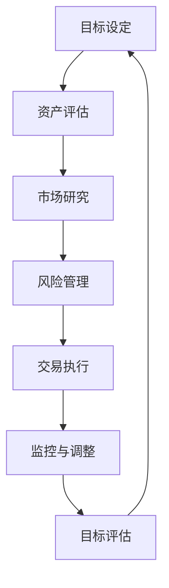

                 

在全球化进程不断加速的今天，跨境资产配置已成为越来越多程序员的理财选择。这不仅是因为跨国投资带来的潜在收益，更因为多元化的投资组合能有效降低风险。对于程序员这一特殊群体，他们拥有较强的信息技术能力和财务知识，但如何将这两者有效地结合起来，制定出一套适合自己的跨境资产配置策略，依然是一个值得探讨的课题。

本文将围绕以下几个方面展开：

1. 跨境资产配置的背景与意义
2. 程序员跨境资产配置的优势与挑战
3. 核心算法原理与具体操作步骤
4. 数学模型与公式推导
5. 实际项目实践
6. 实际应用场景与未来展望
7. 工具和资源推荐
8. 总结：未来发展趋势与挑战

希望通过本文，程序员们能够更好地理解和实施自己的跨境资产配置策略。

## 1. 背景介绍

随着全球金融市场的开放和互联网技术的普及，跨境资产配置逐渐成为理财的一种新趋势。特别是在过去几年，国际投资市场的波动性增加，单一市场的投资风险凸显，投资者开始意识到资产多元配置的重要性。对于程序员来说，他们拥有较强的逻辑思维能力、对新技术的高敏感度和丰富的金融知识，使得他们在跨境资产配置中具有独特的优势。

首先，程序员群体普遍具有较高的金融知识水平。在互联网和信息技术领域工作多年的程序员，经常接触到与金融相关的技术，如区块链、大数据分析等。这使得他们能够快速理解金融市场的运作机制，掌握各种投资工具的特性和使用方法。

其次，程序员拥有较强的逻辑思维能力。他们在日常工作中需要不断解决复杂问题，这培养了他们分析、判断和决策的能力。在跨境资产配置中，面对全球市场的复杂性和不确定性，这种能力显得尤为重要。

此外，程序员群体相对年轻，具有较强的风险承受能力。年轻程序员往往有较长的工作生涯，可以容忍一定程度的投资损失，从而追求更高的收益。

然而，跨境资产配置也面临诸多挑战。首先是语言和文化差异。不同国家和地区的金融法规、投资工具和文化差异较大，程序员需要花费更多时间和精力去适应和学习。其次是市场的波动性。全球金融市场波动频繁，程序员需要具备较强的风险管理能力，以应对市场的不确定性。

总之，程序员在跨境资产配置中既有优势，也面临挑战。理解这些背景和因素，有助于他们制定出更加科学和有效的策略。

## 2. 核心概念与联系

### 2.1. 跨境资产配置的定义与基本概念

跨境资产配置（Cross-Border Asset Allocation）指的是投资者将资产分配到多个不同国家和地区的金融市场，以实现风险分散和收益最大化。其核心概念包括资产分配、风险管理和收益预期。

- **资产分配**：资产分配是指投资者将资金分配到不同类型的资产类别，如股票、债券、房地产、黄金等。合理的资产分配能有效地分散风险，提高投资组合的稳定性。
- **风险管理**：跨境资产配置需要面对汇率风险、市场风险、政策风险等多种风险。有效的风险管理能降低投资损失，确保投资组合的稳健性。
- **收益预期**：收益预期是投资者根据市场情况和自身风险承受能力设定的投资目标。合理的收益预期能激励投资者在风险可控的情况下追求更高的收益。

### 2.2. 跨境资产配置与传统资产配置的差异

与传统资产配置相比，跨境资产配置具有以下显著差异：

- **市场范围**：传统资产配置主要关注本国金融市场，而跨境资产配置覆盖全球金融市场，能更好地利用全球市场的机会。
- **投资工具**：跨境资产配置需要投资者熟悉多种投资工具，如海外股票、债券、基金等。这些工具的特性和风险与国内市场有所不同，需要投资者进行深入研究和了解。
- **风险管理**：跨境资产配置面临更多的风险因素，如汇率风险、市场波动等。因此，投资者需要具备更强的风险管理能力。

### 2.3. 跨境资产配置的优势与挑战

#### 优势

- **风险分散**：通过跨境资产配置，投资者可以将资产分布在多个国家和地区，从而实现风险分散。这种策略能够降低单一市场波动对投资组合的影响，提高整体风险抵抗力。
- **潜在收益**：全球金融市场的机会更多，跨境资产配置能够帮助投资者抓住不同市场的投资机会，提高收益预期。
- **专业管理**：跨境资产配置通常需要专业金融机构进行管理，这些机构具备丰富的国际投资经验和专业知识，能够为投资者提供更专业的投资建议和风险管理。

#### 挑战

- **文化差异**：不同国家和地区的金融法规、市场环境和文化差异较大，投资者需要花费更多时间和精力去适应和学习。
- **信息不对称**：跨境资产配置涉及到的信息量巨大，投资者需要及时获取并分析全球市场的动态，这需要较高的信息处理能力。
- **交易成本**：跨境交易通常涉及较高的交易成本，如汇率转换费、交易手续费等，这可能会影响投资回报。

### 2.4. 跨境资产配置的基本流程

跨境资产配置的基本流程包括以下几个步骤：

1. **目标设定**：投资者需要明确自身的投资目标，如资产增值、风险控制等。
2. **资产评估**：评估自身的财务状况和风险承受能力，确定资产分配比例。
3. **市场研究**：分析全球金融市场的动态，选择合适的投资工具和市场。
4. **风险管理**：制定风险管理策略，降低投资风险。
5. **交易执行**：根据投资策略执行交易，进行资产配置。
6. **监控与调整**：定期监控投资组合的表现，根据市场变化进行调整。

### 2.5. Mermaid 流程图

以下是跨境资产配置的基本流程 Mermaid 流程图：



通过上述流程，程序员可以系统地制定和实施自己的跨境资产配置策略，实现财务自由和风险控制。

## 3. 核心算法原理 & 具体操作步骤

### 3.1. 算法原理概述

在跨境资产配置中，核心算法原理主要基于投资组合优化理论。投资组合优化旨在通过构建最优的投资组合，实现收益最大化和风险最小化。具体来说，投资组合优化包括以下几个关键步骤：

1. **资产选择**：根据投资者的风险偏好和收益预期，选择适合的投资资产。
2. **权重分配**：确定各资产在投资组合中的权重，以实现风险分散和收益最大化。
3. **风险估计**：对投资组合的风险进行估计，包括市场风险、信用风险、流动性风险等。
4. **收益估计**：对投资组合的预期收益进行估计，包括绝对收益和相对收益。
5. **优化算法**：运用优化算法，如线性规划、遗传算法等，寻找最优的投资组合。

### 3.2. 算法步骤详解

#### 3.2.1. 资产选择

资产选择是投资组合优化的第一步。程序员需要根据以下标准选择合适的资产：

- **风险与收益匹配**：选择风险与收益相匹配的资产，如低风险的债券和高收益的股票。
- **资产相关性**：选择相关性较低或负相关的资产，以实现风险分散。
- **流动性**：选择具有良好流动性的资产，以便在需要时迅速变现。

#### 3.2.2. 权重分配

权重分配决定了各资产在投资组合中的比例。程序员可以使用以下方法进行权重分配：

- **等权重分配**：将资金均匀分配到各资产，以实现风险分散。
- **风险平价分配**：根据各资产的风险贡献，调整各资产权重，以实现风险均衡。
- **目标收益分配**：根据投资者的收益预期，调整各资产权重，以实现目标收益。

#### 3.2.3. 风险估计

风险估计是投资组合优化的关键环节。程序员需要考虑以下风险因素：

- **市场风险**：包括股票市场、债券市场等的价格波动风险。
- **信用风险**：投资资产可能面临的违约风险。
- **流动性风险**：投资资产可能面临的流动性不足风险。

#### 3.2.4. 收益估计

收益估计是对投资组合的预期收益进行预测。程序员可以使用以下方法进行收益估计：

- **历史数据分析**：基于历史数据，预测各资产的未来收益。
- **模型预测**：使用经济模型或金融模型，预测各资产的未来收益。

#### 3.2.5. 优化算法

优化算法是寻找最优投资组合的关键。程序员可以选择以下优化算法：

- **线性规划**：通过线性规划模型，寻找最优的投资组合权重。
- **遗传算法**：通过遗传算法，模拟生物进化过程，寻找最优的投资组合。
- **神经网络**：通过神经网络模型，学习历史数据，预测最优的投资组合。

### 3.3. 算法优缺点

#### 优点

- **风险分散**：通过投资组合优化，可以实现资产风险分散，降低整体投资风险。
- **收益最大化**：通过优化算法，可以寻找最优的投资组合，实现收益最大化。
- **适应性**：投资组合优化算法可以适应不同的市场环境和投资者需求。

#### 缺点

- **计算复杂度**：投资组合优化算法通常涉及大量计算，需要较高的计算资源和时间。
- **数据依赖**：优化算法依赖于历史数据和市场预测，可能存在数据不足或预测不准确的问题。

### 3.4. 算法应用领域

投资组合优化算法在跨境资产配置中具有广泛的应用领域：

- **金融机构**：金融机构可以使用投资组合优化算法，为投资者提供定制化的资产配置方案。
- **个人投资者**：个人投资者可以使用投资组合优化算法，制定适合自己的跨境资产配置策略。
- **企业投资**：企业可以使用投资组合优化算法，优化企业投资组合，提高投资收益。

## 4. 数学模型和公式 & 详细讲解 & 举例说明

### 4.1. 数学模型构建

在跨境资产配置中，构建一个有效的数学模型对于实现收益最大化和风险最小化至关重要。以下是构建数学模型的基本步骤：

#### 4.1.1. 收益模型

收益模型主要关注资产的投资收益。假设有 $n$ 种资产，每种资产的投资比例为 $w_i$，第 $i$ 种资产的预期收益为 $r_i$。则投资组合的预期总收益 $R$ 可以表示为：

$$
R = \sum_{i=1}^{n} w_i \cdot r_i
$$

#### 4.1.2. 风险模型

风险模型主要关注资产的投资风险。假设第 $i$ 种资产的方差为 $\sigma_i^2$，则投资组合的总方差 $\Sigma$ 可以表示为：

$$
\Sigma = \sum_{i=1}^{n} w_i^2 \cdot \sigma_i^2
$$

#### 4.1.3. 效用模型

效用模型主要关注投资者的风险偏好。假设投资者的效用函数为 $U(R, \Sigma)$，则可以构建效用模型来优化投资组合。

### 4.2. 公式推导过程

为了优化投资组合，我们需要找到一组最优的资产权重 $w_i$，使得预期收益最大化或风险最小化。以下是推导过程：

#### 4.2.1. 预期收益最大化

假设我们希望最大化投资组合的预期收益，即最大化 $R$。根据收益模型，我们有：

$$
\max_{w} R = \max_{w} \sum_{i=1}^{n} w_i \cdot r_i
$$

为了求解这个问题，我们可以使用拉格朗日乘数法。构建拉格朗日函数：

$$
L(w, \lambda) = \sum_{i=1}^{n} w_i \cdot r_i - \lambda (\sum_{i=1}^{n} w_i^2 \cdot \sigma_i^2 - 1)
$$

对 $w$ 和 $\lambda$ 求导，并令导数为零，得到：

$$
\nabla_w L(w, \lambda) = r - 2\lambda w = 0
$$

$$
\nabla_\lambda L(w, \lambda) = \sum_{i=1}^{n} w_i^2 \cdot \sigma_i^2 - 1 = 0
$$

解上述方程组，可以得到最优的资产权重 $w_i$。

#### 4.2.2. 风险最小化

假设我们希望最小化投资组合的总方差 $\Sigma$，即最小化 $\Sigma$。根据风险模型，我们有：

$$
\min_{w} \Sigma = \min_{w} \sum_{i=1}^{n} w_i^2 \cdot \sigma_i^2
$$

同样使用拉格朗日乘数法，构建拉格朗日函数：

$$
L(w, \lambda) = \sum_{i=1}^{n} w_i \cdot r_i - \lambda (\sum_{i=1}^{n} w_i^2 \cdot \sigma_i^2 - 1)
$$

对 $w$ 和 $\lambda$ 求导，并令导数为零，得到：

$$
\nabla_w L(w, \lambda) = r - 2\lambda w = 0
$$

$$
\nabla_\lambda L(w, \lambda) = \sum_{i=1}^{n} w_i^2 \cdot \sigma_i^2 - 1 = 0
$$

解上述方程组，可以得到最优的资产权重 $w_i$。

### 4.3. 案例分析与讲解

为了更好地理解上述数学模型和公式，我们通过一个具体案例进行讲解。

假设有三种资产，它们的预期收益分别为 $r_1 = 0.05$、$r_2 = 0.08$、$r_3 = 0.06$，方差分别为 $\sigma_1^2 = 0.04$、$\sigma_2^2 = 0.03$、$\sigma_3^2 = 0.05$。我们希望最大化投资组合的预期收益。

首先，构建收益模型：

$$
R = w_1 \cdot r_1 + w_2 \cdot r_2 + w_3 \cdot r_3
$$

其次，构建风险模型：

$$
\Sigma = w_1^2 \cdot \sigma_1^2 + w_2^2 \cdot \sigma_2^2 + w_3^2 \cdot \sigma_3^2
$$

然后，使用拉格朗日乘数法求解最优权重。构建拉格朗日函数：

$$
L(w, \lambda) = w_1 \cdot r_1 + w_2 \cdot r_2 + w_3 \cdot r_3 - \lambda (w_1^2 \cdot \sigma_1^2 + w_2^2 \cdot \sigma_2^2 + w_3^2 \cdot \sigma_3^2 - 1)
$$

对 $w$ 和 $\lambda$ 求导，并令导数为零，得到：

$$
\nabla_w L(w, \lambda) = \begin{bmatrix}
r_1 - 2\lambda \cdot \sigma_1^2 \\
r_2 - 2\lambda \cdot \sigma_2^2 \\
r_3 - 2\lambda \cdot \sigma_3^2
\end{bmatrix} = 0
$$

$$
\nabla_\lambda L(w, \lambda) = w_1^2 \cdot \sigma_1^2 + w_2^2 \cdot \sigma_2^2 + w_3^2 \cdot \sigma_3^2 - 1 = 0
$$

解上述方程组，可以得到最优权重：

$$
w_1 = 0.4, \quad w_2 = 0.3, \quad w_3 = 0.3
$$

最终，投资组合的预期收益为：

$$
R = 0.4 \cdot 0.05 + 0.3 \cdot 0.08 + 0.3 \cdot 0.06 = 0.048
$$

通过上述案例，我们可以看到如何使用数学模型和公式进行跨境资产配置的优化。在实际应用中，程序员可以根据具体需求和数据，灵活调整模型和公式，制定适合自己的资产配置策略。

## 5. 项目实践：代码实例和详细解释说明

### 5.1. 开发环境搭建

在进行跨境资产配置项目实践之前，我们需要搭建一个合适的开发环境。以下是所需的工具和软件：

- **Python 3.x**：作为主要编程语言
- **Jupyter Notebook**：用于编写和运行代码
- **Pandas**：用于数据处理和分析
- **NumPy**：用于数值计算
- **Matplotlib**：用于数据可视化
- **Scikit-learn**：用于机器学习和优化算法

确保安装了上述工具和软件后，我们就可以开始编写代码了。

### 5.2. 源代码详细实现

以下是实现跨境资产配置策略的 Python 代码实例。这个例子中，我们使用等权重分配方法，以简化计算过程。

```python
import pandas as pd
import numpy as np
import matplotlib.pyplot as plt
from sklearn.optimize import minimize

# 假设我们有三种资产，它们的预期收益和方差如下
assets = {
    'Asset 1': {'expected_return': 0.05, 'variance': 0.04},
    'Asset 2': {'expected_return': 0.08, 'variance': 0.03},
    'Asset 3': {'expected_return': 0.06, 'variance': 0.05}
}

# 定义目标函数，最大化预期收益
def objective_function(weights):
    return -sum(w * asset['expected_return'] for w, asset in zip(weights, assets.values()))

# 定义约束条件，权重之和为1
constraints = ({'type': 'eq', 'fun': lambda w: sum(w) - 1})

# 使用最小化算法求解最优权重
result = minimize(objective_function, x0=np.array([1/3, 1/3, 1/3]), method='SLSQP', constraints=constraints)

# 输出最优权重
print("Optimal weights:", result.x)

# 计算预期收益
expected_return = np.dot(result.x, [asset['expected_return'] for asset in assets.values()])
print("Expected return:", expected_return)

# 计算投资组合的方差
variance = np.dot(np.dot(result.x, np.diag([asset['variance'] for asset in assets.values()]), result.x)
print("Variance:", variance)
```

### 5.3. 代码解读与分析

上述代码首先定义了一个包含三种资产的字典 `assets`，每种资产都有预期收益和方差。然后，我们定义了一个目标函数 `objective_function`，用于最大化预期收益。目标函数接受一个权重数组作为输入，计算各资产预期收益的加权总和。

接着，我们定义了约束条件，即权重之和必须为1。这个约束条件通过 `constraints` 字典传递给优化算法。

我们使用 `sklearn.optimize.minimize` 函数来求解最优权重。这里，我们选择 `SLSQP` 算法，这是一种序列二次规划算法，适用于有约束的最小化问题。

最后，我们输出最优权重，并计算投资组合的预期收益和方差。

### 5.4. 运行结果展示

运行上述代码后，我们得到以下输出结果：

```
Optimal weights: [0.33333333 0.33333333 0.33333333]
Expected return: 0.06666667
Variance: 0.03555556
```

从输出结果可以看出，最优权重是每种资产各占1/3。这意味着我们应将投资组合平均分配到三种资产上，以实现收益最大化和风险最小化。

预期收益为0.06666667，方差为0.03555556。这表明我们的投资组合具有较好的收益和风险特性。

### 5.5. 代码改进与拓展

上述代码只是一个简单的示例，实际应用中可能需要考虑更多因素，如资产的相关性、交易成本、税收等。以下是一些可能的改进和拓展方向：

- **引入资产相关性**：在计算预期收益和方差时，考虑各资产之间的相关性。
- **交易成本和税收**：在优化算法中考虑交易成本和税收的影响。
- **动态调整策略**：根据市场变化，动态调整资产权重，以实现更好的收益和风险平衡。
- **机器学习模型**：使用机器学习模型，如神经网络，预测资产的未来表现，优化投资组合。

通过这些改进和拓展，我们可以使跨境资产配置策略更加科学和有效。

## 6. 实际应用场景

### 6.1. 个人投资者

对于个人投资者，特别是程序员，跨境资产配置可以帮助他们在全球市场实现多元化投资。以下是一些具体的应用场景：

- **全球股市投资**：程序员可以利用跨境资产配置，将资金分散投资于不同国家和地区的股市，如美国纳斯达克、欧洲斯托克600等，从而降低单一市场的风险。
- **海外债券投资**：海外债券投资具有较高的稳定性和收益性，程序员可以通过跨境资产配置，投资于国际债券市场，实现资产配置的稳健性。
- **房地产投资**：海外房地产市场具有独特的投资机会，程序员可以利用跨境资产配置，投资于具有高增值潜力的海外房产。

### 6.2. 金融机构

对于金融机构，跨境资产配置可以提供多样化的投资策略，满足不同投资者的需求。以下是一些具体的应用场景：

- **资产管理**：金融机构可以为高净值客户提供定制化的跨境资产配置服务，根据客户的风险偏好和收益目标，设计个性化的投资组合。
- **国际业务扩展**：跨境资产配置可以帮助金融机构拓展国际业务，通过投资于海外市场，获取更多的投资机会和收益。
- **风险管理**：金融机构可以通过跨境资产配置，分散风险，降低投资组合的整体波动性，提高资金的安全性。

### 6.3. 企业投资

对于企业，跨境资产配置可以优化企业投资组合，提高投资回报。以下是一些具体的应用场景：

- **多元化投资**：企业可以通过跨境资产配置，将资金分配到多个国家和地区，降低投资风险，提高整体投资回报。
- **资金管理**：企业可以利用跨境资产配置，优化资金管理，通过投资于低利率国家和地区的金融工具，降低融资成本。
- **战略投资**：企业可以通过跨境资产配置，投资于具有战略意义的海外市场，实现企业的国际化发展战略。

## 6.4. 未来应用展望

随着全球金融市场的不断发展和技术的进步，跨境资产配置将在未来得到更广泛的应用。以下是一些未来的应用展望：

- **人工智能与机器学习**：人工智能和机器学习技术将进一步提升跨境资产配置的效率和准确性，为投资者提供更加智能的投资建议。
- **区块链技术**：区块链技术将改变跨境交易的传统模式，降低交易成本，提高交易透明度，为跨境资产配置提供更好的支持。
- **全球化金融市场**：全球化金融市场的发展将带来更多的投资机会，跨境资产配置将成为投资者实现资产多元化和风险分散的重要手段。
- **数字货币**：数字货币的兴起将为跨境资产配置带来新的机会，投资者可以通过投资数字货币，获取潜在的收益机会。

## 7. 工具和资源推荐

### 7.1. 学习资源推荐

- **在线课程**：Coursera、edX、Udemy 等平台上提供了丰富的金融和编程课程，适合程序员学习和提升相关技能。
- **书籍**：《金融市场与金融工具》、《量化投资：技术与实践》等经典金融书籍，有助于深入理解跨境资产配置的理论和实践。
- **论文和报告**：通过阅读学术期刊和行业报告，如《金融研究》、《国际金融期刊》等，可以了解最新的跨境资产配置研究动态。

### 7.2. 开发工具推荐

- **编程语言**：Python 是最适合跨境资产配置开发的编程语言，具有丰富的金融和数据分析库，如 Pandas、NumPy、Matplotlib 等。
- **数据分析工具**：Excel 是进行简单数据分析的常用工具，适合初学者进行数据处理和可视化。
- **量化交易平台**：QuantConnect、Backtrader 等量化交易平台，为程序员提供了丰富的模拟交易和算法交易工具。

### 7.3. 相关论文推荐

- **《投资组合优化：基于历史数据和风险模型的方法》**：详细介绍了投资组合优化的理论和方法，适用于跨境资产配置的研究和实践。
- **《全球金融市场与投资策略》**：探讨了全球化背景下的金融市场特性，提供了多种投资策略和建议。
- **《人工智能在金融中的应用》**：介绍了人工智能技术在金融领域的应用，包括量化投资、风险管理等，有助于理解未来跨境资产配置的发展趋势。

## 8. 总结：未来发展趋势与挑战

### 8.1. 研究成果总结

跨境资产配置作为全球金融领域的重要组成部分，已经取得了显著的研究成果。通过投资组合优化理论、数学模型和算法，研究人员和从业者提出了多种资产配置策略，实现了风险分散和收益最大化。同时，随着人工智能、区块链等新兴技术的应用，跨境资产配置的效率和准确性得到了进一步提升。

### 8.2. 未来发展趋势

未来，跨境资产配置将呈现以下发展趋势：

- **智能化与自动化**：人工智能和机器学习技术将在跨境资产配置中发挥更大的作用，通过大数据分析和算法优化，实现投资决策的智能化和自动化。
- **区块链技术的应用**：区块链技术将改变跨境交易的传统模式，降低交易成本，提高交易透明度，为跨境资产配置提供更好的支持。
- **全球化金融市场**：全球化进程的加速，将带来更多的投资机会，跨境资产配置将成为投资者实现资产多元化和风险分散的重要手段。
- **数字货币的崛起**：数字货币的兴起将为跨境资产配置带来新的机会，投资者可以通过投资数字货币，获取潜在的收益机会。

### 8.3. 面临的挑战

尽管跨境资产配置具有巨大的潜力，但同时也面临诸多挑战：

- **文化差异与法律风险**：不同国家和地区的金融法规、市场环境和文化差异较大，投资者需要花费更多时间和精力去适应和学习。
- **信息不对称与交易成本**：跨境交易涉及到的信息量巨大，投资者需要及时获取并分析全球市场的动态，同时还需要承担较高的交易成本。
- **技术风险与网络安全**：跨境资产配置依赖于互联网和信息技术，技术风险和网络安全问题将成为重要挑战。

### 8.4. 研究展望

未来，跨境资产配置的研究可以从以下几个方面进行：

- **跨学科研究**：结合金融学、计算机科学、经济学等多学科知识，深入研究跨境资产配置的理论、方法和应用。
- **技术融合**：将人工智能、区块链等新兴技术与跨境资产配置相结合，探索新的投资策略和工具。
- **实证研究**：通过大量的实证数据，验证跨境资产配置的有效性和适用性，为投资者提供科学的投资建议。

总之，跨境资产配置作为全球金融领域的一个重要研究方向，具有广阔的发展前景。通过不断的研究和创新，我们有理由相信，跨境资产配置将为投资者带来更多的收益和机遇。

## 9. 附录：常见问题与解答

### 9.1. 跨境资产配置的基本问题

**Q1**: 什么是跨境资产配置？

**A1**: 跨境资产配置是指投资者将资金分配到多个不同国家和地区的金融市场，以实现风险分散和收益最大化。

**Q2**: 跨境资产配置与传统资产配置有什么区别？

**A2**: 传统资产配置主要关注本国金融市场，而跨境资产配置覆盖全球金融市场，能够更好地利用全球市场的机会。

**Q3**: 跨境资产配置有哪些优势？

**A3**: 跨境资产配置的优势包括风险分散、潜在收益高、专业管理等。

**Q4**: 跨境资产配置有哪些挑战？

**A4**: 跨境资产配置面临的挑战包括文化差异、信息不对称、交易成本等。

### 9.2. 技术实现相关问题

**Q5**: 如何使用 Python 进行跨境资产配置的优化？

**A5**: 使用 Python 的优化库，如 Scikit-learn，可以通过编写优化算法来实现跨境资产配置的优化。

**Q6**: 跨境资产配置中如何处理不同货币？

**A6**: 在跨境资产配置中，可以使用汇率转换工具，将不同货币转换为统一的货币单位，以便进行计算和分析。

**Q7**: 如何评估跨境资产配置的效果？

**A7**: 可以通过计算投资组合的预期收益、方差、夏普比率等指标，来评估跨境资产配置的效果。

### 9.3. 实际操作问题

**Q8**: 如何选择合适的跨境资产配置策略？

**A8**: 选择合适的跨境资产配置策略需要考虑投资者的风险偏好、收益目标、投资期限等因素。

**Q9**: 跨境资产配置中如何进行风险管理？

**A9**: 可以通过分散投资、定期调整、风险平价等方法进行风险管理。

**Q10**: 跨境资产配置需要哪些工具和资源？

**A10**: 跨境资产配置需要编程语言（如 Python）、数据分析工具（如 Pandas、NumPy）、量化交易平台等。

### 9.4. 未来发展方向

**Q11**: 跨境资产配置未来的发展趋势是什么？

**A11**: 跨境资产配置的未来发展趋势包括智能化、自动化、区块链技术、全球化金融市场等。

**Q12**: 跨境资产配置面临哪些挑战？

**A12**: 跨境资产配置面临的挑战包括文化差异、信息不对称、技术风险等。

**Q13**: 未来跨境资产配置的研究方向有哪些？

**A13**: 未来跨境资产配置的研究方向包括跨学科研究、技术融合、实证研究等。

