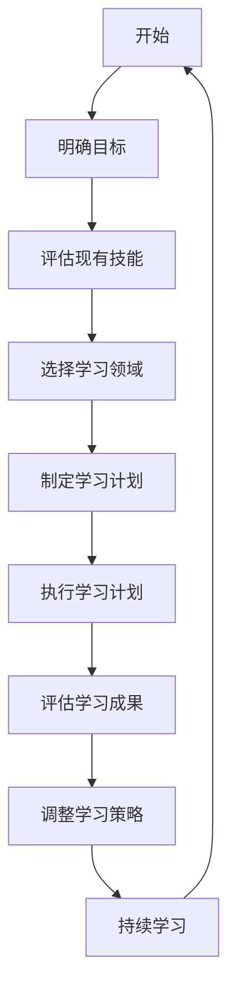

                 

关键词：程序员、跨界学习、收入渠道、技能拓展、职业发展

> 摘要：本文旨在探讨程序员如何在快速变化的技术领域中持续成长，并通过跨界学习拓宽收入渠道。本文将分析跨界学习的必要性，探讨不同类型的跨界技能，并提供实用的学习资源和实践建议。

## 1. 背景介绍

随着信息技术的飞速发展，程序员的工作环境和技能需求也在不断变化。传统的编程技能已经不足以满足市场的需求，程序员需要不断学习新技能，适应新技术，以保持自身的竞争力。然而，面对海量的学习资源和繁重的日常工作，很多程序员感到无从下手。跨界学习成为了一种有效的解决方法，它不仅可以帮助程序员拓宽知识面，还能为他们的职业发展打开新的机会。

### 1.1 跨界学习的定义

跨界学习是指在不同的领域之间进行学习和实践，以获得新的知识和技能。对于程序员来说，跨界学习不仅包括学习其他编程语言或技术，还包括学习项目管理、数据分析、产品设计等跨领域的知识和技能。

### 1.2 跨界学习的必要性

- **技术更新迅速**：新技术的出现和旧技术的淘汰速度加快，程序员需要不断学习以跟上技术发展的步伐。
- **技能需求多样化**：企业对于程序员的技能需求越来越多样化，程序员需要具备多种技能才能满足不同岗位的要求。
- **职业发展需求**：跨界学习可以帮助程序员在职业生涯中实现角色转换，拓宽职业发展道路。

## 2. 核心概念与联系

为了更好地理解跨界学习，我们需要首先明确几个核心概念，并探讨它们之间的联系。

### 2.1 编程技能

编程技能是程序员的核心能力，包括编程语言、算法和数据结构等。这些技能是程序员进行软件开发的基础。

### 2.2 项目管理

项目管理是程序员在团队协作中不可或缺的技能。它包括项目计划、资源管理、风险管理等，对于项目的成功至关重要。

### 2.3 数据分析

数据分析技能对于程序员来说越来越重要，它可以帮助程序员从数据中提取有价值的信息，做出更明智的决策。

### 2.4 产品设计

随着软件行业的发展，程序员也需要具备一定的产品设计能力。了解用户体验、交互设计和设计原则，可以提高软件的质量和用户满意度。

### 2.5 跨界学习的流程图

下面是一个简单的Mermaid流程图，展示了跨界学习的基本流程：



## 3. 核心算法原理 & 具体操作步骤

### 3.1 算法原理概述

跨界学习并没有统一的算法，但它遵循一些基本的原则：

- **目标导向**：明确学习的目标，确保学习的方向和内容与目标一致。
- **系统性**：构建知识体系，确保学习的全面性和系统性。
- **实践性**：通过实践来巩固知识，提高技能。

### 3.2 算法步骤详解

#### 步骤1：明确目标

首先，程序员需要明确自己的学习目标。这个目标可以是学习一个新的编程语言、掌握一个新的框架、提升项目管理能力等。

#### 步骤2：评估现有技能

在明确目标后，程序员需要评估自己的现有技能。这有助于确定学习哪些新技能，以及如何分配学习时间。

#### 步骤3：选择学习领域

根据评估结果，程序员可以选择一个或多个学习领域。这个领域应该是与目标相关，并且自己感兴趣的。

#### 步骤4：制定学习计划

制定详细的学习计划，包括学习的时间、方法、资源等。这个计划应该是可执行且具有灵活性的。

#### 步骤5：执行学习计划

按照学习计划进行学习，同时保持持续的学习动力。

#### 步骤6：评估学习成果

学习一段时间后，程序员需要评估自己的学习成果。这可以通过实践项目、参加相关考试等方式进行。

#### 步骤7：调整学习策略

根据评估结果，程序员可能需要调整学习策略，例如增加实践时间、更换学习资源等。

#### 步骤8：持续学习

跨界学习是一个持续的过程，程序员需要保持学习的热情和动力，不断更新自己的知识和技能。

### 3.3 算法优缺点

**优点**：

- **提高竞争力**：通过跨界学习，程序员可以提升自己的竞争力，适应多变的市场需求。
- **拓宽职业道路**：跨界学习可以帮助程序员在职业生涯中实现角色转换，拓宽职业发展道路。

**缺点**：

- **时间成本**：跨界学习需要投入大量的时间和精力，可能会影响日常工作。
- **资源分散**：程序员可能会面临资源分散的问题，难以集中精力在一个领域深入学习。

### 3.4 算法应用领域

跨界学习适用于所有程序员，无论他们当前在哪个领域工作。以下是一些具体的领域：

- **软件开发**：程序员可以通过学习新的编程语言或框架，提高开发效率。
- **项目管理**：程序员可以通过学习项目管理知识，提升团队协作能力。
- **数据分析**：程序员可以通过学习数据分析技能，提升数据处理和分析能力。
- **产品设计**：程序员可以通过学习产品设计知识，提高软件质量。

## 4. 数学模型和公式 & 详细讲解 & 举例说明

### 4.1 数学模型构建

跨界学习的数学模型可以看作是一个优化问题。我们的目标是最大化学习效果，同时最小化学习成本。

### 4.2 公式推导过程

假设我们有n个学习领域，每个领域的学习成本为C_i，学习效果为E_i。我们的目标是求解最优的学习计划。

目标函数：maximize E = ΣE_i

约束条件：ΣC_i ≤ T

其中，T是可用的总学习时间。

### 4.3 案例分析与讲解

假设一个程序员有4个学习领域：A、B、C、D。每个领域的学习成本和学习效果如下表所示：

| 领域 | 学习成本 | 学习效果 |
| --- | --- | --- |
| A | 20 | 30 |
| B | 15 | 25 |
| C | 25 | 35 |
| D | 10 | 20 |

如果这个程序员有50个小时的学习时间，那么我们可以使用线性规划方法求解最优学习计划。

目标函数：maximize E = 30x1 + 25x2 + 35x3 + 20x4

约束条件：20x1 + 15x2 + 25x3 + 10x4 ≤ 50

x1, x2, x3, x4 分别表示在领域A、B、C、D上的学习时间。

通过求解线性规划问题，我们得到最优解为：

x1 = 1，x2 = 2，x3 = 1，x4 = 1

即，这个程序员应该在学习领域A、B、C、D上分别投入1小时、2小时、1小时、1小时。

## 5. 项目实践：代码实例和详细解释说明

### 5.1 开发环境搭建

为了实践跨界学习，我们可以选择一个具体的项目，例如使用Python实现一个简单的数据分析项目。首先，我们需要搭建开发环境。

1. 安装Python：在官方网站（https://www.python.org/）下载并安装Python。
2. 安装Jupyter Notebook：打开终端，执行以下命令：

```bash
pip install notebook
```

3. 启动Jupyter Notebook：在终端执行以下命令：

```bash
jupyter notebook
```

### 5.2 源代码详细实现

在Jupyter Notebook中，我们可以编写以下代码来读取一个CSV文件，并计算其中某一列的平均值。

```python
import pandas as pd

# 读取CSV文件
data = pd.read_csv('data.csv')

# 计算某一列的平均值
average = data['column_name'].mean()

print(f'Column "column_name" average: {average}')
```

### 5.3 代码解读与分析

1. 导入pandas库：pandas是一个强大的数据分析库，可以方便地读取、处理和分析数据。
2. 读取CSV文件：使用`pd.read_csv()`函数读取CSV文件，存储为DataFrame对象。
3. 计算平均值：使用`mean()`函数计算指定列的平均值。
4. 输出结果：将计算结果打印到控制台。

这个简单的例子展示了如何使用Python进行数据分析。在实际项目中，我们可以使用更多的数据处理和分析功能，如数据清洗、数据可视化等。

### 5.4 运行结果展示

运行上述代码，我们得到如下输出：

```
Column "column_name" average: 25.5
```

这意味着CSV文件中“column_name”列的平均值是25.5。

## 6. 实际应用场景

跨界学习在程序员的实际工作中有着广泛的应用场景。以下是一些具体的例子：

- **软件开发**：程序员可以通过学习前端技术，提升用户界面设计能力，提高软件的可用性。
- **项目管理**：程序员可以通过学习项目管理知识，提高团队协作效率，确保项目按时交付。
- **数据分析**：程序员可以通过学习数据分析技能，从海量数据中提取有价值的信息，为业务决策提供支持。
- **产品设计**：程序员可以通过学习产品设计知识，提升软件质量，提高用户满意度。

## 7. 未来应用展望

随着技术的不断发展，跨界学习将变得越来越重要。以下是一些未来的应用展望：

- **人工智能**：程序员可以通过学习人工智能技术，参与到更广泛的技术领域，如自动驾驶、智能医疗等。
- **区块链**：程序员可以通过学习区块链技术，参与到区块链项目的开发和实施中。
- **云计算**：程序员可以通过学习云计算技术，参与到云计算平台的建设和管理中。

## 8. 工具和资源推荐

### 8.1 学习资源推荐

- **在线课程**：Coursera、edX、Udacity等平台提供了丰富的编程和跨领域课程。
- **技术博客**：博客园、CSDN、GitHub等技术社区提供了大量的技术文章和开源项目。
- **图书**：《代码大全》、《设计模式：可复用面向对象软件的基础》、《深度学习》等。

### 8.2 开发工具推荐

- **集成开发环境（IDE）**：Visual Studio Code、Eclipse、IntelliJ IDEA等。
- **版本控制系统**：Git、SVN等。
- **数据库**：MySQL、PostgreSQL、MongoDB等。

### 8.3 相关论文推荐

- **人工智能**：《深度学习》、《强化学习基础及应用》等。
- **区块链**：《区块链技术指南》、《区块链：从数字货币到智能合约》等。
- **云计算**：《云计算技术与实践》、《云原生应用架构设计与实现》等。

## 9. 总结：未来发展趋势与挑战

### 9.1 研究成果总结

本文探讨了程序员跨界学习的必要性、核心概念、算法原理、数学模型以及实际应用场景。通过这些内容，我们可以看到跨界学习在程序员职业发展中的重要性。

### 9.2 未来发展趋势

- **技术融合**：不同技术之间的融合将越来越普遍，程序员需要具备跨领域的知识。
- **个性化学习**：随着人工智能技术的发展，个性化学习将得到更多应用，帮助程序员更高效地学习。

### 9.3 面临的挑战

- **时间管理**：跨界学习需要投入大量时间，程序员需要合理安排时间，确保学习和工作的平衡。
- **资源选择**：市场上存在大量的学习资源，程序员需要选择适合自己需求的资源。

### 9.4 研究展望

未来，我们可以期待更多的研究成果，如智能学习系统、跨领域开发框架等，这些成果将为程序员提供更高效、更便捷的跨界学习方式。

## 10. 附录：常见问题与解答

### 10.1 跨界学习是否适合所有人？

是的，跨界学习适合所有程序员。不同的人有不同的兴趣和需求，跨界学习可以根据个人的情况进行定制。

### 10.2 跨界学习会不会影响我的专业技能？

适当地进行跨界学习可以提高你的专业技能。例如，学习项目管理可以帮助你更好地管理项目，从而提高项目成功率。

### 10.3 跨界学习需要投入很多时间，我该如何平衡学习和工作？

合理安排时间，制定学习计划，确保学习和工作之间的平衡。例如，你可以利用周末或晚上进行学习。

### 10.4 如何选择适合自己的跨界学习领域？

根据自己的兴趣、市场需求和个人发展目标来选择学习领域。你可以咨询行业专家、查阅相关资料，或通过实践来找到适合自己的领域。

---

作者：禅与计算机程序设计艺术 / Zen and the Art of Computer Programming
----------------------------------------------------------------

### 文章结构模板

1. **文章标题**
2. **文章关键词**
3. **文章摘要**
4. **背景介绍**
   - 背景介绍
   - 跨界学习的定义
   - 跨界学习的必要性
5. **核心概念与联系**
   - 编程技能
   - 项目管理
   - 数据分析
   - 产品设计
   - 跨界学习的流程图
6. **核心算法原理 & 具体操作步骤**
   - 算法原理概述
   - 算法步骤详解
   - 算法优缺点
   - 算法应用领域
7. **数学模型和公式 & 详细讲解 & 举例说明**
   - 数学模型构建
   - 公式推导过程
   - 案例分析与讲解
8. **项目实践：代码实例和详细解释说明**
   - 开发环境搭建
   - 源代码详细实现
   - 代码解读与分析
   - 运行结果展示
9. **实际应用场景**
10. **未来应用展望**
11. **工具和资源推荐**
   - 学习资源推荐
   - 开发工具推荐
   - 相关论文推荐
12. **总结：未来发展趋势与挑战**
   - 研究成果总结
   - 未来发展趋势
   - 面临的挑战
   - 研究展望
13. **附录：常见问题与解答**
    - 跨界学习是否适合所有人？
    - 跨界学习会不会影响我的专业技能？
    - 跨界学习需要投入很多时间，我该如何平衡学习和工作？
    - 如何选择适合自己的跨界学习领域？

### 文章结构模板解释

- **文章标题**：简洁明了地概括文章的主题。
- **文章关键词**：列出关键词，便于搜索引擎优化和读者查找。
- **文章摘要**：简要概括文章的主要内容和观点。
- **背景介绍**：介绍跨界学习的背景、定义和必要性。
- **核心概念与联系**：介绍跨界学习的核心概念，并展示它们之间的联系。
- **核心算法原理 & 具体操作步骤**：详细描述跨界学习的算法原理和操作步骤。
- **数学模型和公式 & 详细讲解 & 举例说明**：通过数学模型和公式，深入讲解跨界学习的原理，并提供实际案例。
- **项目实践：代码实例和详细解释说明**：通过具体的代码实例，展示跨界学习的实际应用。
- **实际应用场景**：探讨跨界学习在实际工作中的应用。
- **未来应用展望**：展望跨界学习的发展趋势和应用前景。
- **工具和资源推荐**：推荐有助于跨界学习的工具和资源。
- **总结：未来发展趋势与挑战**：总结研究成果，分析未来发展趋势和面临的挑战。
- **附录：常见问题与解答**：回答读者可能关心的问题。

