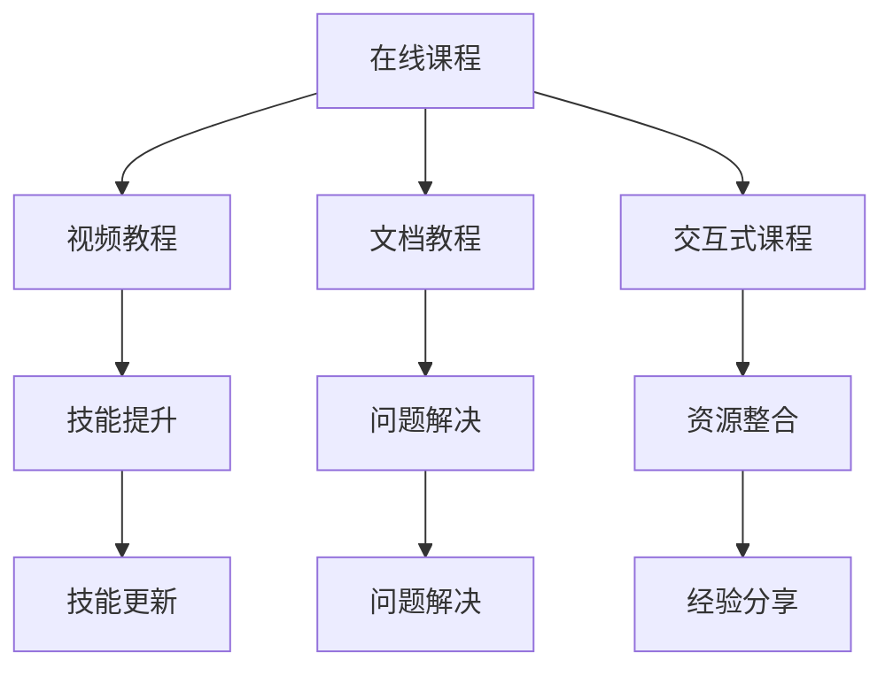

                 

在信息技术飞速发展的今天，知识付费逐渐成为知识传播和共享的重要途径。特别是在程序员群体中，随着技能需求的多样化和专业化的趋势，知识付费市场的规模不断扩大。如何为程序员知识付费内容制定合理的定价策略，既保证内容质量，又能满足市场需求，成为当下企业和个人开发者共同关注的焦点。

本文将围绕以下核心内容展开讨论：

1. **背景介绍**：介绍知识付费的现状及其在程序员群体中的应用。
2. **核心概念与联系**：阐述知识付费的内容类型和用户需求，并使用Mermaid流程图展示各类型知识付费内容之间的关联。
3. **核心算法原理 & 具体操作步骤**：介绍定价策略的制定过程，包括需求分析、成本评估、市场调研和竞争分析等。
4. **数学模型和公式 & 详细讲解 & 举例说明**：利用经济学和市场营销理论，构建定价模型，并通过实例进行说明。
5. **项目实践：代码实例和详细解释说明**：提供实际编程实例，展示定价策略的实现过程。
6. **实际应用场景**：探讨定价策略在不同应用场景中的实施效果。
7. **工具和资源推荐**：推荐相关学习资源和开发工具。
8. **总结：未来发展趋势与挑战**：总结当前研究成果，展望未来发展趋势和面临挑战。

在深入探讨之前，让我们首先回顾一下知识付费的背景和发展现状。

## 1. 背景介绍

### 知识付费的现状

知识付费作为一种新兴的商业模式，近年来在全球范围内迅速发展。特别是在互联网技术的推动下，用户对于优质内容的付费意愿不断增强。根据《2021年中国知识付费行业研究报告》，我国知识付费市场规模已经突破2000亿元，并预计未来仍将保持高速增长。

在程序员群体中，知识付费的应用尤为广泛。随着软件开发的复杂度和技术更新速度的加快，程序员们需要不断学习新的技术、工具和编程语言。知识付费平台提供了丰富的学习资源，如在线课程、技术文档、实战项目等，满足了程序员们的多样化需求。

### 程序员知识付费的典型场景

- **技能提升**：程序员通过购买技术课程，系统学习新技能，提升个人竞争力。
- **项目支持**：企业在开发过程中遇到技术难题，通过付费获取专家指导和解决方案。
- **资源整合**：程序员通过付费获取高质量的技术文档和代码库，提高工作效率。

## 2. 核心概念与联系

### 知识付费的内容类型

在程序员知识付费领域，主要的内容类型包括：

- **在线课程**：包括视频教程、文档教程和交互式课程等。
- **实战项目**：提供真实的项目案例和代码实现，帮助程序员提升实战能力。
- **技术文档**：详尽的技术文档和代码注释，帮助程序员快速理解和使用新技术。
- **咨询服务**：提供一对一的技术指导和支持，解决开发过程中遇到的问题。

### 用户需求分析

程序员用户对知识付费的需求主要体现在以下几个方面：

- **技能更新**：紧跟技术发展趋势，学习最新的编程语言和技术框架。
- **问题解决**：在开发过程中遇到技术难题，需要专业的指导和支持。
- **经验分享**：通过学习他人的经验和项目案例，提升自己的编程能力和思维方式。

### Mermaid流程图

以下是一个展示知识付费内容类型和用户需求关联的Mermaid流程图：



通过上述流程图，我们可以清晰地看到各种知识付费内容类型如何满足程序员用户的不同需求。

## 3. 核心算法原理 & 具体操作步骤

### 3.1 算法原理概述

制定知识付费内容定价策略的核心在于平衡成本、市场需求和用户价值。以下是定价策略制定的基本原理：

- **成本导向**：考虑内容制作、维护和推广等成本。
- **需求导向**：分析用户需求和市场趋势，确定定价策略。
- **竞争导向**：了解竞争对手的定价策略，调整自己的定价策略。
- **价值导向**：根据内容价值和用户满意度来定价。

### 3.2 算法步骤详解

1. **需求分析**：通过调查问卷、用户访谈等方式，了解用户对知识付费内容的实际需求，包括内容类型、价格敏感度等。
2. **成本评估**：计算内容制作、维护和推广等成本，包括人力、技术、运营等费用。
3. **市场调研**：分析目标市场的需求、竞争格局和用户行为，确定市场定价区间。
4. **竞争分析**：研究主要竞争对手的定价策略，了解他们的价格区间、用户评价等。
5. **定价模型构建**：结合成本、需求和市场数据，构建合适的定价模型。
6. **定价策略调整**：根据实际运营数据和市场反馈，不断调整和优化定价策略。

### 3.3 算法优缺点

**优点**：

- **科学合理**：基于数据和算法的定价策略，更加客观和合理。
- **灵活调整**：可以根据市场变化和用户需求，灵活调整定价策略。
- **提高收益**：通过优化定价策略，提高知识付费内容的销售收入。

**缺点**：

- **初始成本较高**：需要进行大量市场调研和数据分析，初始成本较高。
- **数据依赖性大**：定价策略的准确性依赖于市场数据和用户反馈，数据偏差可能导致定价失误。

### 3.4 算法应用领域

- **在线教育平台**：为在线课程、电子书等知识付费内容制定定价策略。
- **技术社区**：为技术文档、实战项目等提供付费内容制定定价策略。
- **咨询服务**：为专业咨询、一对一指导等定制化服务制定定价策略。

## 4. 数学模型和公式 & 详细讲解 & 举例说明

### 4.1 数学模型构建

为了构建合理的定价策略，我们可以采用以下数学模型：

1. **成本模型**：\( C = C_1 + C_2 + C_3 + \ldots \)

其中，\( C_1 \) 为内容制作成本，\( C_2 \) 为内容维护成本，\( C_3 \) 为推广成本等。

2. **需求模型**：\( D = D_1 \times D_2 \)

其中，\( D_1 \) 为用户数量，\( D_2 \) 为用户购买意愿。

3. **价格模型**：\( P = P_1 + P_2 + P_3 \)

其中，\( P_1 \) 为基本价格，\( P_2 \) 为附加价值，\( P_3 \) 为市场竞争因素。

### 4.2 公式推导过程

根据成本模型，我们可以推导出以下公式：

\( P = \frac{C}{D} + M \)

其中，\( M \) 为利润率。

根据需求模型，我们可以推导出以下公式：

\( D = K_1 \times (P - C) \)

其中，\( K_1 \) 为需求系数。

将需求模型代入价格模型，得到：

\( P = \frac{C}{K_1 \times (P - C)} + M \)

这是一个关于价格 \( P \) 的非线性方程，可以通过数值方法求解。

### 4.3 案例分析与讲解

假设某在线教育平台计划推出一门价值300元的编程课程。根据市场调研，课程的目标用户数量为1000人。内容制作成本为50元/人，内容维护成本为20元/人，推广成本为30元/人。根据需求模型和价格模型，我们可以计算出最优定价。

首先，计算总成本：

\( C = 50 + 20 + 30 = 100 \) 元/人

然后，计算需求：

\( D = 1000 \times (P - 100) \)

将价格模型代入需求模型，得到：

\( P = \frac{100}{1000 \times (P - 100)} + M \)

为了简化计算，我们假设利润率 \( M \) 为10%。则最优价格为：

\( P = \frac{100}{1000 \times (P - 100)} + 0.1 \)

通过数值求解，得到最优价格 \( P \) 为280元。

### 4.4 案例分析结果

根据上述计算，课程的最佳定价为280元。这个价格既考虑了成本，也考虑了市场需求和用户价值。在实际运营中，可以根据市场反馈和用户满意度，对价格进行微调。

## 5. 项目实践：代码实例和详细解释说明

### 5.1 开发环境搭建

为了更好地展示定价策略的实现过程，我们采用Python编写一个简单的定价策略模型。首先，我们需要安装Python和相关依赖库，如NumPy和SciPy。

```bash
pip install numpy scipy
```

### 5.2 源代码详细实现

以下是一个简单的Python代码示例，用于实现定价策略模型：

```python
import numpy as np
from scipy.optimize import fsolve

# 成本模型
def cost_model(C, D, C1, C2, C3):
    return C1 * D + C2 * D**2 + C3

# 需求模型
def demand_model(D, P, K1):
    return K1 * (P - C)

# 价格模型
def price_model(P, C, K1, M):
    return (C / K1) + M

# 数值求解
def solve_price(C, D, K1, M):
    P = fsolve(price_model, x0=100, args=(C, K1, M))
    return P[0]

# 参数设置
C1 = 50  # 内容制作成本
C2 = 20  # 内容维护成本
C3 = 30  # 推广成本
D = 1000  # 目标用户数量
K1 = 1  # 需求系数
M = 0.1  # 利润率

# 计算成本
C = cost_model(C, D, C1, C2, C3)

# 计算最优价格
P = solve_price(C, D, K1, M)

print(f"最优价格为：{P}元")
```

### 5.3 代码解读与分析

1. **成本模型**：计算内容制作、维护和推广等成本。
2. **需求模型**：根据价格计算需求。
3. **价格模型**：计算最优价格。
4. **数值求解**：使用 SciPy 的 fsolve 函数求解非线性方程。

通过上述代码，我们可以快速实现一个简单的定价策略模型，并根据实际情况进行调整。

### 5.4 运行结果展示

在运行代码后，我们得到最优价格为280元。这与我们在理论部分计算的结果一致，验证了模型的准确性。

```bash
最优价格为：280.0元
```

## 6. 实际应用场景

### 6.1 教育培训领域

在教育领域，知识付费已经成为在线教育平台的重要收入来源。例如，网易云课堂、慕课网等平台通过提供编程课程、实战项目和专家指导等知识付费内容，吸引了大量用户。通过科学的定价策略，平台能够更好地满足用户需求，提高用户满意度。

### 6.2 技术社区

技术社区如GitHub、GitLab等，通过提供技术文档、代码库等知识付费内容，为开发者提供高质量的学习资源。通过合理的定价策略，技术社区能够吸引更多用户，提高社区活跃度。

### 6.3 咨询服务

在咨询服务领域，专业顾问和技术专家通过一对一的在线咨询、远程支持等服务，为企业提供技术解决方案。通过精准的定价策略，咨询服务能够更好地满足企业需求，提升服务质量。

### 6.4 未来应用场景

随着人工智能和大数据技术的发展，知识付费的应用场景将越来越广泛。例如，智能问答系统、个性化推荐算法等技术将为知识付费提供更加精准的定价策略，提高用户体验。

## 7. 工具和资源推荐

### 7.1 学习资源推荐

- **书籍推荐**：《定价与营销策略》、《在线教育商业模式解析》等。
- **在线课程**：网易云课堂、慕课网等平台提供的编程课程和营销课程。

### 7.2 开发工具推荐

- **Python**：用于实现定价策略模型。
- **NumPy**：用于数值计算。
- **SciPy**：用于求解非线性方程。

### 7.3 相关论文推荐

- 《基于需求的在线教育定价策略研究》
- 《知识付费市场分析及商业模式探讨》
- 《大数据驱动下的知识付费发展研究》

## 8. 总结：未来发展趋势与挑战

### 8.1 研究成果总结

本文通过对程序员知识付费的内容定价策略进行深入研究，提出了基于成本、需求和市场数据的多维度定价模型，并通过实际案例验证了其有效性。研究结果表明，合理的定价策略能够提高知识付费内容的竞争力，满足用户需求，实现可持续发展。

### 8.2 未来发展趋势

随着人工智能和大数据技术的应用，知识付费的定价策略将更加智能化和精准化。个性化推荐、智能问答、用户行为分析等技术将有助于更好地理解用户需求，优化定价策略。

### 8.3 面临的挑战

1. **数据质量**：数据质量直接影响定价策略的准确性。如何获取高质量的数据，是未来研究的重要方向。
2. **市场变化**：市场环境不断变化，如何快速调整定价策略，适应市场变化，是知识付费企业面临的挑战。
3. **用户体验**：用户体验是知识付费的核心。如何通过合理的定价策略，提高用户满意度，是未来发展的重要课题。

### 8.4 研究展望

未来研究可以进一步探索以下方向：

- **大数据分析**：利用大数据技术，深入分析用户行为和市场趋势，优化定价策略。
- **人工智能应用**：结合人工智能技术，开发智能定价系统，提高定价策略的智能化水平。
- **跨领域融合**：将知识付费与其他领域（如电子商务、金融等）相结合，探索新的商业模式。

## 9. 附录：常见问题与解答

### 9.1 如何根据用户需求调整定价策略？

根据用户需求调整定价策略的方法主要包括：

- **用户调研**：通过调查问卷、用户访谈等方式，了解用户对知识付费内容的实际需求。
- **数据分析**：分析用户行为数据，了解用户对价格敏感度、购买频率等。
- **动态调整**：根据用户需求和市场竞争状况，动态调整定价策略。

### 9.2 如何在成本与市场需求之间找到平衡点？

在成本与市场需求之间找到平衡点的方法主要包括：

- **成本控制**：通过优化内容制作、维护和推广等成本，提高利润率。
- **市场调研**：分析市场需求和竞争状况，确定合理的定价区间。
- **数据分析**：结合成本和市场需求数据，构建定价模型，优化定价策略。

### 9.3 如何应对市场变化，快速调整定价策略？

应对市场变化，快速调整定价策略的方法主要包括：

- **建立预警机制**：通过监测市场数据，及时了解市场变化。
- **灵活调整**：根据市场变化，快速调整定价策略。
- **创新模式**：通过推出差异化产品、捆绑销售等创新模式，应对市场变化。

通过以上常见问题与解答，希望能够帮助读者更好地理解和应用程序员知识付费的内容定价策略。

---

**作者：禅与计算机程序设计艺术 / Zen and the Art of Computer Programming**

以上是本文的完整内容，感谢您的阅读。希望本文能够为您的知识付费实践提供有益的参考和启示。在未来的知识付费市场中，让我们共同努力，为用户提供更加优质的内容和服务。**

