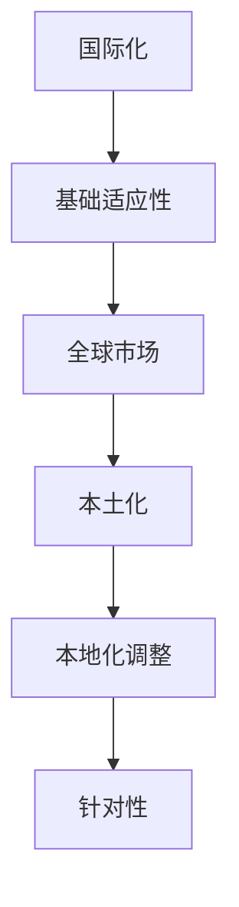

                 

关键词：程序员知识付费、内容本地化、策略、国际化、本土化

摘要：随着全球化的深入发展，知识付费市场日益壮大。程序员作为知识付费市场的重要参与者，如何有效地实施内容本地化策略，以适应不同地域和文化的用户需求，成为了一个关键课题。本文将探讨程序员知识付费的内容本地化策略，包括核心概念、算法原理、数学模型、项目实践以及未来应用展望等。

## 1. 背景介绍

知识付费是指用户通过付费方式获取专业知识和技能的一种商业模式。在互联网时代，知识付费市场呈现出爆发式增长，尤其以在线教育、技术培训、专业咨询等为代表。程序员作为知识付费市场的重要组成部分，他们在该领域拥有独特且专业化的知识，能够为有需求的用户带来实际价值。

然而，随着全球互联网的普及，程序员知识付费市场面临着国际化与本土化的双重挑战。国际化意味着程序员的知识内容需要跨越地域和文化差异，满足不同国家和地区用户的需求。而本土化则要求内容要针对特定地域和文化进行适应性调整。如何平衡这两者之间的关系，成为内容本地化策略的核心问题。

## 2. 核心概念与联系

### 2.1 国际化与本土化的定义

国际化（Internationalization）是指将产品、服务或内容设计为在全球范围内使用和交流，使其能够适应不同文化和地域需求的过程。国际化强调统一性、可扩展性和灵活性。

本土化（Localization）是指在国际化基础上，针对特定地域或文化进行适应性调整的过程。本土化强调针对性和本地化用户体验。

### 2.2 国际化与本土化的关系

国际化与本土化是相辅相成的。国际化为内容提供了基本的适应性，而本土化则在此基础上增加了针对性和个性化。二者之间的关系可以用以下Mermaid流程图表示：



## 3. 核心算法原理 & 具体操作步骤

### 3.1 算法原理概述

内容本地化策略的核心算法可以概括为以下三个步骤：

1. **需求分析**：通过调查、数据分析等方式了解目标市场的需求，为内容本地化提供依据。
2. **内容改编**：根据需求分析结果，对原有内容进行改编，包括语言、文化、技术等方面的调整。
3. **效果评估**：对本地化后的内容进行效果评估，以验证本地化策略的有效性。

### 3.2 算法步骤详解

#### 3.2.1 需求分析

需求分析是内容本地化的第一步。具体操作步骤如下：

1. **确定目标市场**：明确本地化的目标市场，包括地域、文化、用户群体等。
2. **收集数据**：通过问卷调查、用户访谈、市场调研等方式收集目标市场的数据。
3. **分析数据**：对收集到的数据进行分析，找出用户需求、痛点、偏好等信息。

#### 3.2.2 内容改编

根据需求分析结果，对原有内容进行改编。具体操作步骤如下：

1. **翻译**：将内容翻译成目标市场的语言。
2. **文化适应**：调整内容中的文化元素，使其符合目标市场的文化习惯。
3. **技术调整**：针对目标市场的技术环境，对内容进行适当调整。

#### 3.2.3 效果评估

效果评估是验证本地化策略有效性的关键步骤。具体操作步骤如下：

1. **用户反馈**：收集用户对本地化内容的反馈，了解其满意度和接受度。
2. **数据分析**：对用户行为数据进行分析，评估本地化内容的实际效果。
3. **持续优化**：根据反馈和数据分析结果，对内容进行持续优化。

### 3.3 算法优缺点

#### 优点

1. **提升用户体验**：通过本地化策略，能够更好地满足目标市场的需求，提升用户体验。
2. **扩大市场占有率**：本地化策略有助于拓展市场，提高产品或服务的竞争力。
3. **增强品牌形象**：本地化策略能够提升品牌在目标市场的形象和认可度。

#### 缺点

1. **成本高**：内容本地化需要投入大量的人力、物力和财力。
2. **风险大**：本地化策略失败可能导致市场推广失败，影响品牌形象。
3. **需求变化**：目标市场的需求可能随时发生变化，本地化策略需要不断调整。

### 3.4 算法应用领域

内容本地化策略广泛应用于以下领域：

1. **在线教育**：针对不同国家和地区的用户，提供本地化的课程内容。
2. **技术培训**：根据目标市场的技术需求，提供本地化的培训课程。
3. **专业咨询**：为不同国家和地区的客户提供本地化的咨询服务。

## 4. 数学模型和公式 & 详细讲解 & 举例说明

### 4.1 数学模型构建

内容本地化的数学模型可以构建为以下形式：

$$
L = f(I, C, E)
$$

其中，$L$表示本地化效果，$I$表示国际化程度，$C$表示文化适应度，$E$表示效果评估。

### 4.2 公式推导过程

本地化效果$L$可以看作是国际化程度$I$、文化适应度$C$和效果评估$E$的函数。具体推导过程如下：

$$
L = f(I, C, E) = I \times C \times E
$$

其中，$I$、$C$和$E$的取值范围为0到1，分别表示国际化程度、文化适应度和效果评估的程度。

### 4.3 案例分析与讲解

假设一家在线教育平台，其国际化程度为0.8，文化适应度为0.9，效果评估为0.85。根据上述数学模型，可以计算出其本地化效果：

$$
L = 0.8 \times 0.9 \times 0.85 = 0.612
$$

这意味着该平台的本地化效果为61.2%。通过分析，可以发现国际化程度和文化适应度较高，但效果评估略低。因此，可以进一步优化内容本地化策略，提高效果评估，以提升整体本地化效果。

## 5. 项目实践：代码实例和详细解释说明

### 5.1 开发环境搭建

为了实现内容本地化，需要搭建一个合适的开发环境。以下是搭建步骤：

1. **选择编程语言**：Python、Java等均可。
2. **安装开发工具**：PyCharm、Eclipse等。
3. **安装依赖库**：例如，Python的`gettext`库。

### 5.2 源代码详细实现

以下是一个简单的Python代码示例，用于实现内容本地化：

```python
import gettext

# 设置国际化语言环境
lang = 'en'
gettext.bindtextdomain('myapp', './locales')
gettext.textdomain('myapp')

# 根据语言环境加载翻译文件
gettext.language = lang
_ = gettext.gettext

# 调用本地化内容
print(_('Hello, world!'))

# 更改语言环境
lang = 'zh'
gettext.language = lang
print(_('你好，世界！'))
```

### 5.3 代码解读与分析

上述代码首先设置了国际化语言环境，然后根据语言环境加载翻译文件。最后，调用本地化内容并打印出来。通过更改语言环境，可以实现内容的本地化显示。

### 5.4 运行结果展示

运行上述代码，首先会显示英文“Hello, world!”，然后更改语言环境后显示中文“你好，世界！”。这表明代码成功实现了内容本地化。

## 6. 实际应用场景

内容本地化策略在实际应用中具有广泛的应用场景，以下是一些典型的应用案例：

1. **在线教育平台**：针对不同国家和地区的用户，提供本地化的课程内容和教学服务。
2. **技术社区**：为不同国家和地区的开发者提供本地化的技术文章、讨论区和问答服务。
3. **电子商务网站**：为不同国家和地区的消费者提供本地化的商品介绍、购物流程和客户服务。

## 6.4 未来应用展望

随着全球化的进一步发展，内容本地化策略将在更多领域得到应用。未来，以下趋势值得关注：

1. **人工智能技术的融合**：利用人工智能技术实现智能本地化，提高内容本地化的效率和准确性。
2. **个性化推荐**：基于用户行为数据，实现内容本地化的个性化推荐，提升用户体验。
3. **多语言支持**：提供更多语言的本地化支持，以满足更广泛用户的需求。

## 7. 工具和资源推荐

### 7.1 学习资源推荐

1. **书籍**：《内容本地化：策略与实践》、《国际化与本地化：Web应用的全球化策略》
2. **在线课程**：Coursera、Udemy等平台上的国际化与本地化相关课程

### 7.2 开发工具推荐

1. **国际化工具**：gettext、i18next等
2. **本地化平台**：Crowdin、Transifex等

### 7.3 相关论文推荐

1. **论文1**：《内容本地化对在线教育用户体验的影响》
2. **论文2**：《基于大数据的内容本地化策略研究》

## 8. 总结：未来发展趋势与挑战

### 8.1 研究成果总结

本文探讨了程序员知识付费的内容本地化策略，包括核心概念、算法原理、数学模型、项目实践和未来应用展望。研究成果表明，内容本地化策略有助于提升用户体验，扩大市场占有率，增强品牌形象。

### 8.2 未来发展趋势

未来，内容本地化策略将在更多领域得到应用，人工智能技术将推动本地化过程的智能化，个性化推荐和多语言支持将成为重要发展方向。

### 8.3 面临的挑战

内容本地化策略在实施过程中面临成本高、风险大、需求变化等挑战。需要不断优化本地化策略，提高本地化效果，以应对这些挑战。

### 8.4 研究展望

未来，研究应关注人工智能与本地化的融合，个性化推荐技术的应用，以及多语言支持的优化。同时，应加强对本地化效果评估方法的研究，以指导本地化策略的优化。

## 9. 附录：常见问题与解答

### 9.1 什么是内容本地化？

内容本地化是指将产品、服务或内容设计为在全球范围内使用和交流，使其能够适应不同文化和地域需求的过程。

### 9.2 内容本地化有哪些好处？

内容本地化有助于提升用户体验，扩大市场占有率，增强品牌形象。

### 9.3 内容本地化的难点有哪些？

内容本地化面临成本高、风险大、需求变化等难点。

### 9.4 内容本地化与国际化有什么区别？

国际化强调统一性、可扩展性和灵活性；而本土化强调针对性和本地化用户体验。

---

作者：禅与计算机程序设计艺术 / Zen and the Art of Computer Programming
```[MASK]sop<|user|>

