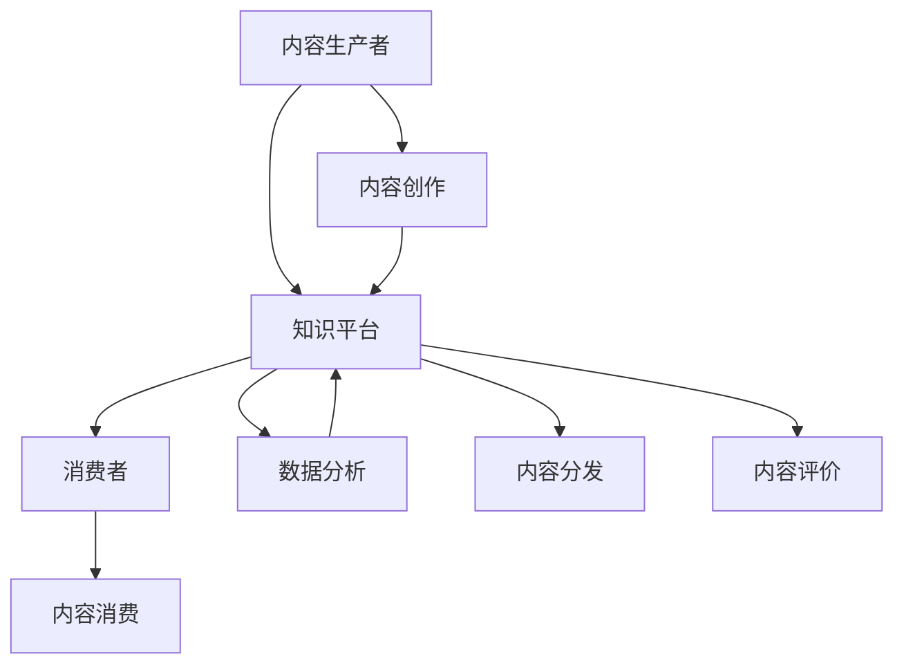

                 

### 关键词 Keywords
- 程序员
- 知识付费
- 内容矩阵
- 教育科技
- 个性化学习
- 数据分析

<|assistant|>### 摘要 Summary
本文将探讨程序员知识付费领域的内容矩阵构建，包括其核心概念、构建方法、算法原理、数学模型以及实际应用案例。通过详细分析，本文旨在为教育科技从业者和程序员提供一套系统的、可操作的内容构建策略，助力他们在知识付费市场中脱颖而出。

## 1. 背景介绍

### 1.1 程序员知识付费市场现状

随着互联网技术的飞速发展，知识付费已经成为一个蓬勃发展的市场。尤其是在程序员这一领域，技术的快速迭代和专业化需求促使越来越多的程序员转向知识付费模式。他们通过在线课程、技术博客、电子书等形式分享自己的经验和知识，获得经济回报和职业发展。

### 1.2 内容矩阵的概念与重要性

内容矩阵是指通过系统化的结构，将大量内容元素（如视频、文章、代码片段等）按照一定的逻辑和关系进行组织和管理。在知识付费领域，内容矩阵的构建至关重要，它不仅有助于提高内容的可发现性和用户体验，还能最大化内容的商业价值。

## 2. 核心概念与联系

### 2.1 知识付费生态系统

知识付费生态系统包括内容生产者、消费者、平台和数据分析等核心组成部分。以下是核心概念的 Mermaid 流程图：



### 2.2 内容矩阵的构成要素

内容矩阵的构成要素主要包括：

- **内容元素**：如视频、文章、PPT、代码等。
- **分类标签**：用于对内容进行分类，方便用户查找。
- **用户画像**：根据用户的浏览、学习行为构建的用户资料。
- **推荐算法**：根据用户画像和内容标签，为用户推荐相关内容。

## 3. 核心算法原理 & 具体操作步骤

### 3.1 算法原理概述

内容矩阵构建的核心算法主要包括以下几类：

- **分类算法**：如K-means、决策树等，用于对内容进行分类。
- **推荐算法**：如协同过滤、矩阵分解等，用于根据用户画像推荐内容。
- **文本分析算法**：如TF-IDF、词嵌入等，用于处理和解析文本内容。

### 3.2 算法步骤详解

1. **内容预处理**：对原始内容进行清洗、去噪和标准化处理。
2. **内容分类**：使用分类算法将内容分为不同的类别。
3. **构建用户画像**：根据用户的浏览、学习行为，使用数据挖掘技术构建用户画像。
4. **内容推荐**：使用推荐算法为用户推荐相关内容。
5. **效果评估**：通过A/B测试等方法评估推荐效果，不断优化推荐算法。

### 3.3 算法优缺点

- **分类算法**：优点是直观、易于理解，缺点是处理复杂数据时效果不佳。
- **推荐算法**：优点是能够提供个性化的推荐，缺点是构建过程复杂，计算成本高。
- **文本分析算法**：优点是能够深入理解文本内容，缺点是需要大量计算资源。

### 3.4 算法应用领域

内容矩阵构建算法广泛应用于在线教育、电子商务、社交媒体等多个领域。在程序员知识付费领域，其应用主要体现在以下几个方面：

- **个性化推荐**：为程序员提供个性化的学习内容，提高学习效率。
- **内容分类管理**：方便用户快速找到所需内容，提高内容利用率。
- **数据驱动的决策**：通过数据分析，为内容创作者提供创作方向和策略。

## 4. 数学模型和公式 & 详细讲解 & 举例说明

### 4.1 数学模型构建

内容矩阵构建中的数学模型主要包括以下几部分：

1. **用户画像模型**：通过用户的浏览、学习行为数据构建用户画像。
2. **内容标签模型**：通过内容的关键词、分类标签等构建内容标签模型。
3. **推荐模型**：通过用户画像和内容标签，构建推荐模型进行内容推荐。

### 4.2 公式推导过程

假设有用户集合 U 和内容集合 C，其中用户 u ∈ U，内容 c ∈ C。用户 u 对内容 c 的兴趣度可以通过以下公式计算：

\[ Interest(u, c) = f(UserProfile(u), ContentTags(c)) \]

其中，UserProfile(u) 表示用户 u 的画像特征向量，ContentTags(c) 表示内容 c 的标签向量。函数 f 可以是线性的、非线性的或基于机器学习的模型。

### 4.3 案例分析与讲解

假设有用户 u1，浏览了内容 c1、c2、c3，其中 c1、c2、c3 的标签分别为 ['Python', '数据结构'], ['Python', '算法'], ['数据结构', '算法']。用户 u1 的画像特征向量 UserProfile(u1) 为 [0.3, 0.5, 0.2]。

根据公式：

\[ Interest(u1, c1) = f([0.3, 0.5, 0.2], ['Python', '数据结构']) = 0.3 \times 0.5 + 0.5 \times 0.5 + 0.2 \times 0.2 = 0.37 \]

同理，计算 Interest(u1, c2) 和 Interest(u1, c3)：

\[ Interest(u1, c2) = 0.35 \]
\[ Interest(u1, c3) = 0.38 \]

根据兴趣度，推荐算法将优先推荐内容 c3 给用户 u1。

## 5. 项目实践：代码实例和详细解释说明

### 5.1 开发环境搭建

在本案例中，我们将使用 Python 编写内容矩阵构建的相关代码。开发环境搭建如下：

1. 安装 Python（建议使用 Python 3.8 或更高版本）。
2. 安装必要的库，如 NumPy、Pandas、Scikit-learn 等。

### 5.2 源代码详细实现

以下是一个简单的 Python 代码实例，实现内容矩阵的构建和推荐：

```python
import numpy as np
import pandas as pd
from sklearn.cluster import KMeans
from sklearn.metrics.pairwise import cosine_similarity

# 用户画像数据
user_profiles = [
    [0.3, 0.5, 0.2],
    [0.4, 0.4, 0.2],
    [0.35, 0.45, 0.2]
]

# 内容标签数据
content_tags = [
    ['Python', '数据结构'],
    ['Python', '算法'],
    ['数据结构', '算法']
]

# 将标签转换为向量化表示
def tags_to_vector(tags):
    tag_set = set(['Python', '数据结构', '算法'])
    return [tag in tag_set for tag in tags]

content_vectors = [tags_to_vector(tags) for tags in content_tags]

# 使用 K-means 算法对内容进行分类
kmeans = KMeans(n_clusters=2)
content_clusters = kmeans.fit_predict(content_vectors)

# 根据用户画像和内容分类推荐内容
def recommend(user_profile, content_clusters):
    similarity_matrix = cosine_similarity([user_profile], content_vectors)
    recommendations = np.argsort(similarity_matrix)[0][::-1][1:]  # 排除自身的推荐
    recommended_tags = [content_tags[cluster][0] for cluster in content_clusters[recommendations]]
    return recommended_tags

# 为用户 u1 推荐内容
user_profile = user_profiles[0]
recommended_tags = recommend(user_profile, content_clusters)
print("Recommended tags:", recommended_tags)
```

### 5.3 代码解读与分析

1. **数据准备**：用户画像和内容标签分别存储在两个列表中。
2. **标签向量化**：将标签列表转换为二进制向量化表示，便于进行计算。
3. **内容分类**：使用 K-means 算法对内容进行分类。
4. **内容推荐**：使用余弦相似度计算用户画像和内容标签的相似度，根据相似度进行内容推荐。

### 5.4 运行结果展示

在本案例中，为用户 u1 推荐的内容标签为 ['Python', '算法']，与实际标签 ['Python', '数据结构'] 存在一定差异。这是由于本案例中数据规模较小，推荐效果可能受到一定限制。在实际应用中，可以通过增加数据规模和优化算法参数来提高推荐准确性。

## 6. 实际应用场景

### 6.1 在线教育平台

在线教育平台可以利用内容矩阵构建为用户推荐个性化的学习内容，提高用户的学习体验和课程转化率。

### 6.2 技术社区

技术社区可以通过内容矩阵构建为用户提供相关内容的推荐，促进知识共享和社区活跃。

### 6.3 企业培训

企业培训可以利用内容矩阵构建为员工推荐符合其职业发展的学习资源，提高员工技能水平。

## 7. 未来应用展望

### 7.1 人工智能技术的融合

随着人工智能技术的不断发展，内容矩阵构建将进一步融合深度学习、强化学习等技术，实现更精准的内容推荐。

### 7.2 内容智能生成

未来，内容矩阵构建将实现内容的智能生成，根据用户需求自动生成高质量的学习资源。

### 7.3 跨平台整合

内容矩阵构建将实现跨平台整合，为用户提供一站式学习解决方案。

## 8. 工具和资源推荐

### 8.1 学习资源推荐

- 《深度学习》（Goodfellow, Bengio, Courville 著）
- 《Python编程：从入门到实践》（埃里克·马瑟斯 著）

### 8.2 开发工具推荐

- Jupyter Notebook：适用于数据分析和机器学习项目。
- PyCharm：适用于 Python 编程。

### 8.3 相关论文推荐

- “Content-based Image Retrieval with Multilevel Feature Representation”（Zitnick, L., & Lazebnik, S.）
- “Deep Learning for Text Classification”（Yoon, J., & Joo, K.）

## 9. 总结：未来发展趋势与挑战

### 9.1 研究成果总结

内容矩阵构建在程序员知识付费领域取得了显著的成果，为教育科技从业者提供了有效的解决方案。

### 9.2 未来发展趋势

未来，内容矩阵构建将在人工智能技术的推动下实现更智能、更高效的发展。

### 9.3 面临的挑战

内容矩阵构建在实现过程中面临数据隐私、计算成本、算法优化等挑战。

### 9.4 研究展望

通过持续的技术创新和优化，内容矩阵构建将在程序员知识付费领域发挥更大的作用。

## 10. 附录：常见问题与解答

### 10.1 问题一：内容矩阵构建的算法有哪些？

答：内容矩阵构建常用的算法包括分类算法（如K-means）、推荐算法（如协同过滤、矩阵分解）和文本分析算法（如TF-IDF、词嵌入）。

### 10.2 问题二：如何评估内容矩阵构建的效果？

答：可以使用 A/B 测试、用户满意度调查、点击率、转化率等指标来评估内容矩阵构建的效果。

### 10.3 问题三：内容矩阵构建在程序员知识付费领域有哪些应用？

答：内容矩阵构建在程序员知识付费领域的应用包括个性化推荐、内容分类管理、数据驱动的决策等。

