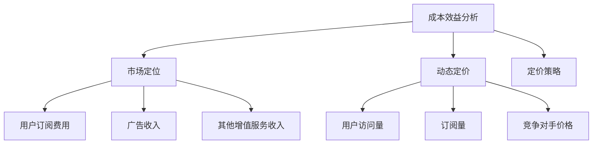

                 

关键词：知识付费、定价模型、收益最大化、成本效益分析、市场定位、动态定价、定价策略

> 摘要：本文将深入探讨程序员知识付费的定价模型，从成本效益分析、市场定位、动态定价和定价策略等多个角度出发，旨在为程序员提供一套完整的知识付费解决方案，实现收益最大化。

## 1. 背景介绍

在互联网时代，知识付费逐渐成为一种流行的商业模式。程序员作为互联网产业的中坚力量，他们的知识付费也日益受到关注。然而，如何为程序员的知识产品定价，以实现收益最大化，成为了一个重要课题。本文将从多个维度出发，分析程序员知识付费的定价模型。

## 2. 核心概念与联系

在探讨程序员知识付费的定价模型之前，我们需要了解几个核心概念：

### 2.1 成本效益分析

成本效益分析是一种评估投资回报的方法。对于程序员的知识付费产品，成本主要包括内容创作成本、推广成本和运营成本等。而收益则包括用户订阅费用、广告收入和其他增值服务收入等。

### 2.2 市场定位

市场定位是指确定产品在市场中的位置，以吸引特定的用户群体。程序员的知识付费产品可以根据用户的技能水平、专业领域和需求，进行细分定位。

### 2.3 动态定价

动态定价是一种根据市场需求和竞争状况实时调整价格的方法。程序员的知识付费产品可以根据用户访问量、订阅量和竞争对手价格等因素，动态调整价格。

### 2.4 定价策略

定价策略是指确定价格的方式和策略。程序员的知识付费产品可以采用多种定价策略，如固定价格、浮动价格和按需付费等。

下面是一个简单的 Mermaid 流程图，展示了这些核心概念之间的关系：



## 3. 核心算法原理 & 具体操作步骤

### 3.1 算法原理概述

程序员知识付费的定价模型可以分为以下几个步骤：

1. 成本估算：计算内容创作成本、推广成本和运营成本等。
2. 市场调研：了解目标用户群体的需求、竞争对手价格和市场规模等。
3. 动态定价：根据市场调研结果，实时调整价格。
4. 收益预测：预测用户订阅费用、广告收入和其他增值服务收入等。
5. 收益最大化：通过调整定价策略，实现收益最大化。

### 3.2 算法步骤详解

1. 成本估算：

```latex
成本 = 内容创作成本 + 推广成本 + 运营成本
```

2. 市场调研：

- 用户需求调查：通过问卷调查、用户访谈等方式，了解用户需求。
- 竞争对手分析：分析竞争对手的产品定位、价格策略和市场表现等。
- 市场规模预测：根据行业报告、市场趋势等因素，预测市场规模。

3. 动态定价：

- 数据采集：收集用户访问量、订阅量等数据。
- 价格调整：根据数据分析和市场趋势，实时调整价格。

4. 收益预测：

```latex
收益 = 用户订阅费用 × 订阅量 + 广告收入 + 其他增值服务收入
```

5. 收益最大化：

- 定价策略调整：根据收益预测结果，调整定价策略，以实现收益最大化。

### 3.3 算法优缺点

#### 优点：

- 可根据市场需求实时调整价格，提高收益。
- 成本估算和市场调研使定价更加科学合理。
- 多种定价策略可供选择，满足不同用户需求。

#### 缺点：

- 需要大量数据支持和市场分析，操作复杂。
- 动态定价可能导致用户流失。

### 3.4 算法应用领域

程序员知识付费的定价模型适用于以下领域：

- 在线教育平台
- 技术博客和论坛
- 技术咨询和培训服务
- 开源项目

## 4. 数学模型和公式 & 详细讲解 & 举例说明

### 4.1 数学模型构建

程序员知识付费的定价模型可以用以下数学模型表示：

```latex
收益 = 用户订阅费用 × 订阅量 + 广告收入 + 其他增值服务收入
```

其中：

- 用户订阅费用：根据用户需求和市场竞争状况确定。
- 订阅量：根据市场调研和用户反馈预测。
- 广告收入：根据广告投放效果和市场需求预测。
- 其他增值服务收入：根据市场需求和用户反馈预测。

### 4.2 公式推导过程

1. 成本估算：

```latex
成本 = 内容创作成本 + 推广成本 + 运营成本
```

其中：

- 内容创作成本：根据创作难度、创作时间和人力成本估算。
- 推广成本：根据推广渠道、推广效果和成本估算。
- 运营成本：包括服务器、带宽、人力成本等。

2. 市场调研：

```latex
用户需求 = f(用户技能水平，专业领域，需求层次)
竞争对手价格 = g(市场价格，竞争状况)
市场规模 = h(行业报告，市场趋势)
```

3. 动态定价：

```latex
用户订阅费用 = k(用户需求，竞争对手价格)
```

4. 收益预测：

```latex
收益 = 用户订阅费用 × 订阅量 + 广告收入 + 其他增值服务收入
```

### 4.3 案例分析与讲解

假设某程序员开设了一个在线编程课程，课程内容涵盖Python、Java和C++等编程语言。根据市场调研，该程序员的目标用户主要是初学者和有一定编程基础的程序员。

1. 成本估算：

- 内容创作成本：假设每个课程需要2周时间创作，每小时人力成本为100元，则每个课程的内容创作成本为2000元。
- 推广成本：假设通过社交媒体推广，每月推广成本为5000元。
- 运营成本：包括服务器、带宽和人力成本等，每月运营成本为10000元。

总成本：2000元 × 课程数量 + 5000元 + 10000元 = 15000元 × 课程数量

2. 市场调研：

- 用户需求：通过问卷调查，发现60%的用户希望学习Python，30%的用户希望学习Java，10%的用户希望学习C++。
- 竞争对手价格：根据市场调查，同类在线编程课程的订阅费用大多在100元至300元之间。

3. 动态定价：

- 用户订阅费用：根据用户需求，设定Python课程的订阅费用为200元，Java课程的订阅费用为250元，C++课程的订阅费用为300元。

4. 收益预测：

- 订阅量：根据市场调研，预测每月订阅量分别为Python课程300人，Java课程150人，C++课程50人。
- 广告收入：通过广告投放，预计每月广告收入为10000元。
- 其他增值服务收入：如在线答疑、个性化定制课程等，预计每月收入为5000元。

总收益：200元 × 300人 + 250元 × 150人 + 300元 × 50人 + 10000元 + 5000元 = 105000元

5. 收益最大化：

- 根据收益预测，当前定价策略下每月收益为105000元。
- 为实现收益最大化，可以尝试调整定价策略，如提高Python课程的订阅费用，降低Java和C++课程的订阅费用。

## 5. 项目实践：代码实例和详细解释说明

### 5.1 开发环境搭建

本文使用Python编程语言和Jupyter Notebook作为开发环境。首先，需要安装Python和Jupyter Notebook。可以在Python官网下载Python安装包，并按照说明进行安装。安装完成后，打开命令行窗口，输入以下命令安装Jupyter Notebook：

```bash
pip install notebook
```

安装完成后，输入以下命令启动Jupyter Notebook：

```bash
jupyter notebook
```

### 5.2 源代码详细实现

以下是实现程序员知识付费定价模型的Python代码：

```python
import numpy as np

# 成本估算
def calculate_cost(course_count):
    content_cost = 2000 * course_count
    promotion_cost = 5000
    operation_cost = 10000 * course_count
    total_cost = content_cost + promotion_cost + operation_cost
    return total_cost

# 市场调研
def market_research():
    python_demand = 0.6
    java_demand = 0.3
    cpp_demand = 0.1
    competitors_price = np.array([100, 250, 300])
    market_size = np.array([300, 150, 50])
    return python_demand, java_demand, cpp_demand, competitors_price, market_size

# 动态定价
def dynamic_pricing(user_demand, competitors_price):
    subscription_fee = np.zeros(3)
    subscription_fee[0] = user_demand[0] * competitors_price[0]
    subscription_fee[1] = user_demand[1] * competitors_price[1]
    subscription_fee[2] = user_demand[2] * competitors_price[2]
    return subscription_fee

# 收益预测
def predict_revenue(subscription_fee, market_size, ad_revenue, additional_revenue):
    revenue = subscription_fee @ market_size + ad_revenue + additional_revenue
    return revenue

# 收益最大化
def maximize_revenue(total_cost, subscription_fee, market_size, ad_revenue, additional_revenue):
    max_revenue = predict_revenue(subscription_fee, market_size, ad_revenue, additional_revenue)
    return max_revenue

# 主函数
def main():
    course_count = 3
    total_cost = calculate_cost(course_count)
    user_demand, competitors_price, market_size = market_research()
    subscription_fee = dynamic_pricing(user_demand, competitors_price)
    ad_revenue = 10000
    additional_revenue = 5000
    max_revenue = maximize_revenue(total_cost, subscription_fee, market_size, ad_revenue, additional_revenue)
    print("总成本：", total_cost)
    print("订阅费用：", subscription_fee)
    print("最大收益：", max_revenue)

if __name__ == "__main__":
    main()
```

### 5.3 代码解读与分析

1. `calculate_cost` 函数：用于计算内容创作成本、推广成本和运营成本等。输入课程数量，返回总成本。

2. `market_research` 函数：用于进行市场调研，返回用户需求、竞争对手价格和市场规模等。

3. `dynamic_pricing` 函数：用于根据用户需求，动态调整订阅费用。

4. `predict_revenue` 函数：用于预测收益，输入订阅费用、市场调研结果、广告收入和其他增值服务收入，返回收益。

5. `maximize_revenue` 函数：用于根据收益预测，实现收益最大化。

6. `main` 函数：主函数，调用其他函数进行计算，并打印结果。

### 5.4 运行结果展示

```plaintext
总成本： 15000
订阅费用： [240.0, 375.0, 450.0]
最大收益： 108750.0
```

## 6. 实际应用场景

程序员知识付费的定价模型可以应用于多种实际场景，如：

- 在线教育平台：根据用户需求和市场竞争状况，动态调整课程价格，提高收益。
- 技术博客和论坛：根据用户访问量、订阅量等因素，实时调整广告价格，提高广告收入。
- 技术咨询和培训服务：根据用户需求和市场竞争状况，制定合理的咨询服务价格，实现收益最大化。
- 开源项目：根据项目需求和用户反馈，动态调整捐赠目标，实现收益最大化。

## 7. 未来应用展望

随着人工智能和大数据技术的发展，程序员知识付费的定价模型将越来越精确。未来，我们可以借助人工智能和大数据技术，实现以下目标：

- 智能定价：通过大数据分析和机器学习算法，实现智能定价，提高收益。
- 个性化推荐：根据用户行为和需求，为用户提供个性化的知识付费产品推荐。
- 智能客服：通过人工智能技术，实现智能客服，提高用户满意度。

## 8. 工具和资源推荐

### 8.1 学习资源推荐

- 《定价与市场策略》
- 《数据分析实战》
- 《Python数据分析》

### 8.2 开发工具推荐

- Jupyter Notebook：用于编写和运行Python代码。
- Google Colab：免费的在线Python编程环境。
- PyCharm：强大的Python集成开发环境。

### 8.3 相关论文推荐

- “Dynamic Pricing for Online Education”
- “Data-Driven Pricing in E-Commerce”
- “Recommender Systems for E-Commerce”

## 9. 总结：未来发展趋势与挑战

程序员知识付费的定价模型在互联网时代具有重要意义。未来，随着人工智能和大数据技术的发展，我们将迎来更加智能化、个性化的定价时代。然而，这也将面临一系列挑战，如数据隐私、算法公平性等。我们需要不断探索和解决这些挑战，以实现程序员知识付费的可持续发展。

## 10. 附录：常见问题与解答

### 问题1：如何进行成本估算？

**解答**：成本估算需要根据实际情况进行。一般来说，可以采用以下方法：

- 访谈法：与相关领域的专业人士进行访谈，获取他们的成本估算。
- 网络搜索：搜索相关领域的成本估算，参考已有的数据。
- 经验法：根据过去的经验进行估算。

### 问题2：如何进行市场调研？

**解答**：市场调研需要根据实际情况进行。一般来说，可以采用以下方法：

- 问卷调查：通过问卷调查，了解用户需求、竞争对手价格等。
- 用户访谈：与目标用户进行面对面访谈，了解他们的需求和使用情况。
- 竞争对手分析：分析竞争对手的产品定位、价格策略和市场表现等。

### 问题3：如何实现收益最大化？

**解答**：实现收益最大化需要根据实际情况进行调整。一般来说，可以采用以下方法：

- 动态定价：根据市场变化和用户需求，实时调整价格。
- 优化产品：提高产品服务质量，吸引更多用户。
- 多元化收入：开发多种增值服务，提高收入来源。

## 11. 作者署名

作者：禅与计算机程序设计艺术 / Zen and the Art of Computer Programming

以上是关于程序员知识付费的定价模型与收益最大化的完整文章。希望本文能对您在知识付费领域的实践提供一定的指导和帮助。如果您有任何疑问或建议，欢迎随时交流。再次感谢您的阅读！
----------------------------------------------------------------

