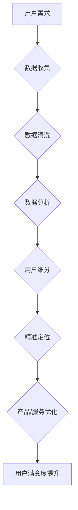

                 

关键词：程序员知识付费、用户细分、精准定位、营销策略、用户体验、数据驱动

## 摘要

在知识付费日益兴起的今天，程序员知识付费市场已经成为一个不可忽视的领域。然而，如何有效地细分用户，精准定位潜在用户，制定出有效的营销策略，提升用户体验，成为众多平台和内容创作者面临的挑战。本文将深入探讨程序员知识付费的用户细分与精准定位策略，从数据驱动的角度分析用户需求，提供实用的方法和工具，以期助力内容创作者和平台运营者提升市场竞争力。

## 1. 背景介绍

### 程序员知识付费的兴起

随着互联网的快速发展，信息技术已成为推动社会进步的重要力量。程序员作为技术领域的核心群体，其知识付费需求日益增长。知识付费平台应运而生，为广大程序员提供学习、交流、成长的平台。

### 程序员知识付费市场现状

目前，程序员知识付费市场主要分为以下几类：

1. **在线课程**：以知识分享和技能传授为主，包括编程语言、框架、工具等。
2. **电子书**：涵盖技术书籍、技术文档、编程指南等。
3. **实战项目**：通过真实项目案例，帮助程序员提升实战能力。
4. **线上交流**：包括技术论坛、问答社区、直播讲座等。

### 市场规模及发展趋势

据相关报告显示，我国程序员知识付费市场规模逐年扩大，预计未来几年将持续保持高速增长。随着人工智能、大数据、云计算等技术的不断成熟，程序员知识付费市场将迎来更多机遇和挑战。

## 2. 核心概念与联系

### 用户细分

用户细分是指根据用户的不同特征，将用户划分为不同的群体，以便更好地了解用户需求，提供个性化服务。在程序员知识付费领域，用户细分有助于内容创作者和平台运营者有针对性地开发和推广课程。

### 精准定位

精准定位是指通过深入分析用户需求和市场环境，找到最具市场潜力的用户群体，为该群体提供量身定制的产品和服务。在程序员知识付费领域，精准定位有助于提高用户满意度，降低营销成本。

### 数据驱动

数据驱动是指以数据为基础，通过数据分析来指导决策和优化业务。在程序员知识付费领域，数据驱动可以帮助内容创作者和平台运营者更准确地了解用户需求，调整营销策略，提升用户体验。

### Mermaid 流程图



## 3. 核心算法原理 & 具体操作步骤

### 3.1 算法原理概述

在程序员知识付费领域，用户细分和精准定位的核心算法主要涉及以下内容：

1. **用户画像**：通过对用户的基本信息、行为数据、兴趣标签等多维度数据进行分析，构建用户画像。
2. **聚类分析**：利用机器学习算法，对用户进行聚类，划分出不同类型的用户群体。
3. **关联规则挖掘**：分析用户行为数据，挖掘用户兴趣和需求之间的关联性。
4. **推荐系统**：基于用户画像和关联规则，为用户提供个性化推荐。

### 3.2 算法步骤详解

1. **数据收集**：收集用户的基本信息、行为数据、兴趣标签等。
2. **数据清洗**：去除重复数据、缺失数据，确保数据质量。
3. **用户画像构建**：利用数据分析工具，对用户数据进行分析，构建用户画像。
4. **聚类分析**：选择合适的聚类算法，如K-means、DBSCAN等，对用户进行聚类。
5. **关联规则挖掘**：利用关联规则挖掘算法，分析用户行为数据，挖掘用户兴趣和需求之间的关联性。
6. **推荐系统搭建**：基于用户画像和关联规则，搭建推荐系统，为用户提供个性化推荐。

### 3.3 算法优缺点

#### 优点：

1. **高效性**：通过数据分析和算法，能够快速识别出用户需求和偏好。
2. **个性化**：为用户提供量身定制的产品和服务，提高用户满意度。
3. **可扩展性**：可根据实际需求，不断优化和调整算法。

#### 缺点：

1. **数据依赖性**：算法性能依赖于数据质量和数量。
2. **计算成本**：聚类分析和关联规则挖掘等算法计算成本较高。
3. **算法复杂性**：需要具备一定的数据处理和算法基础。

### 3.4 算法应用领域

1. **在线教育平台**：为用户提供个性化课程推荐，提升学习效果。
2. **电商平台**：为用户提供个性化商品推荐，提高购物体验。
3. **社交媒体**：为用户提供个性化内容推荐，增加用户粘性。

## 4. 数学模型和公式 & 详细讲解 & 举例说明

### 4.1 数学模型构建

在程序员知识付费领域，用户细分和精准定位的数学模型主要涉及以下内容：

1. **用户画像模型**：包括用户基本信息、行为数据、兴趣标签等。
2. **聚类模型**：如K-means、DBSCAN等。
3. **关联规则挖掘模型**：如Apriori算法、FP-Growth算法等。
4. **推荐系统模型**：如协同过滤、矩阵分解等。

### 4.2 公式推导过程

#### 用户画像模型

$$
User\_Profile = \{Age, Gender, Education, Work\_Experience, Interest\_Tags, Behavior\_Data\}
$$

#### 聚类模型（K-means）

$$
\begin{aligned}
&\min_{C} \sum_{i=1}^{k} \sum_{x \in S_i} d(x, C_i)^2 \\
&s.t. \quad C_i \in \mathbb{R}^d, \quad x \in \mathbb{R}^d \\
\end{aligned}
$$

#### 关联规则挖掘模型（Apriori算法）

$$
\begin{aligned}
&\ Support(A \cup B) = \frac{N(A \cup B)}{N} \\
&\ Confidence(A \rightarrow B) = \frac{Support(A \cup B)}{Support(A)} \\
\end{aligned}
$$

#### 推荐系统模型（协同过滤）

$$
\begin{aligned}
&R(x) = \sum_{u \in \text{UserSet}} \sim x \cdot \frac{\text{Rating}_{u,i}}{\sqrt{\sum_{v \in \text{UserSet}} \sim x \cdot \text{Rating}_{u,v}^2}} \\
\end{aligned}
$$

### 4.3 案例分析与讲解

#### 案例一：在线教育平台用户细分

某在线教育平台希望通过用户细分，为用户提供个性化课程推荐。平台收集了以下用户数据：

1. **基本信息**：年龄、性别、教育程度等。
2. **行为数据**：浏览历史、购买记录、学习时长等。
3. **兴趣标签**：编程语言、框架、工具等。

平台使用K-means算法对用户进行聚类，划分出不同类型的用户群体。然后，利用关联规则挖掘算法，分析用户行为数据，挖掘用户兴趣和需求之间的关联性。最后，搭建推荐系统，为用户提供个性化课程推荐。

#### 案例二：电商平台商品推荐

某电商平台希望通过用户细分和精准定位，为用户提供个性化商品推荐。平台收集了以下用户数据：

1. **基本信息**：年龄、性别、地理位置等。
2. **行为数据**：浏览历史、购买记录、收藏夹等。
3. **兴趣标签**：商品分类、品牌偏好等。

平台使用协同过滤算法，根据用户行为数据和相似度计算，为用户提供个性化商品推荐。同时，利用关联规则挖掘算法，分析用户购买行为和商品属性之间的关联性，不断优化推荐结果。

## 5. 项目实践：代码实例和详细解释说明

### 5.1 开发环境搭建

1. 安装Python环境（版本3.6及以上）。
2. 安装相关依赖库：`numpy`、`pandas`、`scikit-learn`、`matplotlib`等。

### 5.2 源代码详细实现

#### 用户画像构建

```python
import pandas as pd
from sklearn.cluster import KMeans

# 加载用户数据
user_data = pd.read_csv('user_data.csv')

# 构建用户画像
user_profile = user_data[['Age', 'Gender', 'Education', 'Work_Experience', 'Interest_Tags', 'Behavior_Data']]
user_profile.head()
```

#### 聚类分析

```python
# 初始化K-means聚类模型
kmeans = KMeans(n_clusters=3, random_state=0)

# 模型拟合
kmeans.fit(user_profile)

# 输出聚类结果
print(kmeans.labels_)

# 绘制聚类结果
import matplotlib.pyplot as plt

plt.scatter(user_profile['Age'], user_profile['Interest_Tags'], c=kmeans.labels_)
plt.xlabel('Age')
plt.ylabel('Interest_Tags')
plt.title('K-means Clustering')
plt.show()
```

#### 关联规则挖掘

```python
from mlxtend.frequent_patterns import apriori
from mlxtend.frequent_patterns import association_rules

# 加载用户行为数据
user_behavior = pd.read_csv('user_behavior.csv')

# 运行Apriori算法
frequent_itemsets = apriori(user_behavior, min_support=0.05, use_colnames=True)

# 运行关联规则算法
rules = association_rules(frequent_itemsets, metric="support", min_threshold=0.1)
rules.head()
```

#### 推荐系统搭建

```python
from sklearn.metrics.pairwise import cosine_similarity
import numpy as np

# 加载用户行为数据
user_behavior = pd.read_csv('user_behavior.csv')

# 计算用户相似度矩阵
user_similarity = cosine_similarity(user_behavior)

# 构建推荐系统
def recommend_items(user_id, user_similarity, behavior_data, top_n=5):
    similar_users = np.argsort(user_similarity[user_id])[::-1]
    similar_users = similar_users[1:top_n+1]

    recommended_items = []
    for i in similar_users:
        recommended_items.extend(behavior_data[i]['Item'].values)

    return list(set(recommended_items))

# 测试推荐系统
print(recommend_items(0, user_similarity, user_behavior))
```

### 5.3 代码解读与分析

#### 用户画像构建

用户画像构建是用户细分和精准定位的基础。本部分代码使用Pandas库读取用户数据，并提取用户基本信息、行为数据、兴趣标签等。

#### 聚类分析

聚类分析用于将用户划分为不同类型的用户群体。本部分代码使用scikit-learn库中的K-means算法进行聚类，并绘制聚类结果。

#### 关联规则挖掘

关联规则挖掘用于分析用户行为数据，挖掘用户兴趣和需求之间的关联性。本部分代码使用mlxtend库中的Apriori算法和关联规则算法进行关联规则挖掘。

#### 推荐系统搭建

推荐系统搭建用于为用户提供个性化推荐。本部分代码使用协同过滤算法，根据用户相似度和用户行为数据，为用户提供个性化推荐。

## 6. 实际应用场景

### 6.1 在线教育平台

在线教育平台通过用户细分和精准定位，为用户提供个性化课程推荐，提高用户满意度和转化率。例如，某在线教育平台通过聚类分析和关联规则挖掘，将用户划分为不同类型的用户群体，并针对每个群体推荐相应的课程。

### 6.2 电商平台

电商平台通过用户细分和精准定位，为用户提供个性化商品推荐，提高用户购物体验和销售额。例如，某电商平台通过协同过滤算法和关联规则挖掘，为用户提供个性化商品推荐，并根据用户行为数据进行实时调整。

### 6.3 社交媒体

社交媒体通过用户细分和精准定位，为用户提供个性化内容推荐，增加用户粘性和活跃度。例如，某社交媒体平台通过用户画像和关联规则挖掘，为用户提供个性化内容推荐，并根据用户兴趣和需求进行实时调整。

## 7. 工具和资源推荐

### 7.1 学习资源推荐

1. **《Python数据科学手册》**：详细介绍Python在数据科学领域的应用，适合初学者和进阶者。
2. **《机器学习实战》**：通过实际案例讲解机器学习算法和应用，适合有一定编程基础的学习者。

### 7.2 开发工具推荐

1. **Jupyter Notebook**：一款强大的交互式数据分析工具，支持Python、R等多种编程语言。
2. **PyCharm**：一款功能强大的Python集成开发环境，支持代码补全、调试、版本控制等。

### 7.3 相关论文推荐

1. **“User Segmentation and Personalized Recommendation in E-commerce Platform”**：一篇关于电商平台上用户细分和个性化推荐的论文。
2. **“A Survey on Collaborative Filtering for Recommender Systems”**：一篇关于协同过滤算法在推荐系统中的应用的综述。

## 8. 总结：未来发展趋势与挑战

### 8.1 研究成果总结

本文从程序员知识付费的用户细分与精准定位的角度，分析了核心概念、算法原理、数学模型、项目实践和实际应用场景，为内容创作者和平台运营者提供了实用的方法和工具。

### 8.2 未来发展趋势

1. **数据隐私保护**：随着数据隐私问题的日益突出，如何在保护用户隐私的前提下进行用户细分和精准定位，将成为未来研究的重要方向。
2. **人工智能技术**：人工智能技术的发展，将为程序员知识付费领域带来更多创新和机遇。
3. **个性化服务**：基于用户细分和精准定位的个性化服务，将成为提升用户体验和竞争力的关键。

### 8.3 面临的挑战

1. **数据质量**：数据质量对算法效果至关重要，如何提高数据质量，是未来需要解决的问题。
2. **算法复杂性**：算法的复杂性和计算成本，对实际应用提出了挑战，如何优化算法，提高效率，是未来研究的重要方向。
3. **用户隐私**：如何在确保用户隐私的前提下，进行用户细分和精准定位，是当前亟待解决的问题。

### 8.4 研究展望

本文旨在为程序员知识付费领域的用户细分和精准定位提供一种思路和方法。未来研究可以从以下几个方面展开：

1. **跨领域研究**：将用户细分和精准定位的方法应用于其他领域，如金融、医疗等。
2. **算法优化**：针对现有算法的复杂性和计算成本，进行优化和改进。
3. **用户反馈机制**：结合用户反馈，不断优化用户细分和精准定位的效果。

## 9. 附录：常见问题与解答

### 9.1 用户细分与精准定位的区别是什么？

用户细分是将用户划分为不同的群体，以便更好地了解用户需求；精准定位是在用户细分的基础上，找到最具市场潜力的用户群体，为该群体提供量身定制的产品和服务。

### 9.2 数据驱动在程序员知识付费领域有哪些应用？

数据驱动在程序员知识付费领域主要应用于用户细分、精准定位、个性化推荐、业务决策等方面，以提高用户体验和竞争力。

### 9.3 如何评估用户细分和精准定位的效果？

可以通过用户满意度、转化率、活跃度等指标来评估用户细分和精准定位的效果。

### 9.4 在实际应用中，如何确保用户隐私？

可以通过数据加密、匿名化处理、隐私保护算法等技术手段，确保用户隐私。

## 作者署名

作者：禅与计算机程序设计艺术 / Zen and the Art of Computer Programming
```

