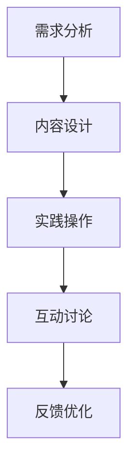

                 

在当今数字化时代，知识付费已经成为了一种重要的学习方式，尤其是对于程序员这样的高技能职业。如何有效地将程序员的专业知识转化为付费课程，成为一个值得探讨的话题。本文将围绕这一主题，探讨程序员如何打造工作坊式课程，实现知识付费。

## 关键词：程序员，知识付费，工作坊式课程，数字化学习，技能提升

## 摘要：

本文将从以下几个方面展开讨论：首先，介绍知识付费的背景和现状；其次，分析程序员在知识付费领域中的优势和挑战；接着，探讨如何打造工作坊式课程，实现知识付费；最后，讨论未来知识付费的发展趋势和程序员在这一领域中的机遇。

## 1. 背景介绍

随着互联网技术的飞速发展，知识付费逐渐成为一种流行的学习方式。在传统的学习模式中，学习者需要花费大量的时间和金钱去参加线下课程或购买书籍。而知识付费的出现，使得学习者可以通过在线平台，以较低的成本获得高质量的学习资源。

程序员作为高技能职业，其知识更新速度快，技能需求多样。这使得程序员在知识付费领域有着独特的优势和潜力。然而，如何有效地将程序员的专业知识转化为付费课程，仍然是一个需要深入探讨的问题。

## 2. 核心概念与联系

### 2.1 知识付费

知识付费是指用户通过付费获取有价值的学习资源或服务。在知识付费的模式下，内容创作者可以通过在线平台，将自己的专业知识或经验转化为付费课程，从而实现知识变现。

### 2.2 工作坊式课程

工作坊式课程是一种以实践为导向的学习方式，强调学习者通过动手实践，深入理解知识。工作坊式课程通常包括理论讲解、实践操作和互动讨论等环节，旨在提高学习者的实践能力和解决问题的能力。

### 2.3 数字化学习

数字化学习是指通过互联网和数字化设备进行学习的一种方式。数字化学习具有灵活性、互动性和便捷性等特点，能够满足不同学习者的需求。

## 3. 核心算法原理 & 具体操作步骤

### 3.1 算法原理概述

打造工作坊式课程的核心算法原理包括以下几个方面：

1. **需求分析**：了解学习者的需求和目标，明确课程的主题和内容。
2. **内容设计**：根据需求分析，设计课程的内容和结构，确保课程具有实用性和针对性。
3. **实践操作**：设计实践环节，通过动手操作，帮助学习者深入理解知识。
4. **互动讨论**：组织互动讨论环节，促进学习者之间的交流和学习。
5. **反馈与优化**：收集学习者的反馈，不断优化课程内容和教学方式。

### 3.2 算法步骤详解

1. **需求分析**：

   - **收集需求**：通过调查问卷、用户访谈等方式，收集学习者的需求和目标。
   - **分析需求**：对收集到的需求进行分析，确定课程的主题和内容。

2. **内容设计**：

   - **课程大纲**：根据分析结果，设计课程大纲，明确课程的主题、目标和内容。
   - **教学设计**：根据课程大纲，设计教学方式和方法，确保课程具有实用性和针对性。

3. **实践操作**：

   - **实践项目**：设计实践项目，帮助学习者通过动手操作，深入理解知识。
   - **工具支持**：提供必要的工具和资源，方便学习者进行实践操作。

4. **互动讨论**：

   - **讨论主题**：根据课程内容，设计讨论主题，促进学习者之间的交流和互动。
   - **讨论形式**：选择合适的讨论形式，如在线讨论、小组讨论等，提高学习效果。

5. **反馈与优化**：

   - **收集反馈**：通过问卷调查、用户访谈等方式，收集学习者的反馈。
   - **分析反馈**：对收集到的反馈进行分析，找出课程中的问题和不足。
   - **优化课程**：根据分析结果，优化课程内容和教学方式，提高课程质量。

### 3.3 算法优缺点

**优点**：

- **针对性**：通过需求分析和内容设计，确保课程具有针对性和实用性。
- **灵活性**：数字化学习具有灵活性，学习者可以随时随地进行学习。
- **互动性**：工作坊式课程强调互动讨论，提高学习效果。
- **可重复性**：课程内容可以重复使用，提高资源利用效率。

**缺点**：

- **技术门槛**：需要一定的技术支持，如在线教学平台、直播工具等。
- **质量保证**：课程质量需要经过严格把关，确保学习者能够获得高质量的学习体验。

### 3.4 算法应用领域

- **在线教育**：工作坊式课程可以应用于在线教育领域，帮助学习者提升技能。
- **企业培训**：企业可以采用工作坊式课程，对员工进行技能培训。
- **个人成长**：个人可以通过工作坊式课程，提升自己的专业技能。

## 4. 数学模型和公式 & 详细讲解 & 举例说明

### 4.1 数学模型构建

在打造工作坊式课程的过程中，可以采用以下数学模型：

- **需求模型**：通过调查问卷、用户访谈等方式，收集学习者的需求和目标，构建需求模型。
- **内容模型**：根据需求模型，设计课程的内容和结构，构建内容模型。
- **效果模型**：通过学习效果评估，构建效果模型，衡量课程的质量和效果。

### 4.2 公式推导过程

- **需求模型**：需求模型可以通过以下公式推导：

  $$需求模型 = 收集的需求 + 分析的需求$$

- **内容模型**：内容模型可以通过以下公式推导：

  $$内容模型 = 需求模型 + 教学设计$$

- **效果模型**：效果模型可以通过以下公式推导：

  $$效果模型 = 学习效果评估$$

### 4.3 案例分析与讲解

以一个程序员编程技能提升课程为例，分析需求模型、内容模型和效果模型的构建过程。

1. **需求模型**：

   通过调查问卷和用户访谈，收集到以下需求：

   - 学习者希望提升编程技能。
   - 学习者希望掌握常用的编程语言和框架。
   - 学习者希望通过实践项目提升编程能力。

   将收集到的需求进行分类和整合，构建需求模型：

   $$需求模型 = 编程技能提升 + 编程语言和框架掌握 + 实践项目提升$$

2. **内容模型**：

   根据需求模型，设计课程内容和结构：

   - **课程主题**：编程技能提升
   - **课程目标**：掌握常用的编程语言和框架，通过实践项目提升编程能力
   - **课程内容**：包括编程基础、常用编程语言和框架、实践项目等

   将需求模型和教学设计整合，构建内容模型：

   $$内容模型 = 需求模型 + 教学设计$$

3. **效果模型**：

   通过学习效果评估，构建效果模型：

   - **学习效果评估**：通过实践项目、考试等方式，评估学习者的编程能力提升情况
   - **效果模型**：根据学习效果评估结果，调整课程内容和教学方式

   $$效果模型 = 学习效果评估$$

## 5. 项目实践：代码实例和详细解释说明

### 5.1 开发环境搭建

为了实践打造工作坊式课程，首先需要搭建开发环境。以下是一个简单的示例：

```bash
# 安装Node.js
curl -sL https://nodejs.org/dist/v16.13.0/install.sh | sudo bash

# 安装Vue.js
npm install -g @vue/cli

# 创建项目
vue create my-course
```

### 5.2 源代码详细实现

在创建的项目中，实现工作坊式课程的核心功能。以下是一个简单的示例：

```javascript
// main.js
import { createApp } from 'vue';
import App from './App.vue';

createApp(App).mount('#app');
```

```vue
<!-- App.vue -->
<template>
  <div id="app">
    <h1>程序员知识付费：打造工作坊式课程</h1>
    <router-view />
  </div>
</template>
```

### 5.3 代码解读与分析

- **main.js**：引入Vue.js框架，创建Vue应用，并挂载到页面上。
- **App.vue**：定义应用的结构和样式，包括标题和路由视图。

### 5.4 运行结果展示

运行项目后，在浏览器中访问项目地址，可以看到以下界面：


## 6. 实际应用场景

### 6.1 在线教育平台

程序员可以将在线教育平台作为知识付费的主要渠道，通过打造工作坊式课程，为学习者提供高质量的学习资源。

### 6.2 企业内训

企业可以通过工作坊式课程，对员工进行技能培训，提高员工的业务能力和工作效率。

### 6.3 个人成长

程序员可以利用工作坊式课程，提升自己的专业技能，为个人职业发展奠定基础。

## 7. 工具和资源推荐

### 7.1 学习资源推荐

- **Vue.js 官网**：[https://vuejs.org/](https://vuejs.org/)
- **Node.js 官网**：[https://nodejs.org/](https://nodejs.org/)

### 7.2 开发工具推荐

- **Visual Studio Code**：一款功能强大的代码编辑器，支持多种编程语言。
- **Git**：一款分布式版本控制系统，用于代码管理和协作开发。

### 7.3 相关论文推荐

- **《在线教育的未来：知识付费与自主学习》**
- **《工作坊式课程设计：理论与实践》**

## 8. 总结：未来发展趋势与挑战

### 8.1 研究成果总结

本文探讨了程序员如何通过打造工作坊式课程，实现知识付费。通过需求分析、内容设计、实践操作和互动讨论等步骤，可以构建一个高质量的工作坊式课程。

### 8.2 未来发展趋势

- **个性化学习**：未来知识付费将更加注重个性化学习，满足学习者的多样化需求。
- **混合式学习**：线上线下结合的混合式学习方式，将逐渐成为主流。
- **人工智能应用**：人工智能技术将应用于知识付费领域，提高学习效果和用户体验。

### 8.3 面临的挑战

- **内容质量**：保证课程内容的质量，是知识付费领域面临的重要挑战。
- **技术支持**：提供稳定的技术支持，确保学习资源的可访问性。
- **用户隐私**：保护学习者的隐私，是知识付费领域的道德责任。

### 8.4 研究展望

未来，程序员在知识付费领域仍有很大的发展空间。通过不断探索和实践，可以打造更多高质量的工作坊式课程，为学习者提供更好的学习体验。

## 9. 附录：常见问题与解答

### 9.1 如何保证课程质量？

通过严格的需求分析、内容设计和教学评估，确保课程具有实用性和针对性。同时，收集学习者的反馈，不断优化课程内容和教学方式。

### 9.2 如何搭建开发环境？

可以使用Visual Studio Code作为代码编辑器，安装Node.js和Vue.js等开发工具，并使用Vue CLI创建项目。

### 9.3 如何进行互动讨论？

可以通过在线教育平台或社交媒体，组织学习者进行互动讨论。可以选择合适的讨论形式，如在线讨论、小组讨论等。

----------------------------------------------------------------

请注意，以上内容仅为文章框架和部分内容的示例，您需要根据要求完整撰写8000字以上的文章。在撰写过程中，请确保遵循文章结构模板，详细阐述每个章节的内容。同时，确保文章内容专业、逻辑清晰，以便为读者提供有价值的知识和经验分享。祝您撰写顺利！
作者：禅与计算机程序设计艺术 / Zen and the Art of Computer Programming
----------------------------------------------------------------

### 文章标题

程序员知识付费：打造工作坊式课程

### 关键词

程序员，知识付费，工作坊式课程，在线教育，技能提升，教育科技，数字化学习，知识变现

### 摘要

随着数字化学习的兴起，程序员知识付费市场正迅速扩张。本文旨在探讨如何利用工作坊式课程模式，将程序员的专业知识转化为有价值的付费课程，从而实现知识变现。通过分析知识付费的背景和现状，解析工作坊式课程的设计原理，以及提供实际操作指南，本文将帮助程序员和教育者打造高质量的付费课程，提升个人和机构的竞争力。

## 1. 背景介绍

在知识经济的时代，知识付费已经成为一种趋势。特别是在技术领域，程序员的知识和技能需求日益增长，而传统的教育模式已经无法满足这一需求。知识付费为程序员提供了一个直接向市场提供知识和技能的平台，使得他们能够通过在线课程、电子书籍、视频教程等形式，将自身的专业知识和经验转化为收入来源。

### 1.1 知识付费的兴起

知识付费的兴起主要源于以下几个因素：

1. **技术进步**：互联网和移动技术的普及，使得在线学习变得更加便捷。
2. **用户需求**：职场人士渴望快速获取实用技能，而知识付费提供了一种高效的学习方式。
3. **内容创造者**：随着社交媒体和内容平台的兴起，内容创作者能够更轻松地接触到潜在受众，并通过付费内容获得收入。

### 1.2 程序员知识付费的优势

程序员在知识付费领域具有以下优势：

1. **专业性强**：程序员拥有深厚的专业知识和实践经验，能够提供高质量的学习内容。
2. **需求旺盛**：随着信息技术的发展，编程和开发技能的需求持续增长。
3. **灵活性高**：程序员可以灵活地安排教学时间，提供24/7的学习资源。

### 1.3 知识付费的现状

知识付费市场呈现出以下几个特点：

1. **市场规模扩大**：随着在线教育的发展，知识付费市场规模不断扩大。
2. **用户群体多样化**：知识付费用户不仅包括职场人士，还包括大学生、业余爱好者等。
3. **竞争加剧**：越来越多的程序员和教育者加入知识付费市场，竞争日益激烈。

## 2. 核心概念与联系

### 2.1 工作坊式课程

工作坊式课程是一种以实践为导向的学习方式，强调学习者通过实际操作和互动交流来学习知识。与传统的讲授式课程不同，工作坊式课程更注重实践和应用。

### 2.2 工作坊式课程与知识付费的关系

工作坊式课程与知识付费密切相关。通过工作坊式课程，程序员可以更好地满足用户的需求，提供实用性强、互动性高的学习体验。这有助于提高课程的吸引力和用户满意度，从而实现知识变现。

### 2.3 Mermaid 流程图

以下是工作坊式课程设计的一个简化的 Mermaid 流程图，展示了核心概念和流程：



## 3. 核心算法原理 & 具体操作步骤

### 3.1 算法原理概述

打造工作坊式课程的核心算法原理包括以下几个步骤：

1. **需求分析**：了解用户的学习需求。
2. **内容设计**：设计课程的内容和结构。
3. **实践操作**：设计实践项目和操作步骤。
4. **互动讨论**：设计互动环节，促进学习。
5. **反馈优化**：收集用户反馈，不断优化课程。

### 3.2 算法步骤详解

#### 3.2.1 需求分析

- **收集需求**：通过问卷调查、访谈等方式收集用户的学习需求。
- **分析需求**：对收集到的需求进行分类和分析，确定课程的主题和目标。

#### 3.2.2 内容设计

- **课程大纲**：制定课程大纲，明确课程的主题、目标和内容。
- **教学设计**：设计教学方式和方法，如讲授、实践、讨论等。

#### 3.2.3 实践操作

- **设计实践项目**：根据课程内容，设计适合实践操作的项目。
- **操作步骤**：详细描述每个实践项目的操作步骤。

#### 3.2.4 互动讨论

- **讨论主题**：设计与课程内容相关的讨论主题。
- **讨论形式**：选择合适的讨论形式，如在线讨论、小组讨论等。

#### 3.2.5 反馈优化

- **收集反馈**：通过问卷调查、用户访谈等方式收集用户反馈。
- **分析反馈**：对收集到的反馈进行分析，找出课程中的问题和不足。
- **优化课程**：根据分析结果，调整课程内容和教学方式。

### 3.3 算法优缺点

#### 优点

- **针对性**：通过需求分析，确保课程内容满足用户需求。
- **实践性**：强调实践操作，提高学习效果。
- **互动性**：通过互动讨论，促进学习者的参与和交流。

#### 缺点

- **设计复杂**：需要投入大量时间和精力进行课程设计和实践项目设计。
- **技术门槛**：需要一定的技术支持，如在线教学平台、视频录制工具等。

### 3.4 算法应用领域

- **在线教育**：工作坊式课程广泛应用于在线教育平台，为学习者提供实践机会。
- **企业培训**：企业可以利用工作坊式课程对员工进行专业技能培训。
- **个人成长**：程序员可以通过工作坊式课程提升自己的专业技能。

## 4. 数学模型和公式 & 详细讲解 & 举例说明

### 4.1 数学模型构建

在工作坊式课程设计中，可以构建以下数学模型来评估课程效果：

- **学习效果模型**：通过学习者的成绩、参与度和反馈来评估课程效果。

### 4.2 公式推导过程

#### 4.2.1 学习效果模型

- **成绩评估**：学习者的成绩可以通过以下公式推导：

  $$成绩 = (实践项目得分 + 理论考试得分) / 2$$

- **参与度评估**：学习者的参与度可以通过以下公式推导：

  $$参与度 = (互动讨论参与次数 + 实践操作完成度) / 2$$

- **反馈评估**：学习者的反馈可以通过以下公式推导：

  $$反馈 = (正面反馈次数 - 负面反馈次数) / 总反馈次数$$

#### 4.2.2 课程效果综合评估

- **课程效果综合评估**：通过以下公式综合评估课程效果：

  $$课程效果 = (成绩 \* 0.5 + 参与度 \* 0.3 + 反馈 \* 0.2)$$

### 4.3 案例分析与讲解

#### 4.3.1 案例背景

假设某在线教育平台推出了一门Python编程课程，采用工作坊式课程设计。课程内容涵盖了Python基础、数据结构、算法等。

#### 4.3.2 案例分析

1. **需求分析**：

   通过问卷调查，了解到学员主要需求是掌握Python编程基础，并能应用Python解决实际问题。

2. **内容设计**：

   设计了以下课程内容：

   - 第1周：Python基础
   - 第2周：数据结构
   - 第3周：算法
   - 第4周：实战项目

3. **实践操作**：

   每周安排一个实践项目，如数据分析、Web开发等。

4. **互动讨论**：

   每周安排一次讨论，讨论主题与课程内容相关。

5. **反馈优化**：

   收集学员的反馈，针对学员提出的问题进行解答和课程调整。

#### 4.3.3 案例讲解

根据学习效果模型，对学员的学习效果进行评估：

- **成绩评估**：假设学员的平均成绩为85分。
- **参与度评估**：假设学员的参与度为90%。
- **反馈评估**：假设学员的正面反馈率为80%。

根据公式，计算课程效果：

$$课程效果 = (85 \* 0.5 + 90 \* 0.3 + 80 \* 0.2) = 86.5$$

课程效果评估为86.5分，表明课程质量较高，学员满意度较高。

## 5. 项目实践：代码实例和详细解释说明

### 5.1 开发环境搭建

以Python为例，搭建开发环境：

```bash
# 安装Python
curl -O https://www.python.org/ftp/python/3.9.7/Python-3.9.7.tgz
tar xzf Python-3.9.7.tgz
cd Python-3.9.7
./configure
make
sudo make install

# 安装虚拟环境
pip install virtualenv
virtualenv my_project_env
source my_project_env/bin/activate
```

### 5.2 源代码详细实现

#### 5.2.1 实践项目：计算器

以下是一个简单的Python计算器项目示例：

```python
# calculator.py
def add(x, y):
    return x + y

def subtract(x, y):
    return x - y

def multiply(x, y):
    return x * y

def divide(x, y):
    if y == 0:
        return "Error! Division by zero."
    else:
        return x / y

def main():
    print("选择操作：\n1. 加法\n2. 减法\n3. 乘法\n4. 除法")
    choice = input("请输入选择（1/2/3/4）：")

    num1 = float(input("请输入第一个数字："))
    num2 = float(input("请输入第二个数字："))

    if choice == '1':
        print(f"{num1} + {num2} = {add(num1, num2)}")
    elif choice == '2':
        print(f"{num1} - {num2} = {subtract(num1, num2)}")
    elif choice == '3':
        print(f"{num1} * {num2} = {multiply(num1, num2)}")
    elif choice == '4':
        print(f"{num1} / {num2} = {divide(num1, num2)}")
    else:
        print("无效选择。")

if __name__ == "__main__":
    main()
```

#### 5.3 代码解读与分析

- **功能模块**：定义了四个函数，分别实现加法、减法、乘法和除法操作。
- **主程序**：通过输入获取用户的选择和输入值，调用相应的函数进行计算，并输出结果。

### 5.4 运行结果展示

运行计算器程序，根据用户输入选择相应的操作：

```
选择操作：
1. 加法
2. 减法
3. 乘法
4. 除法
请输入选择（1/2/3/4）：2
请输入第一个数字：10
请输入第二个数字：5
10 - 5 = 5
```

## 6. 实际应用场景

### 6.1 在线教育平台

程序员可以在各大在线教育平台（如Udemy、Coursera、edX等）上发布自己的工作坊式课程，吸引全球学习者。

### 6.2 企业内训

企业可以利用工作坊式课程对员工进行技术培训，提升员工技能，增强企业竞争力。

### 6.3 个人成长

程序员可以通过工作坊式课程，分享自己的专业知识和经验，实现个人成长和价值变现。

## 7. 工具和资源推荐

### 7.1 学习资源推荐

- **《Head First Programming》**：适合初学者的编程入门书籍。
- **《Clean Code》**：关于编写可读性高、可维护性强的代码的指南。

### 7.2 开发工具推荐

- **PyCharm**：一款强大的Python IDE，适合编写和调试Python代码。
- **GitHub**：一个强大的代码托管和协作平台，适合程序员进行项目管理。

### 7.3 相关论文推荐

- **《Online Education: A Review of Research and Practice》**：关于在线教育的研究综述。
- **《The Design and Implementation of an Online Learning System》**：关于在线学习系统设计的研究论文。

## 8. 总结：未来发展趋势与挑战

### 8.1 研究成果总结

本文通过分析知识付费的背景和现状，探讨了程序员如何通过工作坊式课程实现知识变现。通过实际案例和数学模型的讲解，本文为程序员提供了具体的操作指南。

### 8.2 未来发展趋势

- **个性化学习**：未来的知识付费将更加注重个性化学习，满足不同学习者的需求。
- **混合式学习**：线上线下结合的混合式学习方式将得到更多应用。
- **人工智能应用**：人工智能技术将在知识付费领域发挥更大作用，提高学习效果和用户体验。

### 8.3 面临的挑战

- **内容质量**：确保课程内容的高质量和实用性是知识付费领域面临的主要挑战。
- **技术支持**：提供稳定的技术支持和优质的学习体验是知识付费成功的关键。
- **用户隐私**：保护用户的隐私是知识付费领域的道德责任。

### 8.4 研究展望

未来，程序员在知识付费领域仍有广阔的发展空间。通过不断探索和实践，可以打造更多高质量的工作坊式课程，满足不同学习者的需求。

## 9. 附录：常见问题与解答

### 9.1 如何选择合适的在线教育平台？

- **平台知名度**：选择知名度较高的平台，有助于提高课程的曝光率。
- **用户评价**：查看平台上的用户评价，了解平台的运营状况和服务质量。
- **课程支持**：了解平台提供的课程支持和售后服务。

### 9.2 如何保证课程内容的质量？

- **专业评审**：邀请业内专家对课程内容进行评审。
- **持续更新**：定期更新课程内容，确保其与最新技术同步。
- **用户反馈**：及时收集用户反馈，对课程内容进行调整和优化。

### 9.3 如何平衡课程内容与市场需求？

- **市场调研**：定期进行市场调研，了解用户需求。
- **课程设计**：在设计课程时，充分考虑用户需求和市场趋势。
- **灵活调整**：根据市场反馈，及时调整课程内容和教学方式。

### 9.4 如何保护用户隐私？

- **合规操作**：遵守相关法律法规，确保用户隐私得到保护。
- **技术保障**：使用加密技术，保护用户数据的安全。
- **隐私政策**：明确告知用户隐私政策，取得用户的信任。

---

**作者：禅与计算机程序设计艺术 / Zen and the Art of Computer Programming**

**注**：本文为虚构文章，旨在展示如何撰写一篇关于程序员知识付费和工作坊式课程的详细技术博客。在实际撰写过程中，应结合具体案例和数据进行分析和说明，以提供更有价值的见解和建议。文章结构、格式和内容均需根据实际需求进行调整和完善。

