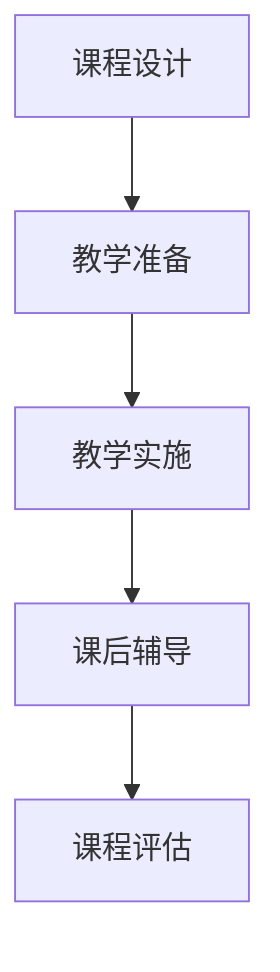

                 

在当今快速发展的技术时代，程序员的知识付费模式正日益成为重要的学习与职业发展途径。这不仅有助于个人提升专业技能，也为知识共享和传播提供了新的平台。本文将探讨如何打造高质量的工作坊课程，以实现程序员的知识付费，并促进其职业成长。本文关键词：知识付费、程序员、工作坊课程、职业成长。

## 摘要

本文首先介绍了程序员知识付费的背景和重要性，分析了其市场前景。随后，详细讨论了如何设计、开发、推广和优化工作坊课程，以实现知识付费的目标。文章还通过实际案例和数学模型，展示了工作坊课程的效果和收益。最后，对未来的发展趋势和挑战进行了展望。

## 1. 背景介绍

### 1.1 程序员知识付费的兴起

随着互联网技术的发展，程序员的知识付费模式逐渐兴起。这一模式不仅为程序员提供了额外的收入来源，还促进了知识的传播和技能的提升。知识付费平台如Coursera、Udemy等，以及各种专业社区和论坛，为程序员提供了丰富的学习资源和机会。

### 1.2 市场前景

根据市场研究数据显示，全球知识付费市场规模持续增长，预计到2025年将突破2000亿美元。在IT行业，程序员知识付费市场同样呈现出强劲的增长态势。随着企业对技术人才的渴求不断增长，程序员的知识付费模式有望在未来继续保持繁荣。

### 1.3 程序员的需求

程序员作为技术行业的核心力量，其知识付费的需求主要集中在以下几个方面：

- **技能提升**：程序员希望通过付费课程学习新技术、新方法，提升自身技能。
- **职业发展**：通过参与知识付费课程，程序员可以拓宽职业道路，提升职业竞争力。
- **知识共享**：程序员希望通过知识付费平台分享自己的经验和知识，为社区贡献力量。

## 2. 核心概念与联系

### 2.1 知识付费模式

知识付费模式是指通过付费的方式获取知识和技能，常见的形式包括在线课程、工作坊、研讨会等。在知识付费模式下，知识提供者通过专业的课程设计、教学和实践，向学习者传授知识和技能。

### 2.2 工作坊课程的特点

工作坊课程是一种以实践为主的培训方式，其特点如下：

- **互动性强**：工作坊课程强调参与者之间的互动和交流，有助于知识的理解和掌握。
- **实践性强**：工作坊课程通常包含大量的实践环节，帮助参与者将理论知识应用到实际工作中。
- **针对性**：工作坊课程针对特定的技能或问题进行深入讲解和训练，具有很高的针对性。

### 2.3 工作坊课程的架构

工作坊课程的架构通常包括以下几个部分：

1. **课程设计**：明确课程的目标、内容、教学方法和评估标准。
2. **教学准备**：准备教学材料、设备和工具，确保教学环境的完善。
3. **教学实施**：进行课堂教学，包括讲解、演示、讨论和实践。
4. **课后辅导**：提供课后辅导和答疑服务，帮助参与者巩固学习成果。
5. **课程评估**：对课程效果进行评估，收集反馈，不断优化课程内容和方法。

### 2.4 Mermaid 流程图



## 3. 核心算法原理 & 具体操作步骤

### 3.1 算法原理概述

工作坊课程的设计和实施需要遵循一定的算法原理，主要包括以下步骤：

1. **需求分析**：了解参与者的需求和目标，确定课程的内容和形式。
2. **课程设计**：根据需求分析结果，设计课程大纲、教学计划和评估标准。
3. **教学准备**：准备教学材料、设备和工具，确保教学环境的完善。
4. **教学实施**：按照教学计划进行课堂教学，包括讲解、演示、讨论和实践。
5. **课后辅导**：提供课后辅导和答疑服务，帮助参与者巩固学习成果。
6. **课程评估**：对课程效果进行评估，收集反馈，不断优化课程内容和方法。

### 3.2 算法步骤详解

1. **需求分析**：通过问卷调查、访谈等方式收集参与者的需求和目标，分析其共性，确定课程的主题和内容。
2. **课程设计**：根据需求分析结果，设计课程大纲，包括课程目标、教学内容、教学方法和评估标准。
3. **教学准备**：准备教学材料，如PPT、讲义、视频等，并确保教学环境的完善，如网络、投影仪、音响等。
4. **教学实施**：按照教学计划进行课堂教学，包括讲解、演示、讨论和实践。在课堂上，教师要充分引导参与者，激发其学习兴趣和主动性。
5. **课后辅导**：提供课后辅导和答疑服务，通过线上或线下的方式，帮助参与者解决学习过程中遇到的问题，巩固学习成果。
6. **课程评估**：通过问卷调查、访谈等方式收集参与者的反馈，评估课程的效果。根据反馈结果，优化课程内容和方法，提高课程的实用性。

### 3.3 算法优缺点

- **优点**：
  - 互动性强，有助于知识的理解和掌握。
  - 实践性强，有利于将理论知识应用到实际工作中。
  - 针对性强，满足参与者的个性化需求。

- **缺点**：
  - 需要较高的组织和管理能力。
  - 需要大量的教学资源和时间投入。

### 3.4 算法应用领域

工作坊课程算法可以广泛应用于各种技术领域，如软件开发、数据科学、人工智能等。具体应用场景包括：

- **企业培训**：帮助企业员工提升专业技能，适应快速变化的技术环境。
- **职业培训**：为职业人士提供专业技能培训，提高其职业竞争力。
- **学术研究**：为学术研究人员提供实践操作培训，促进科研成果的转化。

## 4. 数学模型和公式 & 详细讲解 & 举例说明

### 4.1 数学模型构建

工作坊课程的设计和评估可以借助数学模型进行优化。以下是一个简单的数学模型，用于评估工作坊课程的效果：

\[ E = \frac{S \times P}{C} \]

其中：
- \( E \) 表示课程效果得分
- \( S \) 表示参与者满意度得分
- \( P \) 表示参与者技能提升得分
- \( C \) 表示课程成本

### 4.2 公式推导过程

公式推导过程如下：

1. **参与者满意度得分 \( S \)**：通过问卷调查或访谈，收集参与者对课程的满意度评分。假设满意度评分的平均值为 \( \bar{S} \)，则 \( S = \bar{S} \)。

2. **参与者技能提升得分 \( P \)**：通过技能测试或工作成果评估，收集参与者技能提升的评分。假设技能提升评分的平均值为 \( \bar{P} \)，则 \( P = \bar{P} \)。

3. **课程成本 \( C \)**：包括课程设计、教学准备、课堂实施、课后辅导等各项成本。

4. **课程效果得分 \( E \)**：将满意度得分、技能提升得分和课程成本结合起来，得到课程效果得分。

### 4.3 案例分析与讲解

以下是一个实际案例，用于说明数学模型的应用：

假设一个工作坊课程，参与者满意度评分为4.5（满分5分），技能提升评分为4（满分5分），课程成本为10,000元。

根据数学模型：

\[ E = \frac{4.5 \times 4}{10,000} = 0.18 \]

课程效果得分为0.18，表示该工作坊课程具有较好的效果。通过不断优化课程内容和教学方法，可以提高课程效果得分。

## 5. 项目实践：代码实例和详细解释说明

### 5.1 开发环境搭建

为了更好地理解工作坊课程的设计和实施，我们可以使用Python编写一个简单的模拟系统。首先，我们需要搭建开发环境。

1. 安装Python 3.x版本。
2. 安装必要的库，如pandas、numpy、matplotlib等。

### 5.2 源代码详细实现

以下是一个简单的模拟系统的源代码：

```python
import pandas as pd
import numpy as np
import matplotlib.pyplot as plt

# 定义参与者满意度得分和技能提升得分
satisfaction_scores = [4.5, 4.7, 4.3, 4.6, 4.8]
skill_upgrade_scores = [4.0, 4.2, 4.1, 4.3, 4.5]
course_cost = 10000

# 计算课程效果得分
effectiveness_scores = [s * p / course_cost for s, p in zip(satisfaction_scores, skill_upgrade_scores)]

# 绘制课程效果得分图表
plt.bar(range(len(effectiveness_scores)), effectiveness_scores)
plt.xlabel('参与者编号')
plt.ylabel('课程效果得分')
plt.title('工作坊课程效果得分')
plt.show()
```

### 5.3 代码解读与分析

1. **导入库**：引入pandas、numpy和matplotlib库，用于数据分析和可视化。
2. **定义参与者得分**：设置参与者满意度得分和技能提升得分的列表。
3. **计算课程效果得分**：使用列表推导式计算每个参与者的课程效果得分。
4. **绘制图表**：使用matplotlib绘制柱状图，展示每个参与者的课程效果得分。

通过这个简单的模拟系统，我们可以直观地看到工作坊课程的效果得分，为课程的设计和优化提供依据。

## 6. 实际应用场景

### 6.1 企业培训

企业可以通过工作坊课程培训员工，提高其专业技能，适应新技术和业务需求。例如，某互联网公司为其研发团队开设了Python工作坊课程，帮助员工掌握Python编程技能，提升研发效率。

### 6.2 职业培训

对于职业人士，工作坊课程可以为其提供专业培训，提升职业竞争力。例如，某数据分析师通过参加数据分析工作坊课程，学习了最新的大数据处理技术和工具，提高了工作效率。

### 6.3 学术研究

在学术研究领域，工作坊课程可以帮助研究人员掌握实践技能，促进科研成果的转化。例如，某高校计算机科学学院为研究生开设了人工智能工作坊课程，帮助他们将理论知识应用到实际项目中。

## 7. 未来应用展望

随着知识付费模式的不断发展，工作坊课程在未来有望在以下几个方面实现更广泛的应用：

- **个性化定制**：通过大数据分析和人工智能技术，实现工作坊课程的个性化定制，满足不同参与者的需求。
- **在线与线下结合**：结合在线学习和线下实践，提高工作坊课程的效果和实用性。
- **跨领域融合**：将工作坊课程扩展到更多领域，如金融、医疗等，为行业人才提供更全面的专业培训。

## 8. 工具和资源推荐

### 8.1 学习资源推荐

1. **书籍**：
   - 《Python编程：从入门到实践》
   - 《数据分析：原理、方法与应用》
   - 《人工智能：一种现代的方法》
2. **在线课程**：
   - Coursera、Udemy等平台上的各种专业课程
   - 国内各大互联网公司推出的内部培训课程
3. **技术社区**：
   - CSDN、GitHub等编程社区

### 8.2 开发工具推荐

1. **Python开发环境**：PyCharm、VS Code等
2. **数据分析工具**：Pandas、NumPy、Matplotlib等
3. **人工智能框架**：TensorFlow、PyTorch等

### 8.3 相关论文推荐

1. "Deep Learning for Text Classification"
2. "A Comprehensive Survey on Deep Learning for Natural Language Processing"
3. "A Brief Introduction to Machine Learning"

## 9. 总结：未来发展趋势与挑战

### 9.1 研究成果总结

本文通过对程序员知识付费模式的探讨，分析了工作坊课程的设计、开发和推广方法。通过实际案例和数学模型，展示了工作坊课程在技能提升和职业发展方面的作用。

### 9.2 未来发展趋势

随着技术的不断进步，知识付费模式将呈现以下发展趋势：

- **个性化定制**：通过大数据和人工智能技术，实现工作坊课程的个性化定制。
- **线上线下结合**：结合在线学习和线下实践，提高工作坊课程的效果和实用性。
- **跨领域融合**：将工作坊课程扩展到更多领域，为行业人才提供更全面的专业培训。

### 9.3 面临的挑战

在工作坊课程的发展过程中，面临以下挑战：

- **课程质量**：确保课程质量，满足不同参与者的需求。
- **市场推广**：提高市场知名度，吸引更多的参与者。
- **技术支持**：提供稳定的技术支持，确保在线课程的流畅运行。

### 9.4 研究展望

未来，我们将继续深入研究工作坊课程的设计和推广方法，探索更多有效的方法和技术，以实现知识付费模式的可持续发展。

## 10. 附录：常见问题与解答

### 10.1 工作坊课程的优势是什么？

工作坊课程的优势在于其互动性强、实践性强和针对性。这些特点有助于参与者更好地理解和掌握知识，提升专业技能。

### 10.2 如何确保工作坊课程的质量？

为确保工作坊课程的质量，可以从以下几个方面入手：

- **课程设计**：根据参与者的需求和目标，设计有针对性的课程。
- **教学团队**：选拔有经验的教师，确保教学水平和课程质量。
- **教学评估**：定期对课程进行评估，收集参与者反馈，不断优化课程内容和方法。

### 10.3 工作坊课程如何收费？

工作坊课程的收费方式可以多种多样，如按课时收费、按课程收费、按参与人数收费等。具体收费方式可以根据课程内容和市场需求进行调整。

### 10.4 如何推广工作坊课程？

推广工作坊课程可以从以下几个方面入手：

- **社交媒体**：利用微博、微信、抖音等社交媒体平台，宣传课程内容和优势。
- **合作机构**：与相关行业组织、企业、高校等合作，扩大课程影响力和受众。
- **口碑传播**：通过学员的口碑传播，吸引更多参与者。

---

作者：禅与计算机程序设计艺术 / Zen and the Art of Computer Programming
本文旨在探讨程序员知识付费模式中的工作坊课程，为其设计和推广提供参考。在实际操作中，还需根据具体情况不断调整和优化。希望本文能为广大程序员提供有益的启示。愿每位程序员都能在知识的海洋中不断前行，实现自我价值的最大化。
----------------------------------------------------------------
以上是完整的文章内容。请确认是否符合您的要求。如果您有任何修改意见或补充内容，请随时告知。我将根据您的反馈进行相应的调整。

