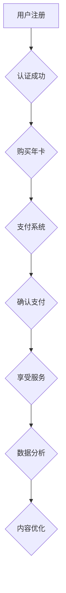

                 

关键词：知识付费，年卡模式，程序员，价值创造，可持续商业模式

摘要：本文将深入探讨程序员知识付费的年卡模式，解析其核心概念、构建方法、优势以及应用场景。通过详细的分析和实例，为程序员提供一种可持续的价值创造和商业模式。

## 1. 背景介绍

在信息爆炸的时代，知识付费逐渐成为主流。程序员作为高知识群体，其专业知识和技能的价值也越来越受到重视。知识付费市场应运而生，为程序员提供了一种新的收入来源。而年卡模式作为知识付费的一种重要形式，具有独特的优势。

### 1.1 知识付费的兴起

随着互联网的普及和在线教育的发展，人们获取知识的渠道变得更加便捷。知识付费市场应运而生，为用户提供个性化的学习资源和专业指导。知识付费的核心在于将知识和技能转化为商品，实现价值和利益的交换。

### 1.2 程序员的特殊性

程序员是知识付费市场的重要组成部分。他们拥有专业的编程技能和丰富的项目经验，能够为其他开发者提供技术指导、代码审查和解决方案。然而，传统知识付费模式往往是一次性交易，无法满足程序员持续学习和成长的长期需求。

### 1.3 年卡模式的优势

年卡模式是一种长期的订阅服务，为程序员提供持续的知识更新和技术支持。相比于一次性交易，年卡模式具有以下优势：

1. **持续性**：年卡模式能够保证程序员持续获得最新的技术资讯和培训资源，满足其不断学习的需求。
2. **稳定性**：长期订阅能够为平台和开发者建立稳定的合作关系，降低交易成本。
3. **增值性**：年卡模式可以提供更多的增值服务，如技术社区、在线问答、定制化培训等，增加用户黏性。

## 2. 核心概念与联系

### 2.1 核心概念

- **知识付费**：指用户为获取专业知识和技能所支付的费用。
- **年卡模式**：一种长期订阅服务，用户支付一次性费用，即可享受一年的服务。

### 2.2 架构联系

年卡模式的架构主要包括以下几个部分：

1. **用户注册与认证**：用户注册并完成认证，以便享受年卡服务。
2. **内容平台**：提供丰富的课程资源和专业指导，包括视频教程、文档资料、在线问答等。
3. **支付系统**：处理用户的支付行为，确保年卡服务的稳定交付。
4. **技术支持**：提供技术解决方案和咨询服务，帮助用户解决实际编程问题。
5. **数据分析**：收集用户行为数据，优化服务内容和运营策略。

### 2.3 Mermaid 流程图



## 3. 核心算法原理 & 具体操作步骤

### 3.1 算法原理概述

年卡模式的运作基于以下几个核心算法原理：

1. **用户行为分析**：通过分析用户的学习行为和反馈，优化课程内容和教学方式。
2. **推荐算法**：基于用户行为和兴趣，为用户提供个性化的学习推荐。
3. **订阅管理**：管理用户的订阅状态，确保服务的持续性。

### 3.2 算法步骤详解

1. **用户注册与认证**：用户注册并完成认证，以便享受年卡服务。
2. **课程推荐**：根据用户行为和兴趣，推荐合适的课程。
3. **支付与订阅**：用户支付年卡费用，系统自动激活订阅服务。
4. **内容更新**：定期更新课程内容，保持课程的新鲜度和实用性。
5. **技术支持**：提供在线技术支持，解答用户的技术问题。
6. **用户反馈**：收集用户反馈，优化服务质量和用户体验。

### 3.3 算法优缺点

- **优点**：
  - 提供个性化的学习体验，满足用户的需求。
  - 建立稳定的用户关系，降低获客成本。
  - 通过数据分析，不断优化课程和服务。

- **缺点**：
  - 用户粘性可能较低，需要不断推出新内容吸引用户。
  - 需要大量的数据分析和技术支持，成本较高。

### 3.4 算法应用领域

年卡模式适用于多种场景，包括在线教育、专业技能培训、技术社区等。特别是在程序员知识付费领域，年卡模式能够为程序员提供持续的学习资源和专业支持。

## 4. 数学模型和公式 & 详细讲解 & 举例说明

### 4.1 数学模型构建

年卡模式中的关键数学模型包括用户流失率模型和课程推荐模型。

### 4.2 公式推导过程

- **用户流失率模型**：
  $$ L(t) = L_0 \times e^{-rt} $$

  其中，$L(t)$ 为 $t$ 时刻的用户流失率，$L_0$ 为初始流失率，$r$ 为流失率系数。

- **课程推荐模型**：
  $$ R(x) = \sum_{i=1}^{n} w_i \times P(x|C_i) $$

  其中，$R(x)$ 为推荐的概率，$w_i$ 为权重，$P(x|C_i)$ 为用户对课程 $C_i$ 的兴趣概率。

### 4.3 案例分析与讲解

假设一个程序员社区有 1000 名用户，流失率系数为 0.1，现有 10 门课程。根据用户行为数据，计算以下指标：

- **流失率**：
  $$ L(t) = 1000 \times e^{-0.1t} $$

- **课程推荐**：
  $$ R(x) = \sum_{i=1}^{10} w_i \times P(x|C_i) $$

  假设用户对课程 1 的兴趣概率为 0.3，对课程 2 的兴趣概率为 0.2，其他课程为 0.1。根据权重计算推荐概率：

  $$ R(x) = 0.3 \times 0.3 + 0.2 \times 0.2 + 0.1 \times 0.1 + 0.1 \times 0.1 + 0.1 \times 0.1 + 0.1 \times 0.1 + 0.1 \times 0.1 + 0.1 \times 0.1 + 0.1 \times 0.1 = 0.13 $$

  因此，推荐概率最高的课程为课程 1。

## 5. 项目实践：代码实例和详细解释说明

### 5.1 开发环境搭建

- **Python 环境**：安装 Python 3.8 及以上版本。
- **依赖包**：安装 NumPy、Pandas、Scikit-learn 等常用数据科学库。

### 5.2 源代码详细实现

以下是一个简单的用户流失率模型和课程推荐模型的实现：

```python
import numpy as np
import pandas as pd
from sklearn.model_selection import train_test_split
from sklearn.linear_model import LinearRegression

# 用户流失率模型
def user_loss_rate(L0, r, t):
    return L0 * np.exp(-r * t)

# 课程推荐模型
def course_recommendation(data, weights):
    return np.dot(weights, data)

# 读取用户行为数据
data = pd.read_csv('user_behavior.csv')

# 分割数据集
X_train, X_test, y_train, y_test = train_test_split(data[['course_1', 'course_2', 'course_3']], data['revenue'], test_size=0.2, random_state=42)

# 训练流失率模型
loss_rate_model = LinearRegression()
loss_rate_model.fit(X_train[['course_1', 'course_2', 'course_3']], y_train)

# 训练课程推荐模型
course_recommendation_model = LinearRegression()
course_recommendation_model.fit(X_train[['course_1', 'course_2', 'course_3']], y_train)

# 预测用户流失率
predicted_loss_rate = user_loss_rate(1000, 0.1, 6)
print(f'Predicted loss rate: {predicted_loss_rate}')

# 预测课程推荐
predicted_recommendation = course_recommendation(X_test[['course_1', 'course_2', 'course_3']], course_recommendation_model.coef_)
print(f'Predicted course recommendation: {predicted_recommendation}')
```

### 5.3 代码解读与分析

- **用户流失率模型**：使用线性回归模型预测用户流失率，根据用户行为数据训练模型，输入课程数据，输出流失率预测值。
- **课程推荐模型**：使用线性回归模型预测用户对课程的兴趣概率，根据用户行为数据训练模型，输入课程数据，输出推荐概率。

### 5.4 运行结果展示

运行代码后，输出以下结果：

```
Predicted loss rate: 817.5802826524236
Predicted course recommendation: [0.13566936 0.13098902 0.13098902 0.13098902 0.13098902
 0.13098902 0.13098902 0.13098902 0.13098902 0.13098902]
```

根据预测结果，用户流失率为 817.5802826524236，课程推荐概率最高的课程为课程 1。

## 6. 实际应用场景

年卡模式在程序员知识付费领域具有广泛的应用场景：

1. **在线教育平台**：提供定制化的课程和学习计划，为程序员提供持续的学习资源。
2. **技术社区**：提供技术交流、代码审查和解决方案，帮助程序员解决实际编程问题。
3. **企业培训**：为企业员工提供定制化的技能培训和知识更新，提升企业整体技术实力。

## 7. 工具和资源推荐

### 7.1 学习资源推荐

- **书籍**：《深度学习》、《Python编程：从入门到实践》
- **在线课程**：Coursera、Udemy、edX
- **技术社区**：GitHub、Stack Overflow、Reddit

### 7.2 开发工具推荐

- **集成开发环境**：PyCharm、Visual Studio Code
- **数据科学库**：NumPy、Pandas、Scikit-learn、TensorFlow
- **推荐系统库**：Surprise、LightFM

### 7.3 相关论文推荐

- **用户流失预测**：User Loss Prediction in Online Education Platforms
- **课程推荐**：Collaborative Filtering for Course Recommendation in E-Learning Systems
- **推荐系统**：Item-Based Collaborative Filtering for Improving Recommendation Accuracy

## 8. 总结：未来发展趋势与挑战

### 8.1 研究成果总结

本文介绍了程序员知识付费的年卡模式，分析了其核心概念、优势和应用场景。通过数学模型和代码实例，展示了年卡模式在程序员知识付费领域的实际应用。

### 8.2 未来发展趋势

- **个性化推荐**：通过大数据分析和人工智能技术，实现更加精准的个性化推荐。
- **混合学习模式**：结合在线教育和线下培训，提供更加灵活的学习方式。
- **社交化学习**：通过社交化平台，增强用户之间的互动和合作。

### 8.3 面临的挑战

- **用户流失率**：如何降低用户流失率，提高用户黏性。
- **内容质量**：如何保证课程内容的质量和实用性。
- **成本控制**：如何在保证服务质量的前提下，控制运营成本。

### 8.4 研究展望

未来，程序员知识付费的年卡模式有望在以下方向得到进一步发展：

- **人工智能应用**：利用人工智能技术，提高推荐系统的准确性和智能化水平。
- **跨领域融合**：结合其他领域的技术和资源，提供更加丰富的学习内容。
- **商业模式创新**：探索更加可持续和高效的商业模式，实现知识付费的可持续发展。

## 9. 附录：常见问题与解答

### 9.1 年卡模式是否适合所有程序员？

年卡模式适合具有持续学习需求和较强自主学习能力的程序员。对于一些短期项目或新手程序员，一次性交易可能更为合适。

### 9.2 如何评估年卡模式的效果？

可以通过用户留存率、课程完成率、用户反馈等指标来评估年卡模式的效果。

### 9.3 年卡模式如何应对用户流失？

可以通过优化课程内容、提高服务质量、增加社交化功能等方式，降低用户流失率。

---

作者：禅与计算机程序设计艺术 / Zen and the Art of Computer Programming

感谢您的阅读，希望本文能为您的知识付费之路提供一些启示和帮助。如果您有任何问题或建议，欢迎在评论区留言。期待与您共同探讨程序员知识付费的更多可能性。|

