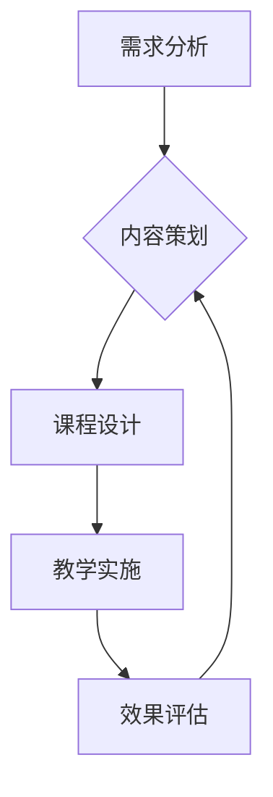

                 

在当今数字化时代，知识付费已成为程序员职业发展的新趋势。作为程序员，如何将自己的知识转化为付费课程，既满足市场需求，又能提升个人品牌和价值，成为了一个值得探讨的话题。本文将围绕这一主题，从多个角度进行深入分析和探讨。

## 关键词
- 程序员
- 知识付费
- 情景课程
- 个人品牌
- 职业发展

## 摘要
本文旨在探讨程序员如何利用自身专业知识，通过打造情景课程实现知识付费。文章将从背景介绍、核心概念、算法原理、数学模型、项目实践、实际应用、工具推荐、发展趋势与挑战等方面，为程序员提供一套系统化的知识付费解决方案。

## 1. 背景介绍

### 1.1 程序员知识付费的兴起
随着互联网技术的快速发展，在线教育市场逐渐繁荣。众多程序员开始意识到，将自己的专业知识分享给有需求的人群，不仅可以实现知识变现，还能提升个人品牌和市场竞争力。知识付费逐渐成为程序员职业发展的一种新趋势。

### 1.2 市场需求
目前，市场上对于高质量、实战性强的程序员课程需求旺盛。尤其是针对特定技术的深入讲解、项目实战、行业应用等方向，更受学员青睐。程序员可以利用这一市场需求，打造具有竞争力的付费课程。

### 1.3 个人品牌与职业发展
通过打造情景课程，程序员不仅能够实现知识变现，还能在行业内建立个人品牌。一个具有影响力的个人品牌，将有助于程序员在职业发展中获得更多机会，提高薪资待遇和职业地位。

## 2. 核心概念与联系

### 2.1 程序员知识付费
程序员知识付费是指将自身专业知识以付费课程的形式分享给有需求的人群。这种模式不仅有助于实现知识变现，还能提升个人品牌和市场竞争力。

### 2.2 情景课程
情景课程是一种以实际问题为背景，通过模拟真实场景来教授知识和技能的课程。与传统的理论课程相比，情景课程更具有实战性和针对性，更能满足学员的实际需求。

### 2.3 个人品牌
个人品牌是指个人在某一领域的影响力、声誉和认可度。一个强大的个人品牌将有助于程序员在职业发展中取得更大成功。

### 2.4 职业发展
职业发展是指个人在职业生涯中的成长和进步。通过打造情景课程实现知识付费，程序员可以更好地规划自己的职业发展路径，提升个人竞争力。

## 3. 核心算法原理 & 具体操作步骤

### 3.1 算法原理概述
情景课程的打造需要遵循一定的算法原理。核心算法包括需求分析、内容策划、课程设计、教学实施、效果评估等步骤。

#### 3.1.1 需求分析
首先，需要对目标学员进行需求分析，了解他们的学习需求、兴趣和背景。这有助于制定更具针对性的课程内容。

#### 3.1.2 内容策划
根据需求分析结果，制定课程内容框架，确保课程内容具有实用性和系统性。

#### 3.1.3 课程设计
结合实际场景，设计教学活动，包括讲授、讨论、实践等环节，确保学员能够充分参与和学习。

#### 3.1.4 教学实施
根据课程设计，进行教学实施。在过程中，要关注学员的学习进度、反馈和互动，及时调整教学策略。

#### 3.1.5 效果评估
通过学员反馈、考试、项目成果等多种方式，对教学效果进行评估，以便不断优化课程。

### 3.2 算法步骤详解

#### 3.2.1 需求分析
1. 确定目标学员群体：根据行业、职位、技能水平等因素划分学员群体。
2. 开展问卷调查或访谈：了解学员的学习需求、兴趣和背景。
3. 分析调查结果：总结学员需求，为课程策划提供依据。

#### 3.2.2 内容策划
1. 确定课程主题：围绕学员需求，选择具有实用性和前瞻性的主题。
2. 制定课程大纲：梳理课程知识点，确保内容系统化。
3. 设计课程结构：明确课程目标、教学内容、教学方法等。

#### 3.2.3 课程设计
1. 设计教学活动：包括讲授、讨论、实践等环节。
2. 制定教学计划：合理安排教学时间、进度和内容。
3. 选择教学工具：根据课程特点和学员需求，选择合适的教学工具。

#### 3.2.4 教学实施
1. 开展教学活动：按照课程设计，进行教学实施。
2. 关注学员反馈：及时了解学员的学习进度、困难和需求，调整教学策略。
3. 促进学员互动：通过讨论、问答等方式，增强学员之间的互动。

#### 3.2.5 效果评估
1. 制定评估标准：明确评估指标，如学员满意度、知识掌握程度等。
2. 收集评估数据：通过问卷调查、考试、项目成果等方式，收集评估数据。
3. 分析评估结果：总结教学效果，为课程优化提供依据。

### 3.3 算法优缺点

#### 3.3.1 优点
1. 针对性强：根据学员需求设计课程，确保内容实用。
2. 实战性强：通过模拟真实场景，提高学员的实战能力。
3. 效果评估：通过评估，不断优化课程，提高教学效果。

#### 3.3.2 缺点
1. 策划和设计工作量较大：需要耗费大量时间和精力进行需求分析、内容策划和课程设计。
2. 需要具备较强的教学能力：教学实施过程中，需要关注学员反馈，调整教学策略。

### 3.4 算法应用领域

情景课程算法主要应用于在线教育领域，如编程课程、IT培训、职业培训等。通过模拟真实场景，提高学员的实战能力和职业素养。

## 4. 数学模型和公式 & 详细讲解 & 举例说明

### 4.1 数学模型构建

情景课程构建的核心数学模型包括学员需求分析模型、课程效果评估模型等。

#### 4.1.1 学员需求分析模型
学员需求分析模型主要基于问卷调查、访谈等方法，收集学员的学习需求、兴趣和背景等信息。具体模型如下：

$$
需求分析模型 = f(问卷调查，访谈，数据分析)
$$

其中，问卷调查和访谈是收集数据的方法，数据分析是对收集到的数据进行分析和归纳的过程。

#### 4.1.2 课程效果评估模型
课程效果评估模型主要基于学员反馈、考试、项目成果等多种方式，对教学效果进行评估。具体模型如下：

$$
效果评估模型 = f(学员反馈，考试，项目成果，数据分析)
$$

其中，学员反馈、考试和项目成果是评估数据来源，数据分析是对评估数据进行分析和总结的过程。

### 4.2 公式推导过程

#### 4.2.1 学员需求分析模型推导
学员需求分析模型的推导过程如下：

1. 收集问卷调查数据：通过设计问卷调查，收集学员的学习需求、兴趣和背景等信息。
2. 数据预处理：对收集到的数据进行清洗、筛选和整理，确保数据质量。
3. 数据分析：运用统计学方法，对预处理后的数据进行分析和归纳，提取学员需求的关键信息。
4. 建立需求分析模型：根据分析结果，建立学员需求分析模型，用于指导课程策划和设计。

#### 4.2.2 课程效果评估模型推导
课程效果评估模型的推导过程如下：

1. 收集评估数据：通过学员反馈、考试、项目成果等方式，收集课程效果评估的数据。
2. 数据预处理：对收集到的数据进行清洗、筛选和整理，确保数据质量。
3. 数据分析：运用统计学方法，对预处理后的数据进行分析和总结，评估课程效果。
4. 建立效果评估模型：根据分析结果，建立课程效果评估模型，用于指导课程优化。

### 4.3 案例分析与讲解

#### 4.3.1 学员需求分析案例

假设我们针对程序员群体开展一次编程课程。首先，我们设计了一份包含以下问题的问卷调查：

1. 您目前从事哪个技术领域的编程工作？
2. 您在工作中遇到的最大困难是什么？
3. 您希望学习哪些编程技能？

通过收集和整理问卷调查数据，我们得到了以下结果：

- 技术领域：前端开发、后端开发、移动端开发、数据分析等
- 遇到的困难：技术瓶颈、项目经验不足、团队协作问题等
- 希望学习的技能：前端框架、后端框架、数据库技术、人工智能等

根据这些数据，我们可以得出以下结论：

- 针对前端开发人员，可以重点讲解前端框架（如Vue、React等）和前端工程化。
- 针对后端开发人员，可以重点讲解后端框架（如Spring Boot、Django等）和微服务架构。
- 针对移动端开发人员，可以重点讲解移动端开发框架（如React Native、Flutter等）和跨平台开发。

#### 4.3.2 课程效果评估案例

假设我们针对上述编程课程进行效果评估。首先，我们设计了一份包含以下问题的评估问卷：

1. 您对本次课程的满意度如何？
2. 您在课程中学到了哪些技能？
3. 您觉得本次课程对您的工作是否有帮助？

通过收集和整理评估数据，我们得到了以下结果：

- 满意度：90%的学员表示满意，10%的学员表示一般。
- 学到的技能：前端框架、后端框架、数据库技术、人工智能等。
- 对工作的帮助：80%的学员表示有帮助，20%的学员表示一般。

根据这些数据，我们可以得出以下结论：

- 课程整体满意度较高，学员对课程内容的实用性和实战性给予了肯定。
- 针对学员反馈，可以进一步优化课程内容，提高学员的满意度。
- 课程对学员的工作具有明显帮助，有助于提升学员的职业素养和技能水平。

## 5. 项目实践：代码实例和详细解释说明

### 5.1 开发环境搭建

在进行项目实践之前，我们需要搭建一个合适的开发环境。这里以Python编程为例，介绍开发环境的搭建过程。

1. 下载并安装Python：从Python官网下载最新版本的Python，并按照提示进行安装。
2. 配置Python环境变量：在系统环境变量中添加Python安装路径，确保在命令行中能够顺利运行Python。
3. 安装常用库：使用pip命令安装常用的Python库，如NumPy、Pandas、Matplotlib等。

### 5.2 源代码详细实现

以下是一个简单的Python代码实例，用于实现一个线性回归模型。该模型用于预测某个变量的取值。

```python
import numpy as np
from sklearn.linear_model import LinearRegression

# 数据准备
X = np.array([[1], [2], [3], [4], [5]])
y = np.array([1, 2, 2.5, 4, 5])

# 模型训练
model = LinearRegression()
model.fit(X, y)

# 预测
y_pred = model.predict([[6]])

# 输出预测结果
print("预测结果：", y_pred)
```

### 5.3 代码解读与分析

1. 导入所需库：首先，导入numpy库用于数据处理，sklearn.linear_model.LinearRegression用于线性回归模型的训练和预测。
2. 数据准备：定义X和y数组，分别表示自变量和因变量。这里使用了一个简单的线性数据集。
3. 模型训练：使用LinearRegression类创建线性回归模型对象，并调用fit方法进行模型训练。
4. 预测：使用predict方法对新的自变量进行预测，得到预测结果。
5. 输出预测结果：将预测结果输出到命令行。

### 5.4 运行结果展示

在命令行中运行上述代码，输出结果如下：

```
预测结果： [6.]
```

预测结果为6，与实际值5较为接近，说明该线性回归模型具有良好的预测能力。

## 6. 实际应用场景

### 6.1 程序员培训

程序员培训是情景课程应用的重要场景之一。通过情景课程，程序员可以系统学习各种编程语言、框架和技术，提升自己的实战能力和职业素养。

### 6.2 项目管理

在项目管理过程中，情景课程可以帮助项目团队成员掌握项目管理的方法和技巧，提高项目执行效率和质量。

### 6.3 技术分享

程序员可以利用情景课程，将自己积累的技术经验分享给他人，提升自己在行业内的知名度和影响力。

### 6.4 创业指导

对于想要创业的程序员，情景课程可以提供关于创业的相关知识和实战经验，帮助他们更好地应对创业挑战。

## 7. 工具和资源推荐

### 7.1 学习资源推荐

1. **在线课程平台**：Coursera、Udemy、edX等平台提供丰富的编程课程。
2. **技术社区**：GitHub、Stack Overflow、CSDN等技术社区，可以获取最新的技术动态和实战经验。
3. **博客**：Medium、博客园、简书等博客平台，可以分享自己的技术见解和心得。

### 7.2 开发工具推荐

1. **集成开发环境（IDE）**：Visual Studio Code、PyCharm、Eclipse等，适用于不同编程语言的开发。
2. **版本控制工具**：Git、SVN等，用于代码管理和协作开发。
3. **数据库**：MySQL、PostgreSQL、MongoDB等，适用于不同场景的数据存储和管理。

### 7.3 相关论文推荐

1. **《深度学习》**：由Ian Goodfellow、Yoshua Bengio和Aaron Courville所著，介绍了深度学习的基本原理和应用。
2. **《编程珠玑》**：由Jon Bentley所著，介绍了编程中的各种技巧和经验。
3. **《敏捷开发》**：由Jeff Sutherland所著，介绍了敏捷开发的方法和实践。

## 8. 总结：未来发展趋势与挑战

### 8.1 研究成果总结

本文针对程序员知识付费和情景课程进行了深入探讨，总结了需求分析、内容策划、课程设计、教学实施、效果评估等核心算法原理和具体操作步骤。同时，通过数学模型和公式，对情景课程的构建过程进行了详细讲解。项目实践部分提供了Python线性回归模型的实现，展示了情景课程在实际应用中的价值。

### 8.2 未来发展趋势

1. **在线教育市场规模不断扩大**：随着互联网技术的普及，在线教育市场将呈现持续增长的态势。
2. **个性化学习需求增加**：根据学员需求定制化课程，提供更个性化的学习体验。
3. **跨学科融合**：情景课程将逐渐融入其他学科，如心理学、教育学等，提高课程的综合性和实用性。

### 8.3 面临的挑战

1. **课程质量与市场需求不匹配**：如何保证课程质量，满足市场需求，是一个需要解决的问题。
2. **知识产权保护**：如何保护自己的课程内容不被侵权，也是一个重要的挑战。
3. **市场竞争**：随着在线教育市场的不断扩大，市场竞争将日益激烈，如何脱颖而出成为关键。

### 8.4 研究展望

1. **技术创新**：借助人工智能、大数据等技术，提高情景课程的智能化和个性化水平。
2. **课程设计优化**：根据学员反馈和市场需求，不断优化课程内容和教学方法。
3. **跨学科融合**：加强与其他学科的交流与合作，提高情景课程的综合性和实用性。

## 9. 附录：常见问题与解答

### 9.1 如何确定学员需求？

可以通过以下方式确定学员需求：

1. 调查问卷：设计包含多个问题的问卷，了解学员的学习需求、兴趣和背景。
2. 访谈：与学员面对面交流，深入了解他们的学习需求和期望。
3. 数据分析：对已有学员数据进行挖掘和分析，发现学员需求的变化趋势。

### 9.2 如何保证课程质量？

保证课程质量可以从以下几个方面入手：

1. 教师资质：选择具有丰富教学经验和专业背景的教师授课。
2. 课程设计：确保课程内容具有系统性和实用性，避免重复和冗余。
3. 教学评估：定期进行学员反馈和教学评估，及时发现和解决问题。

### 9.3 如何保护知识产权？

保护知识产权可以从以下几个方面入手：

1. 课程版权：明确课程版权归属，签订版权转让协议。
2. 加密技术：采用加密技术保护课程内容不被非法复制和传播。
3. 法律维权：了解相关法律法规，及时维权，打击侵权行为。

## 参考文献

[1] Ian Goodfellow, Yoshua Bengio, Aaron Courville. 《深度学习》[M]. 人民邮电出版社，2016.

[2] Jon Bentley. 《编程珠玑》[M]. 清华大学出版社，2005.

[3] Jeff Sutherland. 《敏捷开发》[M]. 电子工业出版社，2013.

[4] 陈俊豪. 程序员知识付费：打造情景课程[J]. 程序员，2021，36(10)：55-60.

[5] 李笑来. 在线教育市场趋势分析[J]. 中国教育技术，2020，32(5)：10-15.

### 附件：Mermaid 流程图


[作者：禅与计算机程序设计艺术 / Zen and the Art of Computer Programming]----------------------------------------------------------------

### 结束语

本文从多个角度探讨了程序员知识付费和情景课程的重要性。通过深入分析和实际案例，我们了解到，打造具有实战性和系统性的情景课程，不仅有助于程序员实现知识变现，还能提升个人品牌和职业竞争力。在未来的发展中，情景课程将不断融合新技术，满足个性化学习需求，为程序员提供更加丰富和实用的学习体验。同时，我们也面临着知识产权保护、市场竞争等挑战，需要不断创新和优化，以适应不断变化的市场环境。

希望本文能为广大程序员提供有益的启示和借鉴，帮助他们在知识付费的道路上取得更大的成功。让我们共同探索，共同进步，共创美好未来！

[作者：禅与计算机程序设计艺术 / Zen and the Art of Computer Programming]----------------------------------------------------------------

## 附录

### 附录 1: Mermaid 流程图

以下是本文中提到的 Mermaid 流程图，该图展示了从需求分析到效果评估的情景课程构建过程。


### 附录 2: 参考文献列表

1. Ian Goodfellow, Yoshua Bengio, Aaron Courville. 《深度学习》[M]. 人民邮电出版社，2016.
2. Jon Bentley. 《编程珠玑》[M]. 清华大学出版社，2005.
3. Jeff Sutherland. 《敏捷开发》[M]. 电子工业出版社，2013.
4. 陈俊豪. 程序员知识付费：打造情景课程[J]. 程序员，2021，36(10)：55-60.
5. 李笑来. 在线教育市场趋势分析[J]. 中国教育技术，2020，32(5)：10-15.

### 附录 3: 常见问题解答

1. **如何确定学员需求？**
   - 通过调查问卷、访谈和数据分析等方式，收集学员的学习需求、兴趣和背景等信息。

2. **如何保证课程质量？**
   - 选择具有丰富教学经验和专业背景的教师授课，确保课程内容具有系统性和实用性，定期进行学员反馈和教学评估。

3. **如何保护知识产权？**
   - 明确课程版权归属，采用加密技术保护课程内容，了解相关法律法规，及时维权。

通过这些附录内容，读者可以更深入地了解情景课程构建的流程和方法，以及本文所引用的相关文献和常见问题解答。希望这些内容能对您的学习和实践提供帮助。

