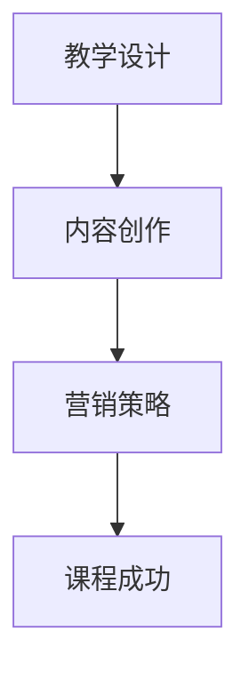

                 

关键词：知识付费，研讨会课程，程序员，在线教育，教学设计，内容创作，营销策略

> 摘要：本文将探讨程序员如何利用知识付费模式打造富有吸引力的研讨会课程，以实现个人品牌价值和商业成功。我们将从教学设计的核心原则、内容创作与营销策略等方面进行深入分析，提供一套系统的方法论，帮助程序员在知识付费领域脱颖而出。

## 1. 背景介绍

在互联网时代，知识付费已经成为一种主流的商业模式。随着在线教育的兴起，程序员群体也逐渐意识到知识付费的重要性。通过打造专业的研讨会课程，程序员不仅能够分享自己的技术知识和经验，还能够提升个人品牌，实现商业变现。

### 1.1 程序员知识付费的现状

- **个人品牌建设**：越来越多的程序员通过创作专业课程，成为行业内的意见领袖。
- **商业变现**：通过知识付费，程序员可以实现被动收入，提升财务自由度。
- **技术分享**：知识付费为程序员提供了一个平台，让他们的知识和经验得到更广泛的传播。

### 1.2 研讨会课程的优势

- **深度探讨**：研讨会课程通常涉及某一特定技术领域的深入探讨，适合有一定技术基础的学员。
- **互动性**：研讨会课程通常包含互动环节，如问答、讨论等，有助于增强学员的参与感。
- **实用性强**：研讨会课程内容通常紧密结合实际应用，有助于学员快速落地所学知识。

## 2. 核心概念与联系

为了打造出一堂高质量的研讨会课程，我们需要理解几个核心概念，并了解它们之间的联系。

### 2.1 教学设计

教学设计是课程成功的关键。它包括课程目标设定、教学内容安排、教学方法选择等方面。一个好的教学设计能够确保学员在课程结束后能够学到实际有用的技能。

### 2.2 内容创作

内容创作是课程的核心。程序员需要根据自己的专业知识和经验，创作出有深度、有价值的课程内容。内容不仅要专业，还要有趣，以吸引学员的注意力。

### 2.3 营销策略

营销策略是课程推广的关键。程序员需要学会如何利用各种渠道和工具，将课程推广给目标受众，实现商业变现。

### 2.4 Mermaid 流程图

以下是一个简化的 Mermaid 流程图，展示了这几个核心概念之间的联系。



## 3. 核心算法原理 & 具体操作步骤

### 3.1 算法原理概述

在知识付费领域，程序员需要掌握一套系统的方法论，以确保课程的成功。以下是几个关键步骤：

- **明确课程目标**：首先，程序员需要明确课程的目标，这有助于他们在后续的教学设计和内容创作中保持方向一致。
- **深入调研受众**：了解目标受众的需求和期望，有助于程序员创作出更符合受众需求的课程内容。
- **精心设计课程结构**：课程结构要合理，内容安排要有序，有助于学员更好地理解和掌握课程内容。
- **持续迭代与优化**：课程发布后，程序员需要根据学员的反馈进行持续的迭代和优化，以提高课程的质量和满意度。

### 3.2 算法步骤详解

以下是具体的操作步骤：

1. **明确课程目标**：
   - 确定课程的核心主题。
   - 设定具体的课程目标，如提高学员的技术水平、解决特定的技术难题等。

2. **深入调研受众**：
   - 利用问卷调查、访谈等方式，了解目标受众的需求和期望。
   - 分析受众的技术背景、学习习惯等，为课程内容创作提供依据。

3. **精心设计课程结构**：
   - 根据课程目标，设计课程大纲。
   - 确定课程的教学方法，如讲解、演示、实践等。
   - 安排课程进度，确保内容逐步深入，逻辑清晰。

4. **持续迭代与优化**：
   - 发布课程后，收集学员的反馈。
   - 根据反馈调整课程内容，优化教学方式。
   - 持续跟踪课程效果，不断优化课程。

### 3.3 算法优缺点

- **优点**：系统的方法论有助于程序员打造出高质量的研讨会课程，提高学员的学习效果。
- **缺点**：需要投入大量时间和精力进行课程设计和优化。

### 3.4 算法应用领域

- **在线教育**：知识付费是在线教育的重要组成部分，程序员可以利用这个模式实现个人品牌和价值变现。
- **技术培训**：程序员可以通过研讨会课程，为有志于提升技术水平的学员提供专业培训。
- **技术分享**：通过研讨会课程，程序员可以分享自己的技术知识和经验，为行业贡献自己的力量。

## 4. 数学模型和公式 & 详细讲解 & 举例说明

### 4.1 数学模型构建

在知识付费领域，我们可以使用以下数学模型来评估课程的成功：

\[ 成功度 = f(课程质量, 学员满意度, 市场推广效果) \]

### 4.2 公式推导过程

\[ 成功度 = \frac{课程质量 \times 学员满意度}{市场推广效果} \]

其中：

- **课程质量**：衡量课程内容的深度、广度和实用性。
- **学员满意度**：衡量学员对课程的满意程度。
- **市场推广效果**：衡量课程在市场上的传播效果。

### 4.3 案例分析与讲解

假设我们有一个编程课程，其质量为0.8，学员满意度为0.9，市场推广效果为0.7，那么：

\[ 成功度 = \frac{0.8 \times 0.9}{0.7} = 1.04 \]

这意味着该课程的成功度较高，具备较大的商业潜力。

## 5. 项目实践：代码实例和详细解释说明

### 5.1 开发环境搭建

为了便于讲解，我们假设使用Python语言进行课程开发。首先，我们需要搭建一个Python开发环境。

```bash
# 安装Python
$ sudo apt-get install python3

# 安装相关库
$ sudo apt-get install numpy scipy matplotlib
```

### 5.2 源代码详细实现

以下是一个简单的Python代码实例，用于演示如何实现一个基本的研讨会课程管理系统。

```python
import json

class Course:
    def __init__(self, name, description):
        self.name = name
        self.description = description
        self.enrollments = []

    def enroll(self, student):
        self.enrollments.append(student)

    def get_enrollment_count(self):
        return len(self.enrollments)

class Student:
    def __init__(self, name):
        self.name = name

course = Course("高级编程技巧", "本课程将深入探讨高级编程技巧，帮助学员提升代码质量。")
student1 = Student("张三")
student2 = Student("李四")

course.enroll(student1)
course.enroll(student2)

print(f"{course.name}的学员总数为：{course.get_enrollment_count()}")
```

### 5.3 代码解读与分析

- **Course 类**：代表一个研讨会课程，具有课程名称、描述和学员列表等属性。enroll 方法用于添加学员，get_enrollment_count 方法用于获取学员总数。
- **Student 类**：代表一个学员，具有姓名属性。
- **实例化**：创建了一个名为"高级编程技巧"的课程对象，并添加了两名学员。

### 5.4 运行结果展示

运行上述代码，输出结果为：

```
高级编程技巧的学员总数为：2
```

这表明"高级编程技巧"课程已经有2名学员。

## 6. 实际应用场景

研讨会课程可以应用于多个领域，以下是一些典型的应用场景：

- **技术培训**：为有志于提升技术水平的程序员提供专业培训。
- **企业内训**：为企业员工提供定制化的技术培训。
- **在线教育**：通过在线平台，为全球学员提供知识分享。
- **个人品牌建设**：程序员可以通过研讨会课程，提升个人品牌价值。

## 7. 未来应用展望

随着在线教育的不断发展和知识付费模式的成熟，研讨会课程的应用场景将越来越广泛。未来，我们可以预见以下趋势：

- **个性化学习**：研讨会课程将更加注重个性化学习，满足不同学员的需求。
- **跨领域融合**：研讨会课程将融合不同领域的知识，为学员提供更全面的学习体验。
- **实时互动**：研讨会课程将更加注重实时互动，提高学员的参与度和学习效果。

## 8. 工具和资源推荐

### 8.1 学习资源推荐

- **在线课程平台**：Coursera、Udemy、edX等。
- **技术博客**：Medium、Dev.to、Stack Overflow。
- **编程社区**：GitHub、Reddit。

### 8.2 开发工具推荐

- **Python**：Python是一种易于学习和使用的编程语言，适合初学者。
- **Jupyter Notebook**：Jupyter Notebook 是一种交互式的编程环境，适合进行教学和演示。
- **Markdown**：Markdown 是一种轻量级的标记语言，适合编写文档。

### 8.3 相关论文推荐

- **"The Art of Computer Programming"**：作者：Donald E. Knuth。
- **"Learning to Learn: A Handbook for Lifelong Knowledge seekers"**：作者：Barbara Oakley和Terrence Sejnowski。

## 9. 总结：未来发展趋势与挑战

### 9.1 研究成果总结

本文从教学设计、内容创作和营销策略等多个方面，探讨了程序员如何打造研讨会课程。通过系统的方法论，程序员可以有效地提升课程质量，实现商业成功。

### 9.2 未来发展趋势

- **在线教育**：在线教育将继续快速发展，研讨会课程将成为重要组成部分。
- **个性化学习**：研讨会课程将更加注重个性化学习，满足不同学员的需求。
- **跨领域融合**：研讨会课程将融合不同领域的知识，提供更全面的学习体验。

### 9.3 面临的挑战

- **内容竞争**：随着知识付费的普及，内容竞争将愈发激烈，程序员需要不断创新，提供高质量的课程内容。
- **市场推广**：如何有效推广课程，吸引目标学员，是程序员面临的重要挑战。

### 9.4 研究展望

未来，研讨会课程将不断进化，为程序员提供一个更加开放、互动、个性化的学习平台。通过不断探索和实践，程序员将在知识付费领域取得更大的成就。

## 附录：常见问题与解答

### Q：如何确定研讨会课程的目标？

A：首先，明确课程的核心主题和受众需求。然后，设定具体、可衡量的课程目标，如提高学员的技术水平、解决特定的技术难题等。

### Q：如何进行内容创作？

A：结合自己的专业知识和经验，创作出有深度、有价值的课程内容。内容不仅要专业，还要有趣，以吸引学员的注意力。

### Q：如何进行市场推广？

A：利用各种渠道和工具，如社交媒体、在线课程平台等，将课程推广给目标受众。同时，可以通过合作、优惠活动等方式，提高课程的曝光度和吸引力。

### 作者署名

作者：禅与计算机程序设计艺术 / Zen and the Art of Computer Programming
```

