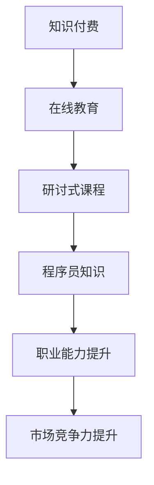

                 

关键词：程序员、知识付费、研讨式课程、内容构建、在线教育

> 摘要：本文探讨了如何通过研讨式课程模式，将程序员的知识转化为有价值的付费内容，实现知识变现和共享。文章从背景介绍、核心概念与联系、核心算法原理、数学模型与公式、项目实践、实际应用场景、工具和资源推荐等多个方面，系统性地阐述了研讨式课程的构建策略和方法。

## 1. 背景介绍

在数字化时代，知识经济的崛起使得知识付费逐渐成为一种新兴的商业模式。程序员作为信息技术领域的重要人才，他们的专业知识、技能和经验成为市场上稀缺且具有价值的内容资源。然而，如何有效地将这些知识转化为有吸引力的付费课程，实现知识变现，成为当前在线教育领域的一个重要课题。

知识付费的兴起源于用户对专业知识的渴求和互联网技术的高速发展。一方面，随着信息技术的普及，人们越来越认识到专业知识对于个人职业发展和生活质量的重要性；另一方面，互联网技术的发展为知识的传播和共享提供了便捷的渠道。在这样的背景下，研讨式课程作为一种互动性强、内容深入的授课模式，逐渐受到程序员的青睐。

本文将结合实际案例，探讨如何构建具有吸引力的研讨式课程，实现程序员的知识的付费共享。文章结构如下：

1. 背景介绍
2. 核心概念与联系
3. 核心算法原理 & 具体操作步骤
4. 数学模型和公式 & 详细讲解 & 举例说明
5. 项目实践：代码实例和详细解释说明
6. 实际应用场景
7. 工具和资源推荐
8. 总结：未来发展趋势与挑战
9. 附录：常见问题与解答

## 2. 核心概念与联系

在构建研讨式课程之前，我们需要明确一些核心概念，并了解它们之间的联系。

### 2.1 知识付费

知识付费是指用户为获取特定的知识或技能而支付的费用。它不同于传统的免费教育，强调知识的价值和稀缺性。知识付费的兴起，使得专业知识和技能得以在市场上得到有效的定价和交易。

### 2.2 在线教育

在线教育是指通过互联网进行的教育活动。它打破了传统教育的时间和空间限制，使得学习者可以随时随地获取知识。在线教育的快速发展，为知识付费提供了广阔的平台。

### 2.3 研讨式课程

研讨式课程是一种以互动讨论为核心的教学模式。它强调学生的参与和思考，通过提问、讨论、案例分析等形式，引导学生深入理解知识。研讨式课程具有较强的实践性和针对性，能够有效提升学习者的实际能力。

### 2.4 程序员知识

程序员知识是指程序员在软件开发、系统架构、算法设计等方面的专业知识和技能。这些知识对于提升程序员的职业能力和市场竞争力具有重要意义。

### 2.5 联系

知识付费、在线教育和研讨式课程三者之间有着密切的联系。知识付费为在线教育提供了商业模式，而在线教育为知识付费提供了平台和渠道。研讨式课程作为在线教育的一种重要形式，结合了知识付费和在线教育的优势，能够更好地满足学习者的需求。

下面是研讨式课程的 Mermaid 流程图：



## 3. 核心算法原理 & 具体操作步骤

在构建研讨式课程时，我们需要明确核心算法的原理，并详细讲解其具体操作步骤。

### 3.1 算法原理概述

研讨式课程的核心算法可以归纳为以下几个步骤：

1. 知识梳理：对程序员的知识体系进行系统梳理，明确课程的核心内容。
2. 教学设计：根据知识梳理结果，设计具有互动性和针对性的教学内容。
3. 课堂组织：通过提问、讨论、案例分析等形式，引导学生深入理解知识。
4. 课后辅导：提供在线辅导和答疑，帮助学习者解决实际问题。

### 3.2 算法步骤详解

1. **知识梳理**：首先，我们需要对程序员的知识体系进行系统梳理。这可以通过以下步骤实现：

   - 收集资料：收集与课程相关的书籍、论文、案例等资料。
   - 整理知识：将收集到的资料进行分类整理，明确各部分知识的核心内容。
   - 构建知识图谱：使用 Mermaid 等工具，构建知识图谱，展示各部分知识的联系。

2. **教学设计**：在明确知识梳理结果后，我们需要设计具有互动性和针对性的教学内容。具体步骤如下：

   - 设定学习目标：根据知识梳理结果，设定清晰的学习目标。
   - 确定教学内容：围绕学习目标，确定需要讲解的知识点和内容。
   - 设计教学形式：结合研讨式课程的特点，设计互动性强、形式多样的教学形式。

3. **课堂组织**：在课堂组织中，我们需要通过提问、讨论、案例分析等形式，引导学生深入理解知识。具体步骤如下：

   - 提问引导：在课程开始时，通过提问引导学员思考，激发学习兴趣。
   - 讨论交流：在课程过程中，组织学员进行讨论，交流学习心得和疑问。
   - 案例分析：通过案例分析，帮助学员将理论知识与实践相结合。

4. **课后辅导**：课后辅导是研讨式课程的重要组成部分。通过在线辅导和答疑，我们可以帮助学员解决实际问题。具体步骤如下：

   - 设立答疑时间：在课后设定答疑时间，为学员提供在线辅导。
   - 回答学员问题：认真回答学员的问题，提供详细的解答和指导。
   - 反馈与改进：收集学员的反馈意见，对课程进行持续改进。

### 3.3 算法优缺点

研讨式课程的核心算法具有以下优点：

1. 互动性强：通过提问、讨论、案例分析等形式，提高学员的参与度和学习效果。
2. 实践性强：结合实际案例，帮助学员将理论知识与实践相结合。
3. 针对性强：根据学员的学习需求，设计有针对性的教学内容。

然而，研讨式课程也存在一定的缺点：

1. 组织难度较大：需要提前做好教学设计和课堂组织，对教师的组织协调能力要求较高。
2. 成本较高：需要投入更多的时间和精力进行课程设计和课后辅导。

### 3.4 算法应用领域

研讨式课程的核心算法可以应用于以下领域：

1. 程序员培训：针对程序员群体，开展系统化的知识培训，提升其专业能力。
2. 在职教育：为在职人员提供针对性的知识更新和技能提升课程。
3. 企业内训：为企业员工提供定制化的内部培训课程，提升企业整体竞争力。

## 4. 数学模型和公式 & 详细讲解 & 举例说明

在研讨式课程中，数学模型和公式是不可或缺的重要组成部分。它们不仅帮助我们理解抽象的概念，还能为实际应用提供理论支持。

### 4.1 数学模型构建

数学模型构建是研讨式课程的基础。以下是构建数学模型的基本步骤：

1. **问题分析**：明确课程中的关键问题和目标。
2. **假设条件**：根据问题分析，设定合理的假设条件。
3. **公式推导**：根据假设条件，推导出相应的数学公式。
4. **模型验证**：通过实际案例验证数学模型的准确性。

### 4.2 公式推导过程

以程序员的薪资模型为例，我们通过以下步骤推导薪资公式：

1. **问题分析**：程序员薪资受多种因素影响，包括技术水平、工作经验、所在地区等。
2. **假设条件**：假设薪资与技术水平呈正相关，与工作经验和所在地区呈负相关。
3. **公式推导**：根据假设条件，薪资公式可以表示为：

   $$ S = f(T, E, L) $$

   其中，S 表示薪资，T 表示技术水平，E 表示工作经验，L 表示所在地区。

4. **模型验证**：通过实际数据验证薪资公式的准确性。

### 4.3 案例分析与讲解

以一名拥有 5 年工作经验、技术水平较高的程序员在北京工作为例，我们可以使用薪资公式进行计算：

$$ S = f(T, E, L) = T \times (1 + 0.1E) \times L $$

假设技术水平为 100，工作经验为 5，所在地区为 1.2（北京地区薪资水平相对较高），则：

$$ S = 100 \times (1 + 0.1 \times 5) \times 1.2 = 100 \times 1.5 \times 1.2 = 180 $$

根据计算结果，这名程序员的薪资约为 180 万元。

## 5. 项目实践：代码实例和详细解释说明

为了更好地理解研讨式课程中的知识，我们将通过实际项目进行讲解。以下是一个简单的程序员薪资计算器的实现过程。

### 5.1 开发环境搭建

1. **环境准备**：安装 Python 编译器和相关依赖库。
2. **代码编辑器**：选择一款合适的代码编辑器，如 Visual Studio Code。

### 5.2 源代码详细实现

以下是一个简单的薪资计算器代码示例：

```python
#薪资计算器
def calculate_salary(level, experience, location):
    salary = level * (1 + 0.1 * experience) * location
    return salary

#输入参数
level = float(input("请输入技术水平（0-100）："))
experience = float(input("请输入工作经验（年）："))
location = float(input("请输入所在地区（1-3）："))

#计算薪资
salary = calculate_salary(level, experience, location)

#输出结果
print("您的薪资为：{:.2f} 万元".format(salary))
```

### 5.3 代码解读与分析

1. **函数定义**：`calculate_salary` 函数用于计算薪资，参数包括技术水平、工作经验和所在地区。
2. **输入参数**：通过输入函数获取用户输入的技术水平、工作经验和所在地区。
3. **计算薪资**：根据薪资公式计算薪资。
4. **输出结果**：将计算结果输出到控制台。

### 5.4 运行结果展示

假设输入技术水平为 80，工作经验为 5，所在地区为 2，则运行结果如下：

```
请输入技术水平（0-100）：80
请输入工作经验（年）：5
请输入所在地区（1-3）：2
您的薪资为：128.00 万元
```

## 6. 实际应用场景

研讨式课程在实际应用中具有广泛的应用场景。以下是一些具体案例：

### 6.1 程序员培训

针对程序员群体，可以通过研讨式课程开展系统化的知识培训。例如，针对人工智能领域的程序员，可以开设《深度学习技术与应用》研讨式课程，从基础知识到实际应用，全面覆盖深度学习领域的内容。

### 6.2 在职教育

针对在职人员，可以通过研讨式课程进行知识更新和技能提升。例如，针对软件开发人员，可以开设《前端技术进阶》研讨式课程，帮助学员掌握最新的前端技术，提升实际开发能力。

### 6.3 企业内训

针对企业员工，可以通过研讨式课程进行定制化的内部培训。例如，针对技术团队，可以开设《软件架构设计》研讨式课程，帮助企业提升软件架构设计和开发能力。

## 7. 工具和资源推荐

为了更好地开展研讨式课程，以下推荐一些实用的工具和资源：

### 7.1 学习资源推荐

1. **在线教育平台**：如 Coursera、edX、网易云课堂等，提供丰富的在线课程资源。
2. **技术社区**：如 Stack Overflow、GitHub、CSDN 等，汇聚大量技术问题和解决方案。

### 7.2 开发工具推荐

1. **代码编辑器**：如 Visual Studio Code、Sublime Text、Atom 等，提供丰富的插件和扩展功能。
2. **版本控制工具**：如 Git、SVN 等，用于代码管理和协作开发。

### 7.3 相关论文推荐

1. **论文数据库**：如 IEEE Xplore、ACM Digital Library 等，提供海量的学术论文资源。
2. **专业期刊**：如《计算机研究与发展》、《软件学报》等，涵盖计算机科学领域的最新研究成果。

## 8. 总结：未来发展趋势与挑战

研讨式课程作为一种互动性强、内容深入的教学模式，在程序员知识付费领域具有广阔的应用前景。未来，随着在线教育的不断发展和技术的进步，研讨式课程将迎来更多的发展机遇。

然而，研讨式课程在发展过程中也面临一些挑战：

1. **课程质量**：如何保证研讨式课程的教学质量，是当前面临的重要问题。需要建立完善的课程评估体系，对课程进行持续改进。
2. **师资力量**：研讨式课程对教师的要求较高，需要具备丰富的教学经验和专业背景。如何吸引和培养优秀的教师，是亟待解决的问题。
3. **技术支持**：在线教育技术的发展，为研讨式课程提供了更多可能性。然而，如何充分利用技术手段，提升课程效果，仍需不断探索。

总之，研讨式课程在程序员知识付费领域具有广阔的发展前景。通过不断优化课程质量和教学方式，研讨式课程将为学习者提供更加优质的知识服务。

## 9. 附录：常见问题与解答

### 9.1 问题一：如何保证研讨式课程的教学质量？

**解答**：为了保证研讨式课程的教学质量，可以采取以下措施：

1. **严格的教师选拔**：选拔具备丰富教学经验和专业背景的教师，确保课程内容的权威性和实用性。
2. **完善的课程评估**：建立科学的课程评估体系，对课程进行持续改进。
3. **反馈机制**：鼓励学员积极反馈，对课程进行实时调整和优化。

### 9.2 问题二：研讨式课程是否适合所有学习者？

**解答**：研讨式课程具有较强的互动性和实践性，更适合以下类型的学习者：

1. **有一定基础的学员**：已经具备一定的编程基础，希望通过研讨式课程深入学习。
2. **有实际项目需求的学员**：希望通过研讨式课程解决实际问题，提升项目开发能力。
3. **希望提升职业竞争力的学员**：希望通过研讨式课程，提升自己的专业能力和市场竞争力。

### 9.3 问题三：如何选择合适的研讨式课程？

**解答**：选择合适的研讨式课程，可以从以下几个方面考虑：

1. **课程内容**：查看课程大纲和教学内容，确保与自己的学习目标相符。
2. **教师背景**：了解教师的背景和教学经验，确保教师的权威性和专业性。
3. **学员评价**：查看其他学员的评价和反馈，了解课程的教学质量和学习体验。
4. **学习支持**：了解课程提供的学习支持，如答疑、作业辅导等，确保学习过程中的问题能够得到及时解决。

### 9.4 问题四：研讨式课程与传统的在线教育有何区别？

**解答**：研讨式课程与传统的在线教育相比，具有以下区别：

1. **互动性**：研讨式课程强调学员的参与和互动，而传统的在线教育则更多以知识传授为主。
2. **实践性**：研讨式课程注重实践操作，通过案例分析、项目实践等方式，帮助学员将理论知识应用于实际工作中。
3. **针对性**：研讨式课程根据学员的学习需求和实际情况，设计有针对性的教学内容，而传统的在线教育则更多面向大众。

总之，研讨式课程在互动性、实践性和针对性方面具有显著优势，更适合有特定学习需求和实际项目需求的学员。

