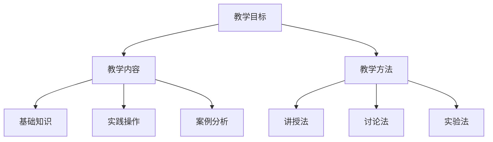

                 

关键词：知识付费、精品课程、课程开发、教学设计、程序员技能提升

> 摘要：本文将深入探讨程序员知识付费的现状、市场需求，以及如何打造具有吸引力的精品课程，从而帮助程序员更好地进行技能提升和职业发展。

## 1. 背景介绍

随着互联网和信息技术的快速发展，知识付费市场正在迅速崛起。越来越多的人开始意识到学习的重要性，尤其是在技术领域，不断更新的知识和技术让学习变得尤为紧迫。程序员作为技术领域的核心力量，知识付费对他们来说尤为重要。

知识付费市场的兴起，不仅为程序员提供了更多的学习机会，也为他们创造了新的收入来源。在这个背景下，如何打造具有吸引力的精品课程，成为了每个程序员都需要思考的问题。

### 1.1 程序员知识付费的现状

目前，程序员知识付费主要集中在以下三个方面：

1. **在线课程**：如慕课网、极客时间等平台提供的编程语言、框架、工具等课程。
2. **专业书籍**：针对具体技术的深入讲解和指导。
3. **实战项目**：通过实际项目操作，提升编程技能。

### 1.2 市场需求

程序员知识付费市场需求的增长，主要源于以下几个方面：

1. **技术更新快速**：新技术、新框架层出不穷，程序员需要不断学习以跟上时代。
2. **职业发展需求**：技能提升是程序员职业发展的关键，因此他们愿意为高质量的知识付费。
3. **学习方式多样化**：线上学习方式灵活、高效，成为程序员的首选。

## 2. 核心概念与联系

要打造精品课程，我们首先需要了解几个核心概念：

1. **教学目标**：明确课程希望学生达到的学习效果。
2. **教学内容**：包括基础知识、实践操作、案例分析等。
3. **教学方法**：如讲授、讨论、实验等。

### 2.1 教学目标

教学目标可以分为三个层次：

1. **知识掌握**：学生能够理解并掌握课程中的基础知识。
2. **技能提升**：学生能够通过实践操作，提升实际编程能力。
3. **思维拓展**：学生能够从不同角度思考问题，培养创新能力。

### 2.2 教学内容

教学内容可以分为以下几个部分：

1. **基础知识**：介绍编程语言、框架、工具等基础知识。
2. **实践操作**：通过实际操作，让学生掌握技能。
3. **案例分析**：通过案例分析，帮助学生理解实际应用场景。

### 2.3 教学方法

教学方法可以根据学生的特点和学习需求进行调整。常见的教学方法有：

1. **讲授法**：通过讲解，让学生理解知识。
2. **讨论法**：通过讨论，激发学生的思维。
3. **实验法**：通过实际操作，提升学生的技能。

### 2.4 Mermaid 流程图



## 3. 核心算法原理 & 具体操作步骤

### 3.1 算法原理概述

在课程开发中，算法原理是核心内容之一。以下是一个简单的算法原理概述：

1. **算法定义**：算法是一系列明确的操作步骤，用于解决特定问题。
2. **算法效率**：算法的效率是衡量其优劣的重要指标，包括时间复杂度和空间复杂度。
3. **算法分类**：常见的算法分类有排序算法、查找算法、图算法等。

### 3.2 算法步骤详解

以排序算法为例，以下是具体的算法步骤详解：

1. **选择排序**：从待排序的元素中选出最小（或最大）的元素，存放在序列的起始位置。
2. **冒泡排序**：重复遍历要排序的数列，一次比较两个元素，如果它们的顺序错误就把它们交换过来。
3. **快速排序**：通过一趟排序将待排序的记录分割成独立的两部分，其中一部分记录的关键字均比另一部分的关键字小，则可分别对这两部分记录继续进行排序。

### 3.3 算法优缺点

每种算法都有其优缺点：

- **选择排序**：简单易懂，但效率较低。
- **冒泡排序**：效率稍好于选择排序，但仍然较低。
- **快速排序**：效率较高，但可能会出现最坏情况。

### 3.4 算法应用领域

排序算法在各个领域都有广泛的应用，如数据库排序、算法竞赛、数据分析和算法面试等。

## 4. 数学模型和公式 & 详细讲解 & 举例说明

### 4.1 数学模型构建

在课程开发中，数学模型是重要的工具。以下是一个简单的数学模型构建过程：

1. **问题分析**：明确需要解决的问题。
2. **假设条件**：根据问题分析，设定合理的假设条件。
3. **公式推导**：根据假设条件，推导出解决问题的公式。

### 4.2 公式推导过程

以线性规划问题为例，以下是公式推导过程：

1. **目标函数**：最大化或最小化某个线性函数。
2. **约束条件**：约束条件通常是线性不等式或等式。
3. **求解方法**：利用线性规划求解器，求解最优解。

### 4.3 案例分析与讲解

以下是一个简单的线性规划案例：

1. **问题**：给定一个线性函数，求解其最大值。
2. **约束条件**：\(x + y \leq 10\)，\(x \geq 0\)，\(y \geq 0\)。
3. **求解**：利用线性规划求解器，求解最优解。

```latex
\text{目标函数}：\max z = x + y
\text{约束条件}：
\begin{cases}
x + y \leq 10 \\
x \geq 0 \\
y \geq 0
\end{cases}
```

## 5. 项目实践：代码实例和详细解释说明

### 5.1 开发环境搭建

在开始代码实践之前，我们需要搭建一个合适的开发环境。以下是一个简单的步骤：

1. **安装操作系统**：选择一个合适的操作系统，如Ubuntu。
2. **安装开发工具**：安装代码编辑器，如Visual Studio Code。
3. **安装编程语言**：安装Python、Java等编程语言。

### 5.2 源代码详细实现

以下是一个简单的Python程序，用于计算斐波那契数列：

```python
def fibonacci(n):
    if n <= 0:
        return 0
    elif n == 1:
        return 1
    else:
        return fibonacci(n-1) + fibonacci(n-2)

print(fibonacci(10))
```

### 5.3 代码解读与分析

这段代码实现了斐波那契数列的计算。以下是代码的详细解读：

1. **函数定义**：定义了一个名为`fibonacci`的函数，参数为`n`。
2. **递归调用**：通过递归调用，实现了斐波那契数列的计算。
3. **打印结果**：调用函数，并打印结果。

### 5.4 运行结果展示

运行这段代码，可以得到斐波那契数列的第10个数：

```
55
```

## 6. 实际应用场景

### 6.1 数据分析和数据可视化

在数据分析领域，知识付费课程可以帮助程序员掌握数据清洗、数据分析、数据可视化等技能。这些技能在实际工作中具有重要意义，如商业智能分析、大数据处理等。

### 6.2 人工智能和机器学习

随着人工智能和机器学习技术的发展，相关的知识付费课程需求也在不断增加。程序员可以通过这些课程，学习到深度学习、神经网络、自然语言处理等前沿技术。

### 6.3 云计算和容器技术

云计算和容器技术在企业中的应用越来越广泛。程序员可以通过知识付费课程，学习到云计算平台的使用、容器技术的部署等，为企业的数字化转型提供支持。

## 7. 工具和资源推荐

### 7.1 学习资源推荐

- **慕课网**：提供丰富的编程课程，涵盖Python、Java、前端开发等多个领域。
- **极客时间**：提供高质量的技术专栏，涵盖编程语言、框架、算法等多个方面。

### 7.2 开发工具推荐

- **Visual Studio Code**：一款强大的代码编辑器，支持多种编程语言。
- **Git**：版本控制系统，用于代码管理。

### 7.3 相关论文推荐

- 《深度学习》（Deep Learning）：介绍深度学习的基础理论和应用。
- 《人工智能：一种现代的方法》（Artificial Intelligence: A Modern Approach）：全面介绍人工智能的基础知识。

## 8. 总结：未来发展趋势与挑战

### 8.1 研究成果总结

近年来，程序员知识付费市场快速发展，为程序员提供了丰富的学习资源。同时，在线课程、实战项目等学习方式也越来越受到认可。

### 8.2 未来发展趋势

1. **课程内容多样化**：未来知识付费课程将涵盖更多领域，满足不同程序员的学习需求。
2. **个性化学习**：通过大数据分析和人工智能技术，实现个性化学习。
3. **跨界融合**：知识付费将与其他领域（如商业、艺术等）融合，推动跨领域创新。

### 8.3 面临的挑战

1. **内容质量**：保证课程内容的质量，是知识付费市场的关键挑战。
2. **版权问题**：合理处理版权问题，避免侵权纠纷。
3. **用户信任**：建立用户信任，提高用户忠诚度。

### 8.4 研究展望

未来，程序员知识付费市场将继续发展，为程序员提供更多学习机会。同时，课程开发者和平台也将面临更多挑战，需要不断创新，满足用户需求。

## 9. 附录：常见问题与解答

### 9.1 如何选择适合自己的课程？

1. **明确学习目标**：根据职业发展需求，选择合适的课程。
2. **了解课程内容**：查看课程大纲，了解课程涵盖的内容。
3. **参考用户评价**：查看其他学员的评价，了解课程质量。

### 9.2 课程学习过程中遇到困难怎么办？

1. **查阅资料**：查阅相关文档、博客等资料，寻求帮助。
2. **参与社区**：加入课程社区，与其他学员交流，共同解决问题。
3. **寻求导师指导**：如果条件允许，可以寻求导师的指导。

作者：禅与计算机程序设计艺术 / Zen and the Art of Computer Programming
----------------------------------------------------------------
文章撰写完毕。接下来，我会按照markdown格式对文章进行排版和优化，确保文章结构清晰，内容易于阅读。请稍候。

