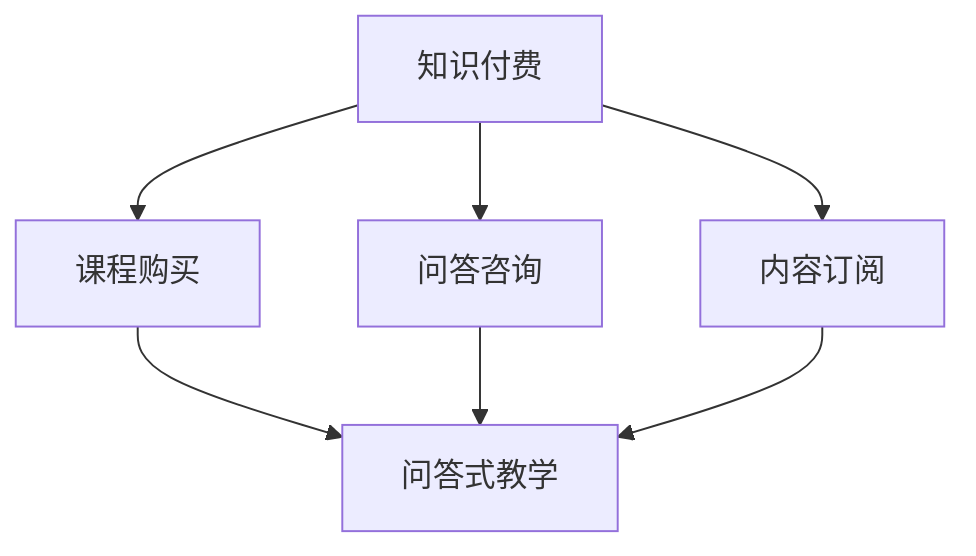

                 

关键词：程序员知识付费、问答式教学、在线教育、知识共享、知识付费模式

> 摘要：随着互联网技术的发展，知识付费成为了一种新的趋势。本文旨在探讨如何通过问答式教学这一模式，帮助程序员实现知识付费，并提升个人职业发展。

## 1. 背景介绍

知识付费，顾名思义，是指用户为获取特定的知识内容而付费的一种商业模式。这种模式在近年来得到了快速发展，特别是在在线教育领域。随着互联网技术的普及，人们可以更加便捷地获取知识，而知识付费则为知识的提供者提供了新的收入来源。

与此同时，问答式教学作为一种互动性强的教学方法，也逐渐受到了教育工作者的青睐。问答式教学强调师生之间的互动和沟通，能够更好地激发学生的学习兴趣，提高学习效果。在知识付费的大背景下，问答式教学无疑为程序员提供了新的学习和提升机会。

## 2. 核心概念与联系

### 2.1 知识付费

知识付费的核心在于用户为获取知识内容而付费。这种模式通常包括以下几种类型：

1. **课程购买**：用户为特定课程付费，以获取课程的内容和讲解。
2. **问答咨询**：用户为专家提供的咨询服务付费，以解决特定问题。
3. **内容订阅**：用户为获取特定领域的内容更新和资讯付费。

### 2.2 问答式教学

问答式教学是一种基于互动和沟通的教学模式。其核心在于教师和学生之间的双向交流，通过问答的形式激发学生的学习兴趣和思考能力。问答式教学通常包括以下几个环节：

1. **问题提出**：学生根据学习需求提出问题。
2. **问题解答**：教师针对学生的问题进行解答。
3. **互动讨论**：学生和教师就问题进行深入讨论。

### 2.3 知识付费与问答式教学的联系

知识付费与问答式教学之间存在密切的联系。知识付费为问答式教学提供了经济支持，使得教师可以更专注于教学内容和质量的提升。而问答式教学则为知识付费提供了有效的教学方式，能够更好地满足用户的需求。

### 2.4 Mermaid 流程图



## 3. 核心算法原理 & 具体操作步骤

### 3.1 算法原理概述

问答式教学的核心在于如何构建一个高效的知识传播和互动平台。以下是问答式教学的基本原理：

1. **问题驱动**：学生的学习过程应围绕问题展开，通过提出和解答问题来推动学习。
2. **互动交流**：教师和学生之间的互动和沟通是问答式教学的关键，通过问答和讨论来激发学生的学习兴趣和思考能力。
3. **个性化学习**：根据学生的学习需求和问题，提供个性化的教学服务。

### 3.2 算法步骤详解

1. **问题收集**：收集学生的学习问题，可以通过在线问卷、论坛讨论等方式进行。
2. **问题筛选**：筛选出具有代表性和价值的问题，进行分类和整理。
3. **问题解答**：针对筛选出的问题，由教师或专家进行解答。
4. **互动讨论**：学生和教师就问题进行深入讨论，形成知识共享和交流的平台。

### 3.3 算法优缺点

**优点**：

1. **高效互动**：问答式教学能够实现师生之间的高效互动，提高学习效果。
2. **个性化学习**：根据学生的学习需求和问题，提供个性化的教学服务。
3. **知识共享**：通过问答和讨论，形成知识共享和交流的平台。

**缺点**：

1. **成本较高**：问答式教学需要专业的教师和专家进行解答，成本相对较高。
2. **互动质量**：互动质量受到教师和学生的水平影响，可能存在质量不高的情况。

### 3.4 算法应用领域

问答式教学在在线教育、专业咨询、学术研究等领域都有广泛应用。例如，在线教育平台可以通过问答式教学提供个性化的课程辅导，专业咨询公司可以通过问答式教学提供咨询服务，学术研究机构可以通过问答式教学促进学术交流。

## 4. 数学模型和公式 & 详细讲解 & 举例说明

### 4.1 数学模型构建

问答式教学的数学模型可以从以下几个方面进行构建：

1. **互动质量模型**：衡量师生互动的质量，可以通过用户评分、互动频率等指标进行评估。
2. **个性化学习模型**：根据学生的学习需求和问题，构建个性化学习路径。
3. **知识共享模型**：通过问答和讨论形成知识共享和交流的平台。

### 4.2 公式推导过程

以下是一个简单的互动质量模型公式：

$$
Q = f(I, T, R)
$$

其中，$Q$ 表示互动质量，$I$ 表示互动频率，$T$ 表示教师水平，$R$ 表示学生满意度。

### 4.3 案例分析与讲解

假设一个问答式教学平台，其互动频率 $I$ 为每周 10 次，教师水平 $T$ 为 4.5 分（满分 5 分），学生满意度 $R$ 为 80%。根据公式计算互动质量：

$$
Q = f(10, 4.5, 0.8) = 4.32
$$

这意味着该平台的互动质量为 4.32 分。通过这个模型，我们可以对问答式教学的质量进行评估，以便进行改进和优化。

## 5. 项目实践：代码实例和详细解释说明

### 5.1 开发环境搭建

首先，我们需要搭建一个问答式教学平台。这里，我们使用 Python 搭建一个简单的问答式教学系统。以下是开发环境搭建的步骤：

1. 安装 Python（建议使用 Python 3.8 或以上版本）。
2. 安装必要的 Python 库，如 Flask（用于构建 Web 应用程序）、SQLAlchemy（用于数据库操作）等。
3. 配置数据库（这里我们使用 SQLite 数据库）。

### 5.2 源代码详细实现

以下是问答式教学平台的源代码实现：

```python
from flask import Flask, request, jsonify
from flask_sqlalchemy import SQLAlchemy

app = Flask(__name__)
app.config['SQLALCHEMY_DATABASE_URI'] = 'sqlite:///questions.db'
db = SQLAlchemy(app)

class Question(db.Model):
    id = db.Column(db.Integer, primary_key=True)
    title = db.Column(db.String(100), nullable=False)
    content = db.Column(db.Text, nullable=False)
    answered = db.Column(db.Boolean, default=False)

@app.route('/questions', methods=['POST'])
def add_question():
    title = request.form['title']
    content = request.form['content']
    question = Question(title=title, content=content)
    db.session.add(question)
    db.session.commit()
    return jsonify({'message': 'Question added successfully.'})

@app.route('/questions/<int:question_id>', methods=['GET'])
def get_question(question_id):
    question = Question.query.get_or_404(question_id)
    return jsonify({'title': question.title, 'content': question.content, 'answered': question.answered})

@app.route('/questions/<int:question_id>/answer', methods=['POST'])
def answer_question(question_id):
    question = Question.query.get_or_404(question_id)
    question.answered = True
    db.session.commit()
    return jsonify({'message': 'Question answered successfully.'})

if __name__ == '__main__':
    db.create_all()
    app.run(debug=True)
```

### 5.3 代码解读与分析

1. **数据库模型**：我们使用 SQLAlchemy 定义了一个名为 `Question` 的数据库模型，用于存储问题和答案的信息。
2. **API 接口**：我们定义了三个 API 接口：
   - `/questions`：用于添加问题。
   - `/questions/<int:question_id>`：用于获取特定问题。
   - `/questions/<int:question_id>/answer`：用于回答问题。
3. **功能实现**：通过这三个 API 接口，我们可以实现问答式教学的基本功能，包括添加问题、获取问题和回答问题。

### 5.4 运行结果展示

假设我们通过命令行运行上述代码，然后使用 curl 命令与 API 进行交互：

```bash
# 添加问题
curl -X POST -F "title=What is Flask?" -F "content=How can I use Flask to build a Web application?" http://localhost:5000/questions

# 获取问题
curl -X GET http://localhost:5000/questions/1

# 回答问题
curl -X POST -d "question_id=1" http://localhost:5000/questions/1/answer
```

通过这些交互，我们可以看到问答式教学平台的基本功能已经实现。

## 6. 实际应用场景

问答式教学在程序员知识付费领域有着广泛的应用。以下是几个实际应用场景：

1. **在线教育平台**：在线教育平台可以通过问答式教学提供个性化的课程辅导，帮助学生解决学习中的问题。
2. **技术咨询平台**：技术咨询平台可以通过问答式教学提供专业咨询服务，帮助用户解决技术难题。
3. **开源社区**：开源社区可以通过问答式教学促进开发者之间的交流和学习，提升社区整体的技术水平。

## 7. 工具和资源推荐

为了更好地实现问答式教学，我们可以推荐以下工具和资源：

1. **学习资源推荐**：
   - Coursera：提供各种在线课程，涵盖多个领域。
   - edX：由哈佛大学和麻省理工学院创办，提供高质量的在线课程。
2. **开发工具推荐**：
   - Flask：一个轻量级的 Web 开发框架，适合快速搭建问答式教学平台。
   - SQLAlchemy：一个 Python 的数据库ORM工具，用于简化数据库操作。
3. **相关论文推荐**：
   - "问答式教学模式在在线教育中的应用研究"
   - "知识付费背景下问答式教学的优化策略"

## 8. 总结：未来发展趋势与挑战

### 8.1 研究成果总结

随着知识付费和问答式教学的普及，越来越多的研究者关注这一领域，并取得了显著的研究成果。例如，研究者通过数学模型和算法对问答式教学的质量进行了评估，提出了优化策略。

### 8.2 未来发展趋势

1. **技术融合**：随着人工智能和大数据技术的发展，问答式教学将更加智能化和个性化。
2. **多元化场景**：问答式教学将在更多场景中应用，如企业培训、学术交流等。

### 8.3 面临的挑战

1. **质量控制**：如何保证问答式教学的质量，是当前面临的一大挑战。
2. **商业模式**：如何设计合适的商业模式，实现知识付费的可持续性。

### 8.4 研究展望

未来，研究者应关注以下几个方面：

1. **算法优化**：进一步优化问答式教学的算法，提高教学效果。
2. **场景拓展**：探索问答式教学在更多领域的应用，提高其适用性。

## 9. 附录：常见问题与解答

### 9.1 问题1：问答式教学与传统教学有什么区别？

**解答**：问答式教学与传统教学相比，更加注重师生之间的互动和沟通。传统教学往往以教师为中心，学生被动接受知识；而问答式教学则强调学生的主动参与和思考，通过提问和解答来推动学习。

### 9.2 问题2：如何保证问答式教学的质量？

**解答**：保证问答式教学的质量需要从多个方面入手，包括教师的选择、问题的筛选、教学内容的策划等。例如，可以选择经验丰富的教师，确保问题的针对性和解答的专业性。

### 9.3 问题3：问答式教学是否适用于所有学科？

**解答**：问答式教学在一定程度上适用于所有学科，但其适用性取决于学科的特点和学生的需求。对于需要大量理论知识的学科，问答式教学可能效果不佳；而对于实践性强的学科，如计算机科学、工程等，问答式教学则具有很大的优势。

### 9.4 问题4：问答式教学能否替代传统教学？

**解答**：问答式教学不能完全替代传统教学，但可以作为传统教学的补充。问答式教学能够更好地满足学生的个性化需求，提高学习效果，而传统教学则在系统性和全面性方面具有优势。两者结合，可以发挥各自的优势，提高教学质量。

### 作者署名

作者：禅与计算机程序设计艺术 / Zen and the Art of Computer Programming

----------------------------------------------------------------


