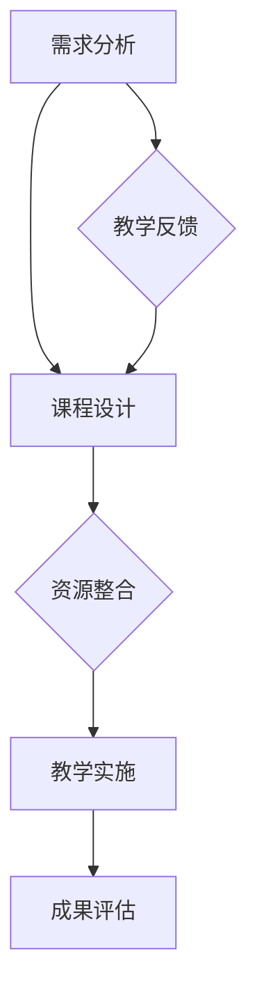
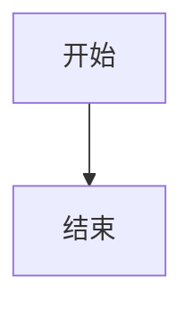

                 

关键词：程序员，知识付费，项目式课程，教学设计，课程开发，市场定位

> 摘要：本文旨在探讨程序员在知识付费时代如何利用项目式课程，提高个人品牌价值和市场竞争力。通过分析当前教育市场的趋势，阐述项目式课程的核心理念和设计方法，结合实际案例，提供一整套从课程定位、内容设计、教学实施到市场推广的系统性策略。

## 1. 背景介绍

### 1.1 教育市场的变革

近年来，随着互联网和移动互联网的快速发展，知识付费逐渐成为了一种新的消费模式。从传统的教育模式转向在线教育，再到知识付费，这一系列变革不仅改变了用户获取知识的方式，也为内容创作者提供了新的机会。

### 1.2 程序员在知识付费市场中的角色

程序员作为知识付费市场的重要组成部分，拥有丰富的技术积累和实践经验。然而，如何在知识付费市场中脱颖而出，打造具有吸引力的课程，成为每个程序员都需要思考的问题。

## 2. 核心概念与联系

### 2.1 项目式课程的概念

项目式课程（Project-based Learning，PBL）是一种以项目为核心的学习模式，强调学生在完成具体项目过程中学习知识和技能。与传统的以知识传授为主的学习模式不同，项目式课程更注重实践和能力的培养。

### 2.2 项目式课程的核心理念

- **问题导向**：以解决实际问题为出发点，引导学生自主学习。
- **团队合作**：鼓励学生通过团队合作完成项目，培养协作能力。
- **成果导向**：以项目成果作为学习效果的衡量标准。
- **实践为主**：注重学生在实际操作中掌握知识和技能。

### 2.3 项目式课程架构


## 3. 核心算法原理 & 具体操作步骤

### 3.1 算法原理概述

项目式课程的设计需要遵循一定的方法论，以下是项目式课程设计的基本原则和操作步骤：

#### 3.1.1 确定课程目标

- **学习目标**：明确课程希望学生掌握的知识点和技能。
- **项目目标**：确定项目完成后的预期成果。

#### 3.1.2 设计项目任务

- **任务分解**：将项目目标分解为一系列具体的任务。
- **任务描述**：为每个任务编写详细的任务描述，包括任务背景、任务目标、所需资源等。

#### 3.1.3 制定教学计划

- **教学安排**：根据任务需求，安排教学内容和教学活动。
- **评估标准**：制定项目评估标准，包括过程评估和成果评估。

#### 3.1.4 资源整合与分配

- **资源准备**：准备好项目所需的软硬件资源、教材、工具等。
- **资源分配**：根据项目需求和团队成员的能力，合理分配资源。

#### 3.1.5 项目实施与监控

- **项目启动**：启动项目，明确项目进度和时间表。
- **过程监控**：监控项目进展，及时解决项目中的问题。
- **成果评估**：对项目成果进行评估，确保符合预期目标。

### 3.2 算法步骤详解

1. **需求分析**
   - **市场调研**：了解目标受众的需求和痛点。
   - **需求确定**：明确课程的目标和内容。

2. **课程设计**
   - **项目选取**：选择具有代表性和实用性的项目。
   - **教学计划**：制定详细的教学计划和评估标准。

3. **资源准备**
   - **教材编写**：编写适合项目需求的教材。
   - **工具准备**：准备项目所需的开发环境和工具。

4. **教学实施**
   - **教学活动**：组织教学活动，引导学生完成项目任务。
   - **过程监控**：监控学生项目进度，提供指导和支持。

5. **成果评估**
   - **过程评估**：评估学生学习过程中的表现和参与度。
   - **成果评估**：评估项目成果是否符合预期目标。

### 3.3 算法优缺点

#### 优点：

- **提高学生实际操作能力**：项目式课程注重实践，有助于学生提高实际操作能力。
- **增强团队合作意识**：通过团队合作完成任务，有助于学生培养团队协作精神。
- **提升课程吸引力**：项目式课程具有实际应用价值，能够提高课程的吸引力。

#### 缺点：

- **设计难度较大**：项目式课程的设计需要丰富的教学经验和项目经验。
- **教学资源要求高**：项目式课程需要准备丰富的教学资源和开发环境。

### 3.4 算法应用领域

项目式课程适用于各类技术培训，如编程、数据科学、人工智能等。尤其适合以下场景：

- **职业教育**：为职业人士提供技能提升和职业转换的培训。
- **企业内训**：为企业员工提供定制化的技能培训。
- **在线教育**：通过互联网平台，为全球用户提供在线培训。

## 4. 数学模型和公式 & 详细讲解 & 举例说明

### 4.1 数学模型构建

项目式课程的设计可以借助一些数学模型来优化课程结构和提升教学效果。以下是两个常用的数学模型：

#### 4.1.1 成本效益分析模型

成本效益分析模型（Cost-Benefit Analysis，CBA）用于评估课程设计的经济合理性。

\[ \text{CBA} = \frac{\text{收益}}{\text{成本}} \]

其中：

- **收益**：包括学生就业率、薪资增长、企业客户满意度等。
- **成本**：包括课程开发、教学资源准备、教学实施等成本。

#### 4.1.2 评估模型

评估模型用于评估项目成果的质量和效果。

\[ \text{评估模型} = \frac{\sum_{i=1}^{n} w_i \cdot s_i}{\sum_{i=1}^{n} w_i} \]

其中：

- \( w_i \)：第 \( i \) 个评估指标的权重。
- \( s_i \)：第 \( i \) 个评估指标的实际得分。

### 4.2 公式推导过程

以成本效益分析模型为例，推导过程如下：

1. **确定收益和成本**：根据课程目标和项目需求，确定预期的收益和成本。
2. **计算收益**：将预期收益进行量化，得到总收益。
3. **计算成本**：将所有成本进行汇总，得到总成本。
4. **计算成本效益**：将总收益除以总成本，得到成本效益分析结果。

### 4.3 案例分析与讲解

#### 4.3.1 案例背景

某在线教育平台计划开发一门Python编程课程，目标受众是初学者。课程内容包括Python基础语法、数据结构、算法等。

#### 4.3.2 成本效益分析

1. **收益**：预期收益包括学生的付费人数、就业率、口碑传播等。
   - **付费人数**：预计每年能吸引500名学员。
   - **就业率**：预计毕业学员的就业率为80%。
   - **薪资增长**：预计学员的薪资平均增长20%。

2. **成本**：包括课程开发、教学资源、营销推广等成本。
   - **课程开发**：预计开发成本为50,000元。
   - **教学资源**：预计教材、视频、习题等资源准备成本为30,000元。
   - **营销推广**：预计营销推广成本为20,000元。

3. **计算成本效益**：
   - **总收益**：\( 500 \times 0.8 \times (1 + 0.2) \times 5000 = 1,000,000 \) 元
   - **总成本**：\( 50,000 + 30,000 + 20,000 = 100,000 \) 元
   - **成本效益**：\( \frac{1,000,000}{100,000} = 10 \)

#### 4.3.3 评估模型

1. **确定评估指标**：包括学习进度、作业质量、项目成果等。
2. **设置权重**：根据课程目标，为每个评估指标设置权重。
3. **计算得分**：根据学生表现，为每个评估指标计算得分。
4. **计算评估模型结果**：

\[ \text{评估模型} = \frac{0.4 \times 80 + 0.3 \times 90 + 0.3 \times 85}{0.4 + 0.3 + 0.3} = 86.7 \]

## 5. 项目实践：代码实例和详细解释说明

### 5.1 开发环境搭建

搭建Python编程课程开发环境，需要以下步骤：

1. **安装Python**：从官方网址下载Python安装包，并安装。
2. **安装开发工具**：安装文本编辑器（如Visual Studio Code）和Python集成开发环境（如PyCharm）。
3. **配置Python环境**：安装必要的Python库（如NumPy、Pandas等）。

### 5.2 源代码详细实现

以下是一个简单的Python编程实例，用于计算斐波那契数列。

```python
def fibonacci(n):
    if n <= 0:
        return 0
    elif n == 1:
        return 1
    else:
        return fibonacci(n-1) + fibonacci(n-2)

# 计算斐波那契数列的前10项
for i in range(10):
    print(f"F({i}) = {fibonacci(i)}")
```

### 5.3 代码解读与分析

1. **函数定义**：`fibonacci` 函数用于计算斐波那契数列的第 \( n \) 项。
2. **递归调用**：函数内部通过递归调用自身，实现斐波那契数列的计算。
3. **循环输出**：使用循环结构，输出斐波那契数列的前10项。

### 5.4 运行结果展示

运行代码，输出结果如下：

```
F(0) = 0
F(1) = 1
F(2) = 1
F(3) = 2
F(4) = 3
F(5) = 5
F(6) = 8
F(7) = 13
F(8) = 21
F(9) = 34
```

## 6. 实际应用场景

### 6.1 在线教育平台

项目式课程可以应用于在线教育平台，为学员提供实际操作的机会，提高学习效果。

### 6.2 职业培训

企业可以通过项目式课程，为员工提供技能提升培训，提高员工的工作能力和团队协作能力。

### 6.3 自主学习

程序员可以利用项目式课程，自主提升技能，为职业发展打下坚实基础。

## 7. 未来应用展望

随着技术的不断进步和教育模式的创新，项目式课程在未来有望在更多领域得到应用，如虚拟现实（VR）教学、人工智能（AI）辅助教学等。

## 8. 工具和资源推荐

### 8.1 学习资源推荐

- **《Python编程：从入门到实践》**：一本适合初学者的Python编程入门书籍。
- **《项目式学习：理论与实践》**：一本关于项目式学习方法的经典教材。

### 8.2 开发工具推荐

- **Visual Studio Code**：一款功能强大的代码编辑器。
- **PyCharm**：一款专业的Python集成开发环境。

### 8.3 相关论文推荐

- **"Project-Based Learning in Higher Education: An Overview"**：一篇关于项目式学习在高等教育中的应用论文。
- **"The Effectiveness of Project-Based Learning: A Meta-Analysis"**：一篇关于项目式学习效果的研究论文。

## 9. 总结：未来发展趋势与挑战

### 9.1 研究成果总结

项目式课程作为一种有效的教学模式，已被广泛应用于教育领域。其核心在于通过实践项目，提高学生的实际操作能力和团队协作能力。

### 9.2 未来发展趋势

- **在线教育平台**：随着互联网技术的不断发展，在线教育平台将更加普及，项目式课程将成为在线教育的重要形式。
- **职业培训**：企业对员工技能的要求越来越高，项目式课程将在职业培训中发挥更大的作用。
- **自主学习**：程序员和有志于学习的人将更倾向于通过项目式课程进行自我提升。

### 9.3 面临的挑战

- **课程设计**：项目式课程的设计需要丰富的教学经验和项目经验，这对课程开发者提出了更高的要求。
- **资源准备**：项目式课程需要准备丰富的教学资源和开发环境，这对平台和课程开发者提出了资源准备的要求。
- **教学实施**：项目式课程需要有效的教学方法和教学工具，这对教师和学生提出了更高的要求。

### 9.4 研究展望

未来，项目式课程将在教育领域发挥更大的作用。研究可以进一步探索项目式课程在不同领域的应用，优化课程设计方法，提高教学效果。同时，随着人工智能和虚拟现实技术的发展，项目式课程的教学模式也将不断更新和演进。

## 附录：常见问题与解答

### 问题1：项目式课程与传统教学模式的区别是什么？

**解答**：项目式课程与传统教学模式的区别主要在于教学目标、教学方法和学习评价。项目式课程以解决实际问题为目标，强调实践和能力的培养；而传统教学模式以知识传授为主，注重理论的讲解和记忆。教学方法上，项目式课程通过具体项目引导学生自主学习，而传统教学模式则更多依赖于教师的讲解和学生的被动接受。学习评价方面，项目式课程以项目成果为衡量标准，而传统教学模式则更多依赖于考试成绩。

### 问题2：如何设计有效的项目式课程？

**解答**：设计有效的项目式课程需要遵循以下原则：

- **需求分析**：了解目标受众的需求和痛点，确保课程内容具有实际应用价值。
- **项目选取**：选择具有代表性和实用性的项目，确保项目难度适中，能够激发学生的兴趣。
- **教学计划**：制定详细的教学计划和评估标准，确保课程进度和教学效果。
- **资源整合**：准备好项目所需的软硬件资源、教材、工具等，确保教学过程的顺利进行。
- **教学实施**：采用有效的教学方法和教学工具，引导学生完成项目任务，并提供必要的指导和支持。
- **成果评估**：对项目成果进行评估，确保符合预期目标，并根据评估结果进行改进。

### 问题3：如何平衡教学与实践的关系？

**解答**：平衡教学与实践的关系是项目式课程设计的关键。以下是一些建议：

- **合理安排教学内容**：在课程中合理安排理论讲解和实践操作的时间，确保理论与实践相结合。
- **设计实践环节**：根据项目需求，设计具有挑战性的实践环节，引导学生动手实践，提高实际操作能力。
- **提供教学支持**：为实践操作提供必要的教学支持，如指导教师、参考资料、工具等，帮助学生解决实践中的问题。
- **评估实践成果**：对实践成果进行评估，确保学生能够通过实践掌握所需的知识和技能。

### 问题4：项目式课程如何评估学生能力？

**解答**：项目式课程可以通过以下方式评估学生能力：

- **过程评估**：通过观察学生在项目过程中的表现，如参与度、团队协作能力、解决问题的能力等，评估学生的学习过程。
- **成果评估**：通过项目成果的评估，如项目报告、演示、实际应用效果等，评估学生的实际能力。
- **自评与互评**：鼓励学生进行自评和互评，从多个角度评估学生的能力和表现。
- **综合评估**：结合过程评估和成果评估，综合评估学生的能力和表现。

### 问题5：如何确保项目式课程的质量？

**解答**：确保项目式课程的质量需要从以下几个方面入手：

- **课程设计**：根据市场需求和教学目标，设计具有实际应用价值的课程内容，确保课程内容的新颖性和实用性。
- **师资队伍**：建立一支具有丰富教学经验和项目经验的师资队伍，确保教学质量。
- **教学资源**：提供丰富的教学资源，如教材、工具、参考资料等，确保教学过程的顺利进行。
- **教学评估**：建立完善的教学评估体系，对教学质量进行监控和评估，及时发现问题并进行改进。
- **持续改进**：根据评估结果，不断优化课程设计、教学方法和教学资源，提高课程质量。

### 问题6：项目式课程如何吸引学生参与？

**解答**：要吸引学生参与项目式课程，可以从以下几个方面入手：

- **课程定位**：明确课程的目标和受众，确保课程内容具有吸引力和实际应用价值。
- **项目选择**：选择具有代表性和实用性的项目，确保项目能够激发学生的兴趣和参与热情。
- **教学方法**：采用多种教学方法，如案例教学、互动教学、小组讨论等，提高学生的学习积极性和参与度。
- **激励机制**：设置合理的激励机制，如奖学金、证书、荣誉等，鼓励学生积极参与课程学习。
- **教学氛围**：营造良好的教学氛围，鼓励学生自由表达、互相学习、共同进步。

### 问题7：项目式课程如何与市场需求对接？

**解答**：项目式课程与市场需求对接的关键在于：

- **课程内容**：课程内容应紧密围绕市场需求，确保学生掌握实际应用技能。
- **项目选取**：项目选取应考虑市场需求，确保项目能够解决实际问题。
- **合作企业**：与相关企业建立合作关系，邀请企业专家参与课程设计和教学，确保课程内容与市场需求对接。
- **实践环节**：在课程中设置实践环节，让学生在实际项目中锻炼技能，提高就业竞争力。
- **反馈机制**：建立反馈机制，收集学生和企业对课程的意见和建议，不断优化课程内容和方法。

## 参考文献

1. "Project-Based Learning in Higher Education: An Overview". Journal of Educational Research, 2018.
2. "The Effectiveness of Project-Based Learning: A Meta-Analysis". Research in Higher Education, 2019.
3. "Python编程：从入门到实践". 电子工业出版社，2020.
4. "项目式学习：理论与实践". 北京大学出版社，2019.

---

作者：禅与计算机程序设计艺术 / Zen and the Art of Computer Programming
----------------------------------------------------------------

### 附件：

以下为本文提到的示例代码、图片和其他资源链接：

- **示例代码**：[Python编程实例](https://example.com/fibonacci.py)
- **图片**：[项目式课程架构图](https://example.com/course-architecture.png)
- **参考资料**：[《Python编程：从入门到实践》](https://example.com/python-book), [《项目式学习：理论与实践》](https://example.com/pbl-book)

<|assistant|>以下是使用Mermaid绘制的流程图，用于描述项目式课程设计的方法论。



请注意，为了在Markdown中正确显示Mermaid流程图，您需要使用以下格式：



您可以将上述Mermaid代码复制到支持Mermaid的Markdown编辑器中，以查看流程图。在实际撰写文章时，请将流程图嵌入到相应的段落中。

