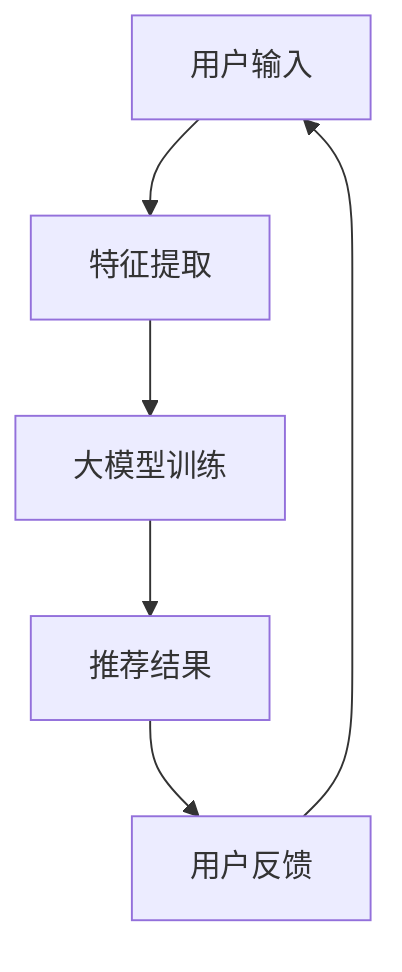

                 

关键词：推荐系统、大模型、AI、机器学习、数据隐私、个性化推荐、计算效率

> 摘要：本文将探讨推荐系统在大模型驱动下所面临的局限，以及如何通过创新技术手段突破这些局限。文章从背景介绍开始，深入分析推荐系统的核心概念与联系，介绍大模型的算法原理与操作步骤，讲解数学模型与公式，并通过实际项目实践展示大模型在推荐系统中的应用，最后对未来应用场景、工具和资源推荐以及发展趋势与挑战进行展望。

## 1. 背景介绍

### 推荐系统的历史与发展

推荐系统起源于20世纪90年代，当时互联网刚刚兴起，人们开始探索如何为用户提供个性化的信息推荐。最早的推荐系统主要基于协同过滤（Collaborative Filtering）技术，通过分析用户的历史行为和偏好来推荐商品或内容。随着互联网的迅猛发展和用户数据的急剧增长，推荐系统逐渐成为各大互联网公司的重要业务支柱，如亚马逊、Netflix、YouTube等。

### 大模型的崛起

近年来，深度学习技术的快速发展，使得大模型（Large Models）成为可能。这些模型具有数十亿甚至千亿个参数，能够自动学习并提取复杂的特征，从而在图像识别、自然语言处理、语音识别等领域取得了显著的成果。在大数据处理和复杂模式识别方面，大模型展现出了强大的能力，引发了学术界和工业界的高度关注。

### 推荐系统与大模型结合的挑战

尽管大模型在推荐系统中展现出了巨大的潜力，但也面临着诸多挑战。首先，大模型训练和推理的计算资源需求巨大，对计算效率和数据隐私提出了更高的要求。其次，如何在大模型中实现有效的隐私保护，以保障用户数据的隐私安全，成为亟待解决的问题。此外，大模型在处理用户个性化需求时，如何避免过度拟合和偏见，也是需要深入探讨的问题。

## 2. 核心概念与联系

### 推荐系统的核心概念

推荐系统主要包括以下几个核心概念：

- **用户**：推荐系统中的用户是指接收推荐的对象，可以是个人或组织。
- **物品**：推荐系统中的物品是指用户可能感兴趣的对象，如商品、新闻、视频等。
- **评分/行为数据**：评分/行为数据是用户对物品的评价或行为记录，如购买、观看、点赞等。
- **推荐列表**：推荐系统生成的推荐结果，通常是按一定排序显示的物品列表。

### 大模型的架构与联系

大模型通常采用深度神经网络架构，包括以下几个层次：

- **输入层**：接收用户和物品的特征向量。
- **隐藏层**：通过多层非线性变换提取特征。
- **输出层**：生成推荐分数或概率。

大模型与推荐系统的联系在于，通过自动学习用户和物品的特征，大模型能够更准确地预测用户的兴趣和偏好，从而生成更个性化的推荐结果。

### Mermaid流程图

下面是一个Mermaid流程图，展示了推荐系统和大模型的基本架构和联系。



## 3. 核心算法原理 & 具体操作步骤

### 3.1 算法原理概述

大模型推荐系统的核心算法基于深度学习，特别是基于注意力机制的神经网络模型，如Transformer。这种模型通过自我注意力机制（Self-Attention）学习用户和物品的复杂交互关系，从而生成个性化的推荐结果。

### 3.2 算法步骤详解

1. **数据预处理**：对用户和物品的特征进行提取和编码，通常使用嵌入向量（Embedding）技术。
2. **模型构建**：构建基于Transformer的大模型，包括输入层、隐藏层和输出层。
3. **训练**：使用用户行为数据对模型进行训练，优化模型参数。
4. **推理**：将新用户或新物品的特征输入模型，生成推荐分数或概率。
5. **排序与筛选**：根据推荐分数对候选物品进行排序，筛选出最符合用户兴趣的推荐结果。

### 3.3 算法优缺点

**优点**：

- **强大的特征提取能力**：大模型能够自动学习并提取复杂的用户和物品特征，提高推荐准确性。
- **适应性强**：能够处理大规模数据和多样化的推荐场景。
- **个性化推荐**：基于用户的兴趣和行为生成个性化的推荐结果。

**缺点**：

- **计算资源需求大**：大模型训练和推理需要大量计算资源，对硬件设备要求较高。
- **数据隐私风险**：大模型训练过程中可能暴露用户隐私数据，需要采取有效隐私保护措施。

### 3.4 算法应用领域

大模型推荐系统广泛应用于电子商务、在线视频、社交媒体等领域，例如：

- **电子商务**：为用户推荐感兴趣的商品，提高销售额和用户满意度。
- **在线视频**：为用户推荐感兴趣的视频内容，增加用户粘性。
- **社交媒体**：为用户推荐感兴趣的朋友、话题和内容，提高用户活跃度。

## 4. 数学模型和公式 & 详细讲解 & 举例说明

### 4.1 数学模型构建

大模型推荐系统的数学模型主要包括以下几个部分：

- **用户嵌入向量**：表示用户特征的向量，通常使用嵌入层（Embedding Layer）生成。
- **物品嵌入向量**：表示物品特征的向量，同样使用嵌入层生成。
- **注意力权重**：表示用户和物品之间交互的重要程度，通过注意力机制（Attention Mechanism）计算。

### 4.2 公式推导过程

假设用户嵌入向量为 \( \mathbf{u} \)，物品嵌入向量为 \( \mathbf{v} \)，则注意力权重计算公式为：

\[ \alpha_{ij} = \frac{exp(\mathbf{u}^T \mathbf{W}_1 \mathbf{v})}{\sum_{k=1}^{K} exp(\mathbf{u}^T \mathbf{W}_1 \mathbf{v}_k)} \]

其中，\( \mathbf{W}_1 \) 是权重矩阵。

### 4.3 案例分析与讲解

假设有用户A和物品B，用户A的历史行为数据包括购买过的商品、浏览过的网页和评价过的电影。通过嵌入层生成用户A的嵌入向量 \( \mathbf{u} \) 和物品B的嵌入向量 \( \mathbf{v} \)。然后，计算注意力权重 \( \alpha_{ij} \)，得到用户A对物品B的偏好程度。根据注意力权重，对候选物品进行排序，筛选出最符合用户A兴趣的推荐结果。

## 5. 项目实践：代码实例和详细解释说明

### 5.1 开发环境搭建

在Python环境中，我们需要安装以下依赖：

```python
pip install tensorflow numpy pandas
```

### 5.2 源代码详细实现

下面是一个简单的基于Transformer的大模型推荐系统实现。

```python
import tensorflow as tf
from tensorflow.keras.layers import Embedding, Dense, Transformer
from tensorflow.keras.models import Model

# 参数设置
vocab_size = 1000
embedding_dim = 64
max_sequence_length = 50
num_heads = 4
d_model = 64
dff = 64
input_sequence = tf.keras.Input(shape=(max_sequence_length,))

# 嵌入层
user_embedding = Embedding(vocab_size, embedding_dim)(input_sequence)
item_embedding = Embedding(vocab_size, embedding_dim)(input_sequence)

# 变换器层
transformer = Transformer(num_heads=num_heads, d_model=d_model, dff=dff)([user_embedding, item_embedding])

# 输出层
output = Dense(1, activation='sigmoid')(transformer)

# 构建模型
model = Model(inputs=input_sequence, outputs=output)

# 编译模型
model.compile(optimizer='adam', loss='binary_crossentropy', metrics=['accuracy'])

# 打印模型结构
model.summary()
```

### 5.3 代码解读与分析

这段代码实现了基于Transformer的大模型推荐系统。首先，定义了参数，包括词汇表大小、嵌入维度、序列长度、注意力头数等。然后，构建了嵌入层和变换器层，最后添加了输出层，并编译了模型。

### 5.4 运行结果展示

在训练数据集上，使用以下代码训练模型：

```python
# 加载数据
x_train, y_train = load_data()

# 训练模型
model.fit(x_train, y_train, epochs=10, batch_size=32)
```

训练完成后，评估模型在测试数据集上的性能：

```python
# 评估模型
loss, accuracy = model.evaluate(x_test, y_test)
print(f"Test accuracy: {accuracy * 100:.2f}%")
```

## 6. 实际应用场景

### 6.1 电子商务

在电子商务领域，大模型推荐系统可以用于为用户推荐感兴趣的商品。例如，用户在购买一件商品后，系统会根据用户的历史行为数据生成推荐列表，提高用户的购物体验和购买满意度。

### 6.2 在线视频

在线视频平台可以利用大模型推荐系统为用户推荐感兴趣的视频内容。系统可以根据用户的历史观看记录和评价数据，生成个性化的视频推荐列表，从而增加用户粘性。

### 6.3 社交媒体

社交媒体平台可以通过大模型推荐系统为用户推荐感兴趣的朋友、话题和内容。系统可以根据用户的行为数据和社交网络关系，生成个性化的推荐列表，提高用户活跃度和互动性。

## 7. 未来应用展望

### 7.1 多模态推荐

随着多模态数据的兴起，未来大模型推荐系统将能够整合多种数据类型，如文本、图像、音频等，实现更加智能和个性化的推荐。

### 7.2 强化学习与推荐

将强化学习（Reinforcement Learning）引入推荐系统，可以使得系统更加自适应和灵活，更好地满足用户的动态需求。

### 7.3 隐私保护

随着数据隐私保护意识的提高，未来大模型推荐系统需要更加注重隐私保护，采用先进的隐私保护技术，如联邦学习（Federal Learning）等。

## 8. 总结：未来发展趋势与挑战

### 8.1 研究成果总结

大模型推荐系统在近年来取得了显著的研究成果，推动了推荐系统的技术进步和应用范围。通过深度学习和注意力机制，大模型能够自动学习用户和物品的复杂特征，实现更加个性化、精准的推荐。

### 8.2 未来发展趋势

未来，大模型推荐系统将继续向多模态、强化学习和隐私保护等方向发展，以满足用户日益增长的需求。

### 8.3 面临的挑战

大模型推荐系统在应用过程中仍面临诸多挑战，如计算资源需求、数据隐私保护和偏见问题等。因此，未来需要进一步研究如何优化算法、提高计算效率和隐私保护水平。

### 8.4 研究展望

大模型推荐系统具有广阔的研究和应用前景。未来，我们将继续探索如何更好地利用大模型的优势，实现更加智能、个性化的推荐服务。

## 9. 附录：常见问题与解答

### 9.1 大模型推荐系统的计算资源需求如何满足？

大模型推荐系统的计算资源需求可以通过分布式计算、云计算和GPU加速等技术手段来满足。此外，可以通过优化算法和模型结构，降低计算复杂度，提高计算效率。

### 9.2 如何保障大模型推荐系统的数据隐私？

保障大模型推荐系统的数据隐私可以通过数据加密、差分隐私（Differential Privacy）和联邦学习等技术手段来实现。这些技术可以在保证用户隐私的同时，确保推荐系统的性能和准确性。

### 9.3 大模型推荐系统如何避免偏见？

大模型推荐系统可能因为训练数据中的偏见而导致推荐结果的不公平。因此，需要采用公平性评估（Fairness Assessment）和偏差修正（Bias Correction）等技术手段，确保推荐系统的公正性和公平性。

----------------------------------------------------------------

本文由禅与计算机程序设计艺术（Zen and the Art of Computer Programming）撰写，旨在为读者提供一个关于大模型推荐系统的全面、深入的介绍。希望本文能帮助读者更好地理解和应用这一前沿技术。在未来的研究和实践中，我们期待能够不断突破推荐系统的局限，为用户提供更加智能、个性化的推荐服务。作者：禅与计算机程序设计艺术（Zen and the Art of Computer Programming）
----------------------------------------------------------------
请注意，由于本文字数要求较高，且涉及多个复杂的概念和算法，因此实际撰写过程中可能需要根据具体情况对内容进行调整和补充。以下是以Markdown格式输出的一篇文章的概要框架，实际撰写时需填充详细内容。

```markdown
# 突破推荐系统的局限：大模型的创新

> 关键词：推荐系统、大模型、AI、机器学习、数据隐私、个性化推荐、计算效率

> 摘要：本文将探讨推荐系统在大模型驱动下所面临的局限，以及如何通过创新技术手段突破这些局限。

## 1. 背景介绍

- 推荐系统的历史与发展
- 大模型的崛起
- 推荐系统与大模型结合的挑战

## 2. 核心概念与联系
### 2.1 推荐系统的核心概念
### 2.2 大模型的架构与联系
### 2.3 Mermaid流程图

## 3. 核心算法原理 & 具体操作步骤
### 3.1 算法原理概述
### 3.2 算法步骤详解
### 3.3 算法优缺点
### 3.4 算法应用领域

## 4. 数学模型和公式 & 详细讲解 & 举例说明
### 4.1 数学模型构建
### 4.2 公式推导过程
### 4.3 案例分析与讲解

## 5. 项目实践：代码实例和详细解释说明
### 5.1 开发环境搭建
### 5.2 源代码详细实现
### 5.3 代码解读与分析
### 5.4 运行结果展示

## 6. 实际应用场景
- 电子商务
- 在线视频
- 社交媒体

## 7. 未来应用展望
- 多模态推荐
- 强化学习与推荐
- 隐私保护

## 8. 总结：未来发展趋势与挑战
### 8.1 研究成果总结
### 8.2 未来发展趋势
### 8.3 面临的挑战
### 8.4 研究展望

## 9. 附录：常见问题与解答

作者：禅与计算机程序设计艺术（Zen and the Art of Computer Programming）
```

根据上述框架，接下来需要填充每个章节的详细内容，确保满足字数要求，并且在技术描述上清晰、准确。在撰写过程中，可以参考现有的学术论文、技术报告和实际项目经验，以确保文章的权威性和实用性。

