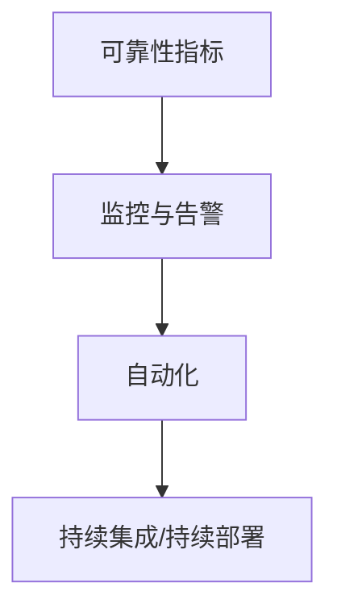

                 

关键词：站点可靠性工程（SRE）、系统可靠性、运维实践、自动化工具、监控与告警

## 摘要

站点可靠性工程（SRE）是一种结合软件开发和系统运维的新型工程实践。它旨在通过工程方法来提高系统的可靠性和可用性，从而减少意外中断和故障。本文将探讨SRE的核心概念、关键实践以及如何应用这些实践来确保系统的高可靠性。通过详细的案例分析，我们将展示如何通过自动化、监控、告警以及持续集成和持续部署（CI/CD）等手段，构建一个高度可靠的系统。

## 1. 背景介绍

随着云计算和微服务架构的普及，现代应用程序变得越来越复杂。传统的运维模式往往难以应对这种复杂性，导致系统可靠性成为了一个巨大的挑战。站点可靠性工程（SRE）作为一种新型的工程实践，正是为了解决这一问题而诞生的。

SRE起源于Google，其核心理念是将软件工程的最佳实践应用于系统运维。SRE团队不仅负责系统的运行，还负责系统的设计和开发。他们通过自动化、监控和数据分析等手段来确保系统的可靠性和稳定性。SRE的目标是尽可能减少系统故障和停机时间，同时提高系统的可用性和用户体验。

SRE与传统运维的主要区别在于，它更注重工程化和量化管理。传统运维更多依赖于经验和个人技能，而SRE则通过数据驱动的方法来优化系统的性能和可靠性。

## 2. 核心概念与联系

### 2.1. 可靠性指标

在SRE中，可靠性指标是评估系统稳定性的关键。以下是一些常用的可靠性指标：

- **可用性（Availability）**：系统在预定时间内可用的比例。
- **故障率（Failure Rate）**：单位时间内系统发生故障的次数。
- **恢复时间（Recovery Time）**：系统从故障中恢复的时间。
- **停机时间（Downtime）**：系统不可用的总时间。

### 2.2. 监控与告警

监控和告警是SRE的重要组成部分。通过监控，SRE团队能够实时了解系统的运行状态，并在出现问题时及时发出告警。常见的监控指标包括：

- **性能指标**：CPU使用率、内存使用率、磁盘I/O等。
- **健康指标**：服务响应时间、连接数、错误率等。
- **业务指标**：用户活跃度、交易成功率等。

### 2.3. 自动化

自动化是SRE的核心原则之一。通过自动化，SRE团队能够减少人为错误，提高系统的可靠性。以下是一些常用的自动化工具和流程：

- **自动化部署**：通过CI/CD流程，自动将代码从开发环境部署到生产环境。
- **自动化运维**：通过脚本和自动化工具，自动执行日常运维任务。
- **自动化测试**：通过自动化测试，确保新功能不会破坏现有系统。

### 2.4. 流程图

以下是SRE核心概念的Mermaid流程图：



## 3. 核心算法原理 & 具体操作步骤

### 3.1 算法原理概述

SRE的核心算法原理可以归纳为以下几个方面：

- **自动化**：通过自动化工具，减少人为干预，提高效率和可靠性。
- **监控与告警**：通过实时监控，快速发现和响应系统故障。
- **数据分析**：通过数据驱动的方法，持续优化系统性能和可靠性。

### 3.2 算法步骤详解

#### 3.2.1 自动化部署

1. **编写自动化脚本**：根据业务需求，编写自动化部署脚本。
2. **配置CI/CD流程**：配置持续集成和持续部署流程，将代码从版本控制系统推送到生产环境。
3. **测试和验证**：在部署前进行自动化测试，确保部署过程的稳定性和可靠性。

#### 3.2.2 监控与告警

1. **选择监控工具**：根据系统特点和需求，选择合适的监控工具。
2. **配置监控指标**：定义关键监控指标，如CPU使用率、内存使用率等。
3. **设置告警规则**：根据监控指标设置告警规则，确保在出现问题时及时通知相关人员。

#### 3.2.3 数据分析

1. **数据收集**：收集系统运行数据，包括性能数据、日志数据等。
2. **数据处理**：对收集到的数据进行分析和处理，提取有价值的信息。
3. **数据可视化**：通过数据可视化工具，展示系统运行状态和性能指标。

### 3.3 算法优缺点

#### 3.3.1 优点

- 提高系统可靠性：通过自动化、监控和数据分析，降低人为错误，提高系统稳定性。
- 提高开发效率：通过CI/CD流程，缩短开发周期，加快新功能的上线。
- 提高运维效率：通过自动化工具，减少日常运维工作量。

#### 3.3.2 缺点

- 初始投入较大：自动化和监控工具的配置和调试需要时间和人力。
- 需要专业知识：自动化和数据分析需要一定的技术背景。

### 3.4 算法应用领域

SRE算法广泛应用于互联网公司、金融行业、电信行业等高可靠性的领域。以下是一些具体的应用场景：

- **互联网公司**：通过自动化和监控，确保网站和服务的稳定性。
- **金融行业**：通过监控和数据分析，确保金融交易的安全性和可靠性。
- **电信行业**：通过自动化和监控，确保网络服务的稳定性和高效性。

## 4. 数学模型和公式 & 详细讲解 & 举例说明

### 4.1 数学模型构建

在SRE中，常用的数学模型包括：

- **平均故障率（Failure Rate）**：\( \lambda = \frac{1}{MTTF} \)，其中MTTF为平均无故障时间。
- **平均恢复时间（Mean Time to Recovery）**：\( \mu = \frac{1}{MTTR} \)，其中MTTR为平均故障恢复时间。

### 4.2 公式推导过程

#### 平均故障率

平均故障率是指系统在单位时间内发生故障的概率。根据概率论，我们可以推导出平均故障率的公式：

\( \lambda = \frac{1}{MTTF} \)

其中，MTTF为平均无故障时间，即系统在两次故障之间的平均时间。

#### 平均恢复时间

平均恢复时间是指系统从故障中恢复的平均时间。根据概率论，我们可以推导出平均恢复时间的公式：

\( \mu = \frac{1}{MTTR} \)

其中，MTTR为平均故障恢复时间，即系统从故障发生到完全恢复正常运行的平均时间。

### 4.3 案例分析与讲解

假设一个系统的平均无故障时间为1000小时，平均故障恢复时间为50小时。我们可以使用上述公式计算出系统的平均故障率和平均恢复时间：

\( \lambda = \frac{1}{1000} = 0.001 \)（每小时发生一次故障）

\( \mu = \frac{1}{50} = 0.02 \)（每小时恢复2次故障）

根据这些参数，我们可以计算出系统的可用性：

\( Availability = MTTF / (MTTF + MTTR) = 1000 / (1000 + 50) = 0.98 \)

这意味着系统的可用性为98%，即每年约有2%的时间可能会出现故障。

## 5. 项目实践：代码实例和详细解释说明

### 5.1 开发环境搭建

在开始项目实践之前，我们需要搭建一个合适的开发环境。以下是搭建环境的基本步骤：

1. 安装操作系统：推荐使用Ubuntu 18.04或更高版本。
2. 安装Java开发环境：使用OpenJDK。
3. 安装Git：用于代码版本控制。
4. 安装Maven：用于构建和管理项目。

### 5.2 源代码详细实现

以下是使用Maven构建的一个简单SRE项目示例：

```xml
<project xmlns="http://maven.apache.org/POM/4.0.0"
         xmlns:xsi="http://www.w3.org/2001/XMLSchema-instance"
         xsi:schemaLocation="http://maven.apache.org/POM/4.0.0 http://maven.apache.org/xsd/maven-4.0.0.xsd">
    <modelVersion>4.0.0</modelVersion>

    <groupId>com.example</groupId>
    <artifactId>SREPractice</artifactId>
    <version>1.0-SNAPSHOT</version>

    <dependencies>
        <dependency>
            <groupId>org.springframework.boot</groupId>
            <artifactId>spring-boot-starter-web</artifactId>
        </dependency>
        <dependency>
            <groupId>org.springframework.boot</groupId>
            <artifactId>spring-boot-starter-actuator</artifactId>
        </dependency>
    </dependencies>

    <build>
        <plugins>
            <plugin>
                <groupId>org.springframework.boot</groupId>
                <artifactId>spring-boot-maven-plugin</artifactId>
            </plugin>
        </plugins>
    </build>
</project>
```

这是一个简单的Maven项目结构，其中包含了Spring Boot Web应用和Actuator依赖。Actuator提供了丰富的端点，用于监控和管理应用程序。

### 5.3 代码解读与分析

在项目代码中，我们主要关注两个部分：应用代码和配置文件。

#### 应用代码

应用代码主要实现了两个功能：

1. **健康检查**：通过`/health`端点，提供系统的健康状态。
2. **监控数据收集**：通过Actuator提供的端点，收集系统的监控数据。

```java
@RestController
public class HealthController {

    @GetMapping("/health")
    public ResponseEntity<String> health() {
        // 健康检查逻辑
        return ResponseEntity.ok("Healthy");
    }
}
```

#### 配置文件

配置文件主要用于配置监控端点和自动化告警规则。

```yaml
management:
  endpoints:
    web:
      exposure:
        include: "*"
  metrics:
    tags:
      environment: "prod"
spring:
  datasource:
    url: jdbc:mysql://localhost:3306/mydb
    username: root
    password: root
```

通过配置文件，我们配置了数据库连接信息，并启用了所有Actuator端点。此外，我们还可以根据需要配置自动化告警规则，以确保在出现问题时及时通知相关人员。

### 5.4 运行结果展示

在运行应用程序后，我们可以在浏览器中访问`/health`端点，查看系统的健康状态。同时，Actuator提供的端点，如`/metrics`和`/health`，可以实时监控系统的性能和健康状态。

## 6. 实际应用场景

### 6.1 云计算平台

在云计算平台中，SRE实践被广泛应用于确保云服务的稳定性和可靠性。例如，Google Cloud Platform（GCP）和Amazon Web Services（AWS）都提供了丰富的SRE工具和服务，如Kubernetes集群管理、自动化部署和监控等。

### 6.2 金融行业

在金融行业，系统的可靠性和稳定性至关重要。例如，银行和金融机构使用SRE实践来确保交易系统的连续性和安全性，防止因故障导致资金损失。

### 6.3 电信行业

电信行业的服务质量直接影响到用户的使用体验。SRE实践可以帮助电信公司提高网络的稳定性和可靠性，确保用户通信服务的连续性。

## 7. 未来应用展望

随着人工智能和机器学习的不断发展，SRE实践将在未来得到更广泛的应用。例如，通过机器学习算法，可以更精确地预测系统故障，从而提前采取预防措施。此外，区块链技术的引入也将为SRE实践带来新的可能性，如提高数据安全性和透明度。

## 8. 工具和资源推荐

### 8.1 学习资源推荐

- 《站点可靠性工程：可持续的高可用性、弹性与安全性》（Site Reliability Engineering: How Google Runs Production Systems）
- 《SRE：构建和运行高可靠性的分布式系统》（SRE: Building and Running High-availability Distributed Systems）

### 8.2 开发工具推荐

- Prometheus：用于监控和告警的工具。
- Grafana：用于可视化监控数据的工具。
- Kubernetes：用于容器编排和自动化部署的工具。

### 8.3 相关论文推荐

- "The Art of SRE: Optimizing for Reliability in Large-Scale Systems"（SRE艺术：在大规模系统中优化可靠性）
- "Site Reliability Engineering: A Comprehensive Guide to Reliable Systems"（站点可靠性工程：可靠的系统全面指南）

## 9. 总结：未来发展趋势与挑战

SRE作为一种新兴的工程实践，在未来将面临以下发展趋势和挑战：

### 9.1 发展趋势

- 自动化与智能化：通过人工智能和机器学习，实现更高效、更智能的系统管理和维护。
- 云原生技术：随着云原生技术的发展，SRE将在云原生环境中得到更广泛的应用。
- 分布式系统：分布式系统的复杂性和规模将进一步增加，SRE将在保证分布式系统可靠性方面发挥更大作用。

### 9.2 面临的挑战

- 技术复杂性：随着系统规模的不断扩大，SRE面临的技术复杂性也将增加。
- 安全性：系统安全是SRE实践的一个重要方面，如何保障系统的安全性是一个重要挑战。
- 人员技能：SRE实践需要具备一定的技术背景和专业知识，如何培养和吸引人才是一个挑战。

### 9.3 研究展望

未来，SRE研究将更加注重以下几个方面：

- 自动化与智能化：通过引入更先进的自动化和智能化技术，提高系统管理和维护的效率。
- 跨领域应用：探索SRE在不同行业和领域的应用，如物联网、区块链等。
- 跨学科融合：结合计算机科学、数学、统计学等多学科知识，为SRE实践提供更坚实的理论基础。

## 附录：常见问题与解答

### Q：什么是SRE？

A：SRE（站点可靠性工程）是一种结合软件开发和系统运维的新型工程实践。它旨在通过工程方法来提高系统的可靠性和可用性，从而减少意外中断和故障。

### Q：SRE与传统运维有什么区别？

A：SRE与传统运维的主要区别在于，它更注重工程化和量化管理。传统运维更多依赖于经验和个人技能，而SRE则通过数据驱动的方法来优化系统的性能和可靠性。

### Q：SRE有哪些核心原则？

A：SRE的核心原则包括自动化、监控与告警、数据分析、持续集成和持续部署（CI/CD）等。

### Q：SRE如何提高系统的可靠性？

A：SRE通过自动化、监控、告警和数据分析等手段，提高系统的可靠性。它通过减少人为错误、实时监控、快速响应和持续优化，确保系统的稳定性和可用性。

### Q：SRE适合哪些行业和应用场景？

A：SRE适用于需要高可靠性和稳定性的行业和应用场景，如互联网公司、金融行业、电信行业等。它特别适合处理复杂、大规模的分布式系统。

## 作者署名

作者：禅与计算机程序设计艺术 / Zen and the Art of Computer Programming
```

