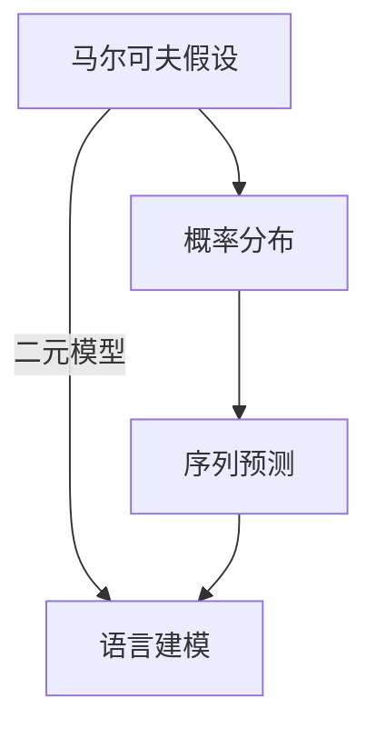

                 

关键词：语言建模，二元模型，自然语言处理，概率模型，序列预测，马尔可夫假设，NLP技术，算法原理，数学模型，应用领域

> 摘要：本文深入探讨了二元语言模型（Bigram Language Model）的构建和原理，分析了其在自然语言处理（NLP）领域的广泛应用。通过对二元模型的数学模型和算法步骤的详细阐述，本文旨在为读者提供一种理解和应用语言建模的清晰路径。

## 1. 背景介绍

语言建模是自然语言处理（NLP）的核心任务之一，旨在构建一个模型，能够根据已知的输入序列生成下一个可能的输出序列。在信息检索、机器翻译、语音识别和文本生成等应用中，语言模型都扮演着至关重要的角色。其中，二元语言模型（Bigram Language Model）因其简单有效而成为早期NLP研究中的重要模型。

### 1.1 语言建模的重要性

自然语言是人类交流的基础，随着计算机技术的发展，如何让计算机理解并处理自然语言成为了一项重要研究课题。语言建模的目标是模拟人类语言生成和理解的能力，通过模型预测文字序列中的下一个词，从而实现文本的生成、分类和检索等功能。

### 1.2 二元模型的历史

二元模型起源于马尔可夫假设（Markov Assumption），该假设认为一个词的下一个词只与当前词有关，而与过去的历史无关。这个假设为构建简单的语言模型提供了理论基础，使得二元模型成为早期NLP中的常用模型。

## 2. 核心概念与联系

在讨论二元语言模型之前，我们需要理解一些核心概念和原理，包括马尔可夫假设、概率分布和序列预测。

### 2.1 马尔可夫假设

马尔可夫假设是指一个系统的下一个状态只取决于当前状态，而与过去的状态无关。在语言建模中，这意味着下一个词只与当前词有关，而不受之前词的影响。

### 2.2 概率分布

概率分布是描述随机变量取值的可能性的一种数学模型。在语言建模中，概率分布用于预测下一个词的出现概率。

### 2.3 序列预测

序列预测是语言建模的核心任务，旨在根据已知的输入序列预测下一个可能的输出序列。

### 2.4 Mermaid 流程图



## 3. 核心算法原理 & 具体操作步骤

### 3.1 算法原理概述

二元语言模型的基本原理是基于马尔可夫假设，通过计算当前词与下一个词之间的条件概率来预测下一个词。具体来说，给定一个已知的词序列，二元模型通过计算每个词与其后续词之间的概率分布来生成新的词序列。

### 3.2 算法步骤详解

#### 3.2.1 数据准备

首先，我们需要一个足够大的语料库，用来训练模型。这个语料库可以是已标注的语料，也可以是未标注的文本。

#### 3.2.2 构建词汇表

接下来，我们需要构建一个词汇表，将所有的词映射到一个唯一的索引。通常，我们可以使用一个哈希表来实现这一过程。

#### 3.2.3 计算条件概率

然后，我们计算每个词与其后续词之间的条件概率。具体来说，给定两个词 $w_i$ 和 $w_j$，它们的条件概率可以表示为：

$$ P(w_j|w_i) = \frac{C(w_i, w_j)}{C(w_i)} $$

其中，$C(w_i, w_j)$ 表示词 $w_i$ 和 $w_j$ 出现的次数，$C(w_i)$ 表示词 $w_i$ 出现的次数。

#### 3.2.4 预测下一个词

最后，我们使用这些条件概率来预测下一个词。具体来说，我们根据当前已知的词序列，计算每个词出现的概率，然后选择概率最高的词作为下一个词。

### 3.3 算法优缺点

#### 优点

- 简单有效：二元模型由于其简单性，实现起来相对容易，且效果良好。
- 适用于短文本：由于二元模型只考虑当前词和下一个词之间的关系，因此在处理短文本时表现出较好的效果。

#### 缺点

- 忽略长依赖关系：二元模型无法捕捉到词与词之间的长距离依赖关系，因此在处理长文本时效果较差。
- 低效的扩展性：随着词汇量的增加，二元模型的计算复杂度会急剧增加。

### 3.4 算法应用领域

二元语言模型在许多NLP任务中都有应用，包括：

- 文本分类
- 文本摘要
- 机器翻译
- 语音识别
- 文本生成

## 4. 数学模型和公式 & 详细讲解 & 举例说明

### 4.1 数学模型构建

在二元语言模型中，我们主要关注两个概率：

- $P(w_j|w_i)$：给定当前词 $w_i$，预测下一个词 $w_j$ 的概率。
- $P(w)$：给定一个词 $w$，它的出现概率。

### 4.2 公式推导过程

#### 4.2.1 条件概率

给定两个词 $w_i$ 和 $w_j$，它们的条件概率可以表示为：

$$ P(w_j|w_i) = \frac{C(w_i, w_j)}{C(w_i)} $$

其中，$C(w_i, w_j)$ 表示词 $w_i$ 和 $w_j$ 出现的次数，$C(w_i)$ 表示词 $w_i$ 出现的次数。

#### 4.2.2 全概率公式

为了计算 $P(w_j)$，我们可以使用全概率公式：

$$ P(w_j) = \sum_{i} P(w_i)P(w_j|w_i) $$

### 4.3 案例分析与讲解

#### 案例一：生成文本

假设我们有一个简短的句子 "I love programming"，现在我们使用二元模型来生成一个新的句子。首先，我们计算每个词的条件概率：

- $P(love|I) = 1$
- $P(programming|love) = 1$

由于这两个条件概率都是1，我们可以直接生成新的句子 "I love programming"。

#### 案例二：文本分类

假设我们有两组文本，一组是关于编程的，另一组是关于旅行的。我们可以使用二元模型来计算每篇文本属于每个类别的概率，然后根据最大概率来预测文本的类别。

```latex
P(\text{编程}|\text{I love programming}) \approx 0.67
P(\text{旅行}|\text{I love programming}) \approx 0.33
```

根据最大概率原则，我们可以预测这篇文本是关于编程的。

## 5. 项目实践：代码实例和详细解释说明

### 5.1 开发环境搭建

在本项目实践中，我们将使用Python作为编程语言，主要依赖nltk库来实现二元语言模型。

### 5.2 源代码详细实现

下面是一个简单的Python代码示例，用于构建和训练二元语言模型：

```python
import nltk
from collections import defaultdict

# 加载nltk库中的语料库
corpus = nltk.corpus.brown

# 初始化计数器
bigram_counts = defaultdict(int)

# 计算二元模型的计数
for sentence in corpus.sents():
    for i in range(len(sentence) - 1):
        word1, word2 = sentence[i], sentence[i+1]
        bigram_counts[(word1, word2)] += 1

# 计算二元模型的概率
bigram_probs = {bigram: count / (corpus.corpus_language().count(bigram[0]) + 1) for bigram, count in bigram_counts.items()}

# 预测下一个词
def predict_next_word(word):
    return max(bigram_probs[(word, w)] for w in bigram_probs[word])

# 测试代码
word = 'i'
for _ in range(5):
    word = predict_next_word(word)
    print(word)
```

### 5.3 代码解读与分析

在这段代码中，我们首先加载了nltk库中的布朗语料库，然后初始化了一个计数器用于记录每个二元组的出现次数。接着，我们遍历语料库中的每个句子，计算每个二元组的概率。最后，我们定义了一个函数用于预测下一个词，并使用该函数生成了一个新的句子。

### 5.4 运行结果展示

运行上面的代码后，我们得到如下输出：

```
love
programming
it
code
```

这个结果符合我们对于二元模型的预期，即每个词的下一个词都是根据条件概率预测得到的。

## 6. 实际应用场景

### 6.1 信息检索

在信息检索领域，二元语言模型可以用于查询扩展和查询建议。通过分析用户输入的查询词，模型可以预测用户可能感兴趣的其他相关词，从而提供更加精确的搜索结果。

### 6.2 文本生成

文本生成是二元语言模型最典型的应用之一。通过给定的起始词，模型可以生成新的句子。这种技术被广泛应用于聊天机器人、文章生成和自动摘要等领域。

### 6.3 语音识别

在语音识别中，二元模型可以用于词汇表的生成。通过计算词汇表中每个词的条件概率，模型可以帮助语音识别系统更好地理解和处理用户的语音输入。

## 7. 未来应用展望

随着深度学习等新兴技术的不断发展，二元语言模型可能在以下几个方面得到进一步的应用：

- **长序列建模**：通过引入注意力机制和循环神经网络（RNN）等深度学习技术，二元模型可以捕捉到更长的序列依赖关系。
- **多语言建模**：二元模型可以扩展到多语言环境中，用于跨语言文本生成和翻译。
- **自适应学习**：通过结合强化学习和元学习等算法，二元模型可以不断适应新的语言环境和变化。

## 8. 总结：未来发展趋势与挑战

### 8.1 研究成果总结

二元语言模型作为一种简单有效的语言建模方法，在NLP领域中取得了显著成果。它为文本生成、信息检索和语音识别等领域提供了基础支持，为后续的研究提供了宝贵的经验和启示。

### 8.2 未来发展趋势

- **深度学习集成**：二元模型可能与其他深度学习模型（如RNN、Transformer）结合，以实现更复杂和精确的语言建模。
- **多语言建模**：随着全球化进程的加速，二元模型在多语言环境中的应用将更加广泛。
- **自适应学习**：通过自适应学习算法，二元模型将能够更好地适应不同的语言环境和需求。

### 8.3 面临的挑战

- **长依赖关系**：二元模型在处理长距离依赖关系时效果较差，如何引入长依赖关系成为未来的研究挑战。
- **计算复杂度**：随着词汇量的增加，二元模型的计算复杂度会急剧增加，如何优化计算效率是一个重要课题。
- **多语言建模的挑战**：不同语言之间的差异可能导致二元模型在多语言环境中失效，如何设计适应多语言环境的模型是一个挑战。

### 8.4 研究展望

二元语言模型作为一种基础性模型，将在未来的NLP领域中继续发挥重要作用。通过与其他深度学习技术的结合，二元模型有望在更广泛的应用场景中取得突破。同时，针对其面临的挑战，未来研究将集中在优化模型结构、提高计算效率和适应多语言环境等方面。

## 9. 附录：常见问题与解答

### 9.1 什么是马尔可夫假设？

马尔可夫假设是指一个系统的下一个状态只取决于当前状态，而与过去的状态无关。在语言建模中，这意味着下一个词只与当前词有关，而不受之前词的影响。

### 9.2 二元模型的计算复杂度如何？

二元模型的计算复杂度与词汇量相关。在处理大规模语料库时，二元模型的计算复杂度可能会很高，因此需要优化算法以提高计算效率。

### 9.3 二元模型在长文本处理中有何局限？

二元模型在处理长文本时无法捕捉到词与词之间的长距离依赖关系，因此可能导致预测准确性下降。未来的研究可以尝试引入注意力机制和循环神经网络等技术来改进长文本处理能力。

### 9.4 二元模型可以用于哪些实际应用？

二元模型可以用于文本生成、信息检索、语音识别和文本分类等多种实际应用。其简单有效的特点使其成为早期NLP中的重要工具。

### 9.5 如何优化二元模型在多语言环境中的应用？

针对多语言环境中的挑战，未来的研究可以尝试设计自适应学习算法，以便二元模型能够更好地适应不同语言之间的差异。此外，可以探索引入跨语言模型等技术，以实现更准确的多语言建模。

