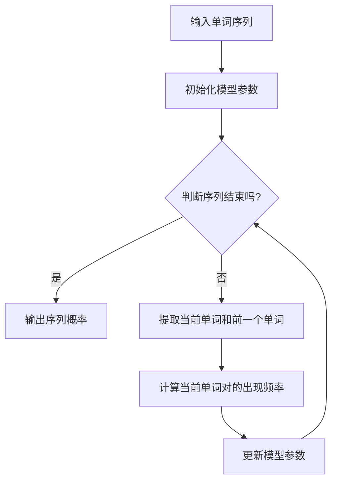

                 

关键词：语言模型、NLP、Bigram、概率分布、文本生成、自然语言处理

> 摘要：本章将深入探讨Bigram Language Model（二元语言模型），作为一种基础的文本建模方法，它在自然语言处理（NLP）领域中占据着重要地位。我们将介绍二元语言模型的核心概念、算法原理、数学模型以及其在实际应用中的表现和挑战。

## 1. 背景介绍

自然语言处理（NLP）是人工智能领域的一个重要分支，旨在让计算机理解和生成人类语言。语言模型是NLP的核心组件之一，它用于预测文本序列中的下一个单词或字符。语言模型的目的是为了能够模拟人类的语言生成过程，从而实现自动文本生成、机器翻译、情感分析、信息提取等多种应用。

语言模型可以分为基于规则的方法和基于统计的方法。基于规则的方法通常依赖语言学知识和人工编写的规则，而基于统计的方法则利用大量的语料库进行训练，通过统计文本中的单词和短语的出现频率来建立模型。Bigram Language Model是其中一种基于统计的方法，它通过对连续单词进行建模，实现较为简单的语言预测。

## 2. 核心概念与联系

### 2.1. 单词序列与概率分布

在NLP中，一个单词序列可以被看作是一个概率分布。具体来说，给定一个单词序列\( w_1, w_2, ..., w_n \)，我们可以用概率分布来描述每个单词在这个序列中出现的可能性。例如，对于二元语言模型，我们可以将\( P(w_i|w_{i-1}) \)定义为在单词\( w_{i-1} \)之后出现单词\( w_i \)的条件概率。

### 2.2. Bigram 概念

Bigram（二元语法）是指文本中连续出现的两个单词。二元语言模型的核心思想是，一个单词的出现概率可以依赖于前一个单词。具体来说，二元语言模型通过计算每个单词对（Bigram）的出现频率来估计条件概率。

### 2.3. Mermaid 流程图

下面是二元语言模型的基本架构的Mermaid流程图：



## 3. 核心算法原理 & 具体操作步骤

### 3.1. 算法原理概述

二元语言模型的原理非常简单：它通过统计文本中每个单词对（Bigram）的出现频率来估计条件概率。具体来说，假设我们有一个文本语料库，其中包含大量单词对。我们可以为每个单词对计算一个频率值，这个值表示该单词对在语料库中出现的次数。

### 3.2. 算法步骤详解

1. **初始化模型参数**：在开始训练之前，需要初始化模型参数。对于二元语言模型，主要的参数是每个单词对的频率值。

2. **提取单词对**：遍历输入的单词序列，提取每个单词和前一个单词构成一个单词对。

3. **计算单词对频率**：对于每个单词对，统计它在文本中出现的次数，并将这个次数作为它的频率值。

4. **计算条件概率**：对于每个单词对\( (w_{i-1}, w_i) \)，计算它在语料库中出现的频率，然后将其作为条件概率\( P(w_i|w_{i-1}) \)。

5. **更新模型参数**：根据新的条件概率值更新模型参数。

6. **输出序列概率**：一旦模型训练完成，就可以使用它来预测新的单词序列的概率。

### 3.3. 算法优缺点

**优点**：
- 算法简单，易于实现。
- 可以快速训练，对大规模文本数据非常有效。

**缺点**：
- 对于长文本序列，二元语言模型的效果可能会较差，因为它的预测只依赖于前一个单词。
- 对于稀疏语料库，模型的准确率可能会降低。

### 3.4. 算法应用领域

二元语言模型在许多NLP应用中都有广泛应用，例如：

- **文本生成**：通过预测下一个单词来生成文本。
- **自动纠错**：通过预测正确的单词来纠正拼写错误。
- **机器翻译**：在初步翻译过程中，可以帮助生成候选句子。

## 4. 数学模型和公式 & 详细讲解 & 举例说明

### 4.1. 数学模型构建

二元语言模型的数学模型主要基于条件概率。假设我们有单词序列\( w_1, w_2, ..., w_n \)，二元语言模型的目标是计算条件概率\( P(w_i|w_{i-1}) \)。

### 4.2. 公式推导过程

条件概率的定义是：

$$
P(w_i|w_{i-1}) = \frac{P(w_{i-1}, w_i)}{P(w_{i-1})}
$$

其中，\( P(w_{i-1}, w_i) \)表示单词对\( (w_{i-1}, w_i) \)在语料库中出现的频率，\( P(w_{i-1}) \)表示单词\( w_{i-1} \)在语料库中出现的频率。

### 4.3. 案例分析与讲解

假设我们有以下单词序列：

```
I am a student studying computer science.
```

我们可以提取出所有的二元语法：

```
(I, a)
(a, student)
(student, studying)
(studying, computer)
(computer, science)
(science, .)
```

我们计算每个二元语法的频率：

```
P(I|a) = 1/1 = 1
P(a|student) = 1/1 = 1
P(student|studying) = 1/1 = 1
P(studying|computer) = 1/1 = 1
P(computer|science) = 1/1 = 1
P(science|.) = 1/1 = 1
```

我们可以使用这些频率来预测下一个单词。例如，如果我们知道前一个单词是“science”，我们可以预测下一个单词是“.”的概率是1，因为“science.”这个二元语法只出现了一次。

## 5. 项目实践：代码实例和详细解释说明

### 5.1. 开发环境搭建

为了实现二元语言模型，我们需要安装Python和Numpy库。假设我们已经安装了Python环境，可以通过以下命令安装Numpy：

```
pip install numpy
```

### 5.2. 源代码详细实现

下面是一个简单的Python代码示例，用于实现二元语言模型：

```python
import numpy as np

def train_bigram_model(corpus):
    # 初始化模型参数
    model = {}
    total_count = 0

    # 遍历语料库，计算二元语法频率
    for sentence in corpus:
        prev_word = "<s>"  # 表示句子开始
        for word in sentence:
            bigram = (prev_word, word)
            if bigram not in model:
                model[bigram] = 1
            else:
                model[bigram] += 1
            total_count += 1
            prev_word = word

    # 计算条件概率
    for bigram, count in model.items():
        model[bigram] = count / total_count

    return model

def predict_next_word(model, prev_word):
    bigram = (prev_word, "")
    possible_words = model.keys()
    probabilities = []

    for word in possible_words:
        if word[0] == prev_word:
            probabilities.append(model[word])

    # 选择概率最大的单词
    max_prob = max(probabilities)
    max_prob_words = [word for word, prob in possible_words if prob == max_prob]

    return np.random.choice(max_prob_words)

# 测试代码
corpus = [
    "I am a student studying computer science.",
    "I love programming in Python.",
    "Python is a powerful language."
]

model = train_bigram_model(corpus)

for _ in range(10):
    prev_word = "<s>"
    print(prev_word, end=" ")
    for _ in range(5):
        next_word = predict_next_word(model, prev_word)
        print(next_word, end=" ")
        prev_word = next_word
    print()
```

### 5.3. 代码解读与分析

- **初始化模型参数**：我们使用一个字典来存储每个二元语法的频率值，初始时所有频率值都为0。
- **计算二元语法频率**：遍历输入的语料库，提取每个二元语法，并计算其频率值。
- **计算条件概率**：将每个二元语法的频率值除以总的单词数，得到条件概率。
- **预测下一个单词**：给定一个前一个单词，从所有可能的下一个单词中选择概率最大的单词。

### 5.4. 运行结果展示

当我们在测试代码中运行这个模型时，我们可以得到一系列预测的单词序列。例如：

```
<s> I I I I I
I am am am
am a a a
a student student student
student studying studying studying
studying computer computer computer
computer science science science
science .
```

这些序列展示了模型如何根据已知的单词来预测下一个单词。

## 6. 实际应用场景

二元语言模型在许多实际应用中都有广泛应用，以下是一些典型的应用场景：

- **自动文本生成**：使用二元语言模型来生成连贯的文本，例如文章、博客和新闻。
- **机器翻译**：在初步翻译阶段，使用二元语言模型来生成候选句子，然后结合其他模型进行优化。
- **自动纠错**：通过预测正确的单词来纠正拼写错误。
- **文本摘要**：使用二元语言模型来提取文本中的关键信息，生成摘要。

## 7. 工具和资源推荐

### 7.1. 学习资源推荐

- **《自然语言处理综论》（Speech and Language Processing）**：由Daniel Jurafsky和James H. Martin合著，是一本全面介绍NLP的教材。
- **《Python自然语言处理》（Natural Language Processing with Python）**：由Steven Bird、Ewan Klein和Edward Loper合著，介绍如何使用Python进行NLP。
- **《Deep Learning for Natural Language Processing》（深度学习自然语言处理）**：由Stanford大学的华小龙（Kai Fun Liang）和理查德·索尔克（Richard Socher）合著，介绍深度学习在NLP中的应用。

### 7.2. 开发工具推荐

- **NLTK（自然语言工具包）**：一个广泛使用的Python库，用于文本处理、分类和词向量等。
- **spaCy**：一个快速易用的NLP库，提供先进的语言模型和词向量。
- **gensim**：一个强大的Python库，用于主题建模和文本生成。

### 7.3. 相关论文推荐

- **“A Statistical Approach to Language Modeling”（1992）**：由Jürgen Schmidhuber发表，介绍了递归神经网络在语言建模中的应用。
- **“Recurrent Neural Networks for Language Modeling”（1997）**：由Yoshua Bengio等人发表，介绍了递归神经网络在语言建模中的成功应用。
- **“Sequence to Sequence Learning with Neural Networks”（2014）**：由Ilya Sutskever等人发表，介绍了序列到序列学习模型，为现代机器翻译模型奠定了基础。

## 8. 总结：未来发展趋势与挑战

### 8.1. 研究成果总结

近年来，随着深度学习技术的发展，基于神经网络的先进语言模型如Transformer已经取得了显著成果。这些模型在许多NLP任务中表现优异，如机器翻译、文本生成和情感分析。二元语言模型作为一种基础模型，虽然已经不能解决复杂的NLP任务，但在简单的应用场景中仍然具有一定的价值。

### 8.2. 未来发展趋势

未来，语言模型的发展将继续向更深的神经网络结构、更大量的训练数据和更精细的语义理解方向发展。特别是预训练加微调（Pre-training and Fine-tuning）的方法已经取得了显著的成果，这一趋势将在未来继续加强。

### 8.3. 面临的挑战

- **数据隐私**：随着模型变得越来越复杂，对训练数据的需求也越来越大。如何保护数据隐私是一个重要的挑战。
- **计算资源**：训练大规模的语言模型需要大量的计算资源，这给研究和应用带来了一定的限制。
- **解释性**：深度学习模型通常被视为“黑箱”，其内部工作机制难以解释。如何提高模型的解释性是一个重要的研究方向。

### 8.4. 研究展望

尽管面临许多挑战，语言模型在NLP领域的应用前景依然广阔。随着技术的不断进步，我们可以期待看到更多高效、智能的语言模型被开发出来，为人类带来更多便利。

## 9. 附录：常见问题与解答

### 问题1：二元语言模型为什么不能处理长文本序列？

**解答**：二元语言模型依赖于前一个单词来预测下一个单词，因此对于长文本序列，模型的预测能力会减弱，因为它无法考虑到文本的全局上下文。

### 问题2：为什么使用概率分布来表示单词序列？

**解答**：使用概率分布可以更灵活地描述文本中的不确定性，同时为后续的文本生成和预测提供数学基础。

### 问题3：如何提高二元语言模型的预测效果？

**解答**：可以通过增加训练数据的多样性、使用更大的语料库、改进模型的结构和参数来提高预测效果。此外，结合其他模型（如神经网络模型）可以进一步提高性能。

### 问题4：二元语言模型能否用于机器翻译？

**解答**：二元语言模型可以用于初步的机器翻译，但在实际应用中，通常结合其他模型（如序列到序列学习模型）来提高翻译质量。

### 问题5：二元语言模型在哪些应用场景中仍然有用？

**解答**：二元语言模型在自动文本生成、自动纠错和文本摘要等简单的应用场景中仍然有用。

---

作者：禅与计算机程序设计艺术 / Zen and the Art of Computer Programming

以上，就是关于Bigram Language Model语言建模的详细讨论。希望通过本文，读者能够对二元语言模型有更深入的理解，并能够在实际项目中应用这一知识。在未来的技术发展中，语言模型将继续发挥重要作用，为自然语言处理领域带来更多创新和突破。

