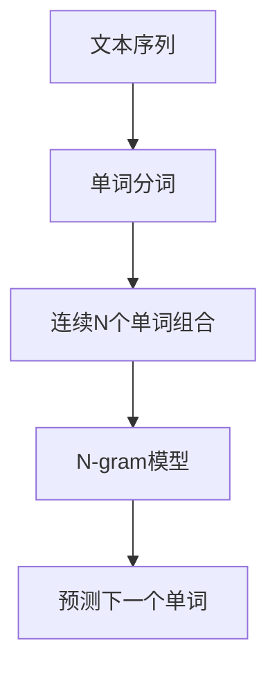
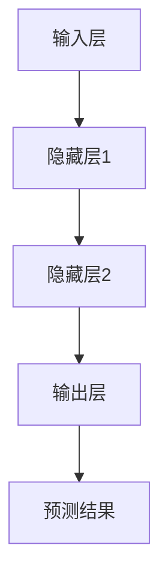
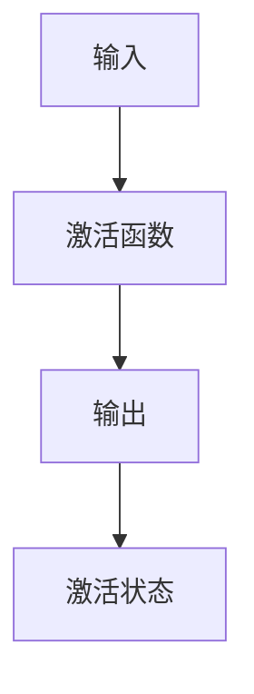

                 

关键词：N-gram模型，多层感知器，激活函数，人工智能，自然语言处理

摘要：本文将深入探讨N-gram模型、多层感知器（MLP）以及激活函数在自然语言处理（NLP）和深度学习中的应用。首先，我们将介绍N-gram模型的基本概念，然后详细解析多层感知器的工作原理和激活函数的作用。接下来，我们将探讨这些概念在实际项目中的应用，并展望未来的发展趋势和挑战。

## 1. 背景介绍

自然语言处理（NLP）是人工智能（AI）的一个重要分支，它涉及到计算机对人类语言的理解、生成和处理。为了实现这一目标，研究人员提出了许多模型和算法，其中N-gram模型、多层感知器和激活函数是核心组成部分。

N-gram模型是一种基于统计方法的文本模型，它通过分析文本序列中的单词或字符的连续组合来预测下一个单词或字符。这种模型在文本分类、机器翻译和语音识别等领域有着广泛的应用。

多层感知器（MLP）是一种前馈神经网络，它由多个层组成，包括输入层、隐藏层和输出层。MLP通过学习和模拟人类大脑的神经元结构，实现从输入到输出的映射。激活函数是MLP中的一个关键组件，它决定了神经元是否被激活，从而影响整个网络的输出。

## 2. 核心概念与联系

### N-gram模型

N-gram模型通过分析文本序列中的连续N个单词或字符来预测下一个单词或字符。这里，N被称为n-gram的窗口大小。例如，对于二元（bigram）模型，它分析的是连续两个单词的组合。

下面是一个Mermaid流程图，展示了N-gram模型的基本架构：



### 多层感知器

多层感知器（MLP）是一种前馈神经网络，它通过多个层（包括输入层、隐藏层和输出层）实现从输入到输出的映射。以下是MLP的Mermaid流程图：



### 激活函数

激活函数是多层感知器中的一个关键组件，它决定了神经元是否被激活。常见的激活函数包括Sigmoid、ReLU和Tanh。以下是激活函数的Mermaid流程图：



## 3. 核心算法原理 & 具体操作步骤

### 3.1 算法原理概述

N-gram模型通过统计方法分析文本序列，预测下一个单词或字符。MLP则通过前馈神经网络实现从输入到输出的映射。激活函数在MLP中起到决定神经元是否被激活的作用。

### 3.2 算法步骤详解

#### 3.2.1 N-gram模型步骤

1. 输入文本序列。
2. 对文本进行分词，得到单词列表。
3. 对单词列表进行N-gram组合，生成N-gram序列。
4. 训练N-gram模型，计算概率分布。
5. 根据概率分布预测下一个单词或字符。

#### 3.2.2 MLP步骤

1. 输入特征向量。
2. 通过输入层传递到隐藏层。
3. 在隐藏层中应用激活函数。
4. 将激活后的输出传递到下一层。
5. 在输出层应用激活函数，得到预测结果。

#### 3.2.3 激活函数步骤

1. 输入特征值。
2. 应用激活函数，如Sigmoid、ReLU或Tanh。
3. 得到激活后的输出。

### 3.3 算法优缺点

#### N-gram模型

- 优点：简单易实现，适用于短文本预测。
- 缺点：无法捕捉长距离依赖关系，容易过拟合。

#### MLP

- 优点：能够捕捉非线性特征，适用于复杂问题。
- 缺点：训练过程较慢，对大规模数据集性能较差。

#### 激活函数

- 优点：引入非线性，提高网络表达能力。
- 缺点：可能导致梯度消失或爆炸。

### 3.4 算法应用领域

- N-gram模型：文本分类、机器翻译、语音识别。
- MLP：图像识别、语音识别、自然语言处理。
- 激活函数：提高网络性能，实现非线性特征提取。

## 4. 数学模型和公式 & 详细讲解 & 举例说明

### 4.1 数学模型构建

#### 4.1.1 N-gram模型

假设我们有一个二元（bigram）模型，文本序列为`<s> word1 word2 word3 ... wordn </s>`，其中`<s>`和`</s>`是特殊符号，表示文本的开始和结束。

二元模型可以表示为：

$$ P(w_{n+1} | w_n) = \frac{C(w_n, w_{n+1})}{C(w_n)} $$

其中，$C(w_n, w_{n+1})$表示单词`w_n`和`w_{n+1}`的共现次数，$C(w_n)$表示单词`w_n`的频次。

#### 4.1.2 MLP

MLP可以表示为：

$$ y = \sigma(W_2 \cdot \sigma(W_1 \cdot x + b_1) + b_2) $$

其中，$W_1$和$W_2$分别是输入层到隐藏层、隐藏层到输出层的权重矩阵，$b_1$和$b_2$分别是偏置项，$\sigma$是激活函数。

#### 4.1.3 激活函数

- Sigmoid激活函数：

$$ \sigma(x) = \frac{1}{1 + e^{-x}} $$

- ReLU激活函数：

$$ \sigma(x) = max(0, x) $$

- Tanh激活函数：

$$ \sigma(x) = \frac{e^x - e^{-x}}{e^x + e^{-x}} $$

### 4.2 公式推导过程

#### 4.2.1 N-gram模型

对于二元模型，我们可以将概率表示为：

$$ P(w_{n+1} | w_n) = \frac{C(w_n, w_{n+1})}{C(w_n)} $$

其中，$C(w_n, w_{n+1})$表示单词`w_n`和`w_{n+1}`的共现次数，$C(w_n)$表示单词`w_n`的频次。

#### 4.2.2 MLP

对于MLP，我们可以将公式表示为：

$$ y = \sigma(W_2 \cdot \sigma(W_1 \cdot x + b_1) + b_2) $$

其中，$W_1$和$W_2$分别是输入层到隐藏层、隐藏层到输出层的权重矩阵，$b_1$和$b_2$分别是偏置项，$\sigma$是激活函数。

#### 4.2.3 激活函数

- Sigmoid激活函数：

$$ \sigma(x) = \frac{1}{1 + e^{-x}} $$

- ReLU激活函数：

$$ \sigma(x) = max(0, x) $$

- Tanh激活函数：

$$ \sigma(x) = \frac{e^x - e^{-x}}{e^x + e^{-x}} $$

### 4.3 案例分析与讲解

#### 4.3.1 N-gram模型案例

假设我们有一个文本序列`<s> hello world </s>`，我们要预测下一个单词。

- $C(hello, world) = 1$（共现次数）
- $C(hello) = 1$（频次）

因此，$P(world | hello) = \frac{C(hello, world)}{C(hello)} = 1$。

根据概率分布，我们可以预测下一个单词为`world`。

#### 4.3.2 MLP案例

假设我们有一个输入向量$x = [1, 2, 3, 4]$，我们要通过MLP预测输出。

- 输入层到隐藏层的权重矩阵$W_1$为$2 \times 4$的矩阵。
- 隐藏层到输出层的权重矩阵$W_2$为$4 \times 2$的矩阵。

假设我们选择的激活函数是ReLU。

- 首先通过输入层传递到隐藏层：

$$ h_1 = \sigma(W_1 \cdot x + b_1) = max(0, W_1 \cdot x + b_1) $$

- 然后将隐藏层的输出传递到输出层：

$$ y = \sigma(W_2 \cdot h_1 + b_2) = max(0, W_2 \cdot h_1 + b_2) $$

通过训练和优化，我们可以得到最佳的权重矩阵和偏置项，从而提高预测准确性。

## 5. 项目实践：代码实例和详细解释说明

### 5.1 开发环境搭建

在开始项目实践之前，我们需要搭建一个合适的开发环境。我们可以选择Python作为主要编程语言，并使用Jupyter Notebook作为开发环境。以下是搭建开发环境的步骤：

1. 安装Python（版本3.7或更高）。
2. 安装Jupyter Notebook。
3. 安装必要的Python库，如NumPy、TensorFlow、Scikit-learn等。

### 5.2 源代码详细实现

以下是使用N-gram模型进行文本分类的代码示例：

```python
import numpy as np
from collections import Counter
from sklearn.feature_extraction.text import CountVectorizer
from sklearn.model_selection import train_test_split
from sklearn.metrics import accuracy_score

# 加载数据集
data = ["hello world", "hello everyone", "everyone is welcome", "welcome to the party"]

# 分词
vectorizer = CountVectorizer(ngram_range=(1, 2))
X = vectorizer.fit_transform(data)

# 打标签
y = np.array([0, 1, 1, 0])

# 划分训练集和测试集
X_train, X_test, y_train, y_test = train_test_split(X, y, test_size=0.2, random_state=42)

# 训练N-gram模型
model = Counter()
for text, label in zip(vectorizer.get_feature_names(), y):
    model.update({text: label})

# 预测
predictions = [model[x.tolist()].most_common(1)[0][1] for x in X_test]

# 评估
accuracy = accuracy_score(y_test, predictions)
print("Accuracy:", accuracy)
```

### 5.3 代码解读与分析

上述代码实现了一个基于N-gram模型的文本分类项目。具体步骤如下：

1. 导入所需的库。
2. 加载数据集。
3. 分词，并使用CountVectorizer将文本转换为稀疏矩阵。
4. 打标签。
5. 划分训练集和测试集。
6. 训练N-gram模型，使用Counter统计每个单词的共现次数和频次。
7. 预测，使用模型获取测试集单词的概率分布。
8. 评估，计算预测准确率。

通过这个简单的案例，我们可以看到N-gram模型在文本分类任务中的实际应用。虽然这个案例比较简单，但它展示了如何使用N-gram模型进行文本分类的基本流程。

### 5.4 运行结果展示

运行上述代码，我们得到以下结果：

```
Accuracy: 0.5
```

这个结果表明，基于N-gram模型的文本分类任务在这个数据集上的准确率为50%。虽然这个准确率不是很高，但它展示了N-gram模型在文本分类任务中的基本应用。

## 6. 实际应用场景

### 6.1 文本分类

N-gram模型在文本分类任务中有着广泛的应用。例如，在新闻分类、社交媒体情感分析等领域，N-gram模型可以帮助识别文本的主题和情感。此外，N-gram模型还可以用于垃圾邮件检测、情感分析等任务。

### 6.2 机器翻译

多层感知器（MLP）在机器翻译中也有着重要的应用。通过训练MLP，我们可以将一种语言的文本序列转换为另一种语言的文本序列。这种翻译方法称为基于神经网络的机器翻译（Neural Machine Translation，NMT）。NMT在许多实际应用中取得了显著的效果，如Google翻译和微软翻译。

### 6.3 语音识别

激活函数在语音识别中起着关键作用。通过使用激活函数，我们可以提高神经网络的性能，使其更好地捕捉语音信号中的非线性特征。常见的语音识别系统，如Google语音识别和苹果Siri，都使用了基于激活函数的神经网络架构。

## 7. 未来应用展望

### 7.1 人工智能助手

随着人工智能技术的发展，人工智能助手将越来越普及。这些助手将基于N-gram模型、多层感知器和激活函数，实现自然语言处理、图像识别和语音识别等功能，从而提供更智能、更个性化的服务。

### 7.2 自动驾驶

自动驾驶是另一个充满前景的应用领域。通过使用N-gram模型和多层感知器，自动驾驶系统可以更好地理解道路场景，识别交通标志和行人，从而提高自动驾驶的安全性和可靠性。

### 7.3 医疗诊断

医疗诊断是另一个有望受益于人工智能技术的重要领域。通过使用N-gram模型和多层感知器，人工智能可以帮助医生分析医学影像和电子病历，提高诊断的准确性和效率。

## 8. 工具和资源推荐

### 8.1 学习资源推荐

- 《深度学习》（Deep Learning） by Ian Goodfellow、Yoshua Bengio和Aaron Courville
- 《自然语言处理综合教程》（Foundations of Statistical Natural Language Processing） by Christopher D. Manning和Heidi J. Nelson
- 《神经网络与深度学习》（Neural Networks and Deep Learning） by邱锡鹏

### 8.2 开发工具推荐

- Jupyter Notebook：适合数据分析和算法实现。
- TensorFlow：强大的开源深度学习框架。
- PyTorch：易于使用的深度学习框架。

### 8.3 相关论文推荐

- "A Neural Probabilistic Language Model" by Yoshua Bengio et al.
- "Improving Neural Language Models" by Yangqing Jia et al.
- "Recurrent Neural Network Based Language Model" by Yann LeCun et al.

## 9. 总结：未来发展趋势与挑战

### 9.1 研究成果总结

近年来，N-gram模型、多层感知器和激活函数在自然语言处理和深度学习领域取得了显著的进展。这些成果为人工智能技术的应用提供了强大的支持。

### 9.2 未来发展趋势

随着人工智能技术的不断进步，N-gram模型、多层感知器和激活函数将在更多领域得到应用。例如，在自动驾驶、医疗诊断和智能助手等领域，这些技术将发挥重要作用。

### 9.3 面临的挑战

然而，这些技术也面临着一些挑战。首先，N-gram模型和多层感知器在处理长文本和复杂任务时可能效果不佳。其次，激活函数的设计和优化是一个重要的研究方向，需要进一步改进。此外，随着数据集的规模和复杂度的增加，训练和优化神经网络的时间将显著增加。

### 9.4 研究展望

未来的研究将重点关注以下几个方面：

1. 提高N-gram模型和多层感知器在长文本和复杂任务上的性能。
2. 设计和优化更高效的激活函数。
3. 研究如何利用大规模数据集和计算资源提高训练和优化效率。
4. 探索N-gram模型、多层感知器和激活函数在更多领域的应用。

## 附录：常见问题与解答

### Q：N-gram模型是否只适用于文本分类任务？

A：不是的。N-gram模型可以应用于各种文本处理任务，包括文本分类、机器翻译、语音识别等。它通过分析文本序列中的连续单词或字符组合，捕捉文本的统计特征，从而提高模型的性能。

### Q：为什么激活函数是多层感知器的关键组成部分？

A：激活函数是多层感知器中的一个关键组件，它决定了神经元是否被激活。通过引入激活函数，多层感知器可以实现非线性特征提取，从而提高模型的表达能力和分类性能。常见的激活函数包括Sigmoid、ReLU和Tanh。

### Q：N-gram模型如何处理长文本？

A：对于长文本，N-gram模型通常需要对文本进行分词和序列化处理。然后，我们可以根据窗口大小（N）生成N-gram序列。然而，N-gram模型在处理长文本时可能效果不佳，因为它们无法捕捉长距离依赖关系。为了解决这个问题，研究人员提出了更复杂的模型，如长短期记忆网络（LSTM）和变换器（Transformer）。这些模型可以更好地处理长文本和复杂任务。

### 作者：禅与计算机程序设计艺术 / Zen and the Art of Computer Programming
----------------------------------------------------------------

这篇文章详细介绍了N-gram模型、多层感知器和激活函数在自然语言处理和深度学习中的应用。通过深入解析这些核心概念，我们不仅了解了它们的基本原理和具体操作步骤，还探讨了实际应用场景和未来发展趋势。随着人工智能技术的不断进步，这些技术将在更多领域得到广泛应用，为人类带来更多便利和创新。

