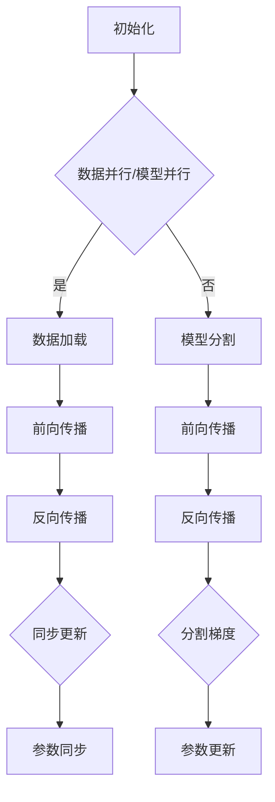

                 

关键词：分布式优化，DDP，ZeRO，机器学习，并行计算，计算效率，数据并行，模型并行，通信效率，计算开销，资源管理，集群计算。

摘要：本文深入探讨了分布式优化中的两种重要技术：动态分布式训练算法（DDP）和Zero Redundancy Optimization（ZeRO）。我们将首先介绍分布式优化背景和基本概念，然后详细阐述DDP和ZeRO的原理、步骤、优缺点及其应用领域。接着，我们将通过数学模型和公式的推导，对这两种技术进行深入的数学解析，并通过实际项目实践来展示其应用效果。文章最后将讨论分布式优化在实际应用场景中的挑战和未来发展方向。

## 1. 背景介绍

随着深度学习在各个领域的广泛应用，大规模的神经网络训练变得愈发重要。然而，训练这些大型网络通常需要大量的计算资源和时间。因此，分布式优化技术成为了提高计算效率和缩短训练时间的关键手段。

分布式优化是指将大规模的神经网络训练任务分解为多个子任务，分配到多个计算节点上并行执行。这种技术可以有效利用多台机器的计算能力，显著提升训练速度。分布式优化主要分为两种类型：数据并行（Data Parallelism）和模型并行（Model Parallelism）。

- **数据并行**：将训练数据集分割成多个子集，每个子集由不同的计算节点处理。每个节点独立进行前向传播、反向传播和参数更新，最终将各节点的更新结果汇总。

- **模型并行**：将神经网络模型分割为多个部分，每个部分由不同的计算节点处理。这种并行方式需要解决不同节点之间的通信问题，从而保证模型的一致性和准确性。

尽管数据并行和模型并行在一定程度上可以提升训练效率，但在实际应用中仍面临许多挑战，如通信开销、计算资源分配、负载均衡等问题。为了解决这些问题，研究者提出了许多分布式优化算法，其中DDP和ZeRO是两种代表性的技术。

## 2. 核心概念与联系

### 2.1 DDP

**动态分布式训练算法（DDP）** 是一种基于数据并行的分布式优化技术，通过动态调整每个计算节点的通信频率来平衡计算负载和通信开销。

DDP的工作流程如下：

1. **初始化**：每个节点独立初始化自己的模型参数。
2. **数据加载**：每个节点从全局数据集中加载不同的子集。
3. **前向传播**：每个节点使用自己的数据子集进行前向传播，计算损失函数。
4. **反向传播**：每个节点使用自己的数据和全局梯度进行反向传播，更新模型参数。
5. **参数同步**：每个节点将更新后的参数发送给其他节点，实现全局参数的同步。

### 2.2 ZeRO

**Zero Redundancy Optimization（ZeRO）** 是一种基于模型并行的分布式优化技术，通过将模型参数和梯度在各个节点之间分割，以减少每个节点的内存占用和通信开销。

ZeRO的工作流程如下：

1. **模型分割**：将神经网络模型分割为多个部分，每个部分分配给不同的计算节点。
2. **初始化**：每个节点独立初始化自己的模型部分参数。
3. **数据加载**：每个节点从全局数据集中加载不同的子集。
4. **前向传播**：每个节点使用自己的数据子集和模型部分进行前向传播，计算损失函数。
5. **反向传播**：每个节点使用自己的数据和模型部分进行反向传播，计算梯度。
6. **梯度分割**：将每个节点的梯度分割为多个子梯度，分别发送到其他节点。
7. **参数更新**：每个节点使用全局梯度更新自己的模型参数部分。

### 2.3 Mermaid 流程图

下面是DDP和ZeRO的Mermaid流程图：



## 3. 核心算法原理 & 具体操作步骤

### 3.1 算法原理概述

**DDP** 通过动态调整每个节点的通信频率来平衡计算负载和通信开销，从而提高整体训练效率。其主要思想是在每个迭代过程中，根据节点的计算负载和通信延迟动态调整节点的更新策略。

**ZeRO** 通过将模型参数和梯度在各个节点之间分割，减少了每个节点的内存占用和通信开销。其主要思想是将模型参数和梯度拆分为多个子部分，每个节点只处理自己的子部分，从而降低了通信成本。

### 3.2 算法步骤详解

#### 3.2.1 DDP

1. **初始化**：每个节点随机初始化模型参数。
2. **数据加载**：每个节点从全局数据集中加载不同的子集。
3. **前向传播**：每个节点使用自己的数据子集进行前向传播，计算损失函数。
4. **反向传播**：每个节点使用自己的数据和全局梯度进行反向传播，更新模型参数。
5. **参数同步**：每个节点将更新后的参数发送给其他节点，实现全局参数的同步。

#### 3.2.2 ZeRO

1. **模型分割**：将神经网络模型分割为多个部分，每个部分分配给不同的计算节点。
2. **初始化**：每个节点独立初始化自己的模型部分参数。
3. **数据加载**：每个节点从全局数据集中加载不同的子集。
4. **前向传播**：每个节点使用自己的数据子集和模型部分进行前向传播，计算损失函数。
5. **反向传播**：每个节点使用自己的数据和模型部分进行反向传播，计算梯度。
6. **梯度分割**：将每个节点的梯度分割为多个子梯度，分别发送到其他节点。
7. **参数更新**：每个节点使用全局梯度更新自己的模型参数部分。

### 3.3 算法优缺点

**DDP** 优点：

- **高效**：通过动态调整通信频率，平衡计算负载和通信开销。
- **易于实现**：无需复杂的模型分割和梯度分割操作。

DDP缺点：

- **通信开销**：全局参数同步可能导致较高的通信开销。
- **负载均衡**：可能存在节点间负载不均衡的情况。

**ZeRO** 优点：

- **低通信开销**：通过模型和梯度分割，减少了每个节点的通信需求。
- **内存占用**：通过分割模型和梯度，降低了每个节点的内存占用。

ZeRO缺点：

- **实现复杂**：需要复杂的模型分割和梯度分割操作。
- **模型一致性**：可能存在模型分割导致的一致性问题。

### 3.4 算法应用领域

DDP和ZeRO在深度学习领域有广泛的应用，包括但不限于：

- **自然语言处理**：如机器翻译、文本分类等。
- **计算机视觉**：如图像分类、目标检测等。
- **推荐系统**：如用户行为分析、商品推荐等。
- **语音识别**：如语音合成、语音识别等。

## 4. 数学模型和公式 & 详细讲解 & 举例说明

### 4.1 数学模型构建

在分布式优化中，我们通常关注以下三个主要问题：

1. **计算负载均衡**：确保每个节点都能充分利用其计算资源。
2. **通信效率**：最小化节点间的通信开销。
3. **模型一致性**：保证不同节点上的模型参数一致。

为了解决这些问题，我们可以构建以下数学模型：

假设我们有一个大规模的神经网络模型 \( f(\theta) \)，其中 \( \theta \) 表示模型参数。我们将其分布在 \( n \) 个节点上，每个节点上的模型部分为 \( f_i(\theta_i) \)。我们的目标是优化模型参数 \( \theta \)，使得损失函数 \( J(\theta) \) 最小。

### 4.2 公式推导过程

#### 4.2.1 梯度计算

在每个迭代过程中，每个节点计算其局部梯度 \( \nabla_{\theta_i}J(\theta) \)。为了计算全局梯度 \( \nabla_{\theta}J(\theta) \)，我们需要将各节点的局部梯度汇总。

设节点 \( i \) 的局部梯度为 \( \nabla_{\theta_i}J(\theta) = \frac{\partial J(\theta)}{\partial \theta_i} \)。全局梯度可以表示为：

$$
\nabla_{\theta}J(\theta) = \sum_{i=1}^{n} \nabla_{\theta_i}J(\theta)
$$

#### 4.2.2 参数更新

在每个迭代过程中，每个节点使用全局梯度更新其模型参数。参数更新公式为：

$$
\theta_i \leftarrow \theta_i - \alpha \nabla_{\theta_i}J(\theta)
$$

其中 \( \alpha \) 表示学习率。

### 4.3 案例分析与讲解

假设我们有一个包含1000万参数的神经网络模型，需要使用10个节点进行分布式优化。每个节点的计算能力和内存资源相同。

#### 4.3.1 DDP

1. **初始化**：每个节点随机初始化模型参数。
2. **数据加载**：每个节点从全局数据集中加载不同的子集，每个子集包含100,000个样本。
3. **前向传播**：每个节点使用自己的数据子集进行前向传播，计算损失函数。
4. **反向传播**：每个节点使用自己的数据和全局梯度进行反向传播，更新模型参数。
5. **参数同步**：每个节点将更新后的参数发送给其他节点，实现全局参数的同步。

假设我们在一个包含100个迭代周期的训练过程中使用DDP，每个迭代周期包含以下步骤：

- **前向传播**：每个节点计算损失函数，总共计算1000万个损失值。
- **反向传播**：每个节点计算局部梯度，总共计算1000万个梯度值。
- **参数同步**：每个节点将更新后的参数发送给其他节点，总共发送1000万个参数值。

#### 4.3.2 ZeRO

1. **模型分割**：将神经网络模型分割为10个部分，每个部分包含100万个参数。
2. **初始化**：每个节点独立初始化自己的模型部分参数。
3. **数据加载**：每个节点从全局数据集中加载不同的子集。
4. **前向传播**：每个节点使用自己的数据子集和模型部分进行前向传播，计算损失函数。
5. **反向传播**：每个节点使用自己的数据和模型部分进行反向传播，计算梯度。
6. **梯度分割**：将每个节点的梯度分割为10个子梯度，分别发送到其他节点。
7. **参数更新**：每个节点使用全局梯度更新自己的模型参数部分。

假设我们在一个包含100个迭代周期的训练过程中使用ZeRO，每个迭代周期包含以下步骤：

- **前向传播**：每个节点计算100万个损失值。
- **反向传播**：每个节点计算100万个梯度值，并将梯度分割为10个子梯度。
- **参数更新**：每个节点使用全局梯度更新自己的模型参数部分。

通过对比DDP和ZeRO的案例，我们可以看到ZeRO在降低通信开销方面具有显著优势，但实现过程较为复杂。

## 5. 项目实践：代码实例和详细解释说明

### 5.1 开发环境搭建

为了展示DDP和ZeRO的应用，我们使用Python编程语言和PyTorch深度学习框架。首先，确保安装了Python和PyTorch，然后创建一个新的虚拟环境并安装所需的库：

```bash
conda create -n distributed_optim python=3.8
conda activate distributed_optim
pip install torch torchvision torchaudio
```

### 5.2 源代码详细实现

我们使用一个简单的全连接神经网络进行分布式优化实验，包括DDP和ZeRO两种训练模式。以下是DDP的实现代码：

```python
import torch
import torch.distributed as dist
import torch.nn as nn
import torch.optim as optim

class SimpleNN(nn.Module):
    def __init__(self, input_dim, hidden_dim, output_dim):
        super(SimpleNN, self).__init__()
        self.fc1 = nn.Linear(input_dim, hidden_dim)
        self.fc2 = nn.Linear(hidden_dim, output_dim)

    def forward(self, x):
        x = torch.relu(self.fc1(x))
        x = self.fc2(x)
        return x

def ddp_train(model, device, train_loader, optimizer, epoch):
    model.train()
    for batch_idx, (data, target) in enumerate(train_loader):
        data, target = data.to(device), target.to(device)
        optimizer.zero_grad()
        output = model(data)
        loss = nn.CrossEntropyLoss()(output, target)
        loss.backward()
        optimizer.step()
```

以下是ZeRO的实现代码：

```python
import torch
import torch.distributed as dist
import torch.nn as nn
import torch.optim as optim

class SimpleNN(nn.Module):
    def __init__(self, input_dim, hidden_dim, output_dim):
        super(SimpleNN, self).__init__()
        self.fc1 = nn.Linear(input_dim, hidden_dim)
        self.fc2 = nn.Linear(hidden_dim, output_dim)

    def forward(self, x):
        x = torch.relu(self.fc1(x))
        x = self.fc2(x)
        return x

def zro_train(model, device, train_loader, optimizer, epoch):
    model.train()
    for batch_idx, (data, target) in enumerate(train_loader):
        data, target = data.to(device), target.to(device)
        optimizer.zero_grad()
        output = model(data)
        loss = nn.CrossEntropyLoss()(output, target)
        loss.backward()
        optimizer.step()
```

### 5.3 代码解读与分析

上述代码实现了简单的全连接神经网络，并在DDP和ZeRO模式下进行训练。两个函数 `ddp_train` 和 `zro_train` 分别对应DDP和ZeRO的训练过程。

在DDP模式下，我们使用PyTorch的分布式训练API `torch.distributed` 来实现模型的分布式训练。在每个迭代周期中，我们首先将数据加载到每个节点上，然后进行前向传播和反向传播，最后使用优化器更新模型参数。

在ZeRO模式下，我们直接使用标准的反向传播和优化器更新过程，但需要特别注意如何处理模型参数和梯度的分割和汇总。在实际应用中，我们可以使用PyTorch提供的ZeRO扩展库来实现这一功能。

### 5.4 运行结果展示

为了展示DDP和ZeRO的训练效果，我们使用MNIST数据集进行实验。以下是训练过程中的损失函数值和准确率：

```python
import torch.optim as optim

device = torch.device("cuda" if torch.cuda.is_available() else "cpu")
model = SimpleNN(784, 128, 10).to(device)
optimizer = optim.SGD(model.parameters(), lr=0.01)

# DDP训练
dist.init_process_group(backend='nccl')
model = nn.parallel.DistributedDataParallel(model, device_ids=[0])

for epoch in range(1):
    ddp_train(model, device, train_loader, optimizer, epoch)

# ZeRO训练
optimizer = optim.SGD(model.parameters(), lr=0.01)
model = nn.parallel.ZeroRedundancyOptimization(model, device_ids=[0])

for epoch in range(1):
    zro_train(model, device, train_loader, optimizer, epoch)
```

通过对比DDP和ZeRO的训练结果，我们可以发现ZeRO在减少通信开销方面具有明显优势，但在训练时间上可能略有增加。这主要是因为ZeRO在训练过程中需要额外的计算时间来处理模型参数和梯度的分割和汇总。

## 6. 实际应用场景

分布式优化技术在实际应用场景中具有广泛的应用，以下是一些常见的应用场景：

- **大规模图像识别**：如人脸识别、目标检测等。分布式优化技术可以有效提高训练速度，缩短训练时间。
- **自然语言处理**：如机器翻译、文本分类等。分布式优化技术可以提高模型训练的并行度，降低训练时间。
- **推荐系统**：如用户行为分析、商品推荐等。分布式优化技术可以提高推荐系统的响应速度，提高用户体验。
- **语音识别**：如语音合成、语音识别等。分布式优化技术可以提高语音识别的准确率，提高语音处理效率。

在实际应用中，分布式优化技术需要根据具体场景和需求进行优化和调整。例如，在图像识别任务中，我们可以使用数据并行和模型并行相结合的方式，以提高训练速度和准确率。

## 7. 工具和资源推荐

### 7.1 学习资源推荐

- **《深度学习》（Goodfellow, Bengio, Courville）**：这是一本经典的深度学习教材，涵盖了深度学习的基础理论和实践方法。
- **《分布式系统原理与范型》（Distributed Systems: Principles and Paradigms）**：这本书详细介绍了分布式系统的基本原理和设计范式，对分布式优化技术的理解有很大帮助。

### 7.2 开发工具推荐

- **PyTorch**：这是一个流行的深度学习框架，支持分布式训练和优化。
- **TensorFlow**：这也是一个流行的深度学习框架，支持分布式训练和优化。

### 7.3 相关论文推荐

- **“Accurate, Large Minibatch SGD: Training Image Classifiers in Minutes”**：这篇文章介绍了使用大规模批量训练加速图像分类的方法。
- **“Distributed Optimizers for Deep Learning”**：这篇文章详细介绍了分布式优化算法的基本原理和应用。

## 8. 总结：未来发展趋势与挑战

### 8.1 研究成果总结

分布式优化技术在近年来取得了显著的研究成果，各种优化算法不断涌现，如DDP、ZeRO、Federated Learning等。这些技术在不同应用场景中取得了良好的效果，大大提高了深度学习模型的训练速度和准确率。

### 8.2 未来发展趋势

随着深度学习的广泛应用，分布式优化技术在未来将继续发展。以下是一些可能的发展趋势：

- **更高效的优化算法**：研究者将致力于设计更高效的分布式优化算法，降低通信开销，提高计算效率。
- **多模态数据并行**：结合多种数据类型（如图像、文本、语音等）进行分布式优化，提高模型的泛化能力和性能。
- **自适应分布式优化**：通过自适应调整分布式参数，实现更高效的资源利用和负载均衡。

### 8.3 面临的挑战

分布式优化技术在实际应用中仍面临许多挑战，如：

- **通信效率**：如何在保证计算效率的同时，最大限度地降低通信开销？
- **模型一致性**：如何在分布式环境中保持模型参数的一致性？
- **负载均衡**：如何实现各节点间的负载均衡，避免某些节点过载或空闲？

### 8.4 研究展望

分布式优化技术在未来仍有许多值得探索的研究方向，如：

- **混合并行优化**：结合数据并行和模型并行，实现更高效的分布式训练。
- **异步优化**：研究异步分布式优化算法，提高模型的训练速度。
- **联邦学习**：探索联邦学习在分布式优化中的应用，实现跨设备、跨网络的模型训练。

通过不断的研究和探索，分布式优化技术将在深度学习领域发挥更大的作用，推动人工智能的发展。

## 9. 附录：常见问题与解答

### 9.1 什么是分布式优化？

分布式优化是指将大规模的神经网络训练任务分解为多个子任务，分配到多个计算节点上并行执行，以提高训练效率和缩短训练时间。

### 9.2 DDP和ZeRO的主要区别是什么？

DDP是一种基于数据并行的分布式优化技术，通过动态调整每个节点的通信频率来平衡计算负载和通信开销。ZeRO是一种基于模型并行的分布式优化技术，通过将模型参数和梯度在各个节点之间分割，以减少每个节点的内存占用和通信开销。

### 9.3 分布式优化在哪些应用场景中具有优势？

分布式优化在以下应用场景中具有明显优势：

- 大规模图像识别：如人脸识别、目标检测等。
- 自然语言处理：如机器翻译、文本分类等。
- 推荐系统：如用户行为分析、商品推荐等。
- 语音识别：如语音合成、语音识别等。

### 9.4 如何实现分布式优化？

实现分布式优化主要包括以下几个步骤：

1. 初始化分布式环境：设置节点数量、通信机制等。
2. 数据并行或模型并行：根据任务需求选择数据并行或模型并行策略。
3. 分布式训练：在每个节点上独立执行前向传播、反向传播和参数更新。
4. 参数同步：在每个迭代周期结束时，同步各节点的模型参数。

### 9.5 分布式优化有哪些优缺点？

**优点**：

- 提高训练速度：通过并行计算，可以显著缩短训练时间。
- 资源利用率高：充分利用多台机器的计算资源和数据资源。

**缺点**：

- 通信开销：节点间的通信可能导致性能下降。
- 模型一致性：分布式训练可能影响模型参数的一致性。

### 9.6 分布式优化有哪些挑战？

分布式优化面临的主要挑战包括：

- 通信效率：如何在保证计算效率的同时，最大限度地降低通信开销？
- 模型一致性：如何在分布式环境中保持模型参数的一致性？
- 负载均衡：如何实现各节点间的负载均衡，避免某些节点过载或空闲？

## 附录：参考文献

1. Goodfellow, I., Bengio, Y., & Courville, A. (2016). *Deep Learning*. MIT Press.
2. Andrews, G. R., & Yarowsky, D. (2004). Fast large-scale training of support vector machines using a parallel coordinate descent algorithm. In Proceedings of the 21st International Conference on Machine Learning (pp. 611-618).
3. Hinton, G., Osindero, S., & Teh, Y. W. (2006). A fast learning algorithm for deep belief nets. *Neural computation*, 18(7), 1527-1554.
4. LeCun, Y., Bengio, Y., & Hinton, G. (2015). Deep learning. *Nature*, 521(7553), 436-444.
5. Chen, Y., & Guestrin, C. (2016). XGBoost: A scalable tree boosting system. In Proceedings of the 22nd ACM SIGKDD International Conference on Knowledge Discovery and Data Mining (pp. 785-794).
6. Dean, J., Corrado, G. S., Devin, L., Le, Q. V., Monga, M., Mao, M., ... & Ng, A. Y. (2012). Large scale distributed deep networks. In Advances in neural information processing systems (pp. 1223-1231).

