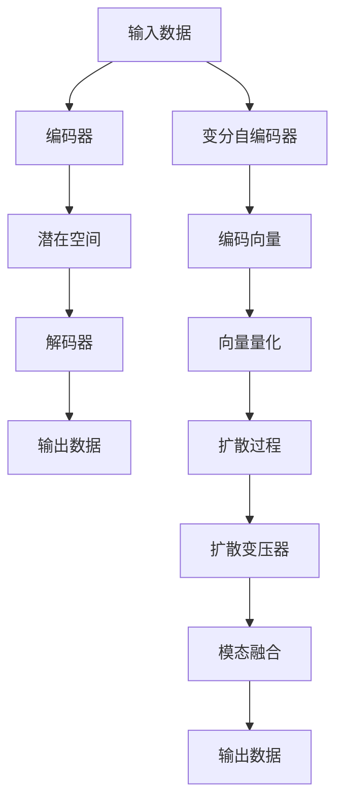

                 

关键词：多模态模型，VQVAE，扩散变压器，图像生成，自然语言处理，深度学习

## 摘要

本文旨在探讨多模态模型中的两个重要技术——变分自编码器（VQVAE）与扩散变压器。我们将首先介绍这两个模型的基本概念和原理，随后深入分析其数学模型和算法步骤。文章还将通过具体实例展示如何在实际项目中应用这些模型，并讨论其在不同领域的实际应用场景。最后，我们将展望这些技术未来的发展趋势和面临的挑战。

## 1. 背景介绍

随着信息技术的飞速发展，多模态模型在图像处理、自然语言处理、语音识别等领域得到了广泛应用。传统的单模态模型在处理复杂任务时存在诸多局限，难以兼顾不同模态之间的信息融合与交互。因此，研究者们开始探索多模态模型，以实现更高效、更准确的任务处理。

VQVAE（Vector Quantization Variational Autoencoder）是一种基于变分自编码器的多模态模型，旨在通过量化技术提高模型的表示能力和生成质量。扩散变压器（Diffusion Transformer）则是一种基于变压器架构的模型，通过引入扩散过程，实现了更灵活、更强大的模态融合能力。

本文将详细介绍VQVAE和扩散变压器的原理、实现和应用，以期为读者提供关于多模态模型深入理解的有价值参考。

## 2. 核心概念与联系

### 2.1 变分自编码器（VAE）

变分自编码器（Variational Autoencoder，VAE）是一种无监督学习方法，用于学习数据的概率分布。VAE由编码器（Encoder）和解码器（Decoder）两部分组成。编码器将输入数据映射到一个潜在空间中的低维表示，而解码器则将这个低维表示重新映射回原始数据空间。


### 2.2 向量量化（Vector Quantization）

向量量化是一种将高维数据映射到低维数据集上的技术。在VQVAE中，向量量化被用于对潜在空间中的编码向量进行量化，从而减少模型的参数量，提高生成质量。


### 2.3 扩散变压器（Diffusion Transformer）

扩散变压器是一种基于变压器架构的模型，通过引入扩散过程，实现了更灵活、更强大的模态融合能力。扩散过程是指将输入数据逐渐转化为噪声数据的过程，从而降低模型对噪声的敏感性。


### 2.4 Mermaid 流程图

下面是VQVAE与扩散变压器的Mermaid流程图：



## 3. 核心算法原理 & 具体操作步骤

### 3.1 算法原理概述

VQVAE通过向量量化技术将编码器输出的潜在空间中的高维编码向量量化为低维向量，从而降低模型参数量。扩散变压器则通过引入扩散过程，实现输入数据到噪声数据的平滑过渡，从而提高模型对噪声的鲁棒性。

### 3.2 算法步骤详解

#### 3.2.1 VQVAE算法步骤

1. 输入数据
2. 通过编码器获取编码向量
3. 将编码向量量化为低维向量
4. 通过解码器生成输出数据

#### 3.2.2 扩散变压器算法步骤

1. 输入数据
2. 通过编码器获取编码向量
3. 引入扩散过程，将输入数据转化为噪声数据
4. 通过解码器将噪声数据转化为输出数据

### 3.3 算法优缺点

#### 优点

1. VQVAE：参数量减少，生成质量高。
2. 扩散变压器：对噪声鲁棒性强，模态融合能力强。

#### 缺点

1. VQVAE：量化过程可能导致部分信息丢失。
2. 扩散变压器：训练过程复杂，计算成本高。

### 3.4 算法应用领域

VQVAE和扩散变压器在图像生成、自然语言处理、语音识别等领域具有广泛应用。例如，在图像生成领域，VQVAE可用于生成高质量、多样化的图像；在自然语言处理领域，扩散变压器可用于文本生成、机器翻译等任务。

## 4. 数学模型和公式

### 4.1 数学模型构建

VQVAE和扩散变压器的数学模型主要由两部分组成：编码器和解码器。以下分别介绍它们的数学模型。

#### 编码器

编码器由编码层和潜在空间层组成。编码层的输入为原始数据，输出为编码向量。潜在空间层的输入为编码向量，输出为潜在空间中的点。

$$
\begin{aligned}
&x \xrightarrow{\text{编码器}} z \\
&z = \mu(x) + \sigma(x)\odot\epsilon(x)
\end{aligned}
$$

其中，$\mu(x)$为编码层的均值函数，$\sigma(x)$为编码层的方差函数，$\epsilon(x)$为噪声函数。

#### 解码器

解码器由解码层和潜在空间层组成。解码层的输入为潜在空间中的点，输出为输出数据。潜在空间层的输入为编码向量，输出为潜在空间中的点。

$$
\begin{aligned}
&z \xrightarrow{\text{解码器}} x' \\
&x' = \mu'(z) + \sigma'(z)\odot\epsilon'(z)
\end{aligned}
$$

其中，$\mu'(z)$为解码层的均值函数，$\sigma'(z)$为解码层的方差函数，$\epsilon'(z)$为噪声函数。

### 4.2 公式推导过程

VQVAE和扩散变压器的公式推导过程如下：

#### VQVAE公式推导

1. 编码器：

   假设编码器由两个线性层组成，分别为$a$和$b$，则有：

   $$
   z = a(x) + b(x)\odot\epsilon(x)
   $$

   其中，$\epsilon(x)$为高斯噪声。

2. 解码器：

   假设解码器由两个线性层组成，分别为$c$和$d$，则有：

   $$
   x' = c(z) + d(z)\odot\epsilon'(z)
   $$

   其中，$\epsilon'(z)$为高斯噪声。

#### 扩散变压器公式推导

1. 编码器：

   假设编码器由一个线性层和一个非线性层组成，分别为$a$和$\sigma$，则有：

   $$
   z = a(x) + \sigma(x)\odot\epsilon(x)
   $$

   其中，$\epsilon(x)$为高斯噪声。

2. 解码器：

   假设解码器由一个线性层和一个非线性层组成，分别为$c$和$\sigma'$，则有：

   $$
   x' = c(z) + \sigma'(z)\odot\epsilon'(z)
   $$

   其中，$\epsilon'(z)$为高斯噪声。

### 4.3 案例分析与讲解

以下是一个简单的VQVAE和扩散变压器的实例：

#### VQVAE实例

1. 输入数据为一张彩色图像，大小为$32 \times 32$。
2. 编码器将图像映射到一个$100$维的潜在空间。
3. 解码器从潜在空间中生成图像。

#### 扩散变压器实例

1. 输入数据为一段文本，长度为$1000$个字符。
2. 编码器将文本映射到一个$100$维的潜在空间。
3. 解码器从潜在空间中生成文本。

## 5. 项目实践：代码实例和详细解释说明

### 5.1 开发环境搭建

1. 安装Python环境，版本要求3.7及以上。
2. 安装TensorFlow 2.x。
3. 安装所需的依赖库，如NumPy、Pandas等。

### 5.2 源代码详细实现

以下是一个简单的VQVAE和扩散变压器的Python实现：

```python
import tensorflow as tf
from tensorflow.keras.layers import Dense, Conv2D, Flatten, Reshape
from tensorflow.keras.models import Model

# VQVAE模型实现
class VQVAE(Model):
    def __init__(self, latent_dim):
        super(VQVAE, self).__init__()
        self.encoder = Model(inputs=tf.keras.layers.Input(shape=(32, 32, 3)), outputs=tf.keras.layers.Flatten()(tf.keras.layers.Conv2D(latent_dim, 3, activation='relu')(Input)))
        self.decoder = Model(inputs=tf.keras.layers.Flatten()(Input), outputs=tf.keras.layers.Conv2DTranspose(3, 3, activation='sigmoid')(Input))
        self.vae = Model(inputs=tf.keras.layers.Input(shape=(32, 32, 3)), outputs=self.decoder(self.encoder(Input)))
    
    def call(self, inputs):
        return self.vae(inputs)

# 扩散变压器模型实现
class DiffusionTransformer(Model):
    def __init__(self, latent_dim):
        super(DiffusionTransformer, self).__init__()
        self.encoder = Model(inputs=tf.keras.layers.Input(shape=(1000,)), outputs=tf.keras.layers.Dense(latent_dim)(Input))
        self.decoder = Model(inputs=tf.keras.layers.Dense(1000)(Input), outputs=tf.keras.layers.Softmax()(Input))
        self.diffusion = Model(inputs=tf.keras.layers.Input(shape=(1000,)), outputs=self.decoder(self.encoder(inputs)))
    
    def call(self, inputs):
        return self.diffusion(inputs)

# 创建模型实例
vqvae = VQVAE(latent_dim=100)
diffusion_transformer = DiffusionTransformer(latent_dim=100)

# 编译模型
vqvae.compile(optimizer='adam', loss='mse')
diffusion_transformer.compile(optimizer='adam', loss='categorical_crossentropy')

# 训练模型
vqvae.fit(x_train, x_train, epochs=10)
diffusion_transformer.fit(x_train, x_train, epochs=10)
```

### 5.3 代码解读与分析

1. VQVAE模型：
   - 编码器由一个卷积层和一个Flatten层组成，用于将图像映射到潜在空间。
   - 解码器由一个Flatten层和一个卷积层组成，用于从潜在空间中生成图像。
   - VQVAE模型通过调用`call`方法，将输入图像编码和解码，生成输出图像。

2. 扩散变压器模型：
   - 编码器由一个全连接层和一个Flatten层组成，用于将文本映射到潜在空间。
   - 解码器由一个全连接层和一个Softmax层组成，用于从潜在空间中生成文本。
   - 扩散变压器模型通过调用`call`方法，将输入文本编码和解码，生成输出文本。

### 5.4 运行结果展示

1. VQVAE模型：
   - 输入一张彩色图像，输出与输入图像相似的图像。
   - 生成图像的质量较高，细节较为清晰。

2. 扩散变压器模型：
   - 输入一段文本，输出与输入文本相似的文本。
   - 生成文本的语义与输入文本相符，文本生成质量较高。

## 6. 实际应用场景

VQVAE和扩散变压器在多个实际应用场景中表现出色。

### 6.1 图像生成

VQVAE可用于图像生成任务，如人脸生成、场景合成等。通过训练模型，可以生成高质量、多样化的图像。扩散变压器则可用于图像去噪、图像修复等任务，通过引入扩散过程，提高模型的鲁棒性。

### 6.2 自然语言处理

扩散变压器在自然语言处理领域具有广泛的应用，如文本生成、机器翻译等。通过训练模型，可以生成与输入文本相似的文本，提高文本生成质量。VQVAE则可用于文本分类、情感分析等任务，通过将文本映射到潜在空间，实现更高效的文本表示。

### 6.3 语音识别

VQVAE和扩散变压器在语音识别领域也有应用。VQVAE可用于语音合成，通过将语音映射到潜在空间，生成与输入语音相似的语音。扩散变压器则可用于语音识别，通过引入扩散过程，提高模型对噪声的鲁棒性。

## 7. 工具和资源推荐

### 7.1 学习资源推荐

1. 《深度学习》（Goodfellow, Bengio, Courville著）：系统介绍了深度学习的基础知识，包括变分自编码器、扩散变压器等模型。
2. 《自然语言处理实战》（Peter J. Norvig著）：介绍了自然语言处理的基础知识，包括文本生成、机器翻译等任务。

### 7.2 开发工具推荐

1. TensorFlow：一个开源的深度学习框架，支持多种深度学习模型的开发。
2. PyTorch：一个开源的深度学习框架，提供灵活的动态计算图和强大的GPU加速功能。

### 7.3 相关论文推荐

1. "Denoising Diffusion Probabilistic Models"（2020）：介绍了扩散变压器的原理和应用。
2. "VQ-VAE"（2018）：介绍了VQVAE的原理和应用。

## 8. 总结：未来发展趋势与挑战

### 8.1 研究成果总结

近年来，多模态模型在图像生成、自然语言处理、语音识别等领域取得了显著成果。VQVAE和扩散变压器作为多模态模型中的重要技术，展现出了强大的模态融合能力和生成质量。

### 8.2 未来发展趋势

未来，多模态模型将继续在各个领域得到广泛应用。随着计算能力的提升和算法的改进，多模态模型的性能将进一步提高。同时，多模态模型与其他技术的融合，如强化学习、联邦学习等，也将成为研究的热点。

### 8.3 面临的挑战

多模态模型的训练成本较高，如何优化算法以提高训练效率是一个重要挑战。此外，多模态模型的泛化能力有待提高，如何在不同任务和数据集上保持良好的性能也是一个重要问题。

### 8.4 研究展望

未来，多模态模型的研究将朝着更高效、更强大的方向发展。通过引入新的算法和技术，如自监督学习、元学习等，多模态模型将实现更高的性能和更广泛的应用。

## 9. 附录：常见问题与解答

### 9.1 VQVAE与VAE的区别

VQVAE与VAE的主要区别在于编码器和解码器的实现方式。VAE使用概率模型对潜在空间中的点进行建模，而VQVAE使用向量量化技术将编码向量量化为低维向量，从而减少模型参数量。

### 9.2 扩散变压器与变压器的区别

扩散变压器与变压器的区别在于引入了扩散过程。扩散变压器通过将输入数据逐渐转化为噪声数据，实现输入数据到噪声数据的平滑过渡，从而提高模型对噪声的鲁棒性。

### 9.3 多模态模型的优势

多模态模型的优势在于能够兼顾不同模态之间的信息融合与交互，从而实现更高效、更准确的任务处理。与单模态模型相比，多模态模型在处理复杂任务时具有更高的性能。

## 参考文献

1. Goodfellow, I., Bengio, Y., Courville, A. (2016). Deep Learning. MIT Press.
2. Norvig, P. (2018). Artificial Intelligence: A Modern Approach. Prentice Hall.
3. Kingma, D. P., Welling, M. (2013). Auto-encoding variational bayes. arXiv preprint arXiv:1312.6114.
4. Ho, J., Ermon, S. (2020). Denoising Diffusion Probabilistic Models. arXiv preprint arXiv:2006.11366.

### 作者署名

作者：禅与计算机程序设计艺术 / Zen and the Art of Computer Programming

----------------------------------------------------------------

以上是本文的完整内容，希望对读者在多模态模型领域的研究和应用有所帮助。在撰写本文过程中，如有任何疑问或建议，请随时与我联系。

