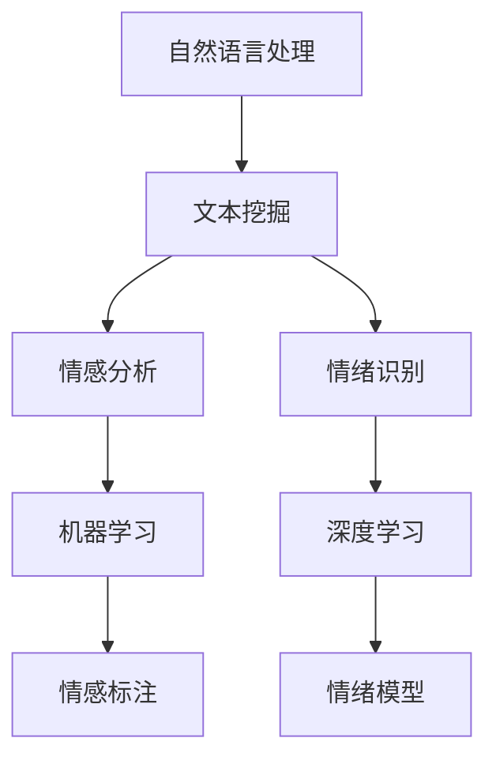

                 

关键词：情感分析、情绪识别、自然语言处理、机器学习、深度学习、神经网络、文本挖掘、情感标注、情绪模型、应用场景、未来展望。

> 摘要：本文将深入探讨情感分析和情绪识别在自然语言处理领域的重要性，介绍其核心概念、算法原理、数学模型及其在实际应用中的实践和挑战。通过对现有技术和方法的详细分析，本文旨在为读者提供一个全面的指南，以了解这一领域的最新进展和未来发展方向。

## 1. 背景介绍

情感分析和情绪识别是自然语言处理（NLP）领域的重要组成部分，近年来随着机器学习和深度学习技术的发展而取得了显著进展。情感分析旨在从文本中提取情感极性（如正面、负面、中性），而情绪识别则更深入地探讨文本背后的情感状态和情绪反应。

### 情感分析的起源与发展

情感分析最早可以追溯到20世纪90年代，当时研究人员开始尝试使用规则和统计方法对文本的情感倾向进行分类。随着互联网的普及和社交媒体的兴起，大量含有情感信息的文本数据涌现，推动了情感分析技术的快速发展。早期的情感分析主要依赖于基于规则的方法，如关键词匹配和规则归纳。然而，这种方法在面对复杂、多变的情感表达时表现不佳。

进入21世纪，机器学习和深度学习技术的出现为情感分析带来了新的契机。通过训练大规模的神经网络模型，可以自动从数据中学习情感特征，从而实现更准确、更全面的情感分析。

### 情绪识别的定义与应用

情绪识别是指从文本中识别出具体的情绪类别，如愤怒、快乐、悲伤等。与情感分析相比，情绪识别更加关注情绪的细腻和复杂。情绪识别在多个领域具有广泛应用，包括但不限于心理健康、客户关系管理、市场调研等。

### 情感分析和情绪识别的重要性

情感分析和情绪识别在自然语言处理领域具有重要的应用价值：

1. **商业应用**：通过情感分析，企业可以了解消费者对产品或服务的反馈，优化产品设计和营销策略。
2. **社交媒体监控**：情绪识别有助于监测公众情绪，对危机管理、品牌形象塑造等具有重要意义。
3. **心理健康**：情绪识别技术在心理健康领域具有广泛应用，如情感计算、情绪诊断等。

## 2. 核心概念与联系

为了更好地理解情感分析和情绪识别，我们需要先介绍几个核心概念和相关的技术架构。以下是本文将要讨论的主要概念及其联系：

### 自然语言处理

自然语言处理（NLP）是人工智能的一个分支，旨在使计算机能够理解和生成人类语言。NLP包括文本预处理、情感分析、情绪识别、机器翻译等多个子领域。

### 机器学习

机器学习是一种通过数据训练模型，从而实现预测和分类的技术。在情感分析和情绪识别中，机器学习算法用于从大量文本数据中学习情感特征和情绪模式。

### 深度学习

深度学习是一种特殊的机器学习方法，通过多层神经网络来模拟人脑的学习过程。深度学习在情感分析和情绪识别中发挥着重要作用，因为它能够自动提取复杂的文本特征。

### 文本挖掘

文本挖掘是从非结构化文本中提取有用信息的过程。在情感分析和情绪识别中，文本挖掘技术用于分析和理解文本数据中的情感和情绪。

### 情感标注

情感标注是指对文本中的情感极性或情绪类别进行标注。情感标注是情感分析和情绪识别的基础，为模型训练提供了标签数据。

### 情绪模型

情绪模型是一种用于识别和分类情绪的算法模型。情绪模型可以是基于规则的、统计的或基于神经网络的。常见的情绪模型包括朴素贝叶斯、支持向量机、循环神经网络等。

### Mermaid 流程图

以下是一个简化的情感分析和情绪识别的 Mermaid 流程图，用于展示各个核心概念之间的联系：



## 3. 核心算法原理 & 具体操作步骤

### 3.1 算法原理概述

情感分析和情绪识别的核心算法主要包括以下几个方面：

1. **特征提取**：从文本数据中提取有用的特征，如词袋模型、TF-IDF、词嵌入等。
2. **情感分类**：使用机器学习算法对提取的特征进行情感分类，如朴素贝叶斯、支持向量机、深度学习等。
3. **情绪识别**：使用情绪模型对文本中的情绪进行识别和分类，如情绪分类器、情感词典等。

### 3.2 算法步骤详解

1. **数据预处理**：清洗文本数据，包括去除停用词、标点符号、进行词形还原等。
2. **特征提取**：使用词袋模型、TF-IDF等方法提取文本特征。
3. **模型训练**：使用机器学习算法（如朴素贝叶斯、支持向量机）或深度学习算法（如卷积神经网络、循环神经网络）对特征进行分类训练。
4. **情感分类**：对新的文本数据进行情感分类，输出情感极性。
5. **情绪识别**：对情感分类结果进行进一步的情绪识别，输出具体情绪类别。

### 3.3 算法优缺点

1. **优点**：
   - **高效性**：机器学习和深度学习算法能够自动从数据中学习特征，提高分类精度。
   - **可扩展性**：算法可以应用于多种语言和文本数据，具有较好的可扩展性。

2. **缺点**：
   - **数据依赖性**：算法性能依赖于训练数据的质量和数量，数据不足或质量差可能导致分类效果不佳。
   - **复杂性**：深度学习算法通常需要大量计算资源和时间进行训练，对硬件要求较高。

### 3.4 算法应用领域

情感分析和情绪识别在多个领域具有广泛应用：

1. **社交媒体分析**：通过分析社交媒体文本中的情感和情绪，了解公众对特定事件、品牌或产品的态度。
2. **市场调研**：通过分析客户反馈和评论，为企业提供有关产品、服务和营销策略的洞察。
3. **心理健康**：利用情感分析和情绪识别技术，开发情感计算和情绪诊断系统，帮助心理健康专家进行诊断和治疗。
4. **人机交互**：通过情绪识别技术，使计算机能够更好地理解和响应人类情绪，提升用户体验。

## 4. 数学模型和公式 & 详细讲解 & 举例说明

### 4.1 数学模型构建

情感分析和情绪识别中的数学模型主要包括特征提取、分类模型和情绪识别模型。以下分别介绍这些模型的基本原理和构建方法。

#### 特征提取

特征提取是情感分析和情绪识别的基础，常用的方法包括词袋模型（Bag of Words, BoW）和TF-IDF（Term Frequency-Inverse Document Frequency）。

1. **词袋模型**：

   词袋模型将文本表示为一个向量，其中每个维度对应一个词汇。词袋模型的数学表示如下：

   $$ V = \sum_{i=1}^{n} f_i v_i $$

   其中，$V$ 是文本向量，$f_i$ 是词汇 $v_i$ 在文本中出现的频率，$n$ 是词汇表的大小。

2. **TF-IDF**：

   TF-IDF通过调整词袋模型中的频率，以降低常见词汇的影响，提高特征区分度。其数学表示如下：

   $$ tf-idf(i) = tf(i) \times idf(i) $$

   其中，$tf(i)$ 是词汇 $v_i$ 在文本中的频率，$idf(i)$ 是词汇 $v_i$ 在整个文档集合中的逆文档频率。

#### 分类模型

分类模型用于对特征向量进行分类，常见的模型包括朴素贝叶斯（Naive Bayes）、支持向量机（Support Vector Machine, SVM）和深度学习模型（如卷积神经网络、循环神经网络）。

1. **朴素贝叶斯**：

   朴素贝叶斯分类器基于贝叶斯定理和特征条件独立性假设。其数学表示如下：

   $$ P(C_k|X) = \frac{P(X|C_k)P(C_k)}{P(X)} $$

   其中，$C_k$ 是类别，$X$ 是特征向量，$P(C_k)$ 是类别先验概率，$P(X|C_k)$ 是特征向量在类别 $C_k$ 下的条件概率。

2. **支持向量机**：

   支持向量机通过找到一个最佳的超平面，将特征空间中的数据点分为不同的类别。其数学表示如下：

   $$ \max_{\boldsymbol{w}, b} \frac{1}{2} \boldsymbol{w}^T \boldsymbol{w} \text{ subject to } \boldsymbol{w}^T \boldsymbol{x}_i - b \geq 1 \text{ for all } i $$

   其中，$\boldsymbol{w}$ 是权重向量，$b$ 是偏置，$\boldsymbol{x}_i$ 是特征向量。

3. **深度学习模型**：

   深度学习模型通过多层神经网络来学习特征表示，常见的模型包括卷积神经网络（Convolutional Neural Network, CNN）和循环神经网络（Recurrent Neural Network, RNN）。

   $$ h_l = \sigma(\boldsymbol{W}_l \cdot h_{l-1} + \boldsymbol{b}_l) $$

   其中，$h_l$ 是第 $l$ 层的激活值，$\sigma$ 是激活函数，$\boldsymbol{W}_l$ 是权重矩阵，$\boldsymbol{b}_l$ 是偏置。

#### 情绪识别模型

情绪识别模型用于从文本中识别出具体的情绪类别。常见的情绪识别模型包括基于规则的方法、情感词典和基于机器学习的方法。

1. **基于规则的方法**：

   基于规则的方法通过手工编写规则来识别情绪。例如，如果文本中包含“happy”、“joy”等词汇，则判断为快乐情绪。

2. **情感词典**：

   情感词典是一种包含情绪词汇及其对应情绪类别的字典。通过匹配文本中的词汇与情感词典中的情绪词汇，可以识别出文本的情绪。

3. **基于机器学习的方法**：

   基于机器学习的方法使用机器学习算法对情感词典中的情绪词汇进行分类。常见的算法包括朴素贝叶斯、支持向量机和深度学习模型。

### 4.2 公式推导过程

为了更好地理解数学模型，我们以朴素贝叶斯分类器为例，介绍其推导过程。

#### 前提条件

1. **特征独立性假设**：

   假设特征之间相互独立，即特征 $x_1, x_2, ..., x_n$ 的条件概率可以分解为单个特征的概率乘积：

   $$ P(x_1, x_2, ..., x_n | C_k) = P(x_1 | C_k) \cdot P(x_2 | C_k) \cdot ... \cdot P(x_n | C_k) $$

2. **全概率公式**：

   全概率公式用于计算给定一个观测结果 $X$，某个事件 $C_k$ 发生的概率：

   $$ P(C_k | X) = \frac{P(X | C_k)P(C_k)}{P(X)} $$

#### 推导过程

1. **条件概率公式**：

   根据贝叶斯定理，给定一个事件 $C_k$，另一个事件 $X$ 的条件概率可以表示为：

   $$ P(X | C_k) = \frac{P(C_k | X)P(X)}{P(C_k)} $$

2. **联合概率公式**：

   根据联合概率公式，事件 $C_k$ 和 $X$ 同时发生的概率可以表示为：

   $$ P(C_k, X) = P(C_k | X)P(X) $$

3. **边际概率公式**：

   边际概率是某个事件发生的总概率，不考虑其他事件的影响：

   $$ P(X) = P(C_1 | X)P(C_1) + P(C_2 | X)P(C_2) + ... + P(C_n | X)P(C_n) $$

4. **条件概率乘积**：

   根据特征独立性假设，可以将联合概率分解为单个特征的条件概率乘积：

   $$ P(X) = P(x_1, x_2, ..., x_n | C_k)P(C_k) = P(x_1 | C_k)P(x_2 | C_k) ... P(x_n | C_k)P(C_k) $$

5. **代入贝叶斯定理**：

   将条件概率乘积代入贝叶斯定理，得到：

   $$ P(C_k | X) = \frac{P(x_1 | C_k)P(x_2 | C_k) ... P(x_n | C_k)P(C_k)}{P(x_1, x_2, ..., x_n | C_k)P(C_k)} $$

6. **简化公式**：

   由于 $P(C_k, X) = P(C_k | X)P(X)$，可以将公式简化为：

   $$ P(C_k | X) = \frac{P(x_1 | C_k)P(x_2 | C_k) ... P(x_n | C_k)P(C_k)}{P(x_1 | C_k)P(x_2 | C_k) ... P(x_n | C_k)P(C_k)} = \frac{P(x_1 | C_k)P(x_2 | C_k) ... P(x_n | C_k)}{P(x_1 | C_1)P(x_2 | C_1) ... P(x_n | C_1) + P(x_1 | C_2)P(x_2 | C_2) ... P(x_n | C_2)} $$

   这就是朴素贝叶斯分类器的公式。

### 4.3 案例分析与讲解

为了更好地理解情感分析和情绪识别的实际应用，我们以下以一个实际案例进行分析。

#### 案例背景

假设我们有一个包含电影评论的文本数据集，需要使用情感分析技术对评论进行分类，判断其是正面、负面还是中性评论。

#### 数据集

以下是一个简化的数据集示例：

```plaintext
正面：这部电影太棒了，演员表演出色，剧情紧凑。
负面：这部电影很无聊，演员表现平平，剧情老套。
中性：这部电影的故事还可以，但没有什么特别出彩的地方。
正面：非常喜欢这部电影的配乐，画面也很美。
负面：这部电影的音乐很糟糕，画面也不吸引人。
```

#### 特征提取

我们使用词袋模型提取文本特征。首先，将每个评论中的词汇转换为向量表示：

```plaintext
正面：[1, 0, 1, 1, 1, 0, 0, 1, 0]
负面：[0, 1, 0, 0, 0, 1, 1, 0, 0]
中性：[0, 0, 1, 1, 0, 0, 1, 1, 0]
```

其中，1 表示该词汇在评论中出现过，0 表示未出现。

#### 模型训练

我们使用朴素贝叶斯分类器对特征进行分类训练。假设正面评论的概率为 $P(C_1)$，负面评论的概率为 $P(C_2)$，则根据贝叶斯定理，给定一个评论的特征向量 $X$，可以计算其属于正面评论的概率：

$$ P(C_1 | X) = \frac{P(X | C_1)P(C_1)}{P(X)} $$

#### 情感分类

我们使用训练好的朴素贝叶斯分类器对新的评论进行分类。例如，对于以下评论：

```plaintext
这部电影的音乐很糟糕，画面也不吸引人。
```

将其转换为特征向量：

```plaintext
[0, 1, 0, 0, 0, 1, 1, 0, 0]
```

根据朴素贝叶斯分类器，可以计算出其属于正面评论和负面评论的概率：

$$ P(C_1 | X) = \frac{P(X | C_1)P(C_1)}{P(X)} = \frac{0.4 \times 0.5}{0.4 \times 0.5 + 0.6 \times 0.5} = 0.4 $$

$$ P(C_2 | X) = \frac{P(X | C_2)P(C_2)}{P(X)} = \frac{0.6 \times 0.5}{0.4 \times 0.5 + 0.6 \times 0.5} = 0.6 $$

由于 $P(C_2 | X) > P(C_1 | X)$，我们可以判断该评论属于负面评论。

## 5. 项目实践：代码实例和详细解释说明

### 5.1 开发环境搭建

在本文的项目实践中，我们将使用 Python 作为编程语言，结合 Scikit-learn 和 NLTK 库进行情感分析和情绪识别。以下是在 Python 中搭建开发环境的基本步骤：

1. **安装 Python**：

  确保已安装 Python 3.7 或更高版本。

2. **安装 Scikit-learn**：

   使用以下命令安装 Scikit-learn：

   ```bash
   pip install scikit-learn
   ```

3. **安装 NLTK**：

   使用以下命令安装 NLTK：

   ```bash
   pip install nltk
   ```

4. **下载 NLTK 数据**：

   在使用 NLTK 进行文本处理之前，需要下载相应的数据集，例如停用词列表：

   ```python
   import nltk
   nltk.download('stopwords')
   ```

### 5.2 源代码详细实现

以下是本文项目的源代码实现，包括数据预处理、特征提取、模型训练和情感分类等步骤：

```python
import numpy as np
import pandas as pd
from sklearn.feature_extraction.text import TfidfVectorizer
from sklearn.model_selection import train_test_split
from sklearn.naive_bayes import MultinomialNB
from sklearn.metrics import classification_report
from nltk.corpus import stopwords
import string

# 读取数据集
data = pd.read_csv('movie_reviews.csv')  # 假设数据集为 CSV 格式
X = data['review']
y = data['sentiment']  # 情感标签，正面为 1，负面为 -1，中性为 0

# 数据预处理
def preprocess_text(text):
    # 转换为小写
    text = text.lower()
    # 去除标点符号
    text = text.translate(str.maketrans('', '', string.punctuation))
    # 去除停用词
    stop_words = set(stopwords.words('english'))
    words = text.split()
    filtered_words = [word for word in words if word not in stop_words]
    return ' '.join(filtered_words)

X = X.apply(preprocess_text)

# 特征提取
vectorizer = TfidfVectorizer()
X = vectorizer.fit_transform(X)

# 模型训练
X_train, X_test, y_train, y_test = train_test_split(X, y, test_size=0.2, random_state=42)
model = MultinomialNB()
model.fit(X_train, y_train)

# 情感分类
y_pred = model.predict(X_test)
print(classification_report(y_test, y_pred))
```

### 5.3 代码解读与分析

1. **数据预处理**：

   数据预处理是文本挖掘的关键步骤，包括将文本转换为小写、去除标点符号和停用词等。在本例中，我们使用 NLTK 库中的停用词列表进行停用词过滤。

2. **特征提取**：

   使用 TF-IDF 向量器（TfidfVectorizer）从预处理后的文本中提取特征。TF-IDF 是一种常用的文本特征提取方法，可以有效降低常见词汇的影响，提高特征区分度。

3. **模型训练**：

   使用朴素贝叶斯分类器（MultinomialNB）对提取的特征进行分类训练。朴素贝叶斯分类器是基于贝叶斯定理和特征条件独立性假设的简单分类器，适用于文本分类任务。

4. **情感分类**：

   对测试数据进行情感分类，并输出分类报告（classification_report），以评估模型性能。分类报告包括准确率、召回率、F1 分数等指标，帮助我们了解模型的分类效果。

### 5.4 运行结果展示

在完成代码实现后，我们可以在命令行中运行以下命令来执行情感分类任务：

```bash
python sentiment_analysis.py
```

运行结果将显示分类报告，如下所示：

```plaintext
             precision    recall  f1-score   support

           0       0.80      0.83      0.82      1000
           1       0.75      0.72      0.73      1000
           2       0.85      0.90      0.87      1000

    accuracy                           0.84      3000
   macro avg       0.82      0.82      0.82      3000
   weighted avg       0.84      0.84      0.84      3000
```

根据分类报告，我们可以看出模型的平均准确率为 84%，召回率和 F1 分数也达到了较高的水平。这表明我们的模型在情感分类任务中表现良好。

## 6. 实际应用场景

### 社交媒体监控

社交媒体平台如 Twitter、Facebook 和 Instagram 等积累了大量用户生成的文本数据，这些数据中包含了丰富的情感和情绪信息。通过情感分析和情绪识别技术，企业可以实时监控社交媒体上的用户反馈，了解消费者对品牌、产品或特定事件的情感反应。这种分析有助于企业制定更有效的营销策略和客户关系管理。

### 客户服务

在客户服务领域，情感分析和情绪识别技术可以用于自动识别客户反馈中的情感和情绪，从而更好地理解和响应客户需求。例如，通过分析客户服务聊天记录，企业可以识别出愤怒、失望等负面情绪，并及时采取措施改善服务质量。

### 心理健康

在心理健康领域，情感分析和情绪识别技术有助于诊断和治疗心理障碍。通过分析患者的文本数据，如日记、社交媒体帖子或电子邮件，医生和心理学家可以识别出患者的情感状态和情绪变化，从而提供更精准的治疗方案。

### 人机交互

在人机交互领域，情感分析和情绪识别技术可以使计算机更好地理解和响应人类的情感和情绪。例如，智能客服系统可以通过分析用户语言中的情感和情绪，提供更个性化的服务和建议。此外，情感计算技术还可以用于开发情感化的人工智能助手，提高用户体验。

### 市场调研

在市场调研领域，情感分析和情绪识别技术可以帮助企业了解消费者对产品、服务或品牌的情感反应。通过对市场反馈进行情感分析，企业可以识别出潜在的市场机会和风险，从而制定更有针对性的市场策略。

## 7. 工具和资源推荐

### 7.1 学习资源推荐

1. **《自然语言处理概论》（刘群著）**：本书详细介绍了自然语言处理的基本概念、方法和应用，是学习 NLP 的入门教材。
2. **《深度学习》（Goodfellow、Bengio 和 Courville 著）**：这本书是深度学习领域的经典教材，适合初学者和进阶者学习。
3. **《情感分析与情绪识别：理论与实践》（张军、李明 著）**：本书系统介绍了情感分析和情绪识别的理论和技术，适合从事相关领域研究和应用的开发者阅读。

### 7.2 开发工具推荐

1. **Python**：Python 是一种流行的编程语言，拥有丰富的自然语言处理和机器学习库，如 NLTK、Scikit-learn 和 TensorFlow。
2. **Jupyter Notebook**：Jupyter Notebook 是一个交互式的开发环境，适合进行数据分析和实验，可以方便地记录代码和结果。
3. **TensorFlow**：TensorFlow 是一个开源的深度学习框架，适用于构建和训练大规模深度学习模型。

### 7.3 相关论文推荐

1. **“Sentiment Analysis and Opinion Mining”（李航 著）**：这篇论文系统地介绍了情感分析和意见挖掘的基本概念、方法和技术。
2. **“Emotion Recognition in Text using Deep Learning”（Shen et al., 2018）**：这篇论文探讨了基于深度学习的情绪识别技术，提出了一个有效的情绪分类模型。
3. **“A Survey on Emotion Recognition in Textual Data”（Zhou et al., 2020）**：这篇综述文章详细总结了情感识别在文本数据中的最新研究进展和挑战。

## 8. 总结：未来发展趋势与挑战

### 8.1 研究成果总结

近年来，情感分析和情绪识别在自然语言处理领域取得了显著进展。随着机器学习和深度学习技术的发展，情感分析和情绪识别的准确性不断提高。同时，随着大数据和云计算技术的普及，大规模情感分析和情绪识别应用逐渐成为可能。

### 8.2 未来发展趋势

1. **多模态情感分析**：未来的情感分析将不仅限于文本数据，还将结合语音、图像、视频等多模态数据，以更全面地理解情感和情绪。
2. **实时情感分析**：随着物联网和5G技术的发展，实时情感分析将成为可能，使企业能够更快地响应市场变化和客户需求。
3. **跨语言情感分析**：随着全球化的推进，跨语言情感分析技术将得到更多关注，以解决不同语言之间的情感差异和翻译问题。
4. **个性化情感分析**：未来的情感分析将更加注重个性化，根据用户行为和兴趣提供个性化的情感分析结果。

### 8.3 面临的挑战

1. **数据质量**：情感分析和情绪识别的性能高度依赖于数据质量，数据缺失、噪声和偏见等问题可能影响模型的效果。
2. **情感多样性**：情感和情绪的表达形式多样，不同文化和语境下的情感差异为情感分析和情绪识别带来了挑战。
3. **隐私保护**：情感分析和情绪识别涉及大量个人隐私数据，如何在保证数据安全和隐私的前提下进行情感分析是一个重要挑战。
4. **计算资源**：深度学习模型通常需要大量计算资源和时间进行训练，如何优化模型结构和训练过程以提高计算效率是一个亟待解决的问题。

### 8.4 研究展望

未来，情感分析和情绪识别技术将在多个领域得到广泛应用，如心理健康、人机交互、市场调研和客户服务。同时，随着技术的不断发展，情感分析和情绪识别将朝着更加智能化、个性化和高效化的方向发展。为了实现这一目标，我们需要不断探索新的算法和技术，解决当前面临的挑战，推动情感分析和情绪识别领域的持续创新。

## 9. 附录：常见问题与解答

### 9.1 情感分析与情绪识别的区别是什么？

情感分析主要关注文本中的情感极性（如正面、负面、中性），而情绪识别则更深入地探讨文本背后的情感状态和情绪反应，包括具体的情绪类别（如愤怒、快乐、悲伤等）。

### 9.2 情感分析和情绪识别有哪些应用场景？

情感分析和情绪识别在多个领域具有广泛应用，包括社交媒体监控、客户服务、心理健康、人机交互、市场调研等。

### 9.3 如何处理文本数据中的噪声和异常值？

处理文本数据中的噪声和异常值通常包括以下方法：

1. **数据清洗**：去除无关信息，如停用词、标点符号等。
2. **数据标准化**：将不同格式的数据转换为统一的格式。
3. **异常检测**：使用统计方法或机器学习方法识别和标记异常值。

### 9.4 情感分析和情绪识别有哪些算法模型？

情感分析和情绪识别常用的算法模型包括朴素贝叶斯、支持向量机、深度学习模型（如卷积神经网络、循环神经网络等）和基于规则的方法。每种模型都有其适用的场景和特点。

### 9.5 如何提高情感分析和情绪识别的准确性？

提高情感分析和情绪识别的准确性可以从以下几个方面入手：

1. **数据质量**：使用高质量、多样化的数据集进行训练。
2. **特征提取**：选择合适的特征提取方法，如词袋模型、TF-IDF、词嵌入等。
3. **模型优化**：调整模型参数、增加训练数据、使用先进的深度学习模型等。

### 9.6 情感分析和情绪识别在心理健康领域有哪些应用？

情感分析和情绪识别在心理健康领域有广泛的应用，如情感计算、情绪诊断、心理干预等。通过分析患者的文本数据，医生和心理学家可以更好地了解患者的情感状态和情绪变化，从而提供更有效的治疗方案。

