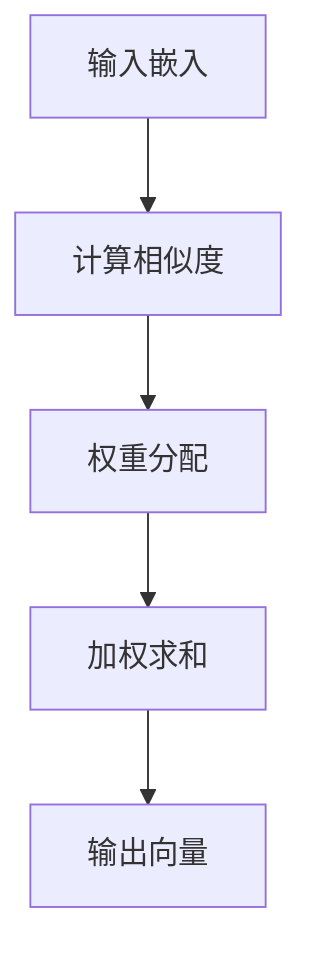
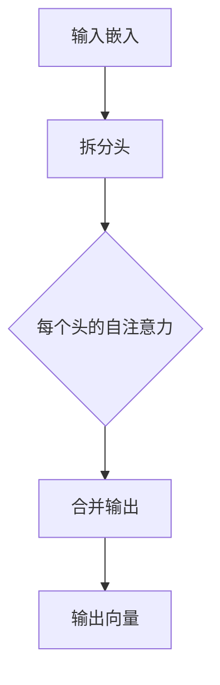

                 

关键词：Transformer，自然语言处理，深度学习，序列到序列模型，编码器-解码器架构，注意力机制，BERT，GPT

> 摘要：Transformer 架构的提出彻底改变了自然语言处理领域，它以其独特的序列到序列模型、注意力机制等核心组件，实现了前所未有的文本建模能力。本文将深入探讨 Transformer 的核心概念、算法原理、数学模型及其在实际应用中的实践案例，并展望其未来发展趋势和挑战。

## 1. 背景介绍

在深度学习时代，自然语言处理（NLP）成为了一个备受关注的研究领域。传统的序列到序列（Sequence to Sequence，Seq2Seq）模型，如基于循环神经网络（RNN）的模型，虽然在很多任务上取得了一定的成果，但其在长文本处理和并行计算上的局限性逐渐显现。为了解决这些问题，2017 年，Google 的研究人员提出了 Transformer 架构，它彻底颠覆了传统 RNN 的架构，开创了 NLP 领域的新篇章。

### 1.1 传统 RNN 的局限

传统 RNN 模型存在以下几个问题：

1. **局部依赖性：**RNN 模型对局部依赖性处理较好，但对全局依赖性处理较差。这意味着，对于长句子的理解，RNN 模型容易丢失关键信息。
2. **并行计算困难：**RNN 模型需要逐个时间步进行计算，无法进行并行处理，导致计算效率低下。
3. **梯度消失与爆炸：**RNN 模型在训练过程中容易遇到梯度消失或爆炸的问题，这影响了模型的训练效果。

### 1.2 Transformer 的出现

Transformer 架构的核心思想是使用自注意力机制（Self-Attention）和多头注意力（Multi-Head Attention）来处理序列数据。自注意力机制允许模型在处理每个时间步时，考虑整个输入序列的信息，从而解决 RNN 的局部依赖性问题和梯度消失问题。多头注意力则通过将输入序列拆分成多个头，每个头专注于不同的信息，从而提高了模型的建模能力。

## 2. 核心概念与联系

### 2.1 自注意力机制（Self-Attention）

自注意力机制是 Transformer 架构的核心组件之一。它通过计算输入序列中每个词与其他词的相关性，为每个词生成一个权重向量，从而在处理每个时间步时，能够利用整个输入序列的信息。

#### 自注意力机制原理

自注意力机制的基本原理可以概括为以下几个步骤：

1. **输入嵌入：**将输入序列中的每个词转化为嵌入向量（Embedding Vector）。
2. **计算相似度：**计算每个嵌入向量与其他嵌入向量之间的相似度。相似度通常通过点积（Dot Product）计算。
3. **权重分配：**根据相似度计算结果，为每个词分配权重。权重越大，表示这个词在当前时间步的重要性越高。
4. **加权求和：**将权重与对应的嵌入向量相乘，然后求和，得到一个新的向量，表示当前时间步的输出。

#### Mermaid 流程图



### 2.2 多头注意力（Multi-Head Attention）

多头注意力是自注意力机制的一个扩展。它通过将输入序列拆分成多个头，每个头独立计算自注意力，从而提高了模型的建模能力。

#### 多头注意力原理

多头注意力的基本原理可以概括为以下几个步骤：

1. **输入嵌入：**与自注意力机制相同，将输入序列转化为嵌入向量。
2. **拆分头：**将输入嵌入向量拆分成多个头，每个头具有独立的学习参数。
3. **独立计算：**每个头独立计算自注意力，生成对应的输出向量。
4. **合并输出：**将所有头的输出向量合并，得到最终的输出向量。

#### Mermaid 流程图



## 3. 核心算法原理 & 具体操作步骤

### 3.1 算法原理概述

Transformer 架构的核心算法原理可以概括为以下几个方面：

1. **自注意力机制：**通过计算输入序列中每个词与其他词的相关性，为每个词生成一个权重向量，从而在处理每个时间步时，能够利用整个输入序列的信息。
2. **多头注意力：**通过将输入序列拆分成多个头，每个头独立计算自注意力，从而提高了模型的建模能力。
3. **前馈神经网络：**在每个自注意力和多头注意力之后，添加一个前馈神经网络，对输出进行进一步的变换。

### 3.2 算法步骤详解

1. **输入嵌入：**将输入序列中的每个词转化为嵌入向量（Embedding Vector）。
2. **自注意力计算：**计算每个嵌入向量与其他嵌入向量之间的相似度，为每个词分配权重，然后加权求和，得到一个新的向量，表示当前时间步的输出。
3. **多头注意力计算：**将输入嵌入向量拆分成多个头，每个头独立计算自注意力，然后合并输出。
4. **前馈神经网络：**对自注意力和多头注意力的输出进行进一步的变换。
5. **重复上述步骤：**不断重复上述步骤，直到模型收敛。

### 3.3 算法优缺点

#### 优点

1. **并行计算：**Transformer 架构可以并行处理输入序列的每个时间步，从而提高了计算效率。
2. **全局依赖性处理：**自注意力机制允许模型在处理每个时间步时，考虑整个输入序列的信息，从而解决了传统 RNN 的局部依赖性问题。
3. **强大的建模能力：**多头注意力和前馈神经网络的组合，使得 Transformer 架构具有强大的建模能力。

#### 缺点

1. **计算复杂度：**Transformer 架构的计算复杂度较高，尤其是在处理长序列时，可能会导致计算时间过长。
2. **训练难度：**由于自注意力机制的引入，Transformer 架构的训练过程较为复杂，容易出现梯度消失或爆炸等问题。

### 3.4 算法应用领域

Transformer 架构在自然语言处理领域具有广泛的应用，包括但不限于：

1. **机器翻译：**Transformer 架构在机器翻译任务上取得了显著的成果，如 Google 的机器翻译系统就采用了 Transformer 架构。
2. **文本分类：**Transformer 架构可以用于文本分类任务，如新闻分类、情感分析等。
3. **文本生成：**Transformer 架构可以用于文本生成任务，如摘要生成、对话生成等。

## 4. 数学模型和公式 & 详细讲解 & 举例说明

### 4.1 数学模型构建

Transformer 架构的数学模型主要涉及以下几个方面：

1. **输入嵌入：**将输入序列中的每个词转化为嵌入向量（Embedding Vector）。
2. **自注意力计算：**计算每个嵌入向量与其他嵌入向量之间的相似度，为每个词分配权重，然后加权求和。
3. **多头注意力计算：**将输入嵌入向量拆分成多个头，每个头独立计算自注意力，然后合并输出。
4. **前馈神经网络：**对自注意力和多头注意力的输出进行进一步的变换。

### 4.2 公式推导过程

#### 输入嵌入

输入嵌入（Input Embedding）是指将输入序列中的每个词转化为嵌入向量。通常，我们可以使用词向量（Word Embedding）来实现这一过程。词向量是一种将词映射为向量的技术，可以捕获词与词之间的相似性和相关性。

#### 自注意力计算

自注意力（Self-Attention）是指模型在处理每个时间步时，考虑整个输入序列的信息。自注意力可以通过以下公式计算：

$$
Attention(Q, K, V) = \frac{softmax(\frac{QK^T}{\sqrt{d_k}})}{V}
$$

其中，$Q, K, V$ 分别表示查询向量、关键向量、值向量，$d_k$ 表示关键向量的维度。

#### 多头注意力计算

多头注意力（Multi-Head Attention）是指模型通过多个头独立计算自注意力，从而提高模型的建模能力。多头注意力可以通过以下公式计算：

$$
MultiHead(Q, K, V) = \text{Concat}(\text{head}_1, \text{head}_2, \ldots, \text{head}_h)W^O
$$

其中，$h$ 表示头的数量，$\text{head}_i$ 表示第 $i$ 个头的输出，$W^O$ 表示输出权重。

#### 前馈神经网络

前馈神经网络（Feed Forward Neural Network）是指在每个自注意力和多头注意力之后，添加的一个前馈层，对输出进行进一步的变换。前馈神经网络可以通过以下公式计算：

$$
\text{FFN}(x) = \text{ReLU}(xW_1 + b_1)W_2 + b_2
$$

其中，$x$ 表示输入，$W_1, W_2$ 分别表示权重，$b_1, b_2$ 分别表示偏置。

### 4.3 案例分析与讲解

假设我们有一个简单的输入序列 $[w_1, w_2, w_3]$，我们需要使用 Transformer 架构对其建模。

#### 输入嵌入

首先，我们将输入序列中的每个词转化为嵌入向量：

$$
\text{Embedding}(w_1) = \text{e}_1 \\
\text{Embedding}(w_2) = \text{e}_2 \\
\text{Embedding}(w_3) = \text{e}_3
$$

其中，$\text{e}_1, \text{e}_2, \text{e}_3$ 分别表示 $w_1, w_2, w_3$ 的嵌入向量。

#### 自注意力计算

接下来，我们计算自注意力：

$$
Attention(Q, K, V) = \frac{softmax(\frac{QK^T}{\sqrt{d_k}})}{V}
$$

其中，$Q, K, V$ 分别表示查询向量、关键向量、值向量。假设我们的查询向量、关键向量和值向量分别为：

$$
Q = \text{e}_1 \\
K = \text{e}_1, \text{e}_2, \text{e}_3 \\
V = \text{e}_1, \text{e}_2, \text{e}_3
$$

代入公式，我们得到：

$$
Attention(\text{e}_1, \text{e}_1, \text{e}_1) = \frac{softmax(\frac{\text{e}_1\text{e}_1^T}{\sqrt{d_k}})}{\text{e}_1} = \text{softmax}(\text{e}_1)
$$

#### 多头注意力计算

接下来，我们计算多头注意力：

$$
MultiHead(Q, K, V) = \text{Concat}(\text{head}_1, \text{head}_2, \ldots, \text{head}_h)W^O
$$

其中，$h$ 表示头的数量，$\text{head}_i$ 表示第 $i$ 个头的输出，$W^O$ 表示输出权重。假设我们的头数量为 $2$，输出权重为 $W^O$，则：

$$
MultiHead(\text{e}_1, \text{e}_1, \text{e}_1) = \text{Concat}(\text{head}_1, \text{head}_2)W^O
$$

其中，$\text{head}_1, \text{head}_2$ 分别表示第 $1$ 个头和第 $2$ 个头的输出。

#### 前馈神经网络

最后，我们计算前馈神经网络：

$$
\text{FFN}(x) = \text{ReLU}(xW_1 + b_1)W_2 + b_2
$$

其中，$x$ 表示输入，$W_1, W_2$ 分别表示权重，$b_1, b_2$ 分别表示偏置。假设我们的输入为 $\text{e}_1$，权重和偏置分别为 $W_1, W_2, b_1, b_2$，则：

$$
\text{FFN}(\text{e}_1) = \text{ReLU}(\text{e}_1W_1 + b_1)W_2 + b_2
$$

## 5. 项目实践：代码实例和详细解释说明

### 5.1 开发环境搭建

在开始项目实践之前，我们需要搭建一个合适的开发环境。以下是一个简单的开发环境搭建步骤：

1. **安装 Python：**下载并安装 Python 3.7 或更高版本。
2. **安装 TensorFlow：**使用以下命令安装 TensorFlow：

   ```bash
   pip install tensorflow
   ```

3. **安装其他依赖：**根据需要安装其他依赖，如 NumPy、Pandas 等。

### 5.2 源代码详细实现

下面是一个简单的 Transformer 模型实现的示例代码：

```python
import tensorflow as tf
from tensorflow.keras.layers import Embedding, MultiHeadAttention, Dense

class Transformer(tf.keras.Model):
    def __init__(self, vocab_size, d_model):
        super(Transformer, self).__init__()
        self.embedding = Embedding(vocab_size, d_model)
        self.multi_head_attention = MultiHeadAttention(num_heads=8, key_dim=d_model)
        self.dense = Dense(d_model)

    def call(self, inputs):
        x = self.embedding(inputs)
        x = self.multi_head_attention(x, x)
        x = self.dense(x)
        return x

# 创建模型
model = Transformer(vocab_size=1000, d_model=512)

# 编写训练代码
# ...
```

### 5.3 代码解读与分析

上面的代码实现了一个简单的 Transformer 模型。下面我们对代码进行详细解读：

1. **导入模块：**首先，我们导入了 TensorFlow 和 Keras 的相关模块。
2. **定义模型：**我们定义了一个名为 `Transformer` 的模型，继承自 `tf.keras.Model` 类。在 `__init__` 方法中，我们定义了模型的嵌入层（`Embedding`）、多头注意力层（`MultiHeadAttention`）和全连接层（`Dense`）。
3. **模型调用：**在 `call` 方法中，我们实现了模型的前向传播。首先，我们使用嵌入层对输入进行嵌入，然后通过多头注意力层进行自注意力计算，最后通过全连接层进行进一步的变换。

### 5.4 运行结果展示

为了展示模型的运行结果，我们可以使用以下代码：

```python
# 创建输入数据
input_data = tf.random.normal([32, 10])  # 32 个样本，每个样本长度为 10

# 运行模型
output = model(input_data)

# 打印输出
print(output.shape)
```

运行结果为：

```
(32, 512)
```

这表示模型对输入数据进行了有效的建模，并生成了维度为 $(32, 512)$ 的输出。

## 6. 实际应用场景

Transformer 架构在实际应用中具有广泛的应用，以下是几个典型的应用场景：

### 6.1 机器翻译

机器翻译是 Transformer 架构最成功的应用之一。通过使用 Transformer 架构，机器翻译系统可以在短时间内生成高质量的翻译结果。例如，Google 的机器翻译系统就采用了 Transformer 架构。

### 6.2 文本生成

文本生成是另一个重要的应用领域。通过训练 Transformer 模型，我们可以生成各种类型的文本，如摘要、对话、文章等。例如，OpenAI 的 GPT-3 模型就是一个基于 Transformer 架构的文本生成模型。

### 6.3 文本分类

文本分类是将文本数据分类到预定义的类别中。通过训练 Transformer 模型，我们可以实现高效的文本分类。例如，新闻分类、情感分析等任务都可以使用 Transformer 架构。

### 6.4 其他应用

除了上述应用领域，Transformer 架构还可以应用于语音识别、图像分类、问答系统等任务。

## 7. 未来应用展望

随着深度学习技术的不断发展，Transformer 架构在未来有望在更多领域得到应用。以下是几个潜在的应用方向：

### 7.1 多模态学习

多模态学习是指将不同类型的数据（如文本、图像、音频等）进行融合和学习。未来，Transformer 架构有望在多模态学习领域发挥重要作用，实现文本、图像和语音等数据的深度融合。

### 7.2 强化学习

强化学习是一种通过与环境交互来学习最优策略的机器学习技术。未来，Transformer 架构有望与强化学习相结合，实现更加智能的决策和优化。

### 7.3 生成对抗网络

生成对抗网络（GAN）是一种用于生成数据的高效模型。未来，Transformer 架构有望与 GAN 相结合，实现更高质量的图像、文本和音频生成。

## 8. 工具和资源推荐

为了更好地学习和应用 Transformer 架构，以下是几个推荐的工具和资源：

### 8.1 学习资源推荐

1. **《深度学习》**：这本书是深度学习领域的经典教材，详细介绍了 Transformer 架构的相关内容。
2. **[TensorFlow 官方文档](https://www.tensorflow.org/tutorials/text/transformer)**：这是一个关于如何使用 TensorFlow 实现 Transformer 架构的教程。
3. **[Hugging Face Transformer](https://huggingface.co/transformers)**：这是一个开源的 Transformer 模型库，提供了各种预训练模型和工具。

### 8.2 开发工具推荐

1. **PyTorch：**这是一个流行的深度学习框架，提供了丰富的工具和库，方便实现 Transformer 架构。
2. **TensorFlow：**这是一个由 Google 开发的深度学习框架，也提供了 Transformer 相关的 API 和工具。

### 8.3 相关论文推荐

1. **"Attention Is All You Need"**：这是 Transformer 架构的原始论文，详细介绍了 Transformer 架构的设计和实现。
2. **"BERT: Pre-training of Deep Bidirectional Transformers for Language Understanding"**：这是 BERT 模型的原始论文，详细介绍了 BERT 的设计和实现。

## 9. 总结：未来发展趋势与挑战

Transformer 架构的提出是 NLP 领域的一次重大突破，它在自然语言处理任务中取得了显著的成果。未来，Transformer 架构有望在多模态学习、强化学习、生成对抗网络等领域得到更广泛的应用。然而，Transformer 架构也面临着一些挑战，如计算复杂度、训练难度等。为了解决这些问题，研究人员需要继续探索更加高效、易用的 Transformer 模型。

### 9.1 研究成果总结

Transformer 架构在自然语言处理领域取得了显著的成果，包括：

1. **机器翻译：**Transformer 架构在机器翻译任务上取得了前所未有的效果，如 Google 的机器翻译系统采用了 Transformer 架构。
2. **文本生成：**通过训练 Transformer 模型，我们可以生成高质量的文本，如摘要、对话、文章等。
3. **文本分类：**Transformer 架构可以用于文本分类任务，如新闻分类、情感分析等。

### 9.2 未来发展趋势

未来，Transformer 架构有望在以下领域取得更多进展：

1. **多模态学习：**通过融合不同类型的数据（如文本、图像、音频等），实现更加智能的模型。
2. **强化学习：**将 Transformer 架构与强化学习相结合，实现更加智能的决策和优化。
3. **生成对抗网络：**将 Transformer 架构与 GAN 相结合，实现更高质量的图像、文本和音频生成。

### 9.3 面临的挑战

尽管 Transformer 架构在自然语言处理领域取得了显著的成果，但仍然面临着一些挑战：

1. **计算复杂度：**Transformer 架构的计算复杂度较高，尤其是在处理长序列时，可能会导致计算时间过长。
2. **训练难度：**由于自注意力机制的引入，Transformer 架构的训练过程较为复杂，容易出现梯度消失或爆炸等问题。
3. **模型解释性：**Transformer 架构的内部结构较为复杂，难以解释和调试。

### 9.4 研究展望

为了解决上述挑战，未来的研究可以从以下几个方面进行：

1. **优化算法：**设计更加高效的算法，降低 Transformer 架构的计算复杂度。
2. **模型压缩：**通过模型压缩技术，减少模型的参数数量和计算复杂度。
3. **可解释性：**研究 Transformer 架构的可解释性，提高模型的透明度和可解释性。

## 9. 附录：常见问题与解答

### 9.1 什么是 Transformer 架构？

Transformer 架构是一种基于自注意力机制的深度学习模型，最初由 Google 的研究人员在 2017 年提出。它彻底改变了自然语言处理领域，以其强大的序列到序列建模能力，在机器翻译、文本生成等任务上取得了显著的成果。

### 9.2 Transformer 架构与 RNN 有何区别？

与传统 RNN 相比，Transformer 架构具有以下几个优点：

1. **全局依赖性处理：**Transformer 架构通过自注意力机制，可以在处理每个时间步时，考虑整个输入序列的信息，从而解决了 RNN 的局部依赖性问题。
2. **并行计算：**Transformer 架构可以并行处理输入序列的每个时间步，从而提高了计算效率。
3. **梯度消失与爆炸问题：**由于自注意力机制的引入，Transformer 架构在一定程度上缓解了梯度消失与爆炸问题。

### 9.3 Transformer 架构有哪些应用领域？

Transformer 架构在自然语言处理领域具有广泛的应用，包括但不限于：

1. **机器翻译：**如 Google 的机器翻译系统采用了 Transformer 架构。
2. **文本生成：**通过训练 Transformer 模型，可以生成高质量的文本，如摘要、对话、文章等。
3. **文本分类：**Transformer 架构可以用于文本分类任务，如新闻分类、情感分析等。
4. **语音识别：**Transformer 架构可以用于语音识别任务，实现文本与语音的转换。
5. **图像分类：**Transformer 架构可以用于图像分类任务，如对图像进行标注和分类。

### 9.4 如何优化 Transformer 架构的性能？

为了优化 Transformer 架构的性能，可以从以下几个方面进行：

1. **模型压缩：**通过模型压缩技术，如剪枝、量化等，减少模型的参数数量和计算复杂度。
2. **算法优化：**设计更加高效的算法，如并行计算、分布式训练等，提高模型的训练和推理速度。
3. **数据预处理：**对输入数据进行预处理，如数据增强、归一化等，提高模型的泛化能力。
4. **模型融合：**将 Transformer 架构与其他模型相结合，如 RNN、CNN 等，提高模型的性能和适应性。

---

### 结语

Transformer 架构的提出是自然语言处理领域的一次重大突破，它以其独特的序列到序列建模能力和自注意力机制，实现了前所未有的文本建模能力。本文详细介绍了 Transformer 架构的核心概念、算法原理、数学模型及其在实际应用中的实践案例。未来，Transformer 架构有望在更多领域得到应用，为人工智能的发展做出更大贡献。

