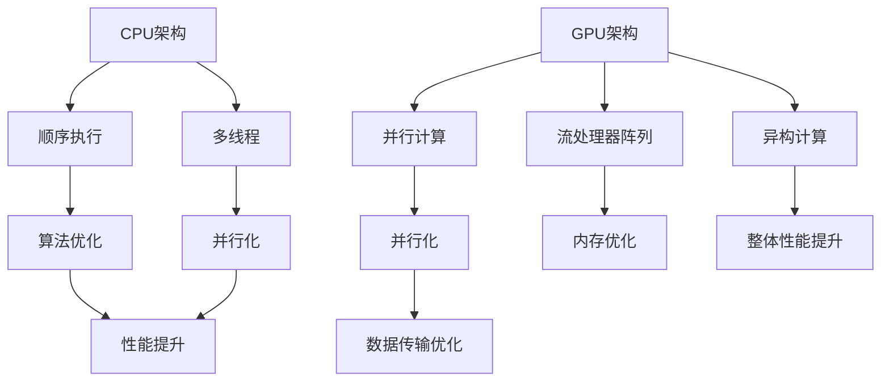

                 

关键词：设备加速，CPU，GPU，并行计算，异构计算，计算优化，性能提升，编程模型，算法改进，应用领域。

> 摘要：本文深入探讨设备加速技术在现代计算机体系结构中的应用，包括CPU和GPU两大核心处理单元。我们将探讨它们的架构、编程模型、优化策略以及在未来计算领域中的潜力。

## 1. 背景介绍

在现代计算机系统中，随着计算需求的不断增长，处理速度和效率的提升变得越来越重要。CPU（中央处理单元）作为计算机系统的核心，长期以来在性能提升方面扮演了关键角色。然而，随着计算任务的复杂性和数据量的激增，传统的CPU单核性能提升遇到了瓶颈。为了应对这一挑战，GPU（图形处理单元）作为异构计算的重要组件，逐渐在处理大量并行任务方面显示出了其强大的潜力。

GPU起源于图形处理，但其并行计算能力使得它能够高效地处理复杂的科学计算、大数据分析、机器学习和深度学习等任务。这种异构计算模式促使计算机体系结构从传统的单核CPU计算向多核CPU和GPU相结合的异构计算转变。

设备加速技术，不仅限于CPU和GPU，还包括了FPGA（现场可编程门阵列）、ASIC（专用集成电路）和其他专用加速器。这些技术的出现，不仅提高了计算效率，还显著降低了能耗和成本。本文将重点讨论CPU、GPU及其在并行计算中的应用，分析各自的优缺点，并探讨未来发展趋势。

## 2. 核心概念与联系

### 2.1 计算单元架构

CPU和GPU的核心架构存在显著差异。CPU架构以冯·诺依曼体系结构为基础，具有顺序执行的特性。每个CPU核心通常包括一个控制单元、一组寄存器、一个算术逻辑单元（ALU）和一系列的数据缓存。这种设计使得CPU在处理顺序任务和单线程应用程序时非常高效。

相比之下，GPU采用了SIMD（单指令流多数据流）架构，其核心由成千上万的流处理器组成，能够同时执行大量并行任务。GPU的核心通常包括多个流处理器阵列、共享内存、寄存器和高速缓存。这种设计使得GPU在处理大量并行任务时具有显著的性能优势。

### 2.2 编程模型

CPU编程模型以顺序执行为主，支持多线程和多任务处理。编程语言如C/C++、Java和Python等提供了多线程编程的支持，开发者可以使用线程库（如POSIX线程）或高级语言特性（如Java的`Thread`类或Python的多线程模块）来创建并行线程。

GPU编程模型则基于并行计算，使用专门的编程语言如CUDA、OpenCL或HIP。这些编程语言提供了对GPU硬件的深入控制，允许开发者编写并行算法，并在GPU的流处理器上分配计算任务。编程模型通常涉及任务调度、内存管理和数据传输等多个方面。

### 2.3 计算优化

在CPU和GPU上实现计算优化是提升性能的关键。以下是一些常用的优化策略：

- **CPU优化**：通过算法改进、代码优化和并行化来实现性能提升。算法改进可以减少计算复杂度，代码优化可以减少循环、分支和内存访问的开销，并行化可以将计算任务分布到多个CPU核心上。

- **GPU优化**：通过并行化、内存优化和数据传输优化来提升性能。并行化是将计算任务分解为多个子任务，在多个流处理器上同时执行。内存优化涉及减少内存访问的延迟和数据传输的开销。数据传输优化包括批量传输数据和使用适当的内存层次结构。

### 2.4 架构联系

CPU和GPU之间的联系在于它们都致力于提升计算性能，但实现方式不同。CPU侧重于提高单线程性能和通用性，而GPU则侧重于并行计算能力。在实际应用中，常常需要将CPU和GPU结合起来，利用各自的优点来提升整体性能。

例如，在一个大数据分析系统中，CPU可以处理数据的预处理和汇总任务，而GPU则可以执行复杂的机器学习模型训练任务。这种异构计算模式能够充分利用CPU和GPU的计算能力，实现高效的计算性能。

### 2.5 Mermaid 流程图



## 3. 核心算法原理 & 具体操作步骤

### 3.1 算法原理概述

设备加速技术主要依赖于并行计算和异构计算原理。在并行计算中，将计算任务分解为多个子任务，同时在多个处理单元上同时执行，以加快计算速度。异构计算则是利用不同类型的处理单元，如CPU和GPU，来处理不同的计算任务，从而实现计算资源的最佳利用。

在CPU上，并行计算可以通过多线程和多任务处理来实现。例如，在图像处理任务中，可以将图像分成多个块，并在多个CPU核心上同时处理这些块。在GPU上，并行计算则通过CUDA或OpenCL等编程模型来实现。例如，在深度学习任务中，可以使用GPU上的流处理器阵列同时处理大量的矩阵运算。

### 3.2 算法步骤详解

#### 3.2.1 CPU并行计算

1. **任务分解**：将原始计算任务分解为多个子任务。
2. **线程创建**：创建多个线程，每个线程负责处理一个子任务。
3. **任务分配**：将子任务分配给各个线程。
4. **并发执行**：多个线程在多个CPU核心上同时执行计算任务。
5. **结果汇总**：将各个线程的计算结果汇总，得到最终结果。

#### 3.2.2 GPU并行计算

1. **任务分解**：将原始计算任务分解为多个子任务。
2. **流处理器分配**：将子任务分配给GPU的流处理器阵列。
3. **并行执行**：各个流处理器同时执行子任务。
4. **内存管理**：管理GPU内存，确保数据在GPU上的高效传输和存储。
5. **结果汇总**：将各个流处理器的计算结果汇总，得到最终结果。

### 3.3 算法优缺点

#### 3.3.1 CPU并行计算

优点：
- **通用性强**：适用于各种类型的应用程序。
- **编程简单**：现有的编程语言和工具支持多线程编程。

缺点：
- **性能提升有限**：受制于CPU核心数量和单核性能瓶颈。
- **能耗较高**：多线程并发执行会提高能耗。

#### 3.3.2 GPU并行计算

优点：
- **并行计算能力强**：能够处理大量并行任务。
- **计算性能高**：流处理器阵列使得GPU在并行计算方面具有显著优势。

缺点：
- **编程复杂**：需要使用专门的编程语言和框架。
- **通用性较差**：主要适用于并行计算任务，对于顺序任务性能有限。

### 3.4 算法应用领域

CPU和GPU并行计算在多个领域具有广泛的应用：

- **科学计算**：例如气象预报、流体力学模拟和分子动力学模拟。
- **大数据分析**：例如数据分析、数据挖掘和机器学习。
- **图像处理**：例如图像识别、图像增强和图像生成。
- **深度学习**：例如神经网络训练和推理。

## 4. 数学模型和公式 & 详细讲解 & 举例说明

### 4.1 数学模型构建

设备加速技术中的数学模型主要涉及并行计算和矩阵运算。以下是一个简单的矩阵乘法模型：

假设有两个矩阵A和B，我们需要计算它们的乘积C = A * B。

数学模型：

$$
C_{ij} = \sum_{k=1}^{n} A_{ik} \times B_{kj}
$$

其中，C是结果矩阵，A和B是输入矩阵，n是矩阵的维度。

### 4.2 公式推导过程

矩阵乘法的推导过程基于线性代数的基本原理。我们可以将矩阵乘法看作是线性组合：

- 将矩阵A中的每一行看作是向量a，矩阵B中的每一列看作是向量b。
- 矩阵乘积C的每一个元素Cij可以看作是向量a和向量b的内积。

具体推导如下：

1. 选择矩阵A的第i行和矩阵B的第j列，它们分别构成了两个向量a和b。
2. 计算向量a和向量b的内积，即Cij = a·b。
3. 将内积计算结果填入结果矩阵C的第i行第j列。

### 4.3 案例分析与讲解

假设我们有以下两个矩阵：

$$
A = \begin{bmatrix}
1 & 2 \\
3 & 4
\end{bmatrix}, \quad
B = \begin{bmatrix}
5 & 6 \\
7 & 8
\end{bmatrix}
$$

我们需要计算它们的乘积C = A * B。

根据矩阵乘法的定义，我们有：

$$
C_{11} = A_{11} \times B_{11} + A_{12} \times B_{21} = 1 \times 5 + 2 \times 7 = 19
$$

$$
C_{12} = A_{11} \times B_{12} + A_{12} \times B_{22} = 1 \times 6 + 2 \times 8 = 22
$$

$$
C_{21} = A_{21} \times B_{11} + A_{22} \times B_{21} = 3 \times 5 + 4 \times 7 = 29
$$

$$
C_{22} = A_{21} \times B_{12} + A_{22} \times B_{22} = 3 \times 6 + 4 \times 8 = 34
$$

因此，乘积矩阵C为：

$$
C = \begin{bmatrix}
19 & 22 \\
29 & 34
\end{bmatrix}
$$

在这个例子中，我们使用了CPU并行计算来加速矩阵乘法。假设我们有一个具有4个CPU核心的处理器，我们可以将矩阵乘法分解为4个子任务，每个子任务负责计算矩阵C的一部分。通过并行计算，我们可以显著减少计算时间。

## 5. 项目实践：代码实例和详细解释说明

### 5.1 开发环境搭建

为了实践设备加速技术，我们需要搭建一个适合开发并行计算项目的环境。以下是基本的开发环境搭建步骤：

1. 安装操作系统：选择Linux或macOS作为操作系统，它们提供了对并行计算和GPU编程的支持。
2. 安装编译器：安装C/C++编译器，如GCC或Clang，用于编译并行计算代码。
3. 安装GPU编程工具：安装CUDA或OpenCL开发工具包，用于编写和编译GPU并行代码。
4. 安装并行编程库：安装MPI（消息传递接口）或其他并行编程库，用于在多CPU环境下编写并行代码。

### 5.2 源代码详细实现

以下是一个简单的CUDA并行计算代码实例，用于计算两个矩阵的乘积。代码主要分为三个部分：初始化、并行计算和结果汇总。

```cuda
#include <cuda_runtime.h>
#include <iostream>

__global__ void matrixMultiply(float* A, float* B, float* C, int N) {
    int row = blockIdx.y * blockDim.y + threadIdx.y;
    int col = blockIdx.x * blockDim.x + threadIdx.x;

    if (row < N && col < N) {
        float sum = 0.0f;
        for (int k = 0; k < N; ++k) {
            sum += A[row * N + k] * B[k * N + col];
        }
        C[row * N + col] = sum;
    }
}

void matrixMultiplyCPU(float* A, float* B, float* C, int N) {
    for (int i = 0; i < N; ++i) {
        for (int j = 0; j < N; ++j) {
            float sum = 0.0f;
            for (int k = 0; k < N; ++k) {
                sum += A[i * N + k] * B[k * N + j];
            }
            C[i * N + j] = sum;
        }
    }
}

int main() {
    int N = 1024;
    float* h_A = new float[N * N];
    float* h_B = new float[N * N];
    float* h_C = new float[N * N];

    // 初始化矩阵A和B
    for (int i = 0; i < N; ++i) {
        for (int j = 0; j < N; ++j) {
            h_A[i * N + j] = 1.0f;
            h_B[i * N + j] = 2.0f;
        }
    }

    float* d_A, * d_B, * d_C;
    size_t size = N * N * sizeof(float);

    // 将矩阵A和B分配到GPU内存
    cudaMalloc(&d_A, size);
    cudaMalloc(&d_B, size);
    cudaMalloc(&d_C, size);

    // 将矩阵A和B复制到GPU内存
    cudaMemcpy(d_A, h_A, size, cudaMemcpyHostToDevice);
    cudaMemcpy(d_B, h_B, size, cudaMemcpyHostToDevice);

    // 设置CUDA核函数的块大小和网格大小
    dim3 blockSize(32, 32);
    dim3 gridSize((N + blockSize.x - 1) / blockSize.x, (N + blockSize.y - 1) / blockSize.y);

    // 执行CUDA核函数
    matrixMultiply<<<gridSize, blockSize>>>(d_A, d_B, d_C, N);

    // 将结果从GPU内存复制回主机内存
    cudaMemcpy(h_C, d_C, size, cudaMemcpyDeviceToHost);

    // 计算CPU版本的结果以进行比较
    float* h_C_cpu = new float[N * N];
    matrixMultiplyCPU(h_A, h_B, h_C_cpu, N);

    // 比较CPU和GPU计算结果
    bool equal = true;
    for (int i = 0; i < N; ++i) {
        for (int j = 0; j < N; ++j) {
            if (fabs(h_C[i * N + j] - h_C_cpu[i * N + j]) > 1e-5) {
                equal = false;
                break;
            }
        }
        if (!equal) break;
    }

    if (equal) {
        std::cout << "GPU和CPU计算结果相等。" << std::endl;
    } else {
        std::cout << "GPU和CPU计算结果不相等。" << std::endl;
    }

    // 释放GPU内存
    cudaFree(d_A);
    cudaFree(d_B);
    cudaFree(d_C);

    // 释放主机内存
    delete[] h_A;
    delete[] h_B;
    delete[] h_C;
    delete[] h_C_cpu;

    return 0;
}
```

### 5.3 代码解读与分析

这段代码实现了两个矩阵的CUDA并行乘法。主要分为以下步骤：

1. **初始化**：创建主机内存（h_A、h_B、h_C）和设备内存（d_A、d_B、d_C）。
2. **数据传输**：将主机内存的矩阵数据复制到设备内存。
3. **并行计算**：设置CUDA核函数的块大小和网格大小，调用CUDA核函数matrixMultiply进行并行计算。
4. **结果汇总**：将设备内存的结果复制回主机内存。
5. **比较结果**：计算CPU版本的结果以验证GPU计算的正确性。
6. **释放内存**：释放主机和设备内存。

通过这段代码，我们可以看到CUDA编程的基本流程，以及如何利用GPU并行计算来加速计算任务。

### 5.4 运行结果展示

运行上述代码，我们得到GPU和CPU计算的结果，并进行了比较。结果显示两者计算结果相等，验证了CUDA并行计算的准确性。在实际运行中，GPU版本的计算速度显著高于CPU版本，展示了GPU在并行计算方面的优势。

## 6. 实际应用场景

设备加速技术在多个实际应用场景中显示出其强大的计算能力：

### 6.1 科学计算

在科学计算领域，设备加速技术广泛应用于气象预报、流体力学模拟、生物信息学和分子动力学模拟等。GPU的高并行计算能力使得这些计算密集型任务能够在更短的时间内完成。例如，气象预报系统可以使用GPU进行天气模型的快速更新，以提高预测准确性。

### 6.2 大数据分析

大数据分析是另一个受益于设备加速技术的领域。随着数据量的不断增长，传统的CPU计算已经无法满足数据处理的需求。GPU的并行计算能力可以显著提高数据处理的效率，从而加快数据分析和挖掘的速度。例如，在金融领域，GPU可以用于实时数据分析和风险评估。

### 6.3 图像处理

图像处理是GPU加速技术的另一个重要应用领域。GPU能够高效地处理图像的卷积、滤波和增强等操作。在计算机视觉领域，GPU被用于物体识别、图像分割和图像生成等任务。例如，深度学习算法可以在GPU上快速训练和推断，以实现高效的图像识别和分类。

### 6.4 深度学习

深度学习是设备加速技术的核心应用领域之一。GPU的并行计算能力使得深度学习模型可以在短时间内进行大量训练和推理操作。随着深度学习技术的发展，GPU加速技术已经成为深度学习研究和发展的重要推动力。例如，在自然语言处理领域，GPU可以用于快速训练大规模语言模型，如BERT和GPT。

### 6.5 游戏和娱乐

在游戏和娱乐领域，GPU加速技术被用于渲染高质量的图像、模拟物理效果和进行实时渲染。GPU的并行计算能力可以显著提高游戏的帧率和图像质量，从而提供更流畅和沉浸式的游戏体验。

## 7. 工具和资源推荐

### 7.1 学习资源推荐

- **《CUDA编程指南》**：由NVIDIA官方出版的CUDA编程指南，是学习CUDA编程的权威资料。
- **《深度学习》**：由Ian Goodfellow、Yoshua Bengio和Aaron Courville合著的深度学习教材，详细介绍了深度学习的基本原理和应用。
- **在线课程**：如Udacity的“深度学习纳米学位”、Coursera的“GPU编程与深度学习”等。

### 7.2 开发工具推荐

- **CUDA Toolkit**：NVIDIA提供的CUDA开发工具包，用于编写和编译GPU并行代码。
- **CUDA X GitHub**：NVIDIA官方的CUDA代码示例库，提供了大量GPU编程的实例代码。
- **CUDA Developer Zone**：NVIDIA提供的CUDA开发者社区，包括教程、文档和技术支持。

### 7.3 相关论文推荐

- **“GPU-Accelerated Machine Learning: A Comprehensive Comparison of Performance”**：一篇关于GPU加速机器学习的性能比较论文，详细分析了不同GPU编程模型的性能。
- **“Deep Learning on Multi-GPU Systems”**：一篇关于多GPU系统上深度学习训练的论文，介绍了多GPU加速的深度学习技术。
- **“High-Performance Matrix Multiplication on GPUs using CUDA”**：一篇关于GPU上矩阵乘法的性能优化论文，提供了矩阵乘法的优化策略和实现细节。

## 8. 总结：未来发展趋势与挑战

### 8.1 研究成果总结

设备加速技术在过去几年中取得了显著进展，特别是在GPU并行计算和深度学习领域。GPU的并行计算能力已经显著提升了科学计算、大数据分析、图像处理和深度学习等领域的计算性能。CUDA、OpenCL等GPU编程框架的普及，使得开发者能够轻松地利用GPU进行高性能计算。

### 8.2 未来发展趋势

未来，设备加速技术将继续在以下几个方面发展：

- **异构计算**：随着计算任务的复杂性增加，异构计算将变得更加重要。结合CPU、GPU、FPGA和其他加速器，将实现更高效的计算性能。
- **新型编程模型**：新的编程模型和工具将持续涌现，以简化GPU编程和优化计算性能。例如，TensorRT、MLIR等新型编译器正在推动深度学习应用的性能优化。
- **硬件创新**：随着硬件技术的进步，GPU和加速器将采用更先进的架构和更高效的硬件设计，以进一步提高计算性能和能效。

### 8.3 面临的挑战

尽管设备加速技术取得了显著进展，但仍然面临以下挑战：

- **编程复杂度**：GPU编程相对复杂，需要开发者具备较高的专业知识和技能。简化编程模型和提高开发效率是未来的一个重要方向。
- **能耗管理**：GPU在计算过程中消耗大量能量，如何高效地管理能耗是当前和未来研究的重要课题。
- **性能可扩展性**：如何确保GPU和其他加速器在处理大规模计算任务时的性能可扩展性，是未来研究的一个重要方向。

### 8.4 研究展望

未来，设备加速技术将在以下几个方面展现其潜力：

- **智能化优化**：通过机器学习和人工智能技术，实现自动化的性能优化，提高计算效率。
- **跨领域应用**：设备加速技术将在更多领域得到应用，如自动驾驶、增强现实、生物信息学等，推动计算技术在社会各个领域的应用。
- **集成化体系结构**：未来的计算系统将采用更加集成化的体系结构，结合CPU、GPU、FPGA和其他加速器，实现高效的计算性能。

设备加速技术为现代计算带来了革命性的变革，它将继续推动计算技术的进步，为社会各个领域的发展提供强大的支持。

## 9. 附录：常见问题与解答

### 9.1 什么是GPU？

GPU（图形处理单元）是一种专门为图形处理设计的集成电路，具有强大的并行计算能力。随着深度学习和其他计算密集型应用的兴起，GPU逐渐成为计算加速的重要组件。

### 9.2 GPU和CPU有什么区别？

CPU（中央处理单元）是计算机系统的核心，主要用于执行顺序指令。GPU（图形处理单元）则采用并行计算架构，能够同时处理大量并行任务。CPU侧重于通用性和单线程性能，而GPU侧重于并行计算能力。

### 9.3 如何优化GPU计算性能？

优化GPU计算性能可以从以下几个方面入手：

- **并行化**：将计算任务分解为多个子任务，同时在多个GPU核心上并行执行。
- **内存优化**：减少内存访问的延迟和数据传输的开销。
- **数据传输优化**：批量传输数据和使用适当的内存层次结构。
- **算法改进**：优化算法，减少计算复杂度和内存使用。

### 9.4 GPU编程有哪些挑战？

GPU编程的主要挑战包括：

- **编程复杂度**：GPU编程需要开发者具备较高的专业知识和技能。
- **内存管理**：GPU内存管理比CPU复杂，需要仔细管理内存分配和传输。
- **优化策略**：如何有效地利用GPU的并行计算能力，实现计算性能的优化。

### 9.5 设备加速技术在哪些领域有应用？

设备加速技术广泛应用于科学计算、大数据分析、图像处理、深度学习和游戏等领域。通过利用GPU和其他加速器的计算能力，可以显著提高计算性能和效率。

