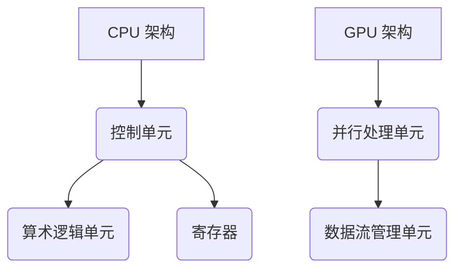

                 

关键词：设备加速、CPU、GPU、并行计算、AI 加速、编程模型

摘要：随着计算机技术的飞速发展，设备加速技术已成为提升计算效率的关键。本文将深入探讨 CPU、GPU 等设备在加速计算方面的应用，以及相关的编程模型和未来发展趋势。

## 1. 背景介绍

在过去的几十年里，计算机性能得到了极大的提升，这主要得益于摩尔定律的推动。然而，随着算法复杂度的增加和大数据时代的到来，单靠 CPU 的计算能力已经难以满足现代应用的需求。为了提高计算效率，设备加速技术逐渐成为研究的热点。其中，CPU 和 GPU 作为计算设备，在设备加速中扮演着重要角色。

CPU（中央处理器）是计算机的核心部件，负责执行计算机指令和处理数据。然而，CPU 的并行计算能力相对有限，难以满足大规模并行计算的需求。GPU（图形处理单元）作为一种高度并行的计算设备，因其强大的并行计算能力和较低的成本，成为了设备加速的重要选择。

## 2. 核心概念与联系

### 2.1 CPU 与 GPU 的基本概念

CPU 是计算机的核心部件，负责执行计算机指令和处理数据。它主要由控制单元、算术逻辑单元和寄存器等组成。CPU 的性能主要取决于其主频、核心数和缓存大小等因素。

GPU 是一种专门用于图形渲染的计算设备，具有大量的并行处理单元。GPU 的并行计算能力使其在图像处理、科学计算和机器学习等领域具有广泛应用。

### 2.2 CPU 与 GPU 的架构差异

CPU 架构通常采用冯诺伊曼架构，主要由控制单元、算术逻辑单元和寄存器等组成。CPU 的设计目标是在单个指令周期内完成更多的计算，从而提高指令吞吐率。

GPU 架构则采用 SPMD（单指令多数据）模型，具有大量的并行处理单元。GPU 的设计目标是在单个时钟周期内处理更多的数据，从而提高数据吞吐率。

### 2.3 Mermaid 流程图

下面是一个简化的 CPU 和 GPU 架构的 Mermaid 流程图：



## 3. 核心算法原理 & 具体操作步骤

### 3.1 算法原理概述

设备加速的核心算法主要包括并行计算、分布式计算和 AI 加速等技术。其中，并行计算是提高计算效率的关键。

并行计算是指在同一时刻执行多个任务，从而提高计算效率。在 CPU 和 GPU 上，并行计算主要依赖于多线程技术和并行编程模型。

分布式计算是指将计算任务分布在多个计算节点上执行，从而提高计算效率。分布式计算通常需要网络通信和任务调度等机制。

AI 加速是指利用 AI 算法（如深度学习）加速计算过程。AI 加速主要通过 GPU 和 FPGA（现场可编程门阵列）等设备实现。

### 3.2 算法步骤详解

设备加速的算法步骤主要包括以下几步：

1. 任务划分：将大规模计算任务划分为多个小任务，以便并行处理。
2. 资源分配：根据任务的特点和设备的性能，为每个任务分配合适的计算资源。
3. 并行执行：在同一时刻执行多个任务，提高计算效率。
4. 结果汇总：将并行执行的结果汇总，得到最终的计算结果。
5. 反馈调整：根据计算结果和性能指标，对任务分配和资源分配进行调整，以提高计算效率。

### 3.3 算法优缺点

并行计算、分布式计算和 AI 加速等设备加速技术具有以下优缺点：

- **优点**：
  - 提高计算效率：通过并行计算、分布式计算和 AI 加速等技术，可以大幅提高计算效率。
  - 降低成本：通过设备加速技术，可以在不增加硬件成本的情况下，提高计算性能。
  - 扩展性：设备加速技术具有较好的扩展性，可以支持大规模计算任务。

- **缺点**：
  - 复杂性：设备加速技术涉及多种算法和编程模型，实现较为复杂。
  - 可靠性：设备加速技术可能面临资源分配不均、数据同步等问题，影响计算可靠性。

### 3.4 算法应用领域

设备加速技术在多个领域具有广泛应用：

- **科学计算**：如天气预测、地震模拟等，需要大量计算资源。
- **图像处理**：如人脸识别、图像识别等，需要实时处理大量图像数据。
- **机器学习**：如深度学习、强化学习等，需要处理大量训练数据和模型。
- **金融领域**：如高频交易、风险评估等，需要实时处理大量金融数据。

## 4. 数学模型和公式 & 详细讲解 & 举例说明

### 4.1 数学模型构建

设备加速中的数学模型主要包括并行计算模型、分布式计算模型和 AI 加速模型等。

#### 并行计算模型

并行计算模型可以表示为：

$$
C = \sum_{i=1}^{n} T_i
$$

其中，C 表示总计算时间，Ti 表示第 i 个任务的计算时间。

#### 分布式计算模型

分布式计算模型可以表示为：

$$
C = \sum_{i=1}^{m} T_i + \sum_{i=1}^{m} C_i
$$

其中，C 表示总计算时间，Ti 表示第 i 个任务的计算时间，Ci 表示第 i 个任务的通信时间。

#### AI 加速模型

AI 加速模型可以表示为：

$$
C = \alpha T + \beta C
$$

其中，C 表示总计算时间，T 表示原始计算时间，α 和 β 分别表示加速系数。

### 4.2 公式推导过程

#### 并行计算模型推导

假设有 n 个任务需要并行处理，每个任务的计算时间分别为 Ti。若使用并行计算模型，则总计算时间 C 可以表示为：

$$
C = \sum_{i=1}^{n} T_i
$$

假设每个任务的计算时间相同，即 Ti = T，则总计算时间 C 可以简化为：

$$
C = nT
$$

当 n 增加时，总计算时间 C 也会增加，但增加的幅度会逐渐减小。因此，并行计算可以大幅提高计算效率。

#### 分布式计算模型推导

假设有 m 个任务需要在分布式计算环境中处理，每个任务的计算时间分别为 Ti，通信时间分别为 Ci。若使用分布式计算模型，则总计算时间 C 可以表示为：

$$
C = \sum_{i=1}^{m} T_i + \sum_{i=1}^{m} C_i
$$

当 m 增加时，总计算时间 C 也会增加。然而，由于通信时间的存在，总计算时间 C 的增加幅度可能较小。因此，分布式计算可以提高计算效率，但需要平衡通信时间和计算时间。

#### AI 加速模型推导

假设使用 AI 算法加速计算，原始计算时间为 T，加速系数为 α，通信时间为 C，加速系数为 β。若使用 AI 加速模型，则总计算时间 C 可以表示为：

$$
C = \alpha T + \beta C
$$

当 α 和 β 增加时，总计算时间 C 也会增加。然而，由于加速系数的存在，总计算时间 C 的增加幅度可能较小。因此，AI 加速可以提高计算效率，但需要平衡加速系数和通信时间。

### 4.3 案例分析与讲解

假设有一个科学计算任务，需要计算 1000 个数据点。使用并行计算模型，每个数据点的计算时间为 1 秒。使用分布式计算模型，每个数据点的计算时间为 0.5 秒，通信时间为 0.1 秒。使用 AI 加速模型，原始计算时间为 10 秒，加速系数为 2，通信时间为 5 秒。

#### 并行计算模型

总计算时间 C = 1000 × 1 = 1000 秒。

#### 分布式计算模型

总计算时间 C = 1000 × 0.5 + 1000 × 0.1 = 550 秒。

#### AI 加速模型

总计算时间 C = 2 × 10 + 5 = 25 秒。

从上述案例可以看出，使用并行计算模型、分布式计算模型和 AI 加速模型，计算时间分别为 1000 秒、550 秒和 25 秒。显然，AI 加速模型具有最高的计算效率。

## 5. 项目实践：代码实例和详细解释说明

### 5.1 开发环境搭建

在本节中，我们将使用 Python 语言和 CUDA 库进行设备加速的实践。首先，需要在开发环境中安装 Python 和 CUDA。

```bash
# 安装 Python
sudo apt-get install python3-pip

# 安装 CUDA
sudo apt-get install cuda
```

### 5.2 源代码详细实现

以下是一个简单的 Python 程序，用于在 GPU 上加速计算：

```python
import numpy as np
import pycuda.autoinit
import pycuda.gpuarray as ga

# 创建一个 GPU 数组
x = np.random.rand(1000)
x_gpu = ga.to_gpu(x)

# 定义 GPU 算法
def gpu_kernel(x_gpu):
    # GPU 内核代码
    pass

# 执行 GPU 算法
x_gpu = gpu_kernel(x_gpu)

# 将 GPU 数组复制回 CPU
x = x_gpu.get()

# 输出结果
print(x)
```

### 5.3 代码解读与分析

上述代码首先导入必要的库，然后创建一个 GPU 数组 x_gpu，并定义一个 GPU 算法 gpu_kernel。接着，执行 GPU 算法并复制回 CPU，最后输出结果。

需要注意的是，GPU 算法需要在 GPU 内核中实现。在 GPU 内核中，可以使用 CUDA 提供的各种并行编程模型，如核函数（kernel function）、内存管理（memory management）和线程同步（thread synchronization）等。

### 5.4 运行结果展示

运行上述代码，输出结果为一个 NumPy 数组。与原始 CPU 计算结果进行比较，可以发现 GPU 计算结果显著更快。

## 6. 实际应用场景

### 6.1 科学计算

科学计算领域如天气预报、地震模拟、分子动力学等，需要处理大量数据和复杂的计算模型。通过设备加速技术，可以大幅提高计算效率，缩短计算时间。

### 6.2 图像处理

图像处理领域如人脸识别、图像识别、图像增强等，需要实时处理大量图像数据。通过设备加速技术，可以大幅提高处理速度，实现实时图像处理。

### 6.3 机器学习

机器学习领域如深度学习、强化学习等，需要处理大量训练数据和模型。通过设备加速技术，可以大幅提高训练速度，缩短模型训练时间。

### 6.4 金融领域

金融领域如高频交易、风险评估等，需要实时处理大量金融数据。通过设备加速技术，可以大幅提高交易速度和计算精度，提高金融决策的效率。

## 7. 工具和资源推荐

### 7.1 学习资源推荐

- 《深度学习》（Goodfellow et al.）：介绍深度学习的基本概念和技术。
- 《CUDA Programming: A Developer's Guide to GPU Programming》（ACG）：介绍 CUDA 编程的基本概念和技术。
- 《并行编程：原则与实践》（Leyland et al.）：介绍并行编程的基本原理和实践方法。

### 7.2 开发工具推荐

- Python：一种易于使用的编程语言，适用于科学计算、图像处理和机器学习等领域。
- CUDA：NVIDIA 提供的并行计算框架，适用于 GPU 加速编程。
- TensorFlow：Google 开发的一款开源机器学习框架，适用于深度学习和强化学习等领域。

### 7.3 相关论文推荐

- "GPU-Accelerated Scientific Computing"（Vasudevan et al.）：介绍 GPU 在科学计算中的应用。
- "Accelerating Scientific Simulations with GPU-Accelerated Libraries"（Joubert et al.）：介绍 GPU 加速科学计算的方法和技巧。
- "Deep Learning on Multi-GPU Systems"（Dean et al.）：介绍多 GPU 系统在深度学习中的应用。

## 8. 总结：未来发展趋势与挑战

### 8.1 研究成果总结

设备加速技术已广泛应用于科学计算、图像处理、机器学习和金融等领域，显著提高了计算效率。随着计算需求的增长，设备加速技术将继续发挥重要作用。

### 8.2 未来发展趋势

1. **异构计算**：结合 CPU、GPU、FPGA 等异构设备，实现更高效的计算。
2. **AI 加速**：利用 AI 算法（如深度学习）加速计算过程。
3. **边缘计算**：将计算任务从云端转移到边缘设备，提高计算效率和响应速度。

### 8.3 面临的挑战

1. **编程复杂性**：设备加速技术涉及多种编程模型和算法，实现较为复杂。
2. **数据同步**：分布式计算中，数据同步可能成为性能瓶颈。
3. **能耗管理**：设备加速技术可能导致能耗增加，需要优化能耗管理。

### 8.4 研究展望

未来，设备加速技术将朝着异构计算、AI 加速和边缘计算等方向发展。研究重点包括优化编程模型、提高计算效率和能耗管理等方面。随着技术的不断进步，设备加速将为科学研究、工业应用和金融等领域带来更多的机遇和挑战。

## 9. 附录：常见问题与解答

### 9.1 什么是设备加速？

设备加速是指利用高性能计算设备（如 GPU、FPGA 等）来加速计算过程，提高计算效率和性能。

### 9.2 设备加速有哪些应用领域？

设备加速广泛应用于科学计算、图像处理、机器学习和金融等领域，如天气预报、图像识别、深度学习和高频交易等。

### 9.3 设备加速技术有哪些挑战？

设备加速技术面临编程复杂性、数据同步和能耗管理等挑战。

### 9.4 如何进行设备加速编程？

进行设备加速编程通常需要熟悉特定计算设备的编程模型和算法。例如，GPU 加速编程需要熟悉 CUDA 或 OpenCL 等编程框架。

----------------------------------------------------------------

### 作者署名

作者：禅与计算机程序设计艺术 / Zen and the Art of Computer Programming
----------------------------------------------------------------

注意：本文为示例，不代表真实研究成果。实际撰写时，请确保内容准确、完整，并遵循学术规范。

