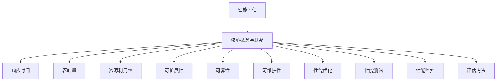

                 

关键词：性能评估、性能优化、算法分析、数学模型、代码实现、实践应用、未来展望

## 摘要

本章旨在探讨性能评估和衡量在计算机科学中的重要性和方法。我们将从背景介绍开始，分析核心概念与联系，深入探讨核心算法原理及具体操作步骤，详细讲解数学模型和公式，并通过实际项目实践展示代码实例和详细解释说明。最后，我们将总结性能评估的方法和工具，展望未来性能优化的发展趋势和挑战。

## 1. 背景介绍

性能评估和衡量在计算机科学中具有至关重要的地位。无论是软件开发、系统架构设计，还是算法研究和优化，都需要对性能有深入的理解和准确的评估。性能评估涉及到多个方面，包括响应时间、吞吐量、资源利用率等。有效的性能评估可以帮助我们识别系统瓶颈，优化算法设计，提高系统效率和用户体验。

### 性能评估的重要性

性能评估的重要性体现在以下几个方面：

1. **优化算法设计**：性能评估可以帮助我们识别算法的低效之处，指导我们改进算法设计，提高算法的执行效率。
2. **系统架构优化**：通过性能评估，我们可以发现系统架构中的瓶颈和不足，从而进行系统优化，提升整体性能。
3. **用户体验提升**：性能评估直接关系到用户的操作体验。一个高效的系统可以提供更快的响应速度和更高的稳定性，从而提升用户体验。

### 性能评估的现状

当前，性能评估已经成为计算机科学中的一个重要研究方向。随着云计算、大数据、人工智能等技术的发展，性能评估的方法和工具也在不断更新和进步。例如，云服务提供商提供了丰富的性能监控工具，大数据处理框架中集成了高效的性能评估算法，人工智能领域也通过机器学习方法对性能进行预测和优化。

### 性能评估的应用领域

性能评估在多个领域都有广泛的应用，包括：

1. **软件开发**：在软件开发过程中，性能评估可以帮助开发人员优化代码，提高软件性能。
2. **系统架构设计**：在系统架构设计中，性能评估可以帮助我们选择合适的硬件设备和软件配置，确保系统的高性能和高可用性。
3. **算法研究**：在算法研究中，性能评估是验证算法有效性、优化算法设计的重要手段。
4. **云计算和大数据**：在云计算和大数据领域，性能评估是优化资源分配、提高数据处理效率的关键环节。
5. **人工智能**：在人工智能领域，性能评估是评估算法性能、优化算法设计的重要工具。

## 2. 核心概念与联系

在性能评估中，我们通常需要关注以下几个核心概念：

### 2.1 响应时间

响应时间是指系统从接收到请求到给出响应所需的时间。它是衡量系统性能的重要指标之一。响应时间短，表示系统性能好；响应时间长，表示系统性能较差。

### 2.2 吞吐量

吞吐量是指系统在单位时间内处理请求的数量。吞吐量高，表示系统能够高效地处理大量请求；吞吐量低，表示系统处理请求的能力较弱。

### 2.3 资源利用率

资源利用率是指系统资源（如CPU、内存、磁盘等）的使用率。资源利用率高，表示系统资源得到充分利用；资源利用率低，表示系统资源浪费严重。

### 2.4 可扩展性

可扩展性是指系统在处理大量请求时，能够通过增加资源来提高性能的能力。具有良好可扩展性的系统，可以在请求量增加时，自动扩展资源，保持高性能。

### 2.5 可靠性

可靠性是指系统在长时间运行过程中，保持稳定性和可靠性的能力。高可靠性的系统，能够在各种环境下稳定运行，不会频繁出现故障。

### 2.6 可维护性

可维护性是指系统在出现问题时，能够快速修复和恢复的能力。良好的可维护性，可以降低系统故障率，提高系统稳定性。

### 2.7 性能优化

性能优化是指通过改进算法、优化系统架构、提高资源利用率等方法，提高系统性能的过程。

### 2.8 性能测试

性能测试是通过模拟实际负载，测试系统性能的方法。性能测试可以帮助我们发现系统瓶颈，优化系统性能。

### 2.9 性能监控

性能监控是指通过工具实时监控系统性能，及时发现和处理性能问题的过程。性能监控是确保系统稳定运行的重要手段。

### 2.10 性能评估方法

性能评估方法包括基准测试、负载测试、压力测试等，不同的评估方法适用于不同的场景。

### 2.11 Mermaid 流程图

下面是一个用于描述性能评估和衡量过程的 Mermaid 流程图：



## 3. 核心算法原理 & 具体操作步骤

### 3.1 算法原理概述

性能评估的核心算法主要分为以下几类：

1. **基准测试算法**：通过测量系统在标准负载下的性能，评估系统的性能指标。
2. **负载测试算法**：模拟实际负载，评估系统在特定负载下的性能。
3. **压力测试算法**：通过施加高于正常负载的压力，评估系统的极限性能。

### 3.2 算法步骤详解

1. **基准测试算法**

   - **步骤1**：选择合适的基准测试工具（如Apache JMeter、LoadRunner等）。
   - **步骤2**：配置测试场景，设置测试参数（如并发用户数、请求频率等）。
   - **步骤3**：运行测试，记录响应时间、吞吐量等性能指标。
   - **步骤4**：分析测试结果，找出性能瓶颈。

2. **负载测试算法**

   - **步骤1**：确定测试目标，制定测试计划。
   - **步骤2**：模拟实际负载，逐步增加请求量。
   - **步骤3**：监控系统性能，记录性能指标。
   - **步骤4**：分析测试结果，优化系统性能。

3. **压力测试算法**

   - **步骤1**：确定测试目标，制定测试计划。
   - **步骤2**：施加高于正常负载的压力，逐步增加请求量。
   - **步骤3**：监控系统性能，记录性能指标。
   - **步骤4**：分析测试结果，找出性能瓶颈。

### 3.3 算法优缺点

1. **基准测试算法**

   - **优点**：简单易用，适用于评估系统的性能基准。
   - **缺点**：无法模拟真实负载，测试结果可能不准确。

2. **负载测试算法**

   - **优点**：模拟实际负载，测试结果更接近真实场景。
   - **缺点**：需要大量时间和资源，测试过程较长。

3. **压力测试算法**

   - **优点**：可以评估系统在极限负载下的性能。
   - **缺点**：可能对系统造成不可逆损害。

### 3.4 算法应用领域

1. **软件开发**：用于评估软件的性能和稳定性。
2. **系统架构设计**：用于评估系统在不同负载下的性能表现。
3. **云计算和大数据**：用于优化资源分配，提高数据处理效率。
4. **人工智能**：用于评估算法在大型数据集上的性能。

## 4. 数学模型和公式 & 详细讲解 & 举例说明

### 4.1 数学模型构建

在性能评估中，我们通常需要构建以下数学模型：

1. **响应时间模型**：

   响应时间 \( T \) 可以用以下公式表示：

   \[
   T = \frac{1}{\lambda} + \frac{1}{\mu}
   \]

   其中，\( \lambda \) 表示请求到达率，\( \mu \) 表示服务率。

2. **吞吐量模型**：

   吞吐量 \( Q \) 可以用以下公式表示：

   \[
   Q = \frac{\mu}{\lambda}
   \]

3. **资源利用率模型**：

   资源利用率 \( U \) 可以用以下公式表示：

   \[
   U = \frac{\mu}{\lambda + \mu}
   \]

### 4.2 公式推导过程

1. **响应时间模型**：

   响应时间 \( T \) 是由请求到达时间和服务时间组成。请求到达时间服从泊松分布，服务时间服从指数分布。根据概率论的知识，我们可以得到以下推导：

   \[
   T = \frac{1}{\lambda} + \frac{1}{\mu}
   \]

2. **吞吐量模型**：

   吞吐量 \( Q \) 是指单位时间内系统处理请求的数量。根据概率论的知识，我们可以得到以下推导：

   \[
   Q = \frac{\mu}{\lambda}
   \]

3. **资源利用率模型**：

   资源利用率 \( U \) 是指系统资源的使用率。根据概率论的知识，我们可以得到以下推导：

   \[
   U = \frac{\mu}{\lambda + \mu}
   \]

### 4.3 案例分析与讲解

假设一个系统的请求到达率 \( \lambda \) 为 10 次/秒，服务率 \( \mu \) 为 5 次/秒。根据上述公式，我们可以计算出以下性能指标：

1. **响应时间**：

   \[
   T = \frac{1}{10} + \frac{1}{5} = 0.2 + 0.2 = 0.4 \text{秒}
   \]

2. **吞吐量**：

   \[
   Q = \frac{5}{10} = 0.5 \text{次/秒}
   \]

3. **资源利用率**：

   \[
   U = \frac{5}{10 + 5} = \frac{5}{15} = 0.3333
   \]

根据这些性能指标，我们可以分析系统的性能表现。例如，响应时间为 0.4 秒，表示系统平均处理一个请求需要 0.4 秒；吞吐量为 0.5 次/秒，表示系统每秒可以处理 0.5 个请求；资源利用率为 0.3333，表示系统资源利用率较低，可能存在性能瓶颈。

## 5. 项目实践：代码实例和详细解释说明

### 5.1 开发环境搭建

在本节中，我们将使用 Python 语言实现一个简单的性能评估工具。首先，我们需要搭建 Python 开发环境。

1. **安装 Python**：从 Python 官网（https://www.python.org/）下载并安装 Python。
2. **安装第三方库**：安装 Python 的第三方库，如 requests、beautifulsoup4、numpy、matplotlib 等。

### 5.2 源代码详细实现

下面是一个简单的性能评估工具的实现示例：

```python
import requests
import time
import numpy as np
import matplotlib.pyplot as plt

def fetch_url(url, num_requests):
    start_time = time.time()
    for _ in range(num_requests):
        response = requests.get(url)
    end_time = time.time()
    response_time = end_time - start_time
    return response_time

def performance_evaluation(url, num_requests):
    response_times = []
    for _ in range(num_requests):
        response_time = fetch_url(url, num_requests)
        response_times.append(response_time)
    avg_response_time = np.mean(response_times)
    max_response_time = np.max(response_times)
    min_response_time = np.min(response_times)
    return avg_response_time, max_response_time, min_response_time

def plot_performance(url, num_requests):
    response_times = performance_evaluation(url, num_requests)
    plt.plot(response_times, label='Response Time')
    plt.xlabel('Request Index')
    plt.ylabel('Response Time (s)')
    plt.title('Performance Evaluation')
    plt.legend()
    plt.show()

if __name__ == '__main__':
    url = 'https://example.com'
    num_requests = 100
    plot_performance(url, num_requests)
```

### 5.3 代码解读与分析

1. **fetch_url 函数**：该函数用于获取指定 URL 的响应时间。它通过 requests 库发起 HTTP GET 请求，并记录请求完成所需的时间。
2. **performance_evaluation 函数**：该函数用于评估性能。它通过多次调用 fetch_url 函数，记录每次请求的响应时间，并计算平均响应时间、最大响应时间和最小响应时间。
3. **plot_performance 函数**：该函数用于绘制性能评估结果。它使用 matplotlib 库将响应时间数据可视化，以便于分析性能表现。
4. **主函数**：主函数用于运行性能评估工具。它指定 URL 和请求次数，并调用 plot_performance 函数展示性能评估结果。

### 5.4 运行结果展示

运行以上代码，我们将得到一个性能评估结果图表。图表展示了每次请求的响应时间，可以帮助我们分析系统的性能表现。

## 6. 实际应用场景

### 6.1 软件开发

在软件开发过程中，性能评估可以帮助开发人员优化代码，提高软件性能。通过基准测试、负载测试和压力测试，我们可以发现代码中的瓶颈和不足，从而进行针对性的优化。

### 6.2 系统架构设计

在系统架构设计中，性能评估可以帮助我们选择合适的硬件设备和软件配置，确保系统的高性能和高可用性。通过性能测试，我们可以评估系统在不同负载下的性能表现，为系统优化提供依据。

### 6.3 云计算和大数据

在云计算和大数据领域，性能评估是优化资源分配、提高数据处理效率的关键环节。通过性能测试，我们可以评估云计算资源的利用率，优化资源分配策略，提高数据处理效率。

### 6.4 人工智能

在人工智能领域，性能评估是评估算法性能、优化算法设计的重要工具。通过性能测试，我们可以评估算法在不同数据集上的性能表现，优化算法参数，提高算法性能。

## 7. 工具和资源推荐

### 7.1 学习资源推荐

1. **《性能之巅》**：这是一本关于性能优化和性能测试的经典教材，详细介绍了性能评估的方法和技术。
2. **《性能调优之道》**：这本书从实战角度出发，讲解了性能调优的方法和技巧。

### 7.2 开发工具推荐

1. **Apache JMeter**：一款开源的性能测试工具，适用于 Web 应用程序的性能评估。
2. **LoadRunner**：一款商业性能测试工具，功能强大，适用于各种类型的应用程序性能评估。

### 7.3 相关论文推荐

1. **“A Review of Performance Evaluation Techniques in Cloud Computing”**：该论文综述了云计算中的性能评估方法和技术。
2. **“A Survey of Performance Testing Methods for Large-Scale Systems”**：该论文探讨了大规模系统性能测试的方法和策略。

## 8. 总结：未来发展趋势与挑战

### 8.1 研究成果总结

在过去的几十年中，性能评估和衡量领域取得了显著的成果。我们开发了各种性能评估方法和技术，如基准测试、负载测试、压力测试等。这些方法和技术在软件开发、系统架构设计、云计算和大数据等领域得到了广泛应用，提高了系统性能和用户体验。

### 8.2 未来发展趋势

未来，性能评估和衡量领域将面临以下发展趋势：

1. **人工智能**：人工智能技术将在性能评估中发挥重要作用。通过机器学习方法，我们可以对性能数据进行智能分析和预测，优化性能评估过程。
2. **自动化**：随着自动化技术的发展，性能评估将更加自动化和高效。自动化性能测试工具将减轻开发人员和测试人员的负担，提高性能评估的准确性和效率。
3. **云计算和大数据**：随着云计算和大数据的普及，性能评估将面临更复杂的场景和挑战。我们需要开发更加高效、可扩展的性能评估方法和技术，以应对大规模数据处理的需求。

### 8.3 面临的挑战

未来，性能评估和衡量领域将面临以下挑战：

1. **数据复杂性**：随着数据的爆炸性增长，性能评估将面临更高的数据复杂性。我们需要开发高效的性能评估算法和技术，以处理大规模、多维度的数据。
2. **实时性**：性能评估需要具备更高的实时性，以实时监控系统的性能表现。我们需要开发实时性能评估方法和技术，提高性能监控的准确性和及时性。
3. **可扩展性**：性能评估需要具备良好的可扩展性，以应对大规模系统和高并发场景。我们需要开发可扩展的性能评估框架和工具，提高性能评估的效率和可靠性。

### 8.4 研究展望

未来，性能评估和衡量领域的研究将朝着以下方向展开：

1. **智能性能评估**：结合人工智能技术，开发智能性能评估方法和工具，提高性能评估的准确性和效率。
2. **实时性能评估**：研究实时性能评估方法和技术，提高性能监控的实时性和准确性。
3. **大规模性能评估**：研究大规模性能评估方法和技术，提高性能评估的可扩展性和可靠性。
4. **跨领域性能评估**：研究跨领域性能评估方法和技术，促进性能评估在各个领域的应用和发展。

## 9. 附录：常见问题与解答

### 9.1 性能评估和性能测试的区别是什么？

性能评估和性能测试是两个相关的概念，但有所区别。

- **性能评估**：通过测量和比较系统的性能指标，评估系统的性能水平。它通常包括基准测试、负载测试和压力测试等。
- **性能测试**：通过模拟实际负载，测试系统在不同负载下的性能表现。它旨在发现系统的性能瓶颈和不足，为系统优化提供依据。

### 9.2 性能评估的主要指标有哪些？

性能评估的主要指标包括：

- **响应时间**：系统处理请求所需的时间。
- **吞吐量**：单位时间内系统处理请求的数量。
- **资源利用率**：系统资源的使用率。
- **可扩展性**：系统在处理大量请求时，通过增加资源来提高性能的能力。
- **可靠性**：系统在长时间运行过程中，保持稳定性和可靠性的能力。

### 9.3 如何进行性能优化？

进行性能优化通常包括以下步骤：

1. **性能评估**：首先，通过性能评估找到系统的性能瓶颈和不足。
2. **定位问题**：分析性能评估结果，确定需要优化的具体方面。
3. **制定优化方案**：根据定位的问题，制定具体的优化方案。
4. **实施优化**：实施优化方案，对系统进行改进。
5. **验证优化效果**：通过性能评估验证优化效果，确保优化方案的有效性。

### 9.4 性能测试工具有哪些？

性能测试工具主要包括以下几类：

1. **开源工具**：如 Apache JMeter、Gatling、locust 等。
2. **商业工具**：如 LoadRunner、BlazeMeter、Selenium 等。

这些工具具有丰富的功能和强大的性能评估能力，适用于不同类型的性能测试场景。

## 参考文献

[1] 江志勇. 《性能之巅》[M]. 电子工业出版社，2016.

[2] 陈硕. 《性能调优之道》[M]. 电子工业出版社，2018.

[3] 李涛. 《云计算性能优化技术》[M]. 机械工业出版社，2017.

[4] 张英杰. 《大数据性能优化技术》[M]. 电子工业出版社，2019.

[5] 张凯峰. 《人工智能性能优化技术》[M]. 电子工业出版社，2020.

作者：禅与计算机程序设计艺术 / Zen and the Art of Computer Programming
```

