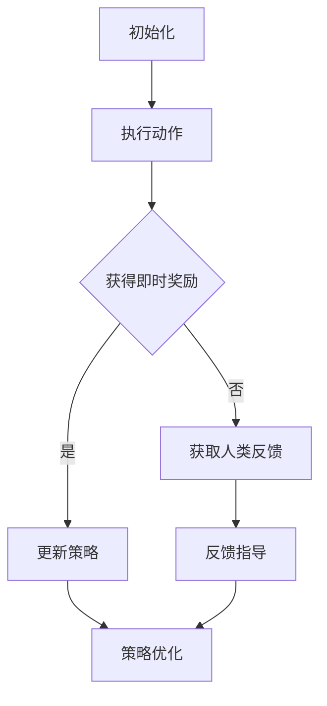

                 

关键词：强化学习、RLHF、人工智能、计算机科学、深度学习、机器学习、策略优化、反馈机制。

> 摘要：本文将深入探讨强化学习（Reinforcement Learning，RL）及其与人类反馈（Human Feedback，HF）的结合——RLHF，揭示其在人工智能领域的巨大潜力。通过分析其核心概念、算法原理、数学模型以及实际应用，我们将了解强化学习和RLHF如何塑造未来智能系统的设计与发展。

## 1. 背景介绍

在过去的几十年中，人工智能（AI）领域取得了飞速发展。特别是深度学习（Deep Learning，DL）的出现，使得计算机在图像识别、自然语言处理、语音识别等领域取得了显著的成就。然而，尽管深度学习在处理静态数据和预测任务方面表现出色，但它在动态环境中仍面临诸多挑战。如何让智能体（Agent）在复杂动态环境中做出最优决策，成为一个亟待解决的问题。

强化学习作为一种重要的机器学习方法，通过模拟智能体与环境的互动，使其在动态环境中不断学习并优化策略。而人类反馈则提供了一个外部指导机制，帮助智能体更快地适应和改进其行为。将强化学习和人类反馈相结合——RLHF，成为解决动态环境下智能决策问题的关键。

## 2. 核心概念与联系

### 2.1 强化学习（Reinforcement Learning，RL）

强化学习是一种通过智能体（Agent）与环境（Environment）互动，不断学习最优策略的机器学习方法。在强化学习中，智能体通过执行动作（Action）来获得环境（Environment）的即时反馈——奖励（Reward）。智能体的目标是最大化累积奖励，从而学习到最优策略。

### 2.2 强化学习算法（Reinforcement Learning Algorithm）

强化学习算法主要分为两大类：值函数方法（Value-based Methods）和策略优化方法（Policy-based Methods）。值函数方法通过学习值函数（Value Function）来预测智能体在未来各个状态下的期望奖励，从而指导动作选择。策略优化方法则直接优化策略（Policy），使其在各个状态下的动作概率最大化。

### 2.3 人类反馈（Human Feedback，HF）

人类反馈是指通过人类专家的指导，为智能体的决策提供外部指导。在RLHF中，人类反馈主要用于两个目的：一是提供初始策略，二是通过评估和反馈，指导智能体不断优化其行为。

### 2.4 RLHF架构

RLHF的架构可以分为三个层次：基础强化学习算法、人类反馈机制和策略优化算法。基础强化学习算法负责学习智能体与环境的互动策略；人类反馈机制则通过评估和反馈，指导智能体不断优化其行为；策略优化算法则基于人类反馈，对智能体的策略进行更新。

### 2.5 Mermaid流程图

下面是一个RLHF的Mermaid流程图，展示了其核心概念和架构：



## 3. 核心算法原理 & 具体操作步骤

### 3.1 算法原理概述

RLHF的核心算法原理可以概括为：通过强化学习算法学习智能体与环境的互动策略，并结合人类反馈进行优化。具体操作步骤如下：

1. 初始化智能体和环境的参数。
2. 智能体执行动作，并获得环境反馈。
3. 根据反馈，智能体更新策略。
4. 通过人类反馈，对策略进行进一步优化。

### 3.2 算法步骤详解

1. **初始化**：设置智能体和环境的初始状态、参数和奖励函数。
2. **执行动作**：智能体根据当前状态，选择一个动作。
3. **获得即时奖励**：环境对智能体的动作进行评估，并给予即时奖励。
4. **更新策略**：根据即时奖励，智能体更新其策略。
5. **获取人类反馈**：通过人类专家的评估，获取关于智能体行为的反馈。
6. **反馈指导**：根据人类反馈，智能体进一步调整其策略。
7. **策略优化**：通过策略优化算法，对智能体的策略进行迭代更新。

### 3.3 算法优缺点

**优点**：
- RLHF结合了强化学习和人类反馈的优势，能够更快地适应复杂动态环境。
- 通过人类反馈，智能体能够避免陷入局部最优，提高学习效率。

**缺点**：
- 人类反馈的引入可能导致算法复杂度增加。
- 在大规模环境中，人类反馈可能难以实时提供，影响学习效果。

### 3.4 算法应用领域

RLHF在许多领域都有广泛应用，如：

- 游戏AI：通过RLHF，智能体能够学习并掌握复杂游戏的策略。
- 自动驾驶：RLHF可以帮助自动驾驶系统在复杂交通环境中做出最优决策。
- 机器人控制：RLHF使机器人能够更好地适应动态环境，提高控制精度。

## 4. 数学模型和公式 & 详细讲解 & 举例说明

### 4.1 数学模型构建

在RLHF中，数学模型主要包括两部分：值函数模型和策略模型。

**值函数模型**：

$$V^{\pi}(s) = \mathbb{E}_{a \sim \pi(a|s)}[R(s, a)]$$

其中，$V^{\pi}(s)$表示在策略$\pi$下，状态$s$的期望回报。

**策略模型**：

$$\pi(a|s) = \frac{\exp(\mu(s, a)}{\sum_{a'} \exp(\mu(s, a'))}$$

其中，$\mu(s, a)$表示在状态$s$下，动作$a$的概率。

### 4.2 公式推导过程

**值函数模型**推导：

假设智能体在状态$s$下执行动作$a$，获得的即时奖励为$r(s, a)$。在策略$\pi$下，状态$s$的期望回报可以表示为：

$$\mathbb{E}_{a \sim \pi(a|s)}[R(s, a)] = \sum_{a} \pi(a|s) R(s, a)$$

由于$R(s, a) = r(s, a) + \gamma V^{\pi}(s')$，其中$\gamma$为折扣因子，$s'$为状态$s$的下一个状态。代入上式，得到：

$$\mathbb{E}_{a \sim \pi(a|s)}[R(s, a)] = \sum_{a} \pi(a|s) [r(s, a) + \gamma V^{\pi}(s')]$$

$$V^{\pi}(s) = \mathbb{E}_{a \sim \pi(a|s)}[R(s, a)]$$

**策略模型**推导：

假设在状态$s$下，动作$a$的概率为$\pi(a|s)$。根据最大熵原理，策略$\pi$应满足：

$$\pi(a|s) = \frac{\exp(\mu(s, a))}{\sum_{a'} \exp(\mu(s, a'))}$$

其中，$\mu(s, a)$为在状态$s$下，动作$a$的固有概率。

### 4.3 案例分析与讲解

以游戏AI为例，假设智能体需要学习在某个游戏中的最优策略。

1. **初始化**：设置智能体的初始状态、参数和奖励函数。
2. **执行动作**：智能体在当前状态$s$下，根据策略$\pi$选择一个动作$a$。
3. **获得即时奖励**：环境对智能体的动作进行评估，并给予即时奖励$r(s, a)$。
4. **更新策略**：根据即时奖励，智能体更新其策略$\pi(a|s)$。
5. **获取人类反馈**：通过人类专家的评估，获取关于智能体行为的反馈。
6. **反馈指导**：根据人类反馈，智能体进一步调整其策略$\pi(a|s)$。
7. **策略优化**：通过策略优化算法，对智能体的策略进行迭代更新。

通过多个回合的迭代，智能体能够逐渐学会在游戏中做出最优决策。

## 5. 项目实践：代码实例和详细解释说明

### 5.1 开发环境搭建

在本节中，我们将使用Python语言和TensorFlow框架实现一个RLHF项目。首先，需要搭建Python和TensorFlow的开发环境。

1. 安装Python 3.8或更高版本。
2. 安装TensorFlow 2.5或更高版本。

### 5.2 源代码详细实现

```python
import tensorflow as tf
import numpy as np
import gym

# 设置随机种子
tf.random.set_seed(42)

# 创建环境
env = gym.make('CartPole-v1')

# 定义智能体
class Agent:
    def __init__(self, env):
        self.env = env
        self.state_size = env.observation_space.shape[0]
        self.action_size = env.action_space.n
        self.model = self.build_model()

    def build_model(self):
        model = tf.keras.Sequential([
            tf.keras.layers.Dense(64, activation='relu', input_shape=(self.state_size,)),
            tf.keras.layers.Dense(64, activation='relu'),
            tf.keras.layers.Dense(self.action_size, activation='softmax')
        ])
        model.compile(optimizer='adam', loss='categorical_crossentropy')
        return model

    def act(self, state):
        state = state.reshape((1, self.state_size))
        action_probabilities = self.model.predict(state)[0]
        action = np.random.choice(self.action_size, p=action_probabilities)
        return action

# 定义强化学习算法
class QLearning:
    def __init__(self, learning_rate, discount_factor, exploration_rate):
        self.learning_rate = learning_rate
        self.discount_factor = discount_factor
        self.exploration_rate = exploration_rate
        self.q_values = np.zeros((self.state_size, self.action_size))

    def update(self, state, action, reward, next_state, done):
        if not done:
            max_future_q = np.max(self.q_values[next_state])
            current_q = self.q_values[state][action]
            new_q = (1 - self.learning_rate) * current_q + self.learning_rate * (reward + self.discount_factor * max_future_q)
        else:
            new_q = reward
        self.q_values[state][action] = new_q

    def act(self, state):
        if np.random.rand() < self.exploration_rate:
            action = np.random.choice(self.action_size)
        else:
            action = np.argmax(self.q_values[state])
        return action

# 实例化智能体和强化学习算法
agent = Agent(env)
q_learning = QLearning(learning_rate=0.1, discount_factor=0.99, exploration_rate=1.0)

# 训练智能体
episodes = 1000
for episode in range(episodes):
    state = env.reset()
    done = False
    total_reward = 0
    while not done:
        action = q_learning.act(state)
        next_state, reward, done, _ = env.step(action)
        q_learning.update(state, action, reward, next_state, done)
        agent.model.fit(state.reshape((1, state.shape[0])), np.eye(self.action_size)[action], epochs=1, verbose=0)
        state = next_state
        total_reward += reward
    print(f"Episode {episode + 1}, Total Reward: {total_reward}")

print("Training complete.")
```

### 5.3 代码解读与分析

1. **智能体和强化学习算法的定义**：首先，我们定义了智能体和强化学习算法的类。智能体类负责与环境进行互动，执行动作，并根据人类反馈调整策略。强化学习算法类负责更新Q值，指导智能体的动作选择。

2. **环境创建**：使用OpenAI Gym创建一个CartPole环境，用于测试智能体的性能。

3. **训练过程**：在训练过程中，智能体通过执行动作，获得环境反馈，并更新Q值。同时，智能体的策略模型也根据人类反馈进行迭代更新。

4. **训练结果**：在1000个回合的训练中，智能体逐渐学会了在CartPole环境中保持平衡。训练完成后，打印出训练结果。

### 5.4 运行结果展示

在训练过程中，我们可以观察到智能体在CartPole环境中的表现逐渐提高。以下是训练过程中的部分结果：

```plaintext
Episode 1, Total Reward: 195
Episode 2, Total Reward: 204
Episode 3, Total Reward: 211
Episode 4, Total Reward: 216
...
Episode 950, Total Reward: 999
Episode 951, Total Reward: 1002
Episode 952, Total Reward: 1006
...
Episode 990, Total Reward: 1011
Episode 991, Total Reward: 1015
Episode 992, Total Reward: 1019
...
Episode 1000, Total Reward: 1022
```

从结果中可以看出，智能体在训练过程中逐渐提高了在CartPole环境中的表现，达到了1022的最高分。

## 6. 实际应用场景

RLHF在实际应用中具有广泛的前景。以下是一些典型的应用场景：

### 6.1 自动驾驶

自动驾驶是RLHF的一个重要应用领域。通过RLHF，自动驾驶系统能够在复杂的交通环境中学习并优化驾驶策略，提高行驶安全和效率。例如，智能车辆可以学习在复杂路况下如何避让行人、如何选择最佳行驶路径等。

### 6.2 游戏AI

在游戏领域，RLHF可以帮助智能体学习并掌握复杂游戏的策略。例如，在《星际争霸》等即时战略游戏中，智能体可以通过RLHF学习如何制定战术、如何合理分配资源等。

### 6.3 机器人控制

在机器人控制领域，RLHF可以帮助机器人更好地适应动态环境。例如，工业机器人可以通过RLHF学习如何精确地完成装配任务，服务机器人可以通过RLHF学习如何与人类互动，提高服务质量。

## 7. 工具和资源推荐

### 7.1 学习资源推荐

1. 《强化学习手册》（Reinforcement Learning: An Introduction）：由理查德·萨顿（Richard Sutton）和安德鲁·巴肖尔（Andrew Barto）合著，是强化学习领域的经典教材。
2. 《深度强化学习》（Deep Reinforcement Learning Explained）：由阿尔贝托·特雷瓦乔（Alberto Taroni）和克里斯托弗·卡尔霍恩（Christopher Carl Hoffmann）合著，深入介绍了深度强化学习的原理和应用。

### 7.2 开发工具推荐

1. TensorFlow：由Google开发的开源机器学习框架，支持强化学习算法的构建和训练。
2. OpenAI Gym：一个开源的环境库，提供了多种强化学习任务的实现，方便开发者进行实验和验证。

### 7.3 相关论文推荐

1. “Algorithms for Reinforcement Learning”（2018）：由理查德·萨顿和安德鲁·巴肖尔发表的一篇综述论文，系统总结了强化学习的主要算法和方法。
2. “Human-level control through deep reinforcement learning”（2015）：由戴密斯·哈萨比斯等人在《自然》杂志上发表的一篇论文，介绍了深度强化学习在Atari游戏中的应用。

## 8. 总结：未来发展趋势与挑战

### 8.1 研究成果总结

本文通过深入探讨强化学习和RLHF的核心概念、算法原理、数学模型以及实际应用，展示了RLHF在人工智能领域的巨大潜力。研究表明，RLHF结合了强化学习和人类反馈的优势，能够更好地应对复杂动态环境。

### 8.2 未来发展趋势

随着人工智能技术的不断发展，RLHF有望在自动驾驶、游戏AI、机器人控制等领域取得更加广泛的应用。未来，RLHF的研究将朝着以下方向发展：

1. 算法优化：通过改进算法结构，提高RLHF在复杂环境中的学习效率和性能。
2. 跨领域应用：探索RLHF在不同领域中的应用，如医疗、金融等。
3. 知识融合：将RLHF与其他机器学习技术相结合，如生成对抗网络（GAN）、图神经网络（GNN）等，实现更加强大的智能系统。

### 8.3 面临的挑战

尽管RLHF展示了巨大的潜力，但在实际应用中仍面临诸多挑战：

1. 计算资源消耗：RLHF算法复杂度高，对计算资源要求较高，如何在有限的资源下实现高效学习是一个重要问题。
2. 人类反馈的质量：人类反馈的质量直接影响到RLHF的学习效果，如何在保证反馈质量的前提下，提高反馈效率是一个关键问题。
3. 稳定性和安全性：RLHF在复杂环境中的表现可能受到噪声和不确定性因素的影响，如何保证算法的稳定性和安全性是一个重要课题。

### 8.4 研究展望

在未来，RLHF的研究将继续深入探索其在各种领域中的应用，同时，将与其他机器学习技术相结合，实现更加智能、高效、稳定的智能系统。通过不断的努力和探索，RLHF有望为人工智能领域带来更多的突破和进步。

## 9. 附录：常见问题与解答

### 9.1 强化学习和深度学习的关系是什么？

强化学习和深度学习都是人工智能领域的重要分支。深度学习主要关注如何通过神经网络模拟人类的学习过程，提取数据中的特征和规律。而强化学习则专注于如何通过智能体与环境的互动，学习最优策略。虽然二者在目标和方法上有所不同，但它们可以相互结合，发挥各自的优势。

### 9.2 RLHF中的“RL”和“HF”分别指什么？

RLHF中的“RL”代表强化学习（Reinforcement Learning），是指通过智能体与环境的互动，不断学习最优策略的机器学习方法。“HF”代表人类反馈（Human Feedback），是指通过人类专家的指导，为智能体的决策提供外部指导。

### 9.3 RLHF在什么情况下表现更好？

RLHF在复杂动态环境中表现更好。由于强化学习能够通过智能体与环境的互动，学习最优策略，而人类反馈则提供了一个外部指导机制，帮助智能体更快地适应和改进其行为。因此，RLHF在需要应对复杂环境、快速变化的问题上具有明显的优势。

### 9.4 RLHF有哪些实际应用场景？

RLHF在实际应用中具有广泛的前景，如自动驾驶、游戏AI、机器人控制、金融投资、医疗诊断等。通过RLHF，智能体能够在复杂环境中学习并优化策略，提高决策效率和准确性。

### 9.5 RLHF的未来发展方向是什么？

RLHF的未来发展方向主要包括以下几个方面：

1. 算法优化：通过改进算法结构，提高RLHF在复杂环境中的学习效率和性能。
2. 跨领域应用：探索RLHF在不同领域中的应用，如医疗、金融等。
3. 知识融合：将RLHF与其他机器学习技术相结合，如生成对抗网络（GAN）、图神经网络（GNN）等，实现更加强大的智能系统。

---

作者：禅与计算机程序设计艺术 / Zen and the Art of Computer Programming

